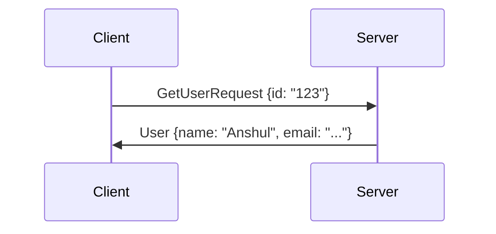
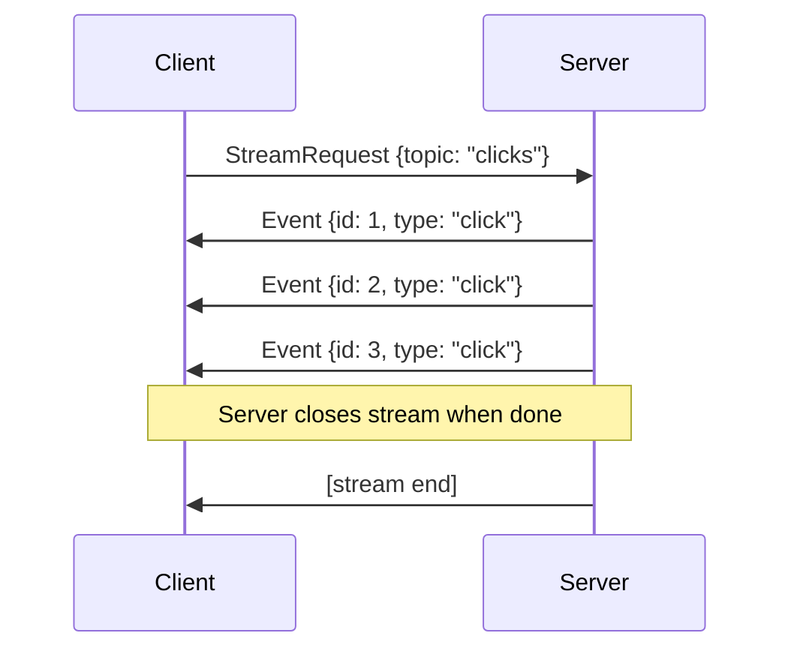
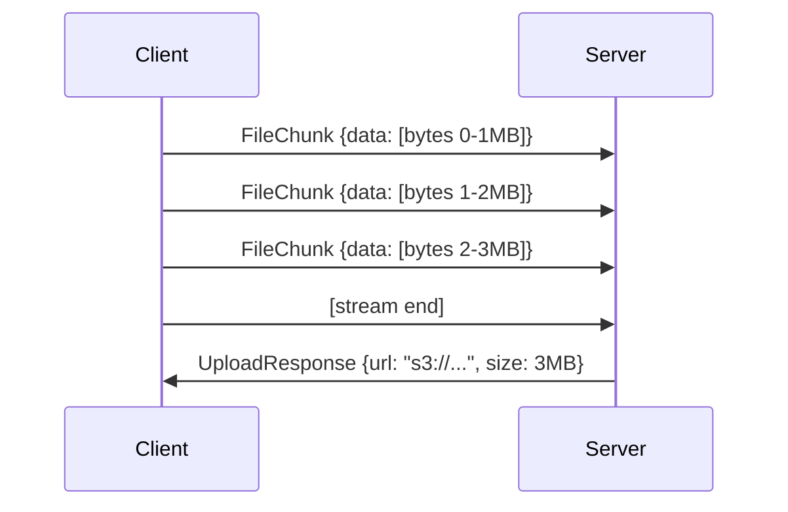
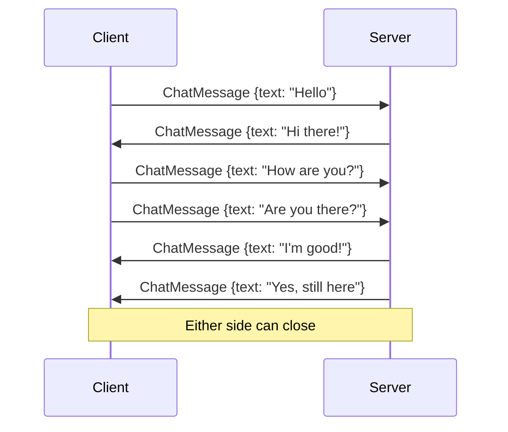
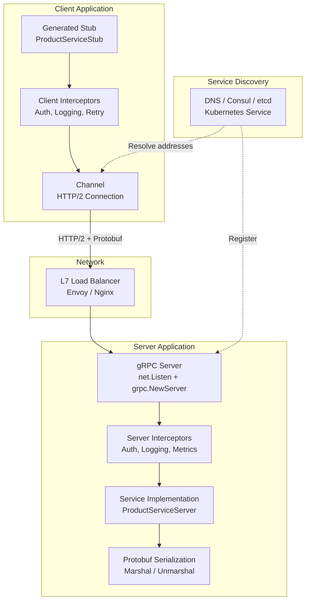
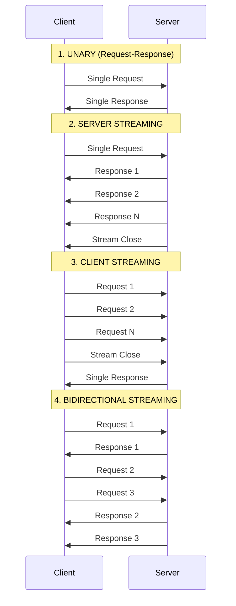
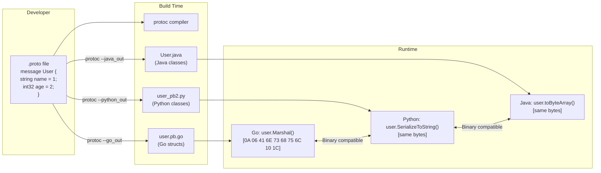
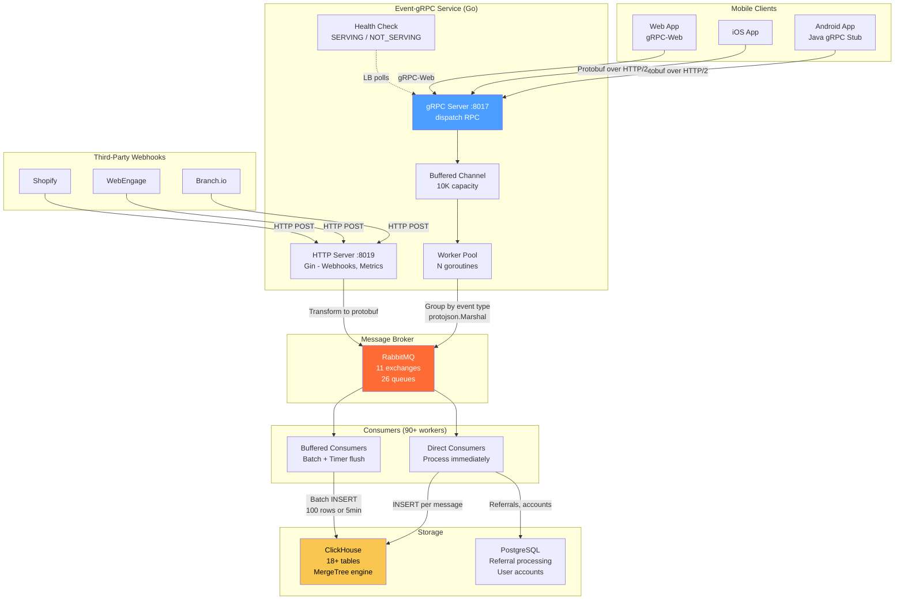
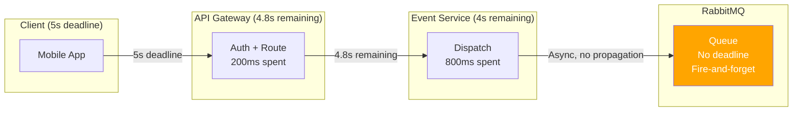

# gRPC and Protocol Buffers -- Complete Study Guide

**For:** Anshul Garg | Backend Engineer | Google Interview Preparation
**Context:** Built Go gRPC service (event-grpc) at Good Creator Co. handling 10K events/sec with 60+ protobuf event types, RabbitMQ fan-out, and buffered batch-writes to ClickHouse

---

# TABLE OF CONTENTS

1. [Part 1: Protocol Buffers (Protobuf)](#part-1-protocol-buffers-protobuf)
   - [What Is Protobuf](#what-is-protobuf)
   - [.proto File Syntax](#proto-file-syntax)
   - [Scalar Types](#scalar-types)
   - [Enums, Oneof, Maps, and Repeated](#enums-oneof-maps-and-repeated)
   - [Schema Evolution Rules](#schema-evolution-rules)
   - [Protobuf vs JSON vs Avro](#protobuf-vs-json-vs-avro)
   - [Code Generation with protoc](#code-generation-with-protoc)
2. [Part 2: gRPC Framework](#part-2-grpc-framework)
   - [What Is gRPC](#what-is-grpc)
   - [HTTP/2 Foundation](#http2-foundation)
   - [Four Call Types](#four-call-types)
   - [Service Definition in .proto](#service-definition-in-proto)
   - [Channel, Stub, Server](#channel-stub-server)
   - [Interceptors](#interceptors)
   - [Deadlines, Timeouts, Cancellation](#deadlines-timeouts-cancellation)
   - [Error Handling and Status Codes](#error-handling-and-status-codes)
   - [gRPC vs REST](#grpc-vs-rest)
3. [Part 3: gRPC in Production](#part-3-grpc-in-production)
   - [Load Balancing](#load-balancing)
   - [Health Checking Protocol](#health-checking-protocol)
   - [Retry Policies](#retry-policies)
   - [TLS and mTLS](#tls-and-mtls)
   - [gRPC with Kubernetes](#grpc-with-kubernetes)
4. [Part 4: Code Examples](#part-4-code-examples)
   - [.proto Service Definition](#proto-service-definition-example)
   - [Go gRPC Server (Anshul's event-grpc)](#go-grpc-server)
   - [Python gRPC Server](#python-grpc-server)
5. [Part 5: Mermaid Diagrams](#part-5-mermaid-diagrams)
6. [Part 6: Interview Q&A (15 Questions)](#part-6-interview-qa)
7. [Part 7: How Anshul Used It at GCC](#part-7-how-anshul-used-it-at-gcc)

---

# PART 1: PROTOCOL BUFFERS (PROTOBUF)

## What Is Protobuf

Protocol Buffers (protobuf) is Google's **language-neutral, platform-neutral, extensible binary serialization format**. It serves as both an **Interface Definition Language (IDL)** for defining data structures and a **binary wire format** for efficient serialization.

**Key properties:**
- **Binary encoding**: 3-10x smaller than JSON, 2-5x smaller than XML
- **Schema-driven**: `.proto` files define the contract; code is generated for any language
- **Backward/forward compatible**: Adding or removing fields does not break existing clients
- **Strongly typed**: Compile-time type checking across Go, Java, Python, C++, and more
- **Fast**: Serialization/deserialization is 20-100x faster than JSON for complex messages
- **Self-describing field numbers**: Each field has a unique integer tag used on the wire (not field names)

**How binary encoding works:**

Each field is encoded as a (field_number, wire_type, value) triple. The field name is NOT on the wire -- only the number. This is why field numbers must never change.

```
JSON:   {"name": "Anshul", "age": 28}     = 35 bytes (text)
Protobuf: [0A 06 41 6E 73 68 75 6C 10 1C] = 10 bytes (binary)
          |field 1, string, "Anshul"| |field 2, varint, 28|
```

Wire types:

| Wire Type | ID | Used For |
|-----------|-----|----------|
| Varint | 0 | int32, int64, uint32, uint64, sint32, sint64, bool, enum |
| 64-bit | 1 | fixed64, sfixed64, double |
| Length-delimited | 2 | string, bytes, embedded messages, repeated fields (packed) |
| 32-bit | 5 | fixed32, sfixed32, float |

---

## .proto File Syntax

A `.proto` file defines messages (data structures) and services (RPC methods).

```protobuf
// File: user.proto
syntax = "proto3";                        // Always specify proto3

package myapp.user;                       // Namespace to prevent name collisions

option go_package = "github.com/myapp/proto/userpb";   // Go import path
option java_package = "com.myapp.proto.user";          // Java package
option java_multiple_files = true;                     // One class per message

import "google/protobuf/timestamp.proto"; // Import well-known types
import "google/protobuf/any.proto";       // Dynamic typing

// A message is a named collection of typed fields
message User {
  string id = 1;                          // Field number 1 (never reuse)
  string name = 2;                        // Field number 2
  string email = 3;
  int32 age = 4;
  UserRole role = 5;                      // Enum type
  Address address = 6;                    // Nested message
  repeated string tags = 7;              // List/array
  map<string, string> metadata = 8;      // Key-value map
  google.protobuf.Timestamp created_at = 9;  // Well-known type

  oneof contact {                         // Only one can be set
    string phone = 10;
    string slack_id = 11;
  }

  reserved 12, 15 to 20;                 // Reserved for future use
  reserved "old_field_name";             // Prevent reuse of deleted field names
}

enum UserRole {
  USER_ROLE_UNSPECIFIED = 0;             // Proto3 requires 0 as default
  USER_ROLE_ADMIN = 1;
  USER_ROLE_EDITOR = 2;
  USER_ROLE_VIEWER = 3;
}

message Address {
  string street = 1;
  string city = 2;
  string state = 3;
  string country = 4;
  string zip = 5;
}
```

---

## Scalar Types

| .proto Type | Go | Python | Java | Notes |
|------------|-----|--------|------|-------|
| `double` | float64 | float | double | 8 bytes |
| `float` | float32 | float | float | 4 bytes |
| `int32` | int32 | int | int | Variable-length. Inefficient for negative numbers |
| `int64` | int64 | int | long | Variable-length |
| `uint32` | uint32 | int | int | Variable-length, unsigned |
| `uint64` | uint64 | int | long | Variable-length, unsigned |
| `sint32` | int32 | int | int | ZigZag encoding. Efficient for negative numbers |
| `sint64` | int64 | int | long | ZigZag encoding |
| `fixed32` | uint32 | int | int | Always 4 bytes. Faster than uint32 if values > 2^28 |
| `fixed64` | uint64 | int | long | Always 8 bytes |
| `bool` | bool | bool | boolean | |
| `string` | string | str | String | Must be UTF-8 or 7-bit ASCII |
| `bytes` | []byte | bytes | ByteString | Arbitrary binary data |

**Default values in proto3:** All fields default to zero values (0 for numbers, "" for strings, false for bools, empty for repeated). There is no way to distinguish "field was set to 0" from "field was not set" unless you use wrapper types or `optional` keyword (added in proto3 syntax update).

---

## Enums, Oneof, Maps, and Repeated

### Enums
```protobuf
enum Status {
  STATUS_UNSPECIFIED = 0;    // MUST have a 0 value (proto3 default)
  STATUS_ACTIVE = 1;
  STATUS_INACTIVE = 2;
  STATUS_SUSPENDED = 3;

  // Allow aliases (two names for same value)
  option allow_alias = true;
  STATUS_ENABLED = 1;        // Alias for ACTIVE
}
```

### Oneof (Union Types)
```protobuf
message Event {
  string id = 1;
  string timestamp = 2;

  // Only ONE of these can be set at a time.
  // Setting one clears the others. Saves memory.
  oneof event_type {
    ClickEvent click = 10;
    PurchaseEvent purchase = 11;
    PageViewEvent page_view = 12;
  }
}
// In Go: e.GetClick() returns nil if purchase was set
// In Python: e.WhichOneof('event_type') returns the field name
```

**Anshul's usage at GCC:** The `Event` message used `oneof EventOf` with 60+ event types (field numbers 9 through 64). This allowed a single `dispatch` RPC to handle all event types with compile-time type safety.

### Repeated (Lists)
```protobuf
message SearchResponse {
  repeated Result results = 1;    // Ordered list of Result messages
  repeated string tags = 2;       // List of strings
  repeated int32 scores = 3;      // Packed encoding by default in proto3
}
```

### Maps
```protobuf
message Config {
  map<string, string> labels = 1;        // string -> string
  map<int32, Feature> features = 2;      // int -> message
  // Maps are unordered. Cannot be repeated.
  // Equivalent to: repeated MapEntry { key, value }
}
```

---

## Schema Evolution Rules

These rules are critical for maintaining backward/forward compatibility:

| Rule | Details |
|------|---------|
| **Field numbers are forever** | Once assigned, a field number can NEVER be reused, even if the field is deleted |
| **Never change a field's type** | Changing `int32` to `string` breaks all existing clients |
| **Never change a field number** | Field 3 = name cannot become field 5 = name |
| **Adding fields is safe** | New fields are ignored by old clients (forward compatible) |
| **Removing fields is safe** | Old fields are ignored by new clients (backward compatible) |
| **Use `reserved`** | Mark deleted field numbers/names as reserved to prevent accidental reuse |
| **Rename fields freely** | Field names are NOT on the wire; only numbers matter |
| **Don't change `oneof` to `repeated`** | Wire format is different |
| **`int32`, `uint32`, `int64`, `uint64`, `bool` are compatible** | They share varint wire type |
| **`string` and `bytes` are compatible** | If bytes are valid UTF-8 |
| **Adding values to enum is safe** | Unknown enum values are preserved as the integer |

**The golden rule:** Think of field numbers like database column IDs. You can add new columns, you can stop reading old columns, but you can never change what a column number means.

```protobuf
// Version 1
message Profile {
  string name = 1;
  string email = 2;
  string phone = 3;     // We want to remove this
}

// Version 2 (correct migration)
message Profile {
  string name = 1;
  string email = 2;
  reserved 3;            // Prevent field 3 from being reused
  reserved "phone";      // Prevent the name from being reused
  string avatar_url = 4; // New field gets a NEW number
}
```

---

## Protobuf vs JSON vs Avro

| Dimension | Protocol Buffers | JSON | Apache Avro |
|-----------|-----------------|------|-------------|
| **Encoding** | Binary | Text (UTF-8) | Binary |
| **Schema** | Required (.proto) | Optional (JSON Schema) | Required (.avsc JSON) |
| **Schema in payload** | No (field numbers only) | Yes (field names) | Optional (can embed or use registry) |
| **Schema evolution** | Field numbers | Ad-hoc | Schema resolution rules |
| **Backward compat** | Built-in via field numbers | Manual | Built-in via schema resolution |
| **Human readable** | No (binary) | Yes | No (binary) |
| **Size** | Smallest (3-10x < JSON) | Largest | Small (comparable to protobuf) |
| **Speed** | Fastest | Slowest | Fast |
| **IDL** | .proto files | N/A | .avsc JSON |
| **Code generation** | protoc compiler | None needed | avro-tools |
| **Language support** | C++, Go, Java, Python, C#, JS | Universal | Java, Python, C, C++ |
| **RPC framework** | gRPC (built-in) | REST (separate) | None (data format only) |
| **Streaming** | Native (gRPC streaming) | Requires WebSocket/SSE | Avro RPC (limited) |
| **Map support** | Yes | Yes | Yes |
| **Union types** | oneof | Not native | Union |
| **Default values** | Zero values (proto3) | null | Explicit defaults |
| **When to use** | Internal microservices, mobile, high-perf | Public APIs, debugging, config | Kafka messages, data lakes, Hadoop |

**Decision framework:**
- **Protobuf/gRPC**: Service-to-service communication where performance and type safety matter
- **JSON/REST**: Public APIs, browser clients, debugging/logging
- **Avro**: Event streaming (Kafka), data pipelines, when schema registry is needed

---

## Code Generation with protoc

`protoc` is the Protocol Buffer compiler. It reads `.proto` files and generates source code in the target language.

```bash
# Install protoc
brew install protobuf          # macOS
apt-get install protobuf-compiler  # Ubuntu

# Install language-specific plugins
go install google.golang.org/protobuf/cmd/protoc-gen-go@latest
go install google.golang.org/grpc/cmd/protoc-gen-go-grpc@latest
pip install grpcio-tools

# Generate Go code
protoc --go_out=. --go_opt=paths=source_relative \
       --go-grpc_out=. --go-grpc_opt=paths=source_relative \
       proto/eventservice.proto

# Generate Python code
python -m grpc_tools.protoc -I. \
       --python_out=./gen \
       --grpc_python_out=./gen \
       proto/eventservice.proto

# Generate Java code
protoc --java_out=./gen \
       --grpc-java_out=./gen \
       proto/eventservice.proto
```

**What gets generated:**

| Language | Files Generated | Contents |
|----------|----------------|----------|
| Go | `*.pb.go`, `*_grpc.pb.go` | Message structs, Marshal/Unmarshal, gRPC client/server interfaces |
| Python | `*_pb2.py`, `*_pb2_grpc.py` | Message classes, serializers, gRPC stubs |
| Java | `*.java` (per message) | Message classes, Builder pattern, gRPC stubs |

**At GCC:** The CI/CD pipeline ran `protoc` to generate Go (for event-grpc server), Java (for Android -- published to Maven), and JavaScript (for web -- published to NPM). All clients shared the same type-safe contract from a single 688-line `.proto` file.

---

# PART 2: gRPC FRAMEWORK

## What Is gRPC

gRPC (gRPC Remote Procedure Calls) is a high-performance, open-source RPC framework originally developed at Google. It uses **HTTP/2** for transport, **Protocol Buffers** as the IDL and serialization format, and provides features like authentication, bidirectional streaming, flow control, and blocking/non-blocking bindings.

**Key properties:**
- **HTTP/2 transport**: Multiplexing, header compression, binary framing, server push
- **Protobuf serialization**: Compact binary format with code generation
- **Streaming**: Four call types including bidirectional streaming
- **Deadline propagation**: Timeouts cascade through the entire call chain
- **Interceptors**: Middleware for auth, logging, metrics, retries
- **Cross-language**: 11+ languages with auto-generated client/server code
- **Pluggable**: Custom authentication, load balancing, health checking

**gRPC is NOT a replacement for REST.** It excels at internal service-to-service communication. REST remains better for public APIs, browser clients (without gRPC-Web), and human-readable debugging.

---

## HTTP/2 Foundation

gRPC requires HTTP/2. Understanding HTTP/2 is essential for understanding gRPC's performance characteristics.

| Feature | HTTP/1.1 | HTTP/2 |
|---------|----------|--------|
| **Encoding** | Text | Binary framing |
| **Multiplexing** | No (one request per connection, or pipelining with HOL blocking) | Yes (multiple streams on one connection) |
| **Header compression** | None | HPACK compression |
| **Server push** | No | Yes |
| **Connection reuse** | Keep-alive (serial) | Full multiplexing (parallel) |
| **Flow control** | TCP only | Per-stream and connection-level |
| **Priority** | No | Stream prioritization |

### HTTP/2 Binary Framing

```
HTTP/1.1:
GET /api/users HTTP/1.1\r\n       <- Text-based, parsed character by character
Host: example.com\r\n
Content-Type: application/json\r\n

HTTP/2:
+-------+---------------+
|Length(24)|Type(8)|Flags(8)|  <- Binary frame header (9 bytes fixed)
+-------+---------------+
|R| Stream Identifier (31)|   <- Which stream this frame belongs to
+-------+---------------+
| Frame Payload ...        |   <- Data, headers, settings, etc.
+-------+---------------+
```

### Multiplexing (Why gRPC is Fast)

```
HTTP/1.1 (6 connections needed):
Conn 1: [Request A]----[Response A]
Conn 2: [Request B]----------[Response B]
Conn 3: [Request C]--[Response C]
Conn 4: [Request D]------[Response D]
Conn 5: [Request E]----[Response E]
Conn 6: [Request F]--------[Response F]

HTTP/2 (1 connection, interleaved):
Single Conn: [A-header][B-header][C-header][A-data][C-data][B-data]
             [D-header][A-data][E-header][D-data][F-header][B-data]...
```

Multiple requests and responses can be in flight simultaneously on a single TCP connection. No head-of-line blocking at the HTTP level (though TCP HOL blocking still exists -- resolved by HTTP/3 / QUIC).

---

## Four Call Types

gRPC supports four communication patterns:

### 1. Unary RPC (Request-Response)

The simplest pattern. Client sends one request, server sends one response. Like a traditional function call.

```protobuf
service UserService {
  rpc GetUser(GetUserRequest) returns (User);
}
```



**Use cases:** CRUD operations, authentication, any simple request-response.

### 2. Server Streaming RPC

Client sends one request, server sends a stream of responses. The client reads until the stream is closed.

```protobuf
service EventService {
  rpc StreamEvents(StreamRequest) returns (stream Event);
}
```



**Use cases:** Real-time feeds, log tailing, downloading large datasets in chunks, stock price updates.

### 3. Client Streaming RPC

Client sends a stream of requests, server sends one response after receiving all messages.

```protobuf
service UploadService {
  rpc UploadFile(stream FileChunk) returns (UploadResponse);
}
```



**Use cases:** File uploads, batch event ingestion (like Anshul's event-grpc dispatch), sensor data collection, aggregation queries.

### 4. Bidirectional Streaming RPC

Both client and server send streams. The two streams are independent -- either side can read and write in any order.

```protobuf
service ChatService {
  rpc Chat(stream ChatMessage) returns (stream ChatMessage);
}
```



**Use cases:** Chat applications, collaborative editing, real-time gaming, IoT device communication, bidirectional sync.

---

## Service Definition in .proto

A gRPC service is defined in a `.proto` file alongside its message types:

```protobuf
syntax = "proto3";
package myapp;

service ProductService {
  // Unary
  rpc GetProduct(GetProductRequest) returns (Product);
  rpc CreateProduct(CreateProductRequest) returns (Product);

  // Server streaming
  rpc ListProducts(ListProductsRequest) returns (stream Product);

  // Client streaming
  rpc BatchCreateProducts(stream CreateProductRequest) returns (BatchResponse);

  // Bidirectional streaming
  rpc SyncInventory(stream InventoryUpdate) returns (stream InventoryStatus);
}

message GetProductRequest {
  string id = 1;
}

message Product {
  string id = 1;
  string name = 2;
  double price = 3;
  int32 stock = 4;
}

message ListProductsRequest {
  int32 page_size = 1;
  string page_token = 2;
  string filter = 3;
}

message CreateProductRequest {
  string name = 1;
  double price = 2;
  int32 initial_stock = 3;
}

message BatchResponse {
  int32 created_count = 1;
  int32 failed_count = 2;
}
```

---

## Channel, Stub, Server

These are the three core runtime concepts in gRPC:

### Channel
A **channel** represents a virtual connection to a gRPC server. It handles connection management, load balancing, and reconnection automatically. A channel can multiplex many RPCs over a single TCP connection (HTTP/2).

```go
// Go: Creating a channel (connection)
conn, err := grpc.Dial(
    "localhost:50051",
    grpc.WithTransportCredentials(insecure.NewCredentials()),
    grpc.WithDefaultServiceConfig(`{"loadBalancingPolicy":"round_robin"}`),
)
defer conn.Close()
```

```python
# Python: Creating a channel
channel = grpc.insecure_channel('localhost:50051')
# or with TLS:
channel = grpc.secure_channel('localhost:50051', grpc.ssl_channel_credentials())
```

### Stub (Client)
A **stub** is the client-side proxy generated from the `.proto` file. It exposes the RPC methods as local function calls, handling serialization, transport, and deserialization behind the scenes.

```go
// Go: Using a stub
client := pb.NewProductServiceClient(conn)
product, err := client.GetProduct(ctx, &pb.GetProductRequest{Id: "123"})
```

```python
# Python: Using a stub
stub = product_pb2_grpc.ProductServiceStub(channel)
product = stub.GetProduct(product_pb2.GetProductRequest(id="123"))
```

### Server
A **server** listens on a port and dispatches incoming RPCs to the registered service implementations.

```go
// Go: Creating a server
s := grpc.NewServer(
    grpc.UnaryInterceptor(loggingInterceptor),
    grpc.MaxRecvMsgSize(10 * 1024 * 1024),  // 10MB
)
pb.RegisterProductServiceServer(s, &productServer{})
lis, _ := net.Listen("tcp", ":50051")
s.Serve(lis)
```

---

## Interceptors

Interceptors are gRPC's middleware mechanism. They wrap RPC calls to add cross-cutting concerns like logging, authentication, metrics, and retry logic.

### Types of Interceptors

| Type | Client/Server | When Called |
|------|---------------|------------|
| Unary Interceptor | Both | Once per unary RPC |
| Stream Interceptor | Both | Once per streaming RPC |

### Go Server Interceptor Example

```go
// Logging interceptor
func loggingInterceptor(
    ctx context.Context,
    req interface{},
    info *grpc.UnaryServerInfo,
    handler grpc.UnaryHandler,
) (interface{}, error) {
    start := time.Now()

    // Call the actual RPC handler
    resp, err := handler(ctx, req)

    duration := time.Since(start)
    log.Printf("RPC: %s | Duration: %v | Error: %v",
        info.FullMethod, duration, err)

    return resp, err
}

// Auth interceptor
func authInterceptor(
    ctx context.Context,
    req interface{},
    info *grpc.UnaryServerInfo,
    handler grpc.UnaryHandler,
) (interface{}, error) {
    md, ok := metadata.FromIncomingContext(ctx)
    if !ok {
        return nil, status.Error(codes.Unauthenticated, "no metadata")
    }

    tokens := md.Get("authorization")
    if len(tokens) == 0 {
        return nil, status.Error(codes.Unauthenticated, "no token")
    }

    // Validate token...
    userId, err := validateToken(tokens[0])
    if err != nil {
        return nil, status.Error(codes.Unauthenticated, "invalid token")
    }

    // Add user to context
    ctx = context.WithValue(ctx, "user_id", userId)
    return handler(ctx, req)
}

// Chain multiple interceptors
s := grpc.NewServer(
    grpc.ChainUnaryInterceptor(
        loggingInterceptor,
        authInterceptor,
        metricsInterceptor,
    ),
)
```

### Python Client Interceptor Example

```python
class LoggingInterceptor(grpc.UnaryUnaryClientInterceptor):
    def intercept_unary_unary(self, continuation, client_call_details, request):
        start = time.time()
        response = continuation(client_call_details, request)
        duration = time.time() - start
        print(f"RPC {client_call_details.method} took {duration:.3f}s")
        return response

# Apply interceptor
channel = grpc.intercept_channel(
    grpc.insecure_channel('localhost:50051'),
    LoggingInterceptor()
)
```

---

## Deadlines, Timeouts, Cancellation

gRPC has first-class support for deadlines that propagate through the entire call chain. This prevents cascading failures in microservice architectures.

### Deadline vs Timeout
- **Timeout**: Duration from now (e.g., "5 seconds from now")
- **Deadline**: Absolute point in time (e.g., "2024-01-15 10:30:00.000 UTC")

gRPC converts timeouts to deadlines internally. Deadlines propagate through the call chain -- if Service A calls Service B with a 5s deadline, and Service B calls Service C after 2s, Service C inherits the remaining 3s deadline.

```go
// Go: Setting a deadline
ctx, cancel := context.WithTimeout(context.Background(), 5*time.Second)
defer cancel()

resp, err := client.GetProduct(ctx, &pb.GetProductRequest{Id: "123"})
if err != nil {
    st, _ := status.FromError(err)
    if st.Code() == codes.DeadlineExceeded {
        log.Println("Request timed out")
    }
}
```

```python
# Python: Setting a timeout
try:
    response = stub.GetProduct(
        product_pb2.GetProductRequest(id="123"),
        timeout=5.0  # seconds
    )
except grpc.RpcError as e:
    if e.code() == grpc.StatusCode.DEADLINE_EXCEEDED:
        print("Request timed out")
```

### Cancellation

Cancelling a context cancels all downstream RPCs. This is critical for preventing wasted work.

```go
ctx, cancel := context.WithCancel(context.Background())

// Start a long-running operation
go func() {
    resp, err := client.StreamEvents(ctx, &pb.StreamRequest{})
    // ...
}()

// Cancel after user navigates away
cancel()  // All downstream RPCs are cancelled immediately
```

### Deadline Propagation in Microservices

```
Client (5s deadline)
  -> Service A (receives 5s, spends 1s, forwards 4s)
    -> Service B (receives 4s, spends 2s, forwards 2s)
      -> Service C (receives 2s, must complete within 2s or DEADLINE_EXCEEDED)
```

**Best practice:** Always set deadlines. Without a deadline, a hung server keeps connections open forever, eventually exhausting resources.

---

## Error Handling and Status Codes

gRPC uses a structured error model with status codes (not HTTP status codes):

| Code | Name | HTTP Equivalent | When to Use |
|------|------|----------------|-------------|
| 0 | OK | 200 | Success |
| 1 | CANCELLED | 499 | Client cancelled the request |
| 2 | UNKNOWN | 500 | Unknown error (catch-all) |
| 3 | INVALID_ARGUMENT | 400 | Client sent bad data |
| 4 | DEADLINE_EXCEEDED | 504 | Timeout |
| 5 | NOT_FOUND | 404 | Resource doesn't exist |
| 6 | ALREADY_EXISTS | 409 | Create conflict |
| 7 | PERMISSION_DENIED | 403 | Authenticated but not authorized |
| 8 | RESOURCE_EXHAUSTED | 429 | Rate limit or quota exceeded |
| 9 | FAILED_PRECONDITION | 400 | System not in required state |
| 10 | ABORTED | 409 | Concurrency conflict (retry may succeed) |
| 11 | OUT_OF_RANGE | 400 | Value outside valid range |
| 12 | UNIMPLEMENTED | 501 | Method not implemented |
| 13 | INTERNAL | 500 | Internal server error |
| 14 | UNAVAILABLE | 503 | Service temporarily unavailable (retry) |
| 15 | DATA_LOSS | 500 | Unrecoverable data loss |
| 16 | UNAUTHENTICATED | 401 | No valid authentication credentials |

### Rich Error Details

```go
// Go: Returning a rich error
import "google.golang.org/genproto/googleapis/rpc/errdetails"

st := status.New(codes.InvalidArgument, "invalid email format")
st, _ = st.WithDetails(&errdetails.BadRequest{
    FieldViolations: []*errdetails.BadRequest_FieldViolation{
        {Field: "email", Description: "must contain @"},
    },
})
return nil, st.Err()
```

```go
// Go: Handling errors
resp, err := client.CreateUser(ctx, req)
if err != nil {
    st, ok := status.FromError(err)
    if !ok {
        log.Fatal("Not a gRPC error")
    }

    switch st.Code() {
    case codes.InvalidArgument:
        for _, detail := range st.Details() {
            if badReq, ok := detail.(*errdetails.BadRequest); ok {
                for _, violation := range badReq.FieldViolations {
                    log.Printf("Field %s: %s", violation.Field, violation.Description)
                }
            }
        }
    case codes.Unavailable:
        // Retry with backoff
    case codes.DeadlineExceeded:
        // Timeout -- consider increasing deadline or breaking into smaller calls
    }
}
```

---

## gRPC vs REST

| Dimension | gRPC | REST (HTTP/JSON) |
|-----------|------|------------------|
| **Protocol** | HTTP/2 (required) | HTTP/1.1 or HTTP/2 |
| **Payload format** | Protocol Buffers (binary) | JSON (text), XML, others |
| **Payload size** | 3-10x smaller | Baseline |
| **Serialization speed** | 20-100x faster | Baseline |
| **API contract** | .proto file (strict) | OpenAPI/Swagger (optional) |
| **Code generation** | Built-in (protoc) | Third-party (OpenAPI Generator) |
| **Streaming** | Native (4 types) | SSE, WebSocket (separate) |
| **Browser support** | Requires gRPC-Web proxy | Native |
| **Human readability** | Binary (need tools to inspect) | Text (curl, Postman) |
| **Tooling** | grpcurl, grpcui, Bloom RPC | curl, Postman, browser |
| **Load balancing** | Requires L7 LB or client-side | Any L4/L7 load balancer |
| **Caching** | Not built-in (HTTP/2 streams) | HTTP caching (ETags, Cache-Control) |
| **Versioning** | Backward-compatible field numbers | URL versioning (/v1/, /v2/) |
| **Error model** | Structured status codes (16 codes) | HTTP status codes (40+ codes) |
| **Deadline propagation** | Built-in | Must implement manually |
| **Interceptors** | Built-in | Middleware (framework-specific) |
| **Discovery** | gRPC reflection, service mesh | Swagger UI, API docs |
| **Maturity** | Newer (2015) | Decades of tooling |
| **Best for** | Internal microservices, mobile, IoT | Public APIs, web apps, third-party |

**When to choose gRPC:**
- Internal service-to-service communication
- Mobile apps (small payloads, efficient battery use)
- Real-time streaming requirements
- Polyglot environments needing shared contracts
- High-throughput, low-latency requirements

**When to choose REST:**
- Public-facing APIs
- Browser-based applications (without gRPC-Web)
- Simple CRUD APIs
- When human readability and debugging is important
- When HTTP caching is valuable

**Hybrid approach (what Anshul did at GCC):**
- gRPC for high-performance event ingestion (10K events/sec from mobile clients)
- HTTP/REST (Gin) for webhooks, health checks, and Prometheus metrics on the same service

---

# PART 3: gRPC IN PRODUCTION

## Load Balancing

gRPC's use of HTTP/2 long-lived connections makes traditional L4 load balancing ineffective. A single TCP connection carries all RPCs, so L4 LB sends all traffic to one backend.

### Client-Side Load Balancing

The client discovers all server addresses and distributes RPCs across them.

```
Client                     Servers
+------------------+       +----------+
| Name Resolver    |------>| Server 1 |
| (DNS, Consul,    |  \    +----------+
|  etcd, k8s)      |   \   +----------+
|                  |    -->| Server 2 |
| LB Policy:       |   /   +----------+
| - pick_first     |  /    +----------+
| - round_robin    |------>| Server 3 |
| - grpclb         |       +----------+
+------------------+
```

```go
// Go: Client-side round-robin
conn, _ := grpc.Dial(
    "dns:///my-service.default.svc.cluster.local:50051",
    grpc.WithDefaultServiceConfig(`{"loadBalancingPolicy":"round_robin"}`),
    grpc.WithTransportCredentials(insecure.NewCredentials()),
)
```

### Proxy-Based Load Balancing (L7)

An L7 proxy (Envoy, Nginx, Linkerd) understands HTTP/2 and distributes individual RPCs, not connections.

```
Clients            L7 Proxy (Envoy)          Servers
+--------+        +----------------+         +----------+
| Client |------->|                |-------->| Server 1 |
+--------+  HTTP/2| Inspects each  |  HTTP/2 +----------+
+--------+        | RPC and routes |-------->| Server 2 |
| Client |------->| to backends    |         +----------+
+--------+        |                |-------->| Server 3 |
                  +----------------+         +----------+
```

| Approach | Pros | Cons |
|----------|------|------|
| **Client-side** | No extra hop, lowest latency | Client complexity, need service discovery |
| **L7 proxy (Envoy)** | Transparent to clients, rich routing | Extra network hop, single point of failure |
| **Service mesh (Istio/Linkerd)** | Sidecar pattern, no client changes | Complexity, resource overhead |

**At GCC:** The event-grpc service ran behind an L7 load balancer that used the gRPC health check endpoint to route traffic only to healthy instances during deployments.

---

## Health Checking Protocol

gRPC defines a standard health checking protocol (`grpc.health.v1.Health`):

```protobuf
// Built into gRPC (grpc/health/v1/health.proto)
service Health {
  rpc Check(HealthCheckRequest) returns (HealthCheckResponse);
  rpc Watch(HealthCheckRequest) returns (stream HealthCheckResponse);
}

message HealthCheckRequest {
  string service = 1;  // Empty string = overall server health
}

message HealthCheckResponse {
  enum ServingStatus {
    UNKNOWN = 0;
    SERVING = 1;
    NOT_SERVING = 2;
    SERVICE_UNKNOWN = 3;
  }
  ServingStatus status = 1;
}
```

**Anshul's implementation at GCC:**
```go
// The health check toggled via HTTP endpoint for graceful deployment
func (s *healthserver) Check(ctx context.Context,
    request *grpc_health_v1.HealthCheckRequest) (*grpc_health_v1.HealthCheckResponse, error) {
    if heartbeat.BEAT {
        return &grpc_health_v1.HealthCheckResponse{
            Status: grpc_health_v1.HealthCheckResponse_SERVING}, nil
    }
    return &grpc_health_v1.HealthCheckResponse{
        Status: grpc_health_v1.HealthCheckResponse_NOT_SERVING}, nil
}

// Deployment flow:
// 1. PUT /heartbeat/?beat=false  -> health returns NOT_SERVING
// 2. LB stops sending traffic   -> drain 15 seconds
// 3. Stop old process, start new binary
// 4. PUT /heartbeat/?beat=true  -> health returns SERVING
// 5. LB resumes traffic         -> zero-downtime deployment
```

---

## Retry Policies

gRPC supports automatic retries via service config (client-side):

```json
{
  "methodConfig": [{
    "name": [{"service": "myapp.ProductService"}],
    "retryPolicy": {
      "maxAttempts": 3,
      "initialBackoff": "0.1s",
      "maxBackoff": "1s",
      "backoffMultiplier": 2,
      "retryableStatusCodes": ["UNAVAILABLE", "DEADLINE_EXCEEDED"]
    }
  }]
}
```

```go
// Go: Applying retry config
conn, _ := grpc.Dial(
    "localhost:50051",
    grpc.WithDefaultServiceConfig(`{
        "methodConfig": [{
            "name": [{"service": "myapp.ProductService", "method": "GetProduct"}],
            "retryPolicy": {
                "maxAttempts": 3,
                "initialBackoff": "0.1s",
                "maxBackoff": "1s",
                "backoffMultiplier": 2,
                "retryableStatusCodes": ["UNAVAILABLE"]
            }
        }]
    }`),
)
```

**Important:** Only retry on idempotent operations or when the server confirms the operation was not executed (UNAVAILABLE typically means the request never reached the handler). Retrying non-idempotent operations like `CreateUser` can cause duplicates.

**Hedging** (speculative retry): Send the same request to multiple backends simultaneously, use the first response. Useful for latency-sensitive operations.

---

## TLS and mTLS

### TLS (Server Authentication)
Client verifies the server's identity. Standard for public-facing gRPC.

```go
// Server with TLS
creds, _ := credentials.NewServerTLSFromFile("server.crt", "server.key")
s := grpc.NewServer(grpc.Creds(creds))

// Client with TLS
creds, _ := credentials.NewClientTLSFromFile("ca.crt", "")
conn, _ := grpc.Dial("server:50051", grpc.WithTransportCredentials(creds))
```

### mTLS (Mutual Authentication)
Both client and server verify each other. Standard for internal microservices.

```go
// Server with mTLS
cert, _ := tls.LoadX509KeyPair("server.crt", "server.key")
caCert, _ := os.ReadFile("ca.crt")
caPool := x509.NewCertPool()
caPool.AppendCertsFromPEM(caCert)

tlsConfig := &tls.Config{
    Certificates: []tls.Certificate{cert},
    ClientCAs:    caPool,
    ClientAuth:   tls.RequireAndVerifyClientCert,
}
s := grpc.NewServer(grpc.Creds(credentials.NewTLS(tlsConfig)))
```

### Token-Based Auth (per-RPC)

```go
// Client: Send token in metadata
ctx := metadata.AppendToOutgoingContext(ctx, "authorization", "Bearer "+token)
resp, err := client.GetProduct(ctx, req)

// Server: Extract token in interceptor
md, _ := metadata.FromIncomingContext(ctx)
tokens := md.Get("authorization")
```

---

## gRPC with Kubernetes

### Kubernetes gRPC Health Checks (v1.24+)

```yaml
apiVersion: apps/v1
kind: Deployment
metadata:
  name: event-grpc
spec:
  replicas: 3
  template:
    spec:
      containers:
      - name: event-grpc
        image: myapp/event-grpc:latest
        ports:
        - containerPort: 8017
          name: grpc
        - containerPort: 8019
          name: http
        # Native gRPC health check (Kubernetes 1.24+)
        livenessProbe:
          grpc:
            port: 8017
          initialDelaySeconds: 10
          periodSeconds: 10
        readinessProbe:
          grpc:
            port: 8017
          initialDelaySeconds: 5
          periodSeconds: 5
        # Resource limits
        resources:
          requests:
            cpu: 500m
            memory: 512Mi
          limits:
            cpu: 2000m
            memory: 2Gi
```

### gRPC Load Balancing in Kubernetes

```yaml
# Option 1: Headless service (for client-side LB)
apiVersion: v1
kind: Service
metadata:
  name: event-grpc-headless
spec:
  clusterIP: None    # Headless: DNS returns all pod IPs
  selector:
    app: event-grpc
  ports:
  - port: 8017
    name: grpc

---
# Option 2: Regular service with Envoy/Istio for L7 LB
apiVersion: v1
kind: Service
metadata:
  name: event-grpc
spec:
  selector:
    app: event-grpc
  ports:
  - port: 8017
    name: grpc
```

---

# PART 4: CODE EXAMPLES

## .proto Service Definition Example

This is based on Anshul's actual GCC event-grpc service definition (simplified):

```protobuf
// File: proto/eventservice.proto
syntax = "proto3";

option go_package = "proto/go/bulbulgrpc";
option java_multiple_files = true;
option java_package = "com.bulbul.grpc.event";

package event;

// Single RPC: accepts batched events (unary, but semantically batch)
service EventService {
  rpc dispatch(Events) returns (Response) {}
}

message Events {
  Header header = 4;              // Shared session context
  repeated Event events = 5;     // Batch of events
}

message Header {
  string sessionId = 5;
  int64 userId = 7;
  string deviceId = 8;
  string clientId = 10;
  string os = 12;
  string appVersion = 15;
  string utmSource = 21;
  string utmMedium = 22;
  string utmCampaign = 23;
}

message Response {
  string status = 1;    // "SUCCESS" or "ERROR"
}

message Event {
  string id = 4;
  string timestamp = 5;
  string currentURL = 6;

  oneof EventOf {
    LaunchEvent launchEvent = 9;
    PageOpenedEvent pageOpenedEvent = 10;
    WidgetViewEvent widgetViewEvent = 13;
    WidgetCtaClickedEvent widgetCtaClickedEvent = 14;
    AddToCartEvent addToCartEvent = 23;
    CompletePurchaseEvent completePurchaseEvent = 26;
    // ... 50+ more event types through field 64
  }
}

message LaunchEvent {
  string referrer = 1;
  string landingPage = 2;
}

message AddToCartEvent {
  string productId = 1;
  string productName = 2;
  double price = 3;
  int32 quantity = 4;
}

message CompletePurchaseEvent {
  string orderId = 1;
  double totalAmount = 2;
  string currency = 3;
  string paymentMethod = 4;
}
```

---

## Go gRPC Server

Based on Anshul's actual event-grpc implementation at GCC:

```go
// File: main.go
package main

import (
    "context"
    "log"
    "net"

    "google.golang.org/grpc"
    "google.golang.org/grpc/health/grpc_health_v1"
    bulbulgrpc "myapp/proto/go/bulbulgrpc"
)

type server struct {
    bulbulgrpc.UnimplementedEventServiceServer
}

type healthserver struct {
    grpc_health_v1.UnimplementedHealthServer
}

// Health check for load balancer / Kubernetes
func (s *healthserver) Check(ctx context.Context,
    req *grpc_health_v1.HealthCheckRequest) (*grpc_health_v1.HealthCheckResponse, error) {
    return &grpc_health_v1.HealthCheckResponse{
        Status: grpc_health_v1.HealthCheckResponse_SERVING,
    }, nil
}

// Core dispatch RPC -- receives batched events
func (s *server) Dispatch(ctx context.Context,
    in *bulbulgrpc.Events) (*bulbulgrpc.Response, error) {
    if in == nil {
        return &bulbulgrpc.Response{Status: "ERROR"}, nil
    }

    // Push to buffered channel with 1-second backpressure timeout
    select {
    case <-time.After(1 * time.Second):
        return &bulbulgrpc.Response{Status: "ERROR"},
            errors.New("channel full, backpressure")
    case eventChannel <- *in:
        return &bulbulgrpc.Response{Status: "SUCCESS"}, nil
    }
}

func main() {
    // Start gRPC server on port 8017
    lis, err := net.Listen("tcp", ":8017")
    if err != nil {
        log.Fatalf("failed to listen: %v", err)
    }

    s := grpc.NewServer()
    bulbulgrpc.RegisterEventServiceServer(s, &server{})
    grpc_health_v1.RegisterHealthServer(s, &healthserver{})

    log.Println("gRPC server listening on :8017")
    if err := s.Serve(lis); err != nil {
        log.Fatalf("failed to serve: %v", err)
    }
}
```

---

## Python gRPC Server

```python
# File: server.py
import grpc
from concurrent import futures
import time
import logging

import product_pb2
import product_pb2_grpc

logging.basicConfig(level=logging.INFO)
logger = logging.getLogger(__name__)


class ProductService(product_pb2_grpc.ProductServiceServicer):
    """gRPC service implementation."""

    def __init__(self):
        self.products = {}

    def GetProduct(self, request, context):
        """Unary RPC: Get a single product."""
        product = self.products.get(request.id)
        if not product:
            context.set_code(grpc.StatusCode.NOT_FOUND)
            context.set_details(f"Product {request.id} not found")
            return product_pb2.Product()
        return product

    def CreateProduct(self, request, context):
        """Unary RPC: Create a product."""
        product_id = str(len(self.products) + 1)
        product = product_pb2.Product(
            id=product_id,
            name=request.name,
            price=request.price,
            stock=request.initial_stock,
        )
        self.products[product_id] = product
        logger.info(f"Created product {product_id}: {request.name}")
        return product

    def ListProducts(self, request, context):
        """Server streaming RPC: Stream all products."""
        for product_id, product in self.products.items():
            # Check if client cancelled
            if context.is_active():
                yield product
                time.sleep(0.1)  # Simulate processing delay
            else:
                logger.info("Client cancelled ListProducts stream")
                return

    def BatchCreateProducts(self, request_iterator, context):
        """Client streaming RPC: Receive a stream of create requests."""
        created = 0
        failed = 0
        for request in request_iterator:
            try:
                self.CreateProduct(request, context)
                created += 1
            except Exception:
                failed += 1
        return product_pb2.BatchResponse(
            created_count=created,
            failed_count=failed,
        )


def serve():
    server = grpc.server(
        futures.ThreadPoolExecutor(max_workers=10),
        options=[
            ('grpc.max_send_message_length', 10 * 1024 * 1024),
            ('grpc.max_receive_message_length', 10 * 1024 * 1024),
        ],
    )
    product_pb2_grpc.add_ProductServiceServicer_to_server(
        ProductService(), server
    )

    # Enable reflection for debugging (grpcurl, grpcui)
    from grpc_reflection.v1alpha import reflection
    SERVICE_NAMES = (
        product_pb2.DESCRIPTOR.services_by_name['ProductService'].full_name,
        reflection.SERVICE_NAME,
    )
    reflection.enable_server_reflection(SERVICE_NAMES, server)

    server.add_insecure_port('[::]:50051')
    logger.info("Python gRPC server started on port 50051")
    server.start()
    server.wait_for_termination()


if __name__ == '__main__':
    serve()
```

### Python gRPC Client

```python
# File: client.py
import grpc
import product_pb2
import product_pb2_grpc


def run():
    # Create channel with deadline
    channel = grpc.insecure_channel('localhost:50051')
    stub = product_pb2_grpc.ProductServiceStub(channel)

    # Unary call with timeout
    try:
        product = stub.CreateProduct(
            product_pb2.CreateProductRequest(
                name="Widget",
                price=9.99,
                initial_stock=100,
            ),
            timeout=5.0,  # 5 second deadline
        )
        print(f"Created: {product.id} - {product.name}")
    except grpc.RpcError as e:
        print(f"RPC failed: {e.code()} - {e.details()}")

    # Server streaming
    responses = stub.ListProducts(
        product_pb2.ListProductsRequest(page_size=10)
    )
    for product in responses:
        print(f"Product: {product.name} - ${product.price}")

    # Client streaming
    def product_generator():
        for i in range(5):
            yield product_pb2.CreateProductRequest(
                name=f"Batch Product {i}",
                price=float(i) * 10,
                initial_stock=50,
            )

    result = stub.BatchCreateProducts(product_generator())
    print(f"Batch: {result.created_count} created, {result.failed_count} failed")


if __name__ == '__main__':
    run()
```

---

# PART 5: MERMAID DIAGRAMS

## gRPC Architecture Overview



## Unary vs Streaming Flows



## Protobuf Serialization Flow



## Anshul's GCC Architecture: gRPC in Microservices



## Deadline Propagation



---

# PART 6: INTERVIEW Q&A

## Q1: What is gRPC and how does it differ from REST?

**A:** gRPC is Google's open-source RPC framework that uses HTTP/2 for transport and Protocol Buffers for serialization. Compared to REST/JSON, gRPC offers 3-10x smaller payloads (binary vs text), 20-100x faster serialization, native streaming (four types), built-in deadline propagation, and auto-generated client/server code from `.proto` files. The tradeoff is browser support (needs gRPC-Web proxy), human readability (binary, not text), and tooling maturity. I used both at GCC -- gRPC for high-volume event ingestion from mobile clients, and HTTP/REST for third-party webhooks and health checks on the same service.

## Q2: What are the four gRPC call types? When would you use each?

**A:** (1) **Unary** -- single request, single response, like REST. Use for CRUD operations. (2) **Server streaming** -- client sends one request, server streams responses. Use for real-time feeds, log tailing. (3) **Client streaming** -- client streams requests, server sends one response. Use for file uploads, batch ingestion. (4) **Bidirectional streaming** -- both sides stream independently. Use for chat, collaborative editing. At GCC, our `dispatch` RPC was technically unary but semantically batch -- the client sent a single `Events` message containing a `repeated Event` list, achieving batching without streaming complexity.

## Q3: How does HTTP/2 benefit gRPC?

**A:** HTTP/2 provides three key benefits. **Multiplexing**: multiple RPCs share one TCP connection with interleaved frames, eliminating head-of-line blocking at the HTTP layer. **Header compression** (HPACK): repeated headers (like auth tokens) are compressed to a few bytes after the first request. **Binary framing**: the protocol is binary, not text, so parsing is faster and there's no ambiguity. These are why gRPC requires HTTP/2 -- you cannot run gRPC over HTTP/1.1. The tradeoff is that TCP-level head-of-line blocking still exists (addressed by HTTP/3/QUIC).

## Q4: How does Protocol Buffers achieve backward compatibility?

**A:** Through field numbers. Each field has a unique integer tag that's encoded on the wire instead of the field name. When you add a new field with a new number, old clients simply skip the unknown field. When you remove a field, new clients skip the missing field and use default values. The critical rules are: never reuse a field number, never change a field's type, and use `reserved` to prevent accidental reuse of deleted fields. At GCC, our proto file grew from ~20 to 60+ event types without ever breaking old Android clients -- each new `oneof` variant just got a new field number.

## Q5: Explain how Protobuf encoding works at the byte level.

**A:** Each field is encoded as a (field_number << 3 | wire_type) tag followed by the value. For example, field 2 with wire type 0 (varint) encodes as byte 0x10 (2 << 3 | 0 = 16). The field name is never on the wire. Integers use variable-length encoding (varint) -- small numbers use fewer bytes. Strings are length-prefixed. This binary encoding makes protobuf 3-10x smaller than JSON and 20-100x faster to parse because there's no string parsing, no key lookup, and no ambiguity.

## Q6: What are gRPC interceptors and how do they work?

**A:** Interceptors are gRPC's middleware pattern. They wrap RPC calls to add cross-cutting concerns -- authentication, logging, metrics, retries. There are four types: unary client, stream client, unary server, stream server. A server unary interceptor receives the context, request, method info, and a handler function. It can inspect/modify the request, call the handler, then inspect/modify the response. You chain multiple interceptors with `grpc.ChainUnaryInterceptor()`. This is equivalent to Express middleware or Java servlet filters, but strongly typed.

## Q7: How do gRPC deadlines work? Why are they important?

**A:** A deadline is an absolute timestamp by which an RPC must complete. The client sets it, and it propagates through the entire call chain. If Service A calls Service B with a 5s deadline, and B takes 2s before calling C, then C inherits the remaining 3s. If the deadline expires, the server receives `DEADLINE_EXCEEDED` and should stop work. This prevents cascading hangs -- without deadlines, a single slow downstream service can consume all upstream connections. At GCC, we used a 1-second timeout on our channel send to prevent the gRPC handler from blocking when workers were overloaded.

## Q8: What gRPC status codes should every developer know?

**A:** The most important ones: `OK` (success), `INVALID_ARGUMENT` (bad request, don't retry), `NOT_FOUND` (resource missing), `ALREADY_EXISTS` (conflict), `PERMISSION_DENIED` (authenticated but unauthorized), `UNAUTHENTICATED` (no valid credentials), `UNAVAILABLE` (transient, safe to retry), `DEADLINE_EXCEEDED` (timeout), `RESOURCE_EXHAUSTED` (rate limited), `INTERNAL` (server bug). The key distinction from HTTP: `UNAVAILABLE` means "retry later" while `INTERNAL` means "server bug, retrying may not help." gRPC also supports rich error details via `google.rpc.Status` with typed detail messages.

## Q9: How do you handle load balancing for gRPC?

**A:** gRPC's HTTP/2 long-lived connections break L4 load balancing -- all RPCs go over one connection, so the LB sends everything to one backend. Solutions: (1) **Client-side LB** -- the client resolves all addresses via DNS or service discovery and round-robins RPCs across them. (2) **L7 proxy** -- Envoy or Nginx inspects individual HTTP/2 frames and distributes RPCs. (3) **Service mesh** -- Istio/Linkerd sidecar proxies handle it transparently. At GCC, we used an L7 load balancer with gRPC health checks for traffic routing.

## Q10: How does gRPC health checking work?

**A:** gRPC defines a standard `grpc.health.v1.Health` service with `Check` (unary) and `Watch` (streaming) RPCs. The server registers this service and returns `SERVING`, `NOT_SERVING`, or `UNKNOWN` per service name. Load balancers and Kubernetes (v1.24+) poll this endpoint. At GCC, we implemented a custom health server where the status was toggled via an HTTP endpoint (`PUT /heartbeat/?beat=false`). During deployments, we'd set NOT_SERVING, wait 15s for drain, restart, then set SERVING -- achieving zero-downtime deploys.

## Q11: What is gRPC reflection? When would you use it?

**A:** gRPC reflection is a service that exposes the server's proto schema at runtime. Tools like `grpcurl` and `grpcui` use it to discover services and call RPCs without needing the `.proto` file locally. It's the gRPC equivalent of Swagger UI. Enable it in development/staging for debugging, but disable in production for security (it exposes your internal API surface). In Python: `reflection.enable_server_reflection(SERVICE_NAMES, server)`.

## Q12: How would you migrate a REST API to gRPC?

**A:** Incrementally: (1) Define the `.proto` file mirroring existing REST endpoints. (2) Generate server/client code. (3) Implement the gRPC server alongside the existing REST server (dual-protocol). (4) Migrate internal consumers to gRPC. (5) Keep REST for external/browser clients via gRPC-Gateway (a protoc plugin that generates a REST reverse-proxy from proto annotations). (6) Add `google.api.http` annotations for REST mapping. The key insight: you don't have to choose one -- run both protocols on the same service, as we did at GCC with gRPC on port 8017 and HTTP/Gin on port 8019.

## Q13: How does protobuf `oneof` compare to inheritance in OOP?

**A:** `oneof` is a tagged union (sum type), not inheritance. Only one field can be set at a time, and the generated code has accessors to check which one. In Go, it generates an interface with one method per variant. In Java, it uses a case enum. Unlike inheritance, `oneof` is flat -- all variants must be declared in the same message, and there's no behavioral polymorphism. At GCC, we used `oneof EventOf` with 60+ variants to model all event types. The Go server used reflection (`reflect.TypeOf(e.GetEventOf())`) to extract the type name as a routing key -- a pattern that avoids a massive switch statement.

## Q14: What are the tradeoffs of gRPC vs REST for public APIs?

**A:** gRPC is unsuitable for most public APIs because: (1) browsers cannot make native gRPC calls (need gRPC-Web + proxy), (2) binary payloads can't be inspected with curl or browser DevTools, (3) fewer developers know gRPC than REST, (4) no HTTP caching (ETags, Cache-Control), (5) tooling is less mature (no Postman-equivalent out of box). REST wins for public APIs with its universality, human readability, and decades of tooling. gRPC wins for internal services with its performance, type safety, and streaming.

## Q15: Describe a production issue you faced with gRPC and how you resolved it.

**A:** At GCC, we faced backpressure issues when ClickHouse was slow. The event-grpc service received 10K events/sec via gRPC, but when ClickHouse inserts slowed down, the buffered channels filled up, and the `select` timeout in the dispatch handler fired, returning errors to mobile clients. The fix was multi-layered: (1) increased channel buffer from 1K to 10K for burst absorption, (2) tuned the batch flush threshold (100 events or 5 minutes) for optimal ClickHouse part sizes, (3) added 20 consumers for the hottest queue (post_log_events), (4) implemented dead-letter queues with max-2 retries so poison messages wouldn't block the pipeline. The end-to-end backpressure chain was: ClickHouse slow -> consumers back up -> RabbitMQ queues grow -> workers block -> channel full -> dispatch timeout -> gRPC error to client.

---

# PART 7: HOW ANSHUL USED IT AT GCC

## The Event-gRPC Service

**Resume bullet:** "Migrated event logging from PostgreSQL to ClickHouse via RabbitMQ pipeline, solving write saturation at 10M+ logs/day. Built buffered sinkers (1000 records/batch) achieving 2.5x faster retrieval with 5x columnar compression, reducing infrastructure costs by 30%."

### Service Overview

| Attribute | Value |
|-----------|-------|
| **Language** | Go 1.14 |
| **gRPC Port** | 8017 |
| **HTTP Port** | 8019 (Gin) |
| **Proto file** | 688 lines, 60+ event types |
| **Throughput** | 10K events/sec |
| **RabbitMQ** | 11 exchanges, 26 queues, 90+ consumer workers |
| **ClickHouse** | 18+ tables, MergeTree engine |
| **Codebase** | 12 source files, ~3,000 lines of Go |

### Architecture

The service serves three roles:
1. **gRPC ingestion endpoint** -- receives batched events from Android/iOS/Web via protobuf
2. **HTTP webhook receiver** -- accepts events from Branch.io, Shopify, WebEngage via Gin router
3. **RabbitMQ consumer/processor** -- 26 consumers that transform events and write to ClickHouse/PostgreSQL

### Key Technical Decisions

| Decision | Why |
|----------|-----|
| **Unary RPC with `repeated Event`** | Simpler than client streaming; batching achieved via message design, not streaming |
| **`oneof` for 60+ event types** | Type-safe polymorphism without 60 separate RPCs |
| **`protojson.Marshal` for RabbitMQ** | JSON-compatible protobuf allows downstream Python consumers |
| **Reflection for event routing** | `reflect.TypeOf(e.GetEventOf())` extracts type name as routing key, avoids switch statement |
| **Buffered channel + worker pool** | Decouples gRPC handler from processing; backpressure via 1-sec timeout |
| **`sync.Once` for singletons** | Thread-safe lazy initialization for RabbitMQ/ClickHouse/PostgreSQL connections |
| **`safego.GoNoCtx` wrapper** | Panic recovery for all 90+ goroutines; prevents single bad event from crashing service |
| **Batch flush (size OR time)** | `select` on channel receive + ticker; optimal ClickHouse part sizes + data freshness |
| **Max-2 retry + DLQ** | Handles transient failures without infinite loops on poison messages |
| **Health check toggle** | HTTP endpoint toggles gRPC health status for zero-downtime deployments |

### Performance Results

| Metric | Before (PostgreSQL) | After (ClickHouse + gRPC) |
|--------|---------------------|---------------------------|
| Write latency | 500ms per event (direct INSERT) | 5ms per 1000 events (batch INSERT) |
| DB calls/second | 10,000 (one per event) | 10 (batched) |
| Query time (30-day range) | 30 seconds | 12 seconds |
| Storage (1B logs) | 500 GB | 100 GB (5x compression) |
| Infrastructure cost | Baseline | -30% |

### What to Say in an Interview

> "At Good Creator Co., I built a Go gRPC service called event-grpc that handled event ingestion at 10K events per second from mobile and web clients. The proto file defined 60+ event types using protobuf's `oneof` construct, and the service used a single `dispatch` RPC that accepted batched events. On the server side, events flowed through a buffered channel with a worker pool pattern, were grouped by type using reflection, then published to RabbitMQ with the event type as the routing key. Downstream, 26 consumer queues with 90+ workers processed events -- some directly into ClickHouse, others through a buffered sinker that batch-flushed at 100 events or every 5 minutes. This replaced direct PostgreSQL writes that were saturating at 10M logs per day, and the batch INSERT pattern reduced DB calls from 10,000/sec to about 10/sec while achieving 2.5x faster analytics queries and 5x storage compression."

---

*Study guide generated for Anshul Garg's Google interview preparation. All GCC code examples are from the actual event-grpc repository.*
