# AWS Services -- Comprehensive Study Guide for Google Interviews

> **Context**: Anshul Garg used AWS extensively at Good Creator Co. (GCC) to build an influencer marketing analytics platform processing 8M daily images and an ML-powered fake follower detection pipeline. This guide covers every AWS service used in production, how they work under the hood, and how to articulate this experience in Google interviews.

---

## Table of Contents

1. [AWS S3 (Simple Storage Service)](#1-aws-s3-simple-storage-service)
2. [AWS Lambda](#2-aws-lambda)
3. [AWS SQS (Simple Queue Service)](#3-aws-sqs-simple-queue-service)
4. [AWS Kinesis](#4-aws-kinesis)
5. [AWS EC2 (Elastic Compute Cloud)](#5-aws-ec2-elastic-compute-cloud)
6. [Other AWS Services (Brief)](#6-other-aws-services-brief)
7. [Architecture Patterns](#7-architecture-patterns)
8. [Interview Questions and Answers](#8-interview-questions-and-answers)

---

## 1. AWS S3 (Simple Storage Service)

### 1.1 Core Concepts

S3 is an **object storage service** -- not a filesystem, not a block store. It stores data as discrete objects inside containers called buckets. Every object has three components:

| Component | Description | Example |
|-----------|-------------|---------|
| **Bucket** | Top-level container; globally unique name, region-specific | `gcc-social-data` (ap-south-1) |
| **Key** | Full path to the object within the bucket | `assets/profiles/instagram/12345.jpg` |
| **Value** | The actual data (up to 5TB per object) | Binary image data |
| **Metadata** | Key-value pairs attached to the object | `Content-Type: image/jpeg`, `Content-Disposition: inline` |
| **Version ID** | Unique identifier when versioning is enabled | `3sL4kqtJlcpXroDTDmJ+rmSpXd3dIbrHY+MTRCxf3vjVBH40Nr8X8gdRQBpUMLUo` |

**The Key Insight for Interviews**: S3 is NOT a filesystem. There are no directories. The "path" `assets/profiles/instagram/12345.jpg` is a flat string key. The `/` delimiters are a naming convention, and the S3 console renders them as folders for convenience, but internally it is a flat key-value store with a hash-based lookup.

### 1.2 Storage Classes

S3 offers tiered storage classes optimized for different access patterns and cost profiles:

| Storage Class | Use Case | Min Duration | Retrieval Fee | Availability | First Byte Latency |
|--------------|----------|-------------|---------------|--------------|-------------------|
| **S3 Standard** | Frequently accessed data | None | None | 99.99% | Milliseconds |
| **S3 Intelligent-Tiering** | Unknown/changing access patterns | 30 days | None | 99.9% | Milliseconds |
| **S3 Standard-IA** | Infrequently accessed, rapid retrieval | 30 days | Per GB | 99.9% | Milliseconds |
| **S3 One Zone-IA** | Infrequent, non-critical, single AZ | 30 days | Per GB | 99.5% | Milliseconds |
| **S3 Glacier Instant Retrieval** | Archive, instant access | 90 days | Per GB | 99.9% | Milliseconds |
| **S3 Glacier Flexible Retrieval** | Archive, minutes-to-hours | 90 days | Per GB + request | 99.99%* | Minutes to hours |
| **S3 Glacier Deep Archive** | Long-term archive, rare access | 180 days | Per GB + request | 99.99%* | 12-48 hours |

**Cost Progression** (approximate per GB/month in us-east-1):
```
Standard:           $0.023/GB
Standard-IA:        $0.0125/GB  (46% cheaper storage, but $0.01/GB retrieval)
One Zone-IA:        $0.01/GB    (57% cheaper, single AZ risk)
Glacier Instant:    $0.004/GB   (83% cheaper, ms retrieval)
Glacier Flexible:   $0.0036/GB  (84% cheaper, minutes-hours retrieval)
Deep Archive:       $0.00099/GB (96% cheaper, 12-48h retrieval)
```

**Interview Tip**: When asked "How do you choose a storage class?" -- frame it as a cost-latency tradeoff. The key variables are: (1) how often is the data accessed? (2) how fast must retrieval be? (3) can the data be reconstructed if lost (single AZ vs multi-AZ)?

### 1.3 Lifecycle Policies

Lifecycle policies automate transitions between storage classes and object deletion:

```xml
<!-- Example lifecycle policy -->
<LifecycleConfiguration>
  <Rule>
    <ID>TransitionOldAssets</ID>
    <Filter>
      <Prefix>assets/</Prefix>
    </Filter>
    <Status>Enabled</Status>
    <Transition>
      <Days>90</Days>
      <StorageClass>STANDARD_IA</StorageClass>
    </Transition>
    <Transition>
      <Days>365</Days>
      <StorageClass>GLACIER</StorageClass>
    </Transition>
    <Expiration>
      <Days>730</Days>
    </Expiration>
  </Rule>
</LifecycleConfiguration>
```

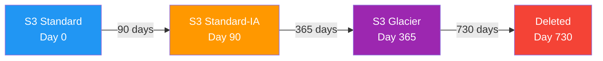

**Common Lifecycle Patterns**:
- **Log files**: Standard -> Standard-IA (30 days) -> Glacier (90 days) -> Delete (365 days)
- **Media assets**: Standard -> Intelligent-Tiering (automatic optimization)
- **Database backups**: Standard -> Glacier Instant (7 days) -> Deep Archive (90 days) -> Delete (7 years)
- **Temporary pipeline data**: Delete after 7 days (what GCC does for ClickHouse export files)

### 1.4 Versioning

When versioning is enabled, S3 keeps every version of every object. Overwrites create new versions; deletes add a "delete marker" rather than removing the object.

```
Object key: assets/profiles/instagram/12345.jpg

Version History:
  v3 (current)  -- 2024-01-15 -- 45KB -- Profile pic updated
  v2            -- 2024-01-01 -- 42KB -- Previous version
  v1            -- 2023-12-15 -- 40KB -- First upload

DELETE operation:
  Delete Marker (current) -- 2024-02-01
  v3                      -- 2024-01-15 -- 45KB (still exists!)
  v2                      -- 2024-01-01 -- 42KB
  v1                      -- 2023-12-15 -- 40KB
```

**Key behaviors**:
- `GET` on an object with a delete marker returns `404`
- `GET` with a specific `versionId` can retrieve any historical version
- To permanently delete, you must specify the exact `versionId`
- MFA Delete adds an extra protection layer requiring MFA to permanently delete versions
- **Versioning cannot be disabled** once enabled -- only suspended (new objects get null version IDs, but existing versions persist)

### 1.5 Pre-signed URLs

Pre-signed URLs grant time-limited access to private S3 objects without exposing AWS credentials:

```python
import boto3
from botocore.config import Config

s3_client = boto3.client('s3', config=Config(signature_version='s3v4'))

# Generate a pre-signed URL valid for 1 hour
url = s3_client.generate_presigned_url(
    'get_object',
    Params={
        'Bucket': 'gcc-social-data',
        'Key': 'assets/profiles/instagram/12345.jpg'
    },
    ExpiresIn=3600  # seconds
)

# Result: https://gcc-social-data.s3.amazonaws.com/assets/profiles/instagram/12345.jpg
#         ?X-Amz-Algorithm=AWS4-HMAC-SHA256
#         &X-Amz-Credential=AKIA.../20240115/ap-south-1/s3/aws4_request
#         &X-Amz-Date=20240115T000000Z
#         &X-Amz-Expires=3600
#         &X-Amz-SignedHeaders=host
#         &X-Amz-Signature=abc123...
```

**How it works under the hood**:
1. The URL embeds the AWS access key ID (not the secret key)
2. A signature is computed using HMAC-SHA256 over the request parameters + secret key
3. S3 recomputes the signature on the server side and checks expiry
4. No IAM policy change needed -- the URL inherits the permissions of the credential used to generate it

**Use cases**:
- **Upload**: Pre-signed POST URLs let clients upload directly to S3 (bypassing your server)
- **Download**: Grant temporary download access to private objects
- **GCC use case**: CloudFront serves public assets; pre-signed URLs were used for admin/debug access to temporary pipeline files

### 1.6 S3 Event Notifications

S3 can trigger actions when objects are created, deleted, or modified:

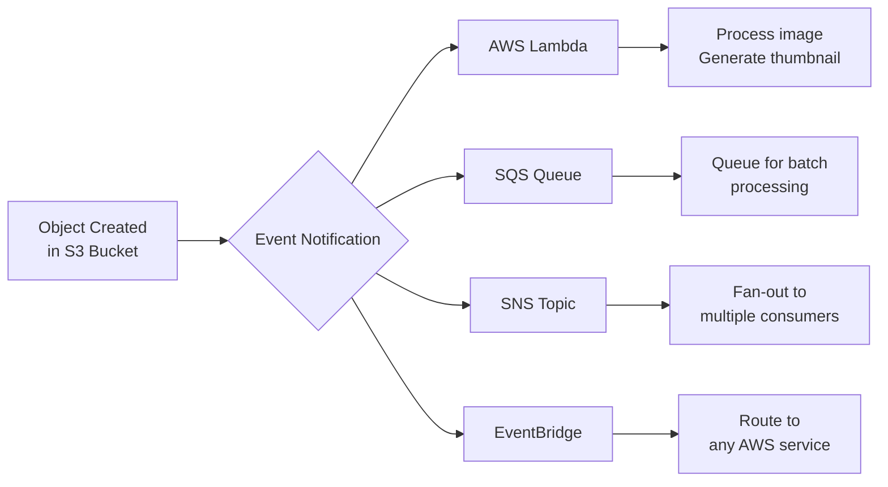

**Supported event types**:
- `s3:ObjectCreated:*` -- any create (PUT, POST, COPY, CompleteMultipartUpload)
- `s3:ObjectRemoved:*` -- any delete (Delete, DeleteMarkerCreated)
- `s3:ObjectRestore:*` -- initiated/completed Glacier restore
- `s3:Replication:*` -- replication events
- `s3:LifecycleTransition` -- lifecycle class transitions

**Filtering**: You can filter by prefix and suffix. For example, trigger Lambda only when `.jpg` files are uploaded to `assets/profiles/`:

```json
{
  "LambdaFunctionConfigurations": [{
    "Events": ["s3:ObjectCreated:*"],
    "Filter": {
      "Key": {
        "FilterRules": [
          {"Name": "prefix", "Value": "assets/profiles/"},
          {"Name": "suffix", "Value": ".jpg"}
        ]
      }
    },
    "LambdaFunctionArn": "arn:aws:lambda:ap-south-1:123:function:process-image"
  }]
}
```

### 1.7 Transfer Acceleration

S3 Transfer Acceleration speeds up uploads by routing data through CloudFront edge locations:

```
Without Acceleration:
  Client (Mumbai) ---[public internet, many hops]---> S3 (us-east-1)
  Latency: variable, potentially slow

With Acceleration:
  Client (Mumbai) ---[short hop]---> CloudFront Edge (Mumbai)
                  ---[AWS backbone network, optimized]---> S3 (us-east-1)
  Latency: faster, consistent
```

**When to use it**: Cross-region uploads where the client is far from the S3 bucket region. NOT useful when client and bucket are in the same region. Adds ~$0.04/GB cost.

**How to enable**:
```python
# Use the accelerate endpoint
s3_client = boto3.client('s3', endpoint_url='https://gcc-social-data.s3-accelerate.amazonaws.com')
```

### 1.8 How Anshul Used S3 at GCC

**Project: 8M Daily Images Pipeline (Beat)**

GCC's Python scraping engine "Beat" processed 8M daily asset uploads -- Instagram/YouTube media files cached in S3 to decouple from platform URL expiry.

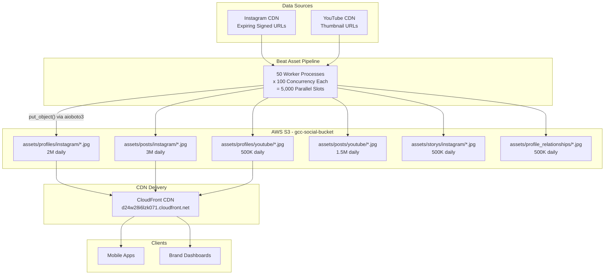

**The actual upload code (from Beat)**:
```python
# beat/core/client/upload_assets.py
async def put(entity_id, entity_type, platform, profile_url, extension):
    # Download from Instagram/YouTube CDN
    response = await asks.get(profile_url)
    if response.text == "URL signature expired":
        raise UrlSignatureExpiredError("URL signature expired")

    content_type = "image/" + extension if extension in ("jpg","png","webp") else "video/mp4"

    # S3 key structure: assets/{entity_type}s/{platform}/{entity_id}.{ext}
    blob_s3_key = f"assets/{entity_type.lower()}s/{platform.lower()}/{entity_id}.{extension}"

    session = aioboto3.Session(region_name='ap-south-1')
    async with session.client('s3') as s3:
        await s3.put_object(
            Body=response.content,
            Bucket=os.environ["AWS_BUCKET"],
            Key=blob_s3_key,
            ContentType=content_type,
            ContentDisposition='inline'
        )
    return blob_s3_key
```

**The S3 key hierarchy**:
```
s3://gcc-social-bucket/
  assets/
    profiles/
      instagram/{profile_id}.jpg       -- 2M profile pictures
      youtube/{channel_id}.jpg          -- 500K channel thumbnails
    posts/
      instagram/{shortcode}.jpg         -- 3M post images
      youtube/{video_id}.jpg            -- 1.5M video thumbnails
    storys/
      instagram/{story_id}.jpg          -- 500K story assets
    profile_relationships/
      instagram/{follower_id}.jpg       -- 500K follower profile pics
```

**Why S3 + CloudFront instead of just using platform URLs**:
1. **URL Expiry**: Instagram CDN URLs use signed signatures that expire. GCC's code explicitly handles `"URL signature expired"` errors.
2. **Rate Independence**: Once in S3, assets are served via CloudFront with zero platform API calls.
3. **Data Sovereignty**: If a platform revokes API access, cached assets remain.
4. **Performance**: CloudFront edge caching provides lower latency than platform CDNs.

**S3 was also used for the fake follower pipeline** -- ClickHouse exported follower data as JSON to S3 (`gcc-social-data/temp/{date}_creator_followers.json`), which push.py then downloaded locally before distributing to SQS.

---

## 2. AWS Lambda

### 2.1 Serverless Computing Concept

Lambda is a **serverless compute service** where you upload code and AWS manages everything else: provisioning, scaling, patching, high availability. You pay only for the compute time consumed (billed per millisecond).

**The mental model**: Lambda is a function-as-a-service. You provide a function. AWS calls your function when events occur. AWS runs 0 to thousands of instances in parallel based on demand.

```
Traditional Server:                  Lambda:
  Always running                       Runs only when triggered
  Pay for idle time                    Pay per invocation + duration
  You manage OS/patches                AWS manages everything
  You scale manually/ASG               AWS scales automatically
  Fixed concurrency capacity           Scales to 1000s concurrently
```

### 2.2 Lambda Execution Model

Every Lambda function has a **handler** -- the entry point AWS invokes:

```python
def handler(event, context):
    """
    event:   Dict containing the trigger data (SQS message, S3 event, API Gateway request, etc.)
    context: Runtime information (function name, memory limit, remaining time, request ID)

    Returns: Response dict (format depends on trigger type)
    """
    # Your business logic here
    return {
        "statusCode": 200,
        "body": json.dumps({"message": "success"})
    }
```

**The `event` object** -- different for every trigger:

```python
# SQS Trigger (what GCC used)
event = {
    "Records": [
        {
            "messageId": "059f36b4-87a3-44ab-83d2-661975830a7d",
            "body": '{"handle":"priya","follower_handle":"xyz123","follower_full_name":"Bot Account"}',
            "attributes": {
                "ApproximateReceiveCount": "1",
                "SentTimestamp": "1545082649636"
            },
            "messageAttributes": {},
            "md5OfBody": "e4e68fb7bd0e697a0ae8f1bb342846b3",
            "eventSource": "aws:sqs",
            "eventSourceARN": "arn:aws:sqs:eu-north-1:123:creator_follower_in"
        }
    ]
}

# S3 Trigger
event = {
    "Records": [
        {
            "s3": {
                "bucket": {"name": "gcc-social-data"},
                "object": {"key": "temp/followers.json", "size": 1024}
            }
        }
    ]
}

# API Gateway Trigger
event = {
    "httpMethod": "POST",
    "path": "/analyze",
    "body": '{"follower_handle":"xyz","follower_full_name":"Test"}',
    "headers": {"Content-Type": "application/json"}
}
```

**The `context` object**:
```python
context.function_name        # "fake-follower-detector"
context.memory_limit_in_mb   # 512
context.get_remaining_time_in_millis()  # Time before timeout
context.aws_request_id       # Unique request ID for tracing
context.log_group_name       # CloudWatch log group
```

### 2.3 Cold Starts vs Warm Starts

This is one of the most commonly asked Lambda interview questions.

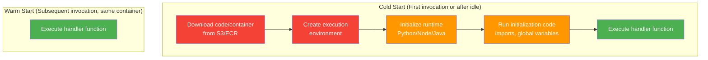

**Cold start timeline**:
```
|--- Download code (~50-500ms) ---|--- Init runtime (~50-200ms) ---|--- Init code (~50-5000ms) ---|--- Handler (~variable) ---|
                                                                                                  ^
                                                                   This is YOUR code running      |
                                                                   outside the handler: imports,   |
                                                                   DB connections, model loading   |
                                                                                                  |
                                                                   For GCC's fake.py:             |
                                                                   - Load 35K baby names CSV      |
                                                                   - Load indictrans models       |
                                                                   - Import numpy, pandas, rapidfuzz
                                                                   Total init: ~2-3 seconds
```

**Cold start duration by runtime**:

| Runtime | Typical Cold Start | Notes |
|---------|-------------------|-------|
| Python | 200-500ms | Moderate, depends on imports |
| Node.js | 100-300ms | Fastest cold starts |
| Java | 500-2000ms | JVM startup overhead |
| .NET | 300-800ms | CLR startup |
| **Container (ECR)** | **1000-5000ms** | **Largest cold start. GCC used this.** |

**Strategies to mitigate cold starts**:

1. **Provisioned Concurrency** -- Pre-warm N instances that are always ready. Costs money but eliminates cold starts.
   ```
   aws lambda put-provisioned-concurrency-config \
     --function-name fake-follower-detector \
     --provisioned-concurrent-executions 10
   ```

2. **Keep functions warm** -- Ping the function on a schedule (CloudWatch Events every 5 minutes). Keeps one container warm but does not help with scaling bursts.

3. **Minimize package size** -- Smaller deployment packages download faster. Use Lambda Layers for shared dependencies.

4. **Choose faster runtimes** -- Node.js/Python start faster than Java/.NET. If latency matters, avoid JVM.

5. **Move initialization outside handler** -- Load models, open connections at module level. They persist across warm invocations:
   ```python
   # This runs ONCE during cold start, reused across warm invocations
   import pandas as pd
   name_data = pd.read_csv('baby_names.csv')  # 35K names loaded once

   def handler(event, context):
       # This runs every invocation, but name_data is already loaded
       result = check_indian_names(name_data, event['name'])
       return result
   ```

6. **Use SnapStart (Java only)** -- AWS snapshots the initialized JVM and restores from snapshot.

**GCC's situation**: The fake follower Lambda used ECR containers (Docker) because the indictrans library requires Cython compilation, pre-trained HMM models (.npy files), and a 35K-name CSV. Total package exceeded Lambda's 50MB zip limit. ECR containers support up to 10GB but have the longest cold starts (~3-5 seconds). This was acceptable because the pipeline was batch-oriented (not real-time API), and once warm, each invocation was fast.

### 2.4 Lambda Triggers

Lambda can be triggered by over 200 AWS services. The most important ones:

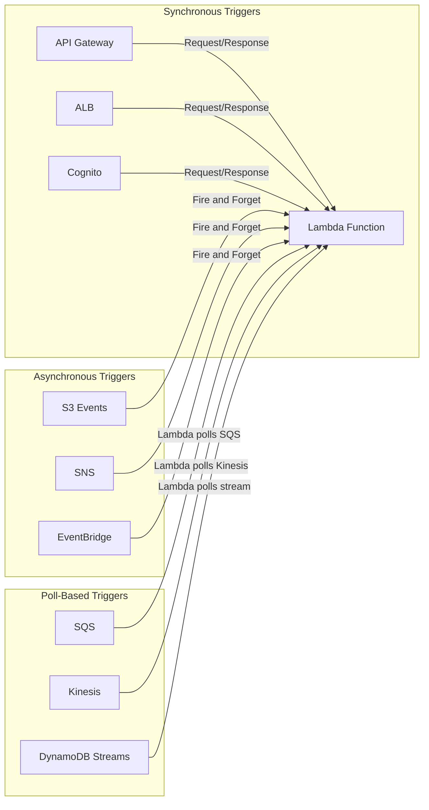

**Key distinction**: With poll-based triggers (SQS, Kinesis, DynamoDB Streams), Lambda has an internal poller called the **Event Source Mapping** that continuously reads from the source and invokes your function with batches of records.

| Trigger Type | Invocation | Retry Behavior | Batch Support |
|-------------|-----------|----------------|---------------|
| API Gateway | Synchronous | No retry (returns error to client) | No |
| S3 Event | Asynchronous | 2 retries with backoff | No |
| SQS | Poll-based | Message returns to queue after visibility timeout | Yes (up to 10 messages/batch) |
| Kinesis | Poll-based | Retries entire batch until success or record expires | Yes (up to 10,000 records/batch) |
| EventBridge | Asynchronous | 2 retries with backoff | No |
| SNS | Asynchronous | 3 retries | No |

**GCC used SQS as the trigger**: SQS messages containing follower data were polled by Lambda's Event Source Mapping. Each invocation received a batch of messages (typically 1 at a time for GCC's use case), processed them through the 5-feature ensemble, and wrote results to Kinesis.

### 2.5 Concurrency Model

Lambda concurrency = number of simultaneous function executions.

```
Account-level default limit:     1,000 concurrent executions (can request increase)
Per-function unreserved:          Shared pool from account limit
Per-function reserved:            Guaranteed minimum for this function
Per-function provisioned:         Pre-warmed, always-ready instances (subset of reserved)

Example:
  Account limit: 1,000
  Function A: Reserved = 200  (always gets 200, never more)
  Function B: Reserved = 100  (always gets 100, never more)
  Function C: Unreserved       (shares remaining 700 with all other unreserved functions)
```

**Reserved Concurrency** -- guarantees capacity for a function, prevents it from consuming all account capacity:
```python
aws lambda put-function-concurrency \
    --function-name fake-follower-detector \
    --reserved-concurrent-executions 200
```

**Provisioned Concurrency** -- pre-initializes execution environments (eliminates cold starts):
```python
aws lambda put-provisioned-concurrency-config \
    --function-name fake-follower-detector \
    --qualifier production \
    --provisioned-concurrent-executions 50
```

**Throttling**: When concurrency limit is reached, new invocations get throttled:
- Synchronous: Returns `429 Too Many Requests`
- Asynchronous: Retries with backoff for up to 6 hours
- Poll-based (SQS): Scales back polling, messages stay in queue

### 2.6 Lambda Layers

Layers let you package shared libraries/dependencies separately from your function code:

```
Without Layers:
  Each function zip includes numpy, pandas, boto3, etc.
  3 functions x 50MB each = 150MB total storage

With Layers:
  Layer 1: numpy + pandas (40MB) -- shared by all functions
  Layer 2: boto3 (8MB) -- shared by all functions
  Function 1: 2MB (just your code)
  Function 2: 3MB (just your code)
  Function 3: 1MB (just your code)
  Total: 40 + 8 + 2 + 3 + 1 = 54MB
```

**Limits**: Up to 5 layers per function, total unzipped size (function + all layers) must be under 250MB. For GCC, this was not enough -- the indictrans models alone were large -- which is why they used ECR containers instead.

### 2.7 Best Practices

| Practice | Why | Example |
|----------|-----|---------|
| Keep functions small and focused | Easier to test, debug, and scale independently | One function per follower, not entire batch |
| Use environment variables | No secrets in code; easy to change per environment | `os.environ["AWS_BUCKET"]` |
| Initialize outside handler | Resources persist across warm invocations | Load CSV once at module level |
| Set appropriate timeout | Prevent runaway executions (max 15 min) | Set to 30s for quick ML inference |
| Set appropriate memory | More memory = more CPU (linear correlation) | 512MB for ML workload |
| Use structured logging | Enables CloudWatch Insights queries | `json.dumps({"follower": handle, "score": 0.33})` |
| Handle partial failures | SQS batch: report individual message failures | Return `batchItemFailures` |
| Idempotent handlers | Messages may be delivered more than once | Same input always produces same output |

### 2.8 How Anshul Used Lambda at GCC

**Project: ML Fake Follower Detection Pipeline**

Lambda was the compute engine for the fake follower detection system. Each Lambda invocation processed ONE follower record through the 5-feature ML ensemble.

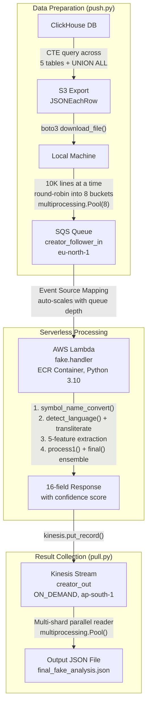

**The actual Lambda handler**:
```python
# fake.py - Lambda handler
def handler(event, context):
    response = model(event)  # Run full 5-feature ensemble
    print(response)
    sqs = session.resource('sqs', region_name='eu-north-1')
    queue = sqs.get_queue_by_name(QueueName='output_queue')
    response = queue.send_message(MessageBody=json.dumps(response))
    return {
        "statusCode": 200,
        "body": {"message": response}
    }
```

**Why Lambda for this use case**:
1. **Embarrassingly parallel**: Each follower is independent -- perfect for Lambda's scaling model
2. **Bursty workload**: Run once per analysis request, not continuously. Pay-per-use makes sense.
3. **Auto-scaling**: If 100,000 messages in SQS, AWS spins up hundreds of Lambda containers
4. **50% speed improvement**: Before = sequential single-machine processing. After = massively parallel serverless. Cut total batch processing time in half.

**Why ECR container instead of ZIP deployment**:
- indictrans library requires Cython compilation (needs gcc-c++)
- Pre-trained HMM model files (.npy) for 10 languages
- 35,183-name CSV database
- Total package exceeds Lambda's 50MB zip limit
- ECR containers support up to 10GB

---

## 3. AWS SQS (Simple Queue Service)

### 3.1 Core Concepts

SQS is a fully managed message queuing service. It decouples producers from consumers -- the producer sends a message, it sits in the queue, and a consumer processes it later.

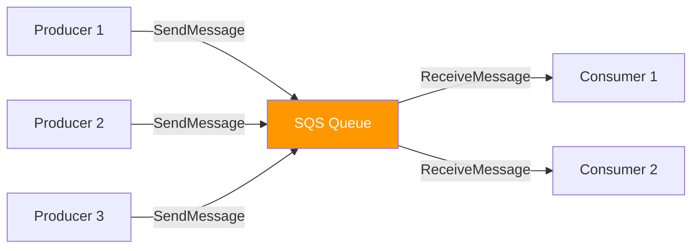

**Key properties**:
- **At-least-once delivery**: Messages are delivered at least once, possibly more
- **Best-effort ordering** (Standard): Messages may arrive out of order
- **Unlimited throughput** (Standard): No limit on messages/second
- **Message retention**: 1 minute to 14 days (default 4 days)
- **Message size**: Up to 256KB (use S3 for larger payloads via Extended Client Library)

### 3.2 Standard vs FIFO Queues

| Feature | Standard Queue | FIFO Queue |
|---------|---------------|------------|
| **Throughput** | Unlimited | 300 msg/s (3,000 with batching) |
| **Ordering** | Best-effort (may be out of order) | Strict FIFO within message group |
| **Delivery** | At-least-once (duplicates possible) | Exactly-once (5-min dedup window) |
| **Use case** | High throughput, order not critical | Order matters, no duplicates |
| **Cost** | Lower | Higher (~25% more) |
| **Queue name** | Any name | Must end in `.fifo` |
| **GCC used** | Standard (for fake follower pipeline) | Not used |

**When to choose Standard**: You need maximum throughput and can handle occasional duplicate or out-of-order messages. Your consumer is idempotent.

**When to choose FIFO**: You need strict ordering (e.g., financial transactions, event sourcing) or exactly-once processing (e.g., deduplicating API calls).

### 3.3 Visibility Timeout

The visibility timeout is the period during which SQS prevents other consumers from receiving and processing a message that is already being processed.

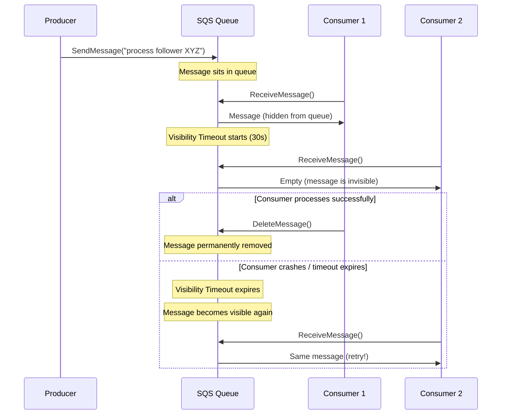

**Default**: 30 seconds. **Range**: 0 seconds to 12 hours.

**Best practice**: Set visibility timeout to at least 6x your expected processing time. If processing takes 5 seconds, set visibility timeout to 30 seconds. This gives enough buffer for retries and transient delays.

**GCC configuration**:
```python
queue = sqs.create_queue(
    QueueName='creator_follower_in',
    Attributes={
        'MaximumMessageSize': '262144',      # 256 KB
        'MessageRetentionPeriod': '345600',   # 4 days
        'VisibilityTimeout': '30'             # 30 seconds
    }
)
```

### 3.4 Dead Letter Queues (DLQ)

A DLQ is a queue that receives messages that cannot be processed successfully after a specified number of attempts. It prevents poison messages from blocking the queue.

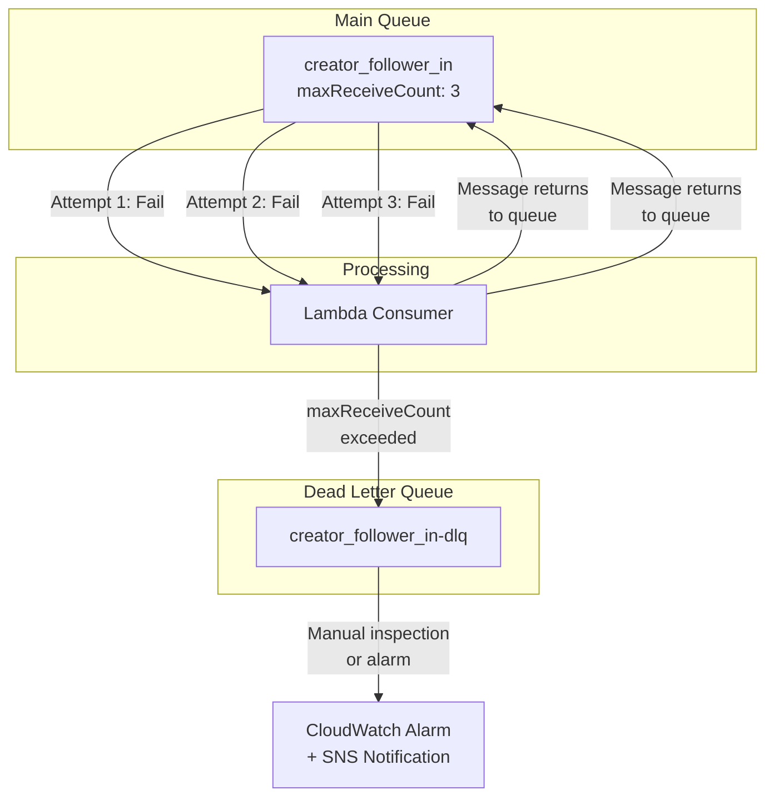

**Configuration**:
```json
{
  "RedrivePolicy": {
    "deadLetterTargetArn": "arn:aws:sqs:eu-north-1:123:creator_follower_in-dlq",
    "maxReceiveCount": 3
  }
}
```

**DLQ best practices**:
- Set `maxReceiveCount` based on your retry strategy (typically 3-5)
- Set up CloudWatch alarms on DLQ depth -- a growing DLQ indicates a systematic problem
- DLQ retention should be longer than main queue (14 days) to give time for investigation
- **Redrive**: SQS supports DLQ redrive -- move messages back to the main queue after fixing the bug

### 3.5 Long Polling vs Short Polling

```
Short Polling (default):
  Consumer: "Any messages?" --> SQS: "No" (returns immediately, possibly empty)
  Consumer: "Any messages?" --> SQS: "No"
  Consumer: "Any messages?" --> SQS: "Yes! Here's 1 message"
  Problem: Many empty responses, wasted API calls, higher cost

Long Polling (WaitTimeSeconds > 0):
  Consumer: "Any messages? I'll wait up to 20 seconds" --> SQS waits...
  ...10 seconds pass, message arrives...
  SQS: "Here's 1 message"
  Benefit: Fewer empty responses, lower cost, lower latency
```

**Configuration**:
```python
# Short polling (default)
response = sqs.receive_message(QueueUrl=queue_url)

# Long polling (recommended)
response = sqs.receive_message(
    QueueUrl=queue_url,
    WaitTimeSeconds=20,    # Wait up to 20 seconds for messages
    MaxNumberOfMessages=10  # Receive up to 10 messages per call
)
```

**Best practice**: Always use long polling (`WaitTimeSeconds=20`). It reduces the number of empty responses by 99%+, reduces cost (fewer API calls), and reduces latency (immediate response when a message is available).

### 3.6 Message Deduplication (FIFO Queues)

FIFO queues provide exactly-once processing through deduplication:

**Content-based deduplication**: SQS computes SHA-256 hash of the message body. Identical messages within the 5-minute deduplication window are rejected.

```python
# Enable content-based deduplication
queue = sqs.create_queue(
    QueueName='orders.fifo',
    Attributes={
        'FifoQueue': 'true',
        'ContentBasedDeduplication': 'true'
    }
)

# Or provide explicit deduplication ID
sqs.send_message(
    QueueUrl=queue_url,
    MessageBody='{"order_id": 123, "amount": 50.00}',
    MessageGroupId='customer-456',         # Required for FIFO
    MessageDeduplicationId='order-123-v1'   # Explicit dedup ID
)
```

**Message Group ID**: FIFO queues guarantee ordering within a message group, not across the entire queue. Different message groups can be processed in parallel:

```
Message Group "customer-A":  msg1 -> msg2 -> msg3  (strictly ordered)
Message Group "customer-B":  msg4 -> msg5 -> msg6  (strictly ordered)
Processing: msg1 and msg4 can be processed simultaneously!
```

### 3.7 Delay Queues

Delay queues postpone delivery of new messages for a specified period:

```python
# Queue-level delay (applies to ALL messages)
queue = sqs.create_queue(
    QueueName='delayed-processing',
    Attributes={
        'DelaySeconds': '900'  # 15 minutes delay for all messages
    }
)

# Per-message delay (overrides queue-level, Standard queues only)
sqs.send_message(
    QueueUrl=queue_url,
    MessageBody='{"task": "send_reminder_email"}',
    DelaySeconds=3600  # 1 hour delay for this specific message
)
```

**Use cases**: Scheduled tasks, rate limiting, retry with backoff, "process after X time" patterns.

### 3.8 SQS vs Kafka vs RabbitMQ Comparison

This is a very common interview question. Here is a detailed comparison:

| Feature | AWS SQS | Apache Kafka | RabbitMQ |
|---------|---------|-------------|----------|
| **Type** | Managed queue service | Distributed log/stream | Message broker |
| **Model** | Queue (message consumed once) | Log (message retained, multiple consumers) | Queue + Pub/Sub |
| **Ordering** | Best-effort (Standard) / FIFO | Per-partition ordering | Per-queue FIFO |
| **Retention** | Up to 14 days, deleted on consumption | Configurable (days/weeks/forever) | Until acknowledged |
| **Throughput** | ~unlimited (Standard) | Millions msg/sec | ~50K msg/sec |
| **Replay** | No (message deleted after processing) | Yes (consumers can rewind offset) | No (ACKed messages gone) |
| **Consumer Groups** | No (but multiple consumers compete) | Yes (parallel consumption) | Yes (competing consumers) |
| **Exactly-once** | FIFO queues only | With transactions (Kafka 0.11+) | With publisher confirms + consumer ACKs |
| **Scaling** | Automatic | Manual (add partitions/brokers) | Manual (add nodes) |
| **Operations** | Zero (fully managed) | High (ZooKeeper/KRaft, brokers, topics) | Medium (Erlang, clustering) |
| **Cost model** | Per request | Infrastructure (EC2/MSK) | Infrastructure |
| **Dead letter** | Built-in DLQ | No built-in (custom implementation) | Built-in DLQ |
| **Use case** | Decoupling, task queues, fan-out | Event streaming, event sourcing, log aggregation | Complex routing, RPC, workflows |

**When to use which**:

```
Choose SQS when:
  - You need a simple queue with minimal operational overhead
  - You want fully managed with automatic scaling
  - Message replay is not needed
  - AWS-native integration (Lambda trigger)

Choose Kafka when:
  - You need message replay (consumers re-read old messages)
  - You need multiple consumer groups reading the same stream
  - Extreme throughput requirements (millions msg/sec)
  - Event sourcing / event-driven architecture
  - You can handle operational complexity (or use MSK)

Choose RabbitMQ when:
  - You need complex routing (topic, fanout, headers exchange)
  - You need RPC-style request/reply patterns
  - You need priority queues
  - You are already in the RabbitMQ ecosystem
  - GCC used RabbitMQ for inter-service communication (Beat -> Event-gRPC)
```

**GCC's choice rationale**: SQS was chosen for the fake follower pipeline because (1) it integrates natively as a Lambda trigger, (2) zero operational overhead, (3) auto-scales with queue depth, and (4) messages do not need replay. RabbitMQ was used elsewhere at GCC (Beat -> Event-gRPC) for complex routing patterns with 11 exchanges and 26+ queues.

### 3.9 SQS Message Flow Diagram

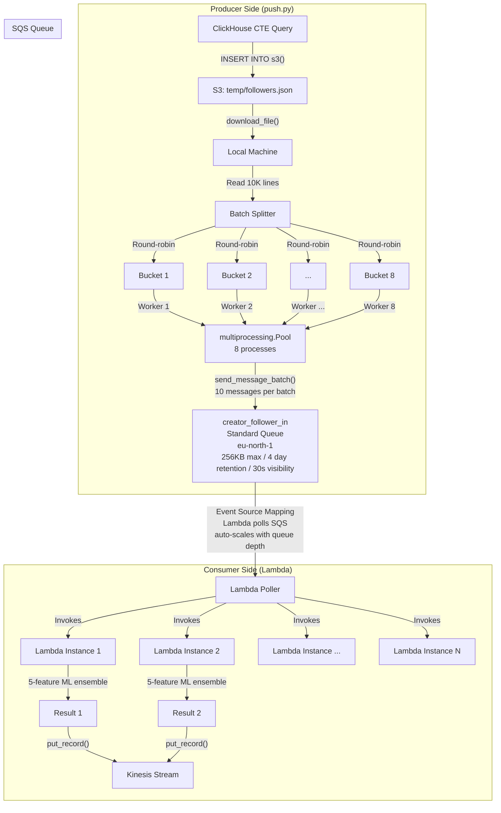

---

## 4. AWS Kinesis

### 4.1 Kinesis Overview

Kinesis is a managed service for collecting, processing, and analyzing **real-time streaming data**. Think of it as managed Apache Kafka (with key differences).

The Kinesis family has four services:

| Service | Purpose | Analogy |
|---------|---------|---------|
| **Kinesis Data Streams** | Real-time data streaming | Kafka topics |
| **Kinesis Data Firehose** | Load streaming data into data stores | Kafka Connect sink |
| **Kinesis Data Analytics** | Real-time SQL/Flink processing on streams | Kafka Streams / ksqlDB |
| **Kinesis Video Streams** | Stream and process video | Specialized |

### 4.2 Kinesis Data Streams -- Deep Dive

A Kinesis Data Stream is an ordered sequence of data records organized into **shards**.

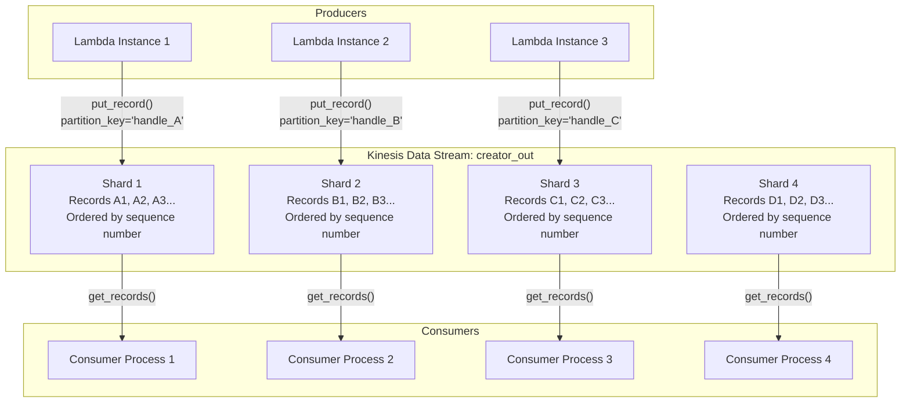

**Key concepts**:

**Shard**: The unit of capacity in a Kinesis stream. Each shard provides:
- **Write**: 1,000 records/sec or 1 MB/sec (whichever limit is hit first)
- **Read**: 5 reads/sec, up to 2 MB/sec (shared across all consumers on that shard)
- **Enhanced fan-out read**: 2 MB/sec per consumer per shard (dedicated throughput)

**Partition Key**: A string that determines which shard receives the record. Kinesis computes MD5 hash of the partition key and maps it to a shard's hash key range. Records with the same partition key always go to the same shard, preserving order for that key.

```python
# Writing to Kinesis
kinesis_client.put_record(
    StreamName='creator_out',
    Data=json.dumps(result).encode('utf-8'),
    PartitionKey=follower_handle  # Same handle always goes to same shard
)
```

**Sequence Number**: Unique, increasing identifier assigned to each record within a shard. This is how ordering is maintained -- records in a shard are strictly ordered by sequence number.

**Retention**: 24 hours default, up to 365 days (with extended retention pricing).

### 4.3 Kinesis Data Streams vs Kinesis Data Firehose

| Feature | Kinesis Data Streams | Kinesis Data Firehose |
|---------|---------------------|----------------------|
| **Purpose** | Real-time streaming with custom consumers | Load data into destinations automatically |
| **Consumers** | Custom applications (KCL, Lambda, SDK) | Built-in: S3, Redshift, Elasticsearch, Splunk |
| **Latency** | ~200ms (real-time) | 60-900 seconds (near-real-time, buffered) |
| **Scaling** | Manual (add shards) or On-Demand | Automatic |
| **Data transformation** | Custom consumer code | Optional Lambda transformation |
| **Replay** | Yes (within retention period) | No |
| **Cost model** | Per shard-hour + per PUT | Per GB ingested |
| **Ordering** | Per-shard ordering guaranteed | No ordering guarantee |
| **Use case** | Custom real-time processing | ETL to data lakes/warehouses |

**GCC used Kinesis Data Streams** (`creator_out`, ON_DEMAND mode) because they needed custom multi-shard parallel reading with `pull.py`, not automatic delivery to a destination.

### 4.4 Shards and Partition Keys -- In Depth

```
Stream: creator_out (4 shards)

Hash Key Range (0 to 2^128 - 1):
  Shard 0: [0, 2^126)          -- handles "aaa" through "ddd"
  Shard 1: [2^126, 2^127)      -- handles "eee" through "mmm"
  Shard 2: [2^127, 3*2^126)    -- handles "nnn" through "rrr"
  Shard 3: [3*2^126, 2^128)    -- handles "sss" through "zzz"

When you call put_record(PartitionKey="priya_sharma"):
  1. Kinesis computes MD5("priya_sharma") = 0x7A3F...
  2. Maps hash to shard range -> Shard 2
  3. Record appended to Shard 2 with new sequence number
  4. All records for "priya_sharma" go to Shard 2 (ordered)
```

**Hot shard problem**: If most partition keys hash to the same shard, that shard becomes a bottleneck. Solutions:
1. Use high-cardinality partition keys (e.g., unique follower handles, not creator handles)
2. Add random suffix to partition key if per-key ordering is not needed
3. Use more shards to distribute the hash space

**Shard splitting and merging**:
```
Before: Shard 1 [0, 2^127)  -- hot shard, hitting 1MB/s limit

Split:
  Shard 1a [0, 2^126)       -- half the traffic
  Shard 1b [2^126, 2^127)   -- half the traffic

Merge (opposite):
  Shard 2 [2^127, 3*2^126)  -- underutilized
  Shard 3 [3*2^126, 2^128)  -- underutilized
  -> Merged Shard [2^127, 2^128)  -- combined
```

**On-Demand mode** (what GCC used): AWS automatically manages shard count based on traffic. No need to manually split/merge. Costs more per GB but eliminates capacity planning.

### 4.5 Kinesis vs Kafka Comparison

| Feature | AWS Kinesis Data Streams | Apache Kafka |
|---------|------------------------|-------------|
| **Unit of parallelism** | Shard | Partition |
| **Write throughput per unit** | 1 MB/s or 1000 records/s | No inherent limit (disk/network bound) |
| **Read throughput per unit** | 2 MB/s (shared) or 2 MB/s per consumer (enhanced fan-out) | No inherent limit |
| **Ordering** | Per-shard | Per-partition |
| **Retention** | 24h-365d | Configurable (no hard limit) |
| **Consumer groups** | No native concept (use KCL for coordination) | Native consumer group support |
| **Replay** | Yes (per-shard iterator) | Yes (per-partition offset) |
| **Compaction** | No | Yes (log compaction for latest-value semantics) |
| **Operations** | Zero (fully managed) | High (brokers, ZooKeeper/KRaft) |
| **Scaling** | Add/remove shards (or On-Demand) | Add partitions (cannot remove) |
| **Cross-region** | No native (use Lambda for replication) | MirrorMaker 2 |
| **Cost** | Per shard-hour + per PUT | Infrastructure (EC2/EBS) |
| **Transactions** | No | Yes (Kafka 0.11+) |
| **Schema registry** | No native | Confluent Schema Registry |

**When to choose Kinesis**: You want zero operations, moderate throughput, and you are already in AWS. Good for Lambda integration and simple streaming patterns.

**When to choose Kafka**: You need extreme throughput, log compaction, multi-datacenter replication, complex stream processing, or you want to avoid vendor lock-in.

### 4.6 Enhanced Fan-Out

Without enhanced fan-out, all consumers on a shard share the 2 MB/s read throughput:

```
Standard (shared):
  Shard 1 (2 MB/s total read)
    Consumer A: ~666 KB/s
    Consumer B: ~666 KB/s
    Consumer C: ~666 KB/s
    Problem: Consumers compete for throughput

Enhanced Fan-Out (dedicated):
  Shard 1
    Consumer A: 2 MB/s (dedicated, push-based)
    Consumer B: 2 MB/s (dedicated, push-based)
    Consumer C: 2 MB/s (dedicated, push-based)
    Total read: 6 MB/s from one shard
```

**How it works**: Instead of consumers polling (GetRecords), enhanced fan-out uses HTTP/2 push (SubscribeToShard). Each registered consumer gets a dedicated 2 MB/s pipe per shard.

**Cost**: Additional per shard-hour + per GB retrieved. Use when you have multiple consumers needing real-time access to the same stream.

### 4.7 Kinesis Data Analytics

SQL or Apache Flink processing on streaming data:

```sql
-- Example: Real-time fake follower score aggregation
CREATE OR REPLACE STREAM "AGGREGATED_OUTPUT" (
    creator_handle VARCHAR(256),
    avg_fake_score DOUBLE,
    total_followers INTEGER,
    fake_count INTEGER
);

CREATE OR REPLACE PUMP "AGGREGATE_PUMP" AS
INSERT INTO "AGGREGATED_OUTPUT"
SELECT STREAM
    "creator_handle",
    AVG("fake_score") as avg_fake_score,
    COUNT(*) as total_followers,
    SUM(CASE WHEN "fake_score" > 0.5 THEN 1 ELSE 0 END) as fake_count
FROM "SOURCE_STREAM"
GROUP BY "creator_handle", STEP("SOURCE_STREAM".ROWTIME BY INTERVAL '1' MINUTE);
```

**Use case**: If GCC wanted real-time aggregation of fake follower scores instead of batch collection, Kinesis Analytics could compute per-creator fake percentages as results stream in.

### 4.8 Ordering Guarantees

**Per-shard ordering**: Records within a single shard are strictly ordered by sequence number. Records across shards have no ordering guarantee.

```
Shard 1: A1 (seq 001) -> A2 (seq 002) -> A3 (seq 003)   -- strictly ordered
Shard 2: B1 (seq 001) -> B2 (seq 002) -> B3 (seq 003)   -- strictly ordered

Cross-shard: A1 might be processed after B3. No guarantee.
```

**Implication**: If you need global ordering, use a single shard (limits throughput to 1 MB/s write). If you need ordering per entity (e.g., per creator), use the entity ID as the partition key.

**GCC's approach**: Partition key was the follower handle. All records for the same follower went to the same shard, ensuring that if a follower was analyzed multiple times, results arrived in order. But ordering across different followers was not guaranteed (and not needed).

### 4.9 Kinesis Architecture Diagram

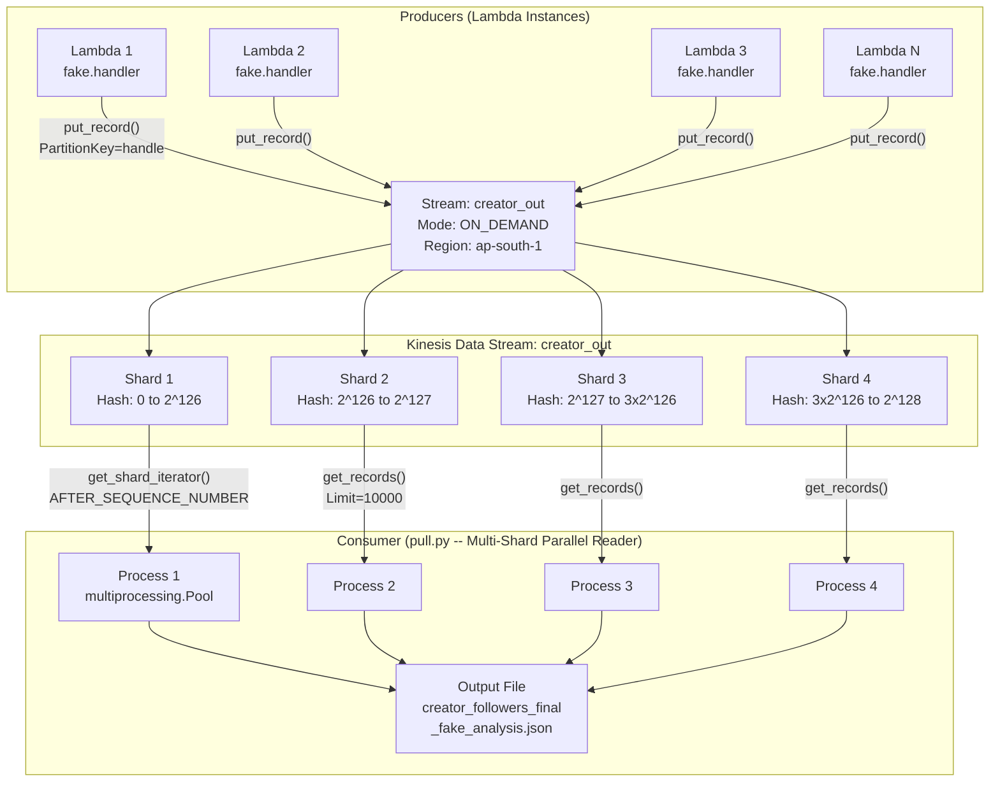

**The actual consumer code (pull.py)**:
```python
def process_shard(shard_id, starting_sequence_number):
    shard_iterator = client.get_shard_iterator(
        StreamName=stream_name,
        ShardId=shard_id,
        ShardIteratorType='AFTER_SEQUENCE_NUMBER',
        StartingSequenceNumber=starting_sequence_number
    )['ShardIterator']

    while True:
        response = client.get_records(ShardIterator=shard_iterator, Limit=10000)
        if len(response['Records']) < 1:
            break
        shard_iterator = response['NextShardIterator']
        # Process records...

if __name__ == '__main__':
    pool = Pool()
    shards = client.list_shards(StreamName=stream_name)['Shards']
    args = [(shard['ShardId'], shard['SequenceNumberRange']['StartingSequenceNumber'])
            for shard in shards]
    pool.starmap(process_shard, args)
```

---

## 5. AWS EC2 (Elastic Compute Cloud)

### 5.1 Core Concepts

EC2 provides resizable virtual servers (instances) in the cloud. You choose the instance type (CPU, memory, storage, network), operating system, and pay by the second.

### 5.2 Instance Types

Instance types are named using the pattern: **[Family][Generation].[Size]**

Example: `c5.2xlarge` = Compute-optimized, 5th gen, 2x-large

| Family | Optimized For | Use Cases | Example Types |
|--------|--------------|-----------|---------------|
| **t** (burstable) | General purpose, cost-effective | Dev/test, small apps, microservices | t3.micro, t3.small |
| **m** (general) | Balanced compute/memory/network | Web servers, app servers, mid-size DBs | m5.large, m6i.xlarge |
| **c** (compute) | High CPU performance | Batch processing, ML inference, gaming | c5.2xlarge, c6g.4xlarge |
| **r** (memory) | High memory | In-memory DBs, real-time analytics | r5.xlarge, r6g.2xlarge |
| **i** (storage) | High sequential I/O, NVMe SSD | Databases, data warehouses | i3.xlarge, i3en.large |
| **p/g** (accelerated) | GPU compute | ML training, video encoding | p3.2xlarge, g4dn.xlarge |
| **d** (dense storage) | High disk throughput, HDD | Hadoop, data lakes | d2.xlarge |

**Size progression** (using m5 as example):
```
m5.large:    2 vCPU,   8 GB RAM
m5.xlarge:   4 vCPU,  16 GB RAM
m5.2xlarge:  8 vCPU,  32 GB RAM
m5.4xlarge: 16 vCPU,  64 GB RAM
m5.8xlarge: 32 vCPU, 128 GB RAM
m5.16xlarge:64 vCPU, 256 GB RAM
m5.24xlarge:96 vCPU, 384 GB RAM
```

**Processor suffixes**:
- No suffix: Intel
- `a`: AMD (cheaper, e.g., m5a.xlarge)
- `g`: Graviton/ARM (best price-performance, e.g., m6g.xlarge)

### 5.3 Pricing Models

| Model | Discount | Commitment | Best For |
|-------|----------|------------|----------|
| **On-Demand** | None (full price) | None | Development, unpredictable workloads |
| **Reserved Instances** | Up to 72% off | 1 or 3 year | Steady-state production workloads |
| **Savings Plans** | Up to 72% off | 1 or 3 year ($/hr commitment) | Flexible across instance types |
| **Spot Instances** | Up to 90% off | None (can be interrupted with 2-min warning) | Fault-tolerant batch processing, CI/CD |
| **Dedicated Hosts** | Varies | Hourly or reserved | Compliance, licensing (bring-your-own-license) |

**Spot Instance strategy**:
```
Spot is ideal when:
  - Workload is fault-tolerant (can handle interruption)
  - Workload is flexible (can run on multiple instance types)
  - You can checkpoint progress

Spot interruption handling:
  1. AWS sends 2-minute warning via instance metadata
  2. Application should checkpoint current state
  3. Spot Fleet/ASG can launch replacement from different instance type/AZ

Spot + On-Demand hybrid (recommended):
  Auto Scaling Group:
    - Base capacity: 2 On-Demand instances (always running)
    - Scale-out: Spot instances (up to 10 additional)
    - Instance types: c5.xlarge, c5a.xlarge, c5d.xlarge, m5.xlarge (diversify!)
```

### 5.4 Auto Scaling Groups (ASG)

ASGs automatically adjust the number of EC2 instances based on demand:

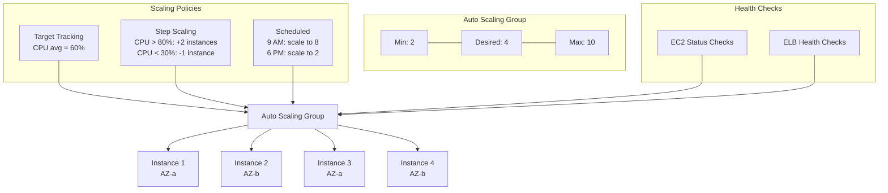

**Scaling policy types**:

1. **Target Tracking** (recommended): Maintain a metric at a target value
   ```
   Metric: Average CPU Utilization
   Target: 60%
   ASG automatically adds/removes instances to keep CPU at ~60%
   ```

2. **Step Scaling**: Define steps based on alarm thresholds
   ```
   CPU > 80%: Add 2 instances
   CPU > 90%: Add 4 instances
   CPU < 30%: Remove 1 instance
   ```

3. **Scheduled Scaling**: Scale at specific times
   ```
   Every weekday at 8 AM: Set desired capacity to 8
   Every weekday at 7 PM: Set desired capacity to 2
   ```

4. **Predictive Scaling**: ML-based, forecasts demand from historical patterns

**Cooldown period**: After a scaling action, the ASG waits (default 300 seconds) before allowing another scaling action. Prevents thrashing.

### 5.5 Security Groups

Security groups are stateful virtual firewalls for EC2 instances:

```
Security Group: sg-webserver
  Inbound Rules:
    Port 80  (HTTP)  from 0.0.0.0/0          -- Allow all HTTP
    Port 443 (HTTPS) from 0.0.0.0/0          -- Allow all HTTPS
    Port 22  (SSH)   from 10.0.0.0/16         -- Allow SSH from VPC only

  Outbound Rules:
    All traffic to 0.0.0.0/0                   -- Allow all outbound (default)

Security Group: sg-database
  Inbound Rules:
    Port 5432 (PostgreSQL) from sg-webserver   -- Only allow from web servers
    Port 5432 (PostgreSQL) from sg-lambda      -- Only allow from Lambda

  Outbound Rules:
    All traffic to 0.0.0.0/0
```

**Key properties**:
- **Stateful**: If you allow inbound traffic on port 80, the response traffic is automatically allowed outbound (no explicit outbound rule needed)
- **Allow-only**: You can only create ALLOW rules, not DENY rules. Anything not explicitly allowed is denied.
- **Instance-level**: Applied to individual instances (vs. NACLs which are subnet-level)
- **Can reference other security groups**: "Allow traffic from instances in sg-webserver" instead of hardcoding IP addresses

### 5.6 EBS Volumes

Elastic Block Store provides persistent block storage for EC2:

| Volume Type | Use Case | IOPS | Throughput | Size |
|-------------|----------|------|-----------|------|
| **gp3** (General Purpose SSD) | Most workloads | 3,000 baseline (up to 16,000) | 125 MB/s (up to 1,000 MB/s) | 1 GB - 16 TB |
| **gp2** (General Purpose SSD) | Legacy, replaced by gp3 | 3,000 baseline (scales with size) | 128-250 MB/s | 1 GB - 16 TB |
| **io2** (Provisioned IOPS SSD) | Critical databases | Up to 64,000 | Up to 1,000 MB/s | 4 GB - 16 TB |
| **st1** (Throughput Optimized HDD) | Big data, data warehouses | 500 baseline | 500 MB/s | 125 GB - 16 TB |
| **sc1** (Cold HDD) | Infrequent access | 250 baseline | 250 MB/s | 125 GB - 16 TB |

**Snapshots**: Point-in-time backups of EBS volumes stored in S3. Incremental (only changed blocks are stored). Can be used to create new volumes or copy across regions.

---

## 6. Other AWS Services (Brief)

### 6.1 CloudFront (CDN)

CloudFront is AWS's Content Delivery Network. It caches content at 400+ edge locations worldwide.

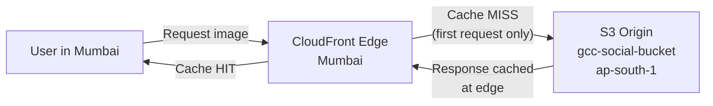

**GCC usage**: CloudFront distribution `d24w28i6lzk071.cloudfront.net` served all 8M daily cached assets from S3. Instead of clients hitting S3 directly (single region), CloudFront served from the nearest edge location -- reducing latency from ~200ms to ~20ms for most Indian users.

**Key concepts**:
- **Origin**: Where CloudFront fetches content (S3, EC2, ALB, custom origin)
- **Distribution**: A CloudFront deployment with its own domain (d123.cloudfront.net)
- **TTL**: How long content is cached at edge (seconds). Controlled by Cache-Control headers or CloudFront policy.
- **Invalidation**: Force-remove cached objects before TTL expires. Costs $0.005 per path invalidated.
- **Origin Access Identity (OAI)**: Restricts S3 access to CloudFront only (bucket is not publicly accessible)

### 6.2 IAM (Identity and Access Management)

IAM controls who can do what in your AWS account.

**Core components**:
- **Users**: Individual people/applications with long-term credentials
- **Groups**: Collections of users sharing the same permissions
- **Roles**: Temporary credentials assumed by services/users (preferred over users for services)
- **Policies**: JSON documents defining permissions (what actions on what resources)

```json
{
  "Version": "2012-10-17",
  "Statement": [
    {
      "Effect": "Allow",
      "Action": [
        "s3:GetObject",
        "s3:PutObject"
      ],
      "Resource": "arn:aws:s3:::gcc-social-data/*"
    },
    {
      "Effect": "Allow",
      "Action": [
        "sqs:SendMessage",
        "sqs:ReceiveMessage",
        "sqs:DeleteMessage"
      ],
      "Resource": "arn:aws:sqs:eu-north-1:123:creator_follower_in"
    },
    {
      "Effect": "Allow",
      "Action": [
        "kinesis:PutRecord",
        "kinesis:GetRecords",
        "kinesis:GetShardIterator"
      ],
      "Resource": "arn:aws:kinesis:ap-south-1:123:stream/creator_out"
    }
  ]
}
```

**GCC's Lambda execution role** needed permissions for:
- `sqs:ReceiveMessage`, `sqs:DeleteMessage` (read from input queue)
- `kinesis:PutRecord` (write results to output stream)
- `logs:CreateLogGroup`, `logs:PutLogEvents` (CloudWatch logging)
- `ecr:GetDownloadUrlForLayer` (pull container image)

**Best practice**: Principle of least privilege -- grant only the permissions needed, nothing more.

### 6.3 VPC (Virtual Private Cloud)

A VPC is your isolated network within AWS. It defines the IP address range, subnets, route tables, and internet connectivity.

```
VPC: 10.0.0.0/16 (65,536 IPs)
  |
  |-- Public Subnet (10.0.1.0/24) -- AZ-a
  |     Route: 0.0.0.0/0 -> Internet Gateway
  |     Resources: ALB, NAT Gateway, Bastion Host
  |
  |-- Public Subnet (10.0.2.0/24) -- AZ-b
  |     Route: 0.0.0.0/0 -> Internet Gateway
  |
  |-- Private Subnet (10.0.3.0/24) -- AZ-a
  |     Route: 0.0.0.0/0 -> NAT Gateway
  |     Resources: EC2 instances, Lambda (VPC-connected)
  |
  |-- Private Subnet (10.0.4.0/24) -- AZ-b
  |     Route: 0.0.0.0/0 -> NAT Gateway
  |     Resources: RDS (Multi-AZ), ElastiCache
```

**Key components**:
- **Internet Gateway**: Allows public subnets to reach the internet
- **NAT Gateway**: Allows private subnets to make outbound internet requests without being directly accessible
- **Route Tables**: Rules that determine where network traffic is directed
- **Security Groups**: Instance-level firewall (stateful)
- **NACLs**: Subnet-level firewall (stateless, has DENY rules)

### 6.4 RDS (Relational Database Service)

Managed relational databases: PostgreSQL, MySQL, MariaDB, Oracle, SQL Server, Aurora.

**Key features**:
- Automated backups (point-in-time recovery)
- Multi-AZ deployment (synchronous standby replica for failover)
- Read replicas (asynchronous, up to 15 for Aurora)
- Automated patching
- Encryption at rest (KMS) and in transit (SSL)

**GCC used PostgreSQL** (not on RDS -- self-managed on EC2 at `172.31.2.21`) for OLTP: `instagram_account`, `youtube_account`, `scrape_request_log`, collections, campaigns, etc.

### 6.5 ElastiCache

Managed in-memory caching: Redis or Memcached.

| Feature | Redis | Memcached |
|---------|-------|-----------|
| Data structures | Strings, Lists, Sets, Sorted Sets, Hashes, Streams | Simple key-value only |
| Persistence | Optional (RDB/AOF) | No |
| Replication | Yes (primary + read replicas) | No |
| Clustering | Yes (partitioned across nodes) | Yes (client-side sharding) |
| Pub/Sub | Yes | No |
| Lua scripting | Yes | No |
| Use case | Sessions, leaderboards, rate limiting, complex caching | Simple caching, session store |

**GCC used Redis Cluster** (3-6 nodes) for:
- Session data in the SaaS Gateway
- Rate limiting state for API proxying
- Two-layer cache (L1: Ristretto in-memory, L2: Redis) in the SaaS Gateway

### 6.6 EventBridge

EventBridge is a serverless event bus for event-driven architectures:

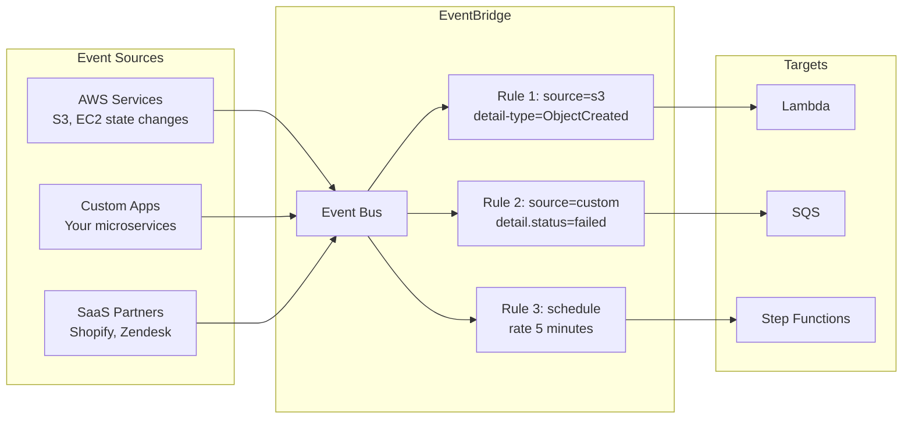

**Key features**:
- Rules match events using JSON patterns
- Schedule expressions (cron/rate) for time-based triggers
- Archive and replay events
- Schema registry for event discovery
- Cross-account event routing

**Compared to SNS**: EventBridge supports content-based filtering on event attributes (not just topic), has a schema registry, supports archive/replay, and integrates with SaaS partners. SNS is simpler and better for pure pub/sub fan-out.

---

## 7. Architecture Patterns

### 7.1 Event-Driven Architecture with Lambda + SQS

This is the pattern GCC used for fake follower detection:

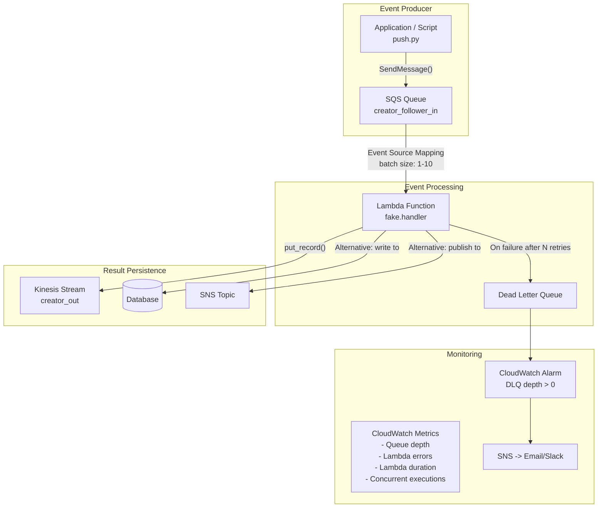

**Pattern benefits**:
- **Decoupled**: Producer and consumer are independent. Producer does not wait for processing.
- **Auto-scaling**: Lambda scales with SQS queue depth automatically.
- **Fault-tolerant**: Failed messages return to queue (visibility timeout) and eventually go to DLQ.
- **Cost-effective**: Pay only when messages are being processed. Zero cost when queue is empty.

**When to use this pattern**:
- Asynchronous task processing (image processing, ML inference, email sending)
- Workloads that can tolerate slight delay (not real-time API responses)
- Bursty workloads that need elastic scaling
- Tasks that need retry semantics

### 7.2 Real-Time Streaming with Kinesis

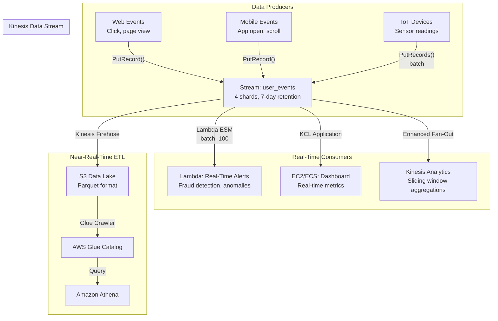

**Pattern benefits**:
- **Multiple consumers**: Same stream feeds real-time processing, analytics, and data lake
- **Replay**: Consumers can re-process historical data (within retention period)
- **Ordering**: Per-shard ordering for ordered event processing
- **Durability**: Data replicated across 3 AZs within retention period

**When to use this pattern**:
- Real-time analytics dashboards
- Event sourcing / CQRS architectures
- Log and metric aggregation
- Fraud detection, anomaly detection (streaming ML)

### 7.3 Static Asset Serving with S3 + CloudFront

This is the pattern GCC used for the 8M daily images pipeline:

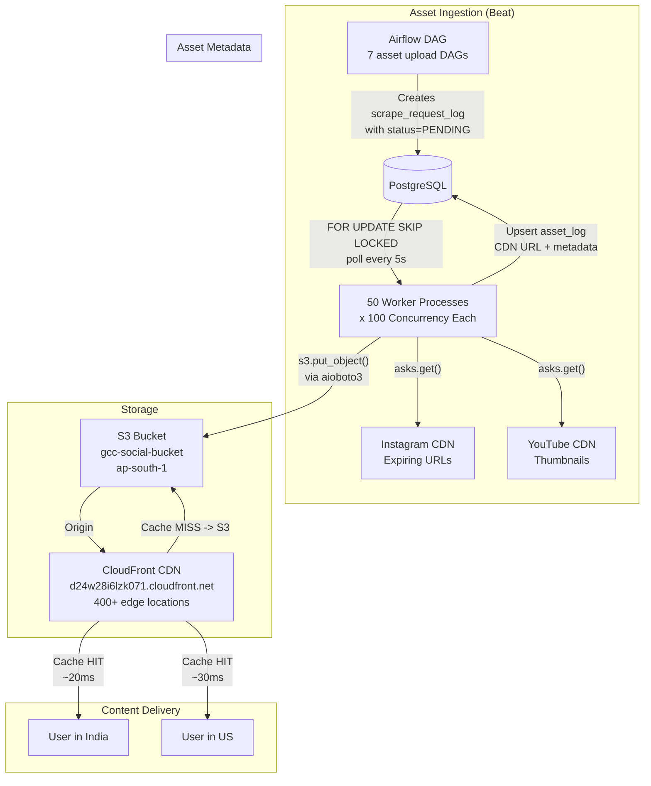

**S3 + CloudFront configuration details**:

```
S3 Bucket Policy (restrict to CloudFront only):
{
  "Statement": [{
    "Effect": "Allow",
    "Principal": {"AWS": "arn:aws:iam::cloudfront:user/CloudFront Origin Access Identity E12345"},
    "Action": "s3:GetObject",
    "Resource": "arn:aws:s3:::gcc-social-bucket/*"
  }]
}

CloudFront Distribution:
  Origin: gcc-social-bucket.s3.ap-south-1.amazonaws.com
  OAI: E12345
  Default TTL: 86400 (24 hours)
  Max TTL: 31536000 (1 year)
  Viewer Protocol: HTTPS only
  Price Class: All edge locations

Cache Behavior:
  Path: assets/*
  Compress: Yes (gzip/brotli)
  Cache Policy: CachingOptimized
  Origin Request Policy: CORS-S3Origin
```

**Pattern benefits**:
- **Performance**: Sub-50ms latency globally via edge caching
- **Cost**: S3 storage is cheap ($0.023/GB); CloudFront transfer is cheaper than S3 direct ($0.085/GB vs $0.09/GB)
- **Scalability**: Both S3 and CloudFront scale automatically to handle any traffic
- **Decoupled from platform**: Assets cached in S3 survive Instagram/YouTube API revocation

### 7.4 Complete GCC AWS Architecture

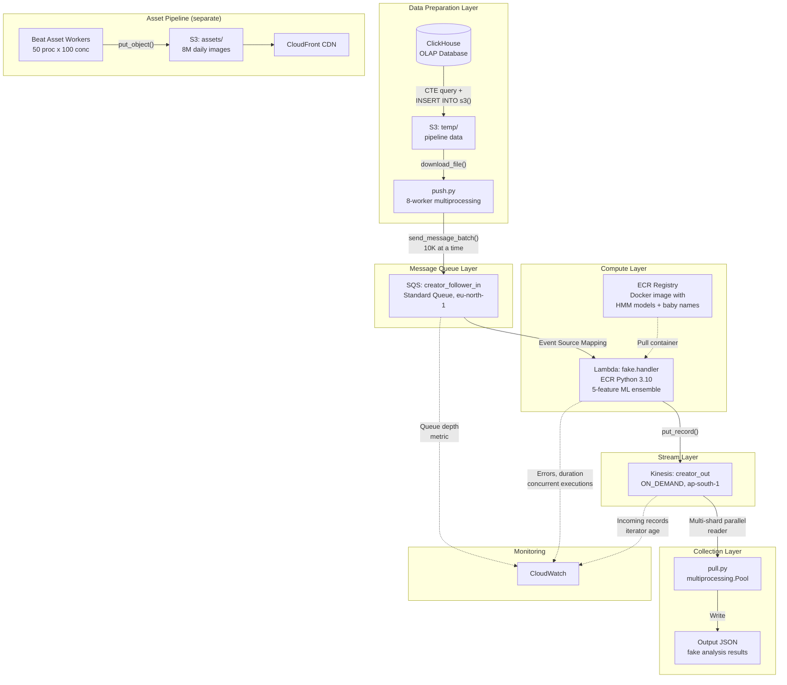

---

## 8. Interview Questions and Answers

### Q1: "Explain S3 storage classes and when you would use each."

**Answer**: "S3 offers a spectrum of storage classes optimized for different access patterns and cost points. At one end, S3 Standard provides millisecond access for frequently used data -- we used this at GCC for our 8M daily images that were actively served via CloudFront. For data accessed less often but needing instant retrieval, Standard-IA costs about 46% less per GB but charges retrieval fees -- good for quarterly reports or old user uploads.

For archival, Glacier offers three tiers: Instant Retrieval for compliance data you rarely access but need fast, Flexible Retrieval for backups where minutes-to-hours is acceptable, and Deep Archive at $0.001/GB for long-term legal retention with 12-48 hour retrieval times.

Intelligent-Tiering is the 'set and forget' option -- it automatically moves objects between tiers based on access patterns, useful when you genuinely do not know the access pattern.

The key decision framework is: How often is it accessed? How fast must retrieval be? Can the data be reconstructed? The last question matters for One Zone-IA, which saves 20% over Standard-IA but stores data in a single AZ."

---

### Q2: "When would you use SQS vs Kinesis vs Kafka?"

**Answer**: "These solve different problems despite looking similar at first glance.

**SQS** is a managed message queue. Messages are consumed once and deleted. No replay, no multiple consumers reading the same data. Choose SQS when you need simple task distribution -- at GCC, we used it to distribute follower records to Lambda functions. SQS auto-scales, integrates natively with Lambda as a trigger, and costs nothing when idle. The tradeoff is no message replay and best-effort ordering (Standard queues).

**Kinesis** is a managed data stream. Messages are retained (24h to 365d) and can be replayed. Multiple consumers can independently read the same stream. Choose Kinesis when you need multiple consumers processing the same data or when you need to replay historical events. We used Kinesis as the output stream for our Lambda pipeline because the multi-shard parallel reader pattern let us efficiently collect results, and we could re-read if the collection process failed.

**Kafka** is the most powerful but operationally heaviest. It gives you log compaction (keeping only the latest value per key), consumer groups with automatic rebalancing, exactly-once semantics with transactions, and unlimited retention. Choose Kafka when you need extreme throughput (millions of messages/second), log compaction for event sourcing, or multi-datacenter replication. At GCC, we actually used RabbitMQ (not Kafka) for inter-service communication between Beat and Event-gRPC because we needed complex routing with 11 exchanges and 26+ queues -- which is RabbitMQ's strength.

The short version: SQS for simple decoupling, Kinesis for managed streaming with replay, Kafka for complex event-driven architectures at scale."

---

### Q3: "How do you handle Lambda cold starts?"

**Answer**: "Cold starts happen when Lambda creates a new execution environment -- downloading code, initializing the runtime, and running your initialization code. The severity depends on the runtime and package size: Node.js is typically 100-300ms, Python 200-500ms, Java 500-2000ms, and Docker containers 1-5 seconds.

At GCC, our fake follower Lambda used ECR containers because the ML model package exceeded the 50MB zip limit. This gave us the longest cold starts -- about 3-5 seconds -- because loading numpy, pandas, the 35K-name database, and the indictrans HMM models took time. But it was acceptable because our pipeline was batch-oriented, not real-time.

For production mitigation, I would use several strategies depending on the latency requirements:

1. **Initialize outside the handler**: Anything loaded at module level (database connections, ML models, configuration) persists across warm invocations. We loaded baby_names.csv at import time, so it was only loaded once per container.

2. **Provisioned Concurrency**: For latency-sensitive APIs, you pre-warm N instances. They are always ready, eliminating cold starts entirely. The cost is that you pay for idle provisioned instances.

3. **Minimize package size**: Use Lambda Layers for shared dependencies. If the package is under 50MB, use ZIP instead of containers.

4. **Choose appropriate runtimes**: Python and Node.js have the fastest cold starts. If cold start matters, avoid Java unless you can use SnapStart.

5. **Keep functions warm**: A CloudWatch Events rule can ping the function every 5 minutes to keep at least one container warm. This only works for keeping one instance warm though -- a traffic burst will still trigger cold starts.

The real answer is: understand whether cold starts matter for your use case. For a batch ML pipeline processing millions of followers? A 3-second cold start is irrelevant. For a user-facing API endpoint? Provisioned Concurrency is the right investment."

---

### Q4: "How did you process 8M images on AWS?"

**Answer**: "This was our asset caching pipeline at GCC. The problem was that Instagram and YouTube CDN URLs expire -- Instagram uses signed signatures that become invalid after a period. We needed permanent, platform-independent URLs for 8 million daily media assets.

**Architecture**: Seven Airflow DAGs ran on schedules (hourly to daily), each querying ClickHouse for assets needing upload. They created entries in a PostgreSQL `scrape_request_log` table with `status=PENDING`. Beat's Python workers, configured with 50 processes and 100 concurrency per process (5,000 parallel slots), picked up tasks using `SELECT ... FOR UPDATE SKIP LOCKED` -- essentially a SQL-based task queue.

Each worker downloaded the media from the platform CDN using async HTTP (`asks.get()`), detected the content type (jpg/png/webp/mp4), and uploaded to S3 using `aioboto3.put_object()` with a structured key: `assets/{entity_type}s/{platform}/{entity_id}.{extension}`.

**Why 5,000 parallel slots for asset uploads vs 50 for scraping?** Asset uploads are purely I/O-bound -- download bytes, upload bytes. There are no API rate limits on our own S3 bucket. The bottleneck is network bandwidth, not API quotas. In contrast, scraping has strict platform rate limits.

**Delivery**: A CloudFront distribution sat in front of the S3 bucket, caching assets at 400+ edge locations. Client applications referenced the CloudFront URL in our database. This gave sub-50ms latency globally while completely decoupling from platform CDN availability.

**The 8M breakdown**: 2M Instagram profile pictures + 3M Instagram post thumbnails + 500K YouTube channel thumbnails + 1.5M YouTube video thumbnails + 500K Instagram story media + 500K follower profile pictures.

**Error handling**: If an Instagram URL returned 'URL signature expired', we caught the exception and re-queued the task. The SQL-based queue tracked status transitions: PENDING -> PROCESSING -> COMPLETE or FAILED."

---

### Q5: "Explain the difference between Standard and FIFO SQS queues."

**Answer**: "Standard queues offer unlimited throughput with at-least-once delivery and best-effort ordering. Messages might arrive out of order and could be delivered more than once. FIFO queues guarantee strict first-in-first-out ordering within a message group and exactly-once processing within a 5-minute deduplication window, but are limited to 300 transactions per second (3,000 with batching).

At GCC, we used Standard queues for the fake follower pipeline because: (1) order did not matter -- each follower record was independently processed, (2) we needed high throughput to push hundreds of thousands of records quickly, (3) our Lambda handler was idempotent -- processing the same follower twice produces the same result, so at-least-once delivery was fine, and (4) the cost was lower.

I would choose FIFO when ordering matters -- for example, financial transaction processing where debits must precede credits, or event sourcing where events must be applied in order. The message group ID in FIFO queues is clever: you get ordering guarantees within a group (e.g., per-customer) while different groups can still be processed in parallel."

---

### Q6: "What is a Dead Letter Queue and why is it important?"

**Answer**: "A Dead Letter Queue is a separate queue that receives messages that cannot be processed after a configured number of attempts. It prevents a single 'poison message' -- one that always causes processing failures -- from blocking the entire queue in an infinite retry loop.

You configure it with a redrive policy: set `maxReceiveCount` to, say, 3. If a message is received 3 times without being deleted (indicating 3 failed processing attempts), SQS automatically moves it to the DLQ.

The critical thing is what you do with the DLQ. You should: (1) set up a CloudWatch alarm on the DLQ's `ApproximateNumberOfMessagesVisible` metric so you are immediately notified, (2) inspect DLQ messages to understand the failure pattern -- is it a bug in your code? bad data? a transient dependency failure?, (3) after fixing the root cause, use SQS's DLQ redrive feature to move messages back to the main queue for reprocessing, and (4) set the DLQ's retention period longer than the main queue (14 days) to give time for investigation.

Without a DLQ, a malformed message would cycle through visibility timeout -> receive -> fail -> visibility timeout endlessly, wasting compute and potentially blocking other messages if using FIFO queues."

---

### Q7: "Explain how Kinesis handles ordering."

**Answer**: "Kinesis guarantees ordering within a shard but not across shards. Each record has a partition key, and Kinesis computes an MD5 hash of that key to determine which shard receives the record. Records with the same partition key always go to the same shard. Within a shard, records are assigned monotonically increasing sequence numbers, and consumers read them in sequence number order.

This means if you use a customer ID as the partition key, all events for that customer are strictly ordered. But events for different customers on different shards may be processed in any order relative to each other.

If you need global ordering, you must use a single shard -- which limits write throughput to 1 MB/s and 1,000 records/s. For most real-world systems, per-entity ordering is sufficient.

At GCC, we used the follower handle as the partition key. This ensured that if the same follower was analyzed multiple times (unlikely but possible), results arrived in order on the same shard. Our consumer (pull.py) launched one process per shard using Python's multiprocessing.Pool, each process independently reading its shard via `get_records()`. This gave us parallel consumption proportional to the number of shards."

---

### Q8: "How does Lambda integrate with SQS?"

**Answer**: "Lambda uses an internal component called an Event Source Mapping to integrate with SQS. Here is how it works:

Lambda maintains a fleet of pollers that continuously call `ReceiveMessage` on your SQS queue with long polling. When messages are available, the pollers invoke your Lambda function with a batch of up to 10 messages (configurable). If the function succeeds (returns without error), Lambda deletes the messages from the queue. If the function fails, the messages become visible again after the visibility timeout expires.

Key configuration options:
- **Batch size**: 1-10 messages per invocation. GCC used 1 (one follower per Lambda call).
- **Batch window**: Wait up to N seconds to collect more messages before invoking (reduces invocations for low-throughput queues).
- **Concurrency**: Lambda scales up to process messages in parallel. With a queue depth of 100,000, Lambda might spin up hundreds of concurrent instances.
- **Partial batch failure**: Lambda can report `batchItemFailures` to indicate which specific messages in a batch failed, rather than failing the entire batch.

The auto-scaling behavior is nuanced: Lambda starts with 5 concurrent executions, then scales up by 60 instances per minute. For a sudden spike of 1 million messages, it takes several minutes to reach maximum concurrency. If immediate processing is critical, you can use reserved concurrency to ensure capacity."

---

### Q9: "What is S3 event notification and how would you use it?"

**Answer**: "S3 event notifications let you trigger actions when objects are created, deleted, or restored in a bucket. You configure which events to capture, optionally filter by key prefix and suffix, and specify a target: Lambda, SQS, SNS, or EventBridge.

A common use case: when a user uploads an image to `uploads/`, trigger a Lambda that generates thumbnails and stores them in `thumbnails/`. The notification fires only for `s3:ObjectCreated:*` events with prefix `uploads/` and suffix `.jpg`.

Under the hood, S3 delivers events asynchronously -- there is typically less than a second of delay, but it is not guaranteed to be instant. Events are delivered at least once, so your handler should be idempotent.

EventBridge as a target is the most flexible option because EventBridge can route events to over 20 different AWS services based on content filtering rules, and it supports archive and replay."

---

### Q10: "Describe the trade-offs between Spot, On-Demand, and Reserved EC2 instances."

**Answer**: "The three models represent a cost-commitment spectrum.

**On-Demand** is pay-as-you-go with no commitment. Full price but maximum flexibility -- launch and terminate at will. Best for development, testing, unpredictable workloads, and short-term needs.

**Reserved Instances** offer up to 72% discount for a 1 or 3-year commitment. You commit to a specific instance type in a specific region. Best for steady-state production workloads where you know you will need that capacity for years. The risk is over-provisioning if your needs change.

**Spot Instances** offer up to 90% discount but can be interrupted with 2 minutes notice when AWS needs the capacity back. Best for fault-tolerant workloads: batch processing, CI/CD, data analysis, containerized workloads that can be rescheduled.

The optimal strategy is a hybrid: use Reserved for your baseline capacity (the minimum you always need), On-Demand for predictable variable load, and Spot for additional scale. With Auto Scaling Groups, you can define a mixed instances policy: 2 On-Demand as base capacity, scale out with Spot instances across multiple instance types and AZs (to reduce interruption risk)."

---

### Q11: "How would you design a system to handle millions of file uploads per day?"

**Answer**: "This is essentially what I built at GCC for the 8M daily image pipeline. Here is the design:

**Ingestion layer**: Use a task queue (PostgreSQL with `FOR UPDATE SKIP LOCKED` at GCC, or SQS/Redis for simpler cases) to distribute upload tasks across worker processes. The queue enables idempotent retries and status tracking.

**Worker pool**: Scale workers based on I/O, not CPU. Asset uploads are network-bound, so high concurrency (5,000 parallel slots at GCC) is appropriate. Use async I/O (aioboto3 for S3, asyncio for HTTP) to maximize throughput per process.

**Storage**: S3 with a well-designed key structure that avoids hot partitions. S3 automatically partitions by key prefix, so distributing across prefixes (`assets/profiles/`, `assets/posts/`, etc.) prevents hotspots. Use the appropriate storage class -- Standard for hot data, lifecycle policies to transition cold data.

**Delivery**: CloudFront CDN in front of S3 for global low-latency delivery. Origin Access Identity to restrict direct S3 access.

**Reliability**: Track upload status (PENDING -> PROCESSING -> COMPLETE/FAILED) in the task queue. Handle transient errors with retries. Use DLQ or failed status for permanent failures. The entire pipeline should be idempotent -- re-uploading the same image to the same S3 key is safe.

**Monitoring**: CloudWatch metrics on S3 put request rates, CloudFront cache hit ratio, worker queue depth, and failure rates. Alarm on growing failure rates."

---

### Q12: "Explain the concept of visibility timeout in SQS."

**Answer**: "Visibility timeout is SQS's mechanism for preventing multiple consumers from processing the same message simultaneously. When Consumer A receives a message, SQS makes that message invisible to all other consumers for the duration of the visibility timeout (default 30 seconds). During this window, Consumer A must process the message and delete it from the queue.

If Consumer A successfully processes and deletes the message within the timeout, done. If Consumer A crashes or the timeout expires before deletion, the message becomes visible again and another consumer can pick it up -- effectively a retry.

Setting the timeout is a balancing act: too short and messages get processed twice (consumer has not finished before timeout expires), too long and a crashed consumer blocks the message from being retried for an unnecessarily long time. The rule of thumb is 6x your expected processing time.

You can also dynamically extend the visibility timeout mid-processing using `ChangeMessageVisibility` if you realize processing will take longer than expected. This is useful for variable-duration tasks."

---

### Q13: "What happens when a Lambda function times out while processing an SQS message?"

**Answer**: "When a Lambda function times out, the function execution is terminated by the Lambda runtime. The SQS message is NOT deleted from the queue. After the visibility timeout expires, the message becomes visible again and Lambda's Event Source Mapping will receive and invoke the function with that message again.

This retry cycle continues until either: (1) the function successfully processes the message and Lambda deletes it, or (2) the message's receive count exceeds the DLQ's `maxReceiveCount`, at which point SQS moves it to the Dead Letter Queue.

The important detail: Lambda's timeout and SQS's visibility timeout are separate settings. If your Lambda timeout is 30 seconds and the visibility timeout is also 30 seconds, there is a risk of double-processing -- the Lambda might timeout at 30s, and the message becomes visible at 30s, but another instance picks it up immediately while the timed-out instance might still be running briefly during shutdown. The recommendation is to set the SQS visibility timeout to at least 6x the Lambda timeout."

---

### Q14: "How did your fake follower detection pipeline use multiple AWS services together?"

**Answer**: "The pipeline chained five AWS services in sequence, each chosen for its specific strength:

**S3** served as the data staging layer. ClickHouse exported follower data directly to S3 as JSONEachRow using ClickHouse's built-in S3 table function. This decoupled the database export from the processing pipeline -- the export could complete independently, and the processing could start when ready.

**SQS** served as the work distribution layer. push.py downloaded the S3 file locally, split it into batches of 10,000 lines, and distributed them round-robin across 8 worker processes that sent batches to SQS. SQS provided reliable, at-least-once delivery with automatic retry via visibility timeout. Crucially, SQS integrates natively as a Lambda trigger.

**Lambda** (via ECR) served as the compute layer. Each Lambda invocation ran the 5-feature ML ensemble on one follower record: Unicode normalization, Indic script transliteration using HMM models, fuzzy string matching against 35,183 Indian names, and confidence scoring. Lambda auto-scaled based on SQS queue depth -- hundreds of concurrent invocations processing in parallel.

**ECR** (Elastic Container Registry) hosted the Docker image containing the Lambda code, the pre-trained HMM models for 10 Indic scripts, and the name database. We used containers because the total package exceeded Lambda's 50MB zip limit.

**Kinesis** served as the result collection layer. Each Lambda wrote its result to a Kinesis stream using `put_record()`. pull.py then read all shards in parallel using multiprocessing, collecting results into the final output file.

The overall effect: what previously ran sequentially on a single EC2 instance (processing one follower at a time) now ran massively parallel on serverless infrastructure, cutting total processing time by 50%."

---

### Q15: "What is the difference between S3 and EBS?"

**Answer**: "S3 is object storage -- you store and retrieve entire objects (files) via HTTP API. EBS is block storage -- it provides raw disk volumes that EC2 instances mount as filesystems.

Key differences:
- **Access pattern**: S3 is accessed via API (PUT/GET object). EBS is accessed as a mounted disk (read/write blocks).
- **Attachment**: S3 is standalone. EBS must be attached to an EC2 instance (or can be unattached, but cannot be used without an instance).
- **Concurrent access**: S3 can be accessed by thousands of clients simultaneously. EBS can only be attached to one EC2 instance (or up to 16 with Multi-Attach io2 volumes).
- **Durability**: S3 provides 99.999999999% (11 nines) durability. EBS provides 99.999% (5 nines).
- **Use case**: S3 for data lakes, static assets, backups, pipeline data. EBS for databases, application filesystems, OS volumes.

At GCC, S3 stored media assets (8M images) and pipeline data (ClickHouse exports), while the EC2 instances running PostgreSQL and ClickHouse used EBS volumes for their database files."

---

### Q16: "How would you secure an S3 bucket?"

**Answer**: "Securing S3 involves multiple layers:

1. **Block Public Access**: Enable the account-level and bucket-level Block Public Access settings. This is the first line of defense against accidental public exposure.

2. **Bucket Policies**: Explicit allow/deny rules at the bucket level. Use these to restrict access to specific IAM roles, VPC endpoints, or CloudFront Origin Access Identities.

3. **IAM Policies**: Grant least-privilege access to users and roles. If a Lambda only needs `s3:GetObject` on `assets/*`, do not give it `s3:*` on `*`.

4. **Encryption**: Enable default encryption (SSE-S3 or SSE-KMS). SSE-S3 is free and automatic. SSE-KMS gives you key management and audit trails via CloudTrail.

5. **Access Logging**: Enable server access logging or use CloudTrail S3 data events to track who accessed what and when.

6. **Versioning + MFA Delete**: Versioning prevents accidental overwrites. MFA Delete requires multi-factor authentication to permanently delete objects.

7. **VPC Endpoints**: If your EC2/Lambda only needs to access S3 within AWS, use a VPC Gateway Endpoint. Traffic stays within the AWS network, never touching the public internet.

8. **Pre-signed URLs**: For temporary, controlled access to specific objects without changing bucket policies.

9. **Object Lock**: For compliance, WORM (Write Once Read Many) protection prevents deletion for a specified retention period."

---

### Q17: "Explain Enhanced Fan-Out in Kinesis."

**Answer**: "By default, all consumers on a Kinesis shard share a 2 MB/s read throughput limit. If you have 3 consumers, each effectively gets about 666 KB/s. They all poll using `GetRecords`, competing for the same throughput.

Enhanced Fan-Out gives each registered consumer a dedicated 2 MB/s throughput per shard. Instead of polling, the consumer uses `SubscribeToShard` which is a push-based HTTP/2 connection. Kinesis pushes records to the consumer as soon as they arrive, reducing latency from ~200ms (polling interval) to ~70ms.

The tradeoff is cost: Enhanced Fan-Out charges per consumer per shard-hour plus per GB retrieved. It is worth it when you have multiple consumers (e.g., real-time dashboard + analytics + archival) all needing high throughput from the same stream."

---

### Q18: "What is the difference between SQS long polling and short polling?"

**Answer**: "Short polling returns immediately -- even if the queue is empty, you get an empty response. This wastes API calls and costs money for nothing. Long polling waits up to N seconds (max 20) for messages to arrive before returning. If a message arrives during the wait, it returns immediately with that message.

Long polling reduces empty responses by 99%+, reduces cost (fewer API calls), and reduces latency for message processing (the consumer gets the message as soon as it arrives, up to the polling interval). There is virtually no reason to use short polling in production.

You enable long polling by setting `WaitTimeSeconds` to a value between 1 and 20 on the `ReceiveMessage` call, or by setting the queue's `ReceiveMessageWaitTimeSeconds` attribute as a default."

---

### Q19: "How does Lambda scale with SQS as a trigger?"

**Answer**: "Lambda uses an Event Source Mapping that continuously polls SQS. The scaling behavior works in phases:

1. **Initial**: Lambda starts with 5 concurrent instances polling the queue.
2. **Scale up**: Every minute, Lambda can add 60 more concurrent instances if there are messages in the queue. So after 1 minute you might have 65, after 2 minutes 125, and so on.
3. **Maximum**: Scales up to your account concurrency limit (default 1,000, can request increase) or your function's reserved concurrency, whichever is lower.
4. **Scale down**: When the queue empties, Lambda scales down gradually.

The important nuance: for Standard queues, Lambda uses up to 5 long-polling connections initially, and increases the number of batches processed concurrently. For FIFO queues, Lambda scales to the number of active message groups (not queue depth), because messages within a group must be processed in order.

If you have a sudden spike of 1 million messages, it takes approximately 17 minutes to reach 1,000 concurrent Lambda instances (5 + 60 per minute x 17 minutes = 1,025). If this ramp-up time is unacceptable, you can use reserved concurrency to pre-allocate capacity."

---

### Q20: "Describe a scenario where you would use EventBridge over SQS or SNS."

**Answer**: "EventBridge shines when you need content-based routing -- routing events to different targets based on the event's payload content, not just its topic.

Example: Your system generates order events with fields like `order_type`, `amount`, and `region`. With SNS, you would publish to a topic and all subscribers get all events. With SQS, you would need separate queues for each event type. With EventBridge, you write rules:

- Rule 1: If `order_type = 'refund'` AND `amount > 1000` -> trigger Lambda for manual review
- Rule 2: If `region = 'EU'` -> send to SQS for GDPR processing
- Rule 3: If `order_type = 'subscription'` -> trigger Step Functions workflow

EventBridge also supports: archive and replay (re-process old events after fixing a bug), schema registry (discover and document event formats), cross-account event routing, and schedule-based triggers (cron/rate expressions). These features are not available with plain SQS or SNS.

Choose SQS when you need a simple point-to-point queue. Choose SNS when you need simple fan-out to multiple subscribers. Choose EventBridge when you need intelligent routing based on event content."

---

## Quick Reference: AWS Services Cheat Sheet

```
S3:        Object storage (files/blobs). Cheap, durable, scalable. 11 nines durability.
Lambda:    Serverless functions. Pay per invocation. Auto-scales to 1000s.
SQS:       Message queue. Decouples producers/consumers. Standard or FIFO.
Kinesis:   Real-time streaming. Ordered per-shard. Replay capable. Like managed Kafka.
EC2:       Virtual servers. Full control. Multiple pricing models.
CloudFront: CDN. 400+ edge locations. Caches S3/origin content globally.
IAM:       Identity & access. Users, roles, policies. Least privilege.
VPC:       Virtual network. Subnets, route tables, security groups.
RDS:       Managed relational DB. PostgreSQL, MySQL, Aurora.
ElastiCache: Managed Redis/Memcached. Session cache, rate limiting.
EventBridge: Event bus. Content-based routing. Archive & replay.
ECR:       Docker container registry. Used with Lambda/ECS/EKS.
```

---

## GCC AWS Services Summary

| Service | How Anshul Used It | Scale |
|---------|-------------------|-------|
| **S3** | Asset caching pipeline (8M daily images) + pipeline data staging (ClickHouse exports) | 8M objects/day, CloudFront CDN |
| **Lambda** | ML fake follower detection (5-feature ensemble, 10 Indic scripts) | Hundreds of concurrent instances |
| **SQS** | Work distribution for Lambda (follower records) | Hundreds of thousands of messages |
| **Kinesis** | Result collection stream from Lambda | ON_DEMAND, multi-shard parallel read |
| **ECR** | Docker container for Lambda (HMM models + dependencies) | Python 3.10, ~500MB image |
| **CloudFront** | CDN for S3-cached media assets | 400+ edge locations, sub-50ms latency |
| **EC2** | Self-managed PostgreSQL, ClickHouse, Beat workers, Event-gRPC | Multiple instances, ap-south-1 |

---

*This document covers AWS services as used in production at Good Creator Co. and the conceptual depth needed for Google L4 backend engineering interviews. Every architecture pattern and code example is drawn from real production systems processing millions of daily events.*
