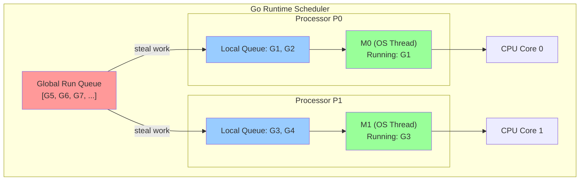
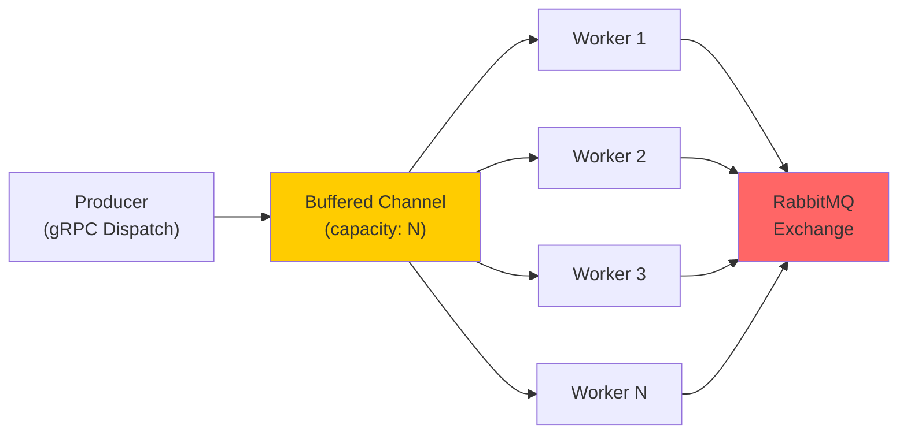
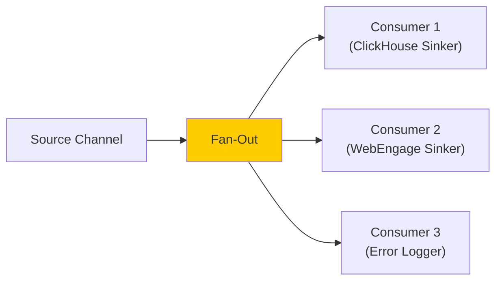
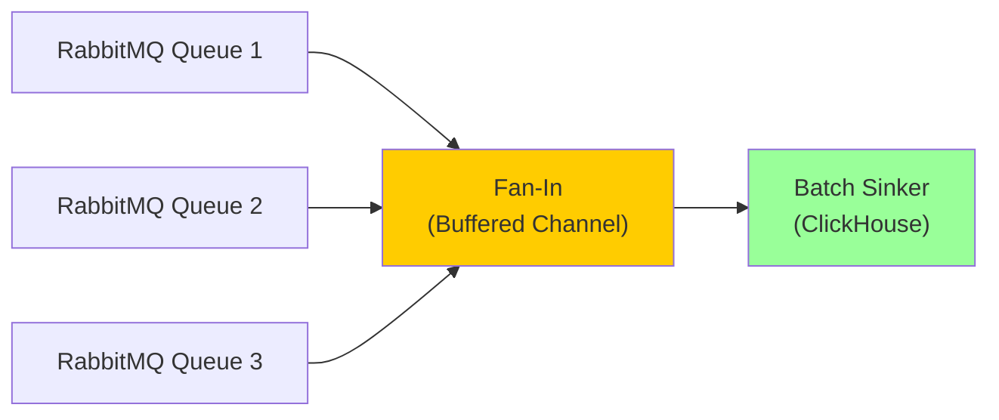
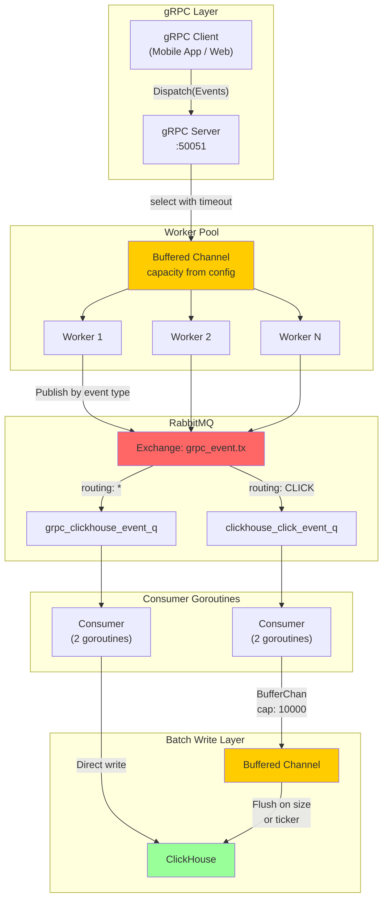

# Go Language Essentials -- Complete Interview Study Guide

> **Target audience:** A backend engineer (Anshul) who built a production Go gRPC service (event-grpc) at Good Creator Co. handling 10K events/sec, consuming from RabbitMQ with buffered batch-writes to ClickHouse. This guide fills gaps and ensures confident discussion of Go in any interview setting.

---

## Table of Contents

1. [Go Fundamentals](#1-go-fundamentals)
2. [Concurrency (MOST IMPORTANT)](#2-concurrency-most-important)
3. [Go for Backend Services](#3-go-for-backend-services)
4. [Go + gRPC](#4-go--grpc)
5. [Go Performance](#5-go-performance)
6. [Go vs Java vs Python](#6-go-vs-java-vs-python)
7. [Interview Q&A (20+ Questions)](#7-interview-qa-20-questions)
8. [How Anshul Used Go](#8-how-anshul-used-go)

---

## 1. Go Fundamentals

### 1.1 Why Go?

Go was created at Google in 2007 (publicly released 2009) by Robert Griesemer, Rob Pike, and Ken Thompson. It was designed to solve real problems at Google-scale:

**The four pillars of Go's design:**

| Pillar | What it means | Why it matters |
|--------|---------------|----------------|
| **Simplicity** | 25 keywords, no classes, no inheritance, no generics (until 1.18), no exceptions | Any engineer can read any Go codebase in hours, not days |
| **Concurrency** | Goroutines + channels as first-class primitives | Writing concurrent network services is natural, not bolted-on |
| **Performance** | Compiled to native machine code, no VM | Near-C performance with garbage collection convenience |
| **Compilation speed** | The entire Go standard library compiles in seconds | Fast CI/CD, fast developer iteration loops |

**When to reach for Go:**
- High-throughput network services (API gateways, proxies, event processors)
- CLI tools (Docker, Kubernetes, Terraform are all written in Go)
- Microservices that need to be fast and have small memory footprints
- Anything where you need concurrency without the complexity of C++ or Rust

**When Go is NOT the best choice:**
- Heavy numerical computing (Python/NumPy is better)
- GUI applications
- Rapid prototyping where developer speed matters more than runtime speed
- Systems requiring complex type hierarchies (Java may be better)

### 1.2 Types in Go

#### Basic Types

```go
// Numeric types
var i int       // Platform-dependent: 32 or 64 bit
var i8 int8     // -128 to 127
var i16 int16   // -32768 to 32767
var i32 int32   // -2^31 to 2^31-1
var i64 int64   // -2^63 to 2^63-1

var u uint      // Platform-dependent unsigned
var u8 uint8    // 0 to 255 (alias: byte)
var u32 uint32  // 0 to 2^32-1 (alias: rune for Unicode code points)
var u64 uint64  // 0 to 2^64-1

var f32 float32   // IEEE 754 32-bit
var f64 float64   // IEEE 754 64-bit (default for float literals)

var c64 complex64   // complex with float32 real/imag
var c128 complex128 // complex with float64 real/imag

// String type (immutable byte sequence, UTF-8 encoded)
var s string = "hello"

// Boolean
var b bool = true
```

**Key insight for interviews:** Go has no implicit type conversions. You must explicitly cast: `float64(myInt)`. This prevents entire classes of bugs.

#### Structs

Structs are Go's primary data composition mechanism. There are no classes.

```go
// Defining a struct
type Event struct {
    ID        string    `json:"id"`
    Name      string    `json:"name"`
    Timestamp time.Time `json:"timestamp"`
    Params    map[string]interface{} `json:"params,omitempty"`
}

// Creating instances
e1 := Event{ID: "abc", Name: "page_view"}    // Named fields
e2 := Event{"abc", "page_view", time.Now(), nil} // Positional (fragile, avoid)
e3 := new(Event)                                  // Returns *Event (pointer)

// Embedding (composition over inheritance)
type ClickEvent struct {
    Event                    // Embedded struct -- ClickEvent "inherits" Event fields
    ElementID string         // Additional field
    Position  int
}

// ClickEvent now has ID, Name, Timestamp, Params, ElementID, Position
click := ClickEvent{
    Event:     Event{ID: "123", Name: "click"},
    ElementID: "buy-button",
    Position:  3,
}
fmt.Println(click.ID) // Accessing promoted field directly
```

**Struct tags** are metadata strings attached to struct fields. They are used by packages like `encoding/json`, `gorm`, and `protobuf`:

```go
type User struct {
    ID       int64  `json:"id" gorm:"primaryKey"`
    Email    string `json:"email" gorm:"uniqueIndex" validate:"required,email"`
    Password string `json:"-" gorm:"column:password_hash"` // "-" means exclude from JSON
}
```

#### Interfaces

Go interfaces are implemented **implicitly**. There is no `implements` keyword. If a type has all the methods an interface requires, it satisfies that interface.

```go
// Defining an interface
type EventSinker interface {
    Sink(event Event) error
    Flush() error
}

// ClickHouseSinker implements EventSinker (no explicit declaration needed)
type ClickHouseSinker struct {
    db     *gorm.DB
    buffer []Event
}

func (s *ClickHouseSinker) Sink(event Event) error {
    s.buffer = append(s.buffer, event)
    if len(s.buffer) >= 100 {
        return s.Flush()
    }
    return nil
}

func (s *ClickHouseSinker) Flush() error {
    if len(s.buffer) == 0 {
        return nil
    }
    result := s.db.Create(s.buffer)
    s.buffer = nil
    return result.Error
}

// Any function that takes EventSinker can accept *ClickHouseSinker
func ProcessEvents(sinker EventSinker, events []Event) error {
    for _, e := range events {
        if err := sinker.Sink(e); err != nil {
            return err
        }
    }
    return sinker.Flush()
}
```

**Key interfaces in the standard library:**

```go
// The most important interface in Go -- nearly everything implements it
type error interface {
    Error() string
}

// io.Reader and io.Writer -- the foundation of all I/O
type Reader interface {
    Read(p []byte) (n int, err error)
}

type Writer interface {
    Write(p []byte) (n int, err error)
}

// fmt.Stringer -- like Java's toString()
type Stringer interface {
    String() string
}

// The empty interface -- accepts any type (like Java's Object)
// In Go 1.18+, use "any" as an alias
var x interface{} = 42
var y any = "hello"  // Go 1.18+
```

**Interface composition:**

```go
type ReadWriter interface {
    Reader
    Writer
}

type ReadWriteCloser interface {
    Reader
    Writer
    Closer
}
```

#### Slices

Slices are Go's dynamic arrays. They are references to an underlying array.

```go
// Creating slices
s1 := []int{1, 2, 3}           // Literal
s2 := make([]int, 5)           // Length 5, capacity 5, all zeros
s3 := make([]int, 0, 100)      // Length 0, capacity 100 (pre-allocated)

// Appending
s1 = append(s1, 4, 5)          // [1, 2, 3, 4, 5]
s1 = append(s1, s2...)         // Append another slice (spread operator)

// Slicing (creates a view, NOT a copy)
sub := s1[1:3]                 // [2, 3] -- shares underlying array!

// Copying (creates independent copy)
dst := make([]int, len(s1))
copy(dst, s1)

// Length vs Capacity
fmt.Println(len(s1))  // Number of elements
fmt.Println(cap(s1))  // Size of underlying array

// Iterating
for i, v := range s1 {
    fmt.Printf("index=%d, value=%d\n", i, v)
}

// Delete element at index i (order preserved)
s1 = append(s1[:i], s1[i+1:]...)
```

**Critical interview point -- slice internals:**

A slice header is a 3-word struct: `{pointer, length, capacity}`. When you pass a slice to a function, you pass a copy of this header, but the underlying array is shared. When `append` exceeds capacity, Go allocates a new array (typically 2x the old capacity) and copies elements over.

```go
// This is what a slice looks like internally
type SliceHeader struct {
    Data uintptr  // Pointer to underlying array
    Len  int      // Current number of elements
    Cap  int      // Total capacity of underlying array
}
```

#### Maps

```go
// Creating maps
m1 := map[string]int{"a": 1, "b": 2}
m2 := make(map[string]int)        // Empty map
m3 := make(map[string]int, 100)   // Empty map with hint for 100 entries

// CRUD operations
m1["c"] = 3                       // Insert or update

val, ok := m1["d"]                // Two-value lookup
if ok {
    fmt.Println("found:", val)
} else {
    fmt.Println("not found")
}

delete(m1, "a")                   // Delete key

// Iterating (order is NOT guaranteed, intentionally randomized)
for key, value := range m1 {
    fmt.Printf("%s: %d\n", key, value)
}

// Maps are NOT safe for concurrent use. Use sync.Map or a mutex:
var mu sync.RWMutex
mu.RLock()
val = m1["key"]
mu.RUnlock()

mu.Lock()
m1["key"] = 42
mu.Unlock()
```

**Interview gotcha:** A nil map can be read from (returns zero value) but writing to a nil map causes a panic.

```go
var m map[string]int  // nil map
_ = m["key"]          // OK, returns 0
m["key"] = 1          // PANIC: assignment to entry in nil map
```

### 1.3 Pointers in Go

Go has pointers but no pointer arithmetic (unlike C/C++). This gives you control over memory layout without the danger of buffer overflows.

```go
// Basic pointer usage
x := 42
p := &x        // p is *int, points to x
fmt.Println(*p) // 42 (dereferencing)
*p = 100
fmt.Println(x)  // 100 (x was modified through the pointer)

// Pointers with structs
type Config struct {
    Port    string
    Env     string
}

// Pointer receiver -- can modify the struct
func (c *Config) SetPort(port string) {
    c.Port = port
}

// Value receiver -- works on a copy, cannot modify original
func (c Config) GetPort() string {
    return c.Port
}

// When to use pointer receivers:
// 1. When you need to modify the receiver
// 2. When the struct is large (avoids copying)
// 3. For consistency (if one method needs pointer, use pointer for all)

// new() vs &T{}
p1 := new(Config)              // Returns *Config, zero-valued
p2 := &Config{Port: "8080"}   // Returns *Config, initialized
```

**Key difference from Java/Python:** In Go, you explicitly choose whether to pass by value or by pointer. In Java, objects are always references; in Python, everything is a reference. Go gives you the choice, which matters for performance.

```go
// Pass by value -- function gets a copy
func processEvent(e Event) { ... }

// Pass by pointer -- function gets a reference
func processEvent(e *Event) { ... }

// Rule of thumb:
// - Small structs (< 3 fields): pass by value
// - Large structs: pass by pointer
// - If you need to mutate: pass by pointer
// - Maps, slices, channels: already reference types, no pointer needed
```

### 1.4 Error Handling

Go does not have exceptions. Errors are values. Functions that can fail return an `error` as their last return value.

```go
// The error interface
type error interface {
    Error() string
}

// Basic error handling pattern
file, err := os.Open("config.json")
if err != nil {
    return fmt.Errorf("failed to open config: %w", err) // Wrap the error
}
defer file.Close()

// Creating errors
err1 := errors.New("something went wrong")
err2 := fmt.Errorf("failed to process event %s: %w", eventID, err1)

// Custom error types
type ValidationError struct {
    Field   string
    Message string
}

func (e *ValidationError) Error() string {
    return fmt.Sprintf("validation error on %s: %s", e.Field, e.Message)
}

func validateEvent(e Event) error {
    if e.ID == "" {
        return &ValidationError{Field: "ID", Message: "cannot be empty"}
    }
    return nil
}

// Error wrapping (Go 1.13+)
originalErr := errors.New("connection refused")
wrappedErr := fmt.Errorf("failed to connect to ClickHouse: %w", originalErr)

// Unwrapping
fmt.Println(errors.Is(wrappedErr, originalErr))     // true
fmt.Println(errors.Unwrap(wrappedErr))               // "connection refused"

// Type assertion on errors
var valErr *ValidationError
if errors.As(err, &valErr) {
    fmt.Println("Validation failed on field:", valErr.Field)
}
```

**Error handling patterns in production Go:**

```go
// Pattern 1: Sentinel errors (predefined errors to check against)
var ErrNotFound = errors.New("not found")
var ErrTimeout  = errors.New("operation timed out")

func GetEvent(id string) (*Event, error) {
    // ...
    if event == nil {
        return nil, ErrNotFound
    }
    return event, nil
}

// Caller checks:
event, err := GetEvent("123")
if errors.Is(err, ErrNotFound) {
    // Handle not found specifically
}

// Pattern 2: Error types with context
type DBError struct {
    Operation string
    Table     string
    Err       error
}

func (e *DBError) Error() string {
    return fmt.Sprintf("db error during %s on %s: %v", e.Operation, e.Table, e.Err)
}

func (e *DBError) Unwrap() error {
    return e.Err
}
```

**Why no exceptions?**

The Go team's philosophy: exceptions create invisible control flow. When you see `if err != nil`, you know exactly where errors are handled. With exceptions, any function call might throw, and the reader does not know without checking the documentation. This is verbose but explicit.

### 1.5 defer, panic, recover

#### defer

`defer` schedules a function call to run when the surrounding function returns. Deferred calls execute in LIFO (last-in, first-out) order.

```go
func processFile(path string) error {
    file, err := os.Open(path)
    if err != nil {
        return err
    }
    defer file.Close() // Guaranteed to run when processFile returns

    // ... process file ...
    return nil
}

// Multiple defers execute in LIFO order
func example() {
    defer fmt.Println("first")  // Prints third
    defer fmt.Println("second") // Prints second
    defer fmt.Println("third")  // Prints first
}

// Common uses:
// 1. Closing resources (files, connections, channels)
// 2. Unlocking mutexes
// 3. Recovering from panics
// 4. Logging function entry/exit

func criticalSection(mu *sync.Mutex) {
    mu.Lock()
    defer mu.Unlock() // Guaranteed unlock even if function panics
    // ... critical section ...
}

// defer evaluates arguments immediately, but executes the call later
func example2() {
    x := 0
    defer fmt.Println(x) // Prints 0, not 1 (x was evaluated at defer time)
    x = 1
}

// To capture the value at execution time, use a closure:
func example3() {
    x := 0
    defer func() { fmt.Println(x) }() // Prints 1 (closure captures variable)
    x = 1
}
```

#### panic and recover

`panic` is for truly unrecoverable errors. `recover` catches panics.

```go
// panic stops normal execution, runs deferred functions, then crashes
func mustGetConfig() Config {
    config, err := loadConfig()
    if err != nil {
        panic(fmt.Sprintf("cannot start without config: %v", err))
    }
    return config
}

// recover catches panics -- must be called inside a deferred function
func safeGo(f func()) {
    go func() {
        defer func() {
            if r := recover(); r != nil {
                stack := debug.Stack()
                log.Printf("RECOVERED FROM PANIC: %v\nSTACK: %s", r, stack)
            }
        }()
        f()
    }()
}
```

**This exact pattern is used in the event-grpc codebase** (from `safego/safego.go`):

```go
// From event-grpc/safego/safego.go -- actual production code
func GoNoCtx(f func()) {
    go func() {
        defer func() {
            if panicMessage := recover(); panicMessage != nil {
                stack := debug.Stack()
                log.Printf("RECOVERED FROM UNHANDLED PANIC: %v\nSTACK: %s", panicMessage, stack)
            }
        }()
        f()
    }()
}
```

**Interview rule:** Never use panic/recover for normal error handling. Use them only for:
1. Truly unrecoverable errors (corrupted state, missing essential config)
2. Catching panics at goroutine boundaries (a panic in one goroutine kills the whole program)

### 1.6 Packages and Modules

#### Package basics

```
myproject/
    go.mod          # Module definition
    go.sum          # Dependency checksums
    main.go         # package main
    config/
        config.go   # package config
    rabbit/
        rabbit.go   # package rabbit
    sinker/
        sinker.go   # package sinker
```

```go
// go.mod -- the module definition file
module init.bulbul.tv/bulbul-backend/event-grpc  // Module path

go 1.14  // Minimum Go version

require (
    github.com/gin-gonic/gin v1.6.3
    github.com/streadway/amqp v1.0.0
    google.golang.org/grpc v1.33.2
    gorm.io/driver/clickhouse v0.2.1
    gorm.io/gorm v1.21.9
)
```

```go
// Importing packages
import (
    "fmt"                    // Standard library
    "encoding/json"          // Standard library (nested)

    "github.com/gin-gonic/gin"  // Third-party
    "google.golang.org/grpc"    // Third-party

    "init.bulbul.tv/bulbul-backend/event-grpc/config"  // Internal package
    "init.bulbul.tv/bulbul-backend/event-grpc/rabbit"   // Internal package
)
```

#### Visibility rules

Go uses capitalization for visibility (no `public`/`private` keywords):

```go
type Config struct {
    Port    string   // Exported (uppercase) -- visible outside package
    port    string   // Unexported (lowercase) -- only visible within package
}

func New() Config { ... }       // Exported function
func helper() { ... }           // Unexported function
```

#### Module commands

```bash
go mod init mymodule            # Create a new module
go mod tidy                     # Add missing / remove unused dependencies
go mod download                 # Download dependencies to local cache
go mod vendor                   # Copy dependencies into vendor/ directory
go get github.com/pkg/errors    # Add a dependency
go get -u ./...                 # Update all dependencies
```

#### The init() function

Each package can have an `init()` function that runs automatically when the package is imported. This is used in event-grpc for loading environment variables:

```go
// From event-grpc/config/config.go
func init() {
    env := os.Getenv("ENV")
    switch env {
    case "PRODUCTION":
        godotenv.Load(".env.production")
    case "STAGE":
        godotenv.Load(".env.stage")
    default:
        godotenv.Load(".env")
    }
    New() // Initialize singleton config
}
```

**Interview note:** `init()` functions run in dependency order: if package A imports package B, B's `init()` runs before A's `init()`. Multiple `init()` functions in the same package run in source file order.

---

## 2. Concurrency (MOST IMPORTANT)

This is the single most important section for Go interviews. Concurrency is what makes Go Go.

### 2.1 Goroutines

A goroutine is a lightweight thread managed by the Go runtime, not by the OS. Starting a goroutine costs about **2-8 KB** of stack space (vs ~1-8 MB for an OS thread). You can easily run millions of goroutines on a single machine.

```go
// Starting a goroutine
go processEvent(event)           // Fire and forget
go func() {                      // Anonymous goroutine
    fmt.Println("running concurrently")
}()
```

#### How goroutines differ from OS threads

| Feature | OS Thread | Goroutine |
|---------|-----------|-----------|
| **Stack size** | Fixed 1-8 MB | Dynamic, starts at 2-8 KB, grows as needed |
| **Creation cost** | Expensive (kernel syscall) | Cheap (user-space, ~300 ns) |
| **Context switch** | Expensive (kernel mode switch) | Cheap (user-space, ~170 ns) |
| **Scheduling** | OS kernel scheduler (preemptive) | Go runtime scheduler (cooperative + preemptive since 1.14) |
| **Count** | Thousands max | Millions possible |
| **Communication** | Shared memory + locks | Channels (CSP model) + shared memory |

#### The Go Scheduler (GMP Model)

The Go runtime has its own scheduler that multiplexes goroutines onto OS threads. It uses the **GMP model**:

- **G** = Goroutine (the unit of work)
- **M** = Machine (OS thread)
- **P** = Processor (logical processor, typically = GOMAXPROCS = number of CPU cores)

```
                    Go Scheduler (GMP Model)

    Global Run Queue: [G5] [G6] [G7] ...

    P0 (Processor 0)          P1 (Processor 1)
    Local Queue: [G1][G2]     Local Queue: [G3][G4]
         |                         |
         v                         v
    M0 (OS Thread)            M1 (OS Thread)
    Currently running: G1     Currently running: G3
         |                         |
         v                         v
    +-----------+             +-----------+
    | CPU Core 0|             | CPU Core 1|
    +-----------+             +-----------+
```



**Key scheduling behaviors:**
1. Each P has a local run queue of goroutines
2. When a P's local queue is empty, it steals work from other P's queues or the global queue
3. When a goroutine makes a blocking syscall, the M is detached from P, and P gets a new M
4. Network I/O uses the **netpoller** (epoll/kqueue), so goroutines waiting for I/O do not block Ms
5. Since Go 1.14, goroutines are **preemptively scheduled** (they can be interrupted at function call points or at safepoints, even in tight loops)

### 2.2 Channels

Channels are Go's primary mechanism for communication between goroutines. The Go proverb: **"Do not communicate by sharing memory; share memory by communicating."**

#### Unbuffered Channels

An unbuffered channel has no capacity. A send blocks until another goroutine receives, and vice versa. This provides synchronization.

```go
ch := make(chan int)  // Unbuffered channel

// Sender blocks until receiver is ready
go func() {
    ch <- 42   // Blocks here until someone reads
}()

// Receiver blocks until sender sends
value := <-ch  // Blocks here until someone writes
fmt.Println(value) // 42
```

#### Buffered Channels

A buffered channel has a fixed capacity. Sends only block when the buffer is full. Receives only block when the buffer is empty.

```go
ch := make(chan int, 100)  // Buffered channel with capacity 100

// Send does NOT block until buffer is full
ch <- 1
ch <- 2
ch <- 3

// Receive does NOT block if buffer has data
value := <-ch // 1

// This is how event-grpc uses buffered channels:
traceLogChan := make(chan interface{}, 10000)  // 10K buffer for trace logs
```

#### Directional Channels

You can restrict a channel to send-only or receive-only in function signatures:

```go
// Send-only channel (can only write to it)
func producer(out chan<- int) {
    for i := 0; i < 10; i++ {
        out <- i
    }
    close(out)
}

// Receive-only channel (can only read from it)
func consumer(in <-chan int) {
    for v := range in {
        fmt.Println(v)
    }
}

func main() {
    ch := make(chan int, 10)
    go producer(ch)  // Bidirectional channel narrows to send-only
    consumer(ch)     // Bidirectional channel narrows to receive-only
}
```

#### Channel operations summary

```go
ch := make(chan int, 5)

ch <- 42        // Send (blocks if buffer full / no receiver for unbuffered)
v := <-ch       // Receive (blocks if buffer empty / no sender for unbuffered)
v, ok := <-ch   // Receive with closed check (ok=false if channel closed and empty)
close(ch)       // Close channel (panics if you send on closed channel)

// Iterate over channel until closed
for v := range ch {
    process(v)
}

// Check channel length and capacity
len(ch)  // Number of elements currently in buffer
cap(ch)  // Buffer capacity
```

### 2.3 Select Statement

`select` lets a goroutine wait on multiple channel operations. It is like a `switch` for channels.

```go
select {
case msg := <-ch1:
    fmt.Println("received from ch1:", msg)
case msg := <-ch2:
    fmt.Println("received from ch2:", msg)
case ch3 <- "hello":
    fmt.Println("sent to ch3")
case <-time.After(5 * time.Second):
    fmt.Println("timed out after 5 seconds")
default:
    fmt.Println("no channel is ready") // Non-blocking select
}
```

**Real-world example from event-grpc** -- the `DispatchEvent` function uses select with a timeout:

```go
// From event-grpc/event/event.go
func DispatchEvent(ctx context.Context, events bulbulgrpc.Events) error {
    if eventChannel := eventworker.GetChannel(gCtx.Config); eventChannel == nil {
        gCtx.Logger.Error().Msgf("Event channel nil: %v", events)
    } else {
        select {
        case <-time.After(1 * time.Second):
            // Channel is full, cannot dispatch within 1 second
            gCtx.Logger.Log().Msgf("Error publishing event: %v", events)
        case eventChannel <- events:
            // Successfully dispatched
            processedEvent = true
        }
    }
    // ...
}
```

**The buffered batch-write sinker** also uses select with a ticker:

```go
// From event-grpc/sinker/tracelogeventsinker.go
func TraceLogEventsSinker(traceLogsChannel chan interface{}) {
    var buffer []model.TraceLogEvent
    ticker := time.NewTicker(5 * time.Minute)
    BufferLimit := 100
    for {
        select {
        case v := <-traceLogsChannel:
            buffer = append(buffer, v.(model.TraceLogEvent))
            if len(buffer) >= BufferLimit {
                FlushTraceLogEvents(buffer)
                buffer = []model.TraceLogEvent{}
            }
        case <-ticker.C:
            FlushTraceLogEvents(buffer)
            buffer = []model.TraceLogEvent{}
        }
    }
}
```

### 2.4 WaitGroup

`sync.WaitGroup` waits for a collection of goroutines to finish.

```go
func processAllEvents(events []Event) {
    var wg sync.WaitGroup

    for _, event := range events {
        wg.Add(1)                    // Increment counter BEFORE starting goroutine
        go func(e Event) {
            defer wg.Done()          // Decrement counter when goroutine finishes
            processEvent(e)
        }(event)                     // Pass event as parameter to avoid closure bug
    }

    wg.Wait()                        // Block until counter reaches zero
    fmt.Println("All events processed")
}
```

**Common mistake:** calling `wg.Add(1)` inside the goroutine instead of before it. This creates a race condition where `wg.Wait()` might return before the goroutine even starts.

### 2.5 Mutex and RWMutex

When you must share memory between goroutines, use mutexes.

```go
// sync.Mutex -- exclusive lock
type SafeCounter struct {
    mu    sync.Mutex
    count int
}

func (c *SafeCounter) Increment() {
    c.mu.Lock()
    defer c.mu.Unlock()
    c.count++
}

func (c *SafeCounter) Value() int {
    c.mu.Lock()
    defer c.mu.Unlock()
    return c.count
}

// sync.RWMutex -- multiple readers OR one writer
type SafeCache struct {
    mu    sync.RWMutex
    items map[string]interface{}
}

func (c *SafeCache) Get(key string) (interface{}, bool) {
    c.mu.RLock()              // Multiple goroutines can RLock simultaneously
    defer c.mu.RUnlock()
    val, ok := c.items[key]
    return val, ok
}

func (c *SafeCache) Set(key string, value interface{}) {
    c.mu.Lock()               // Exclusive lock -- blocks all readers and writers
    defer c.mu.Unlock()
    c.items[key] = value
}
```

**Real-world example from event-grpc** -- the ClickHouse connection manager uses a mutex:

```go
// From event-grpc/clickhouse/clickhouse.go
var (
    singletonClickhouseMap map[string]*gorm.DB
    clickhouseInit         sync.Once
    mutex                  *sync.Mutex = &sync.Mutex{}
)

func connectToClickhouse(config config.Config) {
    mutex.Lock()
    // ... reconnection logic ...
    mutex.Unlock()
}
```

### 2.6 sync.Once and sync.Pool

#### sync.Once

Guarantees a function is executed exactly once, even across multiple goroutines. Perfect for singleton initialization.

```go
var (
    instance *Database
    once     sync.Once
)

func GetDatabase() *Database {
    once.Do(func() {
        instance = &Database{
            conn: connectToDB(),
        }
    })
    return instance
}
```

**Used extensively in event-grpc** for singleton initialization:

```go
// From event-grpc/rabbit/rabbit.go
var (
    singletonRabbit  *RabbitConnection
    rabbitInit        sync.Once
)

func Rabbit(config config.Config) *RabbitConnection {
    rabbitInit.Do(func() {
        rabbitConnected := make(chan bool)
        safego.GoNoCtx(func() {
            rabbitConnector(config, rabbitConnected)
        })
        select {
        case <-rabbitConnected:
        case <-time.After(5 * time.Second):
        }
    })
    return singletonRabbit
}

// From event-grpc/eventworker/eventworker.go
var (
    eventWrapperChannel chan bulbulgrpc.Events
    channelInit         sync.Once
)

func GetChannel(config config.Config) chan bulbulgrpc.Events {
    channelInit.Do(func() {
        eventWrapperChannel = make(chan bulbulgrpc.Events,
            config.EVENT_WORKER_POOL_CONFIG.EVENT_BUFFERED_CHANNEL_SIZE)
        initWorkerPool(config,
            config.EVENT_WORKER_POOL_CONFIG.EVENT_WORKER_POOL_SIZE,
            eventWrapperChannel, config.EVENT_SINK_CONFIG)
    })
    return eventWrapperChannel
}
```

#### sync.Pool

`sync.Pool` is a cache of temporary objects that can be reused across goroutines, reducing GC pressure.

```go
var eventPool = sync.Pool{
    New: func() interface{} {
        return &Event{}
    },
}

func processRequest() {
    // Get an event from the pool (or create a new one)
    event := eventPool.Get().(*Event)

    // Use the event...
    event.ID = "123"
    event.Name = "page_view"
    // ... process ...

    // Return it to the pool for reuse
    event.ID = ""
    event.Name = ""
    eventPool.Put(event)
}
```

**When to use sync.Pool:**
- High-allocation hot paths (e.g., JSON encoding buffers, HTTP request handlers)
- Objects that are expensive to create and short-lived
- NOT for things that need deterministic lifetimes (pool can be cleared at any GC cycle)

### 2.7 Common Concurrency Patterns

#### Worker Pool Pattern

This is the most important pattern for your interviews because event-grpc uses it directly.

```go
// Generic worker pool
func workerPool(jobs <-chan Job, results chan<- Result, numWorkers int) {
    var wg sync.WaitGroup

    for i := 0; i < numWorkers; i++ {
        wg.Add(1)
        go func(workerID int) {
            defer wg.Done()
            for job := range jobs {
                result := process(job)
                results <- result
            }
        }(i)
    }

    wg.Wait()
    close(results)
}
```



**Exactly how event-grpc implements the worker pool:**

```go
// From event-grpc/eventworker/eventworker.go
func GetChannel(config config.Config) chan bulbulgrpc.Events {
    channelInit.Do(func() {
        // Create buffered channel as the job queue
        eventWrapperChannel = make(chan bulbulgrpc.Events,
            config.EVENT_WORKER_POOL_CONFIG.EVENT_BUFFERED_CHANNEL_SIZE)
        // Start N workers consuming from the channel
        initWorkerPool(config,
            config.EVENT_WORKER_POOL_CONFIG.EVENT_WORKER_POOL_SIZE,
            eventWrapperChannel, config.EVENT_SINK_CONFIG)
    })
    return eventWrapperChannel
}

func initWorkerPool(config config.Config, workerPoolSize int,
    eventChannel <-chan bulbulgrpc.Events,
    eventSinkConfig *config.EVENT_SINK_CONFIG) {
    for i := 0; i < workerPoolSize; i++ {
        safego.GoNoCtx(func() {
            worker(config, eventChannel)
        })
    }
}

func worker(config config.Config, eventChannel <-chan bulbulgrpc.Events) {
    for e := range eventChannel {
        // Group events by type, marshal to JSON, publish to RabbitMQ
        rabbitConn := rabbit.Rabbit(config)
        eventsGrouped := make(map[string][]*bulbulgrpc.Event)
        for i := range e.Events {
            eventName := /* extract event type name */
            eventsGrouped[eventName] = append(eventsGrouped[eventName], e.Events[i])
        }
        for eventName, events := range eventsGrouped {
            e := bulbulgrpc.Events{Header: header, Events: events}
            if b, err := protojson.Marshal(&e); err == nil && b != nil {
                rabbitConn.Publish(config.EVENT_SINK_CONFIG.EVENT_EXCHANGE, eventName, b, map[string]interface{}{})
            }
        }
    }
}
```

#### Fan-Out Pattern

One producer sends to multiple consumers that each process the data independently.

```go
func fanOut(input <-chan Event, outputs ...chan<- Event) {
    for event := range input {
        for _, out := range outputs {
            out <- event  // Send to all consumers
        }
    }
    for _, out := range outputs {
        close(out)
    }
}
```



**In event-grpc, fan-out happens via RabbitMQ exchanges:** One event dispatched via gRPC gets routed to multiple queues (ClickHouse event queue, WebEngage event queue, error queue, etc.)

#### Fan-In Pattern

Multiple producers send to a single consumer.

```go
func fanIn(channels ...<-chan Event) <-chan Event {
    merged := make(chan Event)
    var wg sync.WaitGroup

    for _, ch := range channels {
        wg.Add(1)
        go func(c <-chan Event) {
            defer wg.Done()
            for event := range c {
                merged <- event
            }
        }(ch)
    }

    go func() {
        wg.Wait()
        close(merged)
    }()

    return merged
}
```



**In event-grpc**, the buffered sinker pattern is a fan-in: multiple RabbitMQ consumers push events into a single buffered channel, and one sinker goroutine drains and batch-writes to ClickHouse.

#### Pipeline Pattern

A series of stages connected by channels, where each stage is a group of goroutines running the same function.

```go
// Stage 1: Generate events
func generate(events []Event) <-chan Event {
    out := make(chan Event)
    go func() {
        for _, e := range events {
            out <- e
        }
        close(out)
    }()
    return out
}

// Stage 2: Transform events
func transform(in <-chan Event) <-chan ProcessedEvent {
    out := make(chan ProcessedEvent)
    go func() {
        for e := range in {
            out <- ProcessedEvent{
                Event:     e,
                Processed: time.Now(),
            }
        }
        close(out)
    }()
    return out
}

// Stage 3: Batch and write
func batchWrite(in <-chan ProcessedEvent, batchSize int) <-chan BatchResult {
    out := make(chan BatchResult)
    go func() {
        batch := make([]ProcessedEvent, 0, batchSize)
        for e := range in {
            batch = append(batch, e)
            if len(batch) >= batchSize {
                out <- writeBatch(batch)
                batch = batch[:0]
            }
        }
        if len(batch) > 0 {
            out <- writeBatch(batch)
        }
        close(out)
    }()
    return out
}

// Compose the pipeline
func runPipeline(events []Event) {
    generated := generate(events)
    transformed := transform(generated)
    results := batchWrite(transformed, 100)

    for result := range results {
        log.Printf("Batch written: %d events", result.Count)
    }
}
```

#### The Complete event-grpc Data Flow



### 2.8 Context Package

The `context` package is essential for managing cancellation, deadlines, and request-scoped values across goroutines and API boundaries.

```go
import "context"

// Creating contexts
ctx := context.Background()                        // Root context (never cancelled)
ctx := context.TODO()                              // Placeholder when you are not sure which context to use

// With cancellation
ctx, cancel := context.WithCancel(parentCtx)
defer cancel()  // Always defer cancel to prevent leaks

// With deadline (absolute time)
ctx, cancel := context.WithDeadline(parentCtx, time.Now().Add(30*time.Second))
defer cancel()

// With timeout (relative duration)
ctx, cancel := context.WithTimeout(parentCtx, 5*time.Second)
defer cancel()

// With values (use sparingly -- for request-scoped data like request IDs, auth tokens)
ctx = context.WithValue(parentCtx, "requestID", "abc-123")
requestID := ctx.Value("requestID").(string)
```

**Using context for graceful cancellation:**

```go
func processEventsWithContext(ctx context.Context, events <-chan Event) error {
    for {
        select {
        case <-ctx.Done():
            // Context was cancelled or timed out
            return ctx.Err()  // context.Canceled or context.DeadlineExceeded
        case event, ok := <-events:
            if !ok {
                return nil  // Channel closed
            }
            if err := process(event); err != nil {
                return err
            }
        }
    }
}

// Propagating context through the call chain
func handleRequest(ctx context.Context, req *Request) (*Response, error) {
    // Pass context to database call
    user, err := db.GetUser(ctx, req.UserID)
    if err != nil {
        return nil, err
    }

    // Pass context to external API call
    enriched, err := externalAPI.Enrich(ctx, user)
    if err != nil {
        return nil, err
    }

    return &Response{User: enriched}, nil
}
```

**Context in gRPC:** Every gRPC handler receives a `context.Context` as its first parameter. This is how the event-grpc Dispatch method works:

```go
// From event-grpc/main.go
func (s *server) Dispatch(ctx context.Context, in *bulbulgrpc.Events) (*bulbulgrpc.Response, error) {
    if in != nil {
        if err := event.DispatchEvent(ctx, *in); err != nil {
            return &bulbulgrpc.Response{Status: "ERROR"}, err
        }
    }
    return &bulbulgrpc.Response{Status: "SUCCESS"}, nil
}
```

### 2.9 Race Conditions and the Race Detector

A race condition occurs when two goroutines access shared memory concurrently and at least one is writing.

```go
// RACE CONDITION EXAMPLE
counter := 0
var wg sync.WaitGroup

for i := 0; i < 1000; i++ {
    wg.Add(1)
    go func() {
        defer wg.Done()
        counter++  // RACE: multiple goroutines reading and writing counter
    }()
}
wg.Wait()
fmt.Println(counter)  // Result is unpredictable, NOT always 1000

// FIX 1: Mutex
var mu sync.Mutex
for i := 0; i < 1000; i++ {
    wg.Add(1)
    go func() {
        defer wg.Done()
        mu.Lock()
        counter++
        mu.Unlock()
    }()
}

// FIX 2: Atomic operations (fastest for simple operations)
var atomicCounter int64
for i := 0; i < 1000; i++ {
    wg.Add(1)
    go func() {
        defer wg.Done()
        atomic.AddInt64(&atomicCounter, 1)
    }()
}

// FIX 3: Channel (most idiomatic Go)
counterCh := make(chan int, 1000)
for i := 0; i < 1000; i++ {
    go func() {
        counterCh <- 1
    }()
}
total := 0
for i := 0; i < 1000; i++ {
    total += <-counterCh
}
```

#### Go Race Detector

Go has a built-in race detector. It instruments memory accesses at compile time to detect races at runtime.

```bash
# Run tests with race detection
go test -race ./...

# Run your program with race detection
go run -race main.go

# Build with race detection
go build -race -o myapp
```

**Important:** The race detector adds ~2-10x overhead, so use it in testing and CI, not in production. It detects actual races that occur during execution, not theoretical ones.

---

## 3. Go for Backend Services

### 3.1 net/http Package

Go's standard library includes a production-quality HTTP server.

```go
// Basic HTTP server
package main

import (
    "encoding/json"
    "log"
    "net/http"
    "time"
)

func healthHandler(w http.ResponseWriter, r *http.Request) {
    w.Header().Set("Content-Type", "application/json")
    json.NewEncoder(w).Encode(map[string]interface{}{
        "status":    "healthy",
        "timestamp": time.Now().Format(time.RFC3339),
        "uptime":    time.Since(startTime).String(),
    })
}

func eventsHandler(w http.ResponseWriter, r *http.Request) {
    if r.Method != http.MethodPost {
        http.Error(w, "Method not allowed", http.StatusMethodNotAllowed)
        return
    }

    var events []Event
    if err := json.NewDecoder(r.Body).Decode(&events); err != nil {
        http.Error(w, "Invalid JSON", http.StatusBadRequest)
        return
    }
    defer r.Body.Close()

    // Process events...
    w.WriteHeader(http.StatusAccepted)
    json.NewEncoder(w).Encode(map[string]string{"status": "accepted"})
}

func main() {
    mux := http.NewServeMux()
    mux.HandleFunc("/health", healthHandler)
    mux.HandleFunc("/api/events", eventsHandler)

    server := &http.Server{
        Addr:         ":8080",
        Handler:      mux,
        ReadTimeout:  10 * time.Second,
        WriteTimeout: 10 * time.Second,
        IdleTimeout:  120 * time.Second,
    }

    log.Printf("Server starting on :8080")
    log.Fatal(server.ListenAndServe())
}
```

### 3.2 Middleware Pattern

Middleware in Go is simply a function that wraps an `http.Handler`:

```go
// Middleware type
type Middleware func(http.Handler) http.Handler

// Logging middleware
func LoggingMiddleware(next http.Handler) http.Handler {
    return http.HandlerFunc(func(w http.ResponseWriter, r *http.Request) {
        start := time.Now()
        log.Printf("Started %s %s", r.Method, r.URL.Path)

        next.ServeHTTP(w, r)

        log.Printf("Completed %s %s in %v", r.Method, r.URL.Path, time.Since(start))
    })
}

// Auth middleware
func AuthMiddleware(next http.Handler) http.Handler {
    return http.HandlerFunc(func(w http.ResponseWriter, r *http.Request) {
        token := r.Header.Get("Authorization")
        if token == "" {
            http.Error(w, "Unauthorized", http.StatusUnauthorized)
            return
        }
        // Validate token...
        next.ServeHTTP(w, r)
    })
}

// Recovery middleware (catches panics)
func RecoveryMiddleware(next http.Handler) http.Handler {
    return http.HandlerFunc(func(w http.ResponseWriter, r *http.Request) {
        defer func() {
            if err := recover(); err != nil {
                log.Printf("Panic recovered: %v\n%s", err, debug.Stack())
                http.Error(w, "Internal Server Error", http.StatusInternalServerError)
            }
        }()
        next.ServeHTTP(w, r)
    })
}

// Chaining middleware
func Chain(handler http.Handler, middlewares ...Middleware) http.Handler {
    for i := len(middlewares) - 1; i >= 0; i-- {
        handler = middlewares[i](handler)
    }
    return handler
}

// Usage
handler := Chain(
    mux,
    RecoveryMiddleware,
    LoggingMiddleware,
    AuthMiddleware,
)
```

### 3.3 JSON Marshaling/Unmarshaling

```go
// Struct to JSON
type Event struct {
    ID        string                 `json:"id"`
    Name      string                 `json:"name"`
    Timestamp time.Time              `json:"timestamp"`
    Params    map[string]interface{} `json:"params,omitempty"` // Omit if nil/empty
    Internal  string                 `json:"-"`                // Never marshal
}

event := Event{
    ID:        "abc-123",
    Name:      "page_view",
    Timestamp: time.Now(),
}

// Marshal (struct -> JSON bytes)
jsonBytes, err := json.Marshal(event)

// Marshal with indentation (for debugging)
jsonBytes, err := json.MarshalIndent(event, "", "  ")

// Unmarshal (JSON bytes -> struct)
var decoded Event
err := json.Unmarshal(jsonBytes, &decoded)

// Streaming with Encoder/Decoder (for HTTP bodies, files)
// Encoding (writing JSON to a writer)
json.NewEncoder(w).Encode(event)

// Decoding (reading JSON from a reader)
json.NewDecoder(r.Body).Decode(&event)

// Working with dynamic JSON (unknown structure)
var raw map[string]interface{}
json.Unmarshal(data, &raw)

// Using json.RawMessage for partial parsing
type Envelope struct {
    Type    string          `json:"type"`
    Payload json.RawMessage `json:"payload"`
}

var env Envelope
json.Unmarshal(data, &env)
// Now parse Payload based on Type
switch env.Type {
case "click":
    var click ClickEvent
    json.Unmarshal(env.Payload, &click)
}
```

**In event-grpc**, protobuf JSON marshaling is used instead of standard JSON:

```go
// From event-grpc/sinker/eventsinker.go
grpcEvent := &bulbulgrpc.Events{}
if err := protojson.Unmarshal(delivery.Body, grpcEvent); err == nil {
    // Process events...
}

// From event-grpc/eventworker/eventworker.go
if b, err := protojson.Marshal(&e); err != nil || b == nil {
    log.Printf("Some error publishing message, empty event: %v", err)
} else {
    err := rabbitConn.Publish(exchange, eventName, b, map[string]interface{}{})
}
```

### 3.4 Database/SQL Package

```go
import (
    "database/sql"
    _ "github.com/lib/pq"  // PostgreSQL driver (blank import for side effects)
)

// Opening a connection (returns a connection pool, not a single connection)
db, err := sql.Open("postgres", "host=localhost port=5432 user=postgres dbname=events sslmode=disable")
if err != nil {
    log.Fatal(err)
}
defer db.Close()

// Configure connection pool
db.SetMaxOpenConns(25)              // Max open connections
db.SetMaxIdleConns(5)               // Max idle connections in pool
db.SetConnMaxLifetime(5 * time.Minute) // Max connection lifetime

// Query single row
var event Event
err := db.QueryRow(
    "SELECT id, name, timestamp FROM events WHERE id = $1", eventID,
).Scan(&event.ID, &event.Name, &event.Timestamp)

if err == sql.ErrNoRows {
    // Not found
} else if err != nil {
    // Actual error
}

// Query multiple rows
rows, err := db.Query("SELECT id, name FROM events WHERE timestamp > $1", since)
if err != nil {
    return err
}
defer rows.Close()

var events []Event
for rows.Next() {
    var e Event
    if err := rows.Scan(&e.ID, &e.Name); err != nil {
        return err
    }
    events = append(events, e)
}
if err := rows.Err(); err != nil {
    return err
}

// Execute (INSERT, UPDATE, DELETE)
result, err := db.Exec(
    "INSERT INTO events (id, name, timestamp) VALUES ($1, $2, $3)",
    event.ID, event.Name, event.Timestamp,
)
rowsAffected, _ := result.RowsAffected()

// Transactions
tx, err := db.Begin()
if err != nil {
    return err
}
defer tx.Rollback()  // Rollback if commit is not reached

_, err = tx.Exec("INSERT INTO events ...", ...)
if err != nil {
    return err
}
_, err = tx.Exec("UPDATE counters SET count = count + 1 ...")
if err != nil {
    return err
}

return tx.Commit()

// With context (preferred for production)
ctx, cancel := context.WithTimeout(context.Background(), 5*time.Second)
defer cancel()
rows, err := db.QueryContext(ctx, "SELECT ...")
```

### 3.5 Connection Pooling

`database/sql` manages a pool automatically. The event-grpc codebase uses GORM (an ORM) which wraps `database/sql`:

```go
// From event-grpc/clickhouse/clickhouse.go
// Singleton pattern with connection health checking
func Clickhouse(config config.Config, dbName *string) *gorm.DB {
    clickhouseInit.Do(func() {
        connectToClickhouse(config)
        go clickhouseConnectionCron(config)  // Background health check every 1s
    })
    if dbName != nil {
        if db, ok := singletonClickhouseMap[*dbName]; ok {
            return db
        }
    }
    return singletonClickhouseMap[config.CLICKHOUSE_CONNECTION_CONFIG.CLICKHOUSE_DB_NAME]
}

func clickhouseConnectionCron(config config.Config) {
    for {
        connectToClickhouse(config)   // Reconnect if broken
        time.Sleep(1000 * time.Millisecond)
    }
}
```

### 3.6 Graceful Shutdown

A production Go service must handle shutdown gracefully: stop accepting new requests, finish in-flight requests, flush buffers, close connections.

```go
func main() {
    server := &http.Server{
        Addr:    ":8080",
        Handler: mux,
    }

    // Start server in a goroutine
    go func() {
        if err := server.ListenAndServe(); err != http.ErrServerClosed {
            log.Fatalf("HTTP server error: %v", err)
        }
    }()

    // Wait for interrupt signal
    quit := make(chan os.Signal, 1)
    signal.Notify(quit, syscall.SIGINT, syscall.SIGTERM)
    <-quit

    log.Println("Shutting down server...")

    // Give outstanding requests 30 seconds to complete
    ctx, cancel := context.WithTimeout(context.Background(), 30*time.Second)
    defer cancel()

    if err := server.Shutdown(ctx); err != nil {
        log.Fatalf("Server forced to shutdown: %v", err)
    }

    // Close database connections, flush buffers, etc.
    db.Close()

    log.Println("Server exited gracefully")
}
```

### 3.7 Configuration Management

The event-grpc codebase uses environment variables with godotenv:

```go
// Pattern used in event-grpc (config/config.go)
func init() {
    env := os.Getenv("ENV")
    switch env {
    case "PRODUCTION":
        godotenv.Load(".env.production")
    case "STAGE":
        godotenv.Load(".env.stage")
    default:
        godotenv.Load(".env")
    }
}

// Singleton config with sync.Once
var (
    config     Config
    configInit sync.Once
)

func New() Config {
    configInit.Do(func() {
        config = Config{
            Port:    os.Getenv("PORT"),
            GinPort: os.Getenv("GIN_PORT"),
            Env:     os.Getenv("ENV"),
            // ... more fields ...
        }
    })
    return config
}
```

**More modern approaches:**

```go
// Using Viper (popular config library)
import "github.com/spf13/viper"

func LoadConfig() (*Config, error) {
    viper.SetConfigName("config")
    viper.SetConfigType("yaml")
    viper.AddConfigPath(".")
    viper.AutomaticEnv()  // Override with env vars

    if err := viper.ReadInConfig(); err != nil {
        return nil, err
    }

    var config Config
    if err := viper.Unmarshal(&config); err != nil {
        return nil, err
    }
    return &config, nil
}
```

---

## 4. Go + gRPC

### 4.1 Setting Up a gRPC Server in Go

```go
package main

import (
    "context"
    "log"
    "net"

    "google.golang.org/grpc"
    pb "myproject/proto/go/eventpb"
)

// Server struct embeds the UnimplementedServer for forward compatibility
type server struct {
    pb.UnimplementedEventServiceServer
}

// Implement the RPC method
func (s *server) Dispatch(ctx context.Context, in *pb.Events) (*pb.Response, error) {
    log.Printf("Received %d events", len(in.Events))

    for _, event := range in.Events {
        // Process each event
        if err := processEvent(ctx, event); err != nil {
            return &pb.Response{Status: "ERROR", Message: err.Error()}, err
        }
    }

    return &pb.Response{Status: "SUCCESS"}, nil
}

func main() {
    // Listen on TCP port
    lis, err := net.Listen("tcp", ":50051")
    if err != nil {
        log.Fatalf("failed to listen: %v", err)
    }

    // Create gRPC server with options
    s := grpc.NewServer(
        grpc.MaxRecvMsgSize(10 * 1024 * 1024),  // 10MB max message
        grpc.MaxSendMsgSize(10 * 1024 * 1024),
    )

    // Register service implementation
    pb.RegisterEventServiceServer(s, &server{})

    // Start serving
    log.Printf("gRPC server listening on :50051")
    if err := s.Serve(lis); err != nil {
        log.Fatalf("failed to serve: %v", err)
    }
}
```

### 4.2 Protobuf Code Generation for Go

The `.proto` file defines the service contract:

```protobuf
// From event-grpc/proto/eventservice.proto (simplified)
syntax = "proto3";

option go_package = "proto/go/bulbulgrpc";

package event;

service EventService {
    rpc dispatch(Events) returns (Response) {}
}

message Events {
    Header header = 4;
    repeated Event events = 5;
}

message Header {
    string sessionId = 5;
    int64 userId = 7;
    string deviceId = 8;
    string clientId = 10;
    string os = 12;
    // ... more fields
}

message Event {
    string id = 4;
    string timestamp = 5;
    oneof EventOf {
        LaunchEvent launchEvent = 9;
        PageOpenedEvent pageOpenedEvent = 10;
        WidgetViewEvent widgetViewEvent = 13;
        AddToCartEvent addToCartEvent = 23;
        CompletePurchaseEvent completePurchaseEvent = 26;
        // ... 50+ event types
    }
}

message Response {
    string status = 1;
    string message = 2;
}
```

**Generating Go code:**

```bash
# Install protoc compiler and Go plugins
go install google.golang.org/protobuf/cmd/protoc-gen-go@latest
go install google.golang.org/grpc/cmd/protoc-gen-go-grpc@latest

# Generate Go code from proto file
protoc --go_out=. --go-grpc_out=. proto/eventservice.proto
```

This generates two files:
- `eventservice.pb.go` -- message types (structs, marshal/unmarshal)
- `eventservice_grpc.pb.go` -- gRPC client/server interfaces and stubs

### 4.3 Interceptors (gRPC Middleware)

Interceptors in gRPC are equivalent to middleware in HTTP:

```go
// Unary interceptor (for simple request-response RPCs)
func loggingInterceptor(
    ctx context.Context,
    req interface{},
    info *grpc.UnaryServerInfo,
    handler grpc.UnaryHandler,
) (interface{}, error) {
    start := time.Now()
    log.Printf("gRPC call: %s", info.FullMethod)

    // Call the actual handler
    resp, err := handler(ctx, req)

    duration := time.Since(start)
    if err != nil {
        log.Printf("gRPC call %s failed: %v (took %v)", info.FullMethod, err, duration)
    } else {
        log.Printf("gRPC call %s succeeded (took %v)", info.FullMethod, duration)
    }

    return resp, err
}

// Recovery interceptor (catches panics in handlers)
func recoveryInterceptor(
    ctx context.Context,
    req interface{},
    info *grpc.UnaryServerInfo,
    handler grpc.UnaryHandler,
) (resp interface{}, err error) {
    defer func() {
        if r := recover(); r != nil {
            log.Printf("Panic in gRPC handler: %v\n%s", r, debug.Stack())
            err = status.Errorf(codes.Internal, "internal server error")
        }
    }()
    return handler(ctx, req)
}

// Metrics interceptor
func metricsInterceptor(
    ctx context.Context,
    req interface{},
    info *grpc.UnaryServerInfo,
    handler grpc.UnaryHandler,
) (interface{}, error) {
    start := time.Now()
    resp, err := handler(ctx, req)

    duration := time.Since(start)
    grpcRequestDuration.WithLabelValues(info.FullMethod).Observe(duration.Seconds())

    if err != nil {
        grpcErrorCount.WithLabelValues(info.FullMethod).Inc()
    }

    return resp, err
}

// Apply interceptors to server
s := grpc.NewServer(
    grpc.ChainUnaryInterceptor(
        recoveryInterceptor,
        loggingInterceptor,
        metricsInterceptor,
    ),
)
```

### 4.4 Streaming in Go gRPC

gRPC supports four communication patterns:

```protobuf
service EventService {
    // 1. Unary (what event-grpc uses)
    rpc Dispatch(Events) returns (Response) {}

    // 2. Server streaming
    rpc StreamEvents(EventFilter) returns (stream Event) {}

    // 3. Client streaming
    rpc CollectEvents(stream Event) returns (Summary) {}

    // 4. Bidirectional streaming
    rpc ProcessEvents(stream Event) returns (stream ProcessedEvent) {}
}
```

```go
// Server streaming implementation
func (s *server) StreamEvents(filter *pb.EventFilter, stream pb.EventService_StreamEventsServer) error {
    events := getEventsFromDB(filter)
    for _, event := range events {
        if err := stream.Send(event); err != nil {
            return err
        }
    }
    return nil
}

// Client streaming implementation
func (s *server) CollectEvents(stream pb.EventService_CollectEventsServer) error {
    var count int
    for {
        event, err := stream.Recv()
        if err == io.EOF {
            // Client finished sending
            return stream.SendAndClose(&pb.Summary{
                EventCount: int64(count),
            })
        }
        if err != nil {
            return err
        }
        processEvent(event)
        count++
    }
}

// Bidirectional streaming implementation
func (s *server) ProcessEvents(stream pb.EventService_ProcessEventsServer) error {
    for {
        event, err := stream.Recv()
        if err == io.EOF {
            return nil
        }
        if err != nil {
            return err
        }

        processed := transform(event)
        if err := stream.Send(processed); err != nil {
            return err
        }
    }
}
```

### 4.5 Complete gRPC Service Example (Like event-grpc)

Here is a cleaned-up version of how the event-grpc service architecture works:

```go
package main

import (
    "context"
    "log"
    "net"
    "os"
    "os/signal"
    "sync"
    "syscall"
    "time"

    "google.golang.org/grpc"
    "google.golang.org/grpc/health"
    healthpb "google.golang.org/grpc/health/grpc_health_v1"
)

// ============= Configuration =============

type Config struct {
    GRPCPort          string
    WorkerPoolSize    int
    BufferChannelSize int
    BatchSize         int
    FlushInterval     time.Duration
    RabbitURL         string
    ClickHouseDSN     string
}

var (
    cfg     Config
    cfgOnce sync.Once
)

func LoadConfig() Config {
    cfgOnce.Do(func() {
        cfg = Config{
            GRPCPort:          getEnvOrDefault("GRPC_PORT", "50051"),
            WorkerPoolSize:    getEnvIntOrDefault("WORKER_POOL_SIZE", 10),
            BufferChannelSize: getEnvIntOrDefault("BUFFER_CHANNEL_SIZE", 10000),
            BatchSize:         getEnvIntOrDefault("BATCH_SIZE", 100),
            FlushInterval:     5 * time.Minute,
        }
    })
    return cfg
}

// ============= Worker Pool =============

var (
    eventChannel chan *pb.Events
    channelOnce  sync.Once
)

func GetEventChannel() chan *pb.Events {
    channelOnce.Do(func() {
        config := LoadConfig()
        eventChannel = make(chan *pb.Events, config.BufferChannelSize)

        // Start worker pool
        for i := 0; i < config.WorkerPoolSize; i++ {
            go worker(i, eventChannel)
        }
        log.Printf("Started %d workers", config.WorkerPoolSize)
    })
    return eventChannel
}

func worker(id int, events <-chan *pb.Events) {
    defer func() {
        if r := recover(); r != nil {
            log.Printf("Worker %d recovered from panic: %v", id, r)
            // Restart worker
            go worker(id, events)
        }
    }()

    for e := range events {
        if err := publishToRabbitMQ(e); err != nil {
            log.Printf("Worker %d: failed to publish: %v", id, err)
        }
    }
}

// ============= gRPC Server =============

type eventServer struct {
    pb.UnimplementedEventServiceServer
}

func (s *eventServer) Dispatch(ctx context.Context, in *pb.Events) (*pb.Response, error) {
    if in == nil || in.Header == nil {
        return &pb.Response{Status: "ERROR"}, fmt.Errorf("invalid event")
    }

    ch := GetEventChannel()

    select {
    case ch <- in:
        return &pb.Response{Status: "SUCCESS"}, nil
    case <-time.After(1 * time.Second):
        return &pb.Response{Status: "ERROR"}, fmt.Errorf("dispatch timeout")
    case <-ctx.Done():
        return &pb.Response{Status: "ERROR"}, ctx.Err()
    }
}

// ============= Buffered Batch Sinker =============

func StartBatchSinker(eventsChan chan interface{}) {
    config := LoadConfig()
    var buffer []interface{}
    ticker := time.NewTicker(config.FlushInterval)
    defer ticker.Stop()

    for {
        select {
        case event := <-eventsChan:
            buffer = append(buffer, event)
            if len(buffer) >= config.BatchSize {
                flush(buffer)
                buffer = buffer[:0]  // Reset without reallocating
            }
        case <-ticker.C:
            if len(buffer) > 0 {
                flush(buffer)
                buffer = buffer[:0]
            }
        }
    }
}

func flush(events []interface{}) {
    if len(events) == 0 {
        return
    }
    // Batch insert to ClickHouse via GORM
    result := clickhouseDB.Create(events)
    if result.Error != nil {
        log.Printf("Batch insert failed: %v", result.Error)
    } else {
        log.Printf("Batch inserted %d events", result.RowsAffected)
    }
}

// ============= Main =============

func main() {
    config := LoadConfig()

    // Start gRPC server
    lis, err := net.Listen("tcp", ":"+config.GRPCPort)
    if err != nil {
        log.Fatalf("Failed to listen: %v", err)
    }

    grpcServer := grpc.NewServer()
    pb.RegisterEventServiceServer(grpcServer, &eventServer{})

    // Health check
    healthServer := health.NewServer()
    healthpb.RegisterHealthServer(grpcServer, healthServer)
    healthServer.SetServingStatus("", healthpb.HealthCheckResponse_SERVING)

    go func() {
        log.Printf("gRPC server listening on :%s", config.GRPCPort)
        if err := grpcServer.Serve(lis); err != nil {
            log.Fatalf("Failed to serve: %v", err)
        }
    }()

    // Start RabbitMQ consumers and batch sinkers
    eventsChan := make(chan interface{}, 10000)
    go StartBatchSinker(eventsChan)
    go StartRabbitMQConsumers(eventsChan)

    // Graceful shutdown
    quit := make(chan os.Signal, 1)
    signal.Notify(quit, syscall.SIGINT, syscall.SIGTERM)
    <-quit

    log.Println("Shutting down...")
    grpcServer.GracefulStop()
    log.Println("Server stopped")
}
```

---

## 5. Go Performance

### 5.1 Memory Allocation and Garbage Collector

#### Stack vs Heap

The Go compiler performs **escape analysis** to determine whether a variable can live on the stack or must be allocated on the heap:

```go
// Stack allocation (fast, no GC pressure)
func stackOnly() int {
    x := 42       // x does not escape -- stays on stack
    return x
}

// Heap allocation (slower, GC must track it)
func heapEscape() *int {
    x := 42       // x escapes -- must be heap allocated
    return &x     // Returning a pointer forces heap allocation
}

// Check escape analysis:
// go build -gcflags="-m" main.go
```

**How the Go GC works:**

Go uses a **concurrent, tri-color, mark-and-sweep** garbage collector:

1. **Mark phase** (concurrent): The GC traverses the object graph, marking reachable objects. This runs concurrently with the application.
2. **Sweep phase** (concurrent): Unreachable objects are freed. Also concurrent.
3. **Stop-the-world pauses**: Very brief pauses (typically < 1ms) only for certain bookkeeping operations.

| GC Generation | Pause Time | Notes |
|---------------|-----------|-------|
| Go 1.4 | 300ms+ | Stop-the-world |
| Go 1.5 | 10-40ms | Concurrent GC introduced |
| Go 1.8+ | < 1ms | Sub-millisecond pauses |

**Tuning the GC:**

```go
// GOGC environment variable controls GC frequency
// Default: GOGC=100 (GC runs when heap doubles)
// GOGC=200 means GC runs when heap triples (less frequent, more memory)
// GOGC=50 means GC runs when heap grows 50% (more frequent, less memory)
// GOGC=off disables GC entirely

// Go 1.19+: GOMEMLIMIT sets a soft memory limit
// GOMEMLIMIT=1GiB -- GC becomes more aggressive as memory approaches limit

import "runtime/debug"
debug.SetGCPercent(200)     // Programmatic GOGC
debug.SetMemoryLimit(1 << 30) // 1 GiB soft limit
```

### 5.2 Profiling with pprof

Go has built-in profiling:

```go
import (
    "net/http"
    _ "net/http/pprof"  // Blank import registers pprof handlers
)

func main() {
    // Start pprof server (event-grpc does this in non-production)
    go func() {
        log.Println(http.ListenAndServe(":6063", nil))
    }()

    // ... rest of application
}
```

This is exactly what event-grpc does:

```go
// From event-grpc/main.go
if !strings.EqualFold(config.Env, "PRODUCTION") || strings.EqualFold(os.Getenv("DEBUG"), "1") {
    go func() {
        log.Println(http.ListenAndServe(":6063", nil))
    }()
}
```

**Using pprof:**

```bash
# CPU profile (30 seconds)
go tool pprof http://localhost:6063/debug/pprof/profile?seconds=30

# Heap profile (current memory usage)
go tool pprof http://localhost:6063/debug/pprof/heap

# Goroutine profile (see all goroutines and their stacks)
go tool pprof http://localhost:6063/debug/pprof/goroutine

# Block profile (goroutines blocked on synchronization)
go tool pprof http://localhost:6063/debug/pprof/block

# Interactive commands inside pprof:
# top          -- show top functions by resource usage
# list funcName -- show annotated source code
# web          -- open flame graph in browser
# svg          -- generate SVG flame graph
```

**Programmatic profiling for benchmarks:**

```go
import "runtime/pprof"

func main() {
    // CPU profiling
    f, _ := os.Create("cpu.prof")
    pprof.StartCPUProfile(f)
    defer pprof.StopCPUProfile()

    // ... run workload ...

    // Memory profiling
    f2, _ := os.Create("mem.prof")
    pprof.WriteHeapProfile(f2)
    f2.Close()
}
```

### 5.3 Benchmarking

Go has built-in benchmarking in the testing package:

```go
// event_test.go
func BenchmarkEventProcessing(b *testing.B) {
    event := createTestEvent()

    b.ResetTimer()  // Exclude setup time
    for i := 0; i < b.N; i++ {
        processEvent(event)
    }
}

func BenchmarkBatchInsert(b *testing.B) {
    events := createTestEvents(100)

    b.ResetTimer()
    for i := 0; i < b.N; i++ {
        batchInsert(events)
    }
}

// Run benchmarks with memory allocation stats
func BenchmarkJSONMarshal(b *testing.B) {
    event := createTestEvent()

    b.ReportAllocs()  // Report memory allocations
    b.ResetTimer()
    for i := 0; i < b.N; i++ {
        json.Marshal(event)
    }
}
```

```bash
# Run benchmarks
go test -bench=. ./...

# Run specific benchmark
go test -bench=BenchmarkEventProcessing -benchmem ./...

# Output example:
# BenchmarkEventProcessing-8    5000000    234 ns/op    48 B/op    2 allocs/op
#                           ^iterations  ^time/op    ^bytes/op  ^allocs/op

# Compare benchmarks over time
go install golang.org/x/perf/cmd/benchstat@latest
go test -bench=. -count=5 > old.txt
# ... make changes ...
go test -bench=. -count=5 > new.txt
benchstat old.txt new.txt
```

### 5.4 Struct Alignment and Padding

Go structs are laid out in memory with padding for alignment. Field order affects struct size.

```go
// Bad layout (56 bytes due to padding)
type BadLayout struct {
    a bool      // 1 byte + 7 bytes padding
    b int64     // 8 bytes
    c bool      // 1 byte + 3 bytes padding
    d int32     // 4 bytes
    e bool      // 1 byte + 7 bytes padding
    f int64     // 8 bytes
    g bool      // 1 byte + 7 bytes padding
}

// Good layout (32 bytes -- fields ordered by decreasing size)
type GoodLayout struct {
    b int64     // 8 bytes
    f int64     // 8 bytes
    d int32     // 4 bytes
    a bool      // 1 byte
    c bool      // 1 byte
    e bool      // 1 byte
    g bool      // 1 byte (+ 0 padding, naturally aligned)
}

// Check struct sizes
fmt.Println(unsafe.Sizeof(BadLayout{}))  // 56
fmt.Println(unsafe.Sizeof(GoodLayout{})) // 32 -- 43% smaller!
```

**When this matters:** When you have millions of instances (e.g., processing 10K events/sec, each event is a struct). A 24-byte savings per struct at 10K/sec = 240KB/sec = 20GB/day less memory allocation.

**Tool to detect suboptimal struct layouts:**

```bash
go install golang.org/x/tools/go/analysis/passes/fieldalignment/cmd/fieldalignment@latest
fieldalignment ./...
```

### 5.5 String vs []byte

```go
// Strings are immutable
s := "hello"
// s[0] = 'H'  // COMPILE ERROR: cannot assign to s[0]

// []byte is mutable
b := []byte("hello")
b[0] = 'H'  // OK

// String concatenation creates new strings each time (expensive in loops)
// BAD:
result := ""
for _, s := range items {
    result += s  // O(n^2) -- copies entire string each time
}

// GOOD: Use strings.Builder
var builder strings.Builder
for _, s := range items {
    builder.WriteString(s)
}
result := builder.String()

// GOOD: Use bytes.Buffer for mixed types
var buf bytes.Buffer
buf.WriteString("Hello ")
buf.WriteString(name)
buf.WriteByte('\n')
result := buf.String()

// Converting between string and []byte COPIES the data
s := "hello"
b := []byte(s)   // Copies "hello" into new byte slice
s2 := string(b)  // Copies bytes into new string

// For high-performance JSON/protobuf processing, work with []byte directly
// This is what event-grpc does with protojson.Unmarshal(delivery.Body, grpcEvent)
// delivery.Body is already []byte -- no string conversion needed
```

---

## 6. Go vs Java vs Python

### 6.1 Comprehensive Comparison Table

| Feature | Go | Java | Python |
|---------|-----|------|--------|
| **Type system** | Static, structural typing | Static, nominal typing | Dynamic typing |
| **Compilation** | Compiled to native binary | Compiled to bytecode (JVM) | Interpreted (CPython) |
| **Startup time** | ~10ms | ~500ms-2s (JVM warmup) | ~50-100ms |
| **Memory footprint** | 10-50 MB typical | 200-500 MB typical (JVM) | 50-200 MB typical |
| **Concurrency** | Goroutines + channels | Threads + ExecutorService (Virtual threads in Java 21+) | asyncio / threading (GIL limits threads) |
| **Max concurrency** | Millions of goroutines | Thousands of threads (millions with virtual threads) | Thousands of async tasks, but GIL limits CPU parallelism |
| **Error handling** | Explicit error returns | Exceptions (try/catch) | Exceptions (try/except) |
| **Generics** | Since Go 1.18 (2022) | Since Java 5 (2004) | Duck typing (no need) |
| **Inheritance** | None (composition only) | Class-based inheritance | Class-based, multiple inheritance |
| **Package manager** | go modules (built-in) | Maven, Gradle | pip, poetry |
| **Binary deployment** | Single static binary | JAR + JVM required | Python runtime required |
| **GC pause times** | < 1ms | G1: 10-200ms, ZGC: < 1ms | Reference counting + cycle collector |
| **Build speed** | Very fast (seconds) | Slow (minutes for large projects) | No compilation |
| **Learning curve** | Low (25 keywords) | High (complex ecosystem) | Low (simple syntax) |
| **Ecosystem maturity** | Growing (strong for infra/cloud) | Very mature (enterprise) | Very mature (data science, web) |
| **Ideal for** | Microservices, CLIs, infra tools | Enterprise applications, Android | Data science, scripting, prototyping |

### 6.2 Concurrency Model Deep Comparison

```
Go Concurrency:
    Goroutine A ----channel----> Goroutine B
    (2KB stack)                  (2KB stack)
    Scheduled by Go runtime on N OS threads
    No shared state needed (CSP model)

Java Concurrency (pre-Virtual Threads):
    Thread A ----synchronized----> Thread B
    (1MB stack)                    (1MB stack)
    OS-level scheduling, expensive context switches
    Shared memory with locks

Java Virtual Threads (Java 21+):
    Virtual Thread A -----> Virtual Thread B
    (lightweight, like goroutines)
    Mounted/unmounted on carrier OS threads
    Similar to Go model but newer

Python Concurrency:
    Thread A ----GIL----> Thread B
    (only one thread executes Python at a time)
    True parallelism only with multiprocessing
    asyncio for I/O-bound concurrency (single-threaded event loop)
```

### 6.3 When to Use Which

**Choose Go when:**
- Building high-throughput network services (API gateways, event processors, proxies)
- You need low-latency and predictable performance
- Deploying to containers (small binary size, fast startup)
- Building CLI tools or infrastructure software
- Team needs to onboard quickly to a codebase
- **Example:** event-grpc at GCC -- needed 10K events/sec throughput with low latency

**Choose Java when:**
- Building enterprise applications with complex business logic
- You need the mature Spring ecosystem (Spring Boot, Spring Security, etc.)
- Working with large teams that need strong typing and IDE support
- Android development
- **Example:** The Java microservices at PayU (kafka-audit-logging, inventory services)

**Choose Python when:**
- Data science, ML, and AI workloads
- Rapid prototyping and scripting
- Web scraping (Beautiful Soup, Scrapy)
- Small web services where development speed matters more than runtime speed
- **Example:** The Beat scraping engine at GCC -- 150+ async workers using asyncio

---

## 7. Interview Q&A (20+ Questions)

### Q1: "What are goroutines and how do they differ from threads?"

**Answer:**

"Goroutines are lightweight units of execution managed by the Go runtime, not the OS kernel. They start with just 2-8 KB of stack space that grows dynamically, compared to OS threads which typically need 1-8 MB of fixed stack. Creating a goroutine costs about 300 nanoseconds versus microseconds for an OS thread.

The Go runtime uses an M:N scheduler called the GMP model -- it multiplexes M goroutines onto N OS threads through P logical processors. When a goroutine blocks on I/O, the runtime transparently switches to another goroutine on the same OS thread, whereas with OS threads, a blocked thread wastes its entire stack allocation.

In our event-grpc service at Good Creator Co., we ran 70+ concurrent consumer goroutines plus a configurable worker pool, all within a single process. Doing the same with OS threads in Java or C++ would have required careful thread pool management and significantly more memory."

---

### Q2: "Explain channels in Go. What is the difference between buffered and unbuffered channels?"

**Answer:**

"Channels are Go's mechanism for communication between goroutines. They enforce the CSP principle: share memory by communicating, not the other way around.

An unbuffered channel has zero capacity. A send operation blocks until another goroutine is ready to receive, and vice versa. This makes unbuffered channels a synchronization mechanism -- the sender and receiver must rendezvous.

A buffered channel has a fixed capacity. Sends only block when the buffer is full, and receives only block when the buffer is empty. This decouples the sender and receiver in time, allowing the sender to continue without waiting.

In our event-grpc service, we used buffered channels extensively. For example, `make(chan interface{}, 10000)` created 10K-capacity buffers for trace logs, affiliate orders, and post log events. The RabbitMQ consumers would push events into these channels, and separate sinker goroutines would drain them in batches. The buffer absorbs traffic spikes -- if 1000 events arrive in one second but ClickHouse can only write 500/sec, the buffer absorbs the burst without dropping events."

---

### Q3: "What is the select statement?"

**Answer:**

"Select is like a switch statement for channels. It lets a goroutine wait on multiple channel operations simultaneously and proceed with whichever one is ready first. If multiple are ready, one is chosen at random.

A common pattern is combining select with a timeout or context cancellation:

```go
select {
case event := <-eventChannel:
    process(event)
case <-time.After(1 * time.Second):
    log.Println('timeout waiting for event')
case <-ctx.Done():
    return ctx.Err()
}
```

In our event-grpc Dispatch handler, we used select with a 1-second timeout when pushing events to the worker pool channel. If the channel was full for over a second, we logged the error rather than blocking the gRPC response indefinitely. Our sinker goroutines also used select with a ticker -- events were flushed either when the batch reached 100 items or when a 5-minute ticker fired, whichever came first."

---

### Q4: "How does Go handle errors?"

**Answer:**

"Go uses explicit error values instead of exceptions. Functions that can fail return an error as their last return value, and callers check `if err != nil`. This is more verbose than try-catch but has a major advantage: error handling is visible in the code flow. You can see exactly where errors are handled.

Go 1.13 added error wrapping with `fmt.Errorf('context: %w', err)` and `errors.Is` / `errors.As` for checking wrapped errors. Custom error types implement the `error` interface (just one method: `Error() string`).

The philosophy is: errors are values, not exceptions. You handle them explicitly. Go reserves `panic` for truly unrecoverable situations, and you use `recover` to catch panics at goroutine boundaries. In our event-grpc service, we wrapped every goroutine launch in a `safeGo` function that included `recover` to prevent one panicking goroutine from crashing the entire service."

---

### Q5: "Why did you choose Go for the gRPC service at GCC?"

**Answer:**

"We chose Go for the event-grpc service for three main reasons:

First, **throughput requirements**. We needed to handle 10K events per second from mobile apps, web clients, and our Python scraping engine. Go's goroutine model let us run 70+ concurrent RabbitMQ consumers and a configurable worker pool without the memory overhead of OS threads.

Second, **native gRPC support**. Go has first-class gRPC support from Google. The protobuf code generation produces clean, type-safe Go structs. Our proto file defined 50+ event types using protobuf's `oneof`, and the generated Go code handled serialization and deserialization efficiently.

Third, **deployment simplicity**. Go compiles to a single static binary. Our Docker images were tiny -- just the binary plus TLS certificates. Compare that to Java where you need the JVM (200+ MB), or Python where you need the runtime plus all dependencies. This mattered because we were running multiple instances on Kubernetes.

The service consumed events from RabbitMQ, buffered them in Go channels with 10K capacity, and batch-wrote to ClickHouse on either a size threshold (100 events) or time threshold (5 minutes). This buffered batch-write pattern was trivial to implement with Go's select statement and tickers."

---

### Q6: "Explain the worker pool pattern in Go."

**Answer:**

"A worker pool is a set of goroutines that all read from the same channel. Jobs are sent to the channel, and whichever worker is free picks up the next job. This gives you bounded concurrency -- you control exactly how many goroutines are doing work simultaneously.

The implementation is straightforward:

1. Create a buffered channel as the job queue
2. Launch N worker goroutines that range over the channel
3. Send jobs to the channel from producers
4. Close the channel when done to signal workers to exit

In event-grpc, our worker pool received gRPC events through a buffered channel, grouped them by event type, serialized them to protobuf JSON, and published them to RabbitMQ exchanges. The pool size was configurable via environment variables. We used `sync.Once` to ensure the channel and workers were initialized exactly once, even if multiple goroutines called `GetChannel` simultaneously."

---

### Q7: "How does Go's garbage collector work?"

**Answer:**

"Go uses a concurrent, tri-color, mark-and-sweep collector. The key insight is that it runs mostly concurrently with the application, resulting in sub-millisecond stop-the-world pauses.

During the mark phase, the GC traverses the object graph starting from roots (stack variables, global variables). It uses three colors: white (not visited), gray (visited but children not examined), and black (visited with all children examined). This runs concurrently with the application using a write barrier to track mutations.

The sweep phase frees white (unreachable) objects, also concurrently.

The GC is triggered when heap size doubles (controlled by GOGC=100, the default). Since Go 1.19, you can set a soft memory limit with GOMEMLIMIT, which makes the GC more aggressive as the process approaches the limit.

For our event-grpc service processing 10K events/sec, GC pause times were negligible. The bigger concern was allocation rate -- we used buffered channels and batch writes to reduce the number of small allocations and keep GC overhead low."

---

### Q8: "What is a race condition and how do you detect them in Go?"

**Answer:**

"A race condition occurs when two or more goroutines access shared memory concurrently and at least one is writing, without proper synchronization. The result is undefined behavior.

Go has a built-in race detector invoked with `go test -race` or `go run -race`. It instruments memory accesses at compile time and flags races at runtime. It adds about 2-10x overhead, so we use it in testing and CI, not production.

To prevent races, Go offers several primitives: `sync.Mutex` for exclusive access, `sync.RWMutex` for read-heavy workloads, `sync/atomic` for simple counters, and channels for CSP-style communication.

In event-grpc, the ClickHouse connection manager used a `sync.Mutex` to protect the connection map during reconnection, and `sync.Once` for singleton initialization. The RabbitMQ singleton also used `sync.Once`. Most of our data flow was through channels, which are inherently race-free."

---

### Q9: "What is the difference between a pointer receiver and a value receiver?"

**Answer:**

"A value receiver gets a copy of the struct, so mutations inside the method do not affect the original. A pointer receiver gets a reference, so mutations are visible to the caller.

Use pointer receivers when: the method needs to modify the struct, the struct is large (avoid copying), or for consistency if other methods need pointers. Use value receivers for small, immutable types like coordinates or time values.

An important subtlety: a type's method set determines which interfaces it satisfies. A value of type `T` can call value receivers and pointer receivers (Go automatically takes the address). But a value of type `*T` stored in an interface can only call pointer receivers -- you cannot take the address of a value inside an interface."

---

### Q10: "Explain the context package and how you use it."

**Answer:**

"The context package provides a way to carry deadlines, cancellation signals, and request-scoped values through the call chain. Every gRPC handler and most standard library functions accept a `context.Context` as their first parameter.

There are four key constructors: `context.Background()` as the root, `context.WithCancel()` for manual cancellation, `context.WithTimeout()` for duration-based deadlines, and `context.WithDeadline()` for absolute deadlines.

The pattern is: create a derived context at the top of a request, defer the cancel function, and pass the context down through every call. When the context is cancelled (timeout, client disconnect, explicit cancel), all downstream operations can check `ctx.Done()` and bail out.

In our gRPC service, each Dispatch call received a context from the gRPC framework. If the client disconnected mid-request, the context was cancelled. We could have propagated this to our channel send with a select on `ctx.Done()`, ensuring we did not waste time processing events for dead connections."

---

### Q11: "What is defer and when would you use it?"

**Answer:**

"Defer schedules a function call to run when the enclosing function returns, regardless of whether it returns normally or via a panic. Deferred calls execute in LIFO order.

Common uses: closing files, unlocking mutexes, flushing writers, recovering from panics, and logging function duration. It is a safety mechanism -- you put the cleanup right next to the resource acquisition, so you cannot forget it.

A subtle point: defer evaluates its arguments immediately but executes the call later. So `defer fmt.Println(x)` captures x's current value, while `defer func() { fmt.Println(x) }()` captures x by reference.

In event-grpc, we used defer for channel.Close() in RabbitMQ connections and for panic recovery in our safego wrapper."

---

### Q12: "How would you implement a timeout for an operation in Go?"

**Answer:**

```go
// Using context.WithTimeout
ctx, cancel := context.WithTimeout(context.Background(), 5*time.Second)
defer cancel()

result, err := doOperation(ctx)
if err != nil {
    if errors.Is(err, context.DeadlineExceeded) {
        // Operation timed out
    }
}

// Using select with time.After
select {
case result := <-operationChan:
    process(result)
case <-time.After(5 * time.Second):
    log.Println("operation timed out")
}
```

"Context-based timeouts are preferred because they propagate through the call chain. The select approach is useful for channel-level timeouts, which is exactly what we used in event-grpc's Dispatch method."

---

### Q13: "What is sync.Once and why would you use it?"

**Answer:**

"`sync.Once` guarantees that a function is executed exactly once, even when called from multiple goroutines concurrently. The first call executes the function; all subsequent calls return immediately.

It is the standard Go pattern for lazy singleton initialization. In event-grpc, we used it extensively: the RabbitMQ connection, the ClickHouse connection map, the event worker channel, and the config were all initialized with `sync.Once`. This avoids both the overhead of eager initialization and the race condition of naive lazy initialization."

---

### Q14: "Explain the difference between concurrency and parallelism."

**Answer:**

"Concurrency is about dealing with multiple things at once -- structuring your program so it can handle multiple tasks. Parallelism is about doing multiple things at once -- actually executing tasks simultaneously on multiple CPUs.

Go is designed for concurrency. Goroutines let you structure your program as many concurrent tasks. Whether those tasks actually run in parallel depends on GOMAXPROCS (number of OS threads, defaults to number of CPU cores).

Rob Pike's quote: 'Concurrency is about dealing with lots of things at once. Parallelism is about doing lots of things at once.' A single-core machine can run concurrent Go programs perfectly -- the goroutines interleave. Add more cores and you get parallelism for free.

Our event-grpc service was both concurrent (70+ goroutines handling different queues) and parallel (running on multi-core Kubernetes pods, GOMAXPROCS matching the CPU limit)."

---

### Q15: "What are interfaces in Go and how do they differ from Java interfaces?"

**Answer:**

"Go interfaces are implicit -- a type satisfies an interface if it has all the required methods. There is no `implements` keyword. This enables loose coupling: the implementer does not need to know about the interface.

Java interfaces are explicit -- you must declare `class Foo implements Bar`. This creates a compile-time dependency between the implementation and the interface.

Go's approach is more flexible. You can define an interface in the consumer package, and any type from any package that happens to have the right methods satisfies it. The standard library uses this extensively: `io.Reader` is satisfied by files, network connections, buffers, and HTTP response bodies -- none of which were written to implement `io.Reader` specifically.

The empty interface `interface{}` (or `any` since Go 1.18) accepts any type, similar to Java's `Object`."

---

### Q16: "What happens when you send on a closed channel? Receive from a closed channel?"

**Answer:**

"Sending on a closed channel causes a panic. This is a fatal runtime error.

Receiving from a closed channel returns the zero value immediately. To distinguish between a zero value and a closed channel, use the two-value form: `val, ok := <-ch`. If `ok` is false, the channel is closed and empty.

The `for range` loop over a channel exits automatically when the channel is closed and drained.

The rule of thumb: only the sender should close the channel, and only when there are no more values to send. Closing is a signal to receivers that no more data is coming."

---

### Q17: "How do you handle graceful shutdown in a Go service?"

**Answer:**

"Graceful shutdown means: stop accepting new work, finish in-flight work, flush buffers, close connections, then exit.

The pattern is:
1. Listen for OS signals (SIGINT, SIGTERM) on a channel
2. Stop the listener (gRPC's GracefulStop or HTTP's Shutdown)
3. Cancel contexts to signal all goroutines
4. Wait for goroutines to finish (WaitGroup)
5. Flush buffers and close database connections

For our event-grpc service, graceful shutdown would mean: stop the gRPC listener, drain the buffered channels, flush any remaining events to ClickHouse, close RabbitMQ and ClickHouse connections, then exit. The buffered channel pattern makes this natural -- close the channel, workers finish processing remaining items, then exit."

---

### Q18: "Explain Go modules. What is go.mod?"

**Answer:**

"`go.mod` is Go's dependency management file, introduced in Go 1.11. It declares the module path (the import path for your project), the minimum Go version, and all direct and indirect dependencies with their exact versions.

`go.sum` contains cryptographic hashes of dependencies for reproducible builds. Together, go.mod and go.sum ensure that every developer and CI system builds with exactly the same dependency versions.

Key commands: `go mod init` creates a module, `go mod tidy` adds missing and removes unused dependencies, `go get` adds or updates a dependency.

Our event-grpc module was `init.bulbul.tv/bulbul-backend/event-grpc` with dependencies on google.golang.org/grpc, streadway/amqp, gorm.io, and others."

---

### Q19: "What are some common Go concurrency pitfalls?"

**Answer:**

"Five main pitfalls I have seen:

1. **Goroutine leaks**: Starting a goroutine that blocks forever on a channel no one writes to. Always ensure goroutines have an exit path, usually via context cancellation.

2. **Closure variable capture in loops**: `for _, v := range items { go func() { use(v) }() }` -- all goroutines see the same `v` (the last value). Fix: pass `v` as a parameter to the closure or use a new variable.

3. **Race conditions on maps**: Maps are not safe for concurrent use. Use `sync.RWMutex` or `sync.Map`.

4. **Forgetting to call wg.Add before go**: If `wg.Add(1)` is inside the goroutine, `wg.Wait()` might return before the goroutine starts.

5. **Deadlocks**: Two goroutines waiting on each other's channels. Go detects full deadlock (all goroutines blocked) at runtime with `fatal error: all goroutines are asleep - deadlock!`"

---

### Q20: "What are generics in Go and when would you use them?"

**Answer:**

"Go added generics in version 1.18 (March 2022). They allow type-parameterized functions and types:

```go
func Map[T any, U any](slice []T, f func(T) U) []U {
    result := make([]U, len(slice))
    for i, v := range slice {
        result[i] = f(v)
    }
    return result
}
```

Use generics when you have functions or data structures that work identically for multiple types. Common examples: sorting, filtering, map/reduce operations, generic containers.

Do not overuse them -- Go's philosophy is simplicity. If you only need two concrete types, two separate functions are often clearer than a generic one."

---

### Q21: "How does Go's memory model work?"

**Answer:**

"Go's memory model specifies the conditions under which reads of a variable in one goroutine can be guaranteed to observe values produced by writes in a different goroutine. The key rule: if you want writes in one goroutine to be visible to another, you need synchronization -- either through channels, mutexes, atomic operations, or sync primitives like WaitGroup and Once.

Without synchronization, the compiler and CPU can reorder operations. A write to variable X in goroutine A might not be visible to goroutine B, even if it happened 'first' in wall clock time. Channels provide a happens-before guarantee: a send on a channel happens before the corresponding receive completes."

---

## 8. How Anshul Used Go

### 8.1 The event-grpc Service at Good Creator Co.

**What it was:** A Go gRPC service that served as the central event ingestion and routing layer for Good Creator Co.'s analytics platform.

**Architecture overview:**

```
Mobile Apps / Web ----gRPC Dispatch----> event-grpc (Go)
                                              |
                            +-----------------+-----------------+
                            |                 |                 |
                       Worker Pool       Health Check       Gin HTTP
                       (N goroutines)    (gRPC health)     (monitoring)
                            |
                    RabbitMQ Exchange (grpc_event.tx)
                            |
              +-------------+-------------+------------- ...
              |             |             |
    clickhouse_event_q  click_event_q  webengage_q    (26+ queues)
              |             |             |
    Consumer goroutines (2-20 per queue, 70+ total)
              |             |             |
    Direct write     Buffered chan     HTTP forward
    to ClickHouse    (cap: 10000)     to WebEngage
                          |
                    Batch sinker goroutine
                    (flush on 100 items or 5min ticker)
                          |
                      ClickHouse
```

### 8.2 Key Go Patterns Used in event-grpc

**1. Singleton initialization with sync.Once:**
- RabbitMQ connection (`rabbit/rabbit.go`)
- ClickHouse connection map (`clickhouse/clickhouse.go`)
- Event worker channel (`eventworker/eventworker.go`)
- Application configuration (`config/config.go`)

**2. Worker pool with buffered channels:**
- gRPC events dispatched into a buffered channel
- Configurable number of workers consume from the channel
- Workers group events by type and publish to RabbitMQ

**3. Buffered batch-write pattern:**
- RabbitMQ consumers push to `chan interface{}` with capacity 10,000
- Sinker goroutines use `select` with a size threshold (100) and time threshold (5 minutes)
- Batch insert to ClickHouse using GORM

**4. Safe goroutine launching with panic recovery:**
- `safego.Go()` and `safego.GoNoCtx()` wrap goroutine launches
- `defer recover()` catches panics and logs stack traces
- Prevents one bad event from crashing the entire service

**5. Connection resilience:**
- RabbitMQ connector runs in an infinite loop, reconnecting on close
- ClickHouse connection cron checks health every 1 second
- Mutex protects ClickHouse connection map during reconnection

### 8.3 Why Go Was Chosen for event-grpc

| Requirement | Why Go |
|-------------|--------|
| **10K events/sec throughput** | Goroutines handle massive concurrency with minimal memory |
| **Low latency gRPC** | Native gRPC support, compiled to machine code |
| **RabbitMQ consumption** | 70+ consumer goroutines trivial to manage |
| **Buffered batch writes** | Channels + select + ticker = natural batch pattern |
| **Small container images** | Single binary ~15-20 MB vs Java JAR + JVM ~200 MB+ |
| **Fast startup** | ~10ms cold start vs ~2s for JVM-based services |
| **Protobuf native** | protoc-gen-go generates clean, type-safe code |

### 8.4 Concrete Code from the Codebase

**The gRPC server setup (main.go):**

```go
// gRPC server runs in a goroutine alongside RabbitMQ consumers
go func() {
    lis, err := net.Listen("tcp", ":"+config.Port)
    if err != nil {
        log.Fatalf("failed to listen: %v", err)
    }
    s := grpc.NewServer()
    bulbulgrpc.RegisterEventServiceServer(s, &server{})
    grpc_health_v1.RegisterHealthServer(s, &healthserver{})
    if err := s.Serve(lis); err != nil {
        log.Fatalf("failed to serve: %v", err)
    }
}()
```

**The Dispatch handler:**

```go
func (s *server) Dispatch(ctx context.Context, in *bulbulgrpc.Events) (*bulbulgrpc.Response, error) {
    if in != nil {
        if err := event.DispatchEvent(ctx, *in); err != nil {
            return &bulbulgrpc.Response{Status: "ERROR"}, err
        }
    }
    return &bulbulgrpc.Response{Status: "SUCCESS"}, nil
}
```

**The event dispatch with timeout (event/event.go):**

```go
func DispatchEvent(ctx context.Context, events bulbulgrpc.Events) error {
    if eventChannel := eventworker.GetChannel(gCtx.Config); eventChannel == nil {
        gCtx.Logger.Error().Msgf("Event channel nil: %v", events)
    } else {
        select {
        case <-time.After(1 * time.Second):
            gCtx.Logger.Log().Msgf("Error publishing event: %v", events)
        case eventChannel <- events:
            processedEvent = true
        }
    }
    // ...
}
```

**The 26 RabbitMQ consumer configurations (main.go):**

The main.go file sets up 26 separate consumer configurations, each with:
- Queue name and exchange binding
- Error exchange for dead letters
- Consumer count (2-20 goroutines per queue)
- Either direct ConsumerFunc or BufferedConsumerFunc with a 10K-capacity channel

Queues include: grpc_clickhouse_event_q, clickhouse_click_event_q, app_init_event_q, branch_event_q, graphy_event_q, trace_log, affiliate_orders_event_q, post_log_events_q, sentiment_log_events_q, shopify_events_q, webengage_event_q, and more.

**The buffered batch-write sinker (sinker/tracelogeventsinker.go):**

```go
func TraceLogEventsSinker(traceLogsChannel chan interface{}) {
    var buffer []model.TraceLogEvent
    ticker := time.NewTicker(5 * time.Minute)
    BufferLimit := 100
    for {
        select {
        case v := <-traceLogsChannel:
            buffer = append(buffer, v.(model.TraceLogEvent))
            if len(buffer) >= BufferLimit {
                FlushTraceLogEvents(buffer)
                buffer = []model.TraceLogEvent{}
            }
        case <-ticker.C:
            FlushTraceLogEvents(buffer)
            buffer = []model.TraceLogEvent{}
        }
    }
}
```

### 8.5 Numbers You Can Cite

- **10K events/sec** throughput through the gRPC Dispatch endpoint
- **26 consumer configurations** across RabbitMQ queues
- **70+ consumer goroutines** running concurrently
- **10,000-capacity buffered channels** for batch sinkers
- **50+ event types** defined in protobuf schema using `oneof`
- **Batch size of 100** events for ClickHouse writes
- **5-minute flush interval** as a safety net for low-traffic periods
- **10M+ daily data points** processed across Instagram, YouTube, and Shopify sources
- **pprof enabled** on port 6063 for runtime profiling in non-production environments

---

## Quick Reference Card

```
GOROUTINE:       go func() { ... }()
CHANNEL:         ch := make(chan T, bufferSize)
SEND:            ch <- value
RECEIVE:         value := <-ch
SELECT:          select { case v := <-ch: ... case <-time.After(1s): ... }
WAITGROUP:       wg.Add(1); go func() { defer wg.Done(); ... }(); wg.Wait()
MUTEX:           mu.Lock(); defer mu.Unlock()
ONCE:            once.Do(func() { ... })
CONTEXT:         ctx, cancel := context.WithTimeout(parent, 5*time.Second); defer cancel()
ERROR:           if err != nil { return fmt.Errorf("context: %w", err) }
DEFER:           defer file.Close()
RACE DETECTOR:   go test -race ./...
BENCHMARK:       go test -bench=. -benchmem ./...
PROFILE:         go tool pprof http://localhost:6063/debug/pprof/heap
```
