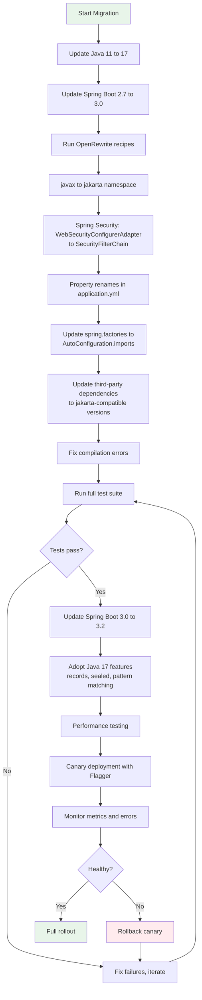
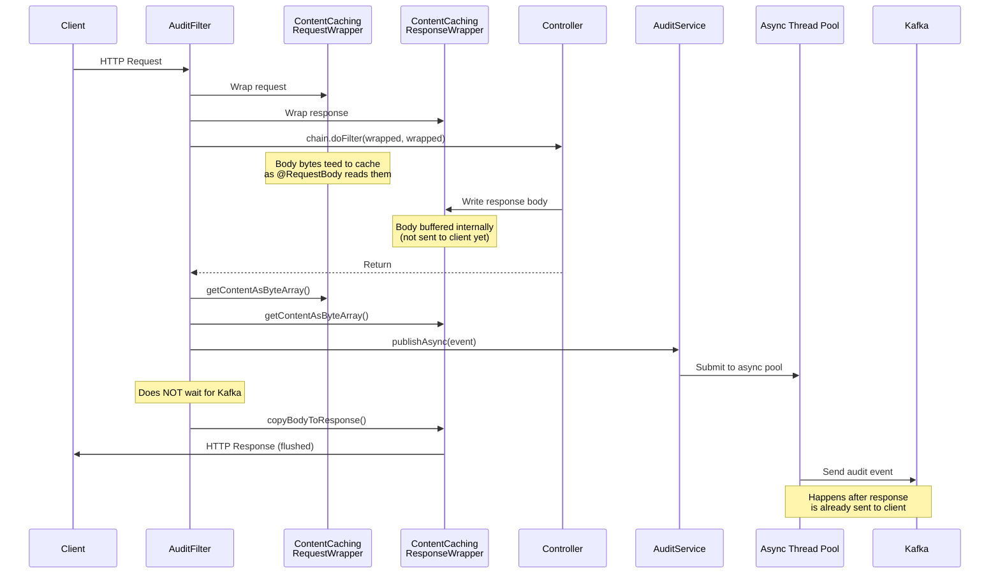
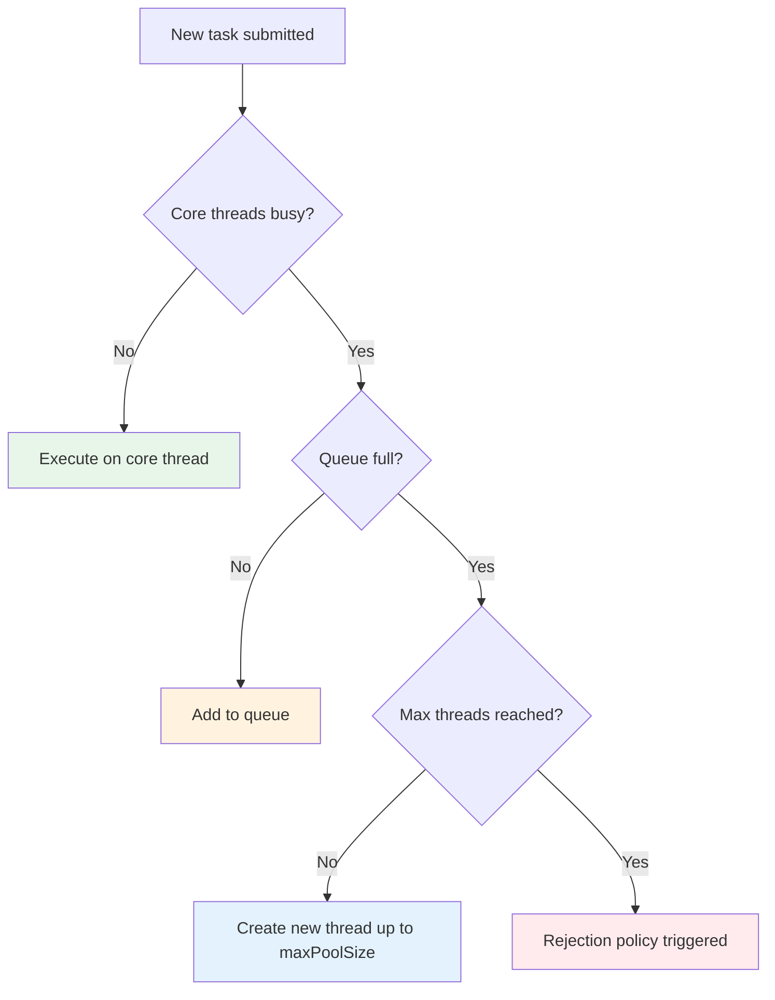
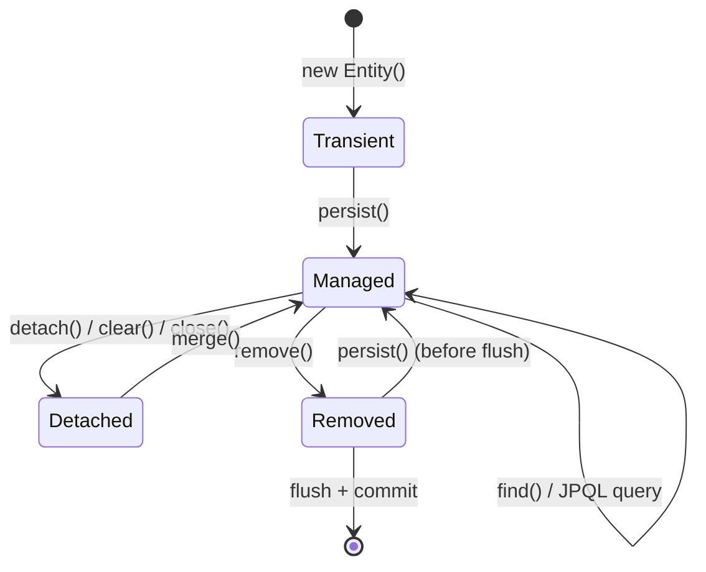

# Spring Boot 3 -- Complete Study Guide

**For:** Anshul Garg | Backend Engineer | Google Interview Preparation
**Context:** Built reusable Spring Boot starter JAR with async HTTP body capture at Walmart; led Spring Boot 2.7 to 3.2 / Java 11 to 17 migration with Flagger canary releases; developed DC Inventory Search API with OpenAPI design-first and factory pattern; optimized API performance at PayU reducing loan disbursal TAT by 66%

---

# TABLE OF CONTENTS

1. [Part 1: Auto-configuration Deep Dive](#part-1-auto-configuration-deep-dive)
   - [How Auto-configuration Works](#how-auto-configuration-works)
   - [@EnableAutoConfiguration Internals](#enableautoconfiguration-internals)
   - [@Conditional Annotations](#conditional-annotations)
   - [spring.factories vs AutoConfiguration.imports](#springfactories-vs-autoconfigurationimports)
   - [Debugging Auto-configuration](#debugging-auto-configuration)
2. [Part 2: Custom Spring Boot Starters](#part-2-custom-spring-boot-starters)
   - [Naming Conventions](#naming-conventions)
   - [Two-Module Pattern](#two-module-pattern)
   - [Building the Autoconfigure Module](#building-the-autoconfigure-module)
   - [@ConfigurationProperties](#configurationproperties)
   - [How Anshul Built the Audit Starter JAR](#how-anshul-built-the-audit-starter-jar)
3. [Part 3: Spring Boot 2.7 to 3.2 Migration](#part-3-spring-boot-27-to-32-migration)
   - [javax to jakarta Namespace](#javax-to-jakarta-namespace)
   - [Spring Security 6 Changes](#spring-security-6-changes)
   - [Property Renames and Deprecations](#property-renames-and-deprecations)
   - [Migration Checklist](#migration-checklist)
   - [Canary Release Strategy](#canary-release-strategy)
4. [Part 4: ContentCachingWrapper](#part-4-contentcachingwrapper)
   - [The Problem: Servlet Streams Are Single-Read](#the-problem-servlet-streams-are-single-read)
   - [ContentCachingRequestWrapper](#contentcachingrequestwrapper)
   - [ContentCachingResponseWrapper](#contentcachingresponsewrapper)
   - [Async Capture Pattern](#async-capture-pattern)
5. [Part 5: @Async and Thread Pool Management](#part-5-async-and-thread-pool-management)
   - [@EnableAsync and How It Works](#enableasync-and-how-it-works)
   - [ThreadPoolTaskExecutor Configuration](#threadpooltaskexecutor-configuration)
   - [Core Pool, Max Pool, and Queue Capacity](#core-pool-max-pool-and-queue-capacity)
   - [Rejection Policies](#rejection-policies)
   - [Context Propagation](#context-propagation)
   - [Exception Handling in Async Methods](#exception-handling-in-async-methods)
6. [Part 6: Spring Security 6](#part-6-spring-security-6)
   - [SecurityFilterChain Architecture](#securityfilterchain-architecture)
   - [Authentication and Authorization](#authentication-and-authorization)
   - [CSRF and CORS](#csrf-and-cors)
   - [OAuth2 and JWT Integration](#oauth2-and-jwt-integration)
7. [Part 7: Spring Data JPA and Hibernate](#part-7-spring-data-jpa-and-hibernate)
   - [Entity Lifecycle](#entity-lifecycle)
   - [Lazy vs Eager Loading](#lazy-vs-eager-loading)
   - [The N+1 Problem](#the-n1-problem)
   - [@BatchSize and Fetch Optimization](#batchsize-and-fetch-optimization)
   - [First-Level and Second-Level Cache](#first-level-and-second-level-cache)
   - [Query Optimization](#query-optimization)
8. [Part 8: Actuator and Observability](#part-8-actuator-and-observability)
   - [Built-in Endpoints](#built-in-endpoints)
   - [Custom Health Indicators](#custom-health-indicators)
   - [Micrometer and Prometheus](#micrometer-and-prometheus)
   - [Custom Metrics](#custom-metrics)
9. [Part 9: Profiles and Externalized Configuration](#part-9-profiles-and-externalized-configuration)
   - [@Profile Annotation](#profile-annotation)
   - [@ConfigurationProperties Binding](#configurationproperties-binding)
   - [YAML and Property Files](#yaml-and-property-files)
   - [Configuration Precedence Order](#configuration-precedence-order)
10. [Part 10: How Anshul Used It](#part-10-how-anshul-used-it)
    - [Starter JAR Architecture](#starter-jar-architecture)
    - [ContentCachingWrapper Flow](#contentcachingwrapper-flow)
    - [Migration Story: 2.7 to 3.2](#migration-story-27-to-32)
    - [Factory Pattern for Multi-Site API](#factory-pattern-for-multi-site-api)
    - [PayU: API Performance Optimization](#payu-api-performance-optimization)
11. [Part 11: Interview Q&A (25+ Questions)](#part-11-interview-qa)

---

# PART 1: AUTO-CONFIGURATION DEEP DIVE

## How Auto-configuration Works

Spring Boot auto-configuration is the mechanism that automatically configures your Spring application based on the JARs on the classpath, the beans you have defined, and various property settings. It is what makes Spring Boot "opinionated" -- it provides sensible defaults so that you can start building features without writing boilerplate configuration.

**The core principle:** Spring Boot looks at what is available (classes on classpath, existing beans, properties) and decides what to configure. If you have `spring-boot-starter-web` on your classpath, Spring Boot auto-configures an embedded Tomcat, a `DispatcherServlet`, default error pages, and Jackson for JSON serialization. If you have `spring-boot-starter-data-jpa` and an H2 dependency, it auto-configures a DataSource, EntityManagerFactory, and transaction manager.

**Key design principle -- back-off:** Auto-configuration always backs off when you define your own beans. For example, if you define your own `DataSource` bean, Spring Boot will not auto-configure one. This is implemented through `@Conditional` annotations.

```
Application starts
       |
       v
@SpringBootApplication triggers @EnableAutoConfiguration
       |
       v
AutoConfigurationImportSelector loads candidate classes
from META-INF/spring/org.springframework.boot.autoconfigure.AutoConfiguration.imports
       |
       v
Each candidate is evaluated against its @Conditional annotations
       |
       v
Matching configurations are registered as beans
       |
       v
Your @Configuration classes and @Bean methods can override any auto-configured bean
```

## @EnableAutoConfiguration Internals

`@SpringBootApplication` is a composed annotation that includes three annotations:

```java
@Target(ElementType.TYPE)
@Retention(RetentionPolicy.RUNTIME)
@SpringBootConfiguration   // equivalent to @Configuration
@EnableAutoConfiguration   // triggers auto-configuration
@ComponentScan             // scans current package and sub-packages
public @interface SpringBootApplication {
    // ...
}
```

`@EnableAutoConfiguration` itself uses `@Import(AutoConfigurationImportSelector.class)`. The `AutoConfigurationImportSelector` implements `DeferredImportSelector`, which means it runs after all `@Configuration` classes have been processed. This is important because it allows auto-configuration to back off based on what beans the user has already defined.

**How AutoConfigurationImportSelector works internally:**

1. Calls `getCandidateConfigurations()` which loads class names from `META-INF/spring/org.springframework.boot.autoconfigure.AutoConfiguration.imports` (Spring Boot 3.x) or `META-INF/spring.factories` (Spring Boot 2.x, deprecated in 3.x).
2. Removes duplicates and applies exclusions (from `@SpringBootApplication(exclude = ...)` or `spring.autoconfigure.exclude` property).
3. Filters candidates using `AutoConfigurationImportFilter` -- this is a fast check that evaluates `@ConditionalOnClass` before loading the class, improving startup time.
4. Sorts the remaining candidates by `@AutoConfigureOrder`, `@AutoConfigureBefore`, and `@AutoConfigureAfter`.
5. Returns the final list of configuration classes to be imported.

```java
// Simplified view of what AutoConfigurationImportSelector does
public class AutoConfigurationImportSelector implements DeferredImportSelector {

    @Override
    public String[] selectImports(AnnotationMetadata metadata) {
        // 1. Load all candidate auto-configuration classes
        List<String> candidates = getCandidateConfigurations(metadata, attributes);
        // Typically 100-150 candidates from spring-boot-autoconfigure

        // 2. Remove duplicates
        candidates = removeDuplicates(candidates);

        // 3. Apply exclusions
        Set<String> exclusions = getExclusions(metadata, attributes);
        candidates.removeAll(exclusions);

        // 4. Filter using AutoConfigurationImportFilter
        // (evaluates @ConditionalOnClass without loading the class)
        candidates = filter(candidates, autoConfigurationMetadata);

        // 5. Sort by @AutoConfigureOrder, @AutoConfigureBefore, @AutoConfigureAfter
        candidates = sort(candidates, autoConfigurationMetadata);

        return candidates.toArray(new String[0]);
    }
}
```

## @Conditional Annotations

`@Conditional` annotations are the backbone of auto-configuration. They determine whether a configuration class or bean should be loaded.

| Annotation | Condition | Example Use |
|---|---|---|
| `@ConditionalOnClass` | Class is on classpath | `@ConditionalOnClass(DataSource.class)` -- configure DB only if JDBC driver available |
| `@ConditionalOnMissingClass` | Class is NOT on classpath | Skip config if a competing library is present |
| `@ConditionalOnBean` | Bean exists in context | `@ConditionalOnBean(DataSource.class)` -- configure JPA only if DataSource exists |
| `@ConditionalOnMissingBean` | Bean does NOT exist | `@ConditionalOnMissingBean(ObjectMapper.class)` -- provide default only if user has not defined one |
| `@ConditionalOnProperty` | Property has specific value | `@ConditionalOnProperty(name = "feature.enabled", havingValue = "true")` |
| `@ConditionalOnResource` | Resource exists on classpath | `@ConditionalOnResource(resources = "classpath:schema.sql")` |
| `@ConditionalOnWebApplication` | Running in a web context | Separate config for web vs non-web apps |
| `@ConditionalOnNotWebApplication` | NOT a web application | Configure for CLI or batch apps |
| `@ConditionalOnExpression` | SpEL expression evaluates to true | Complex conditional logic |
| `@ConditionalOnJava` | Specific Java version | `@ConditionalOnJava(JavaVersion.SEVENTEEN)` |
| `@ConditionalOnCloudPlatform` | Running on specific cloud | `@ConditionalOnCloudPlatform(CloudPlatform.KUBERNETES)` |

**Real example from Spring Boot source -- DataSource auto-configuration:**

```java
@AutoConfiguration(before = SqlInitializationAutoConfiguration.class)
@ConditionalOnClass({ DataSource.class, EmbeddedDatabaseType.class })
@ConditionalOnMissingBean(type = "io.r2dbc.spi.ConnectionFactory")
@EnableConfigurationProperties(DataSourceProperties.class)
@Import({
    DataSourcePoolMetadataProvidersConfiguration.class,
    DataSourceCheckpointRestoreConfiguration.class
})
public class DataSourceAutoConfiguration {

    @Configuration(proxyBeanMethods = false)
    @Conditional(EmbeddedDatabaseCondition.class)
    @ConditionalOnMissingBean({ DataSource.class, XADataSource.class })
    @Import(EmbeddedDataSourceConfiguration.class)
    protected static class EmbeddedDatabaseConfiguration {
    }

    @Configuration(proxyBeanMethods = false)
    @Conditional(PooledDataSourceCondition.class)
    @ConditionalOnMissingBean({ DataSource.class, XADataSource.class })
    @Import({
        HikariDataSourceConfiguration.class,
        TomcatDataSourceConfiguration.class,
        // ...
    })
    protected static class PooledDataSourceConfiguration {
    }
}
```

**Writing your own @Conditional:**

```java
public class OnFeatureFlagCondition implements Condition {

    @Override
    public boolean matches(ConditionContext context, AnnotatedTypeMetadata metadata) {
        Environment env = context.getEnvironment();
        String flag = env.getProperty("myapp.feature.new-ui", "false");
        return "true".equalsIgnoreCase(flag);
    }
}

// Usage
@Configuration
@Conditional(OnFeatureFlagCondition.class)
public class NewUiConfiguration {
    // beans for new UI feature
}
```

## spring.factories vs AutoConfiguration.imports

Spring Boot 3.0 introduced a new file for registering auto-configuration classes and deprecated the use of `spring.factories` for this purpose.

| Aspect | spring.factories (2.x) | AutoConfiguration.imports (3.x) |
|---|---|---|
| File location | `META-INF/spring.factories` | `META-INF/spring/org.springframework.boot.autoconfigure.AutoConfiguration.imports` |
| Format | Key-value properties (all types in one file) | One fully qualified class name per line |
| Purpose | Multiple Spring extension points | Only auto-configuration classes |
| Spring Boot 3.x | Deprecated for auto-config, still used for other SPI | Preferred approach |
| Performance | Loads all entries even if irrelevant | Dedicated loading, more efficient |

**spring.factories (old way):**

```properties
# META-INF/spring.factories
org.springframework.boot.autoconfigure.EnableAutoConfiguration=\
com.mycompany.MyAutoConfiguration,\
com.mycompany.AnotherAutoConfiguration
```

**AutoConfiguration.imports (new way):**

```
# META-INF/spring/org.springframework.boot.autoconfigure.AutoConfiguration.imports
com.mycompany.MyAutoConfiguration
com.mycompany.AnotherAutoConfiguration
```

**Migration note:** Spring Boot 2.7 introduced the `.imports` file as a transitional step. Both mechanisms worked side-by-side. In Spring Boot 3.0, `spring.factories` no longer works for auto-configuration registration. During the 2.7 to 3.2 migration that Anshul led, this was one of the changes required for any custom starters.

## Debugging Auto-configuration

When auto-configuration does not behave as expected, there are several debugging strategies:

**1. The --debug flag or debug property:**

```bash
java -jar myapp.jar --debug
# or in application.properties:
# debug=true
```

This produces a "CONDITIONS EVALUATION REPORT" at startup:

```
============================
CONDITIONS EVALUATION REPORT
============================

Positive matches:
-----------------
   DataSourceAutoConfiguration matched:
      - @ConditionalOnClass found required classes 'javax.sql.DataSource',
        'org.springframework.jdbc.datasource.embedded.EmbeddedDatabaseType'
      - @ConditionalOnMissingBean (types: io.r2dbc.spi.ConnectionFactory; ...) did not find any beans

Negative matches:
-----------------
   ActiveMQAutoConfiguration:
      Did not match:
         - @ConditionalOnClass did not find required class 'jakarta.jms.ConnectionFactory'

Exclusions:
-----------
   org.springframework.boot.autoconfigure.security.servlet.SecurityAutoConfiguration
```

**2. Actuator /conditions endpoint:**

```bash
GET /actuator/conditions
```

Returns JSON with the same positive/negative matches, queryable at runtime.

**3. Logging auto-configuration:**

```yaml
logging:
  level:
    org.springframework.boot.autoconfigure: DEBUG
```

**4. Programmatic inspection:**

```java
@Component
public class AutoConfigReport implements CommandLineRunner {

    @Autowired
    private ConditionEvaluationReport report;

    @Override
    public void run(String... args) {
        report.getConditionAndOutcomesBySource().forEach((source, outcomes) -> {
            System.out.println("Source: " + source);
            outcomes.forEach(outcome ->
                System.out.println("  " + outcome.getOutcome())
            );
        });
    }
}
```

---

# PART 2: CUSTOM SPRING BOOT STARTERS

## Naming Conventions

Spring Boot follows strict naming conventions for starters to distinguish official starters from third-party ones:

| Type | Naming Pattern | Example |
|---|---|---|
| Official Spring Boot | `spring-boot-starter-{name}` | `spring-boot-starter-web`, `spring-boot-starter-data-jpa` |
| Third-party / Custom | `{name}-spring-boot-starter` | `audit-spring-boot-starter`, `acme-spring-boot-starter` |

**Why this matters:** The official `spring-boot-starter-*` prefix is reserved. If you create a custom starter and name it `spring-boot-starter-audit`, it could be confused with an official module. The convention `audit-spring-boot-starter` clearly signals a third-party or organization-internal starter.

## Two-Module Pattern

The recommended pattern for building a custom starter is to split it into two Maven (or Gradle) modules:

```
audit-spring-boot/
  |-- audit-spring-boot-autoconfigure/   <-- Auto-configuration logic
  |     |-- src/main/java/
  |     |     |-- com.walmart.audit/
  |     |           |-- AuditAutoConfiguration.java
  |     |           |-- AuditProperties.java
  |     |           |-- AuditService.java
  |     |           |-- AuditFilter.java
  |     |-- src/main/resources/
  |     |     |-- META-INF/
  |     |           |-- spring/
  |     |           |     |-- org.springframework.boot.autoconfigure.AutoConfiguration.imports
  |     |           |-- additional-spring-configuration-metadata.json
  |     |-- pom.xml
  |
  |-- audit-spring-boot-starter/         <-- Dependency aggregator (no code)
  |     |-- pom.xml                       <-- depends on autoconfigure + transitive deps
  |
  |-- pom.xml (parent)
```

**Why two modules?**

- **autoconfigure module**: Contains the actual auto-configuration code, `@Conditional` logic, and configuration properties. It has `optional` dependencies so consumers only get what they need.
- **starter module**: A dependency-only POM with zero code. It pulls in the autoconfigure module plus all required transitive dependencies. Consumers add just the starter to their `pom.xml` and everything works.

**Starter POM (no code, just dependencies):**

```xml
<!-- audit-spring-boot-starter/pom.xml -->
<project>
    <artifactId>audit-spring-boot-starter</artifactId>
    <dependencies>
        <dependency>
            <groupId>com.walmart.platform</groupId>
            <artifactId>audit-spring-boot-autoconfigure</artifactId>
            <version>${project.version}</version>
        </dependency>
        <!-- Transitive dependencies the consumer needs -->
        <dependency>
            <groupId>org.springframework.boot</groupId>
            <artifactId>spring-boot-starter-web</artifactId>
        </dependency>
        <dependency>
            <groupId>org.springframework.kafka</groupId>
            <artifactId>spring-kafka</artifactId>
        </dependency>
    </dependencies>
</project>
```

## Building the Autoconfigure Module

The autoconfigure module contains the real logic. Here is the structure for the audit starter Anshul built:

**Step 1: Configuration properties class**

```java
@ConfigurationProperties(prefix = "walmart.audit")
public class AuditProperties {

    /** Whether audit logging is enabled */
    private boolean enabled = true;

    /** Kafka topic for audit events */
    private String topic = "audit-events";

    /** Patterns of URL paths to include (Ant-style) */
    private List<String> includePaths = List.of("/**");

    /** Patterns of URL paths to exclude */
    private List<String> excludePaths = List.of("/actuator/**", "/health/**");

    /** Whether to capture request body */
    private boolean captureRequestBody = true;

    /** Whether to capture response body */
    private boolean captureResponseBody = true;

    /** Max body size to capture in bytes */
    private int maxBodySize = 10_240; // 10 KB

    /** Async thread pool configuration */
    private AsyncPool asyncPool = new AsyncPool();

    public static class AsyncPool {
        private int coreSize = 5;
        private int maxSize = 10;
        private int queueCapacity = 100;
        private String threadNamePrefix = "audit-async-";
        // getters and setters
    }
    // getters and setters
}
```

**Step 2: The auto-configuration class**

```java
@AutoConfiguration
@ConditionalOnWebApplication(type = ConditionalOnWebApplication.Type.SERVLET)
@ConditionalOnClass({ Servlet.class, DispatcherServlet.class })
@ConditionalOnProperty(name = "walmart.audit.enabled", havingValue = "true", matchIfMissing = true)
@EnableConfigurationProperties(AuditProperties.class)
public class AuditAutoConfiguration {

    @Bean
    @ConditionalOnMissingBean
    public AuditService auditService(KafkaTemplate<String, AuditEvent> kafkaTemplate,
                                     AuditProperties properties) {
        return new DefaultAuditService(kafkaTemplate, properties);
    }

    @Bean
    @ConditionalOnMissingBean
    public AuditFilter auditFilter(AuditService auditService,
                                   AuditProperties properties) {
        return new AuditFilter(auditService, properties);
    }

    @Bean
    @ConditionalOnMissingBean(name = "auditTaskExecutor")
    public AsyncTaskExecutor auditTaskExecutor(AuditProperties properties) {
        ThreadPoolTaskExecutor executor = new ThreadPoolTaskExecutor();
        executor.setCorePoolSize(properties.getAsyncPool().getCoreSize());
        executor.setMaxPoolSize(properties.getAsyncPool().getMaxSize());
        executor.setQueueCapacity(properties.getAsyncPool().getQueueCapacity());
        executor.setThreadNamePrefix(properties.getAsyncPool().getThreadNamePrefix());
        executor.setRejectionPolicy(new ThreadPoolExecutor.CallerRunsPolicy());
        executor.initialize();
        return executor;
    }

    @Bean
    public FilterRegistrationBean<AuditFilter> auditFilterRegistration(AuditFilter filter) {
        FilterRegistrationBean<AuditFilter> registration = new FilterRegistrationBean<>();
        registration.setFilter(filter);
        registration.addUrlPatterns("/*");
        registration.setOrder(Ordered.HIGHEST_PRECEDENCE + 10);
        return registration;
    }
}
```

**Step 3: Register the auto-configuration**

```
# META-INF/spring/org.springframework.boot.autoconfigure.AutoConfiguration.imports
com.walmart.audit.autoconfigure.AuditAutoConfiguration
```

**Step 4: Optional -- configuration metadata for IDE support**

```json
// META-INF/additional-spring-configuration-metadata.json
{
  "properties": [
    {
      "name": "walmart.audit.enabled",
      "type": "java.lang.Boolean",
      "description": "Enable or disable audit logging.",
      "defaultValue": true
    },
    {
      "name": "walmart.audit.topic",
      "type": "java.lang.String",
      "description": "Kafka topic for audit events.",
      "defaultValue": "audit-events"
    },
    {
      "name": "walmart.audit.max-body-size",
      "type": "java.lang.Integer",
      "description": "Maximum request/response body size to capture in bytes.",
      "defaultValue": 10240
    }
  ]
}
```

## @ConfigurationProperties

`@ConfigurationProperties` is the type-safe way to bind external configuration to Java objects. It is strongly preferred over `@Value` for anything beyond simple values.

**Key features:**

- Type-safe binding with relaxed property name matching (`my-property`, `myProperty`, `MY_PROPERTY` all bind to `myProperty`)
- Validation with JSR-303 annotations (`@NotNull`, `@Min`, `@Max`)
- Nested object binding
- Collection binding (lists, maps, sets)
- Constructor binding (immutable configuration)

```java
@ConfigurationProperties(prefix = "myapp.datasource")
@Validated
public class DataSourceProperties {

    @NotBlank
    private String url;

    @NotBlank
    private String username;

    private String password;

    @Min(1)
    @Max(100)
    private int maxPoolSize = 10;

    private Duration connectionTimeout = Duration.ofSeconds(30);

    private Map<String, String> properties = new HashMap<>();

    // getters and setters
}
```

**Constructor binding (immutable, preferred in Spring Boot 3.x):**

```java
@ConfigurationProperties(prefix = "myapp.datasource")
public record DataSourceProperties(
    @NotBlank String url,
    @NotBlank String username,
    String password,
    @DefaultValue("10") int maxPoolSize,
    @DefaultValue("30s") Duration connectionTimeout,
    @DefaultValue Map<String, String> properties
) {}
```

**Enabling @ConfigurationProperties:**

```java
// Option 1: On the auto-configuration class (preferred for starters)
@EnableConfigurationProperties(DataSourceProperties.class)

// Option 2: On the properties class itself
@ConfigurationProperties(prefix = "myapp.datasource")
@Component  // makes it a bean directly

// Option 3: Scan (useful for many properties classes)
@ConfigurationPropertiesScan("com.myapp.config")
```

## How Anshul Built the Audit Starter JAR

Anshul built a reusable Spring Boot starter JAR at Walmart that provided automatic HTTP request/response audit logging. The starter was adopted as an organization-wide standard across the DC (Distribution Center) team, reducing integration effort from approximately 2 weeks to 1 day per service.

**Architecture overview:**

```mermaid
graph TB
    subgraph "Consumer Service"
        A[pom.xml] -->|adds dependency| B[audit-spring-boot-starter]
        C[application.yml] -->|configures| D[AuditProperties]
    end

    subgraph "Starter JAR (auto-configured)"
        B --> E[AuditAutoConfiguration]
        E --> F[AuditFilter<br>ContentCachingWrapper]
        E --> G[AuditService]
        E --> H[ThreadPoolTaskExecutor]
        D --> E
    end

    subgraph "Infrastructure"
        F -->|captures HTTP body| I[ContentCachingRequestWrapper<br>ContentCachingResponseWrapper]
        I -->|@Async| G
        G -->|publishes| J[Kafka Topic:<br>audit-events]
    end

    style B fill:#e1f5fe
    style E fill:#fff3e0
    style J fill:#e8f5e9
```

**What consuming services needed to do:**

```xml
<!-- Just add this one dependency -->
<dependency>
    <groupId>com.walmart.platform</groupId>
    <artifactId>audit-spring-boot-starter</artifactId>
    <version>1.2.0</version>
</dependency>
```

```yaml
# Optionally customize in application.yml
walmart:
  audit:
    enabled: true
    topic: dc-inventory-audit-events
    include-paths:
      - /api/v1/**
    exclude-paths:
      - /actuator/**
      - /internal/**
    capture-request-body: true
    capture-response-body: true
    max-body-size: 20480
    async-pool:
      core-size: 5
      max-size: 15
      queue-capacity: 200
```

That is it. No boilerplate filter registration, no Kafka producer setup, no thread pool configuration. The starter auto-configured everything with sensible defaults and allowed override through properties.

**Why 2 weeks became 1 day:**

Before the starter, each team had to:
1. Write a servlet filter to capture HTTP request/response (3-4 days)
2. Handle the single-read problem with `ContentCachingWrapper` (1-2 days)
3. Configure Kafka producer and serialization (2-3 days)
4. Set up async thread pool so audit logging does not block requests (1-2 days)
5. Write tests (2-3 days)
6. Code review and deployment (1-2 days)

With the starter, a developer adds one dependency, writes 5-10 lines of YAML, and deploys. One day including testing and review.

---

# PART 3: SPRING BOOT 2.7 TO 3.2 MIGRATION

Anshul led the migration of Walmart DC services from Spring Boot 2.7 / Java 11 to Spring Boot 3.2 / Java 17. This was not a trivial upgrade -- Spring Boot 3.0 was a major version with breaking changes. The migration was deployed using Flagger canary releases with zero customer-impacting issues.

## javax to jakarta Namespace

The single largest breaking change in Spring Boot 3.0 is the move from Java EE (`javax.*`) to Jakarta EE (`jakarta.*`) namespaces. This happened because Oracle transferred Java EE to the Eclipse Foundation, which could not use the `javax` trademark.

**What changed:**

| Old (javax) | New (jakarta) |
|---|---|
| `javax.servlet.*` | `jakarta.servlet.*` |
| `javax.persistence.*` | `jakarta.persistence.*` |
| `javax.validation.*` | `jakarta.validation.*` |
| `javax.annotation.*` | `jakarta.annotation.*` |
| `javax.transaction.*` | `jakarta.transaction.*` |
| `javax.websocket.*` | `jakarta.websocket.*` |
| `javax.mail.*` | `jakarta.mail.*` |

**What did NOT change:** `javax.sql.*`, `javax.crypto.*`, `javax.net.*` and other packages that are part of the Java SE platform (not Java EE) stayed the same.

**Migration approach:**

```java
// BEFORE (Spring Boot 2.7 / Java 11)
import javax.servlet.Filter;
import javax.servlet.FilterChain;
import javax.servlet.http.HttpServletRequest;
import javax.servlet.http.HttpServletResponse;
import javax.persistence.Entity;
import javax.persistence.Id;
import javax.validation.constraints.NotNull;

// AFTER (Spring Boot 3.2 / Java 17)
import jakarta.servlet.Filter;
import jakarta.servlet.FilterChain;
import jakarta.servlet.http.HttpServletRequest;
import jakarta.servlet.http.HttpServletResponse;
import jakarta.persistence.Entity;
import jakarta.persistence.Id;
import jakarta.validation.constraints.NotNull;
```

**Automated tools Anshul used:**

1. **OpenRewrite** -- the most effective tool for this migration:

```xml
<!-- Add to pom.xml temporarily -->
<plugin>
    <groupId>org.openrewrite.maven</groupId>
    <artifactId>rewrite-maven-plugin</artifactId>
    <version>5.8.1</version>
    <configuration>
        <activeRecipes>
            <recipe>org.openrewrite.java.spring.boot3.UpgradeSpringBoot_3_2</recipe>
        </activeRecipes>
    </configuration>
    <dependencies>
        <dependency>
            <groupId>org.openrewrite.recipe</groupId>
            <artifactId>rewrite-spring</artifactId>
            <version>5.2.0</version>
        </dependency>
    </dependencies>
</plugin>
```

```bash
# Run the migration recipe
mvn rewrite:run
```

OpenRewrite handles: javax to jakarta renames, property renames, deprecated API replacements, and Spring Security DSL changes.

2. **IntelliJ IDEA migration tool**: Edit > Find > Replace in Path with regex for manual cleanup.

3. **Third-party library compatibility check**: Not all libraries had jakarta-compatible versions at migration time. Anshul had to verify each dependency.

## Spring Security 6 Changes

Spring Security 6 (which ships with Spring Boot 3.x) introduced significant API changes:

**The big change -- Lambda DSL is now required:**

```java
// BEFORE (Spring Boot 2.7 -- method chaining, deprecated in 3.x)
@Configuration
@EnableWebSecurity
public class SecurityConfig extends WebSecurityConfigurerAdapter {

    @Override
    protected void configure(HttpSecurity http) throws Exception {
        http
            .authorizeRequests()
                .antMatchers("/api/public/**").permitAll()
                .antMatchers("/api/admin/**").hasRole("ADMIN")
                .anyRequest().authenticated()
            .and()
            .httpBasic()
            .and()
            .csrf().disable();
    }
}

// AFTER (Spring Boot 3.2 -- component-based, Lambda DSL)
@Configuration
@EnableWebSecurity
public class SecurityConfig {

    @Bean
    public SecurityFilterChain filterChain(HttpSecurity http) throws Exception {
        http
            .authorizeHttpRequests(auth -> auth
                .requestMatchers("/api/public/**").permitAll()
                .requestMatchers("/api/admin/**").hasRole("ADMIN")
                .anyRequest().authenticated()
            )
            .httpBasic(Customizer.withDefaults())
            .csrf(csrf -> csrf.disable());
        return http.build();
    }
}
```

**Key changes summary:**

| Spring Security 5 (Boot 2.7) | Spring Security 6 (Boot 3.x) |
|---|---|
| `WebSecurityConfigurerAdapter` | `SecurityFilterChain` @Bean |
| `.authorizeRequests()` | `.authorizeHttpRequests()` |
| `.antMatchers()` | `.requestMatchers()` |
| `.access("hasRole('ADMIN')")` | `.hasRole("ADMIN")` |
| Method chaining with `.and()` | Lambda DSL (no `.and()`) |
| `@EnableGlobalMethodSecurity` | `@EnableMethodSecurity` |
| `SecurityContextHolder` uses `MODE_THREADLOCAL` | No change, but virtual threads support added |

## Property Renames and Deprecations

Spring Boot 3.x renamed and removed many properties:

| Old Property (2.7) | New Property (3.x) | Notes |
|---|---|---|
| `spring.redis.*` | `spring.data.redis.*` | Moved under `spring.data` |
| `spring.elasticsearch.*` | `spring.elasticsearch.uris` | Restructured |
| `server.max-http-header-size` | `server.max-http-request-header-size` | More specific name |
| `spring.mvc.throw-exception-if-no-handler-found` | Removed (now default behavior) | Always throws |
| `spring.jpa.hibernate.use-new-id-generator-mappings` | Removed | New generators are always used |
| `management.metrics.export.*` | `management.*.<product>.metrics.export.*` | Restructured |
| `spring.security.oauth2.resourceserver.jwt.jws-algorithm` | `spring.security.oauth2.resourceserver.jwt.jws-algorithms` | Plural |

**Java 17 language features Anshul adopted during migration:**

```java
// Records (replacing boilerplate DTOs)
public record InventoryResponse(
    String siteId,
    String itemNumber,
    int quantity,
    Instant lastUpdated
) {}

// Sealed interfaces (for the factory pattern)
public sealed interface SiteHandler
    permits UsSiteHandler, CaSiteHandler, MxSiteHandler {}

// Pattern matching for instanceof
if (exception instanceof NotFoundException nfe) {
    return ResponseEntity.notFound().build();
}

// Text blocks for SQL/JSON
String query = """
    SELECT i.item_number, i.quantity, i.site_id
    FROM inventory i
    WHERE i.site_id = :siteId
      AND i.quantity > 0
    ORDER BY i.last_updated DESC
    """;

// Switch expressions
String region = switch (siteId.substring(0, 2)) {
    case "US" -> "north-america";
    case "CA" -> "north-america";
    case "MX" -> "latin-america";
    default -> throw new IllegalArgumentException("Unknown site: " + siteId);
};
```

## Migration Checklist



**Detailed checklist Anshul followed:**

1. **Pre-migration preparation**
   - Inventory all services and their dependency trees
   - Identify third-party libraries without jakarta support
   - Set up feature branch and CI pipeline
   - Ensure test coverage is adequate (target: 80%+)

2. **Java version upgrade (11 to 17)**
   - Update `pom.xml` or `build.gradle` for Java 17
   - Update CI/CD Docker images to JDK 17
   - Update Kubernetes deployment manifests
   - Verify GC behavior (ZGC or G1GC tuning)

3. **Spring Boot version upgrade (2.7 to 3.0 to 3.2)**
   - Step through 2.7 first (it has deprecation warnings for 3.0 changes)
   - Then jump to 3.0, then 3.2
   - Each step: compile, test, fix

4. **Namespace migration**
   - Run OpenRewrite `UpgradeSpringBoot_3_2` recipe
   - Manual review of any missed files (XML configs, reflection usage)

5. **Spring Security migration**
   - Replace `WebSecurityConfigurerAdapter` with `SecurityFilterChain` beans
   - Replace `antMatchers` with `requestMatchers`
   - Adopt Lambda DSL

6. **Configuration migration**
   - Rename deprecated properties
   - Update `spring.factories` to `.imports` file for custom starters
   - Review actuator endpoint configuration

7. **Testing and validation**
   - Full unit test suite
   - Integration tests with Testcontainers
   - Load testing to compare performance (2.7 vs 3.2)
   - Security scanning

8. **Deployment with Flagger canary**
   - Deploy to 5% traffic, monitor for 30 minutes
   - Increment to 25%, monitor for 1 hour
   - Increment to 50%, monitor for 2 hours
   - Full rollout

## Canary Release Strategy

Anshul used Flagger with Istio for canary releases during the migration:

```yaml
# Flagger Canary resource
apiVersion: flagger.app/v1beta1
kind: Canary
metadata:
  name: dc-inventory-api
  namespace: dc-platform
spec:
  targetRef:
    apiVersion: apps/v1
    kind: Deployment
    name: dc-inventory-api
  service:
    port: 8080
  analysis:
    interval: 1m
    threshold: 5          # max failed checks before rollback
    maxWeight: 50         # max traffic percentage to canary
    stepWeight: 10        # increment per interval
    metrics:
      - name: request-success-rate
        thresholdRange:
          min: 99          # 99% success rate required
        interval: 1m
      - name: request-duration
        thresholdRange:
          max: 500         # p99 latency must be under 500ms
        interval: 1m
    webhooks:
      - name: load-test
        url: http://loadtester.test/
        metadata:
          cmd: "hey -z 1m -q 10 -c 2 http://dc-inventory-api-canary.dc-platform:8080/api/v1/health"
```

**Result:** Zero customer-impacting issues during the entire migration across all DC services.

---

# PART 4: CONTENTCACHINGWRAPPER

## The Problem: Servlet Streams Are Single-Read

In the Servlet API, `HttpServletRequest.getInputStream()` and `HttpServletResponse.getOutputStream()` can only be read once. Once the stream is consumed (by Spring's `@RequestBody` deserialization, for example), it is gone. Any subsequent attempt to read it returns an empty stream.

This is a fundamental problem for audit logging, request logging, or any cross-cutting concern that needs to inspect the HTTP body without interfering with normal request processing.

```java
// This FAILS -- stream is already consumed by Spring
@Component
public class BrokenAuditFilter implements Filter {

    @Override
    public void doFilter(ServletRequest request, ServletResponse response, FilterChain chain)
            throws IOException, ServletException {

        HttpServletRequest httpRequest = (HttpServletRequest) request;

        // Read the body for audit logging
        String body = new String(httpRequest.getInputStream().readAllBytes());
        // body contains the data, great!

        // Continue the filter chain
        chain.doFilter(request, response);
        // PROBLEM: Spring's @RequestBody handler gets an EMPTY stream
        // because we already consumed it above!
    }
}
```

## ContentCachingRequestWrapper

`ContentCachingRequestWrapper` is Spring's solution. It wraps the original `HttpServletRequest` and caches the request body content as it is being read. After the request has been processed, the cached content is available via `getContentAsByteArray()`.

**How it works internally:**

```
Original HttpServletRequest
       |
       v
ContentCachingRequestWrapper wraps it
       |
       v
When getInputStream() is called (by @RequestBody handler),
the wrapper returns a special InputStream that:
  1. Reads from the original stream
  2. Copies each byte to an internal ByteArrayOutputStream (the cache)
       |
       v
After chain.doFilter() completes:
  - The original stream is consumed (as normal)
  - The cache (ByteArrayOutputStream) contains a copy of the body
  - getContentAsByteArray() returns the cached bytes
```

**Key detail:** The caching happens lazily during the normal read process. It does NOT pre-read the entire body before passing it to the chain. This means there is no extra I/O -- the body is read once, and the wrapper tees the bytes to the cache as they flow through.

```java
// Simplified view of the internal mechanism
public class ContentCachingRequestWrapper extends HttpServletRequestWrapper {

    private final ByteArrayOutputStream cachedContent;
    private final int contentCacheLimit;

    @Override
    public ServletInputStream getInputStream() throws IOException {
        // Return a wrapper that copies bytes to cachedContent as they are read
        return new ContentCachingInputStream(getRequest().getInputStream());
    }

    public byte[] getContentAsByteArray() {
        return this.cachedContent.toByteArray();
    }

    private class ContentCachingInputStream extends ServletInputStream {
        private final ServletInputStream is;

        @Override
        public int read() throws IOException {
            int ch = this.is.read();
            if (ch != -1 && cachedContent.size() < contentCacheLimit) {
                cachedContent.write(ch);  // tee to cache
            }
            return ch;
        }
    }
}
```

## ContentCachingResponseWrapper

`ContentCachingResponseWrapper` works similarly for responses, but with an important difference: it buffers the entire response body and does NOT write it to the original response until `copyBodyToResponse()` is called explicitly.

**How it works:**

```
Controller writes response body
       |
       v
ContentCachingResponseWrapper intercepts the write
       |
       v
Bytes go to an internal buffer (NOT to the client yet)
       |
       v
After chain.doFilter() completes:
  - getContentAsByteArray() returns the buffered response body
  - You MUST call copyBodyToResponse() to flush the buffer to the client
  - Forgetting this call means the client gets an empty response!
```

```java
// CRITICAL: You must call copyBodyToResponse() after reading the cache
ContentCachingResponseWrapper responseWrapper =
    new ContentCachingResponseWrapper(response);

chain.doFilter(requestWrapper, responseWrapper);

// Read the cached response body for audit
byte[] responseBody = responseWrapper.getContentAsByteArray();
String responseBodyStr = new String(responseBody, responseWrapper.getCharacterEncoding());

// CRITICAL: Flush the cached response to the actual client
responseWrapper.copyBodyToResponse();
// If you forget this, the client gets a 200 OK with an empty body!
```

## Async Capture Pattern

In the audit starter JAR, Anshul combined `ContentCachingWrapper` with `@Async` to capture HTTP bodies without blocking the request thread:

```java
public class AuditFilter implements Filter {

    private final AuditService auditService;
    private final AuditProperties properties;

    @Override
    public void doFilter(ServletRequest request, ServletResponse response,
                         FilterChain chain) throws IOException, ServletException {

        HttpServletRequest httpRequest = (HttpServletRequest) request;
        HttpServletResponse httpResponse = (HttpServletResponse) response;

        // Check if this path should be audited
        if (!shouldAudit(httpRequest.getRequestURI())) {
            chain.doFilter(request, response);
            return;
        }

        // Wrap request and response to enable body caching
        ContentCachingRequestWrapper requestWrapper =
            new ContentCachingRequestWrapper(httpRequest, properties.getMaxBodySize());
        ContentCachingResponseWrapper responseWrapper =
            new ContentCachingResponseWrapper(httpResponse);

        long startTime = System.nanoTime();

        try {
            // Execute the actual request
            chain.doFilter(requestWrapper, responseWrapper);
        } finally {
            long duration = TimeUnit.NANOSECONDS.toMillis(System.nanoTime() - startTime);

            // Extract cached bodies (this is fast -- just reading from byte arrays)
            String requestBody = extractBody(requestWrapper.getContentAsByteArray(),
                                              requestWrapper.getCharacterEncoding());
            String responseBody = extractBody(responseWrapper.getContentAsByteArray(),
                                               responseWrapper.getCharacterEncoding());

            // Build audit event with all metadata
            AuditEvent event = AuditEvent.builder()
                .timestamp(Instant.now())
                .method(httpRequest.getMethod())
                .uri(httpRequest.getRequestURI())
                .queryString(httpRequest.getQueryString())
                .requestHeaders(extractHeaders(httpRequest))
                .requestBody(requestBody)
                .responseStatus(responseWrapper.getStatus())
                .responseBody(responseBody)
                .durationMs(duration)
                .clientIp(httpRequest.getRemoteAddr())
                .userAgent(httpRequest.getHeader("User-Agent"))
                .build();

            // Fire-and-forget: publish to Kafka asynchronously
            // This does NOT block the response to the client
            auditService.publishAsync(event);

            // CRITICAL: Flush response body to the client
            responseWrapper.copyBodyToResponse();
        }
    }

    private String extractBody(byte[] content, String encoding) {
        if (content == null || content.length == 0) {
            return "";
        }
        try {
            return new String(content, encoding != null ? encoding : "UTF-8");
        } catch (Exception e) {
            return "[unreadable]";
        }
    }
}
```

**The async publish in AuditService:**

```java
@Service
public class DefaultAuditService implements AuditService {

    private final KafkaTemplate<String, AuditEvent> kafkaTemplate;
    private final AuditProperties properties;

    @Async("auditTaskExecutor")  // uses the dedicated thread pool
    @Override
    public void publishAsync(AuditEvent event) {
        try {
            kafkaTemplate.send(properties.getTopic(), event.getUri(), event)
                .whenComplete((result, ex) -> {
                    if (ex != null) {
                        log.error("Failed to publish audit event: {}", event.getUri(), ex);
                    }
                });
        } catch (Exception e) {
            // Never let audit failure affect the main request
            log.error("Error publishing audit event", e);
        }
    }
}
```



**Performance impact:** By using `@Async` with a dedicated thread pool, the audit logging adds approximately 1-3ms of overhead to request processing (the time to copy byte arrays and submit to the thread pool). The Kafka publish happens entirely off the request thread. Without async, the overhead would be 10-50ms (Kafka network round trip).

---

# PART 5: @ASYNC AND THREAD POOL MANAGEMENT

## @EnableAsync and How It Works

`@Async` is Spring's annotation for executing methods asynchronously. When you call a method annotated with `@Async`, Spring does not execute it on the calling thread. Instead, it submits the method as a task to a `TaskExecutor` (thread pool), and the calling thread continues immediately.

**How it works under the hood:**

1. `@EnableAsync` on a `@Configuration` class activates Spring's async processing.
2. Spring creates a proxy (either JDK dynamic proxy or CGLIB) around beans that have `@Async` methods.
3. When you call an `@Async` method, the proxy intercepts the call.
4. The proxy wraps the method invocation as a `Runnable` or `Callable` and submits it to the configured `TaskExecutor`.
5. The calling thread gets back immediately (void methods) or gets a `Future`/`CompletableFuture`.

```java
@Configuration
@EnableAsync
public class AsyncConfig implements AsyncConfigurer {

    @Override
    public Executor getAsyncExecutor() {
        ThreadPoolTaskExecutor executor = new ThreadPoolTaskExecutor();
        executor.setCorePoolSize(10);
        executor.setMaxPoolSize(25);
        executor.setQueueCapacity(100);
        executor.setThreadNamePrefix("app-async-");
        executor.setRejectionPolicy(new ThreadPoolExecutor.CallerRunsPolicy());
        executor.setWaitForTasksToCompleteOnShutdown(true);
        executor.setAwaitTerminationSeconds(30);
        executor.initialize();
        return executor;
    }

    @Override
    public AsyncUncaughtExceptionHandler getAsyncUncaughtExceptionHandler() {
        return (throwable, method, params) -> {
            log.error("Async method {} threw exception: {}", method.getName(), throwable.getMessage(), throwable);
        };
    }
}
```

**Critical gotcha -- self-invocation does not work:**

```java
@Service
public class MyService {

    @Async
    public void asyncMethod() {
        // This runs asynchronously when called from OUTSIDE this class
    }

    public void regularMethod() {
        asyncMethod();
        // WARNING: This call is NOT async!
        // It bypasses the proxy because it is a self-invocation
        // (calling a method on 'this' instead of the proxy)
    }
}
```

This is because `@Async` works through AOP proxies. When a bean calls its own method, it calls `this.asyncMethod()`, which bypasses the proxy. The proxy only intercepts calls that come from other beans.

**Solutions:**
1. Extract the async method into a separate bean
2. Inject `self` reference: `@Lazy @Autowired MyService self;` then call `self.asyncMethod()`
3. Use `AopContext.currentProxy()` (not recommended)

## ThreadPoolTaskExecutor Configuration

`ThreadPoolTaskExecutor` is Spring's wrapper around Java's `ThreadPoolExecutor`. Understanding its configuration parameters is critical for production systems.

```java
@Bean(name = "auditTaskExecutor")
public ThreadPoolTaskExecutor auditTaskExecutor() {
    ThreadPoolTaskExecutor executor = new ThreadPoolTaskExecutor();

    // Core threads: always kept alive, even if idle
    executor.setCorePoolSize(5);

    // Max threads: created when queue is full
    executor.setMaxPoolSize(20);

    // Queue: tasks wait here when core threads are busy
    executor.setQueueCapacity(500);

    // Thread name prefix for debugging
    executor.setThreadNamePrefix("audit-");

    // What happens when queue AND max threads are full
    executor.setRejectionPolicy(new ThreadPoolExecutor.CallerRunsPolicy());

    // Graceful shutdown
    executor.setWaitForTasksToCompleteOnShutdown(true);
    executor.setAwaitTerminationSeconds(60);

    // Allow core threads to timeout (useful for bursty workloads)
    executor.setAllowCoreThreadTimeOut(true);
    executor.setKeepAliveSeconds(60);

    return executor;
}
```

## Core Pool, Max Pool, and Queue Capacity

The interaction between these three parameters is the most misunderstood aspect of Java thread pools:



**The counter-intuitive behavior:** New threads beyond corePoolSize are only created AFTER the queue is full. This means with `corePoolSize=5`, `maxPoolSize=20`, `queueCapacity=500`, the pool will:
1. Use 5 core threads
2. Queue up to 500 tasks
3. Only THEN start creating threads 6-20
4. If 20 threads are busy AND queue is full (505 concurrent tasks), rejection policy kicks in

**This catches many engineers off guard.** If you want threads to scale up before queuing, use a smaller queue capacity or `SynchronousQueue` (capacity 0).

| Configuration | Behavior |
|---|---|
| `core=5, max=5, queue=1000` | Fixed pool of 5 threads, large queue (like `Executors.newFixedThreadPool`) |
| `core=5, max=20, queue=0` | Scales threads aggressively from 5 to 20, no queuing (use `SynchronousQueue`) |
| `core=5, max=20, queue=100` | Moderate: 5 core threads, queue up to 100, then scale to 20 |
| `core=0, max=Integer.MAX, queue=0` | Unbounded threads (like `Executors.newCachedThreadPool`, dangerous in production) |

**For the audit starter, Anshul chose:**
- `corePoolSize=5`: Handles normal steady-state audit traffic
- `maxPoolSize=10`: Handles bursts (sales events, traffic spikes)
- `queueCapacity=100`: Buffer for short bursts without creating threads
- `CallerRunsPolicy`: If completely overloaded, the request thread does the audit work (backpressure)

## Rejection Policies

When the thread pool is saturated (all threads busy, queue full), Java provides four built-in rejection policies:

| Policy | Behavior | Use Case |
|---|---|---|
| `AbortPolicy` (default) | Throws `RejectedExecutionException` | When you want to know about overload |
| `CallerRunsPolicy` | The calling thread executes the task | Backpressure: slows down the producer |
| `DiscardPolicy` | Silently drops the task | When losing tasks is acceptable (metrics, non-critical logging) |
| `DiscardOldestPolicy` | Drops the oldest queued task, retries | When newest data is more important than oldest |

**Why CallerRunsPolicy for audit:** Anshul chose `CallerRunsPolicy` because if the audit thread pool is saturated, it is better to slow down the request thread slightly (by having it do the Kafka publish) than to lose audit events. This provides natural backpressure -- if audit publishing cannot keep up, request processing slows down, which reduces the rate of new audit events.

## Context Propagation

When tasks run on a different thread (via `@Async`), they lose the calling thread's context: MDC (logging), SecurityContext, request-scoped attributes. This is a common source of bugs.

**Problem:**

```java
// Main thread has MDC context: traceId=abc123
MDC.put("traceId", "abc123");

auditService.publishAsync(event);
// Inside publishAsync (on async thread):
// MDC.get("traceId") returns null -- context is lost!
```

**Solution: TaskDecorator**

```java
public class MdcTaskDecorator implements TaskDecorator {

    @Override
    public Runnable decorate(Runnable runnable) {
        // Capture the MDC context from the calling thread
        Map<String, String> contextMap = MDC.getCopyOfContextMap();

        return () -> {
            try {
                // Set the MDC context on the async thread
                if (contextMap != null) {
                    MDC.setContextMap(contextMap);
                }
                runnable.run();
            } finally {
                // Clean up to prevent thread pool contamination
                MDC.clear();
            }
        };
    }
}

// Apply to the executor
@Bean
public ThreadPoolTaskExecutor auditTaskExecutor() {
    ThreadPoolTaskExecutor executor = new ThreadPoolTaskExecutor();
    executor.setTaskDecorator(new MdcTaskDecorator());
    // ... other config
    return executor;
}
```

**For Spring Security context propagation:**

```java
public class SecurityContextTaskDecorator implements TaskDecorator {

    @Override
    public Runnable decorate(Runnable runnable) {
        SecurityContext context = SecurityContextHolder.getContext();
        Map<String, String> mdcContext = MDC.getCopyOfContextMap();

        return () -> {
            try {
                SecurityContextHolder.setContext(context);
                if (mdcContext != null) MDC.setContextMap(mdcContext);
                runnable.run();
            } finally {
                SecurityContextHolder.clearContext();
                MDC.clear();
            }
        };
    }
}
```

## Exception Handling in Async Methods

Exceptions in `@Async` methods behave differently based on return type:

**Void return type -- exceptions are lost by default:**

```java
@Async
public void processInBackground(String data) {
    // If this throws, the exception goes to UncaughtExceptionHandler
    // The caller never sees it!
    throw new RuntimeException("oops");
}
```

**Future/CompletableFuture return type -- exceptions are captured:**

```java
@Async
public CompletableFuture<String> processAsync(String data) {
    // Exception is captured in the Future
    if (data == null) {
        throw new IllegalArgumentException("data is null");
    }
    return CompletableFuture.completedFuture("processed: " + data);
}

// Caller can handle the exception
service.processAsync(data)
    .thenAccept(result -> log.info("Success: {}", result))
    .exceptionally(ex -> {
        log.error("Async failed: {}", ex.getMessage());
        return null;
    });
```

**Global exception handler for void @Async methods:**

```java
@Configuration
@EnableAsync
public class AsyncConfig implements AsyncConfigurer {

    @Override
    public AsyncUncaughtExceptionHandler getAsyncUncaughtExceptionHandler() {
        return (throwable, method, params) -> {
            log.error("Uncaught async exception in method: {} with params: {}",
                      method.getName(), Arrays.toString(params), throwable);
            // Optionally: send alert, increment metric
            Metrics.counter("async.exceptions", "method", method.getName()).increment();
        };
    }
}
```

---

# PART 6: SPRING SECURITY 6

## SecurityFilterChain Architecture

Spring Security is fundamentally a chain of servlet filters. Every HTTP request passes through a `FilterChainProxy` which delegates to one or more `SecurityFilterChain` instances.

```mermaid
graph LR
    A[HTTP Request] --> B[DelegatingFilterProxy]
    B --> C[FilterChainProxy]
    C --> D[SecurityFilterChain]

    subgraph "SecurityFilterChain (ordered filters)"
        D --> E[DisableEncodeUrlFilter]
        E --> F[SecurityContextHolderFilter]
        F --> G[HeaderWriterFilter]
        G --> H[CsrfFilter]
        H --> I[LogoutFilter]
        I --> J[UsernamePasswordAuthFilter]
        J --> K[BearerTokenAuthFilter]
        K --> L[AuthorizationFilter]
    end

    L --> M[DispatcherServlet]
    M --> N[Controller]
```



**Key filters and their order:**

| Order | Filter | Purpose |
|---|---|---|
| 1 | `DisableEncodeUrlFilter` | Prevents session ID in URLs |
| 2 | `SecurityContextHolderFilter` | Loads/stores `SecurityContext` |
| 3 | `HeaderWriterFilter` | Adds security headers (X-Frame-Options, etc.) |
| 4 | `CsrfFilter` | CSRF token validation |
| 5 | `LogoutFilter` | Handles /logout |
| 6 | `UsernamePasswordAuthenticationFilter` | Form login |
| 7 | `BearerTokenAuthenticationFilter` | OAuth2/JWT |
| 8 | `ExceptionTranslationFilter` | Converts security exceptions to HTTP responses |
| 9 | `AuthorizationFilter` | Final access decision (permit/deny) |

**Spring Boot 3.x / Security 6 configuration:**

```java
@Configuration
@EnableWebSecurity
@EnableMethodSecurity  // replaces @EnableGlobalMethodSecurity
public class SecurityConfig {

    @Bean
    public SecurityFilterChain apiFilterChain(HttpSecurity http) throws Exception {
        http
            .securityMatcher("/api/**")
            .authorizeHttpRequests(auth -> auth
                .requestMatchers("/api/public/**").permitAll()
                .requestMatchers("/api/admin/**").hasRole("ADMIN")
                .requestMatchers(HttpMethod.GET, "/api/inventory/**").hasAnyRole("USER", "ADMIN")
                .requestMatchers(HttpMethod.POST, "/api/inventory/**").hasRole("ADMIN")
                .anyRequest().authenticated()
            )
            .oauth2ResourceServer(oauth2 -> oauth2
                .jwt(jwt -> jwt.jwtAuthenticationConverter(jwtAuthConverter()))
            )
            .sessionManagement(session -> session
                .sessionCreationPolicy(SessionCreationPolicy.STATELESS)
            )
            .csrf(csrf -> csrf.disable())  // Disable CSRF for stateless API
            .cors(cors -> cors.configurationSource(corsConfigurationSource()));

        return http.build();
    }

    // You can have multiple SecurityFilterChains for different URL patterns
    @Bean
    @Order(Ordered.HIGHEST_PRECEDENCE)
    public SecurityFilterChain actuatorFilterChain(HttpSecurity http) throws Exception {
        http
            .securityMatcher("/actuator/**")
            .authorizeHttpRequests(auth -> auth
                .requestMatchers("/actuator/health").permitAll()
                .requestMatchers("/actuator/**").hasRole("OPS")
            )
            .httpBasic(Customizer.withDefaults());

        return http.build();
    }
}
```

## Authentication and Authorization

**Authentication** = "Who are you?" (identity verification)
**Authorization** = "What can you do?" (access control)

```java
// Custom UserDetailsService for database-backed authentication
@Service
public class CustomUserDetailsService implements UserDetailsService {

    private final UserRepository userRepository;

    @Override
    public UserDetails loadUserByUsername(String username) throws UsernameNotFoundException {
        User user = userRepository.findByEmail(username)
            .orElseThrow(() -> new UsernameNotFoundException("User not found: " + username));

        return org.springframework.security.core.userdetails.User.builder()
            .username(user.getEmail())
            .password(user.getPasswordHash())  // BCrypt encoded
            .roles(user.getRoles().toArray(String[]::new))
            .accountLocked(!user.isActive())
            .build();
    }
}

// Password encoder configuration
@Bean
public PasswordEncoder passwordEncoder() {
    return new BCryptPasswordEncoder(12);  // 12 rounds
}
```

**Method-level security:**

```java
@RestController
@RequestMapping("/api/inventory")
public class InventoryController {

    @GetMapping("/{siteId}")
    @PreAuthorize("hasRole('USER') and #siteId == authentication.principal.siteId")
    public ResponseEntity<InventoryResponse> getInventory(@PathVariable String siteId) {
        // Only accessible if user has USER role AND siteId matches their assigned site
    }

    @PostMapping("/adjust")
    @PreAuthorize("hasRole('ADMIN')")
    @PostAuthorize("returnObject.body.siteId == authentication.principal.siteId")
    public ResponseEntity<AdjustmentResponse> adjustInventory(@RequestBody AdjustmentRequest request) {
        // Pre: must be ADMIN
        // Post: the response siteId must match the authenticated user's site
    }

    @GetMapping("/search")
    @Secured("ROLE_USER")  // simpler alternative to @PreAuthorize
    public ResponseEntity<List<InventoryItem>> search(@RequestParam String query) {
        // ...
    }
}
```

## CSRF and CORS

**CSRF (Cross-Site Request Forgery):**

CSRF protection is enabled by default in Spring Security. For stateless REST APIs using JWT tokens, CSRF is typically disabled because the API does not rely on cookies for authentication.

```java
// For stateless APIs: disable CSRF
http.csrf(csrf -> csrf.disable());

// For traditional web apps with sessions: configure CSRF properly
http.csrf(csrf -> csrf
    .csrfTokenRepository(CookieCsrfTokenRepository.withHttpOnlyFalse())
    .csrfTokenRequestHandler(new CsrfTokenRequestAttributeHandler())
);
```

**CORS (Cross-Origin Resource Sharing):**

```java
@Bean
public CorsConfigurationSource corsConfigurationSource() {
    CorsConfiguration configuration = new CorsConfiguration();
    configuration.setAllowedOrigins(List.of(
        "https://dc-portal.walmart.com",
        "https://dc-portal-staging.walmart.com"
    ));
    configuration.setAllowedMethods(List.of("GET", "POST", "PUT", "DELETE", "OPTIONS"));
    configuration.setAllowedHeaders(List.of("Authorization", "Content-Type", "X-Request-ID"));
    configuration.setExposedHeaders(List.of("X-Total-Count", "X-Request-ID"));
    configuration.setAllowCredentials(true);
    configuration.setMaxAge(3600L);  // Pre-flight cache: 1 hour

    UrlBasedCorsConfigurationSource source = new UrlBasedCorsConfigurationSource();
    source.registerCorsConfiguration("/api/**", configuration);
    return source;
}
```

## OAuth2 and JWT Integration

Spring Boot 3.x has excellent OAuth2 support for both resource servers (APIs) and clients.

```java
// application.yml for JWT resource server
spring:
  security:
    oauth2:
      resourceserver:
        jwt:
          issuer-uri: https://auth.walmart.com/oauth2
          # OR specify JWK set URI directly:
          # jwk-set-uri: https://auth.walmart.com/oauth2/.well-known/jwks.json
```

```java
// Custom JWT authentication converter (map JWT claims to Spring authorities)
@Bean
public JwtAuthenticationConverter jwtAuthConverter() {
    JwtGrantedAuthoritiesConverter grantedAuthoritiesConverter = new JwtGrantedAuthoritiesConverter();
    grantedAuthoritiesConverter.setAuthoritiesClaimName("roles");
    grantedAuthoritiesConverter.setAuthorityPrefix("ROLE_");

    JwtAuthenticationConverter converter = new JwtAuthenticationConverter();
    converter.setJwtGrantedAuthoritiesConverter(grantedAuthoritiesConverter);
    return converter;
}

// Custom JWT decoder with validation
@Bean
public JwtDecoder jwtDecoder() {
    NimbusJwtDecoder decoder = NimbusJwtDecoder
        .withJwkSetUri("https://auth.walmart.com/oauth2/.well-known/jwks.json")
        .build();

    // Add custom validation
    OAuth2TokenValidator<Jwt> audienceValidator = token -> {
        if (token.getAudience().contains("dc-inventory-api")) {
            return OAuth2TokenValidatorResult.success();
        }
        return OAuth2TokenValidatorResult.failure(
            new OAuth2Error("invalid_audience", "Expected dc-inventory-api audience", null));
    };

    OAuth2TokenValidator<Jwt> validator = new DelegatingOAuth2TokenValidator<>(
        JwtValidators.createDefaultWithIssuer("https://auth.walmart.com/oauth2"),
        audienceValidator
    );

    decoder.setJwtValidator(validator);
    return decoder;
}
```

---

# PART 7: SPRING DATA JPA AND HIBERNATE

## Entity Lifecycle

JPA entities have four states that are managed by the `EntityManager` (Hibernate `Session`):



| State | In Persistence Context? | In Database? | Description |
|---|---|---|---|
| **Transient** | No | No | New object, JPA does not know about it |
| **Managed** | Yes | Yes (after flush) | Tracked by EntityManager, changes auto-detected |
| **Detached** | No | Yes | Was managed, now disconnected (session closed) |
| **Removed** | Yes (marked for deletion) | Yes (until flush) | Scheduled for DELETE |

```java
@Entity
@Table(name = "inventory_items")
public class InventoryItem {

    @Id
    @GeneratedValue(strategy = GenerationType.IDENTITY)
    private Long id;

    @Column(nullable = false, length = 20)
    private String siteId;

    @Column(nullable = false, length = 50)
    private String itemNumber;

    @Column(nullable = false)
    private Integer quantity;

    @Column(name = "last_updated")
    private Instant lastUpdated;

    @ManyToOne(fetch = FetchType.LAZY)  // LAZY is critical for performance
    @JoinColumn(name = "warehouse_id")
    private Warehouse warehouse;

    @Version  // Optimistic locking
    private Long version;
}
```

**Dirty checking:** When an entity is in the Managed state, Hibernate automatically detects changes to its fields. At flush time (transaction commit or explicit `flush()`), Hibernate compares the current state to a snapshot taken when the entity was loaded. If anything changed, it generates an UPDATE statement. This is called "dirty checking."

## Lazy vs Eager Loading

| Fetch Type | When Data is Loaded | Default For | Pros | Cons |
|---|---|---|---|---|
| `LAZY` | On first access of the association | `@OneToMany`, `@ManyToMany` | Loads only what you need | `LazyInitializationException` if session closed |
| `EAGER` | Immediately with the parent query | `@ManyToOne`, `@OneToOne` | No lazy loading exceptions | Can cause N+1 and load too much data |

**Best practice:** Always use `LAZY` for all associations, then use `JOIN FETCH` or `@EntityGraph` when you actually need the related data.

```java
@Entity
public class Warehouse {

    @Id
    private Long id;

    private String name;

    // LAZY: items are NOT loaded when warehouse is fetched
    @OneToMany(mappedBy = "warehouse", fetch = FetchType.LAZY)
    private List<InventoryItem> items;
}

// When you need items, use JOIN FETCH:
@Query("SELECT w FROM Warehouse w JOIN FETCH w.items WHERE w.siteId = :siteId")
Optional<Warehouse> findBySiteIdWithItems(@Param("siteId") String siteId);

// Or use @EntityGraph:
@EntityGraph(attributePaths = {"items", "items.category"})
@Query("SELECT w FROM Warehouse w WHERE w.siteId = :siteId")
Optional<Warehouse> findBySiteIdWithItemsGraph(@Param("siteId") String siteId);
```

## The N+1 Problem

The N+1 problem is the most common JPA performance issue. It occurs when loading a collection of entities that have associations, resulting in 1 query for the parent entities and N additional queries for each parent's associations.

**Example:**

```java
// BAD: N+1 problem
List<Warehouse> warehouses = warehouseRepository.findAll();
// Query 1: SELECT * FROM warehouses (returns 100 warehouses)

for (Warehouse w : warehouses) {
    System.out.println(w.getItems().size());
    // Query 2-101: SELECT * FROM inventory_items WHERE warehouse_id = ?
    // One query PER warehouse = 100 additional queries!
}
// Total: 101 queries for what could be 1 query
```

**Solutions:**

**1. JOIN FETCH (JPQL):**

```java
@Query("SELECT w FROM Warehouse w JOIN FETCH w.items")
List<Warehouse> findAllWithItems();
// Single query: SELECT w.*, i.* FROM warehouses w JOIN inventory_items i ON w.id = i.warehouse_id
```

**2. @EntityGraph:**

```java
@EntityGraph(attributePaths = {"items"})
List<Warehouse> findAll();
// Generates LEFT JOIN FETCH automatically
```

**3. @BatchSize (Hibernate-specific):**

```java
@OneToMany(mappedBy = "warehouse", fetch = FetchType.LAZY)
@BatchSize(size = 25)
private List<InventoryItem> items;
// Instead of 100 individual queries, Hibernate loads items in batches:
// SELECT * FROM inventory_items WHERE warehouse_id IN (?, ?, ?, ... 25 IDs)
// 4 batch queries instead of 100 individual queries
```

**4. Global batch size in configuration:**

```yaml
spring:
  jpa:
    properties:
      hibernate:
        default_batch_fetch_size: 25
```

| Solution | When to Use | Caveats |
|---|---|---|
| `JOIN FETCH` | When you always need the association | Cannot combine with pagination |
| `@EntityGraph` | Flexible, per-query control | Creates LEFT JOIN (may return duplicates) |
| `@BatchSize` | When you sometimes need the association | Still lazy, but batches the lazy loads |
| DTO Projection | When you need specific columns only | Most performant, but more code |

## @BatchSize and Fetch Optimization

`@BatchSize` tells Hibernate to batch-load lazy associations using SQL `IN` clauses instead of individual queries:

```java
// Without @BatchSize:
// SELECT * FROM items WHERE warehouse_id = 1
// SELECT * FROM items WHERE warehouse_id = 2
// ... 100 times

// With @BatchSize(size = 25):
// SELECT * FROM items WHERE warehouse_id IN (1,2,3,...,25)
// SELECT * FROM items WHERE warehouse_id IN (26,27,...,50)
// SELECT * FROM items WHERE warehouse_id IN (51,...,75)
// SELECT * FROM items WHERE warehouse_id IN (76,...,100)
// 4 queries instead of 100
```

**@Fetch modes:**

```java
@OneToMany(mappedBy = "warehouse")
@Fetch(FetchMode.SELECT)    // Default: separate SELECT per association
private List<InventoryItem> items;

@OneToMany(mappedBy = "warehouse")
@Fetch(FetchMode.SUBSELECT) // Uses subselect: WHERE warehouse_id IN (SELECT id FROM warehouses WHERE ...)
private List<InventoryItem> items;

@OneToMany(mappedBy = "warehouse")
@Fetch(FetchMode.JOIN)      // Always JOIN (makes LAZY behave like EAGER)
private List<InventoryItem> items;
```

## First-Level and Second-Level Cache

| Cache Level | Scope | Enabled By Default | Eviction |
|---|---|---|---|
| **L1 Cache** | Per `EntityManager` / Session | Yes (cannot disable) | When session closes |
| **L2 Cache** | Shared across all sessions (SessionFactory-level) | No | Configurable (time, size, manual) |
| **Query Cache** | Caches query results | No | Invalidated when underlying tables change |

**L1 Cache (Persistence Context):**

```java
// Within the same transaction/session:
InventoryItem item1 = entityManager.find(InventoryItem.class, 1L); // SQL SELECT
InventoryItem item2 = entityManager.find(InventoryItem.class, 1L); // NO SQL - from L1 cache
assert item1 == item2;  // true, same object reference

// After session closes, L1 cache is gone
```

**L2 Cache configuration:**

```yaml
spring:
  jpa:
    properties:
      hibernate:
        cache:
          use_second_level_cache: true
          use_query_cache: true
          region.factory_class: org.hibernate.cache.jcache.JCacheRegionFactory
      javax:
        cache:
          provider: org.ehcache.jsr107.EhcacheCachingProvider
```

```java
@Entity
@Cacheable
@Cache(usage = CacheConcurrencyStrategy.READ_WRITE, region = "inventoryItems")
public class InventoryItem {
    // ...
}
```

| Strategy | Reads | Writes | Use Case |
|---|---|---|---|
| `READ_ONLY` | Fast | Not allowed (immutable) | Reference data (countries, categories) |
| `NONSTRICT_READ_WRITE` | Fast | Eventual consistency | Data that rarely changes |
| `READ_WRITE` | Fast | Uses soft locks | General purpose, strong consistency |
| `TRANSACTIONAL` | Fast | Full JTA transaction support | When JTA is required |

## Query Optimization

**1. DTO Projections (most performant for read operations):**

```java
// Interface-based projection
public interface InventorySummary {
    String getSiteId();
    String getItemNumber();
    Integer getQuantity();
}

@Query("SELECT i.siteId as siteId, i.itemNumber as itemNumber, i.quantity as quantity " +
       "FROM InventoryItem i WHERE i.siteId = :siteId")
List<InventorySummary> findSummaryBySiteId(@Param("siteId") String siteId);

// Record-based projection (Spring Boot 3.x)
public record InventoryDto(String siteId, String itemNumber, int quantity) {}

@Query("SELECT new com.walmart.dto.InventoryDto(i.siteId, i.itemNumber, i.quantity) " +
       "FROM InventoryItem i WHERE i.siteId = :siteId")
List<InventoryDto> findDtoBySiteId(@Param("siteId") String siteId);
```

**2. Pagination:**

```java
@Query("SELECT i FROM InventoryItem i WHERE i.siteId = :siteId ORDER BY i.lastUpdated DESC")
Page<InventoryItem> findBySiteId(@Param("siteId") String siteId, Pageable pageable);

// Usage
Page<InventoryItem> page = repository.findBySiteId("US-001",
    PageRequest.of(0, 20, Sort.by(Sort.Direction.DESC, "lastUpdated")));
```

**3. Specifications (dynamic queries):**

```java
public class InventorySpecifications {

    public static Specification<InventoryItem> hasSiteId(String siteId) {
        return (root, query, cb) -> cb.equal(root.get("siteId"), siteId);
    }

    public static Specification<InventoryItem> hasMinQuantity(int minQty) {
        return (root, query, cb) -> cb.greaterThanOrEqualTo(root.get("quantity"), minQty);
    }

    public static Specification<InventoryItem> hasItemNumber(String itemNumber) {
        return (root, query, cb) -> cb.equal(root.get("itemNumber"), itemNumber);
    }
}

// Usage: compose specifications dynamically
Specification<InventoryItem> spec = Specification
    .where(InventorySpecifications.hasSiteId("US-001"))
    .and(InventorySpecifications.hasMinQuantity(10));

List<InventoryItem> results = repository.findAll(spec);
```

---

# PART 8: ACTUATOR AND OBSERVABILITY

## Built-in Endpoints

Spring Boot Actuator provides production-ready features for monitoring and managing your application. It exposes a set of HTTP endpoints (and JMX beans) for health checks, metrics, configuration inspection, and more.

**Enabling Actuator:**

```xml
<dependency>
    <groupId>org.springframework.boot</groupId>
    <artifactId>spring-boot-starter-actuator</artifactId>
</dependency>
```

```yaml
# application.yml
management:
  endpoints:
    web:
      exposure:
        include: health, info, metrics, prometheus, conditions, env, loggers
      base-path: /actuator
  endpoint:
    health:
      show-details: when-authorized  # never | when-authorized | always
      show-components: when-authorized
    info:
      enabled: true
  info:
    env:
      enabled: true
    java:
      enabled: true
    os:
      enabled: true
```

| Endpoint | Purpose | Default Exposed |
|---|---|---|
| `/actuator/health` | Application health status | Yes |
| `/actuator/info` | Application metadata | Yes |
| `/actuator/metrics` | Application metrics list | No |
| `/actuator/metrics/{name}` | Specific metric value | No |
| `/actuator/prometheus` | Prometheus-format metrics | No |
| `/actuator/env` | Environment properties | No |
| `/actuator/conditions` | Auto-config conditions report | No |
| `/actuator/loggers` | View/change log levels at runtime | No |
| `/actuator/threaddump` | Thread dump | No |
| `/actuator/heapdump` | Heap dump (binary) | No |
| `/actuator/scheduledtasks` | Scheduled tasks | No |
| `/actuator/mappings` | All @RequestMapping paths | No |

## Custom Health Indicators

Health indicators report the status of individual components. Spring Boot provides health indicators for common technologies (DB, Redis, Kafka, disk space) and allows custom ones.

```java
@Component
public class KafkaHealthIndicator implements HealthIndicator {

    private final KafkaTemplate<String, ?> kafkaTemplate;

    @Override
    public Health health() {
        try {
            // Check if Kafka cluster is reachable
            kafkaTemplate.getDefaultTopic();
            Map<String, Object> details = new LinkedHashMap<>();

            try (AdminClient admin = AdminClient.create(
                    kafkaTemplate.getProducerFactory().getConfigurationProperties())) {
                DescribeClusterResult cluster = admin.describeCluster();
                details.put("clusterId", cluster.clusterId().get(5, TimeUnit.SECONDS));
                details.put("nodeCount", cluster.nodes().get(5, TimeUnit.SECONDS).size());
            }

            return Health.up()
                .withDetails(details)
                .build();
        } catch (Exception e) {
            return Health.down()
                .withException(e)
                .withDetail("error", e.getMessage())
                .build();
        }
    }
}

// Composite health for grouped checks
@Component
public class DownstreamHealthIndicator extends AbstractHealthIndicator {

    private final RestTemplate restTemplate;

    @Override
    protected void doHealthCheck(Health.Builder builder) throws Exception {
        ResponseEntity<String> response = restTemplate.getForEntity(
            "http://inventory-downstream-service/actuator/health", String.class);

        if (response.getStatusCode().is2xxSuccessful()) {
            builder.up().withDetail("downstream", "healthy");
        } else {
            builder.down().withDetail("downstream", "unhealthy")
                   .withDetail("statusCode", response.getStatusCode().value());
        }
    }
}
```

**Health response example:**

```json
{
  "status": "UP",
  "components": {
    "db": { "status": "UP", "details": { "database": "PostgreSQL", "validationQuery": "isValid()" } },
    "diskSpace": { "status": "UP", "details": { "total": 499963174912, "free": 250000000000 } },
    "kafka": { "status": "UP", "details": { "clusterId": "abc-123", "nodeCount": 3 } },
    "downstream": { "status": "UP", "details": { "downstream": "healthy" } }
  }
}
```

## Micrometer and Prometheus

Micrometer is the metrics facade for Spring Boot (like SLF4J is for logging). It provides a vendor-neutral API for recording metrics and can export to Prometheus, Datadog, New Relic, and others.

```xml
<!-- Prometheus endpoint -->
<dependency>
    <groupId>io.micrometer</groupId>
    <artifactId>micrometer-registry-prometheus</artifactId>
</dependency>
```

```yaml
management:
  prometheus:
    metrics:
      export:
        enabled: true
  metrics:
    tags:
      application: dc-inventory-api
      environment: ${SPRING_PROFILES_ACTIVE:local}
    distribution:
      percentiles-histogram:
        http.server.requests: true
      sla:
        http.server.requests: 50ms, 100ms, 200ms, 500ms
```

**Built-in metrics Spring Boot provides automatically:**

- `http.server.requests` -- request count, duration, status code breakdown
- `jvm.memory.used`, `jvm.memory.max` -- JVM memory
- `jvm.gc.pause` -- GC pause times
- `jvm.threads.live`, `jvm.threads.daemon` -- thread counts
- `process.cpu.usage` -- CPU usage
- `hikaricp.connections.*` -- connection pool metrics (if using HikariCP)
- `spring.data.repository.invocations` -- Spring Data repository metrics

## Custom Metrics

```java
@Service
public class InventoryService {

    private final Counter searchCounter;
    private final Timer searchTimer;
    private final Gauge activeSearchesGauge;
    private final AtomicInteger activeSearches = new AtomicInteger(0);

    public InventoryService(MeterRegistry registry) {
        this.searchCounter = Counter.builder("inventory.searches.total")
            .description("Total number of inventory searches")
            .tag("api", "search")
            .register(registry);

        this.searchTimer = Timer.builder("inventory.search.duration")
            .description("Time taken to execute inventory search")
            .publishPercentiles(0.5, 0.95, 0.99)
            .publishPercentileHistogram()
            .register(registry);

        this.activeSearchesGauge = Gauge.builder("inventory.searches.active",
                activeSearches, AtomicInteger::get)
            .description("Number of currently active searches")
            .register(registry);
    }

    public SearchResult search(SearchRequest request) {
        searchCounter.increment();

        return searchTimer.record(() -> {
            activeSearches.incrementAndGet();
            try {
                // actual search logic
                return doSearch(request);
            } finally {
                activeSearches.decrementAndGet();
            }
        });
    }
}

// Using @Timed annotation (simpler approach)
@RestController
public class InventoryController {

    @GetMapping("/api/v1/inventory/search")
    @Timed(value = "inventory.controller.search",
           description = "Time spent in search endpoint",
           percentiles = {0.5, 0.95, 0.99})
    public ResponseEntity<SearchResult> search(@Valid SearchRequest request) {
        // ...
    }
}
```

---

# PART 9: PROFILES AND EXTERNALIZED CONFIGURATION

## @Profile Annotation

Profiles allow you to segregate parts of your application configuration and beans for specific environments.

```java
// Bean only created when "production" profile is active
@Configuration
@Profile("production")
public class ProductionConfig {

    @Bean
    public DataSource dataSource() {
        HikariDataSource ds = new HikariDataSource();
        ds.setJdbcUrl("jdbc:postgresql://prod-db.walmart.com:5432/inventory");
        ds.setMaximumPoolSize(50);
        return ds;
    }
}

@Configuration
@Profile("local")
public class LocalConfig {

    @Bean
    public DataSource dataSource() {
        HikariDataSource ds = new HikariDataSource();
        ds.setJdbcUrl("jdbc:h2:mem:testdb");
        ds.setMaximumPoolSize(5);
        return ds;
    }
}

// Negate profiles
@Configuration
@Profile("!production")  // Active in any profile EXCEPT production
public class DevToolsConfig {
    // Development-only beans
}
```

**Activating profiles:**

```bash
# Command line
java -jar app.jar --spring.profiles.active=production,us-east

# Environment variable
SPRING_PROFILES_ACTIVE=production,us-east

# application.yml
spring:
  profiles:
    active: local
    group:
      production: prod-db, prod-kafka, prod-monitoring
      local: h2-db, embedded-kafka
```

## @ConfigurationProperties Binding

Detailed in Part 2, but here are additional patterns:

```java
// Nested complex configuration
@ConfigurationProperties(prefix = "dc.inventory")
public class InventoryConfig {

    private Map<String, SiteConfig> sites = new LinkedHashMap<>();

    public static class SiteConfig {
        private String apiUrl;
        private String region;
        private Duration timeout = Duration.ofSeconds(5);
        private RetryConfig retry = new RetryConfig();
        // getters/setters
    }

    public static class RetryConfig {
        private int maxAttempts = 3;
        private Duration backoff = Duration.ofMillis(500);
        // getters/setters
    }
}
```

```yaml
dc:
  inventory:
    sites:
      US:
        api-url: https://us-inventory.walmart.com
        region: north-america
        timeout: 5s
        retry:
          max-attempts: 3
          backoff: 500ms
      CA:
        api-url: https://ca-inventory.walmart.com
        region: north-america
        timeout: 8s
      MX:
        api-url: https://mx-inventory.walmart.com
        region: latin-america
        timeout: 10s
```

## YAML and Property Files

**Profile-specific files:**

```
application.yml              # Default (always loaded)
application-local.yml        # Loaded when profile "local" is active
application-production.yml   # Loaded when profile "production" is active
application-us-east.yml      # Loaded when profile "us-east" is active
```

**Multi-document YAML (Spring Boot 3.x):**

```yaml
# Default configuration
spring:
  application:
    name: dc-inventory-api

server:
  port: 8080

---
# Production overrides
spring:
  config:
    activate:
      on-profile: production

server:
  port: 443

logging:
  level:
    root: WARN

---
# Local overrides
spring:
  config:
    activate:
      on-profile: local

server:
  port: 8080

logging:
  level:
    root: DEBUG
    com.walmart: TRACE
```

## Configuration Precedence Order

Spring Boot loads configuration in a specific order, where later sources override earlier ones. This is critical for understanding which value wins when the same property is set in multiple places.

**From lowest to highest precedence:**

| Priority | Source | Example |
|---|---|---|
| 1 (lowest) | Default properties (`SpringApplication.setDefaultProperties`) | Rarely used |
| 2 | `@PropertySource` annotations on `@Configuration` classes | `@PropertySource("classpath:custom.properties")` |
| 3 | `application.properties` / `application.yml` (inside JAR) | Packaged defaults |
| 4 | Profile-specific `application-{profile}.properties` (inside JAR) | `application-production.yml` in JAR |
| 5 | `application.properties` / `application.yml` (outside JAR) | In the working directory |
| 6 | Profile-specific `application-{profile}.properties` (outside JAR) | External profile config |
| 7 | OS environment variables | `SPRING_DATASOURCE_URL=jdbc:...` |
| 8 | Java system properties (`-D`) | `-Dspring.datasource.url=jdbc:...` |
| 9 | Command line arguments | `--spring.datasource.url=jdbc:...` |
| 10 (highest) | `@TestPropertySource` (in tests only) | Test overrides |

**In Kubernetes, this means:**

```yaml
# Kubernetes ConfigMap (maps to environment variables = priority 7)
apiVersion: v1
kind: ConfigMap
metadata:
  name: dc-inventory-config
data:
  SPRING_PROFILES_ACTIVE: "production,us-east"
  SPRING_DATASOURCE_URL: "jdbc:postgresql://db-host:5432/inventory"
  DC_INVENTORY_SITES_US_TIMEOUT: "5s"

# Kubernetes Secret (maps to environment variables = priority 7)
apiVersion: v1
kind: Secret
metadata:
  name: dc-inventory-secrets
data:
  SPRING_DATASOURCE_PASSWORD: base64encoded...
```

Environment variables override what is in `application.yml` inside the JAR, which is exactly what you want for 12-factor apps.

---

# PART 10: HOW ANSHUL USED IT

## Starter JAR Architecture

Anshul designed and built a reusable Spring Boot starter JAR for HTTP request/response audit logging at Walmart's Distribution Center (DC) platform team. This was his most impactful Spring Boot contribution.

**The problem:** Every DC microservice needed to log HTTP request and response bodies to a Kafka topic for audit and compliance purposes. Each team was writing this code from scratch, with inconsistent implementations, bugs (especially around the single-read stream problem), and no standard format.

**The solution:** A Spring Boot starter that auto-configures audit logging when added as a dependency.

**Complete architecture:**

```mermaid
graph TB
    subgraph "Consuming Microservice (e.g., DC Inventory API)"
        A[Controller] --> B[Service Layer]
        B --> C[Repository]
    end

    subgraph "Audit Starter JAR (auto-configured)"
        D[AuditAutoConfiguration]
        D --> E[AuditFilter]
        D --> F[AuditService]
        D --> G[ThreadPoolTaskExecutor]
        D --> H[AuditProperties]
        E --> I[ContentCachingRequestWrapper]
        E --> J[ContentCachingResponseWrapper]
    end

    subgraph "Kafka + Downstream"
        K[Kafka Topic: audit-events]
        L[ClickHouse / Data Lake]
        M[Compliance Dashboard]
    end

    Client -->|HTTP Request| E
    E -->|wrapped request| A
    A -->|response| E
    E -->|extract cached bodies| F
    F -->|@Async publish| G
    G -->|Avro serialized| K
    K --> L
    L --> M

    style D fill:#fff3e0
    style E fill:#e3f2fd
    style K fill:#e8f5e9
```

**Key design decisions:**

1. **`@ConditionalOnMissingBean` everywhere:** Every bean in the auto-configuration uses `@ConditionalOnMissingBean`. If a consuming service wants to customize behavior (e.g., custom audit service that filters sensitive fields), they just define their own bean and the starter backs off.

2. **Dedicated thread pool:** The starter creates its own `ThreadPoolTaskExecutor` named `auditTaskExecutor`, separate from the application's default async executor. This prevents audit work from competing with application async tasks.

3. **CallerRunsPolicy rejection:** If the audit thread pool is completely saturated, the request thread handles the audit publish. This provides backpressure rather than silently dropping audit events.

4. **Size-limited caching:** `ContentCachingRequestWrapper` accepts a `contentCacheLimit` parameter. Large file uploads are not fully cached -- only the first N bytes. This prevents OOM issues.

5. **Path filtering:** Configurable include/exclude patterns prevent auditing health check endpoints, actuator endpoints, and other noise.

## ContentCachingWrapper Flow

The complete lifecycle of an HTTP request through the audit filter:

```
1. HTTP POST /api/v1/inventory/adjust arrives
       |
2. AuditFilter.doFilter() is invoked (registered at HIGHEST_PRECEDENCE + 10)
       |
3. Check: Does /api/v1/inventory/adjust match include-paths and not match exclude-paths?
   YES -> continue; NO -> chain.doFilter(original request, original response), return
       |
4. Wrap: ContentCachingRequestWrapper(httpRequest, maxBodySize=10240)
   Wrap: ContentCachingResponseWrapper(httpResponse)
   Record: startTime = System.nanoTime()
       |
5. chain.doFilter(requestWrapper, responseWrapper)
   |-- Spring DispatcherServlet reads @RequestBody
   |-- ContentCachingRequestWrapper tees bytes to internal cache
   |-- Controller processes the request
   |-- Controller writes response body
   |-- ContentCachingResponseWrapper buffers the response
       |
6. After chain.doFilter returns:
   Extract: requestBody = requestWrapper.getContentAsByteArray()
   Extract: responseBody = responseWrapper.getContentAsByteArray()
   Calculate: duration = System.nanoTime() - startTime
       |
7. Build AuditEvent (timestamp, method, URI, headers, bodies, status, duration, IP)
       |
8. auditService.publishAsync(event)  -- @Async, non-blocking
       |
9. responseWrapper.copyBodyToResponse()  -- FLUSH response to client
       |
10. Client receives HTTP response
       |
11. Meanwhile, on audit thread pool:
    Serialize AuditEvent to Avro
    kafkaTemplate.send("audit-events", uri, event)
```

## Migration Story: 2.7 to 3.2

**Context:** Anshul led the Spring Boot 2.7 to 3.2 / Java 11 to 17 migration across the DC platform team's services. These services handle real-time inventory operations for Walmart's distribution centers.

**Why it mattered:**
- Java 11 reached end of public updates
- Spring Boot 2.7 end of OSS support was November 2023
- Java 17 offered records, sealed classes, pattern matching, better GC
- Spring Boot 3.x brought Jakarta EE 10, native compilation support, observability improvements

**Challenges faced:**
1. **Third-party library compatibility:** Several internal Walmart libraries had not yet released jakarta-compatible versions. Anshul coordinated with those teams to prioritize their migrations.
2. **Reflection-based code:** Some code used reflection with `javax.*` class names. OpenRewrite missed these because they were in strings, not imports.
3. **Spring Security DSL rewrite:** The transition from `WebSecurityConfigurerAdapter` to `SecurityFilterChain` beans required understanding the security chain deeply, not just mechanical replacement.
4. **Test infrastructure:** TestContainers, WireMock, and other test dependencies also needed jakarta-compatible updates.

**Approach:**
- Phase 1: Upgrade Java 11 to 17, keep Spring Boot 2.7 (verify JVM compatibility)
- Phase 2: Upgrade Spring Boot 2.7 to 3.0 (the breaking change release)
- Phase 3: Upgrade Spring Boot 3.0 to 3.2 (incremental, non-breaking)
- Phase 4: Adopt Java 17 features (records for DTOs, sealed interfaces, text blocks)
- Each phase deployed with Flagger canary releases, monitoring success rate and latency

**Outcome:** Zero customer-impacting issues. Performance improved approximately 8% on p99 latency due to JVM improvements in Java 17. The migration also unblocked adoption of Spring Boot 3.x features like the new observability API and improved native image support.

## Factory Pattern for Multi-Site API

At Walmart, Anshul developed the DC Inventory Search API that needed to handle inventory queries across multiple countries (US, CA, MX). Each country had different backend systems, data formats, and business rules.

**Design: Factory pattern with Spring dependency injection:**

```java
// Common interface
public interface SiteInventoryHandler {
    String getSiteCountry();
    InventoryResponse searchInventory(InventorySearchRequest request);
    boolean supports(String siteId);
}

// US implementation
@Component
public class UsInventoryHandler implements SiteInventoryHandler {

    private final UsInventoryClient usClient;

    @Override
    public String getSiteCountry() { return "US"; }

    @Override
    public boolean supports(String siteId) {
        return siteId != null && siteId.startsWith("US-");
    }

    @Override
    public InventoryResponse searchInventory(InventorySearchRequest request) {
        // US-specific logic: calls US inventory backend, maps US-specific fields
        UsRawResponse raw = usClient.query(request.getItemNumber(), request.getSiteId());
        return UsResponseMapper.toInventoryResponse(raw);
    }
}

// Canada implementation
@Component
public class CaInventoryHandler implements SiteInventoryHandler {
    @Override
    public String getSiteCountry() { return "CA"; }

    @Override
    public boolean supports(String siteId) {
        return siteId != null && siteId.startsWith("CA-");
    }

    @Override
    public InventoryResponse searchInventory(InventorySearchRequest request) {
        // CA-specific logic: different backend, bilingual labels, metric units
    }
}

// Factory that auto-discovers all handlers via Spring DI
@Component
public class InventoryHandlerFactory {

    private final Map<String, SiteInventoryHandler> handlerMap;

    // Spring injects ALL SiteInventoryHandler beans
    public InventoryHandlerFactory(List<SiteInventoryHandler> handlers) {
        this.handlerMap = handlers.stream()
            .collect(Collectors.toMap(
                SiteInventoryHandler::getSiteCountry,
                Function.identity()
            ));
    }

    public SiteInventoryHandler getHandler(String siteId) {
        return handlerMap.values().stream()
            .filter(h -> h.supports(siteId))
            .findFirst()
            .orElseThrow(() -> new UnsupportedSiteException(
                "No handler found for site: " + siteId));
    }
}

// Controller uses the factory
@RestController
@RequestMapping("/api/v1/inventory")
public class InventoryController {

    private final InventoryHandlerFactory handlerFactory;

    @GetMapping("/search")
    public ResponseEntity<InventoryResponse> search(
            @RequestParam String siteId,
            @RequestParam String itemNumber) {

        SiteInventoryHandler handler = handlerFactory.getHandler(siteId);
        InventoryResponse response = handler.searchInventory(
            new InventorySearchRequest(siteId, itemNumber));
        return ResponseEntity.ok(response);
    }
}
```

**Why this pattern:**
- Adding a new country (e.g., Chile) means creating one new `@Component` class. The factory auto-discovers it through Spring DI.
- Each country's logic is isolated in its own class. Changes to CA logic cannot break US logic.
- The API contract is defined by OpenAPI spec (design-first). The factory pattern maps cleanly to the spec.
- Easily testable: mock one handler, test factory routing, test controller independently.

## PayU: API Performance Optimization

At PayU (LazyPay), Anshul optimized API performance that reduced loan disbursal turnaround time (TAT) by 66%. Key Spring Boot optimizations:

1. **Connection pool tuning:** Increased HikariCP pool size based on load testing, configured statement caching
2. **Response compression:** Enabled `server.compression.enabled=true` for JSON responses over 1KB
3. **Async processing:** Used `@Async` with `CompletableFuture` to parallelize calls to credit bureau, bank verification, and KYC check APIs instead of sequential calls
4. **Caching:** Implemented Spring Cache (`@Cacheable`) with Redis for frequently accessed configuration data and rate cards
5. **Query optimization:** Converted N+1 queries to batch queries, added database indexes based on slow query logs

---

# PART 11: INTERVIEW Q&A

**Q1: What is Spring Boot auto-configuration and how does it work?**

**A:** Auto-configuration automatically configures Spring beans based on the classpath, existing beans, and properties. When you use `@SpringBootApplication`, it triggers `@EnableAutoConfiguration`, which loads `AutoConfigurationImportSelector`. This selector reads candidate configuration classes from `META-INF/spring/org.springframework.boot.autoconfigure.AutoConfiguration.imports` (in Spring Boot 3.x). Each candidate is evaluated against its `@Conditional` annotations -- for example, `@ConditionalOnClass` checks if a class is on the classpath, and `@ConditionalOnMissingBean` checks if you have already defined a bean. Auto-configuration always backs off in favor of user-defined beans. At Walmart, I built a custom starter that used this mechanism: when a service added our audit starter dependency, it auto-configured a servlet filter, Kafka producer, and async thread pool without any code changes in the consuming service.

**Q2: Explain the difference between spring.factories and AutoConfiguration.imports.**

**A:** `spring.factories` was the Spring Boot 2.x mechanism for registering auto-configuration classes. It was a multi-purpose key-value file in `META-INF/spring.factories` used for various Spring extension points. In Spring Boot 3.0, auto-configuration registration moved to a dedicated file: `META-INF/spring/org.springframework.boot.autoconfigure.AutoConfiguration.imports`, which has one class name per line. This separation improves clarity and performance. During our 2.7 to 3.2 migration, updating our custom starters to use the new file format was one of the required changes. Spring Boot 2.7 supported both mechanisms as a transitional bridge.

**Q3: How did you build the reusable Spring Boot starter JAR?**

**A:** I followed the two-module pattern: an autoconfigure module with the actual logic and a starter module that was a dependency-only POM. The autoconfigure module contained an `AuditAutoConfiguration` class annotated with `@AutoConfiguration`, `@ConditionalOnWebApplication`, and `@ConditionalOnProperty`. It auto-configured three beans: an `AuditFilter` (servlet filter using `ContentCachingWrapper` to capture HTTP bodies), an `AuditService` (publishes events to Kafka asynchronously), and a `ThreadPoolTaskExecutor` (dedicated async thread pool). All beans used `@ConditionalOnMissingBean` so consuming services could override them. Configuration was type-safe via `@ConfigurationProperties` with the prefix `walmart.audit`. A consuming service just added one Maven dependency and optionally customized behavior through YAML properties. This reduced integration from 2 weeks to 1 day and was adopted as the org standard.

**Q4: What is ContentCachingRequestWrapper and why is it needed?**

**A:** In the Servlet API, `HttpServletRequest.getInputStream()` can only be read once. If you read it in a filter (for audit logging), Spring's `@RequestBody` handler gets an empty stream. `ContentCachingRequestWrapper` solves this by wrapping the request and teeing the input stream bytes to an internal `ByteArrayOutputStream` as they flow through normally. After `chain.doFilter()` completes, you call `getContentAsByteArray()` to get the cached body. The key insight is that it does not pre-read the body -- it caches lazily during the normal read process, so there is no extra I/O. For the response side, `ContentCachingResponseWrapper` buffers the entire response body, and you MUST call `copyBodyToResponse()` afterwards or the client gets an empty response.

**Q5: What happens if you forget to call copyBodyToResponse()?**

**A:** The client receives an HTTP response with the correct status code and headers, but an empty body. This is because `ContentCachingResponseWrapper` intercepts all writes to the output stream and stores them in an internal buffer. The buffer is only flushed to the actual servlet response when you explicitly call `copyBodyToResponse()`. This is a common bug when first implementing response caching. In our audit filter, the `copyBodyToResponse()` call is in a `finally` block to ensure it executes even if audit processing throws an exception.

**Q6: Explain @Async and its gotchas.**

**A:** `@Async` makes a method execute on a separate thread from a `TaskExecutor` thread pool. Spring creates a proxy around the bean, and the proxy intercepts `@Async` method calls, wrapping them as tasks submitted to the executor. The biggest gotcha is self-invocation: calling an `@Async` method from within the same bean bypasses the proxy, so it runs synchronously. Other gotchas: void methods silently swallow exceptions (use `AsyncUncaughtExceptionHandler` or return `CompletableFuture`), MDC/SecurityContext is not propagated to async threads (use `TaskDecorator`), and the default `SimpleAsyncTaskExecutor` creates a new thread per task (always configure a proper `ThreadPoolTaskExecutor`).

**Q7: How does ThreadPoolTaskExecutor decide when to create new threads?**

**A:** The behavior is counter-intuitive. With `corePoolSize=5`, `maxPoolSize=20`, `queueCapacity=100`: first, tasks go to the 5 core threads. When all core threads are busy, new tasks are added to the queue (up to 100). Only after the queue is FULL does the pool create new threads beyond corePoolSize (up to maxPoolSize=20). If all 20 threads are busy AND the queue is full (120 concurrent tasks), the rejection policy triggers. Many engineers expect threads to scale up before queuing, but that is not how Java's `ThreadPoolExecutor` works. If you want eager thread creation, use a queue capacity of 0 with `SynchronousQueue`.

**Q8: What rejection policy did you use and why?**

**A:** `CallerRunsPolicy`. When the thread pool is saturated (all threads busy, queue full), the calling thread (the HTTP request thread) executes the task itself. For audit logging, this means: under extreme load, the request thread handles the Kafka publish directly, adding approximately 10-50ms latency instead of 1-3ms. This provides natural backpressure -- slowed requests generate fewer new audit events, creating a self-regulating feedback loop. The alternatives were `AbortPolicy` (throws exception, could crash audit processing), `DiscardPolicy` (silently loses audit events, unacceptable for compliance), or `DiscardOldestPolicy` (loses the oldest event).

**Q9: Describe the Spring Boot 2.7 to 3.2 migration you led.**

**A:** This was a major migration involving namespace changes (javax to jakarta), Spring Security API changes (WebSecurityConfigurerAdapter to SecurityFilterChain), property renames, and dependency updates. I used OpenRewrite's `UpgradeSpringBoot_3_2` recipe for automated refactoring, which handled approximately 80% of changes. The remaining 20% required manual work: reflection-based javax references in strings, internal Walmart libraries that needed jakarta-compatible releases, and Spring Security DSL rewrites. I migrated in phases -- first Java 11 to 17, then Boot 2.7 to 3.0, then 3.0 to 3.2. Each phase was deployed using Flagger canary releases with automated rollback if success rate dropped below 99% or p99 latency exceeded 500ms. The result was zero customer-impacting issues and approximately 8% improvement in p99 latency from JVM improvements.

**Q10: What is the N+1 problem in JPA and how do you solve it?**

**A:** The N+1 problem occurs when loading N entities that have lazy associations: Hibernate fires 1 query for the parent entities and N additional queries for each parent's association. For example, loading 100 warehouses and accessing their items causes 101 queries. Solutions: (1) `JOIN FETCH` in JPQL collapses to a single query with a JOIN, but cannot be used with pagination; (2) `@EntityGraph` provides per-query control over which associations to load eagerly; (3) `@BatchSize` keeps lazy loading but batches the N queries into ceil(N/batchSize) queries using `IN` clauses; (4) DTO projections bypass entities entirely and select only needed columns. I typically use `@BatchSize` as a global default and `JOIN FETCH` for specific hot paths.

**Q11: Explain Hibernate's first-level and second-level cache.**

**A:** The first-level (L1) cache is the persistence context, scoped to a single `EntityManager`/session. It is always enabled and cannot be disabled. Within the same transaction, calling `find()` twice with the same ID returns the same object reference without hitting the database on the second call. L1 cache is cleared when the session closes. The second-level (L2) cache is shared across all sessions, scoped to the `SessionFactory`. It requires explicit configuration (provider like EhCache, cache region, concurrency strategy). L2 cache is useful for frequently-read, rarely-modified reference data. There is also a query cache that caches query results, but it is invalidated whenever the underlying tables are modified, so it is only beneficial for tables with low write rates.

**Q12: How does Spring Security's filter chain work?**

**A:** Every HTTP request passes through a `DelegatingFilterProxy` which delegates to `FilterChainProxy`. `FilterChainProxy` matches the request URL against registered `SecurityFilterChain` beans (you can have multiple, each matching different URL patterns). The matching chain runs its ordered list of security filters: `SecurityContextHolderFilter` (loads/stores authentication), `CsrfFilter` (validates CSRF token), authentication filters (like `BearerTokenAuthenticationFilter` for JWT), `ExceptionTranslationFilter` (converts security exceptions to HTTP 401/403), and `AuthorizationFilter` (final access decision). In Spring Boot 3.x, you configure this by defining `SecurityFilterChain` beans -- the old `WebSecurityConfigurerAdapter` approach is removed.

**Q13: Why disable CSRF for REST APIs?**

**A:** CSRF attacks exploit the browser's automatic inclusion of cookies with cross-origin requests. CSRF protection works by requiring a secret token that an attacker's site cannot obtain. For REST APIs authenticated with Bearer tokens (JWT in Authorization header), CSRF is not a threat because the browser does not automatically attach the Authorization header to cross-origin requests -- the JavaScript code must explicitly set it. Disabling CSRF for stateless APIs avoids the overhead of token generation/validation and simplifies the API for non-browser clients. However, if your API uses cookie-based session authentication, you must keep CSRF enabled.

**Q14: What is the configuration precedence order in Spring Boot?**

**A:** From lowest to highest: (1) Default properties in `SpringApplication.setDefaultProperties`, (2) `@PropertySource` annotations, (3) `application.yml` inside the JAR, (4) profile-specific `application-{profile}.yml` inside JAR, (5) `application.yml` outside JAR, (6) profile-specific outside JAR, (7) OS environment variables, (8) Java system properties (`-D`), (9) command line arguments (`--`), (10) `@TestPropertySource` in tests. In Kubernetes, we use ConfigMaps and Secrets which map to environment variables (priority 7), overriding defaults in the JAR. This follows 12-factor app principles where config is stored in the environment.

**Q15: How did you implement the factory pattern for multi-site support?**

**A:** I defined a `SiteInventoryHandler` interface with methods `getSiteCountry()`, `supports(String siteId)`, and `searchInventory(request)`. Each country (US, CA, MX) had its own `@Component` implementing this interface. An `InventoryHandlerFactory` bean accepted `List<SiteInventoryHandler>` in its constructor -- Spring automatically injects all implementations. The factory built a lookup map on initialization. At request time, the controller called `handlerFactory.getHandler(siteId)` which returned the appropriate country-specific handler. Adding a new country meant creating one new `@Component` class -- no changes to the factory, controller, or configuration. This was combined with OpenAPI design-first approach where the API contract was defined in a YAML spec before implementation.

**Q16: What is the difference between @Bean and @Component?**

**A:** `@Component` (and its specializations `@Service`, `@Repository`, `@Controller`) marks a class for component scanning -- Spring creates a bean from the class itself. `@Bean` is used on a method inside a `@Configuration` class to explicitly create and configure a bean. `@Bean` gives you more control: you can create beans from third-party classes (you cannot annotate their source), configure constructor arguments, and perform complex initialization. In auto-configuration, `@Bean` is preferred because it pairs naturally with `@ConditionalOnMissingBean` -- you define the bean creation method and the condition under which it should be created.

**Q17: Explain optimistic locking with @Version.**

**A:** `@Version` adds a version column to the entity table. When Hibernate updates an entity, it adds `WHERE version = ?` to the UPDATE statement with the version value from when the entity was loaded. If another transaction modified the entity in the meantime (incrementing the version), the WHERE clause matches zero rows, and Hibernate throws `OptimisticLockException`. The application can then retry or report the conflict. Optimistic locking is preferred over pessimistic locking (SELECT FOR UPDATE) for read-heavy workloads because it does not hold database locks during processing. At Walmart, we used `@Version` on inventory entities to prevent concurrent adjustments from overwriting each other.

**Q18: How do you propagate MDC context to @Async threads?**

**A:** By implementing `TaskDecorator` on the `ThreadPoolTaskExecutor`. The decorator captures `MDC.getCopyOfContextMap()` from the calling thread and sets it on the async thread before the task runs, then clears it in a `finally` block to prevent thread pool contamination. This ensures trace IDs, correlation IDs, and other MDC values flow from the HTTP request thread to async worker threads, maintaining consistent log correlation. For the audit starter, I included this decorator so that audit events in Kafka contained the same trace ID as the originating HTTP request.

**Q19: What is Actuator and how did you use it?**

**A:** Spring Boot Actuator provides production monitoring endpoints. At Walmart, we exposed `/actuator/health` for Kubernetes liveness/readiness probes, `/actuator/prometheus` for Prometheus scraping (fed into Grafana dashboards), and custom health indicators for Kafka connectivity and downstream service availability. We also used `/actuator/loggers` to change log levels at runtime without restarting pods, which was invaluable during production debugging. Custom metrics via Micrometer tracked business-specific KPIs like inventory search count, search duration percentiles, and cache hit rates.

**Q20: What are the benefits of constructor injection over field injection?**

**A:** Constructor injection makes dependencies explicit (visible in the constructor signature), supports immutability (fields can be `final`), and makes testing easier (you pass mocks directly in the constructor without needing Spring or reflection). It also makes the class fail fast -- if a dependency is missing, the application fails at startup rather than at runtime when the field is first accessed. Spring Boot's documentation recommends constructor injection. With a single constructor, `@Autowired` is not even needed -- Spring injects automatically.

**Q21: How does Spring Boot handle graceful shutdown?**

**A:** With `server.shutdown=graceful` in Spring Boot 3.x, the application stops accepting new requests when a shutdown signal is received, but continues processing in-flight requests for up to `spring.lifecycle.timeout-per-shutdown-phase` (default 30s). For `ThreadPoolTaskExecutor`, setting `setWaitForTasksToCompleteOnShutdown(true)` and `setAwaitTerminationSeconds(60)` ensures async tasks complete before the JVM exits. In Kubernetes, this works with `terminationGracePeriodSeconds` on the pod spec and pre-stop hooks.

**Q22: Explain the OpenAPI design-first approach you used.**

**A:** Design-first means writing the OpenAPI (Swagger) YAML specification before writing any Java code. The spec defines endpoints, request/response schemas, error codes, and validation rules. We then generated Spring controller interfaces and model classes from the spec using the `openapi-generator-maven-plugin`. Developers implemented the generated interfaces. Benefits: API contract is reviewed and agreed upon before implementation, frontend and backend teams can work in parallel (frontend uses mock servers), the generated code enforces the contract, and documentation is always up-to-date. At Walmart, the DC Inventory Search API specification was reviewed by three teams (frontend, backend, QA) before I started implementation.

**Q23: What is the difference between @Transactional(readOnly=true) and no annotation?**

**A:** `@Transactional(readOnly=true)` hints to the JPA provider and database that the transaction will only read data. Hibernate disables dirty checking for entities loaded in a read-only transaction (since nothing will be modified), which saves CPU and memory. The underlying JDBC driver may also enable read-replica routing. Without `@Transactional`, each repository call runs in its own auto-committed transaction, so you lose the ability to read multiple entities consistently. For read-heavy services like inventory search, marking service methods as `@Transactional(readOnly=true)` improved performance by reducing Hibernate's snapshot overhead.

**Q24: How do you handle secrets in Spring Boot on Kubernetes?**

**A:** Kubernetes Secrets are mounted as environment variables or volume files. For environment variables, Spring Boot's relaxed binding maps `SPRING_DATASOURCE_PASSWORD` to `spring.datasource.password`. For sensitive configs, we used Walmart's Vault integration with the `spring-cloud-vault` starter, which fetches secrets at startup and injects them as properties. The application never has secrets in `application.yml` or source code. In Spring Boot 3.x, you can also use `spring.config.import=vault://` for direct Vault integration.

**Q25: What would you do differently if building the audit starter today?**

**A:** Three things: (1) I would consider Spring Boot 3.x's new observability API (`Observation` and `ObservationHandler`) instead of custom Micrometer metrics, since it unifies metrics and tracing. (2) I would evaluate virtual threads (Project Loom, available in Java 21 with Spring Boot 3.2) for the async execution instead of a fixed thread pool -- virtual threads are cheaper and scale better for I/O-bound tasks like Kafka publishes. (3) I would add support for reactive (WebFlux) applications in addition to servlet-based apps, since some newer Walmart services use reactive stacks.

---

*End of Spring Boot 3 study guide. This document covers auto-configuration, custom starters, migration, ContentCachingWrapper, @Async, Spring Security, JPA/Hibernate, Actuator, profiles, and Anshul's real-world implementations at Walmart and PayU.*
