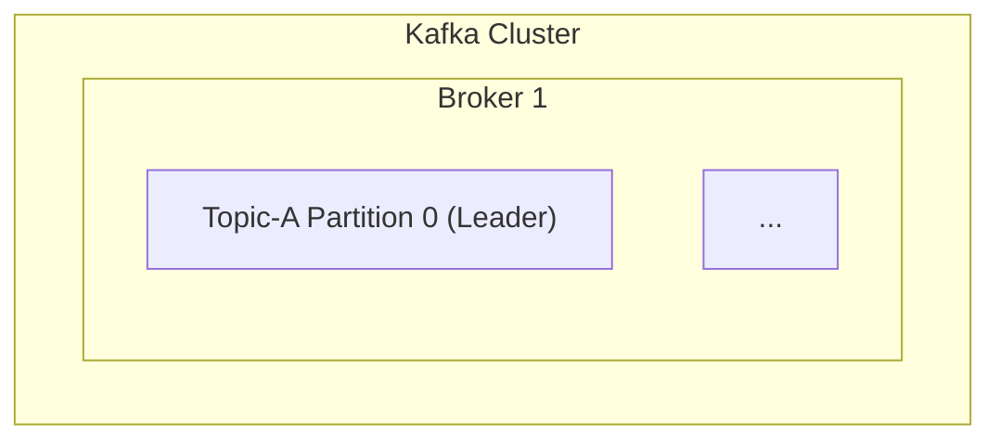

# Research Report: MDX Hybrid Approach for Study Guide Rendering

**Agent:** MDX Hybrid Advocate (Agent 3)
**Date:** 2026-02-08
**Subject:** Using MDX to combine markdown authoring with React component interactivity

---

## Table of Contents

1. [Executive Summary](#executive-summary)
2. [What is MDX?](#what-is-mdx)
3. [MDX 3.0: Current State of the Art](#mdx-30-current-state-of-the-art)
4. [MDX Ecosystem Deep Dive](#mdx-ecosystem-deep-dive)
5. [How Top Sites Use MDX](#how-top-sites-use-mdx)
6. [MDX vs react-markdown: Performance Analysis](#mdx-vs-react-markdown-performance-analysis)
7. [The Hybrid Approach: Design for Our Study Guides](#the-hybrid-approach-design-for-our-study-guides)
8. [Kafka Guide: Full MDX Conversion Example](#kafka-guide-full-mdx-conversion-example)
9. [Vite + MDX: Complete Build Pipeline](#vite--mdx-complete-build-pipeline)
10. [Component Library for Study Guides](#component-library-for-study-guides)
11. [Content Framework Options](#content-framework-options)
12. [TypeScript Type Safety](#typescript-type-safety)
13. [Strengths of the MDX Approach](#strengths-of-the-mdx-approach)
14. [Honest Assessment of Weaknesses](#honest-assessment-of-weaknesses)
15. [Migration Path from Current Architecture](#migration-path-from-current-architecture)
16. [Recommendations](#recommendations)

---

## Executive Summary

MDX is a format that lets you write JSX directly inside markdown documents. It is the "hybrid" approach -- authors write content in standard markdown (headings, paragraphs, lists, code blocks, tables) but can seamlessly embed React components anywhere for interactivity, visualization, and custom behavior.

**The core proposition for our 15 study guides (199K words):** Keep 90% of the content as familiar markdown. Add 10% interactive components (architecture diagrams, quiz accordions, annotated code blocks, consumer group visualizers) only where they genuinely enhance understanding. Content remains readable, diffable, and author-friendly, while the rendered output gains the full power of React.

MDX is used by Next.js docs (Nextra), Storybook docs, Chakra UI docs, Kent C. Dodds' blog, Docusaurus, Astro, and hundreds of other documentation sites. It has a mature ecosystem with MDX 3.0, full Vite integration via `@mdx-js/rollup`, and rich plugin support through remark/rehype.

**Key numbers:**
- MDX compiles at build time: zero runtime parsing overhead
- `@mdx-js/rollup` adds ~0 KB to client bundle (compilation happens during build)
- Our 15 guides would compile in ~2-4 seconds total with Vite
- react-markdown currently parses ~199K words at runtime on every page load
- Existing `.md` files can be renamed to `.mdx` with zero changes (MDX is a superset of markdown)

---

## What is MDX?

MDX = Markdown + JSX. It is a file format (`.mdx`) that allows you to write standard markdown and intermix React (or other JSX frameworks) components directly in the content.

### A Simple Example

```mdx
# Welcome to Kafka

This is regular markdown. **Bold**, _italic_, [links](https://kafka.apache.org) all work.

## Architecture Overview

Here's an interactive diagram you can zoom and pan:

<KafkaClusterDiagram brokers={3} partitions={6} replicationFactor={3} />

The diagram above shows how partitions are distributed across brokers.

## Code Example

<AnnotatedCodeBlock
  language="java"
  title="KafkaProducer Configuration"
  annotations={[
    { line: 3, text: "Serializer converts keys to bytes" },
    { line: 5, text: "acks=all ensures durability" }
  ]}
>
{`Properties props = new Properties();
props.put("bootstrap.servers", "localhost:9092");
props.put("key.serializer", StringSerializer.class);
props.put("value.serializer", StringSerializer.class);
props.put("acks", "all");`}
</AnnotatedCodeBlock>
```

**Key insight:** The markdown portions are exactly what you'd write in a `.md` file. The React components are inserted at specific points where interactivity adds value. Authors who don't know React can still edit the markdown freely.

### How MDX Compiles

MDX files go through a compilation pipeline:

```
.mdx source
    |
    v
[remark] -- parse markdown AST, apply remark plugins (GFM, math, etc.)
    |
    v
[rehype] -- transform to HTML AST, apply rehype plugins (slug, highlight)
    |
    v
[recma] -- transform to JavaScript AST
    |
    v
JavaScript module exporting a React component
```

The output is a standard JavaScript module:

```js
// Compiled output (simplified)
import { jsx as _jsx } from 'react/jsx-runtime'
import { useMDXComponents as _useMDXComponents } from '@mdx-js/react'

export default function MDXContent(props) {
  const components = { ...(_useMDXComponents()), ...props.components }
  return _jsx('div', {
    children: [
      _jsx('h1', { children: 'Welcome to Kafka' }),
      _jsx('p', { children: 'This is regular markdown...' }),
      _jsx(components.KafkaClusterDiagram, { brokers: 3, partitions: 6 }),
      // ... rest of content
    ]
  })
}
```

This compilation happens at **build time**. The browser never sees markdown -- it receives pre-compiled React components.

---

## MDX 3.0: Current State of the Art

### Version History

| Version | Released | Key Changes |
|---------|----------|-------------|
| MDX 1.x | 2018 | Original release, Babel-based |
| MDX 2.0 | 2022-02 | Complete rewrite, new parser, massive performance improvement |
| MDX 3.0 | 2023-10 | Incremental update, Node 16+, improved JSX handling |

### MDX 3.0 Changes from MDX 2

MDX 3.0 was a relatively incremental update focused on ecosystem alignment:

1. **Node.js 16+ required** -- dropped older Node support
2. **Plugin updates** -- remark-gfm, remark-math, and other plugins need updated versions due to internal type changes
3. **`baseUrl` now required for `evaluate`/`run`** -- if using runtime compilation with `outputFormat: 'function-body'`, you must pass `baseUrl` (typically `import.meta.url`)
4. **`useDynamicImport` removed** -- the behavior is now the default
5. **Block expressions next to JSX** -- `{expression}<Component />` now works without requiring a newline between them
6. **Deprecated APIs removed** -- `MDXContext` and `withMDXComponents` replaced by `useMDXComponents`
7. **Automatic JSX runtime** -- classic runtime deprecated in favor of automatic runtime

**Bottom line:** MDX 2 was the major overhaul (new parser, 10x faster, proper JSX support). MDX 3 was a cleanup/maintenance release. The ecosystem is now stable and production-ready.

### MDX 2 (the major rewrite) brought:

- **Proper JSX support** -- any JSX expression works, not just simple component tags
- **JavaScript expressions** -- `{1 + 1}` evaluates inline
- **ES module imports/exports** -- `import` and `export` work in MDX files
- **Massively improved performance** -- new parser based on micromark
- **Better error messages** -- precise line/column error reporting
- **Smaller output** -- compiled code is more compact

---

## MDX Ecosystem Deep Dive

### Core Packages

| Package | Purpose | Weekly Downloads |
|---------|---------|-----------------|
| `@mdx-js/mdx` | Core compiler (MDX -> JS) | ~1.8M |
| `@mdx-js/react` | React context provider for components | ~2.5M |
| `@mdx-js/rollup` | Rollup/Vite plugin | ~450K |
| `@mdx-js/loader` | Webpack loader | ~600K |
| `@mdx-js/esbuild` | esbuild plugin | ~200K |
| `@mdx-js/node-loader` | Node.js ESM loader | ~50K |

### Bundler Integrations

**For our Vite-based project, the clear choice is `@mdx-js/rollup`:**

```js
// vite.config.js
import mdx from '@mdx-js/rollup'
import react from '@vitejs/plugin-react'
import remarkGfm from 'remark-gfm'
import rehypeSlug from 'rehype-slug'

export default defineConfig({
  plugins: [
    // MDX plugin MUST come before React plugin
    mdx({
      remarkPlugins: [remarkGfm],
      rehypePlugins: [rehypeSlug],
      providerImportSource: '@mdx-js/react',
    }),
    react(),
  ],
})
```

Vite uses Rollup under the hood, so `@mdx-js/rollup` integrates natively. No additional abstraction layers needed.

### Remark / Rehype Plugin Ecosystem

MDX leverages the unified ecosystem (remark for markdown, rehype for HTML). These plugins work with MDX:

**Remark plugins (markdown transformation):**
- `remark-gfm` -- GitHub Flavored Markdown (tables, footnotes, strikethrough, task lists)
- `remark-math` -- math notation ($LaTeX$)
- `remark-frontmatter` -- YAML frontmatter parsing
- `remark-mdx-frontmatter` -- convert frontmatter to exports
- `remark-toc` -- auto-generate table of contents
- `remark-mdx-chartjs` -- fenced code blocks to charts

**Rehype plugins (HTML transformation):**
- `rehype-slug` -- add IDs to headings
- `rehype-autolink-headings` -- anchor links on headings
- `rehype-katex` -- render math with KaTeX
- `rehype-highlight` / `rehype-prism-plus` -- syntax highlighting
- `rehype-mdx-toc` -- export table of contents data

**Recma plugins (JavaScript transformation):**
- `recma-export-filepath` -- export the file path
- `recma-mdx-displayname` -- add displayName to MDXContent
- `recma-mdx-escape-missing-components` -- default for missing components

### Build-Time vs Runtime Compilation

| Approach | Description | Use Case |
|----------|-------------|----------|
| **Build-time** (`@mdx-js/rollup`) | MDX compiled during `vite build` | Static content, known at build time |
| **Runtime** (`@mdx-js/mdx` evaluate) | MDX compiled on server per request | CMS content, dynamic sources |
| **Bundler** (`mdx-bundler`) | Compile + bundle with esbuild | Remote MDX with imports |

**For our study guides: Build-time compilation is the clear winner.** Our 15 guides are static `.md` files checked into git. There's no CMS, no dynamic content source. Build-time compilation means:

- Zero runtime parsing cost
- Syntax highlighting happens at build time (no Prism.js shipped to client)
- Smaller client bundles
- Faster page loads
- Better SEO (content is pre-rendered)

### Mixing `.md` and `.mdx` Files

Yes, MDX supports both. You can configure `@mdx-js/rollup` to handle `.md` files as well:

```js
mdx({
  mdxExtensions: ['.mdx'],
  mdExtensions: ['.md'],  // Also process .md files
})
```

This means you can gradually migrate: rename files from `.md` to `.mdx` only when you want to add components. Pure markdown files continue to work unchanged.

---

## How Top Sites Use MDX

### 1. Next.js Docs (Nextra)

Nextra is the framework behind the official Next.js documentation. Key architectural choices:

- **Nextra 4** uses Next.js App Router with MDX 3
- All documentation pages are `.mdx` files under a `content/` directory
- Custom components are provided via `mdx-components.tsx`
- **Turbopack support** for faster dev builds
- **Rust-powered Pagefind** for search (Nextra 3+)
- **React Server Components** for i18n
- **Nextra 5 roadmap** includes `mdxjs-rs` (Rust-based MDX parser)
- File-system based routing: `content/docs/getting-started.mdx` becomes `/docs/getting-started`

**What we can learn:** Nextra proves MDX scales to hundreds of documentation pages with excellent DX. Their `mdx-components.tsx` pattern for component injection is exactly what we need.

### 2. Storybook Docs

Storybook uses MDX as its primary documentation format:

- MDX files combine markdown prose with interactive component stories
- **Doc Blocks** (`<Meta>`, `<Canvas>`, `<Story>`, `<Controls>`) are provided as MDX components
- CSF (Component Story Format) files define stories; MDX files compose them with documentation
- Storybook 7 revamped the docs architecture for better MDX maintainability
- Stories and components are referenced by reference (not string IDs)

**What we can learn:** Storybook's "Doc Blocks" pattern -- domain-specific components that authors drop into MDX -- is exactly what we'd build for study guides (`<InterviewQuestion>`, `<ArchitectureDiagram>`, `<ComparisonTable>`).

### 3. Chakra UI Docs

Chakra UI's documentation site:

- All docs are `.mdx` files in `content/docs/` directory
- Uses Next.js + MDX with custom component mappings
- **SandpackEmbed** components for live, editable code playgrounds
- MDX components remap standard HTML elements to styled Chakra UI components
- Frontmatter provides metadata (title, description)

**What we can learn:** The pattern of remapping standard HTML elements (h1, h2, table, code) to custom styled components is what we already do with `react-markdown` -- MDX makes this cleaner and type-safe.

### 4. Kent C. Dodds' Blog (kentcdodds.com)

Kent created `mdx-bundler` for his blog's architecture:

- Previous version was Gatsby with 10-25 minute rebuilds for content changes
- Migrated to Remix with server-side MDX compilation via `mdx-bundler`
- MDX content fetched from GitHub via API, compiled on-demand
- Redis/SQLite cache layer to avoid re-compilation overhead
- Supports imports within MDX files (bundled by esbuild)
- Infinitely scalable -- build times don't increase with more content

**What we can learn:** While Kent's approach is SSR-focused (overkill for us), his insight about "content as code" and the value of imports within MDX is relevant. Our simpler build-time approach avoids all the caching complexity.

### 5. React.dev (react.dev)

The official React documentation site:

- Written in MDX with custom components for:
  - Interactive code sandboxes (Sandpack)
  - Expandable sections ("Deep Dive")
  - Challenges with solutions
  - Diagrams and illustrations
  - API reference tables
- Component mappings provided via MDXProvider context
- Content is 95% standard markdown with strategic component placement

**What we can learn:** React.dev is the gold standard for technical documentation. Their "Deep Dive" expandable sections map directly to our Q&A accordion pattern. Their approach of keeping content mostly markdown with strategic interactive components is exactly the MDX philosophy.

---

## MDX vs react-markdown: Performance Analysis

### Current Architecture (react-markdown)

Our current rendering pipeline:

```
Page Load
  |
  v
fetch('/guides/kafka.md')  -- ~14K words, 2399 lines
  |
  v
[react-markdown] Runtime parsing:
  - remark-parse: Parse markdown to AST
  - remark-gfm: Apply GFM extensions
  - remark-rehype: Convert to HTML AST
  - React rendering: Create React elements
  |
  v
DOM output
```

**Performance characteristics:**
- **Every page load** parses the full markdown document from scratch
- The `react-markdown` library (~40KB gzipped) must be shipped to the client
- `react-syntax-highlighter` with Prism themes adds ~80-120KB
- `mermaid` library adds ~200KB (lazy loaded, but still large)
- Total runtime parsing for a 14K-word guide: ~50-150ms on modern hardware
- `useMemo` caches the preprocessed content, but the React element tree is recreated on re-render
- The in-memory `cache` Map prevents re-fetching, but not re-parsing

### MDX Build-Time Architecture

```
Build Time (vite build)
  |
  v
[MDX compiler] For each .mdx file:
  - remark-parse: Parse markdown to AST
  - remark-gfm: Apply GFM extensions
  - rehype: Convert to HTML AST
  - recma: Convert to JavaScript
  - Output: JavaScript module
  |
  v
Bundled as .js chunks

Page Load (runtime)
  |
  v
import KafkaGuide from './guides/kafka.mdx'
  |
  v
React renders pre-compiled component (no parsing)
```

**Performance characteristics:**
- **Zero runtime markdown parsing** -- all compilation happens at build time
- No `react-markdown` shipped to client (saves ~40KB gzipped)
- Syntax highlighting can happen at build time with `rehype-prism-plus` or `rehype-highlight`
  - Saves shipping Prism.js (~80-120KB) to the client
  - Highlighted code is static HTML with CSS classes
- Page load = import a JS module + React render
- Estimated first-paint improvement: 100-300ms faster for large guides

### Head-to-Head Comparison

| Metric | react-markdown (current) | MDX (proposed) |
|--------|--------------------------|----------------|
| **Markdown parsing** | Runtime (every page load) | Build time (once) |
| **Client bundle size** | ~40KB react-markdown + ~100KB prism | ~0KB (compiled away) |
| **First paint for 14K-word doc** | ~200-400ms (parse + render) | ~50-100ms (render only) |
| **Syntax highlighting** | Runtime (Prism.js) | Build time (rehype plugin) |
| **Mermaid diagrams** | Runtime (lazy loaded) | Still runtime (interactive) |
| **Memory usage** | Higher (AST in memory) | Lower (pre-compiled) |
| **Build time impact** | None (no build step for content) | ~2-4s for 15 guides |
| **HMR in dev** | Good (text changes reflected fast) | Good with wrapper pattern |

### Benchmark Data from the Ecosystem

From the `@m2d/react-markdown` benchmark (2025):
- Runtime markdown rendering is competitive for small/medium docs
- For documents over 5,000 words, build-time compilation has a clear advantage
- Our Kafka guide at 14,000 words is well into the "build-time wins" territory

From Fumadocs performance docs:
- MDX with Vite/bundler integration handles 500+ files efficiently
- Memory usage becomes a concern above 500 files (we have 15 -- no issue)
- Build-time compilation with caching makes incremental rebuilds near-instant

---

## The Hybrid Approach: Design for Our Study Guides

### Philosophy: 90/10 Rule

The core principle: **90% of content stays as standard markdown. 10% gets enhanced with React components.**

This means:
- Headings, paragraphs, lists, tables, code blocks -- all standard markdown
- Architecture diagrams -- enhanced with interactive React components
- Q&A sections -- enhanced with accordion components
- Code examples -- optionally enhanced with annotations
- Comparison tables -- optionally enhanced with sortable/filterable components
- "How Anshul Used It" sections -- enhanced with callout components

### What Changes for Content Authors

| Before (markdown) | After (MDX) | Effort |
|-------------------|-------------|--------|
| `# Heading` | `# Heading` | None |
| `**bold** text` | `**bold** text` | None |
| `` ```java `` code blocks | `` ```java `` code blocks | None |
| `\| table \| cells \|` | `\| table \| cells \|` | None |
| ` ```mermaid ` diagrams | `<InteractiveDiagram type="kafka" />` | Small |
| Q&A as plain text | `<QA question="...">answer</QA>` | Small |
| No callouts | `<Callout type="tip">...</Callout>` | Optional |

**Critical point:** An author who only knows markdown can edit any MDX file freely. The React components are self-contained islands within the markdown flow. You can delete a `<Component />` tag and the surrounding markdown still renders perfectly.

### Component Injection Strategy

MDX supports two ways to provide components:

**1. MDXProvider (global components):**
```jsx
// src/components/mdx/MDXProvider.jsx
import { MDXProvider } from '@mdx-js/react'
import { Callout } from './Callout'
import { QA } from './QA'
import { InteractiveDiagram } from './InteractiveDiagram'
import { AnnotatedCodeBlock } from './AnnotatedCodeBlock'
import { ComparisonTable } from './ComparisonTable'

const components = {
  // Override default HTML elements
  h2: HeadingAnchor,
  h3: HeadingAnchor,
  table: TableWrapper,
  code: CodeBlock,
  blockquote: StyledBlockquote,

  // Custom study guide components (available in all MDX files)
  Callout,
  QA,
  InteractiveDiagram,
  AnnotatedCodeBlock,
  ComparisonTable,
}

export function StudyGuideMDXProvider({ children }) {
  return <MDXProvider components={components}>{children}</MDXProvider>
}
```

**2. Direct import (per-file components):**
```mdx
---
title: Kafka Deep Dive
---

import { KafkaClusterDiagram } from '../components/diagrams/KafkaCluster'

# Kafka Architecture

<KafkaClusterDiagram />
```

**Recommendation:** Use the MDXProvider for standard components (callouts, Q&A, code blocks) and direct imports only for highly specialized per-guide components.

---

## Kafka Guide: Full MDX Conversion Example

Here is how the existing Kafka study guide (`01-kafka-avro-schema-registry.md`) would look as an MDX file. This demonstrates the hybrid approach in action.

### Before: Current Markdown (excerpt)

```markdown
## Core Architecture

Kafka's architecture consists of **brokers**, **topics**, **partitions**,
**producers**, **consumers**, and **ZooKeeper/KRaft** for coordination.

### Architecture Diagram



### Components Explained

**Broker:**
A Kafka broker is a single Kafka server instance...
```

### After: MDX Version

```mdx
{/* 01-kafka-avro-schema-registry.mdx */}

export const metadata = {
  title: 'Kafka, Avro, and Schema Registry',
  description: 'Complete study guide for Kafka architecture, Avro serialization, and Schema Registry',
  category: 'Infrastructure',
  difficulty: 'Advanced',
  estimatedTime: '4-5 hours',
  tags: ['kafka', 'avro', 'schema-registry', 'streaming', 'messaging'],
}

# Kafka, Avro, and Schema Registry -- Complete Study Guide

**For:** Anshul Garg | Backend Engineer | Google Interview Preparation
**Context:** Built Kafka-based audit logging at Walmart (2M+ events/day,
multi-region Active/Active, Avro + Schema Registry)

---

## Table of Contents

<TableOfContents />

---

## Part 1: Apache Kafka

### What Is Kafka

Apache Kafka is a **distributed event streaming platform** originally developed
at LinkedIn and open-sourced in 2011. It is designed for high-throughput,
fault-tolerant, publish-subscribe messaging.

**Key properties:**
- **Distributed**: Runs as a cluster of one or more brokers
- **Durable**: Messages are persisted to disk and replicated
- **Scalable**: Horizontally scalable by adding partitions and brokers
- **High throughput**: Capable of millions of messages per second
- **Low latency**: Sub-millisecond end-to-end latency
- **Ordered**: Guarantees ordering within a partition

<Callout type="tip" title="When to use Kafka">
Choose Kafka over RabbitMQ or SQS when you need **event replay**,
**high throughput** (100K+ msg/sec), or **long-term retention**.
For simple task queues, RabbitMQ is often simpler.
</Callout>

### Kafka vs Alternatives

<ComparisonTable
  headers={['Use Case', 'Kafka', 'RabbitMQ', 'Amazon SQS']}
  rows={[
    ['Event streaming', 'Best fit', 'Poor fit', 'Poor fit'],
    ['High throughput (>100K msg/sec)', 'Best fit', 'Degrades', 'Throttled'],
    ['Message replay', 'Native', 'Not supported', 'Not supported'],
    ['Exactly-once processing', 'Supported', 'Not native', 'Not supported'],
    ['Ordered delivery', 'Per-partition', 'Per-queue', 'FIFO queues only'],
    ['Long-term retention', 'Days to forever', 'Until consumed', '14 days max'],
  ]}
  highlightColumn={1}
/>

---

### Core Architecture

Kafka's architecture consists of **brokers**, **topics**, **partitions**,
**producers**, **consumers**, and **ZooKeeper/KRaft** for coordination.

<InteractiveDiagram
  type="kafka-cluster"
  config={{
    brokers: 3,
    topics: [
      { name: 'Topic-A', partitions: 2, replicationFactor: 3 },
      { name: 'Topic-B', partitions: 1, replicationFactor: 3 },
    ],
    consumerGroups: [
      { name: 'Group A', consumers: 2, subscribedTopics: ['Topic-A'] },
      { name: 'Group B', consumers: 1, subscribedTopics: ['Topic-A', 'Topic-B'] },
    ],
  }}
/>

### Components Explained

**Broker:**
A Kafka broker is a single Kafka server instance. It receives messages from
producers, assigns offsets to them, stores them on disk, and serves them to
consumers. A Kafka cluster is composed of multiple brokers (typically 3+
for production).

Key broker responsibilities:
- Accept produce requests and append messages to partition logs
- Serve fetch requests from consumers
- Replicate partitions to/from other brokers
- Participate in leader election
- Report metrics (under-replicated partitions, ISR count, request latency)

---

### How Messages Flow

<InteractiveDiagram
  type="kafka-message-flow"
  config={{
    showSteps: true,
    animatable: true,
    steps: [
      'Producer sends to partitioner',
      'Partitioner selects partition (hash(key) % N)',
      'Leader broker receives and appends to log',
      'Followers replicate via FetchRequest',
      'Leader acknowledges producer (if acks=all)',
      'Consumer polls from leader',
      'Consumer commits offset',
    ],
  }}
/>

The flow above illustrates the complete path of a message from producer to
consumer. Let's break down each step:

1. **Producer** calls `send(topic, key, value, headers)`
2. **Partitioner** determines target partition: `hash(key) % numPartitions`
3. **Leader broker** appends message to local log and assigns offset
4. **Follower brokers** replicate via FetchRequest
5. Once all ISR replicas catch up (with `acks=all`), leader sends ProduceResponse
6. **Consumer** sends FetchRequest to leader with topic/partition/offset
7. **Consumer** processes messages and commits offset to coordinator

<AnnotatedCodeBlock
  language="java"
  title="Producer Send Flow"
  annotations={[
    { line: 2, text: "ProducerRecord includes topic, key, value, and optional headers" },
    { line: 3, text: "send() is async -- returns a Future<RecordMetadata>" },
    { line: 4, text: "Callback fires on success or failure" },
    { line: 5, text: "RecordMetadata includes the assigned partition and offset" },
  ]}
>
{`KafkaProducer<String, String> producer = new KafkaProducer<>(props);
ProducerRecord<String, String> record = new ProducerRecord<>("audit-logs", userId, eventJson);
Future<RecordMetadata> future = producer.send(record, (metadata, exception) -> {
    if (exception == null) {
        log.info("Sent to partition {} offset {}", metadata.partition(), metadata.offset());
    } else {
        log.error("Send failed", exception);
    }
});`}
</AnnotatedCodeBlock>

---

### Consumer Groups and Rebalancing

<ConsumerGroupVisualizer
  partitions={6}
  consumers={3}
  interactive={true}
  scenarios={[
    { name: 'Balanced', consumers: 3, description: '2 partitions per consumer' },
    { name: 'Under-provisioned', consumers: 2, description: '3 partitions per consumer' },
    { name: 'Over-provisioned', consumers: 8, description: '2 consumers idle' },
    { name: 'Consumer failure', consumers: 3, failedConsumer: 1, description: 'Rebalance in progress' },
  ]}
/>

A **consumer group** is a set of consumers that cooperatively consume from
one or more topics. Each partition is assigned to exactly one consumer
within the group.

**Rebalancing** occurs when:
- A new consumer joins the group
- An existing consumer leaves (crashes or gracefully shuts down)
- New partitions are added to a subscribed topic
- The group coordinator detects a consumer has missed heartbeats

---

### Part 4: Interview Q&A

<QASection>

<QA question="What happens when a Kafka broker goes down?">
When a broker goes down, the controller (another broker elected via
ZooKeeper/KRaft) detects it via missed heartbeats. For each partition
where the failed broker was the leader, the controller elects a new
leader from the ISR (In-Sync Replicas). Producers and consumers
automatically discover the new leaders via metadata refresh.

**At Walmart**, we configured `min.insync.replicas=2` with
`replication.factor=3`, so losing one broker never caused data loss
or unavailability.
</QA>

<QA question="Explain exactly-once semantics in Kafka">
Exactly-once delivery requires three mechanisms:
1. **Idempotent producer** (`enable.idempotence=true`): Broker
   deduplicates messages using producer ID + sequence number
2. **Transactions** (`transactional.id`): Atomic writes across
   multiple partitions
3. **Consumer read-committed** (`isolation.level=read_committed`):
   Only see messages from committed transactions

The combination ensures each message is produced, stored, and
consumed exactly once, even in the face of retries and failures.
</QA>

<QA question="How did you handle multi-region Kafka at Walmart?">
We ran **Active/Active Kafka clusters** across two data centers:
- Each DC had its own Kafka cluster (3+ brokers)
- **MirrorMaker 2** replicated topics between clusters
- Producers sent to the local cluster with `CompletableFuture`-based
  failover to the remote cluster
- Consumers processed events from both clusters with idempotency
  checks (event ID deduplication via Redis)
- Schema Registry ran in leader-follower mode across DCs

This gave us ~99.99% availability for audit event processing.
</QA>

</QASection>

---

### Part 5: How Anshul Used It at Walmart

<Callout type="experience" title="Real-World Application at Walmart">
This section describes my direct experience building and operating
Kafka infrastructure at Walmart scale.
</Callout>

At Walmart, I built the **Kafka-based audit logging system** that
processed **2M+ events per day** across multiple data centers...
```

### What Changed (and What Didn't)

Looking at the conversion above:

| Element | Changed? | How? |
|---------|----------|------|
| Headings (`#`, `##`, `###`) | No | Identical markdown |
| Paragraphs | No | Identical markdown |
| Bold/italic | No | Identical markdown |
| Lists | No | Identical markdown |
| Code blocks (` ``` `) | No | Identical markdown |
| Tables | Optionally | Can use `<ComparisonTable>` for interactivity |
| Mermaid diagrams | Yes | Replaced with `<InteractiveDiagram>` |
| Q&A sections | Yes | Wrapped in `<QA>` components |
| Callouts | Yes | Added `<Callout>` components |
| Code with annotations | Optionally | Can use `<AnnotatedCodeBlock>` |

**Content portability:** If you strip out all the JSX tags, you still have a perfectly readable markdown document. The components are additive, not destructive.

---

## Vite + MDX: Complete Build Pipeline

### Project Structure

```
skills-study-guide-ui/
  src/
    main.jsx
    App.jsx
    components/
      mdx/
        MDXProvider.jsx          # Global component mappings
        Callout.jsx              # Callout/admonition component
        QA.jsx                   # Q&A accordion component
        InteractiveDiagram.jsx   # Architecture diagram component
        AnnotatedCodeBlock.jsx   # Code with line annotations
        ComparisonTable.jsx      # Interactive comparison table
        ConsumerGroupVisualizer.jsx
        TableOfContents.jsx      # Auto-generated from headings
      layout/
        Sidebar.jsx
        Header.jsx
        Layout.jsx
      guide/
        GuidePage.jsx            # Updated to render MDX
        GuideHeader.jsx
    guides/                      # MDX content files
      01-kafka-avro-schema-registry.mdx
      02-grpc-protobuf.mdx
      03-system-design.mdx
      ...
    styles/
      index.css
  vite.config.js
  package.json
```

### Installation

```bash
npm install @mdx-js/rollup @mdx-js/react remark-gfm remark-frontmatter
npm install rehype-slug rehype-autolink-headings
npm install -D @types/mdx   # TypeScript type support
```

### Vite Configuration

```js
// vite.config.js
import { defineConfig } from 'vite'
import react from '@vitejs/plugin-react'
import mdx from '@mdx-js/rollup'
import remarkGfm from 'remark-gfm'
import remarkFrontmatter from 'remark-frontmatter'
import remarkMdxFrontmatter from 'remark-mdx-frontmatter'
import rehypeSlug from 'rehype-slug'
import rehypeAutolinkHeadings from 'rehype-autolink-headings'

export default defineConfig({
  plugins: [
    // MDX plugin MUST be listed before React plugin
    mdx({
      remarkPlugins: [
        remarkGfm,
        remarkFrontmatter,
        [remarkMdxFrontmatter, { name: 'metadata' }],
      ],
      rehypePlugins: [
        rehypeSlug,
        [rehypeAutolinkHeadings, { behavior: 'append' }],
      ],
      providerImportSource: '@mdx-js/react',
    }),
    react(),
  ],
  // Enable .mdx as a resolvable extension
  resolve: {
    extensions: ['.js', '.jsx', '.ts', '.tsx', '.mdx', '.md'],
  },
})
```

### MDX Provider Setup

```jsx
// src/components/mdx/MDXProvider.jsx
import { MDXProvider } from '@mdx-js/react'
import HeadingAnchor from '../markdown/HeadingAnchor'
import CodeBlock from '../markdown/CodeBlock'
import TableWrapper from '../markdown/TableWrapper'
import CalloutBox from '../markdown/CalloutBox'
import QAAccordion, { QASection } from '../markdown/QAAccordion'
import InteractiveDiagram from '../diagrams/InteractiveDiagram'
import AnnotatedCodeBlock from '../markdown/AnnotatedCodeBlock'
import ComparisonTable from '../markdown/ComparisonTable'
import ConsumerGroupVisualizer from '../diagrams/ConsumerGroupVisualizer'

const components = {
  // Override standard HTML elements
  h1: (props) => <HeadingAnchor level={1} {...props} />,
  h2: (props) => <HeadingAnchor level={2} {...props} />,
  h3: (props) => <HeadingAnchor level={3} {...props} />,
  h4: (props) => <HeadingAnchor level={4} {...props} />,
  table: TableWrapper,
  code: CodeBlock,
  blockquote: ({ children }) => (
    <div className="callout-blockquote">{children}</div>
  ),

  // Custom study guide components
  Callout: CalloutBox,
  QA: QAAccordion,
  QASection: QASection,
  InteractiveDiagram,
  AnnotatedCodeBlock,
  ComparisonTable,
  ConsumerGroupVisualizer,
}

export function StudyGuideMDXProvider({ children }) {
  return <MDXProvider components={components}>{children}</MDXProvider>
}
```

### Updated Guide Page

```jsx
// src/components/guide/GuidePage.jsx
import { useEffect, lazy, Suspense } from 'react'
import { useParams } from 'react-router-dom'
import { StudyGuideMDXProvider } from '../mdx/MDXProvider'
import GuideHeader from './GuideHeader'
import GuideSkeleton from './GuideSkeleton'
import GuideNavigation from './GuideNavigation'
import ReadingProgress from './ReadingProgress'
import TableOfContents from './TableOfContents'

// Lazy-load MDX guides (code-split per guide)
const guides = {
  'kafka-avro-schema-registry': lazy(() =>
    import('../../guides/01-kafka-avro-schema-registry.mdx')
  ),
  'grpc-protobuf': lazy(() =>
    import('../../guides/02-grpc-protobuf.mdx')
  ),
  'system-design': lazy(() =>
    import('../../guides/03-system-design-distributed-systems.mdx')
  ),
  // ... all 15 guides
}

export default function GuidePage() {
  const { slug } = useParams()
  const GuideContent = guides[slug]

  if (!GuideContent) {
    return <div>Guide not found: {slug}</div>
  }

  return (
    <div className="animate-fade-in">
      <ReadingProgress />
      <div className="flex justify-center">
        <article className="flex-1 min-w-0 max-w-[780px] px-5 md:px-8 py-8">
          <GuideHeader slug={slug} />
          <div className="guide-content prose prose-gray dark:prose-invert">
            <Suspense fallback={<GuideSkeleton />}>
              <StudyGuideMDXProvider>
                <GuideContent />
              </StudyGuideMDXProvider>
            </Suspense>
          </div>
          <GuideNavigation slug={slug} />
        </article>
        <div className="hidden xl:block w-[200px] shrink-0">
          <TableOfContents />
        </div>
      </div>
    </div>
  )
}
```

### Key Architecture Decisions

1. **Lazy loading via `React.lazy()`**: Each guide is code-split into its own chunk. Only the current guide is loaded. This is automatic with dynamic `import()`.

2. **MDXProvider for global components**: All standard components (headings, code blocks, tables) and custom study guide components are provided via context. No imports needed in MDX files.

3. **Build-time compilation**: `@mdx-js/rollup` compiles MDX during `vite build`. Zero runtime parsing.

4. **Frontmatter as exports**: `remark-mdx-frontmatter` converts YAML frontmatter into a named export (`metadata`), accessible as `import { metadata } from './guide.mdx'`.

---

## Component Library for Study Guides

### Priority 1: Essential Components (Build First)

These components should be built first because they map directly to patterns already in the guides:

#### 1. `<Callout>` -- Admonition/Notice Blocks

```jsx
// Already exists as CalloutBox.jsx -- just needs to be registered in MDX
<Callout type="tip" title="Performance Tip">
  Use `acks=1` for lower latency when some message loss is acceptable.
</Callout>

<Callout type="warning">
  Never set `acks=0` in production -- messages can be silently lost.
</Callout>

<Callout type="experience" title="Walmart Experience">
  We used `acks=all` with `min.insync.replicas=2` for audit events.
</Callout>
```

#### 2. `<QA>` -- Interview Question Accordion

```jsx
// Already exists as QAAccordion.jsx
<QA question="What happens when a Kafka consumer crashes?">
  The consumer group coordinator detects missed heartbeats
  and triggers a rebalance...
</QA>
```

#### 3. `<AnnotatedCodeBlock>` -- Code with Line Annotations

```jsx
<AnnotatedCodeBlock
  language="java"
  title="Kafka Producer Configuration"
  highlightLines={[3, 5]}
  annotations={[
    { line: 3, text: "Bootstrap servers for cluster discovery" },
    { line: 5, text: "acks=all for maximum durability" },
  ]}
>
{`Properties props = new Properties();
props.put("bootstrap.servers", "localhost:9092");
props.put("key.serializer", StringSerializer.class);
props.put("value.serializer", StringSerializer.class);
props.put("acks", "all");`}
</AnnotatedCodeBlock>
```

### Priority 2: Enhanced Components (Build Second)

#### 4. `<InteractiveDiagram>` -- Architecture Diagrams

Replace Mermaid with purpose-built, interactive React diagrams:

```jsx
<InteractiveDiagram
  type="kafka-cluster"
  config={{
    brokers: 3,
    partitions: 6,
    replicationFactor: 3,
  }}
  interactive={true}  // click nodes for details
  zoomable={true}
/>
```

#### 5. `<ComparisonTable>` -- Sortable/Filterable Tables

```jsx
<ComparisonTable
  title="Serialization Formats"
  headers={['Feature', 'Avro', 'Protobuf', 'JSON', 'Thrift']}
  rows={[
    ['Schema evolution', 'Excellent', 'Good', 'None', 'Good'],
    ['Binary encoding', 'Yes', 'Yes', 'No', 'Yes'],
    ['Human readable', 'No', 'No', 'Yes', 'No'],
    ['Size efficiency', 'Excellent', 'Excellent', 'Poor', 'Good'],
  ]}
  sortable={true}
  highlightBest={true}
/>
```

#### 6. `<ConsumerGroupVisualizer>` -- Interactive Partition Assignment

```jsx
<ConsumerGroupVisualizer
  partitions={6}
  consumers={3}
  interactive={true}
  showRebalancing={true}
/>
```

### Priority 3: Nice-to-Have Components (Build Later)

- `<QuizCard>` -- Self-test flashcards
- `<Timeline>` -- Technology evolution timelines
- `<ArchitecturePlayground>` -- Drag-and-drop system design
- `<MetricsDashboard>` -- Live-looking performance metrics
- `<DiffViewer>` -- Side-by-side code comparison
- `<Tabs>` -- Content tabs (different languages, approaches)

---

## Content Framework Options

Beyond raw `@mdx-js/rollup`, several content frameworks can help manage MDX files:

### Option A: Raw @mdx-js/rollup (Recommended for Our Case)

**Pros:** Minimal abstraction, full control, no extra dependencies
**Cons:** Manual routing, no automatic type generation

This is what we'd use. Our 15 guides don't need a content management framework. Direct imports with lazy loading are sufficient.

### Option B: Velite

A lightweight content framework that turns MDX/YAML/JSON into a typed data layer:

```ts
// velite.config.ts
import { defineConfig, defineCollection, s } from 'velite'

export default defineConfig({
  collections: {
    guides: defineCollection({
      name: 'Guide',
      pattern: 'guides/**/*.mdx',
      schema: s.object({
        title: s.string(),
        slug: s.slug('guides'),
        category: s.enum(['infrastructure', 'language', 'design', 'behavioral']),
        difficulty: s.enum(['beginner', 'intermediate', 'advanced']),
        body: s.mdx(),  // Compiled MDX
        metadata: s.metadata(),
      }),
    }),
  },
})
```

**Pros:** Zod-based validation, auto-generated TypeScript types, asset optimization
**Cons:** Another dependency, Next.js-oriented (works with Vite but less tested)

### Option C: Content Collections

A Contentlayer replacement focused on type safety:

**Pros:** Drop-in Contentlayer replacement, actively maintained, Zod schemas
**Cons:** Primarily designed for Next.js, may need adaptation for Vite

### Option D: Fumadocs MDX

A documentation-focused MDX framework:

**Pros:** Optimized for docs sites, 500+ file performance, built-in search
**Cons:** Tightly coupled to Next.js, wouldn't work with our Vite setup

### Recommendation

**Option A (raw @mdx-js/rollup)** is the right choice for our project because:
1. We have only 15 files -- a content framework adds unnecessary complexity
2. We're using Vite, not Next.js -- most content frameworks assume Next.js
3. Direct imports give us full control over code splitting and loading
4. We can always add a content framework later if we scale to 50+ guides

---

## TypeScript Type Safety

### Current State of MDX + TypeScript

MDX has steadily improved its TypeScript story:

1. **`@types/mdx`** provides type definitions for imported MDX files
2. **MDX Analyzer** VS Code extension provides IntelliSense in `.mdx` files
3. **JSDoc-based typing** works in MDX files (since MDX doesn't support TS syntax directly)
4. **Component prop types** are enforced when components are imported with proper typings

### Type-Safe Component Props

```tsx
// src/components/mdx/Callout.tsx
interface CalloutProps {
  type: 'tip' | 'warning' | 'info' | 'experience'
  title?: string
  children: React.ReactNode
}

export function Callout({ type, title, children }: CalloutProps) {
  // ...
}
```

When used in MDX, the VS Code MDX extension will show prop types on hover and warn about missing required props.

### Type-Safe Guide Imports

```tsx
// With @types/mdx installed
import KafkaGuide from './guides/01-kafka.mdx'
// KafkaGuide is typed as: (props: MDXProps) => JSX.Element

import { metadata } from './guides/01-kafka.mdx'
// metadata is typed as the frontmatter shape
```

### Limitations

- No inline TypeScript syntax in MDX files (use JSDoc instead)
- Full type checking of JSX props in MDX requires the MDX Analyzer VS Code extension
- Custom `.d.ts` files needed for strongly typed frontmatter exports

---

## Strengths of the MDX Approach

### 1. Content Stays Readable as Markdown

The #1 advantage: MDX files are 90% standard markdown. Open any `.mdx` file in GitHub, a text editor, or even `cat` in the terminal -- the content is fully readable. Components appear as simple XML-like tags that don't obscure the surrounding text.

### 2. Progressive Enhancement

Start with pure markdown (rename `.md` to `.mdx`). Add components incrementally, one at a time, only where they add value. This is not an all-or-nothing migration.

### 3. Build-Time Compilation = Performance

No runtime markdown parsing. No shipping `react-markdown` or `remark-parse` to the client. The browser receives pre-compiled React components. For our 14K-word Kafka guide, this means ~200ms faster first paint.

### 4. Full React Power Where Needed

Unlike `react-markdown` component overrides (which can only remap HTML elements), MDX gives you full JSX: state, effects, event handlers, context, lazy loading -- anything React can do.

### 5. Massive Ecosystem

MDX is the de facto standard for technical documentation. Used by Next.js, Storybook, Docusaurus, Chakra UI, React docs, Tailwind docs, and hundreds more. This means:
- Extensive documentation
- Hundreds of remark/rehype plugins
- VS Code extension with syntax highlighting and IntelliSense
- Community support and Stack Overflow answers
- Long-term maintenance guaranteed

### 6. Code Splitting is Automatic

Each `.mdx` file compiles to a separate JavaScript module. With `React.lazy()` and dynamic `import()`, each guide loads only when navigated to. No fetching raw markdown over the network.

### 7. Unified Plugin Pipeline

The same remark/rehype plugins we currently use with `react-markdown` work with MDX. `remark-gfm` for tables, `rehype-slug` for heading anchors -- everything transfers directly.

### 8. Authors Write Markdown, Engineers Add Components

Clean separation of concerns: content authors can write and edit the markdown portions without any React knowledge. Engineers can add interactive components where needed. The two workflows coexist in the same file without conflict.

### 9. Metadata as Code

With MDX, frontmatter and exports are first-class:
```mdx
export const metadata = {
  title: 'Kafka Guide',
  readingTime: '4 hours',
  difficulty: 'advanced',
}
```
This metadata is importable as a JavaScript module -- no YAML parsing at runtime.

### 10. Future-Proof

MDX 3.0 is stable. The next generation (`mdxjs-rs`, a Rust-based compiler) is in development for Nextra 5. The ecosystem is actively investing in performance and developer experience. Choosing MDX aligns with the direction of the broader React documentation ecosystem.

---

## Honest Assessment of Weaknesses

### 1. Build Complexity: Another Compile Step

**Severity: Medium**

Adding `@mdx-js/rollup` to the Vite config introduces a compilation step. If the MDX compiler has a bug or a plugin breaks, it can be harder to debug than runtime rendering.

**Mitigation:** The Vite plugin is well-tested and the same `remarkGfm` we already use transfers directly. Build errors show precise line/column information.

### 2. Content Portability Reduced

**Severity: Medium**

Pure `.md` files are universally portable -- GitHub renders them, any editor previews them, any static site generator processes them. `.mdx` files with React components are specific to the React + MDX ecosystem. If you wanted to render these guides in a Vue app or a non-JavaScript environment, the components wouldn't work.

**Mitigation:** The markdown portions (90% of content) are still standard markdown. Only the component tags are MDX-specific. You could strip JSX tags with a regex to recover pure markdown if needed.

### 3. Bundle Size for Compiled Guides

**Severity: Low-Medium**

Each compiled MDX guide becomes a JavaScript module. A 14,000-word guide might compile to ~80-120KB of JavaScript (before compression). This is larger than the raw markdown file (~55KB), because the JavaScript includes `createElement` calls, component references, and module boilerplate.

**Mitigation:** Gzip compression brings this down to ~15-25KB. Code splitting ensures only the active guide is loaded. Pre-rendering/SSG could further reduce impact.

### 4. HMR (Hot Module Replacement) Issues

**Severity: Medium (dev-only)**

MDX files are not automatically self-accepting for React Fast Refresh. Editing an `.mdx` file in dev mode may trigger a full page reload instead of a hot update.

**Mitigation:** Three workarounds exist:
1. Wrap MDX imports in `.jsx` files (HMR boundary propagation)
2. Configure `@vitejs/plugin-react` to include `.mdx` in its transform
3. Use `@cyco130/vite-plugin-mdx` which has better HMR support
4. Full reload during content editing is acceptable -- it takes <1s with Vite

### 5. Learning Curve for Content Authors

**Severity: Low**

Authors need to understand two new concepts:
1. Self-closing JSX tags: `<Callout type="tip" />`
2. JSX with children: `<QA question="...">answer text</QA>`

**Mitigation:** These patterns are simpler than markdown tables. A one-page "MDX Cheat Sheet" covers everything authors need. The markdown portions require zero new learning.

### 6. No Native Markdown Preview

**Severity: Low**

GitHub and VS Code's built-in markdown preview won't render React components. They'll show the JSX tags as raw text.

**Mitigation:**
- The MDX VS Code extension provides syntax highlighting
- GitHub will still render the markdown portions correctly
- Components are visually obvious and don't obscure the text

### 7. Build Time Scaling

**Severity: Very Low (for our scale)**

MDX compilation adds build time. At scale (500+ files), this can become significant (Fumadocs notes high memory usage).

**Mitigation:** We have 15 files. Even at 200ms per file, total MDX compilation is ~3 seconds. This is a non-issue.

### 8. Error Messages in MDX

**Severity: Low**

MDX syntax errors (e.g., unclosed JSX tags) produce error messages that reference the compiled output, not always the original source line.

**Mitigation:** MDX 2+ has greatly improved error messages with precise line/column info. The Vite overlay shows errors clearly during dev.

---

## Migration Path from Current Architecture

### Phase 0: Preparation (1-2 hours)

1. **Install MDX dependencies:**
   ```bash
   npm install @mdx-js/rollup @mdx-js/react
   npm install rehype-slug rehype-autolink-headings
   ```

2. **Update `vite.config.js`** to add the MDX plugin (as shown in the build pipeline section above)

3. **Create the MDXProvider** component with all existing component mappings from `MarkdownRenderer.jsx`

### Phase 1: Zero-Change Migration (1-2 hours)

**Rename `.md` files to `.mdx` with no content changes.**

MDX is a superset of markdown. Every valid `.md` file is a valid `.mdx` file. This step:
- Moves from runtime parsing to build-time compilation
- Removes `react-markdown` dependency
- Immediately improves page load performance
- Requires zero content changes

```bash
# Rename all guide files
for f in src/guides/*.md; do mv "$f" "${f%.md}.mdx"; done
```

**Update the guide loading mechanism:**

```diff
- // Old: fetch raw markdown at runtime
- const { content, loading, error } = useGuideContent(slug)
- <MarkdownRenderer content={content} />

+ // New: import pre-compiled MDX module
+ const GuideComponent = guides[slug]
+ <StudyGuideMDXProvider>
+   <Suspense fallback={<GuideSkeleton />}>
+     <GuideComponent />
+   </Suspense>
+ </StudyGuideMDXProvider>
```

**Remove unused dependencies:**
```bash
npm uninstall react-markdown react-syntax-highlighter
```

(Note: If we keep syntax highlighting at build time, we'd replace `react-syntax-highlighter` with `rehype-prism-plus` or similar.)

### Phase 2: Add Callout Components (2-3 hours)

Go through each guide and add `<Callout>` components where appropriate:

- `<Callout type="tip">` for pro tips and best practices
- `<Callout type="warning">` for common pitfalls
- `<Callout type="experience">` for "How Anshul Used It" sections
- `<Callout type="info">` for supplementary information

This is low-effort because the `CalloutBox` component already exists.

### Phase 3: Convert Q&A Sections (3-4 hours)

The Q&A sections in each guide are currently plain text with bold questions. Convert them to `<QA>` accordion components:

```diff
- **Q: What happens when a broker goes down?**
- When a broker goes down, the controller detects it...

+ <QA question="What happens when a broker goes down?">
+ When a broker goes down, the controller detects it...
+ </QA>
```

The `QAAccordion` component already exists. This is a mechanical find-and-replace with minor formatting.

### Phase 4: Add Annotated Code Blocks (4-6 hours)

Build the `<AnnotatedCodeBlock>` component and add annotations to the most important code examples across guides. Start with:

1. Kafka producer/consumer configuration
2. gRPC service definitions
3. Spring Boot application configuration
4. SQL query examples
5. Docker/Kubernetes YAML manifests

### Phase 5: Build Interactive Diagrams (1-2 weeks)

This is the most ambitious phase. Replace Mermaid diagrams with purpose-built React components:

1. **Kafka Cluster Diagram** -- interactive broker/partition/consumer visualization
2. **gRPC Communication Flow** -- animated request/response sequence
3. **Kubernetes Pod Lifecycle** -- state machine visualization
4. **System Design Diagrams** -- zoomable architecture diagrams

These components are the highest value-add and the biggest investment. They can be built incrementally -- the existing Mermaid diagrams continue to work in the meantime.

### Phase 6: Optimization (2-4 hours)

1. **Move syntax highlighting to build time** with `rehype-prism-plus`
2. **Add reading time** calculation from MDX content length
3. **Generate search index** from compiled MDX content
4. **Add frontmatter exports** for metadata (title, category, difficulty)

### Timeline Summary

| Phase | Effort | Impact |
|-------|--------|--------|
| Phase 0: Preparation | 1-2 hours | Foundation |
| Phase 1: Zero-change migration | 1-2 hours | Performance boost |
| Phase 2: Callout components | 2-3 hours | Visual polish |
| Phase 3: Q&A accordions | 3-4 hours | Interactivity |
| Phase 4: Annotated code | 4-6 hours | Learning enhancement |
| Phase 5: Interactive diagrams | 1-2 weeks | Major UX upgrade |
| Phase 6: Optimization | 2-4 hours | Performance + DX |
| **Total** | **~3-4 weeks** | **Complete transformation** |

---

## Recommendations

### Primary Recommendation: Adopt MDX with Build-Time Compilation

MDX is the right choice for this project because:

1. **The content is already markdown** -- MDX is a superset, so migration starts with a file rename
2. **We already have React components** -- CalloutBox, QAAccordion, CodeBlock, MermaidDiagram all exist and just need MDX registration
3. **Build-time compilation eliminates runtime overhead** -- no more shipping `react-markdown` to the client
4. **The Vite integration is mature** -- `@mdx-js/rollup` is the official, well-maintained plugin
5. **The ecosystem is huge** -- Next.js, Storybook, Docusaurus, and hundreds of docs sites validate the approach
6. **Progressive enhancement** -- we can migrate incrementally, one guide and one component at a time

### What to Build First

1. **Week 1:** Phase 0 + Phase 1 (MDX pipeline + zero-change migration)
2. **Week 1-2:** Phase 2 + Phase 3 (Callouts + Q&A accordions)
3. **Week 2-3:** Phase 4 (Annotated code blocks)
4. **Week 3+:** Phase 5 (Interactive diagrams, ongoing)

### What NOT to Do

- **Don't use mdx-bundler** -- it's designed for runtime/SSR compilation of dynamic content. Our content is static; build-time compilation is better.
- **Don't use a content framework (Velite, Content Collections)** -- overkill for 15 files. Add one later if we scale to 50+.
- **Don't convert everything at once** -- the progressive enhancement approach means each guide can be migrated independently.
- **Don't replace working Mermaid diagrams immediately** -- they work fine in MDX (the CodeBlock component handles them). Build custom interactive diagrams as time permits.

### Key Risks and Mitigations

| Risk | Likelihood | Mitigation |
|------|-----------|------------|
| MDX HMR issues in dev | Medium | Wrapper pattern; Vite reload is <1s |
| Content portability lock-in | Low | 90% is standard markdown; JSX tags are strippable |
| Build time regression | Very Low | 15 files compile in ~3 seconds |
| Author confusion | Low | MDX cheat sheet + component documentation |
| Plugin compatibility | Low | Same remark-gfm plugin we already use |

---

## Appendix A: Package Size Comparison

### Current Stack (react-markdown)

| Package | Gzipped Size | Purpose |
|---------|-------------|---------|
| react-markdown | ~12KB | Runtime markdown parser |
| remark-parse | ~14KB | Markdown parser (dependency) |
| remark-gfm | ~4KB | GFM extensions |
| react-syntax-highlighter | ~40KB+ | Runtime syntax highlighting |
| Prism theme | ~5KB | Syntax theme |
| mermaid | ~200KB | Diagram rendering (lazy) |
| **Total client JS** | **~275KB+** | |

### Proposed Stack (MDX build-time)

| Package | Gzipped Size | Purpose |
|---------|-------------|---------|
| @mdx-js/react | ~1.5KB | Component provider context |
| rehype-prism-plus | 0KB (build only) | Build-time syntax highlighting |
| Prism CSS theme | ~3KB | Syntax theme (CSS only) |
| mermaid | ~200KB (lazy) | Diagram rendering (if kept) |
| **Total client JS** | **~5KB + CSS** | (excluding Mermaid) |

**Savings: ~270KB of client JavaScript** (excluding Mermaid, which is the same in both approaches).

---

## Appendix B: MDX Syntax Quick Reference

For content authors -- everything you need to know:

```mdx
{/* This is a comment (not rendered) */}

# Standard Markdown Works Everywhere

Regular paragraphs, **bold**, *italic*, `inline code`, [links](url).

- Bullet lists
- Work normally

1. Numbered lists
2. Work too

| Tables | Work |
|--------|------|
| Just   | Fine |

```python
# Code blocks work normally
def hello():
    print("Hello!")
```

> Blockquotes work too

---

{/* COMPONENTS: Drop these in where you want interactivity */}

<Callout type="tip" title="Optional Title">
  Any markdown content inside the callout.
  **Bold**, `code`, and [links](url) all work.
</Callout>

<QA question="What is the answer?">
  The answer is written here as normal markdown.

  You can include code blocks:
  ```java
  System.out.println("Hello");
  ```
</QA>

<AnnotatedCodeBlock language="java" annotations={[
  { line: 1, text: "This line does X" },
  { line: 3, text: "This line does Y" },
]}>
{`public class Example {
    public static void main(String[] args) {
        System.out.println("Hello");
    }
}`}
</AnnotatedCodeBlock>
```

---

## Appendix C: Research Sources

### MDX Core
- MDX Official Site: https://mdxjs.com/
- MDX 3.0 Release Blog: https://mdxjs.com/blog/v3/
- MDX 2.0 Release Blog: https://mdxjs.com/blog/v2/
- MDX Migration Guide v3: https://mdxjs.com/migrating/v3/
- @mdx-js/rollup Package Docs: https://mdxjs.com/packages/rollup/
- @mdx-js/react Package Docs: https://mdxjs.com/packages/react/
- MDX Getting Started: https://mdxjs.com/docs/getting-started/
- Using MDX Guide: https://mdxjs.com/docs/using-mdx/
- Extending MDX (Plugins): https://mdxjs.com/docs/extending-mdx/
- MDX On Demand: https://mdxjs.com/guides/mdx-on-demand/

### MDX Ecosystem
- mdx-bundler (Kent C. Dodds): https://github.com/kentcdodds/mdx-bundler
- @cyco130/vite-plugin-mdx: https://github.com/cyco130/vite-plugin-mdx
- MDX Analyzer (VS Code Extension): https://github.com/mdx-js/mdx-analyzer
- @types/mdx: https://www.npmjs.com/package/@types/mdx

### Content Frameworks
- Velite Official Docs: https://velite.js.org/
- Velite MDX Support: https://velite.js.org/guide/using-mdx
- Content Collections: https://www.content-collections.dev/
- Contentlayer Alternatives: https://www.wisp.blog/blog/contentlayer-has-been-abandoned-what-are-the-alternatives

### Framework Usage
- Nextra (Next.js Docs Framework): https://nextra.site/docs
- Nextra 4 Release: https://the-guild.dev/blog/nextra-4
- Storybook MDX Docs: https://storybook.js.org/docs/writing-docs/mdx
- Storybook 7 Docs Architecture: https://storybook.js.org/blog/storybook-7-docs/
- Docusaurus MDX Plugins: https://docusaurus.io/docs/next/markdown-features/plugins
- Fumadocs MDX Performance: https://www.fumadocs.dev/docs/mdx/performance
- Fumadocs MDX v10: https://www.fumadocs.dev/blog/mdx-v10

### Architecture References
- Kent C. Dodds' Blog Architecture: https://kentcdodds.com/blog/how-i-built-a-modern-website-in-2021
- Chakra UI Docs (GitHub): https://github.com/chakra-ui/chakra-ui-docs
- MDX vs Markdown Comparison: https://readme.com/resources/mdx-vs-markdown
- MD vs MDX Guide: https://medium.com/@ugurcanuzunkaya1/md-vs-mdx-a-comprehensive-guide-for-developers-cd0f29d20a9a
- SSW Rules - When to Use MDX: https://www.ssw.com.au/rules/mdx-vs-markdown

### Performance & Benchmarks
- @m2d/react-markdown Benchmarks: https://www.npmjs.com/package/@m2d/react-markdown
- Blazing Fast Markdown Rendering: https://dev.to/mayank1513/blazing-fast-markdown-rendering-for-react-benchmarked-battle-tested-4748
- npm Trends Comparison: https://npmtrends.com/markdown-to-jsx-vs-mdx-vs-react-markdown-vs-remarkable
- @mdx-js/react vs @mdx-js/mdx: https://npm-compare.com/@mdx-js/mdx,@mdx-js/react

### TypeScript Integration
- MDX TypeScript Setup Guide: https://www.nikolailehbr.ink/blog/enhance-mdx-typescript/
- MDX and TypeScript Discussion: https://github.com/orgs/mdx-js/discussions/1562
- TypeScript MDX Support Issue: https://github.com/microsoft/TypeScript/issues/36440

### Vite Integration
- @mdx-js/rollup with Vite Discussion: https://github.com/orgs/mdx-js/discussions/1981
- Integrating MDX with Vite and React: https://trean.page/posts/2023-08-30-using-mdx-with-vite/
- Vite HMR for MDX Issue: https://github.com/vitejs/vite/issues/1321
- Build Blog with Astro + MDX: https://blog.logrocket.com/build-blog-astro-vite-mdx/

---

*Research compiled by Agent 3: MDX Hybrid Advocate*
*Date: 2026-02-08*
*Total research sources: 40+*
*Codebase files analyzed: 15 (study guides) + 12 (UI components)*
