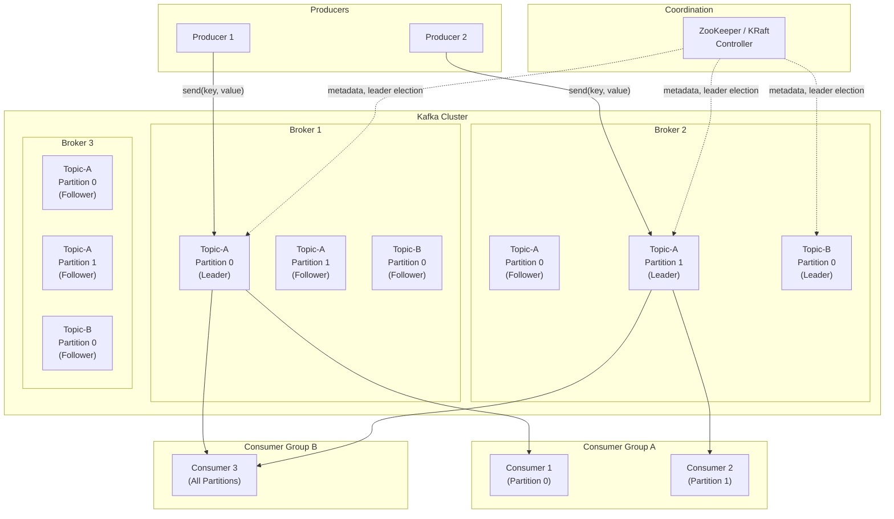
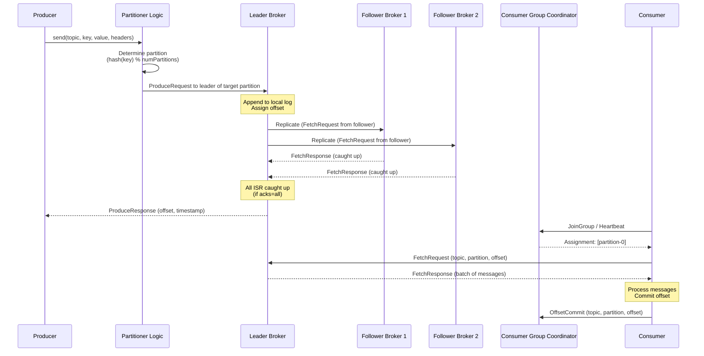
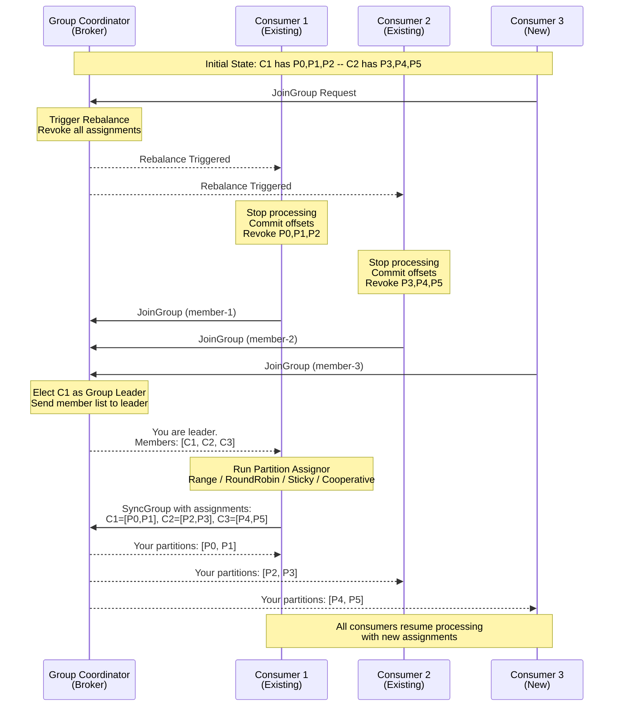
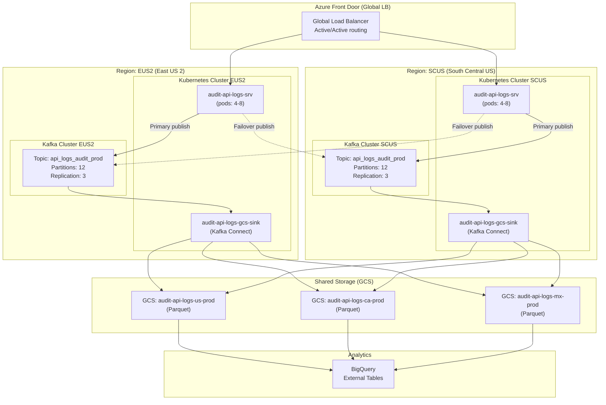
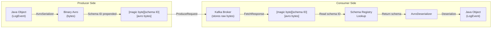
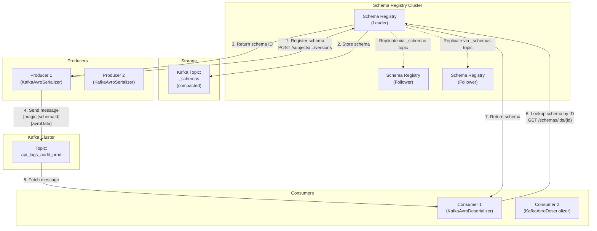
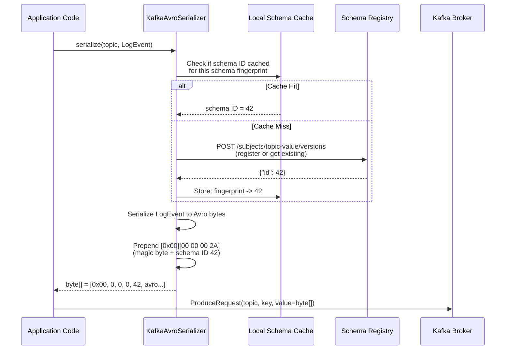
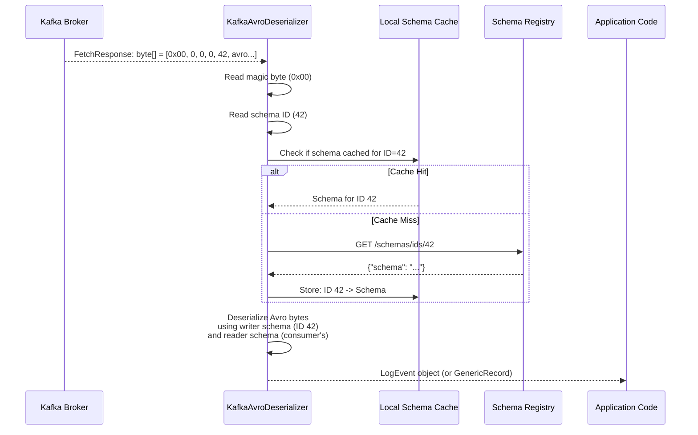
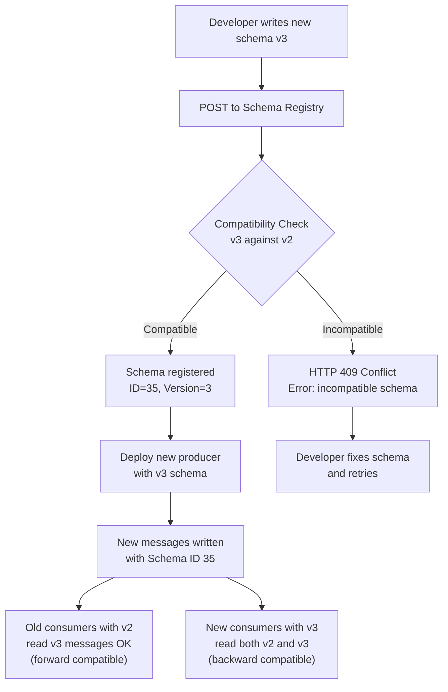
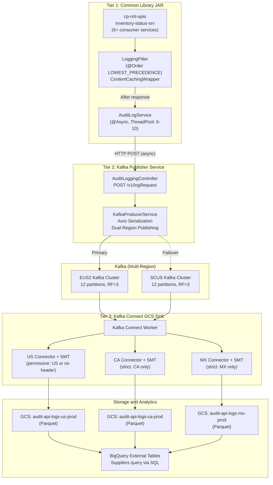

# Kafka, Avro, and Schema Registry -- Complete Study Guide

**For:** Anshul Garg | Backend Engineer | Google Interview Preparation
**Context:** Built Kafka-based audit logging at Walmart (2M+ events/day, multi-region Active/Active, Avro + Schema Registry)

---

# TABLE OF CONTENTS

1. [Part 1: Apache Kafka](#part-1-apache-kafka)
   - [What Is Kafka](#what-is-kafka)
   - [Core Architecture](#core-architecture)
   - [How Messages Flow](#how-messages-flow)
   - [Kafka Internals](#kafka-internals)
   - [Partitioning Strategies](#partitioning-strategies)
   - [Delivery Semantics](#delivery-semantics)
   - [Consumer Groups and Rebalancing](#consumer-groups-and-rebalancing)
   - [Kafka Connect and Kafka Streams](#kafka-connect-and-kafka-streams)
   - [Multi-Region and Active/Active](#multi-region-and-activeactive-kafka)
   - [CompletableFuture Failover Pattern](#completablefuture-based-failover-pattern)
   - [Performance Tuning](#performance-tuning)
2. [Part 2: Apache Avro](#part-2-apache-avro)
   - [What Is Avro](#what-is-avro)
   - [Avro vs JSON vs Protobuf vs Thrift](#avro-vs-json-vs-protobuf-vs-thrift)
   - [Avro Schema Definition](#avro-schema-definition)
   - [Schema Evolution](#schema-evolution)
   - [Compatibility Rules](#compatibility-rules)
   - [Avro with Kafka Code Example](#avro-with-kafka-code-example)
3. [Part 3: Confluent Schema Registry](#part-3-confluent-schema-registry)
   - [What Is Schema Registry](#what-is-schema-registry)
   - [Architecture](#schema-registry-architecture)
   - [Schema ID and Magic Byte](#schema-id-and-magic-byte)
   - [Compatibility Modes](#compatibility-modes-in-depth)
   - [REST API](#schema-registry-rest-api)
   - [Integration with Kafka Producer/Consumer](#integration-with-kafka-producerconsumer)
   - [Schema Version Management](#schema-version-management)
4. [Part 4: Interview Q&A (25+ Questions)](#part-4-interview-qa)
5. [Part 5: How Anshul Used It at Walmart](#part-5-how-anshul-used-it-at-walmart)

---

# PART 1: APACHE KAFKA

## What Is Kafka

Apache Kafka is a **distributed event streaming platform** originally developed at LinkedIn and open-sourced in 2011. It is designed for high-throughput, fault-tolerant, publish-subscribe messaging. Unlike traditional message queues (RabbitMQ, ActiveMQ), Kafka persists messages to disk in an append-only commit log, allowing consumers to read at their own pace and replay messages.

**Key properties:**
- **Distributed**: Runs as a cluster of one or more brokers across multiple servers or data centers
- **Durable**: Messages are persisted to disk and replicated across brokers
- **Scalable**: Horizontally scalable by adding partitions and brokers
- **High throughput**: Capable of millions of messages per second
- **Low latency**: Sub-millisecond end-to-end latency for most use cases
- **Ordered**: Guarantees ordering within a partition (not across partitions)

**When to use Kafka vs alternatives:**

| Use Case | Kafka | RabbitMQ | Amazon SQS |
|----------|-------|----------|------------|
| Event streaming / log aggregation | Best fit | Poor fit | Poor fit |
| High throughput (>100K msg/sec) | Best fit | Degrades | Throttled |
| Message replay | Native | Not supported | Not supported |
| Exactly-once processing | Supported | Not native | Not supported |
| Complex routing | Topic-based | Exchange/binding | Queue-based |
| Ordered delivery | Per-partition | Per-queue | FIFO queues only |
| Long-term retention | Days to forever | Until consumed | 14 days max |
| Consumer groups / fan-out | Native | Requires exchanges | Requires SNS+SQS |

---

## Core Architecture

Kafka's architecture consists of **brokers**, **topics**, **partitions**, **producers**, **consumers**, and **ZooKeeper/KRaft** for coordination.

### Architecture Diagram



### Components Explained

**Broker:**
A Kafka broker is a single Kafka server instance. It receives messages from producers, assigns offsets to them, stores them on disk, and serves them to consumers. A Kafka cluster is composed of multiple brokers (typically 3+ for production). Each broker is identified by a unique numeric ID. Any broker can serve as the **controller** (elected via ZooKeeper or KRaft), which is responsible for partition leader election, reassignment, and cluster metadata management.

Key broker responsibilities:
- Accept produce requests and append messages to partition logs
- Serve fetch requests from consumers
- Replicate partitions to/from other brokers
- Participate in leader election
- Report metrics (under-replicated partitions, ISR count, request latency)

**Topic:**
A topic is a logical channel or category to which messages are published. Topics are multi-subscriber -- zero, one, or many consumers can read from a topic. Topics are divided into partitions for parallelism. Examples: `audit-logs`, `user-events`, `inventory-updates`.

**Partition:**
A partition is an ordered, immutable sequence of messages (a commit log). Each message within a partition gets a sequential ID called an **offset**. Partitions are the unit of parallelism in Kafka. A topic with N partitions can have at most N consumers in a single consumer group reading in parallel.

Key partition properties:
- Messages within a partition are strictly ordered
- Messages across partitions have no ordering guarantee
- Each partition has one **leader** and zero or more **follower** replicas
- Producers write to the leader; followers replicate
- Consumers read from the leader (Kafka 2.4+ allows follower reads for rack-aware consumers)

**Producer:**
A client application that publishes messages to Kafka topics. Producers decide which partition a message goes to (via partitioner). Producers can send messages synchronously, asynchronously, or in a fire-and-forget pattern.

**Consumer:**
A client application that reads messages from Kafka topics. Consumers belong to **consumer groups** and track their position in the log via **offsets**. Each partition is consumed by exactly one consumer within a group.

**ZooKeeper / KRaft:**
ZooKeeper has historically been used for cluster coordination -- broker registration, leader election, topic configuration, consumer group management, and ACLs. Starting with Kafka 3.3+ (KRaft mode, GA in 3.5), Kafka can run without ZooKeeper, using its own Raft-based consensus protocol for metadata management. KRaft is faster for metadata operations and eliminates the ZooKeeper dependency.

---

## How Messages Flow

### End-to-End Message Flow Diagram



### Detailed Step-by-Step

**1. Producer sends a message:**
```java
ProducerRecord<String, String> record = new ProducerRecord<>(
    "audit-logs",                    // topic
    "cp-nrti-apis|/iac/v1/inventory", // key (for partitioning)
    "{...audit payload JSON...}"      // value
);
producer.send(record, (metadata, exception) -> {
    if (exception == null) {
        log.info("Sent to partition {} offset {}",
            metadata.partition(), metadata.offset());
    }
});
```

**2. Partitioner determines the target partition:**
- If key is present: `partition = hash(key) % numPartitions` (uses murmur2 hash by default)
- If key is null: round-robin or sticky partition (batching optimization in newer versions)
- Custom partitioner can be provided

**3. Producer batches and sends:**
- Messages are accumulated in a `RecordAccumulator` buffer, grouped by partition
- When `batch.size` is reached or `linger.ms` expires, the batch is sent
- The batch is compressed (if configured: snappy, lz4, zstd, gzip) and sent as a single ProduceRequest

**4. Leader broker receives and writes:**
- Appends the message batch to the partition log segment file on disk
- Assigns a monotonically increasing offset to each message
- Messages are written to the OS page cache first (not fsync'd immediately for performance)
- The log segment file is a sequential append-only file (excellent disk I/O performance)

**5. Followers replicate:**
- Follower brokers continuously fetch from the leader (pull-based replication)
- When a follower is caught up, it is part of the **In-Sync Replica set (ISR)**
- The leader tracks which followers are in the ISR

**6. Acknowledgement sent to producer:**
- Depends on the `acks` setting:
  - `acks=0`: No acknowledgement (fire-and-forget)
  - `acks=1`: Leader wrote to its local log
  - `acks=all` (or `-1`): All ISR replicas have written the message

**7. Consumer fetches messages:**
- Consumer sends FetchRequest with topic, partition, and starting offset
- Broker returns a batch of messages starting from that offset
- Consumer processes messages and commits the offset back to Kafka (to the `__consumer_offsets` internal topic)

---

## Kafka Internals

### The Commit Log

Kafka stores messages in a **commit log** -- an append-only, ordered sequence of records on disk. Each partition is a separate log.

```
Partition 0 log:
+-------+-------+-------+-------+-------+-------+-------+
|  O:0  |  O:1  |  O:2  |  O:3  |  O:4  |  O:5  |  O:6  |
| msg-a | msg-b | msg-c | msg-d | msg-e | msg-f | msg-g |
+-------+-------+-------+-------+-------+-------+-------+
                    ^                       ^         ^
                    |                       |         |
              Consumer A              Consumer B   Latest
              (offset 2)              (offset 5)   (HW=6)
```

**Log segments:**
The log for a partition is divided into **segments**. Each segment is a pair of files:
- `.log` file: Contains the actual message data
- `.index` file: Maps offsets to physical byte positions in the .log file
- `.timeindex` file: Maps timestamps to offsets

Segments are rolled when they reach `log.segment.bytes` (default 1GB) or `log.roll.ms` (default 7 days). Old segments are deleted based on `log.retention.hours` (default 168 hours = 7 days) or `log.retention.bytes`.

### Offsets

An **offset** is a 64-bit integer that uniquely identifies each message within a partition. Offsets are:
- Assigned sequentially by the leader broker when a message is written
- Immutable -- once assigned, an offset never changes
- Per-partition -- offset 5 in partition 0 is different from offset 5 in partition 1
- The primary mechanism consumers use to track their position

**Key offset concepts:**
- **Log Start Offset**: The earliest available offset (messages before this have been deleted by retention policy)
- **High Watermark (HW)**: The offset up to which all ISR replicas have replicated. Consumers can only read up to the HW.
- **Log End Offset (LEO)**: The offset of the next message to be written. Only the leader knows this immediately.
- **Consumer Committed Offset**: The offset a consumer has acknowledged processing. Stored in `__consumer_offsets` topic.
- **Consumer Position**: The offset of the next message the consumer will read (committed offset + 1)

```
Log Start      Consumer         High           Log End
Offset         Committed        Watermark      Offset
  |            Offset             |               |
  v              v                v               v
  [0][1][2][3][4][5][6][7][8][9][10][11][12][13]
  |<-- consumed -->|<-- available -->|<-- not yet -->|
                                      visible to
                                      consumers
```

### Replication

Kafka replicates partitions across brokers for fault tolerance. The **replication factor** (typically 3 in production) determines how many copies of each partition exist.

**Leader-Follower model:**
- Each partition has exactly one **leader** replica and zero or more **follower** replicas
- All reads and writes go through the leader (except rack-aware follower reads in 2.4+)
- Followers replicate the leader's log by sending FetchRequests (same protocol as consumers)
- If the leader fails, one of the in-sync followers is elected as the new leader

### In-Sync Replicas (ISR)

The ISR is the set of replicas that are "caught up" to the leader. A replica is in the ISR if:
- It has sent a FetchRequest within `replica.lag.time.max.ms` (default 30 seconds)
- Its log end offset is within a reasonable range of the leader's LEO

**ISR dynamics:**
```
Time T0: ISR = {broker-1 (leader), broker-2, broker-3}
         All replicas are caught up.

Time T1: Broker-3 falls behind (network issue, slow disk)
         ISR = {broker-1 (leader), broker-2}
         Broker-3 removed from ISR.

Time T2: Broker-3 catches up again.
         ISR = {broker-1 (leader), broker-2, broker-3}
         Broker-3 re-added to ISR.

Time T3: Broker-1 (leader) dies.
         Controller elects broker-2 as new leader from ISR.
         ISR = {broker-2 (new leader), broker-3}
```

**`min.insync.replicas`:**
This broker/topic-level configuration specifies the minimum number of replicas that must be in the ISR for a produce request with `acks=all` to succeed. If the ISR shrinks below this number, the broker returns `NotEnoughReplicasException` to the producer.

Common production setting: `replication.factor=3`, `min.insync.replicas=2`, `acks=all`. This means:
- 3 copies of each partition
- At least 2 must acknowledge before success
- Tolerates 1 broker failure without data loss
- Tolerates 1 broker failure without availability loss

### Leader Election

When a leader fails, the controller selects a new leader from the ISR. The election process:

1. Controller detects leader failure (via ZooKeeper session expiry or KRaft heartbeat timeout)
2. Controller selects the first broker in the ISR list as the new leader (preferred leader election)
3. Controller updates the metadata in ZooKeeper/KRaft
4. Controller sends LeaderAndIsrRequest to all brokers with the new assignment
5. Brokers update their local metadata cache
6. Producers and consumers discover the new leader via metadata refresh

**Unclean leader election** (`unclean.leader.election.enable`):
If all ISR replicas are dead, Kafka can elect a non-ISR replica as leader. This causes data loss (messages not yet replicated) but restores availability. Default is `false` (prioritize consistency over availability).

---

## Partitioning Strategies

### Key-Based Partitioning (Default)

```java
// Default partitioner uses murmur2 hash
partition = Utils.toPositive(Utils.murmur2(key.getBytes())) % numPartitions;
```

Messages with the same key always go to the same partition, guaranteeing ordering for that key. At Walmart, Anshul used composite keys like `service_name|endpoint_name` to ensure all audit logs for a given API endpoint landed in the same partition:

```java
// From audit-api-logs-srv KafkaProducerService
AuditKafkaPayloadKey key = AuditKafkaPayloadKey.getAuditKafkaPayloadKey(
    request.getEndpointName(),    // e.g., "/iac/v1/inventory"
    request.getServiceName()      // e.g., "cp-nrti-apis"
);
// Key: "cp-nrti-apis|/iac/v1/inventory"
builder.setHeader(KafkaHeaders.KEY, key.toString());
```

**Pros:** Deterministic partition assignment; ordering guarantee per key; good for aggregation.
**Cons:** Potential hot partitions if key distribution is skewed (e.g., one service generates 80% of traffic).

### Round-Robin Partitioning

When no key is specified (key = null), older Kafka clients distributed messages round-robin across partitions.

```java
// No key -- round-robin
producer.send(new ProducerRecord<>("topic", null, value));
```

**Pros:** Even distribution across partitions.
**Cons:** No ordering guarantee; related messages may be split across partitions.

### Sticky Partitioning (Kafka 2.4+)

The **sticky partitioner** is the default for null keys since Kafka 2.4. Instead of round-robin per-message, it sticks to one partition until the batch is full, then switches to another. This reduces the number of smaller, incomplete batches and improves throughput.

```
Round-Robin:  P0, P1, P2, P0, P1, P2  (6 batches, each with 1 message)
Sticky:       P0, P0, P0, P1, P1, P1  (2 batches, each with 3 messages)
```

### Custom Partitioning

```java
public class GeoPartitioner implements Partitioner {
    @Override
    public int partition(String topic, Object key, byte[] keyBytes,
                         Object value, byte[] valueBytes, Cluster cluster) {
        String region = extractRegion(key);
        int numPartitions = cluster.partitionCountForTopic(topic);

        switch (region) {
            case "US": return 0 % numPartitions;
            case "CA": return 1 % numPartitions;
            case "MX": return 2 % numPartitions;
            default:   return Math.abs(key.hashCode()) % numPartitions;
        }
    }
}
```

---

## Delivery Semantics

Kafka supports three delivery guarantees, each with different trade-offs:

### At-Most-Once

Messages may be lost but are never redelivered. The consumer commits offsets **before** processing.

```
1. Consumer fetches messages [offset 5, 6, 7]
2. Consumer commits offset 8  <-- committed BEFORE processing
3. Consumer processes message 5  (success)
4. Consumer processes message 6  (CRASH!)
5. Consumer restarts, reads from offset 8
6. Messages 6 and 7 are LOST
```

**Configuration:**
- `enable.auto.commit = true`
- `auto.commit.interval.ms = small value`
- Process after commit

**Use case:** Metrics, monitoring -- occasional data loss is acceptable.

### At-Least-Once (Most Common)

Messages are never lost but may be redelivered (duplicates possible). The consumer commits offsets **after** processing.

```
1. Consumer fetches messages [offset 5, 6, 7]
2. Consumer processes message 5  (success)
3. Consumer processes message 6  (success)
4. Consumer processes message 7  (CRASH before commit!)
5. Consumer restarts, reads from offset 5  (last committed)
6. Messages 5, 6, 7 are REPROCESSED (duplicates for 5, 6)
```

**Configuration:**
- `enable.auto.commit = false`
- Manual commit after processing: `consumer.commitSync()`
- Producer: `acks=all`, `retries > 0`

**Use case:** Most applications. Consumers should be **idempotent** (processing the same message twice produces the same result).

This is what Anshul used at Walmart for audit logging -- at-least-once delivery with idempotent writes to GCS (Parquet files deduplicated by request_id).

### Exactly-Once Semantics (EOS)

Each message is processed exactly once, even in the presence of failures. Kafka achieves this through:

**1. Idempotent Producer (per-partition exactly-once):**
```java
props.put("enable.idempotence", true);  // Kafka 3.0+ this is default
props.put("acks", "all");
props.put("retries", Integer.MAX_VALUE);
props.put("max.in.flight.requests.per.connection", 5);
```

The producer assigns a **producer ID (PID)** and **sequence number** to each message. The broker deduplicates messages with the same PID and sequence number within a partition. This prevents duplicate writes due to producer retries.

**2. Transactional Producer + Consumer (cross-partition exactly-once):**
```java
// Producer side
props.put("transactional.id", "audit-tx-1");  // Unique per producer instance
producer.initTransactions();

producer.beginTransaction();
try {
    producer.send(new ProducerRecord<>("topic-A", key1, value1));
    producer.send(new ProducerRecord<>("topic-B", key2, value2));
    // Commit consumer offsets as part of the transaction
    producer.sendOffsetsToTransaction(offsets, consumerGroupId);
    producer.commitTransaction();
} catch (Exception e) {
    producer.abortTransaction();
}

// Consumer side
props.put("isolation.level", "read_committed");  // Only see committed messages
```

**How transactions work:**
- Producer registers a `transactional.id` with the **Transaction Coordinator** (a broker)
- Transaction Coordinator assigns an epoch (fences zombie producers)
- Producer sends messages to multiple partitions within a transaction
- On commit, Transaction Coordinator writes a `COMMIT` marker to `__transaction_state` topic
- Consumers with `isolation.level=read_committed` filter out aborted transactions

**Performance cost of EOS:**
- Idempotent producer: ~3-5% throughput reduction (negligible)
- Transactions: ~10-20% throughput reduction (due to commit overhead)

---

## Consumer Groups and Rebalancing

### Consumer Group Basics

A **consumer group** is a set of consumers that cooperate to consume messages from one or more topics. Kafka guarantees that each partition is consumed by exactly one consumer within a group.

```
Topic: audit-logs (6 partitions)

Consumer Group "audit-processors" (3 consumers):
  Consumer-1: Partitions [0, 1]
  Consumer-2: Partitions [2, 3]
  Consumer-3: Partitions [4, 5]

Consumer Group "dashboard-readers" (1 consumer):
  Consumer-A: Partitions [0, 1, 2, 3, 4, 5]
```

**Key rules:**
- Each partition is assigned to exactly one consumer within a group
- One consumer can handle multiple partitions
- If consumers > partitions, extra consumers sit idle
- Multiple consumer groups can independently consume the same topic (pub-sub pattern)

### Consumer Group Rebalancing Diagram



### Rebalance Protocols

**Eager Rebalance (legacy):**
All consumers stop, revoke all partitions, rejoin, and get new assignments. Causes a complete **stop-the-world** pause. No messages are processed during rebalance.

**Cooperative (Incremental) Rebalance (recommended, Kafka 2.4+):**
Only the partitions that need to move are revoked and reassigned. Consumers that keep their partitions continue processing. Multiple rebalance rounds may be needed, but the disruption is minimal.

```java
props.put("partition.assignment.strategy",
    "org.apache.kafka.clients.consumer.CooperativeStickyAssignor");
```

### Rebalance Triggers

| Trigger | Example | Impact |
|---------|---------|--------|
| Consumer joins group | New instance deployed | Partitions redistributed |
| Consumer leaves group | Instance crashes, `session.timeout.ms` expires | Orphaned partitions reassigned |
| Consumer heartbeat timeout | Consumer is blocked/slow, misses heartbeat | Consumer removed, partitions reassigned |
| Consumer poll timeout | Consumer takes too long between `poll()` calls (`max.poll.interval.ms`) | Consumer removed from group |
| Topic partition count changes | Admin adds partitions | All partitions reassigned |
| Subscription pattern changes | Consumer subscribes to new topic via regex | Full reassignment |

### Static Group Membership (Kafka 2.3+)

To reduce unnecessary rebalances during rolling deployments:

```java
props.put("group.instance.id", "consumer-host-1");  // Static member ID
```

When a consumer with a static ID disconnects and reconnects within `session.timeout.ms`, it gets back the same partitions without triggering a rebalance.

---

## Kafka Connect and Kafka Streams

### Kafka Connect

Kafka Connect is a framework for streaming data between Kafka and external systems (databases, file systems, cloud storage, search indexes). It runs as a distributed, fault-tolerant cluster of **workers**.

**Key concepts:**
- **Connectors**: Define where data comes from (Source) or goes to (Sink)
- **Tasks**: The actual work units that move data. A connector can have multiple tasks for parallelism.
- **Workers**: JVM processes that execute connectors and tasks
- **Converters**: Serialize/deserialize data (e.g., AvroConverter, JsonConverter)
- **Single Message Transforms (SMTs)**: Lightweight, per-message transformations (filter, route, rename fields)

```
Source Connectors:                    Sink Connectors:
  Database (Debezium CDC)  ──>          ──>  Elasticsearch
  File System              ──>  Kafka   ──>  HDFS / S3 / GCS
  REST API                 ──>  Topics  ──>  JDBC Database
  MQTT / IoT               ──>          ──>  BigQuery
```

**How Anshul used Kafka Connect at Walmart:**

The `audit-api-logs-gcs-sink` was a Kafka Connect Sink connector running 3 parallel connectors with custom SMT filters to route records by `wm-site-id` header to separate GCS buckets (US, CA, MX) in Parquet format.

```yaml
connectors:
  - name: audit-log-gcs-sink-connector       # US connector
    config:
      connector.class: io.lenses.streamreactor.connect.gcp.storage.sink.GCPStorageSinkConnector
      tasks.max: 1
      transforms: InsertRollingRecordTimestamp, FilterUS
      transforms.FilterUS.type: com.walmart.audit.log.sink.converter.AuditLogSinkUSFilter

  - name: audit-log-gcs-sink-connector-ca    # CA connector
    config:
      transforms: InsertRollingRecordTimestamp, FilterCA
      transforms.FilterCA.type: com.walmart.audit.log.sink.converter.AuditLogSinkCAFilter

  - name: audit-log-gcs-sink-connector-mx    # MX connector
    config:
      transforms: InsertRollingRecordTimestamp, FilterMX
      transforms.FilterMX.type: com.walmart.audit.log.sink.converter.AuditLogSinkMXFilter
```

### Kafka Streams

Kafka Streams is a client library for building real-time stream processing applications. Unlike Spark Streaming or Flink, it does not require a separate cluster -- it runs as a regular Java application.

**Key concepts:**
- **KStream**: An unbounded stream of records (each record is independent)
- **KTable**: A changelog stream (each record is an upsert by key -- latest value per key)
- **GlobalKTable**: A replicated KTable available on all instances
- **Topology**: A directed acyclic graph of stream processors
- **State Stores**: Local RocksDB instances for stateful operations (joins, aggregations)

```java
StreamsBuilder builder = new StreamsBuilder();

KStream<String, AuditEvent> auditStream = builder.stream("audit-logs");

// Count events per service per hour
KTable<Windowed<String>, Long> eventCounts = auditStream
    .groupBy((key, value) -> value.getServiceName())
    .windowedBy(TimeWindows.ofSizeWithNoGrace(Duration.ofHours(1)))
    .count(Materialized.as("event-counts-store"));

// Write results to output topic
eventCounts.toStream()
    .map((windowedKey, count) ->
        KeyValue.pair(windowedKey.key(), count.toString()))
    .to("audit-event-counts");
```

**When to use Kafka Streams vs Kafka Connect:**

| Criteria | Kafka Connect | Kafka Streams |
|----------|---------------|---------------|
| Purpose | Move data in/out of Kafka | Process data within Kafka |
| Coding | Configuration-driven (YAML/JSON) | Java/Scala code |
| Transformations | Simple (SMTs) | Complex (joins, windows, aggregations) |
| State management | Stateless | Stateful (RocksDB) |
| Deployment | Connect cluster (shared workers) | Standalone Java app |
| Example | DB -> Kafka, Kafka -> GCS | Real-time aggregation, enrichment |

---

## Multi-Region and Active/Active Kafka

### Why Multi-Region at Walmart

Walmart's Luminate platform deployed across two Azure regions for disaster recovery and low latency:
- **EUS2** (East US 2) -- Primary
- **SCUS** (South Central US) -- Secondary

Both regions ran identical Kafka clusters with independent topic replicas. The audit logging service published to both clusters in an Active/Active configuration.

### Multi-Region Architecture Diagram



### Active/Active Publishing with Dual KafkaTemplates

The `audit-api-logs-srv` maintained two KafkaTemplate instances, one for each region:

```java
@Autowired
private KafkaTemplate<String, Message<LogEvent>> kafkaPrimaryTemplate;   // EUS2

@Autowired
private KafkaTemplate<String, Message<LogEvent>> kafkaSecondaryTemplate; // SCUS

public void publishMessageToTopic(LoggingApiRequest request) {
    String topicName = auditLogsKafkaCCMConfig.getAuditLoggingKafkaTopicName();
    Message<LogEvent> kafkaMessage = prepareAuditLoggingKafkaMessage(request, topicName);

    try {
        kafkaPrimaryTemplate.send(kafkaMessage);   // Try EUS2 first
    } catch (Exception ex) {
        log.error("Primary Kafka failed, trying secondary", ex);
        kafkaSecondaryTemplate.send(kafkaMessage);  // Failover to SCUS
    }
}
```

### Key Design Decisions for Multi-Region

| Decision | Choice | Rationale |
|----------|--------|-----------|
| Replication strategy | Independent clusters (not MirrorMaker) | Lower latency, simpler operations |
| Publishing strategy | Dual publish with failover | Each region has its own copy |
| Consumer strategy | Each region consumes its own cluster | No cross-region consumer traffic |
| Storage | Shared GCS buckets | Both regions write to same buckets |
| Deduplication | By request_id in BigQuery | Handles rare dual-write scenarios |
| DR recovery target | 15 minutes | Achieved via Azure Front Door failover |

---

## CompletableFuture-Based Failover Pattern

At Walmart, Anshul implemented a CompletableFuture-based pattern for multi-region Kafka publishing with intelligent failover. This pattern extends beyond the simple try-catch shown above to handle asynchronous publishing with timeout-based failover.

### The Pattern

```java
public CompletableFuture<SendResult<String, LogEvent>> publishWithFailover(
        Message<LogEvent> message) {

    // Try primary region first with timeout
    return CompletableFuture.supplyAsync(() -> {
        try {
            ListenableFuture<SendResult<String, LogEvent>> future =
                kafkaPrimaryTemplate.send(message);
            return future.get(5, TimeUnit.SECONDS);  // 5-second timeout
        } catch (Exception e) {
            throw new CompletionException(e);
        }
    }).exceptionallyCompose(throwable -> {
        // Primary failed -- failover to secondary
        log.warn("Primary Kafka publish failed, failing over to secondary", throwable);
        metrics.incrementCounter("kafka.failover.count");

        return CompletableFuture.supplyAsync(() -> {
            try {
                ListenableFuture<SendResult<String, LogEvent>> future =
                    kafkaSecondaryTemplate.send(message);
                return future.get(5, TimeUnit.SECONDS);
            } catch (Exception e) {
                log.error("Both Kafka regions failed", e);
                metrics.incrementCounter("kafka.publish.failure.total");
                throw new CompletionException(e);
            }
        });
    });
}
```

### Why CompletableFuture Over Simple Try-Catch

| Aspect | Simple Try-Catch | CompletableFuture Pattern |
|--------|------------------|---------------------------|
| Blocking | Blocks calling thread on primary failure | Non-blocking composition |
| Timeout control | Limited | Fine-grained per-region timeouts |
| Chaining | Nested try-catch blocks | Clean functional composition |
| Metrics/observability | Manual instrumentation | Natural composition points |
| Circuit breaking | Manual state management | Composable with CompletableFuture |
| Bulk operations | Sequential | Can use `allOf()` for batches |

---

## Performance Tuning

### Producer Tuning

| Parameter | Default | Recommended | Explanation |
|-----------|---------|-------------|-------------|
| `batch.size` | 16384 (16KB) | 65536-131072 (64-128KB) | Larger batches = higher throughput but more latency |
| `linger.ms` | 0 | 5-20 | Wait time before sending incomplete batch. 0 = send immediately. Higher = more batching. |
| `acks` | `all` (Kafka 3.0+) | `all` for durability, `1` for speed | `all` waits for ISR, `1` waits for leader only |
| `compression.type` | `none` | `lz4` or `snappy` | lz4 = best speed, zstd = best ratio, snappy = good balance |
| `buffer.memory` | 33554432 (32MB) | 67108864 (64MB) | Total producer buffer size. Increase for bursty workloads. |
| `max.in.flight.requests.per.connection` | 5 | 5 (with idempotence) | Max unacknowledged requests. With idempotence, 5 is safe. |
| `retries` | 2147483647 | 2147483647 | Retry indefinitely (bounded by `delivery.timeout.ms`) |
| `delivery.timeout.ms` | 120000 (2 min) | 120000 | Upper bound on total send time including retries |
| `enable.idempotence` | true (Kafka 3.0+) | true | Prevents duplicate writes on retry |

**Batch size and linger.ms interaction:**

```
linger.ms=0, batch.size=16KB:
  Every message sent immediately. Low latency, low throughput.
  Good for: Real-time alerting, low-volume topics.

linger.ms=5, batch.size=64KB:
  Wait up to 5ms to fill batch. Moderate latency, good throughput.
  Good for: Most production workloads.

linger.ms=50, batch.size=128KB:
  Wait up to 50ms. Higher latency, maximum throughput.
  Good for: Log aggregation, batch analytics, audit logging (Walmart).
```

### Consumer Tuning

| Parameter | Default | Recommended | Explanation |
|-----------|---------|-------------|-------------|
| `fetch.min.bytes` | 1 | 1024-65536 | Min bytes broker accumulates before returning fetch. Higher = fewer requests. |
| `fetch.max.wait.ms` | 500 | 500 | Max wait time if `fetch.min.bytes` not met |
| `max.poll.records` | 500 | 50-500 | Max records returned per `poll()`. Lower if processing is slow. |
| `max.poll.interval.ms` | 300000 (5 min) | 300000 | Max time between `poll()` calls before consumer is kicked from group |
| `session.timeout.ms` | 45000 | 15000-30000 | Heartbeat timeout. Lower = faster failure detection. |
| `heartbeat.interval.ms` | 3000 | 5000 | How often to send heartbeats. Should be < session.timeout.ms / 3 |
| `auto.offset.reset` | `latest` | `earliest` or `latest` | Where to start if no committed offset: `earliest` (beginning) or `latest` (end) |
| `enable.auto.commit` | true | false | Manual commit for at-least-once guarantees |

**What Anshul tuned at Walmart (from PRs #35-61 on gcs-sink):**

```yaml
# Production Kafka Connect consumer config
max.poll.records: 50         # Reduced from 500 to prevent timeout
max.poll.interval.ms: 300000 # 5 minutes for processing batch
heartbeat.interval.ms: 5000  # Frequent heartbeats
session.timeout.ms: 15000    # Fast failure detection
request.timeout.ms: 60000    # 1 minute request timeout
```

### Broker Tuning

| Parameter | Default | Production | Explanation |
|-----------|---------|------------|-------------|
| `num.partitions` | 1 | 6-12 per topic | More partitions = more parallelism |
| `default.replication.factor` | 1 | 3 | Fault tolerance |
| `min.insync.replicas` | 1 | 2 | Minimum ISR for acks=all |
| `log.retention.hours` | 168 (7 days) | 168-720 | How long to keep messages |
| `log.segment.bytes` | 1073741824 (1GB) | 1073741824 | Size of each log segment file |
| `num.io.threads` | 8 | 8-16 | Threads for disk I/O |
| `num.network.threads` | 3 | 8-16 | Threads for network requests |
| `socket.receive.buffer.bytes` | 102400 | 1048576 (1MB) | TCP receive buffer |
| `socket.send.buffer.bytes` | 102400 | 1048576 (1MB) | TCP send buffer |

---

# PART 2: APACHE AVRO

## What Is Avro

Apache Avro is a **binary serialization framework** developed within the Apache Hadoop ecosystem. It uses JSON-based schemas to define data structures and serializes data into a compact binary format. Avro is the de facto serialization format for Kafka in enterprise environments because of its schema enforcement, compact size, and evolution capabilities.

**Key characteristics:**
- **Schema-based**: Every piece of data has an associated schema
- **Binary format**: Compact, fast serialization/deserialization
- **Schema evolution**: Add/remove/rename fields without breaking consumers
- **Language-neutral**: Schemas defined in JSON, code generated for Java, Python, C++, etc.
- **Self-describing**: Schema can be embedded in files (for Hadoop) or referenced via Schema Registry (for Kafka)
- **Rich type system**: Primitives (null, boolean, int, long, float, double, bytes, string), complex types (records, enums, arrays, maps, unions, fixed)

---

## Avro vs JSON vs Protobuf vs Thrift

| Feature | Avro | JSON | Protocol Buffers | Thrift |
|---------|------|------|-------------------|--------|
| **Format** | Binary | Text | Binary | Binary |
| **Schema** | JSON schema (.avsc) | No schema (or JSON Schema) | .proto files | .thrift files |
| **Schema in message** | No (uses Schema Registry) | Implicit (field names in every message) | No (compiled into code) | No (compiled into code) |
| **Message size** | Small (no field names) | Large (field names repeated) | Small (field tags) | Small (field tags) |
| **Size vs JSON** | ~30% of JSON | 100% (baseline) | ~25% of JSON | ~25% of JSON |
| **Schema evolution** | Excellent (built-in) | N/A | Good (field numbers) | Good (field IDs) |
| **Backward compat** | Native | N/A | Native (via field numbers) | Native (via field IDs) |
| **Code generation** | Optional | N/A | Required | Required |
| **Dynamic typing** | Supported (GenericRecord) | Native | Limited | Limited |
| **Kafka integration** | Best (Confluent native) | Good (simple) | Good (via SR) | Poor |
| **Human readable** | No (binary) | Yes | No (binary) | No (binary) |
| **Compression** | Supports built-in codecs | Requires external | N/A | N/A |
| **Null handling** | Union with null | Native | Optional fields (proto3) | Optional keyword |
| **Speed** | Fast | Slow (parsing) | Fastest | Fast |
| **Community/ecosystem** | Hadoop/Kafka ecosystem | Universal | Google ecosystem | Facebook ecosystem |
| **Use at Walmart** | Kafka audit messages | REST API payloads | Not used | Not used |

**Why Avro was chosen at Walmart over JSON:**
1. **70% size reduction** -- 2M+ events/day, binary Avro saved significant bandwidth and storage
2. **Schema enforcement** -- prevents malformed audit records from entering the pipeline
3. **Schema evolution** -- can add new fields to the audit schema without breaking GCS sink consumers
4. **Confluent Schema Registry** -- native integration with Kafka ecosystem, centralized schema management
5. **Parquet compatibility** -- Avro schemas map directly to Parquet column definitions for GCS storage

---

## Avro Schema Definition

Avro schemas are defined in JSON format, typically stored in `.avsc` files.

### Primitive Types

```json
{
  "type": "null"     // No value
  "type": "boolean"  // true/false
  "type": "int"      // 32-bit signed integer
  "type": "long"     // 64-bit signed integer
  "type": "float"    // 32-bit IEEE 754
  "type": "double"   // 64-bit IEEE 754
  "type": "bytes"    // Sequence of bytes
  "type": "string"   // Unicode string
}
```

### Record Type (Most Common)

The Avro schema used at Walmart for audit log events:

```json
{
  "type": "record",
  "name": "LogEvent",
  "namespace": "com.walmart.audit.avro",
  "doc": "Audit log event for API request/response tracking",
  "fields": [
    {
      "name": "request_id",
      "type": "string",
      "doc": "UUID for request correlation"
    },
    {
      "name": "service_name",
      "type": "string",
      "doc": "Source service name (e.g., cp-nrti-apis)"
    },
    {
      "name": "endpoint_name",
      "type": "string",
      "doc": "API endpoint path"
    },
    {
      "name": "method",
      "type": "string",
      "doc": "HTTP method (GET, POST, etc.)"
    },
    {
      "name": "request_body",
      "type": ["null", "string"],
      "default": null,
      "doc": "Captured request JSON body"
    },
    {
      "name": "response_body",
      "type": ["null", "string"],
      "default": null,
      "doc": "Captured response JSON body"
    },
    {
      "name": "response_code",
      "type": "int",
      "doc": "HTTP status code"
    },
    {
      "name": "error_reason",
      "type": ["null", "string"],
      "default": null,
      "doc": "Error message if request failed"
    },
    {
      "name": "request_ts",
      "type": "long",
      "doc": "Request timestamp (epoch seconds)"
    },
    {
      "name": "response_ts",
      "type": "long",
      "doc": "Response timestamp (epoch seconds)"
    },
    {
      "name": "headers",
      "type": {
        "type": "map",
        "values": "string"
      },
      "doc": "HTTP headers as key-value pairs"
    },
    {
      "name": "trace_id",
      "type": ["null", "string"],
      "default": null,
      "doc": "OpenTelemetry distributed trace ID"
    }
  ]
}
```

### Complex Types

```json
// Enum
{
  "type": "enum",
  "name": "HttpMethod",
  "symbols": ["GET", "POST", "PUT", "DELETE", "PATCH"]
}

// Array
{
  "type": "array",
  "items": "string"
}

// Map
{
  "type": "map",
  "values": "string"
}

// Union (nullable field)
{
  "name": "error_reason",
  "type": ["null", "string"],  // Can be null OR string
  "default": null
}

// Fixed (fixed-size bytes)
{
  "type": "fixed",
  "name": "md5",
  "size": 16
}

// Logical Types (annotations on primitives)
{
  "type": "long",
  "logicalType": "timestamp-millis"  // Long interpreted as milliseconds since epoch
}
```

---

## Schema Evolution

Schema evolution is the ability to change the schema over time without breaking existing producers or consumers. This is critical in distributed systems where producers and consumers are deployed independently.

### Adding a Field

```json
// Schema v1 (original)
{
  "type": "record",
  "name": "LogEvent",
  "fields": [
    {"name": "request_id", "type": "string"},
    {"name": "service_name", "type": "string"},
    {"name": "response_code", "type": "int"}
  ]
}

// Schema v2 (added trace_id with default)
{
  "type": "record",
  "name": "LogEvent",
  "fields": [
    {"name": "request_id", "type": "string"},
    {"name": "service_name", "type": "string"},
    {"name": "response_code", "type": "int"},
    {"name": "trace_id", "type": ["null", "string"], "default": null}  // NEW FIELD
  ]
}
```

**What happens:**
- Old consumer (v1 schema) reads v2 message: `trace_id` is ignored (consumer does not know about it)
- New consumer (v2 schema) reads v1 message: `trace_id` gets the default value `null`
- This is a **backward compatible** change (new consumer can read old data)
- This is also a **forward compatible** change (old consumer can read new data)

### Removing a Field

```json
// Schema v2 (has error_reason)
{
  "fields": [
    {"name": "request_id", "type": "string"},
    {"name": "error_reason", "type": ["null", "string"], "default": null},
    {"name": "response_code", "type": "int"}
  ]
}

// Schema v3 (removed error_reason)
{
  "fields": [
    {"name": "request_id", "type": "string"},
    {"name": "response_code", "type": "int"}
  ]
}
```

**Rules for safe removal:**
- The removed field MUST have had a default value in the previous schema
- Old producers still writing v2 (with error_reason): new consumer (v3) ignores the field
- New producers writing v3 (without error_reason): old consumer (v2) uses the default value

### Renaming a Field

Renaming is done using **aliases**:

```json
// Schema v2 (renamed service_name to source_service)
{
  "fields": [
    {"name": "source_service", "type": "string", "aliases": ["service_name"]}
  ]
}
```

The alias allows data written with the old field name to be read using the new field name.

---

## Compatibility Rules

Avro schema compatibility determines which schema changes are safe. There are four modes:

### Backward Compatibility

**Definition:** New schema (reader) can read data written with the old schema (writer).

**Allowed changes:**
- Add a field with a default value
- Remove a field (without default in new schema is fine -- old data just has extra field)

**Example:** Consumer upgrades to v2, still reads v1 data.

```
Producer (v1 schema) --> Kafka --> Consumer (v2 schema)
                                   "I can read old data"
```

### Forward Compatibility

**Definition:** Old schema (reader) can read data written with the new schema (writer).

**Allowed changes:**
- Remove a field that had a default value
- Add a field (old reader ignores unknown fields)

**Example:** Producer upgrades to v2, old consumer (v1) can still read it.

```
Producer (v2 schema) --> Kafka --> Consumer (v1 schema)
                                   "I can read new data"
```

### Full Compatibility

**Definition:** Both backward AND forward compatible. New and old schemas can read each other's data.

**Allowed changes:**
- Add a field with a default value
- Remove a field that had a default value

**This is the recommended mode for most production systems.** It allows producers and consumers to be upgraded independently in any order.

### None

No compatibility check. Any schema change is allowed. Dangerous in production -- can break consumers.

### Compatibility Matrix

| Change | Backward | Forward | Full | None |
|--------|----------|---------|------|------|
| Add field WITH default | Yes | Yes | Yes | Yes |
| Add field WITHOUT default | No | Yes | No | Yes |
| Remove field WITH default | Yes | Yes | Yes | Yes |
| Remove field WITHOUT default | Yes | No | No | Yes |
| Rename field (with alias) | Yes | Yes | Yes | Yes |
| Change field type | Depends | Depends | Depends | Yes |
| Add enum symbol | No | Yes | No | Yes |
| Remove enum symbol | Yes | No | No | Yes |

---

## Avro with Kafka Code Example

### Avro Serialization Flow Diagram



### Java Producer Example

```java
// ---- Producer Configuration ----
Properties props = new Properties();
props.put("bootstrap.servers", "kafka-eus2.walmart.com:9093");
props.put("key.serializer", "org.apache.kafka.common.serialization.StringSerializer");
props.put("value.serializer", "io.confluent.kafka.serializers.KafkaAvroSerializer");
props.put("schema.registry.url", "https://schema-registry.walmart.com");
props.put("acks", "all");
props.put("retries", 3);
props.put("enable.idempotence", true);
props.put("linger.ms", 20);
props.put("batch.size", 65536);
props.put("compression.type", "snappy");

KafkaProducer<String, LogEvent> producer = new KafkaProducer<>(props);

// ---- Build Avro Record ----
LogEvent event = LogEvent.newBuilder()
    .setRequestId(UUID.randomUUID().toString())
    .setServiceName("cp-nrti-apis")
    .setEndpointName("/iac/v1/inventory")
    .setMethod("POST")
    .setRequestBody("{\"store_id\": 1234}")
    .setResponseBody("{\"items\": [...]}")
    .setResponseCode(200)
    .setErrorReason(null)
    .setRequestTs(System.currentTimeMillis() / 1000)
    .setResponseTs(System.currentTimeMillis() / 1000)
    .setHeaders(Map.of("wm_consumer.id", "supplier-123"))
    .setTraceId("abc-trace-123")
    .build();

// ---- Send to Kafka ----
ProducerRecord<String, LogEvent> record = new ProducerRecord<>(
    "api_logs_audit_prod",                          // topic
    "cp-nrti-apis|/iac/v1/inventory",               // key
    event                                            // value (Avro object)
);

// Add Kafka headers for routing
record.headers().add("wm-site-id", "US".getBytes());

producer.send(record, (metadata, exception) -> {
    if (exception == null) {
        log.info("Published to partition={} offset={}",
            metadata.partition(), metadata.offset());
    } else {
        log.error("Failed to publish audit event", exception);
    }
});
```

### Java Consumer Example

```java
// ---- Consumer Configuration ----
Properties props = new Properties();
props.put("bootstrap.servers", "kafka-eus2.walmart.com:9093");
props.put("group.id", "audit-gcs-sink-consumer");
props.put("key.deserializer", "org.apache.kafka.common.serialization.StringDeserializer");
props.put("value.deserializer", "io.confluent.kafka.serializers.KafkaAvroDeserializer");
props.put("schema.registry.url", "https://schema-registry.walmart.com");
props.put("specific.avro.reader", "true");  // Deserialize to specific LogEvent class
props.put("auto.offset.reset", "earliest");
props.put("enable.auto.commit", "false");
props.put("max.poll.records", "50");

KafkaConsumer<String, LogEvent> consumer = new KafkaConsumer<>(props);
consumer.subscribe(Collections.singletonList("api_logs_audit_prod"));

// ---- Consume Loop ----
while (true) {
    ConsumerRecords<String, LogEvent> records = consumer.poll(Duration.ofMillis(1000));

    for (ConsumerRecord<String, LogEvent> record : records) {
        LogEvent event = record.value();

        // Extract routing header
        Header siteHeader = record.headers().lastHeader("wm-site-id");
        String siteId = siteHeader != null ? new String(siteHeader.value()) : "US";

        // Process: write to GCS bucket based on site
        String bucket = switch (siteId) {
            case "CA" -> "audit-api-logs-ca-prod";
            case "MX" -> "audit-api-logs-mx-prod";
            default   -> "audit-api-logs-us-prod";
        };

        writeToGCS(bucket, event);
    }

    // Manual commit after processing
    consumer.commitSync();
}
```

### Using GenericRecord (No Code Generation)

```java
// When you do not have generated Avro classes
props.put("specific.avro.reader", "false");

KafkaConsumer<String, GenericRecord> consumer = new KafkaConsumer<>(props);

for (ConsumerRecord<String, GenericRecord> record : records) {
    GenericRecord event = record.value();

    String requestId = event.get("request_id").toString();
    String serviceName = event.get("service_name").toString();
    int responseCode = (int) event.get("response_code");

    // Handles schema evolution gracefully
    Object traceId = event.get("trace_id");  // null if field not in writer schema
}
```

---

# PART 3: CONFLUENT SCHEMA REGISTRY

## What Is Schema Registry

The **Confluent Schema Registry** is a serving layer for Avro (and Protobuf, JSON Schema) schemas. It provides a centralized repository for schemas used in Kafka, enabling:

1. **Schema storage and retrieval**: Schemas are stored with unique IDs
2. **Compatibility enforcement**: Validates new schemas against previous versions
3. **Serializer/Deserializer integration**: Producers and consumers use Schema Registry automatically
4. **Version management**: Each schema subject has a history of versions
5. **REST API**: CRUD operations on schemas via HTTP

**Why is Schema Registry needed?**

Without Schema Registry, Kafka messages are just bytes. Producers and consumers must agree on the serialization format out-of-band. This leads to:
- No schema enforcement (bad data enters the pipeline)
- No evolution management (breaking changes go undetected)
- Schema duplication (each team maintains their own copy)
- No centralized documentation of data contracts

With Schema Registry:
- Schemas are the "contract" between producers and consumers
- Changes are validated before they reach Kafka
- Consumers can deserialize any message by looking up its schema ID
- Breaking changes are blocked at registration time

---

## Schema Registry Architecture



### How Schema Registry Stores Schemas

Schema Registry stores its data in a special Kafka topic called `_schemas`:
- Topic is **compacted** (keeps latest value per key, never deletes)
- Key: The schema subject and version
- Value: The schema definition (JSON)
- This means Schema Registry is itself backed by Kafka -- it is essentially a Kafka consumer/producer

**Leader election:**
Schema Registry uses ZooKeeper (or a leader election protocol) to elect a single leader instance. Only the leader handles write operations (register, update, delete schemas). All instances can handle reads. If the leader fails, a new leader is elected.

---

## Schema ID and Magic Byte

When the KafkaAvroSerializer sends a message, it prepends a **5-byte header** to the serialized Avro data:

```
Byte 0:       Magic byte (always 0x00)
Bytes 1-4:    Schema ID (4-byte big-endian integer)
Bytes 5+:     Avro binary-encoded data (no embedded schema)

Wire Format:
+--------+--------+--------+--------+--------+--------------------+
| 0x00   | Schema ID (32-bit BE int)         | Avro Binary Data   |
+--------+--------+--------+--------+--------+--------------------+
| 1 byte | 4 bytes                           | Variable length    |
+--------+------------------------------------+--------------------+
```

**Example:**
```
Schema ID = 42
Avro data = [binary bytes representing a LogEvent]

Wire format: 0x00 0x00 0x00 0x00 0x2A [avro bytes...]
                   |    |    |    |
                   +----+----+----+-- Schema ID 42 in big-endian
```

**Why this design?**
- The magic byte allows consumers to detect if a message uses Schema Registry encoding
- The schema ID is compact (4 bytes) vs embedding the full schema (could be kilobytes)
- The consumer uses the schema ID to fetch the schema from Schema Registry (with local caching)
- This keeps Kafka messages small while maintaining full schema information

---

## Compatibility Modes in Depth

Schema Registry enforces compatibility at the **subject** level. A subject is typically `{topic}-key` or `{topic}-value`.

### Modes

| Mode | Description | Allowed Changes | Use Case |
|------|-------------|-----------------|----------|
| `BACKWARD` (default) | New schema can read old data | Add optional field, delete field | Consumer-first upgrades |
| `BACKWARD_TRANSITIVE` | New schema can read ALL old data (all versions) | Same as BACKWARD, but checked against all versions | Strict consumer-first |
| `FORWARD` | Old schema can read new data | Delete optional field, add field | Producer-first upgrades |
| `FORWARD_TRANSITIVE` | ALL old schemas can read new data | Same as FORWARD, but checked against all versions | Strict producer-first |
| `FULL` | Both backward and forward compatible | Add/delete optional fields only | Independent upgrades |
| `FULL_TRANSITIVE` | Full compatibility against ALL versions | Same as FULL, but checked against all versions | Most strict |
| `NONE` | No compatibility checking | Any change | Development/testing only |

### How Compatibility is Checked

```
Existing versions:  v1 --> v2 --> v3
New version:        v4 (being registered)

BACKWARD:              Check v4 against v3 only
BACKWARD_TRANSITIVE:   Check v4 against v3, v2, v1
FORWARD:               Check v3 against v4 only (can v3 read v4?)
FORWARD_TRANSITIVE:    Check v1, v2, v3 against v4
FULL:                  Check v4<->v3 both ways
FULL_TRANSITIVE:       Check v4<->v1, v4<->v2, v4<->v3 both ways
```

### Practical Example

```
// Subject: api_logs_audit_prod-value
// Compatibility: BACKWARD (default)

// v1 schema registered successfully
{
  "fields": [
    {"name": "request_id", "type": "string"},
    {"name": "service_name", "type": "string"}
  ]
}

// v2 schema: Add optional field --> PASSES backward check
{
  "fields": [
    {"name": "request_id", "type": "string"},
    {"name": "service_name", "type": "string"},
    {"name": "trace_id", "type": ["null", "string"], "default": null}  // OK
  ]
}

// v3 schema: Add required field --> FAILS backward check
{
  "fields": [
    {"name": "request_id", "type": "string"},
    {"name": "service_name", "type": "string"},
    {"name": "trace_id", "type": ["null", "string"], "default": null},
    {"name": "region", "type": "string"}  // FAILS: no default, not backward compatible
  ]
}
// Error: Schema being registered is incompatible with an earlier schema
```

---

## Schema Registry REST API

### Common Endpoints

```bash
# List all subjects
GET /subjects
# Response: ["api_logs_audit_prod-value", "api_logs_audit_prod-key", "user-events-value"]

# List versions for a subject
GET /subjects/api_logs_audit_prod-value/versions
# Response: [1, 2, 3]

# Get schema by subject and version
GET /subjects/api_logs_audit_prod-value/versions/2
# Response:
# {
#   "subject": "api_logs_audit_prod-value",
#   "version": 2,
#   "id": 42,
#   "schema": "{\"type\":\"record\",\"name\":\"LogEvent\",...}"
# }

# Get latest version
GET /subjects/api_logs_audit_prod-value/versions/latest

# Get schema by global ID
GET /schemas/ids/42
# Response: {"schema": "{\"type\":\"record\",\"name\":\"LogEvent\",...}"}

# Register a new schema
POST /subjects/api_logs_audit_prod-value/versions
Content-Type: application/vnd.schemaregistry.v1+json
{
  "schema": "{\"type\":\"record\",\"name\":\"LogEvent\",\"fields\":[...]}"
}
# Response: {"id": 43}

# Check compatibility before registering
POST /compatibility/subjects/api_logs_audit_prod-value/versions/latest
Content-Type: application/vnd.schemaregistry.v1+json
{
  "schema": "{\"type\":\"record\",\"name\":\"LogEvent\",\"fields\":[...]}"
}
# Response: {"is_compatible": true}

# Get/Set compatibility level for a subject
GET /config/api_logs_audit_prod-value
# Response: {"compatibilityLevel": "BACKWARD"}

PUT /config/api_logs_audit_prod-value
Content-Type: application/vnd.schemaregistry.v1+json
{"compatibility": "FULL"}

# Get global compatibility level
GET /config
# Response: {"compatibilityLevel": "BACKWARD"}

# Delete a subject (soft delete)
DELETE /subjects/api_logs_audit_prod-value

# Delete a specific version
DELETE /subjects/api_logs_audit_prod-value/versions/3
```

---

## Integration with Kafka Producer/Consumer

### How the Producer Integrates



**Key points:**
- The serializer registers the schema on first use (or finds the existing ID if schema already registered)
- Schema IDs are cached locally -- subsequent serializations do not call Schema Registry
- If the schema is incompatible (fails compatibility check), registration fails and the producer gets an exception BEFORE the message is sent to Kafka
- This is the "shift left" benefit -- schema problems are caught at produce time, not consume time

### How the Consumer Integrates



**Key points:**
- The consumer reads the schema ID from the message bytes
- It fetches the **writer's schema** (the schema used to write the message) from Schema Registry
- It uses both the writer's schema and the consumer's own **reader's schema** to deserialize
- Avro's schema resolution rules handle differences between writer and reader schemas
- Schema lookups are cached -- each unique schema ID is fetched only once

---

## Schema Version Management

### How Schema Versions Work

```
Subject: api_logs_audit_prod-value

Version 1 (Schema ID: 10):  {fields: [request_id, service_name, response_code]}
Version 2 (Schema ID: 22):  {fields: [request_id, service_name, response_code, trace_id]}
Version 3 (Schema ID: 35):  {fields: [request_id, service_name, response_code, trace_id, region]}

Note: Schema IDs are GLOBAL (across all subjects). Version numbers are per-subject.

Kafka messages in the topic may contain:
  - Messages written with Schema ID 10 (old producers)
  - Messages written with Schema ID 22 (some producers upgraded)
  - Messages written with Schema ID 35 (latest producers)

A consumer with Schema ID 35 can read ALL of these (if backward compatible).
```

### What Happens When Schema Evolves



### Subject Naming Strategies

| Strategy | Subject Name | When to Use |
|----------|-------------|-------------|
| `TopicNameStrategy` (default) | `{topic}-key`, `{topic}-value` | One schema per topic |
| `RecordNameStrategy` | `{record namespace}.{record name}` | Multiple record types per topic |
| `TopicRecordNameStrategy` | `{topic}-{record name}` | Multiple record types, topic-specific |

For Walmart's audit logging, `TopicNameStrategy` was used since each topic had a single LogEvent schema.

---

# PART 4: INTERVIEW Q&A

## Q1: Explain Kafka architecture

**Answer:**

"Kafka is a distributed event streaming platform built around a commit log abstraction. The architecture has five core components:

First, **brokers** -- these are the server processes that form the Kafka cluster. Each broker stores partitions on disk and serves produce/fetch requests. In a typical production setup, you have 3 to 12 brokers.

Second, **topics** -- logical channels that messages are published to. A topic is divided into **partitions**, which are the unit of parallelism. Each partition is an ordered, append-only log of messages. A topic with 12 partitions can have up to 12 consumers reading in parallel.

Third, **producers** -- client applications that write messages to topics. The producer decides which partition a message goes to, typically by hashing a message key. Messages with the same key always go to the same partition, which guarantees ordering for that key.

Fourth, **consumers** -- applications that read messages. They belong to **consumer groups**, and Kafka ensures each partition is assigned to exactly one consumer within a group. This gives you both parallel processing and no duplicate processing within a group.

Fifth, the **coordination layer** -- historically ZooKeeper, now being replaced by KRaft in newer versions. This handles leader election, cluster membership, and metadata management.

For fault tolerance, each partition is replicated across multiple brokers. One replica is the **leader** (handles reads/writes), and the others are **followers** that replicate the leader's log. If the leader fails, a follower in the in-sync replica set (ISR) is promoted. At Walmart, we ran replication factor 3 with min.insync.replicas of 2 and acks=all, which tolerates one broker failure without data loss."

---

## Q2: How does Kafka ensure message ordering?

**Answer:**

"Kafka guarantees ordering **within a partition**, not across partitions. When a producer sends messages with the same key, the default partitioner hashes the key to determine the partition: `hash(key) % numPartitions`. So all messages with key 'user-123' always go to the same partition and are appended in order.

Within a partition, each message gets a monotonically increasing offset (0, 1, 2, 3...). Consumers read messages in offset order, so they see them in the exact order they were written.

There are two subtleties. First, if you need global ordering across all messages in a topic, you must use a single partition -- but this limits you to one consumer, sacrificing parallelism. Second, with retries enabled (which is default), out-of-order delivery could happen if a batch fails and is retried while the next batch succeeds. The solution is **idempotent producer** (enabled by default in Kafka 3.0+), which assigns sequence numbers to messages and the broker rejects out-of-order or duplicate writes.

At Walmart, we used composite keys like `service_name|endpoint_name` to ensure all audit logs for a given API endpoint were ordered within their partition. We did not need global ordering across all services -- per-endpoint ordering was sufficient."

---

## Q3: What is a consumer group and why?

**Answer:**

"A consumer group is a set of consumer instances that cooperate to consume a topic. Kafka assigns each partition to exactly one consumer within the group.

The purpose is twofold. First, **parallel processing** -- if I have a topic with 12 partitions and 4 consumers in a group, each consumer handles 3 partitions. If I scale to 12 consumers, each handles 1 partition. Second, **fault tolerance** -- if a consumer dies, Kafka triggers a rebalance and redistributes its partitions among the remaining consumers.

Consumer groups also enable the **pub-sub pattern**. Multiple groups can independently consume the same topic. At Walmart, our audit topic had two consumer groups: one for the GCS sink (writing to cloud storage) and one for a monitoring dashboard (real-time metrics). Each group got a full copy of all messages but processed them independently.

Key operational concerns: **rebalancing**. When a consumer joins or leaves, Kafka stops processing, redistributes partitions, and restarts. This can take 10-30 seconds with eager rebalancing. We used the **CooperativeStickyAssignor** in Kafka 2.4+ which does incremental rebalancing -- only the affected partitions are moved, minimizing downtime."

---

## Q4: Explain exactly-once semantics in Kafka

**Answer:**

"Exactly-once semantics (EOS) means each message is processed exactly once, even with failures and retries. Kafka achieves this at two levels.

**Level 1: Idempotent Producer** -- The producer gets a unique producer ID (PID) and assigns a sequence number to each message per partition. The broker deduplicates messages with the same PID and sequence number. This prevents duplicates from producer retries. It is per-partition exactly-once and is the default in Kafka 3.0+ with `enable.idempotence=true`.

**Level 2: Transactions** -- For cross-partition or consume-process-produce pipelines, Kafka supports transactions. The producer sets a `transactional.id`, calls `beginTransaction()`, sends messages to multiple partitions, optionally commits consumer offsets atomically, and then `commitTransaction()`. If anything fails, `abortTransaction()` rolls everything back. Consumers set `isolation.level=read_committed` to only see committed messages.

The mechanism uses a **Transaction Coordinator** broker and a `__transaction_state` internal topic. The transactional ID also handles **zombie fencing** -- if a producer restarts with the same transactional ID, the coordinator increments an epoch, and any in-flight transactions from the old producer are automatically aborted.

The trade-off is throughput. Idempotent producer has negligible overhead (3-5%). Transactions add about 10-20% overhead due to commit markers and coordination. At Walmart, we used idempotent producer but not full transactions because our audit logging was at-least-once with idempotent GCS writes -- the GCS sink deduplicated by request_id."

---

## Q5: What is Avro and why use it over JSON?

**Answer:**

"Avro is a binary serialization framework that uses JSON-defined schemas. There are four main reasons we chose it over JSON at Walmart.

**Size**: Avro is about 70% smaller than JSON because it does not include field names in each message. JSON repeats every field name in every record. Avro only stores the values; the schema is stored once in Schema Registry. With 2 million events per day, this saved significant bandwidth and storage costs.

**Schema enforcement**: With JSON, any malformed data silently enters the pipeline. With Avro, every message must conform to the schema. If a producer sends a record missing a required field, the serializer throws an exception before the message reaches Kafka. This is critical for data quality in a pipeline that feeds BigQuery.

**Schema evolution**: When we needed to add the `trace_id` field for OpenTelemetry integration, we added it as a nullable field with a default. Old consumers continued reading without any changes. New consumers got the trace ID when available. With JSON, adding a field would require coordinating all producer and consumer deployments simultaneously.

**Kafka ecosystem integration**: Confluent Schema Registry, Kafka Connect, and Kafka Streams all have first-class Avro support. Our GCS Sink connector used `AvroConverter` to automatically deserialize messages and write them as Parquet files -- Avro schemas map directly to Parquet column definitions."

---

## Q6: What is Schema Registry and how does it work?

**Answer:**

"Schema Registry is a centralized service that stores and manages Avro schemas for Kafka. It solves the problem of schema coordination in distributed systems.

**How it works**: When a producer first sends a message, the KafkaAvroSerializer registers the schema with Schema Registry. Schema Registry checks the new schema against previous versions for compatibility, assigns a globally unique schema ID (integer), and stores the schema. The serializer prepends a 5-byte header to the message -- a magic byte (0x00) plus the 4-byte schema ID -- followed by the Avro binary data. The Kafka broker stores this as opaque bytes.

On the consumer side, the KafkaAvroDeserializer reads the schema ID from the message header, fetches the writer's schema from Schema Registry (with local caching), and uses Avro's schema resolution to deserialize the data using both the writer's schema and the consumer's reader schema.

**Compatibility enforcement**: Schema Registry supports BACKWARD (new reader, old data), FORWARD (old reader, new data), FULL (both), and NONE. We used BACKWARD compatibility, which allows adding fields with defaults and removing fields. If someone tries to register an incompatible schema change -- say adding a required field without a default -- Schema Registry returns HTTP 409 Conflict and the producer cannot serialize.

**Storage**: Schema Registry stores its data in a compacted Kafka topic called `_schemas`. It runs as a cluster with leader election -- only the leader handles writes, all instances handle reads. This means Schema Registry is itself backed by Kafka's durability."

---

## Q7: How did you implement multi-region Kafka at Walmart?

**Answer:**

"We ran an Active/Active Kafka deployment across two Azure regions: EUS2 (East US 2) and SCUS (South Central US).

**Architecture**: Each region had its own Kafka cluster with the same topic `api_logs_audit_prod`, 12 partitions, replication factor 3. The `audit-api-logs-srv` in each region maintained two KafkaTemplate instances -- one for the local Kafka cluster (primary) and one for the remote cluster (secondary). Under normal conditions, each instance published only to its local cluster.

**Failover**: If the primary publish failed (timeout or exception), we immediately attempted the secondary cluster. This was implemented with a try-catch pattern in `KafkaProducerService.publishMessageToTopic()`. The primary call had a configured timeout, and on failure, the secondary template was used.

**Sink**: Each region ran its own Kafka Connect GCS sink, consuming from its local Kafka cluster. Both sinks wrote to the same GCS buckets (US, CA, MX) partitioned by `wm-site-id` header. This meant both regions contributed to the same data lake.

**Deduplication**: In the rare case where a message was published to both regions (primary succeeded but response was lost, causing failover to secondary), we used `request_id` (UUID) in BigQuery queries for deduplication.

**DR recovery**: If an entire region went down, Azure Front Door routed all traffic to the surviving region within 15 minutes. The surviving region's Kafka cluster handled all the load, and its GCS sink continued writing audit data. When the failed region recovered, traffic was gradually shifted back.

The key PRs were #65 (dual-region publishing), #67 (header forwarding for geographic routing), and #30 (EUS2 deployment for the GCS sink)."

---

## Q8: How did you handle failover with CompletableFuture?

**Answer:**

"The CompletableFuture pattern gave us non-blocking, composable failover logic for Kafka publishing.

The basic pattern: wrap the primary Kafka send in `CompletableFuture.supplyAsync()`, chain an `exceptionallyCompose()` handler that attempts the secondary region. The primary send had a 5-second timeout -- if the primary cluster was slow or unreachable, we failed over quickly rather than blocking the thread.

Benefits over simple try-catch: First, the operation was **non-blocking** -- the calling thread was not held up waiting for the Kafka acknowledgement. Second, we could compose multiple operations cleanly -- for example, adding metrics collection at each stage without nested try-catch blocks. Third, we could use `allOf()` for bulk message publishing scenarios where we needed to send to multiple topics.

We also added circuit breaker semantics on top. If the primary cluster failed N consecutive times, we would preemptively route to secondary for a cooldown period, avoiding the 5-second timeout on every message. We tracked failover counts with Prometheus metrics and had Grafana alerts when the failover rate exceeded a threshold."

---

## Q9: How does Kafka Connect differ from writing a custom consumer?

**Answer:**

"Kafka Connect provides four major advantages over a custom consumer. First, **offset management is automatic** -- Connect tracks consumer offsets and handles exactly-once delivery to the sink. With a custom consumer, you manually commit offsets and handle reprocessing on failure. Second, **scaling is built-in** -- Connect distributes tasks across workers and rebalances when workers join or leave. Third, **error handling is standardized** -- dead letter queues, retry policies, and error tolerance are configuration options. Fourth, **connector ecosystem** -- hundreds of pre-built connectors for databases, cloud storage, search engines.

At Walmart, we used the Lenses GCS Sink Connector with custom SMT filters. The connector handled Avro deserialization, Parquet conversion, GCS authentication, upload buffering, and retry logic. We only wrote the SMT filter code (about 50 lines per country) for routing by `wm-site-id` header. Building the equivalent from scratch would have taken 2-3 weeks versus 2-3 days.

The trade-off is flexibility. Connect connectors are configuration-driven, so complex business logic is harder to implement. For our use case -- consuming from one topic and writing to cloud storage with header-based routing -- Connect was the ideal choice."

---

## Q10: What partitioning strategy did you use and why?

**Answer:**

"We used key-based partitioning with a composite key: `service_name|endpoint_name`. For example, `cp-nrti-apis|/iac/v1/inventory`.

This gave us per-endpoint ordering -- all audit logs for a specific API endpoint were written to the same partition in order. This mattered for debugging because when a supplier reported an issue, we could trace the exact sequence of their API calls within a partition.

We had 12 partitions per topic. The distribution was reasonably even because we had about 10 services with 3-5 endpoints each, giving roughly 40 distinct keys spread across 12 partitions.

One risk with key-based partitioning is hot partitions. If one service generates 80% of the traffic, its partitions would be overloaded. We monitored partition lag in Grafana and had the option to add a random suffix to the key for high-traffic endpoints if needed, trading ordering for even distribution. In practice, the traffic was balanced enough that this was not necessary."

---

## Q11: What is the ISR and why does it matter?

**Answer:**

"ISR stands for In-Sync Replicas -- the set of partition replicas that are fully caught up to the leader. A replica stays in the ISR as long as it fetches from the leader within `replica.lag.time.max.ms` (default 30 seconds).

The ISR matters because of the `acks=all` setting. When a producer sends with `acks=all`, the leader waits until all replicas in the ISR have acknowledged before responding to the producer. Combined with `min.insync.replicas=2`, this means at least 2 copies of the data exist before the write is confirmed -- preventing data loss if the leader crashes.

If the ISR shrinks below `min.insync.replicas`, the broker returns `NotEnoughReplicasException` and the produce request fails. This is a deliberate trade-off: we prefer rejecting writes over accepting them with insufficient redundancy.

We monitored ISR shrink events in production. An ISR shrink usually indicated a slow broker (disk issue, GC pause, or network problem). Persistent ISR shrinkage triggered alerts for the on-call team."

---

## Q12: How do you handle schema evolution in a running system?

**Answer:**

"Schema evolution requires coordination between three things: the schema, the producers, and the consumers. The process depends on the compatibility mode.

With **BACKWARD** compatibility (which we used), the approach is:

Step 1: Update the schema in Schema Registry by adding the new field with a default value. Schema Registry validates compatibility.

Step 2: Deploy updated consumers first. They use the new schema as their reader schema and can read both old messages (missing the new field, gets the default) and new messages.

Step 3: Deploy updated producers. They now write messages with the new field.

With **FORWARD** compatibility, you reverse the order: deploy producers first, then consumers.

With **FULL** compatibility, you can deploy in any order because both old and new schemas can read each other's data. This is the safest mode but the most restrictive on allowed changes.

At Walmart, when we added the `trace_id` field for OpenTelemetry, we: (1) registered the new schema with `trace_id` as `['null', 'string']` with default `null`, (2) deployed the updated GCS sink consumers, (3) deployed the updated producers. The entire migration was zero-downtime because the old format was fully compatible."

---

## Q13: What happens when a consumer dies mid-processing?

**Answer:**

"When a consumer dies, three things happen.

First, the consumer stops sending heartbeats to the Group Coordinator. After `session.timeout.ms` (we set this to 15 seconds), the coordinator marks the consumer as dead.

Second, a **rebalance** is triggered. The remaining consumers in the group get the dead consumer's partitions redistributed among them.

Third, messages that were fetched but not committed are **reprocessed**. Since we use manual offset commit after processing (at-least-once), any uncommitted messages will be re-fetched and re-processed by the new consumer.

This means consumers must be **idempotent**. At Walmart, our GCS sink was idempotent because Parquet files were written with `request_id` as a field, and BigQuery queries deduplicated by request_id. Writing the same audit record twice resulted in a duplicate row, but queries using `DISTINCT request_id` produced correct results."

---

## Q14: How does Kafka achieve high throughput?

**Answer:**

"Kafka achieves high throughput through six design decisions.

**Sequential I/O**: Kafka writes to and reads from disk sequentially via append-only logs. Sequential disk writes can be faster than random memory access -- modern SSDs can do 500+ MB/s sequential writes.

**Zero-copy transfer**: When sending data to consumers, Kafka uses the `sendfile()` system call, which transfers data directly from the disk page cache to the network socket without copying through user space. This eliminates two memory copies and two context switches.

**Batching**: Producers batch messages together. A single network request can carry thousands of messages. Combined with compression (snappy, lz4), this dramatically reduces per-message overhead.

**Partitioning**: Topics are divided into partitions that can be spread across brokers and consumed in parallel. Adding partitions linearly scales throughput.

**Page cache**: Kafka relies on the OS page cache rather than managing its own in-process cache. This means JVM heap stays small, GC pauses are minimal, and the cache survives process restarts.

**Compression**: Messages are compressed at the batch level (not per-message), and the broker stores compressed batches directly. Consumers decompress. This reduces network bandwidth, disk I/O, and storage."

---

## Q15: Explain the difference between `acks=0`, `acks=1`, and `acks=all`

**Answer:**

"`acks=0`: The producer does not wait for any acknowledgement. It fires the message and moves on. Fastest but messages can be lost if the broker crashes before writing to disk. Use case: metrics where occasional loss is acceptable.

`acks=1`: The producer waits for the leader to write the message to its local log. If the leader crashes after acknowledging but before followers replicate, the message is lost. A good balance between speed and durability.

`acks=all` (or `-1`): The producer waits until all in-sync replicas have written the message. Combined with `min.insync.replicas=2`, this guarantees no data loss if one broker fails. This is the default since Kafka 3.0 and is what we used at Walmart.

The latency difference: `acks=0` is sub-millisecond, `acks=1` is typically 1-5ms, `acks=all` with 3 ISR is typically 5-20ms. For our audit logging pipeline processing 2M events/day, the extra latency of `acks=all` was negligible compared to the data durability it provided."

---

## Q16: What is log compaction?

**Answer:**

"Log compaction is an alternative to time-based retention. Instead of deleting old segments after N hours, a compacted topic keeps the **latest value for each key** forever and deletes older values.

Example with a compacted topic:
```
Before compaction:    [A:1, B:2, A:3, C:4, B:5, A:6]
After compaction:     [C:4, B:5, A:6]  (latest value per key retained)
```

Use cases: changelog topics (KTables), Schema Registry's `_schemas` topic, consumer offsets (`__consumer_offsets`), configuration topics.

The broker runs a **log cleaner** thread that periodically scans old segments, builds a map of keys to their latest offsets, and rewrites the segment keeping only the latest value per key. Active (head) segments are never compacted."

---

## Q17: How do you monitor a Kafka cluster?

**Answer:**

"Key metrics to monitor:

**Broker health**: Under-replicated partitions (should be 0), ISR shrink rate, active controller count (should be exactly 1), request handler idle ratio (should be > 0.3).

**Producer metrics**: Record send rate, request latency (p99), batch size, compression ratio, retry rate, record error rate.

**Consumer metrics**: Consumer lag (the difference between the log end offset and the consumer's committed offset), poll rate, rebalance rate, commit latency.

**Topic metrics**: Messages in per second, bytes in/out per second, partition count, replication factor.

At Walmart, we used Grafana dashboards backed by Prometheus for Kafka metrics and Dynatrace for application-level tracing. We had alerts for: consumer lag > 10000, ISR shrink events, produce error rate > 1%, and rebalance frequency > 2 per hour."

---

## Q18: What is the `__consumer_offsets` topic?

**Answer:**

"The `__consumer_offsets` topic is an internal Kafka topic that stores consumer group offset commits. When a consumer calls `commitSync()` or `commitAsync()`, it sends an `OffsetCommit` request to the Group Coordinator broker, which writes the committed offset to this topic.

The topic is compacted, so only the latest committed offset per consumer group + topic + partition is retained. It typically has 50 partitions. The Group Coordinator for a given consumer group is the leader of the partition in `__consumer_offsets` that the group ID hashes to.

Before Kafka 0.9, consumer offsets were stored in ZooKeeper. Moving to `__consumer_offsets` improved performance (ZooKeeper was a bottleneck) and decoupled Kafka from ZooKeeper for consumer state."

---

## Q19: How do you handle poison pill messages (messages that cause consumer crashes)?

**Answer:**

"A poison pill is a message that causes the consumer to repeatedly crash, creating an infinite loop of crash-restart-crash. Strategies include:

**Dead Letter Queue (DLQ)**: Wrap message processing in try-catch. On persistent failure, send the message to a DLQ topic and continue processing. Kafka Connect has built-in DLQ support via `errors.tolerance=all` and `errors.deadletterqueue.topic.name`.

**Skip and alert**: After N retries, log the error, skip the message, commit the offset, and alert. This is what we did at Walmart for the GCS sink -- `errors.tolerance: all` meant the connector logged the error and continued rather than halting.

**Schema validation**: If using Avro + Schema Registry, many poison pills are prevented at the producer level because malformed data cannot be serialized. This was a key benefit of our Avro adoption.

**Idempotent reprocessing**: Design the consumer so reprocessing the same message is safe, then restart from the last committed offset."

---

## Q20: What is Kafka MirrorMaker and how is it different from your multi-region approach?

**Answer:**

"MirrorMaker (MM2 in newer versions) is Kafka's built-in tool for replicating data between Kafka clusters. It runs as a Kafka Connect source connector that consumes from a source cluster and produces to a target cluster.

We chose NOT to use MirrorMaker at Walmart. Instead, each `audit-api-logs-srv` instance published directly to both regional Kafka clusters. The reasons:

**Lower latency**: MirrorMaker introduces replication lag between clusters. With direct dual-publish, both clusters have the message at the same time.

**Simpler topology**: MirrorMaker requires running, monitoring, and scaling an additional service. Our approach put the failover logic in the application.

**No topic remapping**: MirrorMaker creates topics like `source-cluster.original-topic` by default, which complicates consumer configuration.

**Acceptable trade-off**: Our approach means each region's Kafka cluster has independent offset numbering, and deduplication relies on `request_id`. MirrorMaker would have given us a single logical topic, but at the cost of operational complexity."

---

## Q21: What are Kafka headers and how did you use them?

**Answer:**

"Kafka headers are key-value metadata pairs attached to each message, separate from the key and value. They were introduced in Kafka 0.11. They are similar to HTTP headers -- metadata about the message that does not belong in the payload.

At Walmart, we used headers extensively for the audit pipeline:

- `wm-site-id`: 'US', 'CA', or 'MX' -- used by the GCS sink SMT filters to route records to the correct country-specific bucket
- `wm_consumer.id`: The supplier's consumer ID -- for tracing and access control
- `wm_qos.correlation_id`: Request correlation ID for distributed tracing
- `wm_svc.name` and `wm_svc.version`: Source service identification

The critical design decision was using headers for routing rather than topic-per-country. With a single topic and header-based routing, we had one schema, one consumer group, and three SMT filters. The alternative -- three separate topics -- would have tripled our operational surface area."

---

## Q22: Explain Kafka's leader election mechanism

**Answer:**

"When a partition leader fails, the Kafka controller selects a new leader from the ISR. The process is:

1. The controller detects the leader failure (via ZooKeeper session expiry or KRaft heartbeat timeout -- typically within 6-10 seconds).

2. The controller picks the first replica in the ISR list as the new leader (this is the preferred leader).

3. The controller writes the new leader assignment to ZooKeeper/KRaft metadata.

4. The controller sends `LeaderAndIsr` requests to all affected brokers.

5. The new leader begins accepting produce and fetch requests.

6. Producers and consumers discover the new leader via metadata refresh (triggered by `NOT_LEADER_OR_FOLLOWER` error or periodic metadata refresh every `metadata.max.age.ms`).

Total failover time is typically 5-15 seconds. During this window, produces to the affected partition will fail and be retried (if retries are configured).

There is also **unclean leader election** -- if ALL ISR replicas are down, Kafka can elect a non-ISR (lagging) replica as leader. This causes data loss (unreplicated messages are lost) but restores availability. It is disabled by default (`unclean.leader.election.enable=false`) and we kept it disabled at Walmart to prioritize data integrity."

---

## Q23: How do you decide the number of partitions for a topic?

**Answer:**

"The number of partitions determines your maximum consumer parallelism. Key factors:

**Throughput target**: If you need to process 100 MB/s and each consumer can handle 10 MB/s, you need at least 10 partitions.

**Consumer count**: More partitions mean more consumers can work in parallel. But more than needed means unused consumers sitting idle.

**End-to-end latency**: More partitions increase end-to-end latency slightly (more leader elections possible, more rebalancing overhead).

**Broker load**: Each partition has a leader on a broker. Too many partitions per broker increases memory usage (each partition uses ~MB of metadata) and slows leader election.

**Rule of thumb**: Start with `max(target_throughput / consumer_throughput, num_consumers)`. For most topics, 6-12 partitions is a good starting point. At Walmart, we used 12 partitions for the audit topic -- it gave us room for 12 parallel GCS sink tasks if needed, though we typically ran 3 (one per country connector)."

---

## Q24: What is backpressure in Kafka and how do you handle it?

**Answer:**

"Backpressure occurs when consumers cannot keep up with the rate producers are writing. The consumer lag (difference between the latest offset and the consumer's committed offset) grows.

In Kafka, backpressure is handled naturally because Kafka is a durable log. Messages are persisted to disk, so consumers can fall behind without data loss (as long as they catch up before the retention period expires).

Strategies to handle backpressure:

**Scale consumers**: Add more consumers to the group (up to the number of partitions). Each consumer handles fewer partitions.

**Increase `max.poll.records`**: Process more messages per poll call to increase throughput.

**Optimize processing**: Make each message's processing faster (batch writes, async I/O).

**Pause/resume**: The consumer API has `pause(partitions)` and `resume(partitions)` methods to temporarily stop fetching from specific partitions.

At Walmart, when we saw growing consumer lag in the GCS sink, we initially tried KEDA autoscaling (PR #29) but found it caused instability because frequent scaling triggered rebalances. We removed autoscaling (PR #42) and instead tuned the connector configuration: reduced `max.poll.records` to 50, increased heap to 2GB, and optimized the Parquet write buffer. This stabilized the connector at steady throughput without dynamic scaling."

---

## Q25: What are the differences between KRaft and ZooKeeper modes?

**Answer:**

"KRaft (Kafka Raft) is the new metadata management protocol that replaces ZooKeeper. Key differences:

**Architecture**: ZooKeeper is a separate distributed system (3-5 ZK nodes) that Kafka depends on. KRaft moves metadata management into the Kafka brokers themselves -- some brokers act as controllers using Raft consensus.

**Performance**: KRaft has faster controller failover (seconds vs tens of seconds for ZK), faster topic creation/deletion, and handles more partitions per cluster (millions vs hundreds of thousands).

**Operations**: KRaft eliminates the need to deploy, monitor, and maintain a separate ZooKeeper cluster. One less system to manage, patch, and troubleshoot.

**Consistency**: KRaft provides a single source of truth for cluster metadata in a Kafka topic (`__cluster_metadata`), whereas ZooKeeper required complex synchronization between ZK state and broker state.

KRaft became generally available in Kafka 3.5 (2023). ZooKeeper mode is deprecated and will be removed in Kafka 4.0."

---

# PART 5: HOW ANSHUL USED IT AT WALMART

## System Overview

Anshul designed and built a **three-tier Kafka-based audit logging system** at Walmart's Data Ventures (Luminate) team that captured, processed, and stored API request/response audit logs for external supplier APIs.

### The Business Context

- **Trigger**: Walmart was decommissioning Splunk enterprise-wide; the team needed a replacement logging system
- **Additional requirement**: External suppliers (Pepsi, Coca-Cola, Unilever) needed SQL query access to their own API interaction history
- **Scale**: 2M+ events/day across US, Canada, and Mexico markets
- **SLA**: Zero impact on API latency (sub-200ms response times for suppliers)

### Three-Tier Architecture



### Technologies Used

| Component | Technology | Why |
|-----------|-----------|-----|
| Serialization | **Apache Avro** | 70% size reduction, schema enforcement, evolution |
| Schema Management | **Confluent Schema Registry** | Centralized schemas, compatibility checks |
| Message Broker | **Apache Kafka** | Durable, high-throughput, multi-region support |
| Sink Connector | **Kafka Connect** + Lenses GCS Connector | Pre-built GCS integration, offset management |
| Message Routing | **Custom SMT Filters** | Route by wm-site-id header to country buckets |
| Storage Format | **Apache Parquet** | Columnar, 90% compression, BigQuery native |
| Analytics | **BigQuery External Tables** | SQL queries on GCS Parquet files |
| Multi-Region | **Dual KafkaTemplate** + CompletableFuture | Active/Active with failover |

### Key Metrics and Impact

| Metric | Before (Splunk) | After (Kafka Pipeline) |
|--------|-----------------|----------------------|
| Events processed daily | ~500K (limited by cost) | 2M+ |
| Time to add audit logging to a service | 2-3 weeks | 1 day (add Maven dependency) |
| Log format consistency | 0% (ad-hoc per team) | 100% (Avro schema enforced) |
| Cross-service correlation | Not possible | Full trace ID support |
| Data retention | 30 days (Splunk cost) | 7 years (GCS cost: ~$0.00001/event) |
| Supplier self-service query | Not possible | SQL via BigQuery |
| Multi-region DR recovery | Manual (hours) | Automatic (15 minutes) |
| API latency impact | N/A | Zero (async, fire-and-forget) |

### Key PRs and Timeline

| Date | Milestone | PRs |
|------|-----------|-----|
| Dec 2024 | Initial Kafka producer service | srv #4 |
| Jan 2025 | GCS Sink initial setup | gcs-sink #1 |
| Mar 2025 | Production deployment (CRQ) | srv #44, gcs-sink #12 |
| Apr 2025 | Regex endpoint filtering, payload size increase | common-lib #11, srv #49-51 |
| May 2025 | Production debugging: exception handling, consumer tuning, heap tuning | gcs-sink #35-61 |
| May 2025 | Multi-region publishing, header forwarding | srv #65, #67 |
| Jun 2025 | Retry policy improvement (CRQ) | gcs-sink #70 |
| Sep 2025 | Java 17 upgrade | common-lib #15 |
| Nov 2025 | Site-based routing, contract testing | gcs-sink #85, srv #77 |

### Resume Bullet Points Connected

**Bullet 1 -- Kafka Audit Logging:**
"Designed and implemented Kafka-based audit logging system processing 2M+ events/day using Avro serialization, Kafka Connect with custom SMT filters, and GCS Parquet storage queryable via BigQuery"

**Bullet 2 -- Common Library JAR:**
"Developed reusable Spring Boot starter JAR (dv-api-common-libraries) with LoggingFilter and @Async AuditLogService, adopted by 3+ teams, reducing audit integration time from 2 weeks to 1 day"

**Bullet 10 -- Multi-Region Active/Active:**
"Architected Active/Active multi-region Kafka deployment across EUS2 and SCUS Azure regions with CompletableFuture-based failover, achieving 15-minute DR recovery target with zero data loss"

---

## Quick Reference Card

### Kafka Commands Cheat Sheet

```bash
# Create topic
kafka-topics.sh --create --topic audit-logs --partitions 12 --replication-factor 3 \
  --bootstrap-server localhost:9092

# Describe topic
kafka-topics.sh --describe --topic audit-logs --bootstrap-server localhost:9092

# List consumer groups
kafka-consumer-groups.sh --list --bootstrap-server localhost:9092

# Describe consumer group (check lag)
kafka-consumer-groups.sh --describe --group audit-gcs-sink \
  --bootstrap-server localhost:9092

# Reset consumer offsets to earliest
kafka-consumer-groups.sh --reset-offsets --to-earliest --group audit-gcs-sink \
  --topic audit-logs --execute --bootstrap-server localhost:9092

# Console producer (for testing)
kafka-console-producer.sh --topic audit-logs --bootstrap-server localhost:9092 \
  --property "parse.key=true" --property "key.separator=:"

# Console consumer (for testing)
kafka-console-consumer.sh --topic audit-logs --from-beginning \
  --bootstrap-server localhost:9092 --group test-consumer
```

### Schema Registry Commands

```bash
# List subjects
curl -s http://schema-registry:8081/subjects | jq .

# Get latest schema
curl -s http://schema-registry:8081/subjects/audit-logs-value/versions/latest | jq .

# Check compatibility
curl -X POST -H "Content-Type: application/vnd.schemaregistry.v1+json" \
  --data '{"schema": "{...}"}' \
  http://schema-registry:8081/compatibility/subjects/audit-logs-value/versions/latest

# Get global config
curl -s http://schema-registry:8081/config | jq .
```

---

*End of study guide. Total coverage: Apache Kafka architecture and internals, Apache Avro serialization and schema evolution, Confluent Schema Registry integration, 25 interview questions with detailed answers, and direct mapping to Anshul's Walmart experience.*
