# System Design & Distributed Systems -- Complete Study Guide

> **Target**: Google L4/L5 Software Engineer Interview
> **Candidate**: Anshul Garg -- 4+ years building distributed systems at Walmart (Kafka audit logging, multi-region microservices, multi-tenant APIs) and Good Creator Co. (distributed data pipeline, dual-database architecture, event-driven microservices, real-time data processing)
> **Scope**: Everything you need to ace the system design round

---

## TABLE OF CONTENTS

1. [System Design Interview Framework](#1-system-design-interview-framework)
2. [Core Distributed Systems Concepts](#2-core-distributed-systems-concepts)
3. [Scalability Patterns](#3-scalability-patterns)
4. [Common System Design Problems (8 full designs)](#4-common-system-design-problems)
5. [Event-Driven Architecture](#5-event-driven-architecture)
6. [Microservices Patterns](#6-microservices-patterns)
7. [How Anshul's Projects Map to System Design](#7-how-anshuls-projects-map-to-system-design)
8. [Interview Q&A (25+ Questions)](#8-interview-qa-25-questions)

---

# 1. System Design Interview Framework

A Google system design interview is 45 minutes. Every minute counts. This framework gives you a repeatable structure so you never freeze.

## The 5-Step Framework

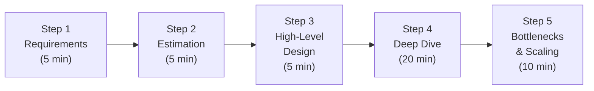

---

## Step 1: Requirements Clarification (5 minutes)

**Why this matters**: Google interviewers intentionally leave requirements vague to test whether you can scope a problem. Jumping to design without clarifying is the #1 mistake.

### Functional Requirements (What the system does)

Ask these questions:
- **Users**: Who are the users? How many? (e.g., "Is this a consumer product with 1B users or an internal tool for 10K?")
- **Core features**: What are the 3-5 must-have features? (e.g., "For a chat system: send message, receive message, group chat, read receipts -- which are day-1 vs later?")
- **Data model**: What data does the system store? What are the relationships?
- **APIs**: What does the API look like? REST? gRPC? WebSocket?

### Non-Functional Requirements (How the system behaves)

| Requirement | Question to Ask | Your Walmart/GCC Reference |
|-------------|----------------|---------------------------|
| **Scale** | "How many users? DAU? Requests per second?" | Walmart: 1,200+ suppliers, 2M events/day. GCC: 500K+ profiles, 10M events/day |
| **Latency** | "What's acceptable? P50? P99?" | Walmart: 3s P95 for audit. GCC: 2s for analytics queries, 5ms for cached lookups |
| **Availability** | "What's the target? 99.9%? 99.99%?" | Walmart: 99.99% with multi-region active/active |
| **Consistency** | "Strong consistency? Eventual OK?" | Walmart: Eventual for audit logs. GCC: Eventual for analytics, strong for transactions |
| **Durability** | "Can we lose data? Compliance needs?" | Walmart: 7 years retention for compliance (PIPEDA, LFPDPPP) |

### Template: Requirements Summary

```
Functional:
  - FR1: [Core feature]
  - FR2: [Core feature]
  - FR3: [Core feature]

Non-Functional:
  - Scale: X DAU, Y QPS
  - Latency: P99 < Z ms
  - Availability: 99.9X%
  - Consistency: [Strong/Eventual]
  - Storage: X TB over Y years
```

---

## Step 2: Back-of-Envelope Estimation (5 minutes)

**Why this matters**: Estimation drives architectural decisions. A system handling 100 QPS is radically different from one handling 100K QPS.

### Key Formulas

```
QPS (Queries Per Second):
  DAU x avg_queries_per_user / 86,400 seconds
  Peak QPS = avg QPS x 2-3

Storage:
  Daily new data = DAU x data_per_user_per_day
  Total storage = daily_data x retention_days x replication_factor

Bandwidth:
  Ingress = QPS x avg_request_size
  Egress = QPS x avg_response_size

Machines:
  Total QPS / QPS_per_machine = number of machines
  (Assume one machine can handle ~10K-50K simple QPS)
```

### Numbers Every Engineer Should Know (2024)

| Operation | Latency |
|-----------|---------|
| L1 cache reference | 0.5 ns |
| L2 cache reference | 7 ns |
| Main memory reference | 100 ns |
| SSD random read | 150 us |
| HDD seek | 10 ms |
| Send 1 KB over network (same datacenter) | 250 us |
| Read 1 MB sequentially from SSD | 1 ms |
| Read 1 MB sequentially from HDD | 20 ms |
| Send packet CA -> Netherlands -> CA | 150 ms |

| Storage Unit | Bytes |
|-------------|-------|
| 1 KB | 10^3 |
| 1 MB | 10^6 |
| 1 GB | 10^9 |
| 1 TB | 10^12 |
| 1 PB | 10^15 |

### Example: Anshul's Walmart Audit System Estimation

```
Given:
  - 1,200 suppliers making API calls
  - 6 microservices
  - Peak: ~120 events/sec (~2M events/day)

QPS:
  Average: 2,000,000 / 86,400 = ~23 events/sec
  Peak: 23 x 5 = ~120 events/sec

Storage (per day):
  Avg event size (Avro): ~2 KB
  Daily: 2M x 2KB = 4 GB/day
  With Parquet compression (90%): ~400 MB/day
  7 years: 400MB x 365 x 7 = ~1 TB total

Bandwidth:
  Ingress: 120 events/sec x 2KB = 240 KB/sec
  Kafka throughput: well within single partition capacity (10 MB/sec)
```

### Example: GCC Event Pipeline Estimation

```
Given:
  - 150+ scraping workers
  - 10M+ events/day across Instagram, YouTube, Shopify

QPS:
  Average: 10,000,000 / 86,400 = ~116 events/sec
  Peak: 116 x 3 = ~350 events/sec
  With 26 RabbitMQ queues: ~14 events/sec per queue (manageable)

Storage (per day):
  Avg event size (JSON): ~5 KB
  Daily raw: 10M x 5KB = 50 GB/day
  ClickHouse with LZ4 compression (5x): ~10 GB/day
  1 year retention: ~3.6 TB

Batch write optimization:
  Without batching: 116 INSERT/sec = 116 ClickHouse parts/sec (DISASTER)
  With batching (1000/batch): 0.116 INSERT/sec = ~7 parts/minute (healthy)
```

---

## Step 3: High-Level Design (5 minutes)

**What to draw**: Boxes and arrows. Clients, load balancers, application servers, databases, caches, message queues, CDN.

### Standard Web Architecture Template

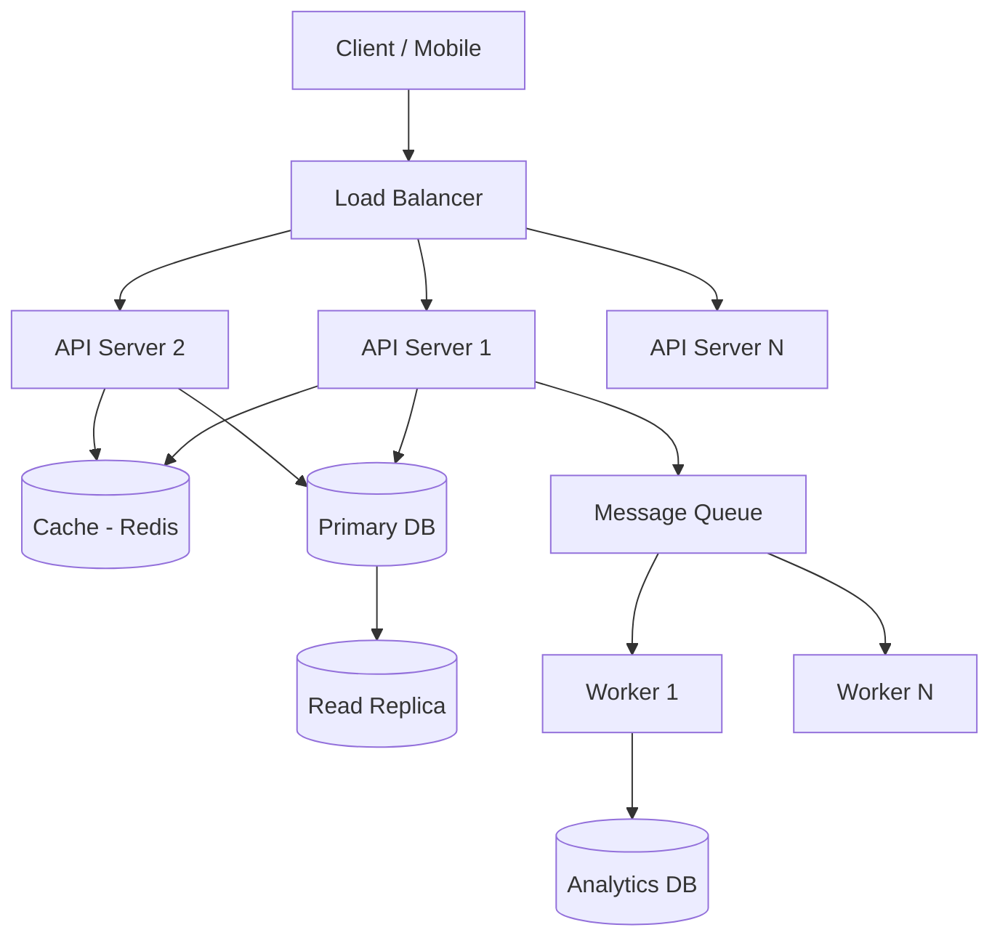

### Key Components to Always Consider

| Component | When to Use | Example from Your Work |
|-----------|------------|----------------------|
| **Load Balancer** | Always (even at small scale) | Walmart: Torbit API Gateway with round-robin. GCC: Nginx LB across cb1-1, cb2-1 |
| **API Gateway** | External-facing APIs with auth | Walmart: Torbit + OAuth 2.0. GCC: SaaS Gateway with 7-layer middleware |
| **Application Servers** | Stateless request processing | Walmart: Spring Boot pods (4-8 per service). GCC: Go Chi/Gin servers |
| **Cache** | Frequently read, rarely changed data | Walmart: N/A. GCC: Redis + Ristretto 2-layer cache (10M keys, 1GB) |
| **Database** | Persistent state | Walmart: PostgreSQL multi-tenant. GCC: PostgreSQL + ClickHouse dual-DB |
| **Message Queue** | Async processing, decoupling | Walmart: Kafka (audit pipeline). GCC: RabbitMQ (26 queues, 90+ workers) |
| **CDN** | Static assets, global distribution | GCC: CloudFront for media assets (8M images/day) |
| **Object Storage** | Large files, cheap long-term storage | Walmart: GCS Parquet files. GCC: AWS S3 media + data pipeline staging |

---

## Step 4: Deep Dive (20 minutes)

**This is where you win or lose.** The interviewer will pick 2-3 components and ask you to go deeper.

### Areas to Prepare for Deep Dive

1. **Database schema design** -- Table structure, indexes, partitioning
2. **API design** -- Endpoints, request/response format, pagination
3. **Data flow** -- How does data move through the system? What happens at each step?
4. **Consistency model** -- How do you handle concurrent writes? Conflicts?
5. **Failure handling** -- What if component X goes down?

### Deep Dive Template

```
Component: [Name]
Purpose: [What it does]
Interface: [API/Protocol]
Data Model: [Schema]
Scaling Strategy: [Horizontal/Vertical, sharding]
Failure Mode: [What happens when it fails]
Trade-offs: [What did you give up?]
```

---

## Step 5: Bottlenecks and Scaling (10 minutes)

### Identify Single Points of Failure

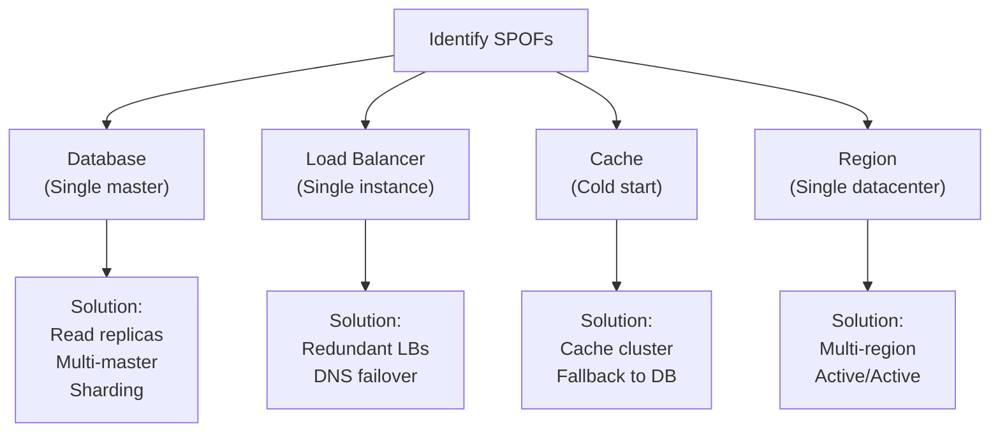

### Scaling Checklist

- [ ] Can the database handle 10x traffic? (Read replicas, sharding)
- [ ] Can the application servers handle 10x traffic? (Horizontal scaling, auto-scaling)
- [ ] Can the cache handle 10x traffic? (Cluster mode, consistent hashing)
- [ ] What happens during a deploy? (Rolling deployment, blue/green)
- [ ] What happens during a datacenter outage? (Multi-region failover)
- [ ] What happens during a traffic spike? (Rate limiting, circuit breaking)
- [ ] What's the monitoring strategy? (Metrics, alerts, dashboards)

---

# 2. Core Distributed Systems Concepts

## CAP Theorem

**Definition**: In a distributed system, you can only guarantee 2 of 3 properties during a network partition:
- **C**onsistency: Every read receives the most recent write
- **A**vailability: Every request receives a response (not an error)
- **P**artition tolerance: System continues operating despite network failures

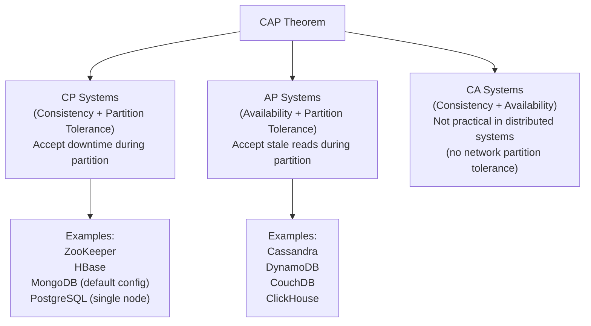

### CAP in Anshul's Work

| System | CAP Choice | Why |
|--------|-----------|-----|
| **Walmart PostgreSQL** (multi-tenant) | CP | Inventory data must be consistent. A supplier querying their inventory must see the latest state. Downtime during partition is preferable to stale data. |
| **Walmart Kafka Audit** | AP | Audit logs can tolerate brief inconsistency. During a Kafka cluster partition, we publish to the secondary region (eventual consistency). Losing availability would mean losing audit data. |
| **GCC ClickHouse** | AP | Analytics data (follower counts, engagement rates) can be slightly stale. ClickHouse's ReplacingMergeTree eventually merges duplicates. Availability is critical for the SaaS dashboard. |
| **GCC PostgreSQL** (transactional) | CP | Collection operations (add profile to collection) must be consistent. `FOR UPDATE SKIP LOCKED` relies on strong consistency for distributed task claiming. |

---

## Consistency Models

### Strong Consistency
Every read returns the most recent write. All nodes see the same data at the same time.

**How it works**: Write goes to leader, leader replicates to all followers before acknowledging.

**Cost**: Higher latency (wait for all replicas), lower availability during partitions.

**Example from your work**: PostgreSQL's `FOR UPDATE SKIP LOCKED` at GCC -- when a worker claims a task, all other workers immediately see it as locked.

### Eventual Consistency
Given enough time with no new updates, all replicas will converge to the same state.

**How it works**: Write goes to one node, eventually propagates to others.

**Cost**: Reads may return stale data.

**Example from your work**: Walmart's audit log pipeline -- when an event is published to Kafka, it may take seconds to reach GCS. BigQuery queries may briefly miss recent events.

### Causal Consistency
Operations that are causally related are seen in the same order by all nodes. Concurrent operations may be seen in different orders.

**How it works**: Uses vector clocks or logical timestamps to track causality.

**Example**: GCC's event pipeline -- profile_log events and post_log events for the same profile have a causal relationship. The profile crawl happens before the post crawl. ClickHouse sees them in order because they flow through the same RabbitMQ routing key.

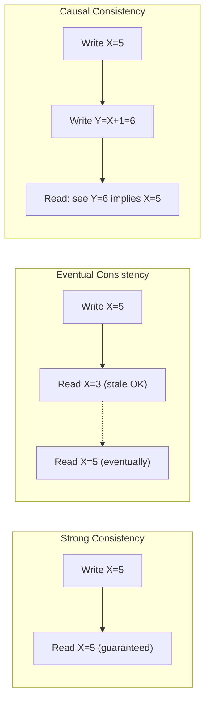

---

## Consensus Algorithms

### Raft (Simplified Paxos)

**Purpose**: Elect a leader and replicate state across a cluster of nodes.

**How it works**:
1. **Leader Election**: Nodes start as followers. If a follower doesn't hear from the leader (heartbeat timeout), it becomes a candidate and requests votes. Majority wins.
2. **Log Replication**: Leader receives writes, appends to its log, replicates to followers. Once a majority acknowledges, the entry is committed.
3. **Safety**: Only nodes with the most up-to-date log can become leader.

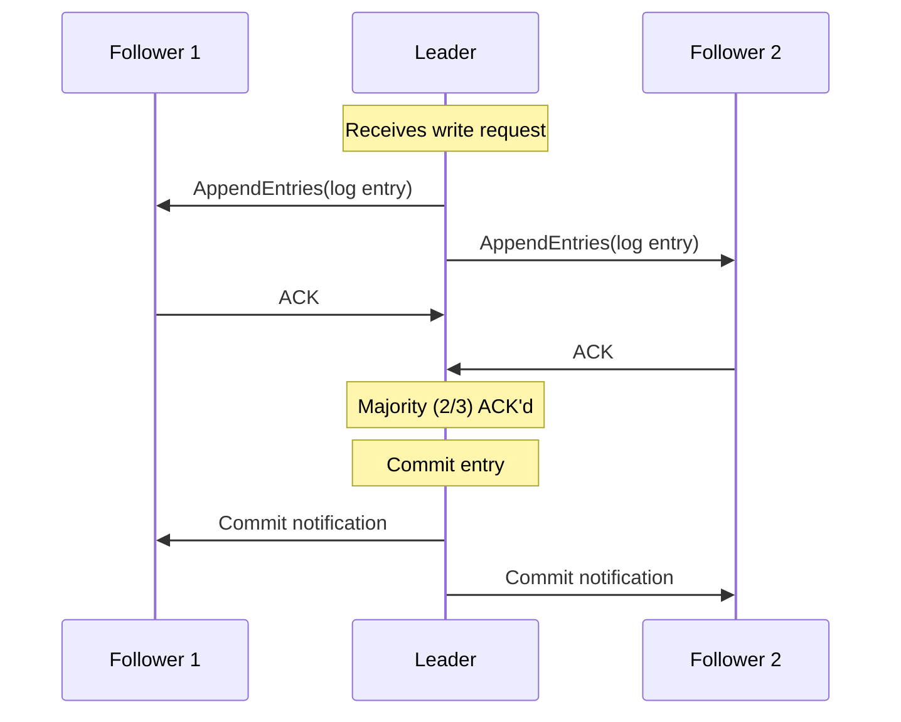

**Where it's used**: etcd (Kubernetes), Consul, CockroachDB, Kafka's KRaft mode.

### Paxos (Brief)

The original consensus algorithm. More general than Raft but harder to understand and implement. Raft was designed as "understandable Paxos."

**Key difference**: Paxos separates the roles of proposer, acceptor, and learner. Raft combines these into a simpler leader/follower model.

**Where it's used**: Google Spanner, Google Chubby lock service.

---

## Distributed Transactions

### Two-Phase Commit (2PC)

**Problem**: How do you ensure all nodes in a distributed system either all commit or all abort a transaction?

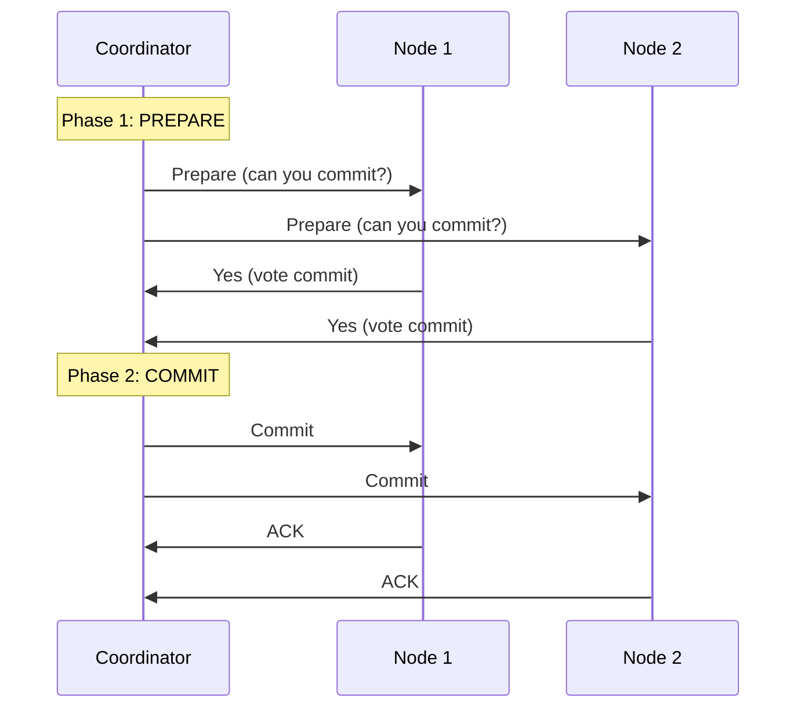

**Problem with 2PC**: Blocking protocol. If the coordinator crashes after Phase 1 but before Phase 2, all participants are stuck holding locks indefinitely.

**Where you'd mention it**: "For the Walmart multi-region Kafka publish, we considered 2PC to ensure both regions got the message, but the blocking nature was unacceptable. Instead, we used async replication with a fallback pattern."

### Saga Pattern

**Purpose**: Manage distributed transactions across microservices without 2PC.

**How it works**: Break the transaction into a sequence of local transactions. Each service completes its local transaction and publishes an event. If any step fails, execute compensating transactions to undo previous steps.

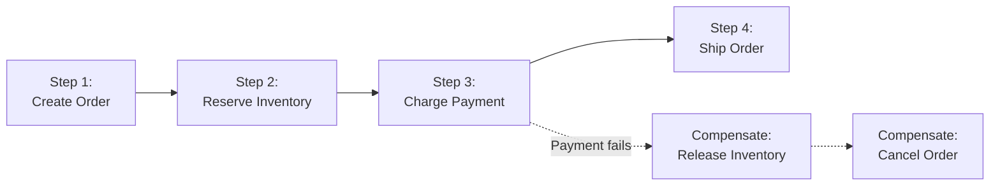

**Two approaches**:

| Approach | How | Pros | Cons |
|----------|-----|------|------|
| **Choreography** | Each service listens for events and decides what to do next | Decoupled, simple | Hard to track overall progress, debugging nightmares |
| **Orchestration** | A central orchestrator tells each service what to do | Easy to understand and monitor | Single point of failure, tighter coupling |

**From your work**: GCC's data pipeline uses choreography-style saga. Beat publishes events to RabbitMQ, Event-gRPC processes them, Stir transforms them. If the ClickHouse write fails, Event-gRPC retries (up to 2 times) then routes to an error exchange (dead letter queue) -- this is a compensating action.

---

## Idempotency and Exactly-Once Processing

### The Three Delivery Guarantees

| Guarantee | Definition | Example |
|-----------|-----------|---------|
| **At-most-once** | Message delivered 0 or 1 times. Fire-and-forget. | UDP packets. Walmart audit: if async HTTP POST to audit-api-logs-srv fails, the event is lost (acceptable for audit). |
| **At-least-once** | Message delivered 1 or more times. May have duplicates. | GCC's RabbitMQ pipeline: if consumer crashes after processing but before ACK, message is redelivered. |
| **Exactly-once** | Message delivered exactly 1 time. Hardest to achieve. | Kafka transactions + idempotent producer + consumer dedup. |

### Making Operations Idempotent

An operation is idempotent if performing it multiple times has the same effect as performing it once.

```
Idempotent:
  PUT /users/123 {"name": "Anshul"}  -- Always sets name to Anshul
  DELETE /users/123                    -- User is deleted regardless of how many times called
  SQL: INSERT ... ON CONFLICT DO UPDATE  -- Upsert is idempotent

NOT Idempotent:
  POST /users {"name": "Anshul"}     -- Creates a new user each time
  SQL: INSERT INTO ... VALUES (...)   -- Creates duplicate rows
  counter = counter + 1              -- Increments each time
```

**How GCC handles it**: ClickHouse's MergeTree stores duplicate events (same event_id), but downstream dbt models use `argMax(metric, event_timestamp)` to pick the latest value. This achieves effectively-once semantics without the complexity of exactly-once processing.

**How Walmart handles it**: The audit log payload includes a `request_id` (UUID). If the same audit event is published twice to Kafka, the GCS sink writes both, and BigQuery queries can deduplicate by request_id.

### Exactly-Once Pattern: Idempotent Consumer + Deduplication

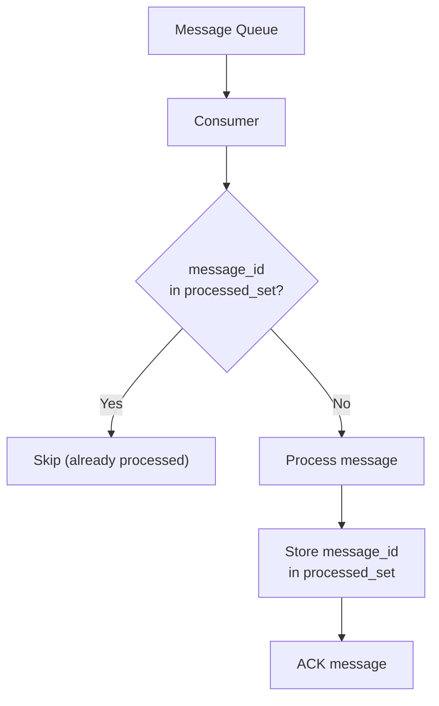

---

## Leader Election

**Purpose**: Ensure only one node in a cluster is performing a specific task (writes, coordination, etc.)

### Approaches

| Method | How | Used By |
|--------|-----|---------|
| **ZooKeeper** | Ephemeral znodes + watchers | Kafka (pre-KRaft), HBase, Solr |
| **Raft** | Term-based voting | etcd, Consul |
| **Database Lock** | `SELECT FOR UPDATE` or advisory locks | GCC Beat: `FOR UPDATE SKIP LOCKED` for task claiming |
| **Redis RedLock** | Distributed lock across Redis nodes | Distributed task scheduling |

**From your work**: GCC's `FOR UPDATE SKIP LOCKED` is effectively leader election per task. Only one worker "wins" each task. If the worker crashes, PostgreSQL releases the lock automatically.

---

## Consistent Hashing

**Problem**: When you add or remove a server, a simple hash (`key % num_servers`) remaps almost every key.

**Solution**: Map both keys and servers to positions on a ring. Each key is assigned to the next server clockwise.

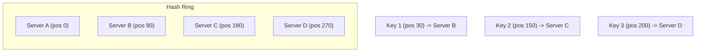

**When Server C is removed**: Only keys between B and C move to D. All other keys stay.

**Virtual nodes**: Each server gets multiple positions on the ring to ensure even distribution.

**Where it's used**: DynamoDB, Cassandra, CDN routing, distributed caches.

**From your work**: Walmart's Kafka topic partitioning uses hashing (key: `service_name|endpoint_name`) to assign messages to partitions. When partitions are added, only some messages remap.

---

## Sharding Strategies

### Range-Based Sharding
Divide data by key ranges. Example: Users A-M on shard 1, N-Z on shard 2.

**Pros**: Range queries are efficient. **Cons**: Hotspots (popular ranges get more traffic).

### Hash-Based Sharding
Hash the key and assign to shard. Example: `shard = hash(user_id) % num_shards`.

**Pros**: Even distribution. **Cons**: Range queries require scatter-gather across all shards.

### Directory-Based Sharding
A lookup table maps each key to its shard.

**Pros**: Flexible, can rebalance without rehashing. **Cons**: Lookup table is a SPOF.

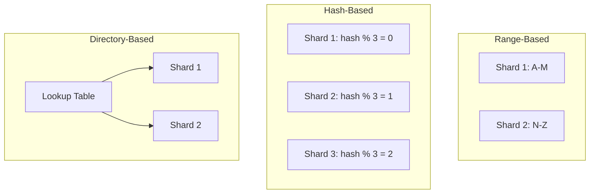

**From your work**: Walmart's multi-tenant architecture uses directory-based sharding by `site_id` (1=US, 2=CA, 3=MX). The `SiteConfigFactory` is the directory that maps site_id to the correct database partition and API endpoint.

---

## Replication: Sync vs Async

### Synchronous Replication
Write is acknowledged only after all replicas confirm.

**Pros**: Strong consistency. **Cons**: Higher latency, lower availability (one slow replica blocks everything).

### Asynchronous Replication
Write is acknowledged after the primary commits. Replicas catch up later.

**Pros**: Low latency, high availability. **Cons**: Possible data loss if primary crashes before replication.

### Quorum-Based Replication
Write succeeds when W out of N replicas acknowledge. Read succeeds when R out of N replicas respond. Consistency guaranteed when W + R > N.

```
Example (N=3 replicas):
  W=2, R=2: Strong consistency (W+R=4 > 3). Every read overlaps with latest write.
  W=1, R=1: Eventual consistency. Fast but may read stale data.
  W=3, R=1: Write is slow (wait for all), but reads are fast.
```

**From your work**: Walmart's Kafka topics use `replication-factor: 3`. The producer publishes with `acks=all` (equivalent to W=3), ensuring no data loss. The GCS sink consumer reads from any replica (R=1), giving fast reads with strong durability.

---

## Vector Clocks and Conflict Resolution

**Problem**: In a distributed system with no central clock, how do you determine the order of events?

### Vector Clocks
Each node maintains a vector of logical timestamps, one per node. When an event occurs, the node increments its own clock. When sending a message, the node attaches its current vector. On receiving, the node takes the element-wise maximum.

```
Node A: [A:1, B:0]  -- A did 1 event
Node B: [A:0, B:1]  -- B did 1 event
After A sends to B:  B updates to [A:1, B:2]  -- B knows about A's event
```

**Conflict detection**: If two vectors are incomparable (neither is element-wise >= the other), the events are concurrent and need resolution.

**Conflict resolution strategies**:
- **Last-writer-wins** (LWW): Use timestamp; simple but lossy
- **Application-level merge**: Let the application decide (e.g., CRDTs)
- **Multi-value**: Return both versions to the client (Dynamo-style)

**From your work**: GCC's ClickHouse uses `ReplacingMergeTree` with `argMax(value, event_timestamp)` -- effectively a last-writer-wins strategy. When duplicate profile_log events arrive, the one with the latest timestamp wins.

---

# 3. Scalability Patterns

## Horizontal vs Vertical Scaling

| Aspect | Vertical Scaling (Scale Up) | Horizontal Scaling (Scale Out) |
|--------|---------------------------|-------------------------------|
| What | Add more CPU/RAM to one machine | Add more machines |
| Cost | Exponential (bigger machines cost disproportionately more) | Linear (each machine costs the same) |
| Limit | Physical hardware limits | Theoretically unlimited |
| Complexity | Simple (no distributed system concerns) | Complex (data partitioning, consistency) |
| Downtime | Usually requires restart | Zero downtime (add nodes without stopping) |
| Example | GCC: Increasing ClickHouse server memory | Walmart: Adding more K8s pods (HPA from 4 to 8) |

---

## Database Sharding

### Range Sharding
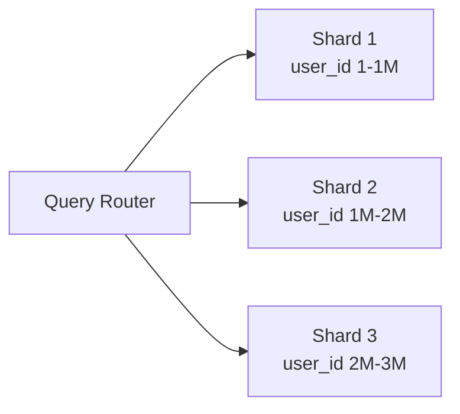

### Hash Sharding
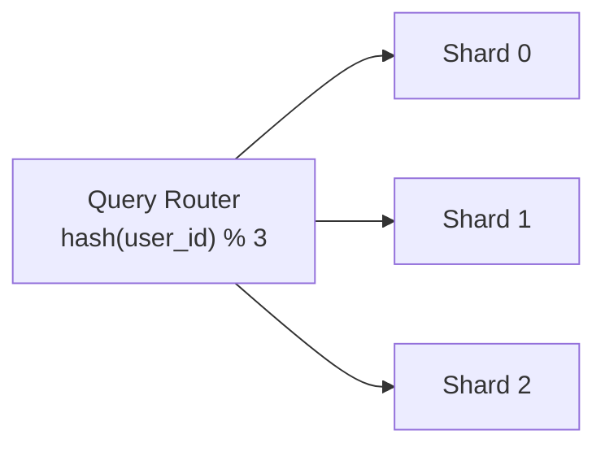

### Directory Sharding (Walmart's Approach)
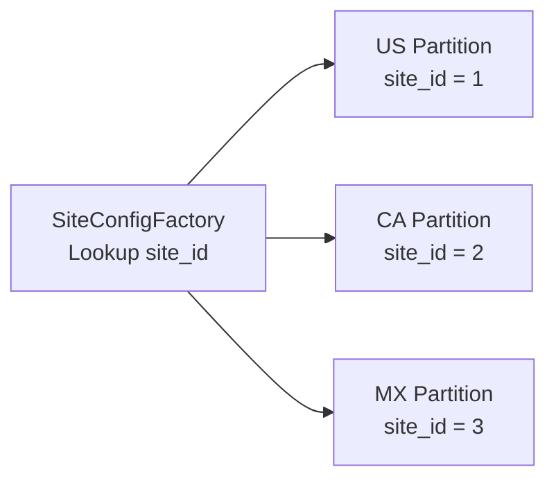

---

## Read Replicas

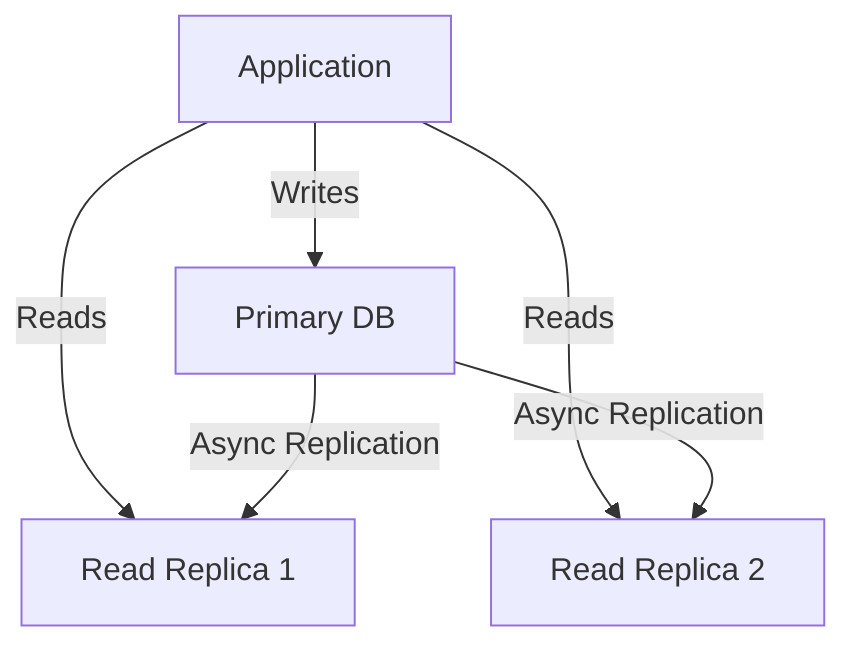

**When to use**: Read-heavy workloads (90%+ reads). Reporting queries. Geographically distributed reads.

**Caveat**: Replication lag means reads may be stale. Use primary for reads-after-writes when consistency matters.

---

## Caching Strategies

### Cache-Aside (Lazy Loading)

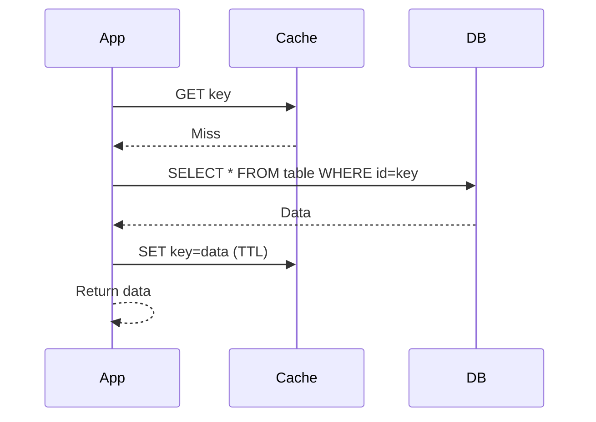

**Pros**: Only requested data is cached. Cache failure doesn't break the system.
**Cons**: Cache miss penalty (3 calls). Stale data until TTL expires.

**From your work**: GCC's SaaS Gateway uses cache-aside with 2 layers -- Ristretto (L1, in-memory, 10M keys) and Redis (L2, shared). On cache miss, it hits the auth service and caches the result.

### Write-Through

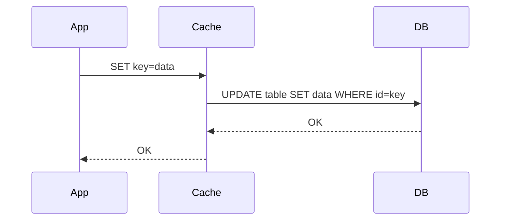

**Pros**: Cache is always consistent with DB. **Cons**: Higher write latency (double write). Caches data that may never be read.

### Write-Back (Write-Behind)

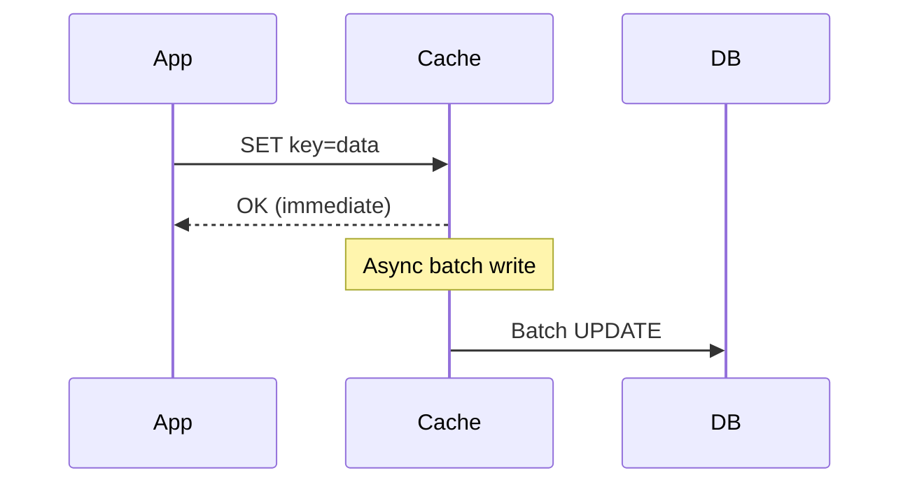

**Pros**: Very fast writes. Batch writes to DB are efficient. **Cons**: Data loss risk if cache crashes before flushing.

**From your work**: GCC's buffered sinker pattern is essentially write-back caching. Events are written to an in-memory buffer (the Go channel + slice), and periodically flushed to ClickHouse in batches.

### Write-Around

Writes go directly to DB, bypassing cache. Cache is populated only on reads (cache-aside for reads).

**Pros**: Cache not polluted with data that isn't read. **Cons**: Cache misses for recently written data.

---

## CDN (Content Delivery Network)

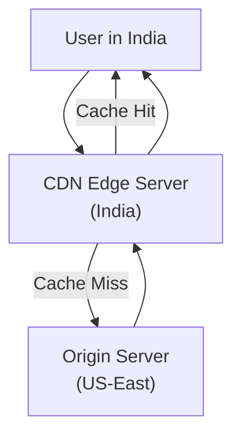

**From your work**: GCC uses CloudFront CDN for media assets (profile pictures, post thumbnails). Beat uploads to S3, CloudFront distributes globally. 8M+ images/day flow through this pipeline.

---

## Message Queues for Async Processing

### When to Use

1. **Decoupling**: Producer doesn't need to know about consumer
2. **Buffering**: Absorb traffic spikes
3. **Async processing**: Don't block the user's request
4. **Fan-out**: One event triggers multiple actions

### Kafka vs RabbitMQ (From Your Work)

| Feature | Kafka (Walmart) | RabbitMQ (GCC) |
|---------|----------------|----------------|
| **Model** | Distributed log (append-only) | Message broker (queue-based) |
| **Ordering** | Per-partition ordering | Per-queue FIFO |
| **Retention** | Time-based (7 days at Walmart) | Until consumed + ACK'd |
| **Consumer model** | Consumer groups with offsets | Per-consumer ACK |
| **Replay** | Yes (rewind offsets) | No (once ACK'd, gone) |
| **Scale** | Horizontal (add partitions) | Vertical (bigger queues) |
| **Use case** | Event sourcing, audit logs, streaming | Task queues, RPC, pub/sub |
| **Why chosen** | Durability for compliance, multi-region replication | Simpler per-message ACK, exchange routing, DLQ |

---

## CQRS and Event Sourcing

### CQRS (Command Query Responsibility Segregation)

Separate the read model from the write model. Writes go to one store optimized for writes, reads go to another store optimized for reads.

```mermaid
graph LR
    subgraph "Write Side"
        Cmd["Command"] --> WS["Write Store\n(PostgreSQL)"]
    end

    subgraph "Sync"
        WS -->|Events| MQ["Message Queue"]
        MQ --> Sync["Sync Process"]
    end

    subgraph "Read Side"
        Sync --> RS["Read Store\n(ClickHouse)"]
        Query["Query"] --> RS
    end
```

**From your work (GCC)**: This is exactly the dual-database architecture.
- **Write side**: Beat writes raw profile/post data to PostgreSQL (optimized for CRUD with GORM ORM)
- **Sync**: Events flow through RabbitMQ to Event-gRPC, then Stir/dbt transforms and syncs back
- **Read side**: Coffee reads analytics from ClickHouse (optimized for aggregation queries), serving data to the SaaS dashboard

### Event Sourcing

Instead of storing the current state, store a log of all events. Current state is derived by replaying events.

```
Traditional: users table has {id: 1, name: "Anshul", balance: 500}
Event Sourced: events table has:
  {event: "AccountCreated", data: {id: 1, name: "Anshul"}}
  {event: "DepositMade", data: {amount: 1000}}
  {event: "WithdrawalMade", data: {amount: 500}}
Current state = replay all events = balance of 500
```

---

## Rate Limiting Algorithms

### Token Bucket

```
Bucket has capacity of N tokens.
Tokens are added at rate R per second.
Each request consumes 1 token.
If bucket is empty, request is rejected.
```

**Pros**: Allows bursts (up to bucket capacity). Smooth rate limiting.
**From your work**: Walmart's Istio sidecar uses token bucket -- 75 tokens, refilled 75/second per pod.

### Sliding Window Log

```
Store timestamp of every request in a sorted set.
For each new request:
  1. Remove timestamps older than (now - window_size)
  2. Count remaining timestamps
  3. If count < limit, allow request and add timestamp
  4. Else reject
```

**Pros**: Precise rate limiting. **Cons**: Memory-intensive (stores every timestamp).

### Sliding Window Counter

Hybrid of fixed window and sliding window. Use counters for the current and previous window, weighted by overlap.

```
Window size: 1 minute
Previous window (0:00-1:00): 42 requests
Current window (1:00-2:00): 18 requests (so far)
Current time: 1:15 (25% into current window)

Weighted count = 42 * (1 - 0.25) + 18 = 31.5 + 18 = 49.5
If limit is 50, allow (49.5 < 50)
```

### From Your Work: GCC's 3-Level Stacked Rate Limiting

```python
# beat/server.py -- Three nested rate limiters
async with RateLimiter(unique_key="global_daily", rate_spec="20000/day"):
    async with RateLimiter(unique_key="global_minute", rate_spec="60/minute"):
        async with RateLimiter(unique_key=f"handle_{handle}", rate_spec="1/second"):
            response = await make_api_call(handle)
```

---

## Load Balancing Algorithms

| Algorithm | How | When to Use |
|-----------|-----|------------|
| **Round Robin** | Rotate through servers sequentially | Equal capacity servers |
| **Weighted Round Robin** | More traffic to higher-capacity servers | Mixed hardware |
| **Least Connections** | Route to server with fewest active connections | Long-lived connections |
| **IP Hash** | Hash client IP to determine server | Session stickiness |
| **Random** | Pick a random server | Simple, surprisingly effective |
| **Consistent Hashing** | Hash ring for cache servers | Distributed caches |

**From your work**: Walmart uses Kubernetes ClusterIP with round-robin across pods. GCC uses Nginx load balancer across cb1-1 and cb2-1 application nodes.

---

# 4. Common System Design Problems

## Design 1: URL Shortener

### Requirements

**Functional**: Create short URL, redirect to long URL, custom aliases, analytics (click count), expiration.
**Non-functional**: 100M URLs/day created, 10:1 read:write ratio, P99 < 100ms redirect, 99.99% availability.

### Estimation

```
Writes: 100M/day = ~1,200/sec
Reads: 1B/day = ~12,000/sec
Storage: 100M URLs/day x 500 bytes = 50 GB/day, 18 TB/year
URL length: 7 characters (base62) = 62^7 = 3.5 trillion combinations
```

### Architecture

```mermaid
graph TD
    Client["Client"] --> LB["Load Balancer"]
    LB --> API["API Servers\n(Stateless)"]
    API --> Cache["Redis Cache\n(Hot URLs)"]
    Cache -->|Miss| DB["Database\n(URL mappings)"]
    API --> Counter["ID Generator\n(Distributed)"]

    subgraph "Analytics Pipeline"
        API --> MQ["Kafka"]
        MQ --> Analytics["Analytics Service"]
        Analytics --> TSDB["ClickHouse\n(Click analytics)"]
    end
```

### Deep Dive: Key Generation

**Approach 1: Base62 encoding of auto-increment ID**
- Use a distributed ID generator (Snowflake)
- Convert to base62: `a-z, A-Z, 0-9`
- 7 chars = 3.5T unique URLs
- Pros: No collision. Cons: Predictable (sequential).

**Approach 2: MD5/SHA256 hash + truncate**
- Hash the long URL, take first 7 chars
- Handle collisions: append counter or re-hash
- Pros: Same URL always gets same short URL. Cons: Collision handling.

### Deep Dive: Redirect Flow

```mermaid
sequenceDiagram
    participant C as Client
    participant LB as Load Balancer
    participant API as API Server
    participant R as Redis
    participant DB as Database

    C->>LB: GET /abc1234
    LB->>API: Route request
    API->>R: GET abc1234
    R-->>API: Cache HIT: https://long-url.com
    API-->>C: 301 Redirect to https://long-url.com
```

---

## Design 2: Twitter/Instagram Feed

### Requirements

**Functional**: Post content, follow users, news feed (timeline), likes, comments.
**Non-functional**: 500M DAU, 10K followers avg, P99 < 200ms feed load, eventual consistency OK.

### Estimation

```
Feed generation: 500M DAU x 10 feed loads/day = 5B feed requests/day = ~58K/sec
Posts: 500M DAU x 2 posts/day = 1B posts/day
Fanout: avg user has 200 followers -> 1B posts x 200 = 200B fanout operations/day
Storage: 1B posts x 1KB = 1 TB/day
```

### Architecture

```mermaid
graph TD
    Client["Client"] --> LB["Load Balancer"]
    LB --> API["API Servers"]

    subgraph "Write Path"
        API -->|"Post"| PostSvc["Post Service"]
        PostSvc --> PostDB["Post DB\n(Sharded by user_id)"]
        PostSvc --> Fanout["Fanout Service"]
        Fanout --> MQ["Message Queue"]
        MQ --> FeedWorker["Feed Workers"]
        FeedWorker --> FeedCache["Feed Cache\n(Redis sorted sets)"]
    end

    subgraph "Read Path"
        API -->|"Get Feed"| FeedSvc["Feed Service"]
        FeedSvc --> FeedCache
        FeedSvc --> PostDB
    end
```

### Deep Dive: Fan-out on Write vs Fan-out on Read

**Fan-out on Write** (push model):
When a user posts, immediately write to all followers' feed caches.
- Pros: Fast reads (feed is pre-computed)
- Cons: Expensive for users with millions of followers (celebrity problem)

**Fan-out on Read** (pull model):
When a user opens their feed, fetch latest posts from all followed users.
- Pros: No write amplification
- Cons: Slow reads (must query many users)

**Hybrid** (Twitter's approach):
- Normal users: fan-out on write
- Celebrities (>10K followers): fan-out on read
- Feed = precomputed cache UNION celebrity posts

---

## Design 3: Chat System (WhatsApp)

### Requirements

**Functional**: 1:1 messaging, group chat (up to 500), online/offline status, read receipts, message history.
**Non-functional**: 2B users, P99 < 100ms delivery, messages never lost, end-to-end encryption.

### Architecture

```mermaid
graph TD
    UserA["User A"] <-->|WebSocket| GW1["Gateway Server 1"]
    UserB["User B"] <-->|WebSocket| GW2["Gateway Server 2"]

    GW1 --> MS["Message Service"]
    GW2 --> MS
    MS --> MQ["Message Queue\n(Kafka)"]
    MQ --> GW2

    MS --> DB["Message DB\n(Cassandra)"]
    MS --> SessionStore["Session Store\n(Redis)\nUser -> Gateway mapping"]

    subgraph "Offline Support"
        MQ --> Push["Push Notification\nService"]
    end
```

### Deep Dive: Message Delivery

```mermaid
sequenceDiagram
    participant A as User A
    participant GW1 as Gateway 1
    participant MS as Message Service
    participant Redis as Session Store
    participant GW2 as Gateway 2
    participant B as User B

    A->>GW1: Send message (WebSocket)
    GW1->>MS: Store message
    MS->>MS: Save to Cassandra
    MS->>Redis: Lookup User B's gateway
    Redis-->>MS: Gateway 2
    MS->>GW2: Route message
    GW2->>B: Deliver message (WebSocket)
    B->>GW2: ACK (delivered)
    GW2->>MS: Message delivered
    MS->>GW1: Delivery receipt
    GW1->>A: Delivered checkmark
```

### Deep Dive: Group Chat

For groups up to 500 members, use a **message fanout** approach:
1. Message is stored once in the group's message table
2. For each online member, the message is pushed via their WebSocket connection
3. For offline members, a push notification is sent
4. Members fetch missed messages on reconnect using a cursor-based pagination

---

## Design 4: Notification System

### Requirements

**Functional**: Push notifications (iOS/Android), SMS, email. Priority levels. Rate limiting. Templates. Opt-out.
**Non-functional**: 10M notifications/day, P99 < 30s for push, at-least-once delivery.

### Architecture

```mermaid
graph TD
    Trigger["Event Triggers\n(Order placed, etc.)"] --> NS["Notification Service"]
    NS --> PQ["Priority Queue\n(High/Medium/Low)"]

    PQ --> PushWorker["Push Worker"]
    PQ --> SMSWorker["SMS Worker"]
    PQ --> EmailWorker["Email Worker"]

    PushWorker --> APNS["Apple APNS"]
    PushWorker --> FCM["Google FCM"]
    SMSWorker --> Twilio["Twilio"]
    EmailWorker --> SES["AWS SES"]

    NS --> DB["Notification DB\n(Status tracking)"]
    NS --> UserPrefs["User Preferences\n(Opt-in/out, channels)"]
    NS --> Templates["Template Service"]
    NS --> RateLimiter["Rate Limiter\n(Per user, per channel)"]
```

### Deep Dive: Reliability

**Problem**: What if APNS is down? What if a worker crashes mid-send?

**Solution**: Use a transactional outbox pattern:
1. Write notification to DB with status `PENDING`
2. Worker picks up `PENDING` notifications
3. Sends to provider (APNS/FCM)
4. Updates status to `SENT` or `FAILED`
5. Retry `FAILED` with exponential backoff
6. After N retries, mark as `DEAD` and alert

**From your work**: This is exactly the pattern in Walmart's audit logging. The `@Async` audit log call is fire-and-forget, but the Kafka producer has retry logic. GCC's `scrape_request_log` table with `PENDING/PROCESSING/COMPLETE/FAILED` statuses is this exact pattern.

---

## Design 5: Rate Limiter

### Requirements

**Functional**: Limit requests per client per time window. Different limits for different API tiers. Return 429 when exceeded.
**Non-functional**: Sub-millisecond decision time. Distributed (works across multiple servers). Highly available.

### Architecture

```mermaid
graph TD
    Client["Client Request"] --> LB["Load Balancer"]
    LB --> RL["Rate Limiter\nMiddleware"]
    RL -->|"Check"| Redis["Redis Cluster\n(Counters/Buckets)"]
    Redis -->|"Allowed"| API["API Server"]
    Redis -->|"Rejected"| R429["HTTP 429\nToo Many Requests"]

    subgraph "Rules Engine"
        Rules["Rate Limit Rules DB"]
        Rules --> RL
    end
```

### Deep Dive: Sliding Window Counter in Redis

```
Key: rate_limit:{client_id}:{window_start}
Operations:
  1. INCR current window counter
  2. GET previous window counter
  3. Calculate weighted sum
  4. Compare against limit
  5. EXPIRE keys after 2x window

All operations are atomic using Redis Lua script.
```

**From your work**: Walmart API Gateway uses sliding window rate limiting at 900 TPM per consumer. GCC Beat uses Redis-backed rate limiting with 3 stacked levels and per-source rate specs.

---

## Design 6: Distributed Cache

### Requirements

**Functional**: GET/SET/DELETE operations. TTL support. Eviction policies. Cluster mode.
**Non-functional**: Sub-millisecond latency. 10M+ operations/sec. 99.99% availability. Horizontal scaling.

### Architecture

```mermaid
graph TD
    Client["Client"] --> Router["Consistent Hash Router"]
    Router --> N1["Cache Node 1\nKeys: A-H"]
    Router --> N2["Cache Node 2\nKeys: I-P"]
    Router --> N3["Cache Node 3\nKeys: Q-Z"]

    N1 --> R1["Replica 1A"]
    N2 --> R2["Replica 2A"]
    N3 --> R3["Replica 3A"]
```

### Deep Dive: Eviction Policies

| Policy | How | When |
|--------|-----|------|
| **LRU** (Least Recently Used) | Evict the key that hasn't been accessed longest | General purpose |
| **LFU** (Least Frequently Used) | Evict the key accessed fewest times | Hot data stays |
| **TTL** (Time To Live) | Evict after expiration time | Session data |
| **Random** | Evict random key | When LRU overhead is too high |

**From your work**: GCC's Ristretto cache (L1) uses a TinyLFU admission policy -- new items must prove they'll be accessed frequently before being admitted to the cache. This prevents cache pollution.

---

## Design 7: Kafka-Like Message Queue

### Requirements

**Functional**: Publish messages to topics. Subscribe with consumer groups. Ordered within partition. At-least-once delivery. Message retention.
**Non-functional**: 1M messages/sec throughput. Sub-10ms publish latency. 99.99% durability.

### Architecture

```mermaid
graph TD
    Producer["Producers"] --> Broker1["Broker 1\n(Leader: P0, P1)"]
    Producer --> Broker2["Broker 2\n(Leader: P2, P3)"]
    Producer --> Broker3["Broker 3\n(Leader: P4, P5)"]

    Broker1 <-->|Replication| Broker2
    Broker2 <-->|Replication| Broker3
    Broker1 <-->|Replication| Broker3

    Broker1 --> CG1["Consumer Group 1"]
    Broker2 --> CG1
    Broker3 --> CG1

    Broker1 --> CG2["Consumer Group 2"]
    Broker2 --> CG2

    ZK["ZooKeeper / KRaft\n(Metadata, Leader Election)"] --> Broker1
    ZK --> Broker2
    ZK --> Broker3
```

### Deep Dive: Partition and Replication

```mermaid
graph TD
    subgraph "Topic: audit-logs (6 partitions, RF=3)"
        subgraph "Partition 0"
            P0L["Broker 1 (Leader)"]
            P0F1["Broker 2 (Follower)"]
            P0F2["Broker 3 (Follower)"]
        end
        subgraph "Partition 1"
            P1L["Broker 2 (Leader)"]
            P1F1["Broker 1 (Follower)"]
            P1F2["Broker 3 (Follower)"]
        end
    end
```

**From your work**: Walmart's audit logging uses Kafka with 12 partitions, replication factor 3, across 2 regions (EUS2, SCUS). Messages are keyed by `service_name|endpoint_name` for partition assignment.

---

## Design 8: Log Aggregation System

> **This is Anshul's home turf.** This is literally what was built at Walmart.

### Requirements

**Functional**: Collect logs from multiple services. Filter and route by metadata. Store in columnar format. Query with SQL. Multi-region support. Data residency compliance.
**Non-functional**: 2M+ events/day (Walmart scale) to 10M+ events/day (GCC scale). P95 ingestion latency < 5s. 7-year retention. 99.9% availability.

### Estimation

```
Events: 2M/day = ~23/sec average, ~120/sec peak
Event size: 2 KB (Avro)
Daily storage: 2M x 2KB = 4 GB raw, ~400 MB compressed (Parquet)
7-year storage: ~1 TB
Kafka throughput: 120 events/sec x 2KB = 240 KB/sec (trivial for Kafka)
```

### Architecture (Based on Walmart's Actual System)

```mermaid
graph TD
    subgraph "Tier 1: Collection"
        S1["Service 1\n(cp-nrti-apis)"] --> LF["Logging Filter\n(dv-api-common-libraries)"]
        S2["Service 2\n(inventory-status)"] --> LF
        S3["Service N"] --> LF
        LF -->|"@Async HTTP POST"| ALS["Audit Log Service\n(audit-api-logs-srv)"]
    end

    subgraph "Tier 2: Streaming"
        ALS -->|"Avro + Headers"| K["Kafka\n(Multi-Region)\nEUS2 + SCUS"]
    end

    subgraph "Tier 3: Storage & Query"
        K --> KC1["Kafka Connect\nUS Connector\n(Permissive Filter)"]
        K --> KC2["Kafka Connect\nCA Connector\n(Strict Filter)"]
        K --> KC3["Kafka Connect\nMX Connector\n(Strict Filter)"]

        KC1 --> GCS1["GCS Bucket US\n(Parquet)"]
        KC2 --> GCS2["GCS Bucket CA\n(Parquet)"]
        KC3 --> GCS3["GCS Bucket MX\n(Parquet)"]

        GCS1 --> BQ["BigQuery\n(SQL Analytics)"]
        GCS2 --> BQ
        GCS3 --> BQ
    end
```

### Deep Dive: Why 3 Separate Connectors?

**Data residency compliance**: Canadian data (PIPEDA) and Mexican data (LFPDPPP) must not co-mingle with US data. Each connector uses a Single Message Transform (SMT) filter that inspects the `wm-site-id` Kafka header.

| Connector | Filter Logic | Bucket |
|-----------|-------------|--------|
| US | Accept if `wm-site-id = "US"` OR header missing (permissive, catches legacy data) | audit-api-logs-us-prod |
| CA | Accept ONLY if `wm-site-id = "CA"` (strict) | audit-api-logs-ca-prod |
| MX | Accept ONLY if `wm-site-id = "MX"` (strict) | audit-api-logs-mx-prod |

### Deep Dive: Why Parquet over JSON?

| Format | Compression | Query Speed | BigQuery Compat | Cost |
|--------|------------|-------------|-----------------|------|
| JSON | ~30% | Slow (row scan) | Text parsing | High |
| Avro | ~60% | Medium | Good | Medium |
| Parquet | ~90% | Fast (columnar, predicate pushdown) | Native | Low |

Parquet chosen because: columnar storage aligns with analytics query patterns (SELECT specific columns across millions of rows), compression saves 90% on GCS storage costs, and BigQuery has native Parquet support.

---

# 5. Event-Driven Architecture

## What is EDA? Why Use It?

**Event-Driven Architecture** is a pattern where components communicate by producing and consuming events, rather than direct API calls.

```mermaid
graph LR
    subgraph "Request-Driven (Traditional)"
        A1["Service A"] -->|"HTTP Call"| B1["Service B"]
        B1 -->|"HTTP Call"| C1["Service C"]
    end

    subgraph "Event-Driven"
        A2["Service A"] -->|"Publish Event"| MQ["Message Broker"]
        MQ -->|"Subscribe"| B2["Service B"]
        MQ -->|"Subscribe"| C2["Service C"]
    end
```

### Why Use EDA?

| Benefit | Explanation | Example from Your Work |
|---------|------------|----------------------|
| **Decoupling** | Producers don't know about consumers | GCC Beat doesn't know about ClickHouse. It just publishes to RabbitMQ. |
| **Scalability** | Add consumers without changing producers | Adding a new sinker in Event-gRPC requires zero changes to Beat |
| **Resilience** | If consumer is down, messages queue up | When ClickHouse was slow at GCC, RabbitMQ buffered messages |
| **Extensibility** | New features subscribe to existing events | GCC: Adding WebEngage forwarding was just a new RabbitMQ consumer |

---

## Event Sourcing vs Event-Driven

| Aspect | Event-Driven | Event Sourcing |
|--------|-------------|----------------|
| **Core idea** | Services communicate via events | Store state as a sequence of events |
| **State storage** | Current state in DB | Event log IS the database |
| **History** | Events may be discarded after processing | All events kept forever |
| **Rebuild state** | Cannot rebuild from events alone | Replay events to rebuild any state |
| **Example** | GCC: Profile crawl event triggers ClickHouse write | Bank: Account balance = sum of all deposit/withdrawal events |

---

## Saga Pattern Deep Dive

### Choreography (What GCC Uses)

```mermaid
sequenceDiagram
    participant Beat as Beat (Scraper)
    participant RMQ as RabbitMQ
    participant EGRPC as Event-gRPC
    participant CH as ClickHouse
    participant Stir as Stir (Airflow)
    participant PG as PostgreSQL

    Beat->>RMQ: Publish profile_log event
    RMQ->>EGRPC: Deliver to profile_log_events_q
    EGRPC->>EGRPC: Buffer in Go channel
    EGRPC->>CH: Batch INSERT (1000 records)

    Note over Stir: Every 15 minutes
    Stir->>CH: dbt run (transform data)
    Stir->>PG: Sync leaderboard (atomic swap)

    Note over Beat: If RMQ publish fails
    Beat->>Beat: Log error, continue (at-most-once)

    Note over EGRPC: If CH insert fails
    EGRPC->>EGRPC: Retry batch
    EGRPC->>RMQ: Route to error exchange after 2 retries
```

### Orchestration (Walmart's DSD Notification System)

```mermaid
sequenceDiagram
    participant Orch as Orchestrator
    participant Inv as Inventory Service
    participant Notify as Notification Service
    participant DB as Database

    Orch->>Inv: Check inventory status
    Inv-->>Orch: Inventory data
    Orch->>DB: Save audit log
    Orch->>Notify: Send push notification (SUMO)
    Notify-->>Orch: Notification sent
    Orch->>DB: Update status
```

---

## CQRS Deep Dive (GCC's Actual Implementation)

```mermaid
graph TD
    subgraph "Command Side (Writes)"
        BeatAPI["Beat: Scrape API"] --> PG1["PostgreSQL\n(instagram_account,\nyoutube_account)"]
        CoffeeWrite["Coffee: Collection CRUD"] --> PG1
    end

    subgraph "Event Bridge"
        BeatAPI -->|"publish()"| RMQ["RabbitMQ\n(beat.dx exchange)"]
        RMQ --> EGRPC["Event-gRPC\n(26 consumers)"]
    end

    subgraph "Query Side (Reads)"
        EGRPC -->|"Batch INSERT"| CH["ClickHouse\n(profile_log, post_log,\n18+ event tables)"]
        CH --> Stir["Stir/dbt\n(112 models: staging + marts)"]
        Stir -->|"S3 -> SSH -> COPY"| PG2["PostgreSQL\n(leaderboard,\ntime_series)"]
        CoffeeRead["Coffee: Analytics API"] --> CH
        CoffeeRead --> PG2
    end
```

**Key insight for interviews**: "We effectively had CQRS without calling it that. The write path (Beat -> PostgreSQL) was optimized for high-throughput CRUD. The read path (ClickHouse -> dbt -> PostgreSQL) was optimized for analytics queries. The event bridge (RabbitMQ -> Event-gRPC) kept them in sync with eventual consistency."

---

## Idempotent Consumers

**Problem**: A consumer may receive the same message twice (network retry, rebalance).

**Solutions**:

1. **Deduplication table**: Store processed message IDs. Check before processing.
2. **Idempotent operations**: Use upserts (`ON CONFLICT DO UPDATE`), last-writer-wins.
3. **Exactly-once semantics**: Kafka transactions (complex but possible).

**From your work**: GCC Event-gRPC doesn't deduplicate. Each event has a UUID `event_id`, and ClickHouse stores both copies. The dbt models use `argMax()` to pick the latest value, making the system effectively idempotent at the query level.

---

## Dead Letter Queues (DLQ)

**Purpose**: When a message fails processing after N retries, move it to a special queue for manual inspection.

```mermaid
graph LR
    MQ["Main Queue"] --> Consumer["Consumer"]
    Consumer -->|"Success"| ACK["ACK"]
    Consumer -->|"Fail (retry < max)"| Retry["Retry Queue\n(with delay)"]
    Retry --> MQ
    Consumer -->|"Fail (retry >= max)"| DLQ["Dead Letter Queue"]
    DLQ --> Alert["Alert + Manual Review"]
```

**From your work**:
- GCC: Event-gRPC routes failed messages to `grpc_event_error.dx` exchange after 2 retries
- Walmart: Kafka Connect sink with `errors.deadletterqueue.topic.name: audit-dlq`

---

## Event-Driven Microservices (GCC Architecture)

```mermaid
graph TD
    subgraph "Data Collection Layer"
        Beat["Beat\n(Python Scraper)\n150+ workers"]
    end

    subgraph "Message Broker"
        RMQ["RabbitMQ Cluster\n11 exchanges\n26+ queues"]
    end

    subgraph "Event Processing Layer"
        EGRPC["Event-gRPC\n(Go Service)\n90+ workers\n20+ sinkers"]
    end

    subgraph "Data Transformation Layer"
        Stir["Stir\n(Airflow + dbt)\n76 DAGs\n112 models"]
    end

    subgraph "API Serving Layer"
        Coffee["Coffee\n(Go REST API)\n50+ endpoints"]
        Gateway["SaaS Gateway\n(Go API Gateway)\n13 services proxied"]
    end

    subgraph "Storage Layer"
        PG["PostgreSQL\n27+ tables"]
        CH["ClickHouse\n100+ tables"]
        Redis["Redis Cluster\n3-6 nodes"]
        S3["AWS S3\nMedia + Data"]
    end

    Beat -->|"Events"| RMQ
    RMQ -->|"Consume"| EGRPC
    EGRPC -->|"Batch writes"| CH
    Beat -->|"Upserts"| PG
    Stir -->|"dbt models"| CH
    Stir -->|"Sync"| PG
    Coffee -->|"Read"| PG
    Coffee -->|"Analytics"| CH
    Coffee -->|"Cache"| Redis
    Gateway -->|"Proxy"| Coffee
    Beat -->|"Assets"| S3
```

---

# 6. Microservices Patterns

## Service Discovery

**Problem**: In a dynamic environment (containers, auto-scaling), services don't have fixed addresses.

**Client-Side Discovery**: Client queries a registry, gets server addresses, load-balances itself.
**Server-Side Discovery**: Client sends to a load balancer, which queries the registry.

```mermaid
graph TD
    subgraph "Client-Side Discovery"
        C1["Client"] -->|"1. Query registry"| Reg1["Service Registry\n(Consul/Eureka)"]
        Reg1 -->|"2. Return addresses"| C1
        C1 -->|"3. Direct call"| S1["Service Instance"]
    end

    subgraph "Server-Side Discovery (Walmart)"
        C2["Client"] -->|"1. Request"| LB["Load Balancer\n(Torbit/K8s Service)"]
        LB -->|"2. Query registry"| Reg2["Service Registry\n(Application Keys)"]
        LB -->|"3. Route"| S2["Service Instance"]
    end
```

**From your work**: Walmart uses server-side discovery via Kubernetes Services and Torbit API Gateway with Application Keys. GCC uses direct addressing (hardcoded host:port in environment variables).

---

## API Gateway

```mermaid
graph TD
    Client["External Client"] --> GW["API Gateway"]

    GW --> Auth["1. Authentication\n(JWT/OAuth)"]
    GW --> RL["2. Rate Limiting"]
    GW --> Route["3. Routing"]
    GW --> Transform["4. Request Transform"]
    GW --> Log["5. Logging"]

    Route --> S1["Service A"]
    Route --> S2["Service B"]
    Route --> S3["Service C"]
```

**From your work**:

| Feature | Walmart (Torbit) | GCC (SaaS Gateway) |
|---------|-----------------|-------------------|
| Auth | OAuth 2.0 token validation | JWT + Redis session + HMAC-SHA256 |
| Rate Limiting | 900 TPM per consumer (sliding window) | Plan-based limits |
| Routing | Service Registry Application Keys | Reverse proxy to 13 microservices |
| Middleware | TLS termination, mTLS (Istio) | 7 layers: Panic recovery, Sentry, CORS, Context, RequestID, Logger, AppAuth |
| Caching | N/A | 2-layer: Ristretto (10M keys) + Redis |

---

## Circuit Breaker

**Problem**: When a downstream service is failing, continuing to send requests wastes resources and can cause cascading failures.

**Solution**: Track failures. After N failures, "open" the circuit -- immediately return an error without calling the service. Periodically "half-open" the circuit to test if the service is back.

```mermaid
stateDiagram-v2
    [*] --> Closed: Normal operation
    Closed --> Open: Failure threshold exceeded
    Open --> HalfOpen: Timeout expires
    HalfOpen --> Closed: Success
    HalfOpen --> Open: Failure

    Closed: All requests pass through
    Open: All requests fail immediately
    HalfOpen: Limited requests pass through
```

**From your work**: Walmart's Istio sidecar implements circuit breaking -- Max Connections: 100, Max Pending: 50, Consecutive Errors: 5 triggers open circuit for 30 seconds.

---

## Bulkhead

**Problem**: A failure in one part of the system exhausts shared resources (thread pools, connections), affecting unrelated functionality.

**Solution**: Isolate components into separate "bulkheads" (like ship compartments). Each gets its own resource pool.

```mermaid
graph TD
    subgraph "Without Bulkhead"
        API1["All requests"] --> Pool1["Shared Thread Pool\n(100 threads)"]
        Pool1 --> DB["Database"]
        Pool1 --> ExtAPI["External API (slow)"]
    end

    subgraph "With Bulkhead"
        API2["DB requests"] --> Pool2["DB Thread Pool\n(50 threads)"]
        API3["External API requests"] --> Pool3["ExtAPI Thread Pool\n(20 threads)"]
        Pool2 --> DB2["Database"]
        Pool3 --> ExtAPI2["External API"]
    end
```

**From your work**: GCC Event-gRPC uses separate goroutine pools for each type of consumer. The event worker pool, branch worker pool, WebEngage worker pool, and Shopify worker pool are all isolated -- a slow WebEngage API doesn't affect event processing.

---

## Sidecar Pattern

**What**: Deploy a helper process alongside your main application in the same pod/host. The sidecar handles cross-cutting concerns.

```mermaid
graph LR
    subgraph "Pod"
        App["Application\nContainer"] <--> Sidecar["Sidecar\nContainer"]
    end
    Sidecar --> Ext["External\nServices"]
```

**From your work**: Walmart uses Istio's Envoy proxy as a sidecar in every Kubernetes pod. The sidecar handles mTLS encryption, circuit breaking, rate limiting, and metrics collection -- the application code doesn't need to implement any of this.

---

## Service Mesh

A **service mesh** is a dedicated infrastructure layer for service-to-service communication. Every service gets a sidecar proxy. The proxies form a mesh that handles routing, security, and observability.

```mermaid
graph TD
    subgraph "Walmart's Service Mesh (Istio)"
        CP["Istiod\n(Control Plane)"] -->|Config| P1["Envoy Proxy"]
        CP -->|Config| P2["Envoy Proxy"]
        CP -->|Config| P3["Envoy Proxy"]

        subgraph "Pod 1"
            P1 <--> S1["inventory-status-srv"]
        end
        subgraph "Pod 2"
            P2 <--> S2["cp-nrti-apis"]
        end
        subgraph "Pod 3"
            P3 <--> S3["audit-api-logs-srv"]
        end

        P1 <-->|"mTLS"| P2
        P2 <-->|"mTLS"| P3
    end
```

---

## Database Per Service

Each microservice owns its data. No service directly accesses another service's database.

```mermaid
graph TD
    subgraph "Service A"
        SA["Service A"] --> DBA["DB A"]
    end
    subgraph "Service B"
        SB["Service B"] --> DBB["DB B"]
    end

    SA <-->|"API/Events"| SB
    SA -.->|"NEVER direct DB access"| DBB
```

**From your work**: At Walmart, each microservice has its own Kubernetes deployment but shares the PostgreSQL database (multi-tenant with site_id partitioning). At GCC, Beat and Coffee share the PostgreSQL database but have separate table ownership. ClickHouse is write-owned by Event-gRPC and read by Coffee/Stir.

---

## Saga for Distributed Transactions

See the [Saga Pattern section](#saga-pattern-deep-dive) above for full details with your work examples.

---

# 7. How Anshul's Projects Map to System Design

This section maps your real experience to common interview questions. When the interviewer asks a system design question, you can say: "I've built something similar. Let me walk through my approach..."

## Walmart Kafka Audit -> Log Aggregation System Design

### Interview Question
"Design a system to aggregate logs from hundreds of microservices, filter them by region, and store them for compliance queries."

### Your Answer Framework

```
"I actually built this at my previous company. Here's the architecture:

1. COLLECTION: Each microservice includes a shared library (JAR) that
   intercepts HTTP requests via a servlet filter. It captures request/response
   bodies, headers, status codes, and timestamps, then sends them async to
   a central audit service. The @Async pattern ensures zero impact on API latency.

2. STREAMING: The audit service serializes events to Avro (70% size reduction
   vs JSON) and publishes to Kafka. We used multi-region Kafka clusters for DR,
   with a primary/fallback publish pattern.

3. ROUTING: Kafka Connect sink connectors with Single Message Transform filters
   route events to different storage buckets based on a region header. We had
   three parallel connectors -- one per region -- for data residency compliance.

4. STORAGE: Events land in GCS as Parquet files (90% compression vs JSON).
   BigQuery external tables provide SQL query access.

5. KEY DECISIONS:
   - Avro over JSON for schema enforcement and size
   - Parquet for columnar analytics queries
   - 3 connectors for compliance isolation
   - @Async fire-and-forget to avoid impacting API latency

6. PRODUCTION LESSONS:
   - Don't autoscale Kafka consumers on lag (causes rebalance storms)
   - Always add try-catch in SMT filters (one NPE stops all processing)
   - Size your Kafka Connect heap based on batch size
   - Use dead letter queues, not error tolerance 'all'"
```

---

## GCC Data Pipeline -> Real-Time Data Processing System Design

### Interview Question
"Design a system that scrapes data from external APIs at scale, processes it in real-time, and serves analytics."

### Your Answer Framework

```
"I built a system like this that processed 10M+ events/day. Here's the architecture:

1. DATA COLLECTION: Python workers using multiprocessing (bypass GIL) + asyncio
   (I/O concurrency) + semaphore (rate control). 150+ worker processes, each
   with 5 concurrent async tasks. Tasks distributed via PostgreSQL as a task
   queue using FOR UPDATE SKIP LOCKED.

2. RATE LIMITING: 3-level stacked Redis rate limiting -- global daily, per-minute,
   and per-handle. Plus per-API-source rate specs.

3. EVENT BRIDGE: RabbitMQ with exchange-based routing. Events published as JSON
   to durable queues. Dead letter routing for failed messages.

4. BATCH PROCESSING: Go consumers with buffered channels (10K capacity).
   Sinker goroutines accumulate events in memory and batch-INSERT to ClickHouse
   when buffer is full or a timer fires. This reduces write operations by 1000x.

5. TRANSFORMATION: Apache Airflow DAGs orchestrate dbt models that transform
   raw ClickHouse data into analytics marts.

6. SERVING: Dual-database API -- PostgreSQL for transactional CRUD, ClickHouse
   for analytics aggregations. Redis for session caching.

KEY OPTIMIZATION: The buffered batch write pattern was the single most impactful
design decision. ClickHouse creates a new data 'part' per INSERT, so batching
1000 events per INSERT reduced merge pressure by 1000x."
```

---

## Multi-Region Kafka -> Designing for High Availability

### Interview Question
"How would you design a system that stays available during a datacenter outage?"

### Your Answer Framework

```
"I implemented multi-region active/active at my previous company. Here's how:

1. COMPUTE: Stateless services deployed in both regions (EUS2 and SCUS) behind
   a global load balancer (Azure Front Door).

2. MESSAGING: Kafka clusters in both regions. The producer publishes to the
   primary region, with CompletableFuture chaining to fall back to the
   secondary region on failure.

3. STORAGE: Shared GCS buckets (globally available). Sink connectors in both
   regions write to the same buckets -- deduplication handled by Parquet
   partitioning.

4. DATABASE: PostgreSQL with multi-AZ deployment. Read replicas in secondary region.

5. KEY LESSONS:
   - Test failover regularly. Ours was broken and we didn't know until a real
     outage exposed it.
   - The failover code originally returned null in exceptionally() instead of
     trying the secondary region. Messages were silently dropped.
   - Fixed by proper CompletableFuture chaining: primary.exceptionally(() ->
     secondary.join())"
```

---

## Dual-Database Architecture -> CQRS Pattern

### Interview Question
"When would you use separate databases for reads and writes?"

### Your Answer Framework

```
"I implemented this pattern at GCC. The problem: PostgreSQL handled both
transactional writes (profile CRUD) and analytics reads (aggregations across
millions of rows). Analytics queries took 30+ seconds and degraded write
performance.

SOLUTION: Dual-database CQRS architecture.

WRITE SIDE: PostgreSQL for ACID-compliant CRUD operations. 27+ tables for
profiles, collections, partners. GORM ORM with connection pooling.

READ SIDE: ClickHouse for analytics. Columnar storage with MergeTree engine.
Monthly partitions for time-series. 5x compression.

SYNC MECHANISM: Events flow through RabbitMQ to a Go consumer that batch-writes
to ClickHouse. Apache Airflow + dbt transforms raw data into analytics marts
and syncs back to PostgreSQL using atomic table swaps.

RESULTS:
  - Analytics queries: 30s -> 2s (15x improvement)
  - Profile lookups: 200ms -> 5ms (40x with Redis cache)
  - Storage: 5x compression in ClickHouse
  - Infrastructure costs: 30% reduction"
```

---

# 8. Interview Q&A (25+ Questions)

## Distributed Systems Fundamentals

### Q1: Explain CAP theorem. Which tradeoff would you make for a payment system vs a social media feed?

**Answer**: "CAP theorem states that during a network partition, you must choose between consistency and availability. For a payment system, I'd choose CP (consistency + partition tolerance). A user should never see an incorrect account balance, even if it means brief unavailability during a partition. For a social media feed, I'd choose AP (availability + partition tolerance). It's acceptable to show a slightly stale feed rather than show an error page. At GCC, our ClickHouse analytics system was AP -- slightly stale follower counts were fine. Our PostgreSQL task queue was CP -- FOR UPDATE SKIP LOCKED requires strong consistency to prevent double-processing."

### Q2: How does eventual consistency work in practice? Give an example from your experience.

**Answer**: "Eventual consistency means all replicas converge to the same state given enough time. In my Walmart audit logging system, when an API request is logged, it's published to Kafka and eventually lands in GCS as a Parquet file. There's a window (typically 3-10 seconds) where a BigQuery query might not see the most recent events. This is acceptable because audit logs are for historical analysis, not real-time decision-making. We accepted this tradeoff to get higher availability -- if the Kafka Connect sink was temporarily down, messages queued in Kafka rather than being lost."

### Q3: What's the difference between 2PC and Saga pattern? When would you use each?

**Answer**: "2PC is a synchronous, blocking protocol where a coordinator asks all participants to prepare, then commit. It guarantees atomicity but blocks if the coordinator crashes. Saga is an asynchronous pattern where each service executes a local transaction and publishes an event. If any step fails, compensating transactions undo previous steps. I'd use 2PC for financial transactions requiring strict atomicity (bank transfers between two accounts). I'd use Saga for multi-service workflows where availability matters more than synchronous consistency. At GCC, our data pipeline used choreography-style Saga -- if the ClickHouse write failed after 2 retries, the message went to a dead letter queue rather than blocking the entire pipeline."

---

## Scaling Questions

### Q4: Your database is getting slow. Walk me through your debugging and scaling approach.

**Answer**: "I'd work through this systematically:

1. **Identify the bottleneck**: Is it reads or writes? Check slow query log, connection pool utilization, CPU/memory/disk I/O. At GCC, we found analytics queries (30s) were the bottleneck, not writes.

2. **Optimize queries first**: Add missing indexes, rewrite N+1 queries, use EXPLAIN ANALYZE. At Walmart, we used composite indexes on (consumer_id, site_id) for the multi-tenant queries.

3. **Add caching**: For frequently-read data, add Redis cache-aside. At GCC, we added a 2-layer cache (Ristretto L1 + Redis L2) that reduced profile lookups from 200ms to 5ms.

4. **Read replicas**: If reads are the bottleneck, add read replicas. Route analytics queries to replicas.

5. **CQRS / Dual-database**: If the read pattern is fundamentally different from the write pattern, use separate databases. We moved analytics from PostgreSQL (row-oriented) to ClickHouse (columnar), getting 15x improvement.

6. **Sharding**: If a single database can't handle the data volume, shard by a key. At Walmart, we partitioned by site_id (US/CA/MX).

7. **Connection pooling**: Always check. At GCC, we used GORM with SetMaxIdleConns and SetMaxOpenConns. At Walmart, HikariCP with pool size 20."

### Q5: How would you handle a traffic spike that's 10x normal?

**Answer**: "Multiple layers of defense:

1. **Rate limiting**: API gateway rejects excess requests with 429. At Walmart, Torbit limited to 900 TPM per consumer. At GCC, 3-level stacked rate limiting (daily, per-minute, per-handle).

2. **Auto-scaling**: Kubernetes HPA scales pods based on CPU. At Walmart, HPA from 4 to 8 pods in production.

3. **Circuit breaking**: Istio sidecar circuit breaker opens after 5 consecutive errors, preventing cascading failures.

4. **Message queue buffering**: Async work goes to a queue. The queue absorbs the spike while workers process at a steady rate. At GCC, RabbitMQ queues and Go buffered channels (10K capacity) absorbed spikes.

5. **Caching**: Pre-warm caches for expected spikes. At GCC, Ristretto (10M keys, 1GB) served hot data without hitting the database.

6. **Graceful degradation**: Serve cached data or simplified responses during extreme load."

### Q6: You need to add a new region (Europe). What changes?

**Answer**: "Based on my experience adding CA/MX support at Walmart:

1. **Data residency**: EU data (GDPR) must stay in EU. Add EU-specific storage (GCS bucket / database instance).

2. **Routing**: Add a new SMT filter for the EU region. Route events with the EU site ID to the EU storage. At Walmart, we added CA and MX connectors with strict filters.

3. **Compute**: Deploy application instances in the EU region. At Walmart, we had separate K8s environments for each region.

4. **Database**: Either a dedicated EU database or partition the existing one. At Walmart, we used site_id partitioning in a shared database with Hibernate filters for automatic isolation.

5. **Configuration**: Site-specific config via CCM / environment variables. At Walmart, SiteConfigFactory mapped site_id to region-specific API endpoints.

6. **Testing**: Test data isolation. EU data must never appear in US storage. At Walmart, the strict CA/MX filters rejected any message without the correct site ID."

---

## Architecture Questions

### Q7: When would you choose Kafka over RabbitMQ?

**Answer**: "Based on using both:

**Choose Kafka when**:
- You need event replay (rewind consumer offsets)
- Very high throughput (millions of messages/sec)
- Log compaction (keep latest value per key)
- Stream processing (Kafka Streams, KSQL)
- Multi-consumer (many independent consumers reading the same data)
- At Walmart, we chose Kafka for audit logs because we needed durability, multi-region replication, and the ability to replay if the sink failed.

**Choose RabbitMQ when**:
- You need per-message acknowledgment with retry semantics
- Complex routing (exchange-based, topic, headers)
- Dead letter queues are essential
- You want simpler operations (no ZooKeeper)
- Lower volume (10K messages/sec range)
- At GCC, we chose RabbitMQ because exchange-based routing let us fan out events to different consumers with different processing logic, and per-message ACK with DLQ gave us reliable processing without the operational overhead of Kafka."

### Q8: Explain the buffered batch write pattern. When is it critical?

**Answer**: "The buffered batch write pattern accumulates events in memory and flushes them as a single bulk operation when a threshold is met (batch size OR timer). At GCC, we implemented this in Go with buffered channels (10K capacity) and sinker goroutines that batch-INSERT to ClickHouse.

**Why it's critical for ClickHouse**: ClickHouse creates a new data 'part' for every INSERT statement. These parts must be merged in the background. Doing 10K single-row INSERTs per second creates 10K parts per second -- ClickHouse's merger can't keep up, queries slow down, and eventually the system becomes unstable.

With batching (1000 records per INSERT), we go from 10K parts/second to 10 parts/second -- a 1000x reduction in merge pressure. The tradeoff is slightly higher latency (up to the timer interval -- 1-5 minutes in our case), which is acceptable for analytics.

**When it's critical**: Any write-optimized columnar database (ClickHouse, Apache Druid), time-series databases, append-only logs. Also useful for any external API with batch endpoints (bulk insert, bulk update)."

### Q9: How do you ensure zero-downtime deployments?

**Answer**: "Two approaches from my experience:

**At GCC (custom script)**:
1. Signal the load balancer to remove the instance (`PUT /heartbeat/?beat=false`)
2. Sleep 15 seconds to drain in-flight requests
3. Kill the old process
4. Start the new process
5. Wait for health check to pass
6. Re-register with load balancer (`PUT /heartbeat/?beat=true`)

**At Walmart (Kubernetes)**:
1. Rolling update -- Kubernetes replaces pods one at a time
2. Readiness probe ensures new pod is healthy before receiving traffic
3. Istio/Flagger for canary deployments -- gradually shift traffic to new version
4. Automatic rollback if error rate exceeds threshold

The Walmart approach is more sophisticated because Kubernetes handles the orchestration automatically. The GCC approach required custom scripting but worked reliably for a smaller deployment."

### Q10: What's the transactional outbox pattern?

**Answer**: "The transactional outbox pattern ensures reliable event publishing without distributed transactions. Instead of publishing to the message queue directly (which can fail), you:

1. Write the event to an 'outbox' table in the same database transaction as the business operation
2. A separate process (outbox relay) reads from the outbox table and publishes to the message queue
3. After successful publish, mark the outbox entry as published

This guarantees that if the business operation succeeds, the event will eventually be published (at-least-once).

At GCC, we didn't use this pattern -- Beat's publish to RabbitMQ is fire-and-forget (at-most-once). If I were to improve the system, I'd add a transactional outbox: write the event to a PostgreSQL 'outbox' table in the same transaction as the profile upsert, then have a relay process publish to RabbitMQ. This would eliminate the rare case where a profile is updated but the event is lost."

---

## Production Experience Questions

### Q11: Tell me about a production incident you debugged.

**Answer (Walmart KEDA Rebalance Storm)**: "Our Kafka Connect GCS sink stopped processing messages. Investigation showed consumer group was in constant rebalancing. The root cause: we had KEDA autoscaling configured to scale on consumer lag. When a traffic spike increased lag, KEDA scaled up, which triggered a rebalance, which increased lag further (no messages processed during rebalance), which triggered more scaling -- an infinite feedback loop.

The fix was removing KEDA autoscaling for Kafka consumers and switching to CPU-based HPA. I also increased the heartbeat interval from 10 seconds to 10 minutes to reduce rebalance frequency. The key learning: never autoscale Kafka consumers based on consumer lag. Use CPU or request-rate-based autoscaling instead."

### Q12: Tell me about a time you had to make a tradeoff between consistency and availability.

**Answer (Walmart SMT Filter)**: "Our Kafka Connect SMT filter threw NullPointerException on messages with malformed headers. With error tolerance set to 'none', one bad message stopped all processing -- prioritizing consistency but sacrificing availability.

We briefly switched to error tolerance 'all', but that silently dropped bad messages -- prioritizing availability but losing data consistency.

The final solution was error tolerance 'none' with a dead letter queue. Bad messages fail fast (we know immediately), go to the DLQ for manual review (no data loss), and good messages continue processing (availability maintained). This gave us the best of both worlds."

### Q13: What happens if ClickHouse is down? How does your pipeline handle it?

**Answer**: "Multiple layers of resilience:

1. **Go buffered channel** (10K capacity): If ClickHouse is slow for a few seconds, events accumulate in the channel.

2. **Backpressure to RabbitMQ**: If the channel is full, the consumer goroutine blocks. Since we use manual ACK with prefetch QoS=1, RabbitMQ stops delivering messages to that consumer.

3. **RabbitMQ queue durability**: Messages are stored on disk in RabbitMQ. When ClickHouse comes back, consumers resume and process the backlog.

4. **Auto-reconnect**: Event-gRPC has a 1-second cron that checks ClickHouse connectivity and reconnects if needed.

What I'd improve: Add a circuit breaker to the sinker goroutines. Currently, they retry the batch indefinitely if ClickHouse is unreachable. I'd add exponential backoff and a circuit breaker that stops consuming from RabbitMQ when ClickHouse has been down for more than N minutes."

---

## System Design Process Questions

### Q14: Walk me through how you'd design Twitter.

**Answer**: "I'll follow my 5-step framework:

**Step 1 -- Requirements**: 500M DAU. Core features: post tweet, news feed, follow/unfollow, search. Non-functional: P99 < 200ms for feed, eventual consistency acceptable, 99.99% availability.

**Step 2 -- Estimation**: 500M DAU x 5 feed loads/day = 2.5B reads/day = ~29K reads/sec. 500M x 2 tweets/day = 1B writes/day = ~12K writes/sec. 10:1 read-heavy ratio.

**Step 3 -- High-level design**: Clients -> Load Balancer -> API servers -> Tweet Service, Timeline Service, User Service. Databases: Tweet DB (sharded by tweet_id), User DB (sharded by user_id), Timeline Cache (Redis sorted sets). Message queue for async fanout.

**Step 4 -- Deep dive**: I'd focus on the feed generation problem. For normal users (< 10K followers), fan-out on write: when a user tweets, push to all followers' timeline caches. For celebrities (> 10K followers), fan-out on read: merge their tweets at read time. This hybrid approach is similar to what GCC does with the leaderboard sync: precompute for common queries, compute on-the-fly for rare ones.

**Step 5 -- Scaling**: Timeline cache is the bottleneck. Partition by user_id using consistent hashing across Redis nodes. Tweet storage: shard by tweet_id. Search: use an inverted index (Elasticsearch) updated asynchronously."

### Q15: How would you design YouTube?

**Answer**: "Focus areas: video upload pipeline, video serving (CDN), recommendation feed.

**Upload pipeline** (similar to GCC's asset pipeline): Client uploads to API server -> store raw video in object storage (S3/GCS) -> publish 'video_uploaded' event to message queue -> transcoding workers convert to multiple formats/resolutions -> update metadata DB -> publish 'video_ready' event -> CDN begins caching.

**Video serving**: CDN with edge caching. Hot videos (recent uploads, trending) cached at edge. Cold videos served from origin. Similar to GCC's CloudFront for media assets.

**Recommendation**: Precompute 'personalized feeds' offline using ML pipeline (like GCC's dbt leaderboard computation). Store in a fast key-value store. Real-time updates blend in new uploads."

---

## Design Pattern Questions

### Q16: Explain CQRS with a real example.

**Answer**: "CQRS separates the read model from the write model. At GCC, we had a textbook CQRS implementation without calling it that.

**Write side**: Beat scraped Instagram/YouTube profiles and upserted current state to PostgreSQL. This was optimized for high-throughput CRUD with SQLAlchemy async and connection pooling.

**Read side**: Analytics queries (follower growth, engagement trends, leaderboard rankings) hit ClickHouse, which is columnar and optimized for aggregation queries.

**Sync mechanism**: Events flowed through RabbitMQ -> Event-gRPC (batch writes to ClickHouse) -> Stir/dbt (transform and aggregate) -> sync back to PostgreSQL for the API layer.

**Result**: Write latency stayed at 5ms (PostgreSQL upserts). Read latency dropped from 30s to 2s (ClickHouse analytics). The tradeoff: eventual consistency between the write and read sides (5-15 minute delay)."

### Q17: What is event sourcing and when would you use it?

**Answer**: "Event sourcing stores the full history of state changes as an immutable log of events, rather than storing just the current state. Current state is derived by replaying events.

**When to use**: Audit trails (financial systems, compliance), undo/redo functionality, temporal queries ('what was the state at time T?'), debugging (replay events to reproduce issues).

**When NOT to use**: Simple CRUD applications, high-volume writes where replay would be expensive.

**From my experience**: GCC's profile_log table in ClickHouse is essentially an event store -- it captures a snapshot of every profile metric at every crawl time. We use `argMax(followers_count, event_timestamp)` to derive current state. However, it's not true event sourcing because we also maintain a current-state table in PostgreSQL. True event sourcing would derive the PostgreSQL state entirely from ClickHouse events."

### Q18: Explain the difference between choreography and orchestration in microservices.

**Answer**: "Choreography: each service independently reacts to events and decides what to do next. No central coordinator. Like a dance where everyone knows their part.

Orchestration: a central coordinator tells each service what to do and when. Like a conductor directing an orchestra.

At GCC, we used choreography. Beat published events to RabbitMQ without knowing who would consume them. Event-gRPC independently consumed and wrote to ClickHouse. Stir independently read from ClickHouse and synced to PostgreSQL. No service coordinated the others.

At Walmart, the DSD notification system used orchestration. The main service explicitly called the inventory service, then the notification service, in sequence. The caller controlled the workflow.

**Tradeoff**: Choreography is more resilient (no SPOF coordinator) but harder to debug. Orchestration is easier to understand but the coordinator is a SPOF."

---

## Advanced Questions

### Q19: How does consistent hashing help in distributed caching?

**Answer**: "Without consistent hashing, if you use `hash(key) % N` and add a server, almost all keys remap (N changes so all modulo results change). With consistent hashing, both keys and servers are mapped to a ring. Adding a server only remaps keys that would hash between the new server and the next server clockwise -- roughly 1/N of all keys.

Virtual nodes improve this further. Each physical server gets multiple positions on the ring, ensuring even distribution. If a server fails, its load is evenly distributed across remaining servers rather than all going to one neighbor.

This is critical for distributed caches (Redis Cluster, Memcached) where remapping a key means a cache miss (cold start). Minimizing remapping minimizes cold misses during scaling events."

### Q20: What's the difference between horizontal and vertical partitioning?

**Answer**: "Vertical partitioning (normalization): split a table into multiple tables by columns. Example: split `users` table into `user_profiles` (name, bio, avatar) and `user_credentials` (email, password_hash). Each query only reads the columns it needs.

Horizontal partitioning (sharding): split a table into multiple tables by rows. Example: users A-M in shard 1, N-Z in shard 2.

At Walmart, we used horizontal partitioning by site_id. All US data in one logical partition, CA in another, MX in another. The partition key (site_id) was part of every query via the SiteContextFilter/ThreadLocal pattern.

At GCC, ClickHouse uses horizontal partitioning by month (`PARTITION BY toYYYYMM(event_timestamp)`). Queries for 'last 30 days' only scan 1-2 partitions instead of the entire table."

### Q21: How would you handle schema evolution in a distributed system?

**Answer**: "Several strategies based on my experience:

1. **Avro with Schema Registry** (Walmart): Schema evolution is first-class. New fields can be added with defaults, and old consumers can still read new messages. The Schema Registry enforces compatibility (backward, forward, or full).

2. **JSON with flexible fields** (GCC): ClickHouse stores `metrics` and `dimensions` as JSON strings. New fields can be added without DDL changes. Downstream dbt models use `JSONExtractInt(metrics, 'new_field')` with null handling.

3. **Database migrations**: For PostgreSQL schema changes, use Flyway or Liquibase for versioned migrations. At Walmart, Hibernate managed the schema. At GCC, ClickHouse's `ALTER TABLE ADD COLUMN` is instantaneous (metadata-only for MergeTree).

4. **API versioning**: For backward-compatible changes, add optional fields. For breaking changes, version the API (/v1/resource, /v2/resource) and run both versions during migration."

### Q22: Explain backpressure in distributed systems.

**Answer**: "Backpressure is when a downstream system signals upstream to slow down because it can't keep up. Without backpressure, the downstream system gets overwhelmed, leading to crashes or data loss.

At GCC, backpressure works in layers:
1. **Go buffered channel (10K capacity)**: If ClickHouse is slow, the channel fills up
2. **Channel full -> consumer blocks**: The consumer goroutine blocks on `channel <- event`, which means it can't ACK the RabbitMQ message
3. **No ACK -> RabbitMQ stops delivering**: With prefetch QoS=1, RabbitMQ doesn't deliver the next message until the current one is ACK'd
4. **RabbitMQ queue grows -> flow control**: If queues exceed memory limits, RabbitMQ applies flow control to publishers (Beat), slowing scraping

This cascading backpressure prevents data loss at every stage. The key design principle: never drop data silently. Either buffer it or signal the producer to slow down."

### Q23: What monitoring would you set up for a distributed system?

**Answer**: "Based on my experience across Walmart and GCC:

**The Four Golden Signals** (Google SRE):
1. **Latency**: P50, P95, P99 of request duration. At Walmart, we tracked this in BigQuery from the audit logs (`response_ts - request_ts`).
2. **Traffic**: Requests per second. At GCC, Prometheus metrics exposed at `/metrics`.
3. **Errors**: Error rate (4xx, 5xx). At Walmart, Dynatrace SaaS for APM.
4. **Saturation**: Resource utilization. At Walmart, Grafana dashboards for CPU, memory, connection pool usage.

**Queue-specific metrics**:
- Consumer lag (how far behind is the consumer?)
- Queue depth (how many messages waiting?)
- Processing rate (messages/sec)

**Database metrics**:
- Query latency percentiles
- Connection pool utilization
- Lock contention
- Replication lag

**Alerting rules**:
- Error rate > 1% for 5 minutes
- P99 latency > 2x baseline for 10 minutes
- Consumer lag > 10K for 15 minutes
- Database connection pool > 80% utilization"

### Q24: How do you handle data migration between databases with zero downtime?

**Answer**: "Based on GCC's ClickHouse --> PostgreSQL sync:

**The atomic table swap pattern**:
1. Create a new table (`leaderboard_new`) with the updated schema
2. COPY new data into `leaderboard_new`
3. In a single transaction:
   - `ALTER TABLE leaderboard RENAME TO leaderboard_old`
   - `ALTER TABLE leaderboard_new RENAME TO leaderboard`
4. Drop `leaderboard_old` after verification

This gives zero-downtime migration. Reads see either the old or new table -- never a partially-migrated state. The RENAME is a metadata-only operation, so it's instantaneous.

At GCC, Stir/Airflow runs this daily: export ClickHouse data to S3, download to PostgreSQL server, COPY into temp table, atomic swap. The entire sync takes minutes, but the swap itself is instant."

### Q25: If you had to build your GCC system from scratch today, what would you change?

**Answer**: "Five things:

1. **Transactional outbox instead of fire-and-forget publishing**: Beat's publish() to RabbitMQ can silently fail. I'd write events to a PostgreSQL outbox table in the same transaction as the profile upsert, then relay to RabbitMQ asynchronously. This guarantees at-least-once delivery.

2. **Kafka instead of RabbitMQ at higher scale**: At 10M events/day, RabbitMQ works fine. But if we grew to 100M+, Kafka's partitioned log model would scale better than RabbitMQ's queue model. We'd also get event replay for free.

3. **Structured JSON logging with correlation IDs**: Currently, debugging requires searching through multiple services' logs manually. I'd add a correlation ID that flows from Beat through RabbitMQ to Event-gRPC to ClickHouse, making end-to-end tracing trivial.

4. **Circuit breakers on sinker goroutines**: If ClickHouse is unreachable, sinkers retry indefinitely. I'd add exponential backoff and a circuit breaker that pauses consumption during extended outages.

5. **Graceful shutdown**: Current sinkers run in infinite for-loops. On shutdown (SIGTERM), events in the buffer are lost. I'd add signal handling to drain channels and flush remaining buffers before exit."

---

## Bonus: Quick-Fire Questions

### Q26: Monolith vs microservices?

"Start with a monolith. Extract services when you have clear domain boundaries, independent scaling needs, or different team ownership. At GCC, we started with separate services because each project (Beat, Event-gRPC, Coffee) had fundamentally different technology requirements (Python for scraping, Go for high-concurrency event processing, Go for REST API)."

### Q27: SQL vs NoSQL?

"SQL when you need ACID transactions, complex joins, or your data is relational. NoSQL when you need flexible schema, horizontal scaling, or your access patterns are simple key-value lookups. At GCC, we used both: PostgreSQL for relational data (profiles, collections, users) and ClickHouse for append-only analytics data."

### Q28: Synchronous vs asynchronous communication?

"Synchronous (HTTP/gRPC) when the caller needs an immediate response. Asynchronous (message queue) when the caller can continue without waiting. At Walmart, the audit log was async (@Async + Kafka) because API latency couldn't depend on audit processing. The inventory API was synchronous because the supplier needed the data immediately."

### Q29: How do you choose a message queue?

"Three factors: throughput, delivery guarantees, and operational complexity.
- **Low volume, simple routing**: Redis Pub/Sub
- **Medium volume, complex routing, per-message ACK**: RabbitMQ (GCC's choice)
- **High volume, event replay, streaming**: Kafka (Walmart's choice)
- **Serverless/managed**: AWS SQS (GCC's fake follower pipeline)
- **Global, multi-tenant**: Google Pub/Sub"

### Q30: What's the biggest system design mistake you've seen?

"Premature optimization. Building for 1M QPS when you have 100 users. At GCC, we used PostgreSQL as a task queue (FOR UPDATE SKIP LOCKED) instead of setting up a dedicated Celery/Redis infrastructure. It worked perfectly at our scale (150 workers). At Walmart, we initially tried KEDA autoscaling on Kafka consumer lag -- an optimization that caused more harm than good (rebalance storms). The lesson: design for your current scale + 10x, not for theoretical infinite scale."

---

## Study Checklist

Before the interview, make sure you can:

- [ ] Draw a complete system design in under 5 minutes (boxes, arrows, labels)
- [ ] Calculate QPS, storage, and bandwidth for any given scenario
- [ ] Explain CAP theorem with examples from your work
- [ ] Compare at least 3 database types (relational, columnar, document)
- [ ] Explain when to use Kafka vs RabbitMQ vs SQS
- [ ] Walk through the buffered batch write pattern
- [ ] Explain CQRS with GCC's dual-database as an example
- [ ] Describe 3 production incidents and how you resolved them
- [ ] Design a URL shortener, chat system, and notification system from scratch
- [ ] Explain consistent hashing, sharding strategies, and replication models
- [ ] Discuss rate limiting algorithms and their tradeoffs
- [ ] Describe your multi-region architecture experience

---

*This document covers all major system design and distributed systems topics for Google L4/L5 interviews, personalized with Anshul Garg's 4+ years of production experience at Walmart and Good Creator Co.*
