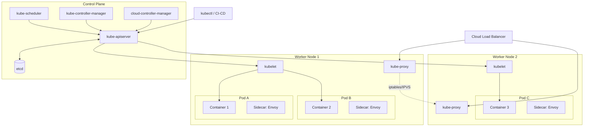
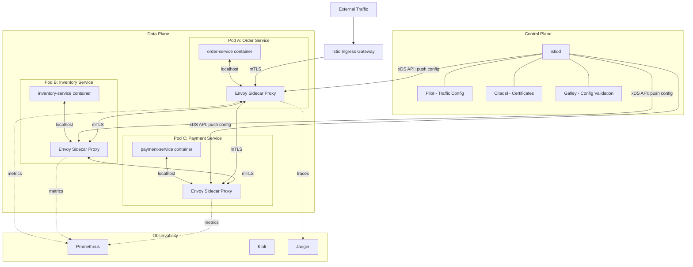
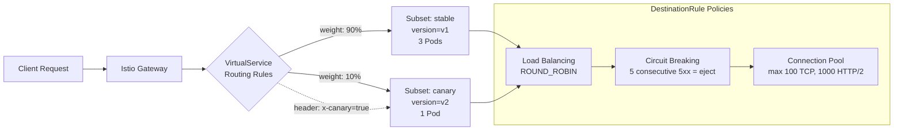
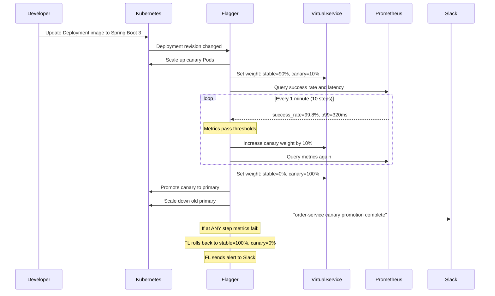
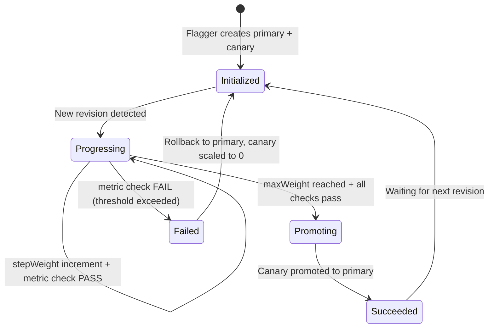

# Docker, Kubernetes, Istio, and Flagger -- Complete Study Guide

**For:** Anshul Garg | Backend Engineer | Interview Preparation
**Context:** Runs microservices on Kubernetes at Walmart, used Flagger canary (10% to 100% traffic shifting) for Spring Boot migration, Istio service mesh for traffic management and observability

---

# TABLE OF CONTENTS

1. [Part 1: Docker](#part-1-docker)
   - [Containers vs VMs](#containers-vs-vms)
   - [Dockerfile, Images, and Layers](#dockerfile-images-and-layers)
   - [Multi-Stage Builds](#multi-stage-builds)
   - [Docker Networking](#docker-networking)
2. [Part 2: Kubernetes Architecture](#part-2-kubernetes-architecture)
   - [Control Plane Components](#control-plane-components)
   - [Worker Node Components](#worker-node-components)
   - [Architecture Diagram](#kubernetes-architecture-diagram)
3. [Part 3: Kubernetes Core Objects](#part-3-kubernetes-core-objects)
   - [Pods](#pods)
   - [Deployments and ReplicaSets](#deployments-and-replicasets)
   - [StatefulSets, DaemonSets, Jobs](#statefulsets-daemonsets-and-jobscronjobs)
   - [Services](#services-clusterip-nodeport-loadbalancer)
   - [Ingress Controllers](#ingress-controllers)
   - [ConfigMaps and Secrets](#configmaps-and-secrets)
   - [Persistent Volumes](#persistent-volumes-pv-and-pvc)
   - [Horizontal Pod Autoscaler](#horizontal-pod-autoscaler-hpa)
   - [Liveness and Readiness Probes](#liveness-and-readiness-probes)
   - [Rolling Updates and Rollbacks](#rolling-updates-and-rollbacks)
   - [Namespaces and RBAC](#namespaces-and-rbac)
4. [Part 4: Istio Service Mesh](#part-4-istio-service-mesh)
   - [What Is a Service Mesh](#what-is-a-service-mesh)
   - [Istio Architecture](#istio-architecture)
   - [Traffic Management](#traffic-management-virtualservice-destinationrule-gateway)
   - [Canary Deployments with Istio](#canary-deployments-with-istio)
   - [Circuit Breaking, Retries, Timeouts](#circuit-breaking-retries-and-timeouts)
   - [Mutual TLS](#mutual-tls-mtls)
   - [Observability](#observability-kiali-jaeger-prometheus)
   - [Rate Limiting](#rate-limiting-with-istio)
5. [Part 5: Flagger Progressive Delivery](#part-5-flagger-progressive-delivery)
   - [What Is Flagger](#what-is-flagger)
   - [Flagger and Istio Integration](#flagger-and-istio-integration)
   - [Canary Analysis Metrics](#canary-analysis-metrics)
   - [How Anshul Used Flagger at Walmart](#how-anshul-used-flagger-at-walmart)
6. [Part 6: Interview Q&A (15 Questions)](#part-6-interview-qa)

---

# PART 1: DOCKER

## Containers vs VMs

Containers and virtual machines both provide isolation, but at fundamentally different layers. A VM virtualizes the entire hardware stack and runs a full guest OS. A container shares the host OS kernel and isolates only the user-space processes using Linux namespaces and cgroups.

| Aspect | Containers | Virtual Machines |
|--------|-----------|-----------------|
| **Isolation level** | Process-level (namespaces, cgroups) | Hardware-level (hypervisor) |
| **OS** | Shares host kernel | Full guest OS per VM |
| **Startup time** | Milliseconds to seconds | Minutes |
| **Image size** | MBs (10-500 MB typical) | GBs (1-20 GB typical) |
| **Resource overhead** | Minimal (no guest OS) | Significant (full OS per VM) |
| **Density** | Hundreds per host | Tens per host |
| **Performance** | Near-native | ~5-10% overhead from hypervisor |
| **Portability** | High (OCI standard images) | Medium (hypervisor-dependent) |
| **Security isolation** | Weaker (shared kernel) | Stronger (separate kernels) |
| **Use case** | Microservices, CI/CD, dev environments | Legacy apps, multi-OS, strong isolation |

**Why Walmart uses containers:** Microservices need fast startup, high density, and consistent environments across dev/staging/prod. Containers on Kubernetes give all three with minimal overhead.

---

## Dockerfile, Images, and Layers

A **Docker image** is an immutable, layered filesystem built from a **Dockerfile**. Each instruction in the Dockerfile creates a new layer. Layers are cached and shared across images, making builds and pulls efficient.

**Key Dockerfile instructions:**

```dockerfile
# Base image -- creates the first layer
FROM openjdk:17-slim

# Metadata
LABEL maintainer="anshul.garg@walmart.com"

# Set environment variables (does not create a layer)
ENV APP_HOME=/app \
    JAVA_OPTS="-Xms256m -Xmx512m"

# Set working directory
WORKDIR $APP_HOME

# Copy dependency descriptor first (layer caching optimization)
COPY build.gradle settings.gradle ./
COPY gradle ./gradle
RUN ./gradlew dependencies --no-daemon

# Copy source code (changes frequently, so placed later)
COPY src ./src
RUN ./gradlew bootJar --no-daemon

# Expose port (documentation, does not publish)
EXPOSE 8080

# Health check
HEALTHCHECK --interval=30s --timeout=3s --retries=3 \
  CMD curl -f http://localhost:8080/actuator/health || exit 1

# Run as non-root user
RUN addgroup --system appgroup && adduser --system appuser --ingroup appgroup
USER appuser

# Entry point
ENTRYPOINT ["java", "-jar", "build/libs/app.jar"]
```

**How layers work:**
- Each `RUN`, `COPY`, `ADD` instruction creates a read-only layer
- Layers are stacked using a union filesystem (overlay2)
- The topmost writable layer is the container layer (lost when container is removed)
- Docker caches layers; if a layer and all layers before it are unchanged, the cache is reused
- **Optimization:** Put rarely-changing instructions (dependencies) before frequently-changing ones (source code)

---

## Multi-Stage Builds

Multi-stage builds reduce final image size by separating the build environment from the runtime environment. Only the artifacts needed at runtime are copied into the final image.

```dockerfile
# Stage 1: Build
FROM gradle:7.6-jdk17 AS builder
WORKDIR /build
COPY build.gradle settings.gradle ./
COPY src ./src
RUN gradle bootJar --no-daemon

# Stage 2: Runtime (much smaller)
FROM eclipse-temurin:17-jre-alpine
WORKDIR /app
COPY --from=builder /build/build/libs/*.jar app.jar

RUN addgroup -S appgroup && adduser -S appuser -G appgroup
USER appuser

EXPOSE 8080
ENTRYPOINT ["java", "-jar", "app.jar"]
```

**Result:** Build image ~800MB with full JDK and Gradle. Final image ~200MB with only JRE and the JAR. At Walmart, multi-stage builds are standard for all Spring Boot services.

---

## Docker Networking

Docker provides several network drivers for different use cases:

| Network Driver | Scope | Use Case |
|---------------|-------|----------|
| **bridge** | Single host | Default for standalone containers. Containers on the same bridge can communicate by name. |
| **host** | Single host | Container shares the host network namespace. No port mapping needed. Best performance. |
| **overlay** | Multi-host | Spans multiple Docker daemons (Swarm/K8s). Enables cross-host container communication. |
| **none** | Single host | No networking. Complete isolation. |
| **macvlan** | Single host | Assigns a MAC address to the container, making it appear as a physical device on the network. |

**In Kubernetes**, Docker networking is replaced by the CNI (Container Network Interface). Kubernetes requires:
1. Every Pod gets its own IP address
2. Pods on any node can communicate with pods on any other node without NAT
3. Agents on a node can communicate with all pods on that node

Common CNI plugins: Calico, Cilium, Flannel, Weave Net. At Walmart, network policies are enforced at the CNI level for pod-to-pod security.

---

# PART 2: KUBERNETES ARCHITECTURE

Kubernetes (K8s) is a container orchestration platform that automates deployment, scaling, and management of containerized applications. It follows a declarative model: you specify the desired state, and Kubernetes continuously reconciles the actual state to match.

## Control Plane Components

The control plane makes global decisions about the cluster and detects and responds to cluster events.

| Component | Responsibility |
|-----------|---------------|
| **kube-apiserver** | Front door to the cluster. All communication goes through the API server (REST over HTTPS). Validates and processes API requests, writes state to etcd. Horizontally scalable. |
| **etcd** | Distributed key-value store. Single source of truth for all cluster state. Uses Raft consensus. Must be backed up regularly. |
| **kube-scheduler** | Watches for newly created Pods with no assigned node. Selects a node based on resource requirements, affinity/anti-affinity rules, taints/tolerations, and priority. |
| **kube-controller-manager** | Runs controller loops: Deployment controller, ReplicaSet controller, Node controller, Job controller, etc. Each controller watches the API server and reconciles desired vs actual state. |
| **cloud-controller-manager** | Integrates with cloud provider APIs (AWS, GCP, Azure) for load balancers, storage volumes, and node lifecycle. |

## Worker Node Components

Each worker node runs the workloads (Pods) and is managed by the control plane.

| Component | Responsibility |
|-----------|---------------|
| **kubelet** | Agent on each node. Ensures containers in Pods are running and healthy. Talks to the API server. Manages pod lifecycle based on PodSpecs. |
| **kube-proxy** | Network proxy on each node. Maintains network rules (iptables or IPVS) for Service-to-Pod routing. Handles load balancing across Pod endpoints. |
| **Container runtime** | Runs containers. Must implement the CRI (Container Runtime Interface). Common runtimes: containerd (default), CRI-O. Docker was deprecated as a runtime in K8s 1.24. |

## Kubernetes Architecture Diagram



---

# PART 3: KUBERNETES CORE OBJECTS

## Pods

A **Pod** is the smallest deployable unit in Kubernetes. It is a group of one or more containers that share network (same IP, localhost communication) and storage (shared volumes). Pods are ephemeral -- they are not rescheduled, they are replaced.

**Key facts:**
- Each Pod gets a unique IP address within the cluster
- Containers in a Pod share the network namespace (communicate via localhost)
- Pods are typically managed by higher-level controllers (Deployment, StatefulSet), not created directly
- Common sidecar pattern: application container + Envoy proxy container in the same Pod

```yaml
apiVersion: v1
kind: Pod
metadata:
  name: my-app
  labels:
    app: my-service
    version: v2
spec:
  containers:
    - name: app
      image: walmart/my-service:2.1.0
      ports:
        - containerPort: 8080
      resources:
        requests:
          cpu: "250m"
          memory: "256Mi"
        limits:
          cpu: "500m"
          memory: "512Mi"
      livenessProbe:
        httpGet:
          path: /actuator/health
          port: 8080
        initialDelaySeconds: 30
        periodSeconds: 10
      readinessProbe:
        httpGet:
          path: /actuator/health/readiness
          port: 8080
        initialDelaySeconds: 5
        periodSeconds: 5
```

---

## Deployments and ReplicaSets

A **Deployment** declares the desired state for Pods and manages **ReplicaSets** to achieve it. It handles rolling updates, rollbacks, and scaling.

**Deployment --> ReplicaSet --> Pods**

- **Deployment:** Declares desired Pod template and replica count. Manages rollout strategy.
- **ReplicaSet:** Ensures the specified number of Pod replicas are running at any time. Created and managed by the Deployment.

```yaml
apiVersion: apps/v1
kind: Deployment
metadata:
  name: order-service
  namespace: commerce
  labels:
    app: order-service
spec:
  replicas: 3
  selector:
    matchLabels:
      app: order-service
  strategy:
    type: RollingUpdate
    rollingUpdate:
      maxSurge: 1          # At most 1 extra Pod during update
      maxUnavailable: 0     # Zero downtime
  template:
    metadata:
      labels:
        app: order-service
        version: v2
    spec:
      containers:
        - name: order-service
          image: walmart/order-service:2.1.0
          ports:
            - containerPort: 8080
          env:
            - name: SPRING_PROFILES_ACTIVE
              value: "prod"
            - name: DB_PASSWORD
              valueFrom:
                secretKeyRef:
                  name: db-credentials
                  key: password
          resources:
            requests:
              cpu: "500m"
              memory: "512Mi"
            limits:
              cpu: "1000m"
              memory: "1Gi"
```

**How rolling updates work internally:**
1. Deployment controller creates a new ReplicaSet with the updated Pod template
2. New ReplicaSet scales up (one Pod at a time, per `maxSurge`)
3. Old ReplicaSet scales down (respecting `maxUnavailable`)
4. Process continues until all Pods run the new version
5. Old ReplicaSet is kept (with 0 replicas) for rollback history

---

## StatefulSets, DaemonSets, and Jobs/CronJobs

| Controller | Use Case | Key Properties |
|-----------|----------|----------------|
| **StatefulSet** | Stateful apps (databases, Kafka, ZooKeeper) | Stable network identity (pod-0, pod-1...), ordered deployment/scaling, persistent storage per Pod |
| **DaemonSet** | Node-level agents (log collectors, monitoring) | Exactly one Pod per node, automatically added to new nodes |
| **Job** | One-off batch tasks (data migration, report generation) | Runs to completion, tracks success/failure, configurable retry |
| **CronJob** | Scheduled tasks (nightly cleanup, periodic sync) | Cron-syntax schedule, creates Job objects on schedule |

```yaml
# DaemonSet example: log collector on every node
apiVersion: apps/v1
kind: DaemonSet
metadata:
  name: fluentd
spec:
  selector:
    matchLabels:
      app: fluentd
  template:
    metadata:
      labels:
        app: fluentd
    spec:
      containers:
        - name: fluentd
          image: fluent/fluentd:v1.16
          volumeMounts:
            - name: varlog
              mountPath: /var/log
      volumes:
        - name: varlog
          hostPath:
            path: /var/log
```

---

## Services: ClusterIP, NodePort, LoadBalancer

A **Service** provides a stable endpoint (IP + DNS name) to access a set of Pods selected by labels. It abstracts away Pod ephemerality.

| Service Type | Access Scope | How It Works |
|-------------|-------------|--------------|
| **ClusterIP** (default) | Internal cluster only | Assigns a virtual IP reachable only within the cluster. kube-proxy routes traffic to backend Pods. |
| **NodePort** | External via node IP:port | Exposes the service on a static port (30000-32767) on every node. Traffic to `<NodeIP>:<NodePort>` is routed to the Service. |
| **LoadBalancer** | External via cloud LB | Provisions a cloud load balancer (AWS ELB/NLB, GCP LB) that routes to NodePorts. The standard way to expose services externally in cloud environments. |
| **ExternalName** | DNS alias | Maps a service to an external DNS name (CNAME). No proxying. |

```yaml
# ClusterIP service (internal)
apiVersion: v1
kind: Service
metadata:
  name: order-service
  namespace: commerce
spec:
  type: ClusterIP
  selector:
    app: order-service
  ports:
    - port: 80            # Service port
      targetPort: 8080    # Container port
      protocol: TCP
---
# LoadBalancer service (external)
apiVersion: v1
kind: Service
metadata:
  name: api-gateway
  annotations:
    service.beta.kubernetes.io/aws-load-balancer-type: nlb
spec:
  type: LoadBalancer
  selector:
    app: api-gateway
  ports:
    - port: 443
      targetPort: 8443
```

**Service discovery:** Kubernetes provides DNS-based service discovery. A Service named `order-service` in namespace `commerce` is reachable at `order-service.commerce.svc.cluster.local`.

---

## Ingress Controllers

An **Ingress** defines HTTP/HTTPS routing rules (host-based, path-based) to backend Services. An **Ingress Controller** (NGINX, Traefik, Istio Gateway) implements these rules.

```yaml
apiVersion: networking.k8s.io/v1
kind: Ingress
metadata:
  name: api-ingress
  annotations:
    nginx.ingress.kubernetes.io/ssl-redirect: "true"
    nginx.ingress.kubernetes.io/rate-limit: "100"
spec:
  tls:
    - hosts:
        - api.walmart.com
      secretName: tls-secret
  rules:
    - host: api.walmart.com
      http:
        paths:
          - path: /orders
            pathType: Prefix
            backend:
              service:
                name: order-service
                port:
                  number: 80
          - path: /inventory
            pathType: Prefix
            backend:
              service:
                name: inventory-service
                port:
                  number: 80
```

**With Istio**, the Ingress resource is typically replaced by Istio **Gateway** + **VirtualService** for more powerful traffic management (covered in Part 4).

---

## ConfigMaps and Secrets

**ConfigMaps** store non-sensitive configuration as key-value pairs. **Secrets** store sensitive data (passwords, tokens, certificates) encoded in base64 (not encrypted by default -- use external secret managers or enable encryption at rest in etcd).

```yaml
# ConfigMap
apiVersion: v1
kind: ConfigMap
metadata:
  name: app-config
data:
  application.yml: |
    server:
      port: 8080
    spring:
      datasource:
        url: jdbc:postgresql://db-host:5432/orders
  LOG_LEVEL: "INFO"
---
# Secret
apiVersion: v1
kind: Secret
metadata:
  name: db-credentials
type: Opaque
data:
  username: YWRtaW4=        # base64 encoded
  password: c3VwZXJzZWNyZXQ=
```

**Consumption in Pods:** Environment variables or mounted volumes:
```yaml
# As env vars
env:
  - name: DB_USER
    valueFrom:
      secretKeyRef:
        name: db-credentials
        key: username
# As mounted file
volumeMounts:
  - name: config-volume
    mountPath: /etc/config
volumes:
  - name: config-volume
    configMap:
      name: app-config
```

---

## Persistent Volumes (PV and PVC)

Kubernetes decouples storage from Pods using the PV/PVC abstraction:

- **PersistentVolume (PV):** A piece of storage provisioned by an admin or dynamically by a StorageClass (EBS, EFS, GCE PD, etc.)
- **PersistentVolumeClaim (PVC):** A request for storage by a Pod. Binds to an available PV that satisfies size and access mode.
- **StorageClass:** Defines how storage is dynamically provisioned (e.g., `gp3` EBS volumes on AWS).

```yaml
apiVersion: v1
kind: PersistentVolumeClaim
metadata:
  name: postgres-data
spec:
  accessModes:
    - ReadWriteOnce
  storageClassName: gp3
  resources:
    requests:
      storage: 50Gi
```

**Access modes:** `ReadWriteOnce` (single node), `ReadOnlyMany` (multiple nodes read), `ReadWriteMany` (multiple nodes read/write -- requires NFS or EFS).

---

## Horizontal Pod Autoscaler (HPA)

HPA automatically adjusts the number of Pod replicas based on observed metrics (CPU, memory, or custom metrics).

```yaml
apiVersion: autoscaling/v2
kind: HorizontalPodAutoscaler
metadata:
  name: order-service-hpa
spec:
  scaleTargetRef:
    apiVersion: apps/v1
    kind: Deployment
    name: order-service
  minReplicas: 3
  maxReplicas: 20
  metrics:
    - type: Resource
      resource:
        name: cpu
        target:
          type: Utilization
          averageUtilization: 70
    - type: Resource
      resource:
        name: memory
        target:
          type: Utilization
          averageUtilization: 80
  behavior:
    scaleUp:
      stabilizationWindowSeconds: 60
      policies:
        - type: Percent
          value: 50
          periodSeconds: 60
    scaleDown:
      stabilizationWindowSeconds: 300
      policies:
        - type: Percent
          value: 10
          periodSeconds: 60
```

**How HPA works:**
1. Metrics server collects resource usage from kubelets every 15 seconds
2. HPA controller queries metrics server every 15 seconds (default)
3. Calculates desired replicas: `desiredReplicas = ceil(currentReplicas * (currentMetricValue / desiredMetricValue))`
4. Scales Deployment up or down within min/max bounds
5. Stabilization window prevents flapping (scale-down is deliberately slower)

---

## Liveness and Readiness Probes

| Probe | Purpose | Failure Action |
|-------|---------|----------------|
| **Liveness** | Is the container still running correctly? | kubelet restarts the container |
| **Readiness** | Is the container ready to serve traffic? | Pod is removed from Service endpoints (no traffic routed to it) |
| **Startup** | Has the container finished starting? | Disables liveness/readiness checks until startup succeeds. Useful for slow-starting apps. |

**Probe types:** `httpGet`, `tcpSocket`, `exec` (run a command), `grpc`

```yaml
livenessProbe:
  httpGet:
    path: /actuator/health/liveness
    port: 8080
  initialDelaySeconds: 30    # Wait 30s before first check
  periodSeconds: 10          # Check every 10s
  failureThreshold: 3        # Restart after 3 failures
  timeoutSeconds: 3          # Each check times out at 3s

readinessProbe:
  httpGet:
    path: /actuator/health/readiness
    port: 8080
  initialDelaySeconds: 5
  periodSeconds: 5
  failureThreshold: 3

startupProbe:
  httpGet:
    path: /actuator/health
    port: 8080
  failureThreshold: 30
  periodSeconds: 10          # 30 * 10 = 300s max startup time
```

**At Walmart:** Spring Boot Actuator health endpoints are used for all three probe types. The readiness probe ensures Pods do not receive traffic until the Spring context is fully initialized and database connections are established.

---

## Rolling Updates and Rollbacks

**Rolling update** (default strategy for Deployments): gradually replaces old Pods with new ones.

```bash
# Trigger rolling update by changing the image
kubectl set image deployment/order-service order-service=walmart/order-service:2.2.0

# Watch rollout status
kubectl rollout status deployment/order-service

# View rollout history
kubectl rollout history deployment/order-service

# Rollback to previous version
kubectl rollout undo deployment/order-service

# Rollback to specific revision
kubectl rollout undo deployment/order-service --to-revision=3

# Pause and resume (for canary-style manual control)
kubectl rollout pause deployment/order-service
kubectl rollout resume deployment/order-service
```

**Recreate strategy** (alternative): kills all old Pods before creating new ones. Causes downtime but avoids running two versions simultaneously. Useful when the application cannot handle two versions running at the same time (schema incompatibility, etc.).

---

## Namespaces and RBAC

**Namespaces** provide logical isolation within a cluster. They scope names, allow resource quotas, and enable RBAC policies per team or environment.

```bash
# Common namespace layout at Walmart
kubectl get namespaces
# commerce       -- order, cart, checkout services
# inventory      -- inventory, warehouse services
# platform       -- shared infrastructure (Kafka, Redis)
# monitoring     -- Prometheus, Grafana, Kiali
# istio-system   -- Istio control plane
```

**RBAC (Role-Based Access Control)** controls who can do what in the cluster:

- **Role / ClusterRole:** Defines a set of permissions (verbs on resources)
- **RoleBinding / ClusterRoleBinding:** Binds a Role to a user, group, or service account

```yaml
# Role: can read pods and logs in the commerce namespace
apiVersion: rbac.authorization.k8s.io/v1
kind: Role
metadata:
  namespace: commerce
  name: pod-reader
rules:
  - apiGroups: [""]
    resources: ["pods", "pods/log"]
    verbs: ["get", "list", "watch"]
---
# RoleBinding: bind the role to a service account
apiVersion: rbac.authorization.k8s.io/v1
kind: RoleBinding
metadata:
  name: read-pods-binding
  namespace: commerce
subjects:
  - kind: ServiceAccount
    name: ci-deployer
    namespace: commerce
roleRef:
  kind: Role
  name: pod-reader
  apiGroup: rbac.authorization.k8s.io
```

**Key RBAC principle:** Least privilege. Service accounts should only have the permissions they need. At Walmart, CI/CD pipelines use dedicated service accounts with scoped roles for each namespace.

---

# PART 4: ISTIO SERVICE MESH

## What Is a Service Mesh

A **service mesh** is a dedicated infrastructure layer that handles service-to-service communication. Instead of embedding networking logic (retries, timeouts, circuit breaking, TLS, observability) in every application, the mesh handles it transparently via sidecar proxies.

**Why a service mesh is needed:**
- Microservices multiply the number of network calls (N services means up to N^2 communication paths)
- Each service would need to implement retries, circuit breaking, TLS, tracing independently
- Different languages/frameworks handle networking differently (Java Spring vs Go vs Node.js)
- Operations teams need consistent observability across all services without requiring app changes

**What Istio provides:**
| Capability | Without Istio | With Istio |
|-----------|--------------|------------|
| **Traffic management** | Application-level routing, manual config | VirtualService, DestinationRule, fine-grained traffic splitting |
| **Security** | Each app manages TLS certificates | Automatic mTLS between all services, zero app changes |
| **Observability** | Each app instruments metrics, tracing | Automatic metrics, distributed tracing, service graph |
| **Resilience** | App-level retry/timeout/circuit breaker libraries | Declarative retry, timeout, circuit breaking policies |
| **Policy** | Custom middleware per service | Centralized rate limiting, access control |

---

## Istio Architecture

Istio follows a **data plane + control plane** architecture:

- **Data plane:** Envoy sidecar proxies deployed alongside every Pod. All traffic in and out of a Pod passes through its Envoy sidecar. The sidecar is injected automatically when the namespace has the `istio-injection=enabled` label.
- **Control plane (istiod):** A single binary that combines the formerly separate components:
  - **Pilot:** Configures Envoy proxies with routing rules, service discovery, and load balancing
  - **Citadel:** Manages certificates and identity for mTLS
  - **Galley:** Validates and distributes Istio configuration



**Sidecar injection:** When a namespace has `istio-injection: enabled`, the Istio admission webhook automatically injects an Envoy sidecar container and an init container (to set up iptables rules for traffic interception) into every new Pod.

```bash
kubectl label namespace commerce istio-injection=enabled
```

---

## Traffic Management: VirtualService, DestinationRule, Gateway

Istio's traffic management model uses three key resources:

### Gateway

Configures a load balancer operating at the edge of the mesh, receiving incoming HTTP/TCP connections.

```yaml
apiVersion: networking.istio.io/v1beta1
kind: Gateway
metadata:
  name: commerce-gateway
  namespace: commerce
spec:
  selector:
    istio: ingressgateway      # Use Istio's built-in ingress gateway
  servers:
    - port:
        number: 443
        name: https
        protocol: HTTPS
      tls:
        mode: SIMPLE
        credentialName: commerce-tls-cert
      hosts:
        - "api.walmart.com"
```

### VirtualService

Defines routing rules: how traffic reaching a host is routed to destination services. Supports traffic splitting, header-based routing, fault injection, retries, and timeouts.

```yaml
apiVersion: networking.istio.io/v1beta1
kind: VirtualService
metadata:
  name: order-service
  namespace: commerce
spec:
  hosts:
    - order-service
  gateways:
    - commerce-gateway
    - mesh                     # Also apply to in-mesh traffic
  http:
    - match:
        - headers:
            x-canary:
              exact: "true"
      route:
        - destination:
            host: order-service
            subset: canary
    - route:                   # Default route: traffic splitting
        - destination:
            host: order-service
            subset: stable
          weight: 90
        - destination:
            host: order-service
            subset: canary
          weight: 10
      retries:
        attempts: 3
        perTryTimeout: 2s
        retryOn: 5xx,reset,connect-failure
      timeout: 10s
```

### DestinationRule

Defines policies applied to traffic after routing: load balancing, connection pooling, outlier detection (circuit breaking), and TLS settings. **Subsets** map to specific Pod label selectors (e.g., version labels).

```yaml
apiVersion: networking.istio.io/v1beta1
kind: DestinationRule
metadata:
  name: order-service
  namespace: commerce
spec:
  host: order-service
  trafficPolicy:
    connectionPool:
      tcp:
        maxConnections: 100
      http:
        h2UpgradePolicy: DEFAULT
        http1MaxPendingRequests: 100
        http2MaxRequests: 1000
    outlierDetection:
      consecutive5xxErrors: 5
      interval: 30s
      baseEjectionTime: 30s
      maxEjectionPercent: 50
    tls:
      mode: ISTIO_MUTUAL
  subsets:
    - name: stable
      labels:
        version: v1
    - name: canary
      labels:
        version: v2
```

### Traffic Routing Flow



---

## Canary Deployments with Istio

A **canary deployment** gradually shifts traffic from the old version to the new version while monitoring for errors. Istio makes this possible without modifying application code by controlling traffic weights at the proxy level.

**Manual canary with Istio (step by step):**

1. Deploy the new version alongside the old version with a different version label
2. Create/update VirtualService to send 10% of traffic to the canary subset
3. Monitor error rates, latency, and success rates
4. If healthy, increase to 25%, 50%, 75%, 100%
5. If unhealthy, set canary weight to 0% (instant rollback)

```yaml
# Step 1: Deploy canary
apiVersion: apps/v1
kind: Deployment
metadata:
  name: order-service-canary
spec:
  replicas: 1
  selector:
    matchLabels:
      app: order-service
      version: v2
  template:
    metadata:
      labels:
        app: order-service
        version: v2
    spec:
      containers:
        - name: order-service
          image: walmart/order-service:2.2.0
```

```yaml
# Step 2: VirtualService traffic split
http:
  - route:
      - destination:
          host: order-service
          subset: stable    # v1
        weight: 90
      - destination:
          host: order-service
          subset: canary    # v2
        weight: 10
```

**Advantage over Kubernetes rolling updates:** Rolling updates give you zero control over the traffic percentage. Istio canary lets you send exactly 10% of traffic to the new version while keeping 90% on the old version, regardless of the number of replicas.

---

## Circuit Breaking, Retries, and Timeouts

### Circuit Breaking (Outlier Detection)

Istio's circuit breaking is configured via `outlierDetection` in DestinationRule. It ejects unhealthy endpoints from the load balancing pool.

```yaml
trafficPolicy:
  outlierDetection:
    consecutive5xxErrors: 5       # Eject after 5 consecutive 5xx errors
    interval: 10s                 # Check every 10 seconds
    baseEjectionTime: 30s         # Minimum ejection duration
    maxEjectionPercent: 50        # Never eject more than 50% of endpoints
    minHealthPercent: 30          # Only apply if >30% hosts are healthy
```

**How it works:** Envoy tracks error rates per upstream endpoint. When an endpoint exceeds the threshold, it is ejected (removed from load balancing) for a duration that increases exponentially with each ejection. After the ejection period, the endpoint is allowed back in and monitored again.

### Retries

```yaml
http:
  - route:
      - destination:
          host: order-service
    retries:
      attempts: 3                  # Max retry attempts
      perTryTimeout: 2s           # Timeout per attempt
      retryOn: 5xx,reset,connect-failure,retriable-4xx
      retryRemoteLocalities: true  # Retry on different zones
```

### Timeouts

```yaml
http:
  - route:
      - destination:
          host: order-service
    timeout: 10s                   # Total request timeout (including retries)
```

**Key insight:** The total timeout must be greater than `attempts * perTryTimeout`. If timeout is 10s and you have 3 retries with 2s each, the total retry time is 6s which fits within the 10s timeout.

---

## Mutual TLS (mTLS)

**mTLS** means both the client and server authenticate each other using TLS certificates. In Istio, mTLS is handled entirely by the Envoy sidecars -- the application code knows nothing about it.

**How Istio mTLS works:**
1. **Citadel** (in istiod) acts as the Certificate Authority (CA)
2. Each Envoy sidecar receives a unique SPIFFE identity certificate (X.509)
3. When Pod A calls Pod B, Envoy A presents its certificate to Envoy B, and Envoy B presents its certificate to Envoy A
4. Both sides verify the certificate chain back to the Istio CA
5. The application sees plain HTTP on localhost; TLS is transparent

```yaml
# PeerAuthentication: enforce mTLS for the entire namespace
apiVersion: security.istio.io/v1beta1
kind: PeerAuthentication
metadata:
  name: default
  namespace: commerce
spec:
  mtls:
    mode: STRICT    # Only accept mTLS traffic (reject plain text)
```

**mTLS modes:**
| Mode | Behavior |
|------|----------|
| `DISABLE` | No mTLS. Plain text only. |
| `PERMISSIVE` | Accept both mTLS and plain text. Useful during migration. |
| `STRICT` | mTLS only. Reject plain text connections. Production recommended. |

**At Walmart:** All production namespaces use `STRICT` mode. During the Spring Boot migration, `PERMISSIVE` mode was used temporarily to allow both old and new services to communicate while sidecars were being rolled out.

---

## Observability: Kiali, Jaeger, Prometheus

Istio generates telemetry data from the Envoy sidecars without requiring any application code changes.

| Tool | Purpose | Data Source |
|------|---------|-------------|
| **Prometheus** | Metrics collection and alerting | Envoy exposes metrics: request count, latency histograms, error rates, TCP bytes |
| **Grafana** | Metrics visualization and dashboards | Reads from Prometheus |
| **Kiali** | Service mesh topology visualization | Aggregates Prometheus metrics into a service graph showing traffic flow, health, and configuration |
| **Jaeger** | Distributed tracing | Envoy generates trace spans; apps must propagate trace headers (x-request-id, x-b3-traceid, etc.) |

**Key Istio metrics exposed by Envoy:**
- `istio_requests_total` -- total request count by source, destination, response code
- `istio_request_duration_milliseconds` -- request duration histogram
- `istio_request_bytes` / `istio_response_bytes` -- request/response size
- `istio_tcp_connections_opened_total` / `closed_total` -- TCP connection metrics

**Important caveat for distributed tracing:** Istio automatically generates spans for each hop, but the application must propagate trace context headers between incoming and outgoing requests. For Java Spring Boot, this is handled by Micrometer/Brave/OpenTelemetry libraries.

---

## Rate Limiting with Istio

Istio supports both **local rate limiting** (per-Pod Envoy) and **global rate limiting** (shared state via an external rate limit service).

### Local Rate Limiting (EnvoyFilter)

```yaml
apiVersion: networking.istio.io/v1alpha3
kind: EnvoyFilter
metadata:
  name: rate-limit-order-service
  namespace: commerce
spec:
  workloadSelector:
    labels:
      app: order-service
  configPatches:
    - applyTo: HTTP_FILTER
      match:
        context: SIDECAR_INBOUND
        listener:
          filterChain:
            filter:
              name: envoy.filters.network.http_connection_manager
      patch:
        operation: INSERT_BEFORE
        value:
          name: envoy.filters.http.local_ratelimit
          typed_config:
            "@type": type.googleapis.com/udpa.type.v1.TypedStruct
            type_url: type.googleapis.com/envoy.extensions.filters.http.local_ratelimit.v3.LocalRateLimit
            value:
              stat_prefix: http_local_rate_limiter
              token_bucket:
                max_tokens: 100
                tokens_per_fill: 100
                fill_interval: 60s
              filter_enabled:
                runtime_key: local_rate_limit_enabled
                default_value:
                  numerator: 100
                  denominator: HUNDRED
              filter_enforced:
                runtime_key: local_rate_limit_enforced
                default_value:
                  numerator: 100
                  denominator: HUNDRED
              response_headers_to_add:
                - append_action: OVERWRITE_IF_EXISTS_OR_ADD
                  header:
                    key: x-local-rate-limit
                    value: "true"
```

### Global Rate Limiting

For global rate limiting across all Pods, Istio integrates with an external rate limit service (envoyproxy/ratelimit backed by Redis):

1. Deploy the rate limit service (stateless, uses Redis for shared counters)
2. Configure EnvoyFilter to route rate limit checks to the service
3. Define rate limit descriptors (by path, header, source IP, etc.)

**At Walmart:** Local rate limiting is used per-Pod for basic protection. Critical APIs (payment, checkout) use global rate limiting with Redis-backed counters to enforce organization-wide limits.

---

# PART 5: FLAGGER PROGRESSIVE DELIVERY

## What Is Flagger

**Flagger** is a progressive delivery tool that automates the promotion of canary deployments using Istio, Linkerd, App Mesh, NGINX, or other service meshes. Instead of manually adjusting traffic weights, Flagger automatically:

1. Detects a new deployment revision
2. Scales up canary Pods
3. Gradually shifts traffic from stable to canary
4. Runs automated analysis (success rate, latency, custom metrics)
5. Promotes or rolls back based on analysis results

**Key benefits over manual canary:**
- Fully automated: no human intervention needed for happy path
- Metric-driven: promotion/rollback based on actual production metrics
- Configurable: step weight, interval, thresholds, webhooks
- Integrates with alerting (Slack, PagerDuty) for rollback notifications

---

## Flagger and Istio Integration

When Flagger is configured with Istio, it manages the VirtualService and DestinationRule resources automatically.

**How Flagger works with Istio:**

1. You create a `Canary` custom resource pointing to your Deployment
2. Flagger creates:
   - `<name>-primary` Deployment (the stable version)
   - `<name>-canary` Deployment (initially scaled to zero)
   - VirtualService with 100% traffic to primary
   - DestinationRule with primary and canary subsets
3. When you update the original Deployment image, Flagger:
   - Detects the change
   - Scales up the canary Deployment
   - Gradually shifts VirtualService weights (e.g., 10 -> 20 -> 30 -> ... -> 100)
   - At each step, queries Prometheus for success rate and latency
   - If metrics pass thresholds, continues; if not, rolls back

```yaml
apiVersion: flagger.app/v1beta1
kind: Canary
metadata:
  name: order-service
  namespace: commerce
spec:
  targetRef:
    apiVersion: apps/v1
    kind: Deployment
    name: order-service
  progressDeadlineSeconds: 600
  service:
    port: 8080
    targetPort: 8080
    gateways:
      - commerce-gateway
    hosts:
      - order-service
    trafficPolicy:
      tls:
        mode: ISTIO_MUTUAL
    retries:
      attempts: 3
      perTryTimeout: 2s
      retryOn: "5xx,reset,connect-failure"
  analysis:
    interval: 1m              # Check metrics every 1 minute
    threshold: 5              # Max failed checks before rollback
    maxWeight: 50             # Max canary traffic percentage
    stepWeight: 10            # Increase by 10% each interval
    metrics:
      - name: request-success-rate
        thresholdRange:
          min: 99             # Require 99%+ success rate
        interval: 1m
      - name: request-duration
        thresholdRange:
          max: 500            # p99 latency must be under 500ms
        interval: 1m
    webhooks:
      - name: load-test
        type: rollout
        url: http://flagger-loadtester.test/
        metadata:
          cmd: "hey -z 1m -q 10 -c 2 http://order-service-canary.commerce:8080/"
      - name: slack-notification
        type: event
        url: http://flagger-slack.commerce/
        metadata:
          channel: "#deployments"
```

---

## Canary Analysis Metrics

Flagger queries Prometheus for metrics to decide whether to promote or roll back the canary.

**Built-in metrics (Istio):**

| Metric | Query | Threshold |
|--------|-------|-----------|
| **Request success rate** | `sum(rate(istio_requests_total{reporter="destination",destination_workload=~"order-service",response_code!~"5.*"}[1m])) / sum(rate(istio_requests_total{reporter="destination",destination_workload=~"order-service"}[1m])) * 100` | min: 99% |
| **Request duration (p99)** | `histogram_quantile(0.99, sum(rate(istio_request_duration_milliseconds_bucket{reporter="destination",destination_workload=~"order-service"}[1m])) by (le))` | max: 500ms |

**Custom metrics:** You can define any PromQL query as a metric template:

```yaml
apiVersion: flagger.app/v1beta1
kind: MetricTemplate
metadata:
  name: error-rate
  namespace: commerce
spec:
  provider:
    type: prometheus
    address: http://prometheus.monitoring:9090
  query: |
    100 - sum(
      rate(istio_requests_total{
        reporter="destination",
        destination_workload_namespace="{{ namespace }}",
        destination_workload="{{ target }}",
        response_code!~"5.*"
      }[{{ interval }}])
    ) / sum(
      rate(istio_requests_total{
        reporter="destination",
        destination_workload_namespace="{{ namespace }}",
        destination_workload="{{ target }}"
      }[{{ interval }}])
    ) * 100
```

---

## How Anshul Used Flagger at Walmart

**Context:** Migrated a critical order-processing service from Spring Boot 2 to Spring Boot 3. The service handles high traffic and any regression could impact checkout flows.

**Setup:**
- Istio service mesh with sidecar injection in the `commerce` namespace
- Flagger Canary resource configured with `stepWeight: 10` and `maxWeight: 100`
- Prometheus collecting Istio metrics
- Slack webhook for deployment notifications

**The migration flow:**

1. Updated the Deployment with the new Spring Boot 3 image
2. Flagger detected the image change and started canary analysis
3. Traffic was shifted: **10% -> 20% -> 30% -> 40% -> 50% -> 60% -> 70% -> 80% -> 90% -> 100%**
4. At each step (every 1 minute), Flagger checked:
   - Request success rate >= 99%
   - p99 latency <= 500ms
5. All checks passed, Flagger promoted the canary to primary
6. Total rollout time: ~10 minutes for full migration
7. Old primary was scaled down

**Why this approach was critical:**
- Spring Boot 3 changed underlying libraries (Jakarta EE migration, Jackson updates)
- Subtle serialization or HTTP behavior changes could cause errors under real traffic
- Canary allowed real production traffic to validate the new version incrementally
- If the success rate dropped below 99% at any step, Flagger would automatically roll back to the stable version with zero manual intervention



### Flagger Canary Lifecycle



---

# PART 6: INTERVIEW Q&A

### Q1: Explain the Kubernetes architecture. What are the control plane components?

**Answer:** Kubernetes has a control plane and worker nodes. The control plane consists of:
- **kube-apiserver:** The REST API frontend. All cluster communication goes through it. It validates requests, authenticates callers, and persists state to etcd.
- **etcd:** Distributed key-value store holding all cluster state. Uses Raft consensus for consistency.
- **kube-scheduler:** Assigns Pods to nodes based on resource requirements, affinity rules, taints/tolerations, and priorities.
- **kube-controller-manager:** Runs reconciliation loops (Deployment controller, ReplicaSet controller, Node controller, etc.) that continuously drive actual state toward desired state.

Worker nodes run **kubelet** (ensures Pods are running), **kube-proxy** (manages network rules for Service routing), and a **container runtime** (containerd).

---

### Q2: What is the difference between a Pod and a container?

**Answer:** A container is a single process running in an isolated namespace with its own filesystem. A Pod is a Kubernetes abstraction that wraps one or more containers that share the same network namespace (same IP, can communicate via localhost) and storage volumes. The Pod is the smallest schedulable unit -- you cannot schedule a raw container in Kubernetes. Common pattern: an application container plus a sidecar (e.g., Envoy proxy) in the same Pod.

---

### Q3: Explain the difference between ClusterIP, NodePort, and LoadBalancer services.

**Answer:**
- **ClusterIP:** Internal only. Gets a virtual IP reachable within the cluster. Used for service-to-service communication.
- **NodePort:** Opens a static port (30000-32767) on every node. External clients access `<NodeIP>:<NodePort>`. Rarely used directly in production.
- **LoadBalancer:** Provisions a cloud load balancer (AWS NLB/ALB) that routes traffic to NodePorts. The standard way to expose services to the internet.

All three build on each other: LoadBalancer creates a NodePort, which creates a ClusterIP.

---

### Q4: How do rolling updates work in Kubernetes? How do you roll back?

**Answer:** When a Deployment's Pod template changes (e.g., new image), the Deployment controller creates a new ReplicaSet and gradually scales it up while scaling down the old ReplicaSet, respecting `maxSurge` (how many extra Pods) and `maxUnavailable` (how many Pods can be down). Old ReplicaSets are retained with 0 replicas for rollback history. To roll back: `kubectl rollout undo deployment/<name>` which switches back to the previous ReplicaSet.

---

### Q5: What is a service mesh and why would you use one?

**Answer:** A service mesh is a dedicated infrastructure layer for managing service-to-service communication. It handles cross-cutting concerns (TLS encryption, retries, circuit breaking, observability, traffic management) at the proxy level so applications don't need to implement them. You use one when you have many microservices in different languages and want consistent security, observability, and traffic control without modifying application code. The tradeoff is added latency (a few milliseconds per hop through the sidecar) and operational complexity.

---

### Q6: Explain Istio's architecture. What is Envoy?

**Answer:** Istio has a control plane (**istiod**) and a data plane (**Envoy sidecars**).
- **istiod** combines Pilot (traffic configuration), Citadel (certificate management for mTLS), and Galley (configuration validation). It pushes configuration to Envoy proxies via the xDS API.
- **Envoy** is a high-performance L4/L7 proxy originally built at Lyft. It runs as a sidecar container in every Pod, intercepting all inbound and outbound traffic. It handles load balancing, circuit breaking, retries, TLS termination, and emits metrics and traces.

Sidecar injection is automatic: when a namespace is labeled with `istio-injection=enabled`, the Istio mutating webhook injects an Envoy container and an init container (for iptables rules) into every new Pod.

---

### Q7: How does traffic splitting work in Istio?

**Answer:** Traffic splitting is configured via a **VirtualService**. You define routes with destination subsets and weights. Subsets are defined in a **DestinationRule** and map to Pod labels (e.g., `version: v1` and `version: v2`). For example, you can route 90% of traffic to subset "stable" (v1) and 10% to subset "canary" (v2). Envoy enforces these weights at the proxy level, so the application is completely unaware. You can also route based on headers, URI paths, or source labels.

---

### Q8: What is a canary release? How is it different from a blue-green deployment?

**Answer:**
- **Canary release:** Gradually shifts a small percentage of real production traffic (e.g., 10%) to the new version. If metrics are healthy, the percentage increases until 100%. Risk is limited because most traffic still goes to the old version.
- **Blue-green deployment:** Two full environments (blue = current, green = new). All traffic switches from blue to green at once. Rollback is instant (switch back to blue). Downside: requires double the resources and the switch is all-or-nothing.

With Istio, canary is preferred because you get fine-grained percentage control without needing double the infrastructure.

---

### Q9: What is mTLS in Istio? How does it work?

**Answer:** Mutual TLS means both client and server authenticate each other using certificates. In Istio, this is automatic and transparent to the application:
1. Istiod (Citadel) acts as a Certificate Authority and issues SPIFFE-based X.509 certificates to each Envoy sidecar
2. When Pod A calls Pod B, Envoy A initiates a TLS handshake with Envoy B, both sides present and verify certificates
3. The application sends plain HTTP to localhost; Envoy encrypts it before sending over the network
4. Certificates are automatically rotated

PeerAuthentication policies control the mode: `PERMISSIVE` (accept both plain text and mTLS, useful during migration) or `STRICT` (mTLS only, recommended for production).

---

### Q10: Explain circuit breaking in Istio.

**Answer:** Circuit breaking in Istio is implemented via `outlierDetection` in DestinationRule. Envoy tracks error rates per upstream endpoint. When an endpoint exceeds the configured threshold (e.g., 5 consecutive 5xx errors), it is ejected from the load balancing pool for a configurable duration (`baseEjectionTime`). The ejection time increases exponentially with repeated ejections. After the ejection period, the endpoint is allowed back in. `maxEjectionPercent` prevents ejecting too many endpoints at once (e.g., never eject more than 50%).

This is different from application-level circuit breakers (like Resilience4j) because it operates at the proxy level and works for any protocol/language.

---

### Q11: What is Flagger and how does it work with Istio?

**Answer:** Flagger is a progressive delivery operator for Kubernetes. With Istio, Flagger automates canary deployments by:
1. Watching a Deployment for new revisions
2. Creating canary and primary workloads
3. Gradually shifting VirtualService traffic weights (e.g., 10% increments)
4. Querying Prometheus at each step for success rate and latency
5. Promoting (copy canary to primary, shift 100% traffic) or rolling back (shift 0% to canary) based on metric thresholds

The key advantage is fully automated, metric-driven deployment. No human needs to watch dashboards and manually adjust traffic weights.

---

### Q12: How did you use Flagger at Walmart?

**Answer:** I used Flagger to migrate a critical order-processing service from Spring Boot 2 to Spring Boot 3. The canary was configured with `stepWeight: 10` and `maxWeight: 100`, checking every 1 minute. Thresholds required 99%+ success rate and p99 latency under 500ms. Traffic shifted from 10% to 100% over approximately 10 minutes with automatic metric validation at each step. This was critical because the Spring Boot 3 migration involved Jakarta EE namespace changes and updated serialization libraries that could cause subtle regressions. The automated canary caught real production traffic patterns that unit and integration tests might miss.

---

### Q13: How does Kubernetes handle horizontal scaling? What is HPA?

**Answer:** HPA (Horizontal Pod Autoscaler) automatically adjusts the replica count of a Deployment based on observed metrics. The HPA controller queries the metrics server every 15 seconds, calculates the desired replica count using the formula `ceil(currentReplicas * currentMetric / targetMetric)`, and scales the Deployment. It supports CPU, memory, and custom metrics. Stabilization windows prevent flapping: scale-up can be fast (60s window) while scale-down is deliberately slower (300s default) to avoid thrashing.

---

### Q14: What is the difference between a liveness probe and a readiness probe?

**Answer:**
- **Liveness probe:** "Is this container alive?" If it fails (e.g., deadlock), kubelet restarts the container. Use it to detect unrecoverable states.
- **Readiness probe:** "Is this container ready to serve traffic?" If it fails (e.g., still loading cache, database not connected), the Pod is removed from Service endpoints so no traffic is routed to it. The container is NOT restarted.

A common mistake is making the liveness probe too aggressive or using the same endpoint for both probes. If the readiness probe fails, you want the Pod to stop receiving traffic but keep running so it can recover. If the liveness probe fails, the container is killed and restarted.

---

### Q15: How does Istio enable observability without changing application code?

**Answer:** Since all traffic flows through the Envoy sidecar, Envoy can automatically generate:
- **Metrics:** Request count, latency histograms, error rates, TCP bytes -- exposed in Prometheus format. These power dashboards in Grafana and the service topology graph in Kiali.
- **Access logs:** Structured logs for every request with source, destination, response code, latency.
- **Distributed traces:** Envoy generates trace spans for each hop. However, applications must propagate trace context headers (e.g., `x-request-id`, `x-b3-traceid`) between incoming and outgoing requests for traces to be connected. This is the one part that requires (minimal) application code -- typically handled by a tracing library like OpenTelemetry.

This combination gives you a complete picture of how traffic flows through your mesh, where latency is introduced, and which services are failing, all without embedding observability logic in application code.
