# ClickHouse, Redis, and RabbitMQ -- Deep Study Guide for Google Interviews

> **Context:** Anshul Garg used all three technologies at Good Creator Co. as the sole backend engineer building an influencer analytics SaaS platform processing 10M+ events/day across 6 microservices (~54K LOC in Python and Go).

---

## Table of Contents

1. [ClickHouse Deep Dive](#1-clickhouse-deep-dive)
2. [Redis Deep Dive](#2-redis-deep-dive)
3. [RabbitMQ Deep Dive](#3-rabbitmq-deep-dive)
4. [Comparison Tables](#4-comparison-tables)
5. [Interview Questions and Answers (20+)](#5-interview-questions-and-answers)
6. [How Anshul Used Them at GCC](#6-how-anshul-used-them-at-gcc)

---

# 1. ClickHouse Deep Dive

## 1.1 What Is ClickHouse?

ClickHouse is an open-source, column-oriented OLAP (Online Analytical Processing) database management system developed by Yandex. It is designed for real-time analytical queries over massive datasets -- billions of rows, petabytes of data -- with sub-second response times.

**Key properties:**
- **Column-oriented storage:** Data is stored by column, not by row
- **Vectorized query execution:** Processes data in batches using SIMD CPU instructions
- **Massive compression:** Columns of similar data compress extremely well (5-10x vs row stores)
- **Append-optimized:** Designed for high-throughput inserts with LSM-tree-like merge semantics
- **SQL-compatible:** Supports most of ANSI SQL with extensions for analytics
- **No transactions in the OLTP sense:** No UPDATE/DELETE by primary key (MergeTree variants handle updates differently)

## 1.2 Column Storage vs Row Storage

### Conceptual Difference

**Row-oriented storage (PostgreSQL, MySQL):** Each row is stored contiguously on disk. Reading one column requires reading the entire row.

**Column-oriented storage (ClickHouse, Redshift, BigQuery):** Each column is stored contiguously on disk. Reading one column reads only that column's data.

### Diagram: Row vs Column Storage

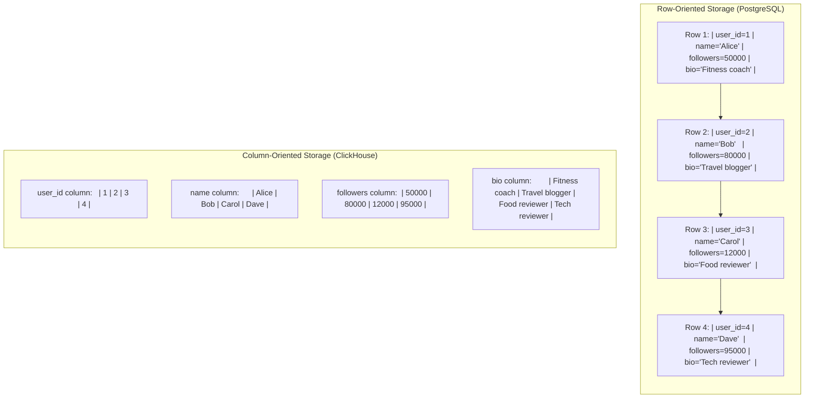

### Why Column Storage Matters for Analytics

Consider the query: `SELECT AVG(followers) FROM profiles WHERE platform = 'INSTAGRAM'`

**Row store (PostgreSQL):**
- Must read ALL columns of every row: user_id, name, followers, bio, platform, ...
- If each row is 500 bytes and you have 1 billion rows = 500 GB of I/O
- Even with a B-tree index on `platform`, the random I/O for fetching individual rows is expensive

**Column store (ClickHouse):**
- Reads only the `followers` column (8 bytes each) and `platform` column (~10 bytes each)
- 1 billion rows x 18 bytes = 18 GB of I/O (vs 500 GB)
- Sequential I/O on contiguous memory -- CPU caches love this
- The `followers` column compresses extremely well (integers with locality)
- After compression: ~3-4 GB of actual disk I/O

**Result:** 100x less data read, sequential access patterns, better compression = 10-100x faster for analytical queries.

### When Row Storage Wins

Row storage is better when you need:
- **Point lookups:** `SELECT * FROM users WHERE id = 123` -- reading one complete row is one I/O operation
- **Transactional writes:** UPDATE/DELETE with ACID guarantees
- **Small result sets:** Queries that return a few complete rows
- **High-frequency single-row inserts:** Each INSERT is one contiguous write

### Trade-off Summary

| Aspect | Row Store (PostgreSQL) | Column Store (ClickHouse) |
|--------|----------------------|--------------------------|
| **SELECT *** (few rows) | Fast (one I/O per row) | Slow (must reconstruct from all columns) |
| **SELECT col1, col2** (many rows) | Slow (reads all columns) | Fast (reads only needed columns) |
| **Aggregations** (SUM, AVG, COUNT) | Slow (processes row by row) | Fast (vectorized on column arrays) |
| **Single row INSERT** | Fast (one write) | Slow (creates a "part" per INSERT) |
| **Batch INSERT** (1000+ rows) | Medium | Very fast (one part, well-compressed) |
| **UPDATE/DELETE** | Native support | Limited (ReplacingMergeTree, mutations) |
| **Compression** | 1-2x | 5-10x |
| **Transactions** | Full ACID | Limited (no multi-row transactions) |

## 1.3 MergeTree Engine Family

MergeTree is ClickHouse's flagship storage engine. It uses an LSM-tree-inspired architecture where data is written as immutable "parts" that are merged asynchronously in the background.

### How MergeTree Works

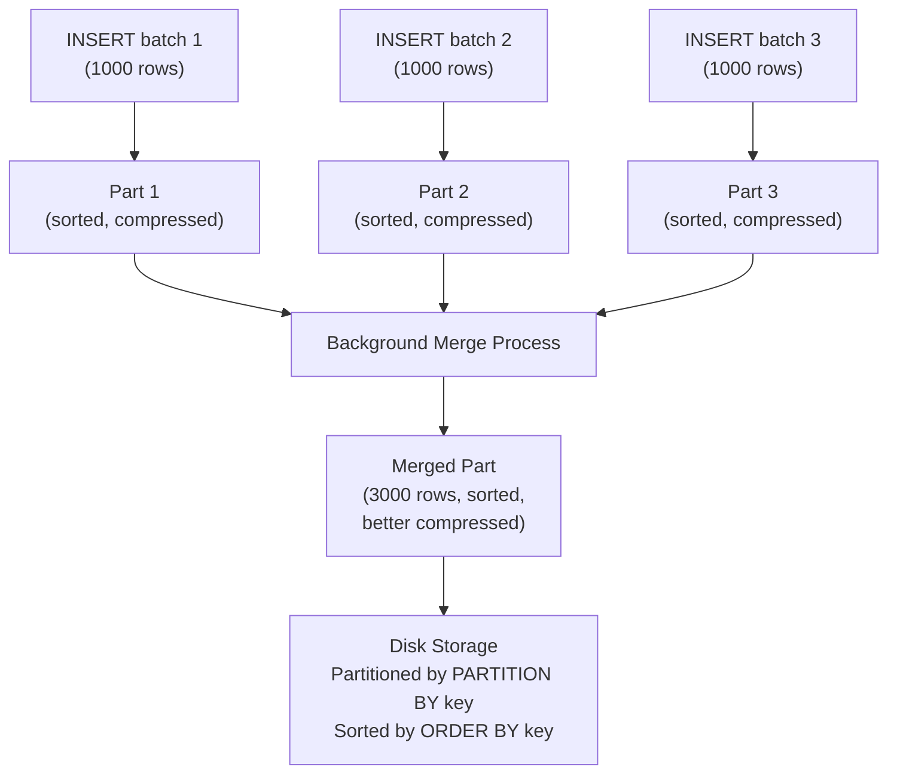

**Write path:**
1. Each INSERT creates a new "part" (directory on disk)
2. Within the part, data is sorted by the ORDER BY key
3. Each column is stored in a separate file, compressed with LZ4 or ZSTD
4. A sparse primary index (every N-th row's key value) is created
5. Background merges combine small parts into larger ones

**Read path:**
1. Partition pruning: skip partitions that cannot match the WHERE clause
2. Primary key pruning: use the sparse index to skip irrelevant "granules" (blocks of 8192 rows)
3. Column pruning: read only the columns referenced in the query
4. Vectorized processing: process data in SIMD-friendly batches

### MergeTree Variants

| Engine | Purpose | When to Use |
|--------|---------|------------|
| **MergeTree** | Basic append-only storage | Log events, time-series data, immutable records |
| **ReplacingMergeTree** | Deduplication by sort key (keeps latest version) | Records that can be updated (orders, user profiles) |
| **AggregatingMergeTree** | Pre-aggregates data during merges | Materialized views for counters, sums, averages |
| **SummingMergeTree** | Sums numeric columns during merges | Running totals, counter tables |
| **CollapsingMergeTree** | Handles updates via "cancel + insert" pairs | Event streams where events can be retracted |
| **VersionedCollapsingMergeTree** | Like Collapsing but with version ordering | Multi-threaded updates to the same key |

### MergeTree in Anshul's Code

```sql
-- From event-grpc/schema/events.sql
-- Append-only log events use plain MergeTree
CREATE TABLE _e.profile_log_events
(
    event_id String,
    source String,
    platform String,
    profile_id String,
    handle Nullable(String),
    event_timestamp DateTime,
    insert_timestamp DateTime,
    metrics String,        -- JSON
    dimensions String      -- JSON
)
ENGINE = MergeTree
PARTITION BY toYYYYMM(event_timestamp)
ORDER BY (platform, profile_id, event_timestamp)
SETTINGS index_granularity = 8192;

-- Time-series with upsert semantics use ReplacingMergeTree
-- Used in Stir's dbt models for mart_time_series
CREATE TABLE dbt.mart_time_series
(
    platform String,
    profile_id String,
    date Date,
    followers UInt64,
    engagement_rate Float64
)
ENGINE = ReplacingMergeTree()
PARTITION BY toYYYYMM(date)
ORDER BY (platform, profile_id, date);
```

**Why plain MergeTree for log events?** Log events are append-only. Each crawl creates a NEW snapshot. We never update an existing event. MergeTree gives raw insertion speed without dedup overhead.

**Why ReplacingMergeTree for time-series?** Multiple dbt runs might produce the same (profile_id, date) row. ReplacingMergeTree keeps only the latest version after background merge, preventing duplicates.

## 1.4 Data Compression

ClickHouse achieves 5-10x compression ratios through two mechanisms:

### Column-Level Compression

Because each column is stored separately, data within a column has high locality:
- A `platform` column containing millions of "INSTAGRAM" and "YOUTUBE" strings compresses to nearly nothing (dictionary encoding)
- A `followers` column of integers has far better entropy than mixed-type rows
- A `bio` column of similar text strings compresses well with LZ4

### Compression Codecs

| Codec | Speed | Ratio | Use Case |
|-------|-------|-------|----------|
| **LZ4** | Very fast (3-4 GB/s decompress) | 2-4x | Default. Best for queries that read lots of data |
| **ZSTD** | Fast (1-2 GB/s decompress) | 4-8x | When storage cost matters more than query speed |
| **Delta + LZ4** | Fast | 5-10x | Monotonically increasing values (timestamps, IDs) |
| **DoubleDelta + LZ4** | Fast | 10-20x | Timestamps with regular intervals |
| **Gorilla** | Fast | 2-5x | Float values (sensor data, metrics) |

### Anshul's Configuration

```go
// From coffee/core/persistence/clickhouse/db.go
clickhouse.Config{
    DefaultCompression:  "LZ4",     // Fast decompression for analytics queries
    DefaultGranularity:  3,         // 8192 rows per granule (sparse index entry)
    DefaultIndexType:    "minmax",  // Stores min/max per granule for partition pruning
}
```

**Why LZ4?** GCC's queries scan millions of rows in real-time (leaderboard rankings, time-series). LZ4's decompression speed (3-4 GB/s) means compression is nearly free at query time. ZSTD would give better ratio but slower decompression -- not worth it when query latency matters.

### The 5x Compression Math

At GCC, the profile_log data in PostgreSQL:
- Row-oriented: each row stores all 9 columns contiguously
- Average row size: ~500 bytes
- 1 billion rows = ~500 GB

In ClickHouse:
- Column-oriented: `platform` column (2 values, dictionary-compressed) ~ 0.1 bytes/row
- `metrics` column (JSON strings with similar structure) ~ 100 bytes/row after LZ4
- `event_timestamp` (monotonic, Delta+LZ4) ~ 2 bytes/row
- Total per row after compression: ~100 bytes
- 1 billion rows = ~100 GB

**Compression ratio: 500 GB / 100 GB = 5x**

## 1.5 Partitioning and Primary Keys

### Partitioning

```sql
PARTITION BY toYYYYMM(event_timestamp)
```

Partitioning physically separates data into directories on disk. Each partition is independent -- queries that filter by the partition key only read relevant partitions.

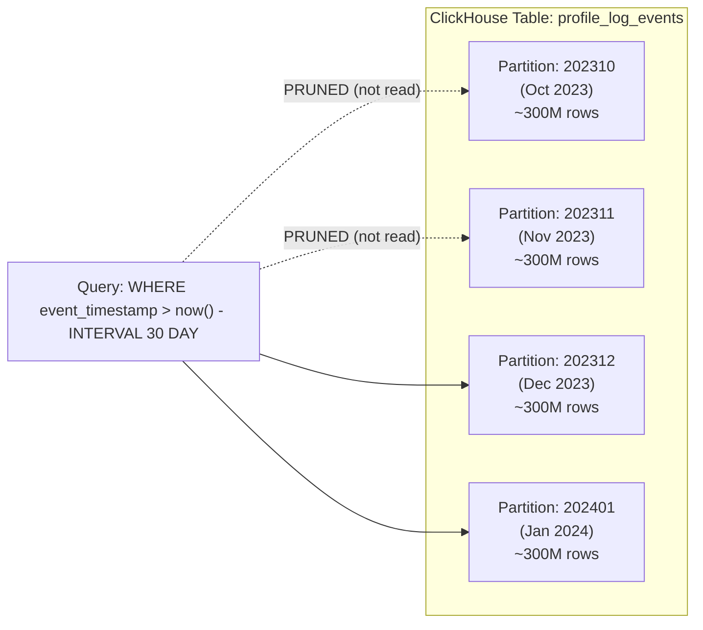

**Monthly vs daily partitioning:**
- Monthly: ~12 partitions/year, each with ~300M rows. Good for ClickHouse merge efficiency.
- Daily: ~365 partitions/year, each with ~10M rows. Too many small partitions = merge overhead, more file handles.
- Exception: `scrape_request_log_events` uses `PARTITION BY (toYYYYMMDD(event_timestamp), flow)` because operational queries are "show me today's failures for this specific flow."

### Primary Keys (ORDER BY)

In ClickHouse, `ORDER BY` defines the physical sort order and the sparse primary index. It is NOT a uniqueness constraint.

```sql
ORDER BY (platform, profile_id, event_timestamp)
```

This means:
1. Data within each partition is sorted by platform, then profile_id, then event_timestamp
2. The sparse index stores the key values for every 8192th row (granule boundary)
3. Queries matching the ORDER BY prefix are extremely fast

**Fast queries (match prefix):**
```sql
WHERE platform = 'INSTAGRAM'                                    -- uses 1st key
WHERE platform = 'INSTAGRAM' AND profile_id = '12345'          -- uses 1st + 2nd
WHERE platform = 'INSTAGRAM' AND profile_id = '12345'
  AND event_timestamp > now() - INTERVAL 30 DAY                -- uses all 3
```

**Slow queries (skip prefix):**
```sql
WHERE event_timestamp > now() - INTERVAL 30 DAY                -- skips platform, profile_id
WHERE profile_id = '12345'                                     -- skips platform
```

### Granularity and Sparse Index

```
index_granularity = 8192 (default)

Sparse Index for ORDER BY (platform, profile_id, event_timestamp):

Granule 0: [INSTAGRAM, 000001, 2023-10-01 00:00:00]
Granule 1: [INSTAGRAM, 000001, 2023-10-01 00:14:32]
Granule 2: [INSTAGRAM, 000045, 2023-10-01 01:22:15]
...
Granule N: [YOUTUBE, 999999, 2023-10-31 23:59:59]

Each granule = 8192 rows. The index stores ONLY the first row's key.
Query: WHERE platform='INSTAGRAM' AND profile_id='000045'
  --> Binary search finds granule 2 as starting point
  --> Reads only relevant granules, skipping millions of rows
```

## 1.6 Materialized Views

Materialized views in ClickHouse are triggers that transform data on INSERT and write results to a target table. Unlike PostgreSQL materialized views (which are periodic snapshots), ClickHouse materialized views are incrementally updated in real time.

```sql
-- Example: Pre-aggregate daily follower counts
CREATE MATERIALIZED VIEW mv_daily_followers
ENGINE = AggregatingMergeTree()
PARTITION BY toYYYYMM(date)
ORDER BY (platform, profile_id, date)
AS SELECT
    platform,
    profile_id,
    toDate(event_timestamp) AS date,
    argMaxState(JSONExtractInt(metrics, 'followers'), event_timestamp) AS followers
FROM _e.profile_log_events
GROUP BY platform, profile_id, date;
```

Every time data is inserted into `profile_log_events`, the materialized view automatically computes the argMax and stores it in the target table. Queries against `mv_daily_followers` are orders of magnitude faster because the aggregation is pre-computed.

**Anshul's usage at GCC:** Instead of ClickHouse materialized views, Anshul used dbt models in the Stir data platform to achieve similar pre-computation. The 112 dbt models (29 staging + 83 marts) transform raw ClickHouse event data into aggregated marts. The dbt approach was chosen because it provides version-controlled SQL transformations, dependency management between models, and the ability to do full refreshes when logic changes.

## 1.7 Distributed Queries

For scaling beyond a single node, ClickHouse supports distributed tables:

```sql
-- Create a local table on each shard
CREATE TABLE profile_log_events_local (...)
ENGINE = ReplicatedMergeTree('/clickhouse/tables/{shard}/profile_log', '{replica}')
PARTITION BY toYYYYMM(event_timestamp)
ORDER BY (platform, profile_id, event_timestamp);

-- Create a distributed table that spans all shards
CREATE TABLE profile_log_events_distributed AS profile_log_events_local
ENGINE = Distributed('cluster_name', 'database', 'profile_log_events_local', sipHash64(profile_id));
```

**How it works:**
- Writes go to the Distributed table, which routes to the appropriate shard based on the sharding key (`sipHash64(profile_id)`)
- Reads query all shards in parallel and merge results on the coordinator node
- Each shard can have replicas via ReplicatedMergeTree for high availability

**At GCC:** Anshul ran a single ClickHouse node (172.31.28.68:9000). At 10M events/day, a single node handled the workload. If volume grew 100x to 1B events/day, the ORDER BY key `(platform, profile_id, event_timestamp)` aligns naturally with a sharding key on `profile_id`, enabling horizontal scaling without query pattern changes.

## 1.8 When to Use ClickHouse vs PostgreSQL vs Elasticsearch

| Criterion | ClickHouse | PostgreSQL | Elasticsearch |
|-----------|-----------|-----------|--------------|
| **Best for** | Analytics, aggregations, time-series | OLTP, CRUD, transactions | Full-text search, log search |
| **Query pattern** | Scan millions of rows, compute aggregates | Lookup by primary key, small result sets | Search by keyword, fuzzy matching |
| **Write pattern** | Large batch inserts | Single-row inserts/updates | Document indexing |
| **Update/Delete** | Expensive (mutations) | Cheap (MVCC) | Cheap (per-document) |
| **Joins** | Limited (denormalize instead) | Full SQL joins | Not designed for joins |
| **Transactions** | No | Full ACID | No |
| **Compression** | 5-10x | 1-2x | 1-3x |
| **Latency (point query)** | Medium (~10ms) | Low (~1ms) | Low (~5ms) |
| **Latency (aggregate 1B rows)** | Low (~1-5s) | Very high (~30s+) | Medium (~5-10s) |
| **Storage cost** | Low (compression) | High (row overhead) | High (inverted index overhead) |

**Anshul's decision at GCC:** PostgreSQL for OLTP (profiles, collections, 27+ tables with ACID) and ClickHouse for OLAP (time-series, leaderboards, analytics scanning millions of rows). The dual-database architecture in Coffee (Go API) uses a shared `DaoProvider` interface with lazy session initialization -- if a request only touches PostgreSQL, ClickHouse never opens a connection.

## 1.9 Write Performance: Batch Inserts

### Why ClickHouse Hates Small Inserts

Each INSERT creates a new "part" on disk. Parts must be merged in the background. Too many small parts causes:
1. **"Too many parts" error** -- ClickHouse rejects writes if parts exceed a threshold
2. **Merge pressure** -- background merges consume CPU and I/O
3. **Read degradation** -- queries must open more files and merge results from many parts

### The Solution: Buffered Batch Inserts

```
WRONG: 10,000 INSERTs of 1 row each = 10,000 parts = DISASTER
RIGHT: 10 INSERTs of 1,000 rows each = 10 parts = EFFICIENT

I/O reduction: 10,000 -> 10 = 99.9% fewer write operations
```

**Anshul's buffered sinker pattern (1000 records/batch):**

```go
// event-grpc/sinker/scrapelogeventsinker.go
func ProfileLogEventsSinker(channel chan interface{}) {
    var buffer []model.ProfileLogEvent
    ticker := time.NewTicker(1 * time.Minute)      // Time trigger: flush every minute
    BufferLimit, _ := strconv.Atoi(os.Getenv("SCRAPE_LOG_BUFFER_LIMIT"))  // Size trigger: ~1000

    for {
        select {
        case v := <-channel:
            buffer = append(buffer, v.(model.ProfileLogEvent))
            if len(buffer) >= BufferLimit {
                FlushProfileLogEvents(buffer)       // Batch INSERT
                buffer = []model.ProfileLogEvent{}
            }
        case _ = <-ticker.C:
            FlushProfileLogEvents(buffer)           // Flush partial batch on timer
            buffer = []model.ProfileLogEvent{}
        }
    }
}
```

**Dual-trigger design:**
- **Size trigger (BufferLimit):** Optimizes throughput during high traffic. Flushes as soon as 1000 events accumulate.
- **Time trigger (ticker):** Bounds latency during low traffic. During quiet hours, a partial batch of 50 events does not sit in memory for hours waiting to reach 1000.

### ClickHouse Best Practices for Writes

1. **Batch size:** 1,000 - 100,000 rows per INSERT (ClickHouse docs recommend this range)
2. **Insert frequency:** No more than 1 INSERT per second per table (to avoid too many parts)
3. **Use Buffer engine for small writes:** If you cannot batch client-side, ClickHouse's Buffer engine accumulates rows in memory and flushes when thresholds are met
4. **Async inserts (v21.11+):** `async_insert=1` lets ClickHouse batch small inserts server-side

## 1.10 Read Performance: Why 2.5x Faster Than PostgreSQL

### The Actual Query Comparison

**PostgreSQL (BEFORE migration):**
```sql
SELECT date_trunc('day', timestamp) as date, MAX(followers) as followers
FROM profile_log
WHERE profile_id = '12345' AND platform = 'INSTAGRAM'
  AND timestamp > now() - interval '30 days'
GROUP BY date_trunc('day', timestamp)
ORDER BY date;
-- Execution time: ~30 seconds
-- Plan: Seq Scan on profile_log (2.5B rows) -> Filter -> Sort -> HashAggregate
```

**ClickHouse (AFTER migration):**
```sql
SELECT toDate(event_timestamp) as date,
       argMax(JSONExtractInt(metrics, 'followers'), event_timestamp) as followers
FROM _e.profile_log_events
WHERE platform = 'INSTAGRAM' AND profile_id = '12345'
  AND event_timestamp > now() - INTERVAL 30 DAY
GROUP BY date
ORDER BY date;
-- Execution time: ~12 seconds
-- Plan: Partition prune (1-2 months) -> Sparse index -> Column scan -> Vectorized aggregate
```

### Why 2.5x Faster -- Factor Breakdown

| Factor | PostgreSQL | ClickHouse | Impact |
|--------|-----------|-----------|--------|
| Data scanned | All 2.5B rows (seq scan) | ~200M rows (1 monthly partition) | 12x less data |
| Columns read | All 9 columns per row | Only `metrics` + `event_timestamp` | 4.5x less I/O |
| Storage format | Row-oriented (500 bytes/row) | Columnar + LZ4 (100 bytes/row) | 5x less disk I/O |
| Aggregation | Row-by-row processing | Vectorized SIMD batches | 3x faster processing |
| Index type | B-tree (pointer chasing) | Sparse index (block-level skip) | Fewer random reads |
| **Combined** | **~30 seconds** | **~12 seconds** | **2.5x improvement** |

## 1.11 Atomic Table Swaps

### The Problem

ClickHouse computes analytics (leaderboards, time-series aggregates) via dbt models. But the Coffee API serves from PostgreSQL. How do you move computed data from ClickHouse to PostgreSQL without downtime?

### The Solution: ClickHouse -> S3 -> PostgreSQL with Atomic Swap

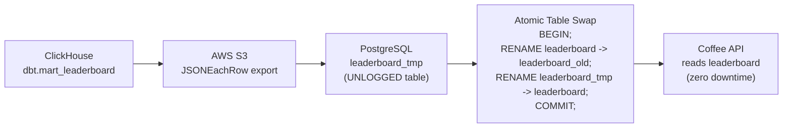

**Step-by-step from Anshul's Stir DAGs:**

```python
# Step 1: ClickHouse exports to S3
# sync_leaderboard_prod.py, lines 21-32
INSERT INTO FUNCTION s3(
    'https://gcc-social-data.s3.ap-south-1.amazonaws.com/data-pipeline/tmp/leaderboard.json',
    '...', '...', 'JSONEachRow'
)
SELECT * FROM dbt.mart_leaderboard
SETTINGS s3_truncate_on_insert=1;

# Step 2: SSH into PostgreSQL server, download from S3
aws s3 cp s3://gcc-social-data/.../leaderboard.json /tmp/leaderboard.json

# Step 3: Load into temp table, transform JSONB -> typed columns
CREATE TEMP TABLE mart_leaderboard(data jsonb);
COPY mart_leaderboard FROM '/tmp/leaderboard.json';
CREATE UNLOGGED TABLE leaderboard_tmp (LIKE leaderboard INCLUDING defaults);
INSERT INTO leaderboard_tmp SELECT (data->>'month')::timestamp, ...

# Step 4: Atomic swap (zero downtime)
BEGIN;
ALTER TABLE "leaderboard" RENAME TO "leaderboard_old_bkp";
ALTER TABLE "leaderboard_tmp" RENAME TO "leaderboard";
COMMIT;
```

**Why this pattern?**
- S3 decouples ClickHouse and PostgreSQL (different networks, failure domains)
- UNLOGGED tables skip WAL during load (2-3x faster for bulk inserts)
- Atomic RENAME is a metadata-only operation (sub-millisecond, no data copy)
- The API never sees a partially-loaded table

## 1.12 ClickHouse Architecture Diagram

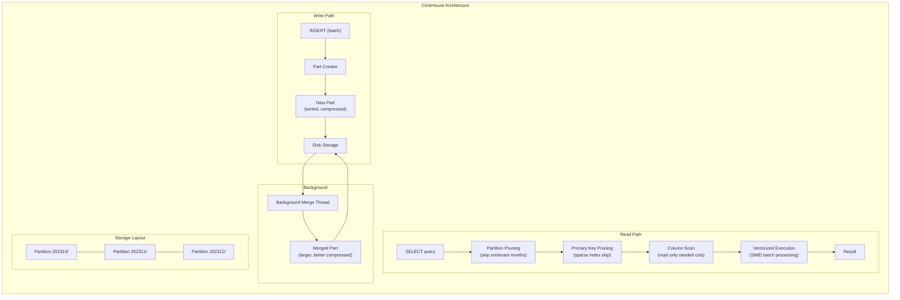

## 1.13 ClickHouse Write Pipeline at GCC

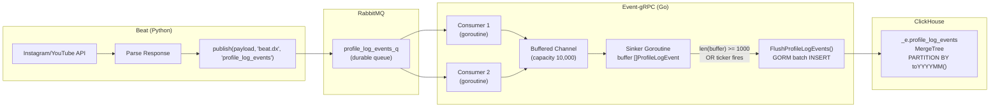

---

# 2. Redis Deep Dive

## 2.1 What Is Redis?

Redis (REmote DIctionary Server) is an in-memory data structure store used as a database, cache, message broker, and streaming engine. It keeps all data in RAM, providing sub-millisecond read/write latency.

**Key properties:**
- **In-memory:** All data in RAM (with optional disk persistence)
- **Single-threaded event loop:** One thread handles all commands (no locking overhead)
- **Rich data structures:** Not just key-value -- supports lists, sets, sorted sets, streams, etc.
- **Atomic operations:** Every command is atomic; MULTI/EXEC for transactions
- **Pub/Sub:** Built-in publish/subscribe messaging
- **Lua scripting:** Server-side scripts for complex atomic operations

## 2.2 Data Structures

### String

The most basic type. Can hold any binary data up to 512 MB.

```
SET user:1:name "Anshul"
GET user:1:name  --> "Anshul"

INCR page:views  --> 1, 2, 3, ...  (atomic increment)
SETEX session:abc 3600 "user_data"  (expires in 1 hour)
```

**Use cases:** Caching, counters, session tokens, rate limit counters.

### Hash

A map of field-value pairs. Like a mini row in a database.

```
HSET user:1 name "Anshul" email "anshul@example.com" role "admin"
HGET user:1 name  --> "Anshul"
HGETALL user:1    --> {name: "Anshul", email: "anshul@example.com", role: "admin"}
HINCRBY user:1 login_count 1  (atomic field increment)
```

**Use cases:** User profiles, configuration objects, any structured data that is accessed field-by-field.

### List

An ordered sequence of strings. Implemented as a doubly-linked list (O(1) push/pop at both ends).

```
LPUSH queue:tasks "task1" "task2" "task3"
RPOP queue:tasks  --> "task1"  (FIFO queue)
BRPOP queue:tasks 30  (blocking pop with 30s timeout)
LRANGE queue:tasks 0 -1  (get all items)
```

**Use cases:** Message queues, recent activity feeds, task queues.

### Set

An unordered collection of unique strings.

```
SADD tags:post:1 "tech" "coding" "go"
SADD tags:post:2 "tech" "python" "ml"
SINTER tags:post:1 tags:post:2  --> {"tech"}  (intersection)
SISMEMBER tags:post:1 "tech"    --> 1 (true)
SCARD tags:post:1               --> 3 (cardinality)
```

**Use cases:** Tags, unique visitors, set operations (intersection, union, difference).

### Sorted Set (ZSet)

Like a Set, but each member has a score. Members are ordered by score.

```
ZADD leaderboard 50000 "alice" 80000 "bob" 12000 "carol"
ZRANGE leaderboard 0 -1 WITHSCORES          --> carol:12000, alice:50000, bob:80000
ZREVRANGE leaderboard 0 2 WITHSCORES        --> bob:80000, alice:50000, carol:12000
ZRANK leaderboard "bob"                      --> 2 (0-indexed from lowest)
ZINCRBY leaderboard 5000 "carol"             --> 17000 (atomic increment)
```

**Use cases:** Leaderboards, priority queues, rate limiting (sliding window), time-based indexes.

### Stream

An append-only log (like a simplified Kafka topic). Added in Redis 5.0.

```
XADD events * user "alice" action "login"
XADD events * user "bob" action "purchase"
XREAD COUNT 10 STREAMS events 0             --> read from beginning
XREAD BLOCK 5000 STREAMS events $           --> blocking read for new entries
```

**Use cases:** Event sourcing, activity streams, message queues with consumer groups.

### HyperLogLog

Probabilistic data structure for counting unique elements with O(1) memory (~12 KB regardless of cardinality).

```
PFADD unique_visitors:2024-01-15 "user1" "user2" "user3" "user1"
PFCOUNT unique_visitors:2024-01-15  --> 3 (approximate, 0.81% error rate)
```

**Use cases:** Counting unique visitors, unique events, cardinality estimation at scale.

### Data Structure Complexity Summary

| Structure | Read | Write | Memory | Ordering |
|-----------|------|-------|--------|----------|
| String | O(1) | O(1) | Low | N/A |
| Hash | O(1) per field | O(1) per field | Medium | Unordered |
| List | O(N) mid, O(1) ends | O(1) ends | Medium | Insertion order |
| Set | O(1) membership | O(1) | Medium | Unordered |
| Sorted Set | O(log N) | O(log N) | High (skiplist) | By score |
| Stream | O(1) append | O(1) | Medium | Chronological |
| HyperLogLog | O(1) | O(1) | ~12 KB fixed | N/A |

## 2.3 Use Cases

| Use Case | Data Structure | Example |
|----------|---------------|---------|
| **Caching** | String, Hash | Cache database query results with TTL |
| **Session store** | String, Hash | Store user session data (JWT session ID -> user info) |
| **Rate limiting** | String + INCR + EXPIRE | Count requests per time window per key |
| **Pub/Sub** | Pub/Sub channels | Real-time notifications, cache invalidation |
| **Leaderboards** | Sorted Set | Rank influencers by followers, engagement |
| **Job queue** | List + BRPOP | Task distribution across workers |
| **Distributed lock** | String + SET NX EX | Prevent duplicate processing |
| **Unique counting** | HyperLogLog | Count unique visitors per day |
| **Event streaming** | Stream | Activity feed, audit log |
| **Geospatial** | Geo (Sorted Set variant) | Find nearby stores, users |

## 2.4 Eviction Policies

When Redis reaches `maxmemory`, it must evict keys to make room. The policy determines which keys to remove.

| Policy | Description | Best For |
|--------|------------|----------|
| **noeviction** | Return errors on writes when memory full | When data loss is unacceptable |
| **allkeys-lru** | Evict least recently used key from ALL keys | General caching |
| **volatile-lru** | Evict LRU key from keys WITH an expiry set | Mixed persistent + cache keys |
| **allkeys-lfu** | Evict least frequently used key from ALL keys | Power-law access patterns |
| **volatile-lfu** | Evict LFU key from keys WITH an expiry set | Mix with frequency-aware eviction |
| **allkeys-random** | Evict a random key | When access pattern is uniform |
| **volatile-random** | Evict random key with expiry | Random eviction, only expired keys |
| **volatile-ttl** | Evict key with shortest TTL remaining | When short-lived keys are expendable |

**LRU vs LFU:**
- **LRU (Least Recently Used):** Evicts keys that haven't been accessed recently. Simple but can evict frequently-used keys that happen to not be accessed in the last few seconds.
- **LFU (Least Frequently Used):** Evicts keys accessed least often over time. Better for workloads where some keys are consistently "hot" (like popular influencer profiles).

**At GCC:** The SaaS Gateway uses Ristretto (in-process cache) with LFU eviction policy, backed by Redis cluster. Ristretto was configured with 10M keys and 1 GB max memory. LFU was chosen because popular influencer profiles are accessed repeatedly, and LFU keeps them hot regardless of momentary access gaps.

## 2.5 Persistence: RDB vs AOF

Redis provides two persistence mechanisms:

### RDB (Redis Database Backup)

Point-in-time snapshots written to disk at configured intervals.

```
save 900 1      # Snapshot if at least 1 key changed in 900 seconds
save 300 10     # Snapshot if at least 10 keys changed in 300 seconds
save 60 10000   # Snapshot if at least 10000 keys changed in 60 seconds
```

**Pros:** Compact binary format, fast restarts, minimal performance impact (fork + COW).
**Cons:** Data loss between snapshots (up to several minutes).

### AOF (Append Only File)

Logs every write command to an append-only file.

```
appendonly yes
appendfsync everysec    # fsync every second (good balance)
# appendfsync always    # fsync every command (safest, slowest)
# appendfsync no        # let OS handle fsync (fastest, least safe)
```

**Pros:** Minimal data loss (at most 1 second with `appendfsync everysec`).
**Cons:** Larger files, slower restarts (replay all commands), needs periodic rewrite.

### Comparison

| Aspect | RDB | AOF |
|--------|-----|-----|
| Data loss window | Minutes | 0-1 second |
| File size | Compact (binary) | Large (command log) |
| Restart speed | Fast (load binary) | Slow (replay commands) |
| Write performance | Minimal impact | Slight impact (append) |
| Recommended for | Backups, disaster recovery | Durability-critical data |

### Hybrid (RDB + AOF)

Redis 4.0+ supports a hybrid approach: AOF rewrite uses RDB format for the base snapshot, then appends incremental AOF commands. This gives fast restarts AND minimal data loss.

## 2.6 Redis Cluster

Redis Cluster provides horizontal scaling through automatic data sharding across multiple nodes.

### Architecture

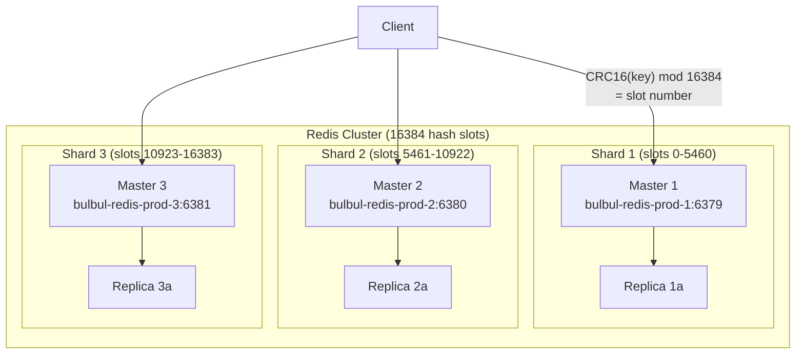

### How Sharding Works

1. Key space is divided into **16384 hash slots**
2. Each key is assigned to a slot: `slot = CRC16(key) % 16384`
3. Each master node owns a range of slots
4. Client libraries (like go-redis) automatically route commands to the correct node
5. If a key moves (cluster rebalancing), the node returns `MOVED` or `ASK` redirections

### At GCC: Redis Cluster Configuration

```go
// saas-gateway/cache/redis.go
singletonRedis = redis.NewClusterClient(&redis.ClusterOptions{
    Addrs:    []string{
        "bulbul-redis-prod-1:6379",
        "bulbul-redis-prod-2:6380",
        "bulbul-redis-prod-3:6381",
    },
    PoolSize: 100,  // 100 connections per node = 300 total
    Password: config.REDIS_CLUSTER_PASSWORD,
})
```

## 2.7 Redis Sentinel

Redis Sentinel provides high availability for non-clustered Redis setups through automatic failover.

```
+----------+     +----------+     +----------+
| Sentinel |     | Sentinel |     | Sentinel |
|    1     |     |    2     |     |    3     |
+-----+----+     +-----+----+     +-----+----+
      |                |                |
      +--------+-------+--------+-------+
               |                |
          +----+----+      +----+----+
          |  Master |----->| Replica |
          +---------+      +---------+
```

**How it works:**
1. Sentinels monitor the master via periodic PING
2. If a majority of sentinels agree the master is down (quorum), they elect a leader
3. The leader promotes a replica to master
4. Clients are notified of the new master address

**Sentinel vs Cluster:**
- **Sentinel:** Single master, automatic failover. No sharding. Good for datasets that fit on one node.
- **Cluster:** Multiple masters, automatic sharding AND failover. Good for datasets too large for one node.

## 2.8 Redis Streams

Redis Streams (since 5.0) provide a Kafka-like append-only log with consumer groups.

```
-- Producer
XADD mystream * sensor_id 1234 temperature 19.8 humidity 45.2

-- Consumer Group (like Kafka consumer groups)
XGROUP CREATE mystream group1 0
XREADGROUP GROUP group1 consumer1 COUNT 10 STREAMS mystream >

-- Acknowledge processed messages
XACK mystream group1 1526569495631-0

-- Pending entries (unacknowledged)
XPENDING mystream group1
```

**Comparison with Pub/Sub:**
- Pub/Sub: fire-and-forget, messages lost if no subscriber
- Streams: persistent, consumer groups, acknowledgment, replay

**Comparison with Kafka:**
- Redis Streams: simpler, lower latency, limited to Redis memory
- Kafka: distributed, persistent to disk, higher throughput, unlimited retention

## 2.9 Pub/Sub

Redis Pub/Sub provides fire-and-forget messaging between publishers and subscribers.

```
-- Subscriber
SUBSCRIBE channel:notifications

-- Publisher
PUBLISH channel:notifications "New influencer added: @alice"

-- Pattern subscribe
PSUBSCRIBE channel:*    (matches channel:notifications, channel:alerts, etc.)
```

**Limitations:**
- Messages are lost if no subscriber is listening (no persistence)
- No message acknowledgment
- No replay capability
- Does not work across Redis Cluster nodes (except with sharded Pub/Sub in Redis 7.0+)

**Use case at GCC:** Potential use for cache invalidation across Gateway instances. When a session is revoked, PUBLISH to a channel that all Gateway instances subscribe to, triggering Ristretto L1 cache eviction.

## 2.10 Distributed Locking (Redlock)

The Redlock algorithm provides distributed mutual exclusion across multiple Redis nodes.

### Single-Instance Lock

```
-- Acquire lock
SET resource:lock <unique_token> NX EX 30   -- NX = only if not exists, EX = 30s TTL
-- Returns OK if acquired, nil if already held

-- Release lock (Lua script for atomicity)
if redis.call("GET", KEYS[1]) == ARGV[1] then
    return redis.call("DEL", KEYS[1])
else
    return 0
end
```

### Redlock Algorithm (Multi-Instance)

1. Get current time in milliseconds
2. Try to acquire the lock on N independent Redis instances (e.g., 5)
3. If lock acquired on majority (N/2 + 1 = 3) within the TTL, lock is held
4. If failed, release lock on all instances

**Controversy:** Martin Kleppmann's critique argues that Redlock is not safe due to clock drift and GC pauses. For strong consistency, use ZooKeeper or etcd. For most practical purposes (preventing duplicate work, rate limiting), single-instance Redis locks with TTL are sufficient.

## 2.11 Redis Caching Patterns

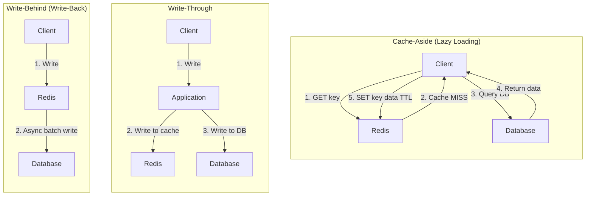

### GCC's Two-Layer Cache Pattern

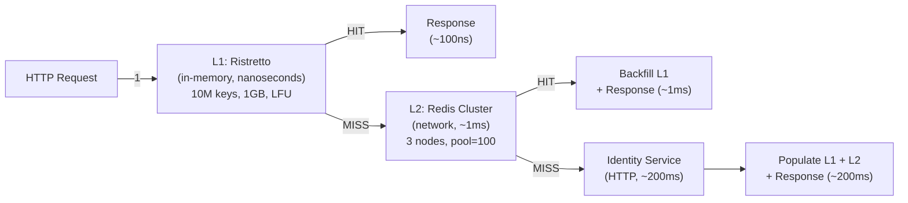

## 2.12 How Anshul Used Redis at GCC

### 1. Two-Layer Auth Cache (SaaS Gateway)

```go
// saas-gateway/middleware/auth.go
// Step 1: Parse JWT, extract session ID
// Step 2: Check Redis (L2) for session existence
keyExists := cache.Redis(gc.Config).Exists("session:" + sessionId)
if exist, err := keyExists.Result(); err == nil && exist == 1 {
    verified = true  // ~1ms Redis lookup saved ~200ms Identity Service call
}
```

**Impact:** Auth validation went from ~200ms (HTTP call to Identity Service) to ~1ms (Redis EXISTS). With 100% of authenticated requests hitting this path, this was the largest single contributor to the 25% API response improvement.

### 2. Three-Level Stacked Rate Limiting (Beat)

```python
# beat/server.py
redis = AsyncRedis.from_url(os.environ["REDIS_URL"])

# Level 1: Daily global limit
async with RateLimiter(unique_key="refresh_profile_insta_daily",
                       backend=redis, rate_spec=RateSpec(requests=20000, seconds=86400)):
    # Level 2: Per-minute burst control
    async with RateLimiter(unique_key="refresh_profile_insta_per_minute",
                           backend=redis, rate_spec=RateSpec(requests=60, seconds=60)):
        # Level 3: Per-handle dedup
        async with RateLimiter(unique_key="refresh_profile_insta_per_handle_" + handle,
                               backend=redis, rate_spec=RateSpec(requests=1, seconds=1)):
            await refresh_profile(None, handle, session=session)
```

Each level uses Redis to track request counts with TTL-based expiration. All 150+ Beat worker processes share the same Redis cluster, ensuring global rate limit enforcement.

### 3. Source-Specific API Rate Limiting (Beat Workers)

```python
# beat/utils/request.py
source_specs = {
    'youtube138':              RateSpec(requests=850, seconds=60),
    'insta-best-performance':  RateSpec(requests=2, seconds=1),
    'instagram-scraper2':      RateSpec(requests=5, seconds=1),
    'rocketapi':               RateSpec(requests=100, seconds=30),
    'youtubev31':              RateSpec(requests=500, seconds=60),
}

async def make_request_limited(source, method, url, **kwargs):
    redis = AsyncRedis.from_url(os.environ["REDIS_URL"])
    while True:
        try:
            async with RateLimiter(unique_key=source, backend=redis,
                                   cache_prefix="beat_", rate_spec=source_specs[source]):
                resp = await asks.request(method, url, **kwargs)
                return resp
        except RateLimitError:
            await asyncio.sleep(1)
```

### 4. Coffee API Session Cache

```go
// coffee/core/persistence/redis/redis.go
singletonRedis = redis.NewClusterClient(&redis.ClusterOptions{
    Addrs:    redisClusterAddresses,
    PoolSize: 100,
    Password: password,
})
```

Redis stores session data and hot profile data for the Coffee Go API, reducing PostgreSQL load for frequently accessed influencer profiles.

---

# 3. RabbitMQ Deep Dive

## 3.1 What Is RabbitMQ?

RabbitMQ is an open-source message broker that implements the Advanced Message Queuing Protocol (AMQP). It routes messages from producers to consumers through exchanges and queues, providing reliable asynchronous communication between services.

**Key properties:**
- **AMQP 0-9-1 protocol:** Standardized messaging protocol with rich routing semantics
- **Exchange-based routing:** Messages are published to exchanges, which route to queues based on rules
- **Per-message acknowledgment:** Consumers explicitly ACK messages after processing
- **Durable queues:** Messages survive broker restarts when marked as persistent
- **Dead letter routing:** Failed messages can be routed to error queues for inspection
- **Flexible topology:** Direct, fanout, topic, and headers exchange types cover most routing patterns

## 3.2 Architecture: Producer -> Exchange -> Queue -> Consumer

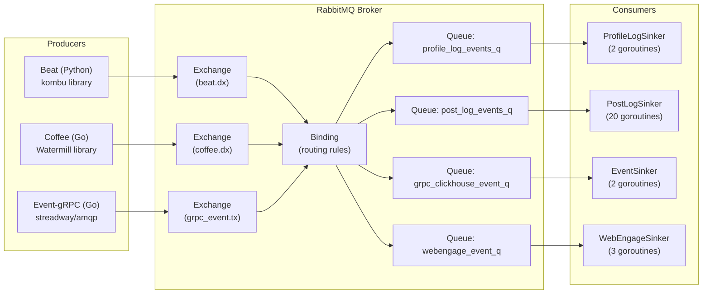

### Message Lifecycle

1. **Producer** publishes a message to an **Exchange** with a **routing key**
2. **Exchange** evaluates the routing key against **bindings** to determine which **queues** receive the message
3. **Queue** stores the message durably (if configured) until a consumer fetches it
4. **Consumer** receives the message and sends an **ACK** (acknowledgment) after processing
5. **RabbitMQ** removes the message from the queue only after ACK is received

## 3.3 Exchange Types

### Direct Exchange

Routes messages to queues whose binding key exactly matches the routing key.

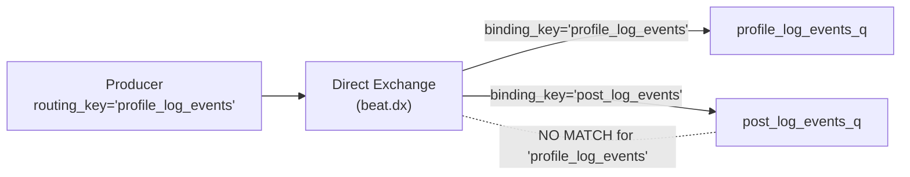

**At GCC:** `beat.dx` is a direct exchange. Beat publishes with routing key `profile_log_events`, and only `profile_log_events_q` receives the message.

### Fanout Exchange

Routes messages to ALL bound queues, ignoring the routing key.

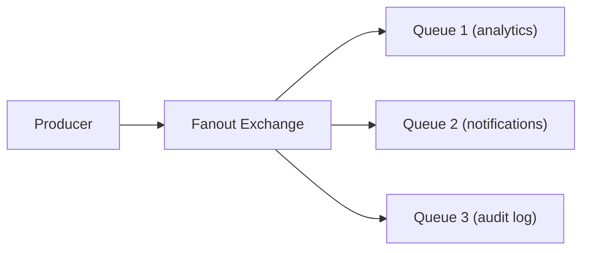

**Use case:** Broadcast events to multiple consumers. Example: a new influencer signup triggers analytics processing, notification sending, and audit logging simultaneously.

### Topic Exchange

Routes messages based on wildcard pattern matching on the routing key.

```
Routing key format: word1.word2.word3

Binding patterns:
  *.instagram.*     matches "profile.instagram.refresh" but not "post.youtube.refresh"
  profile.#         matches "profile.instagram.refresh" and "profile.youtube.refresh.full"

  *  = exactly one word
  #  = zero or more words
```

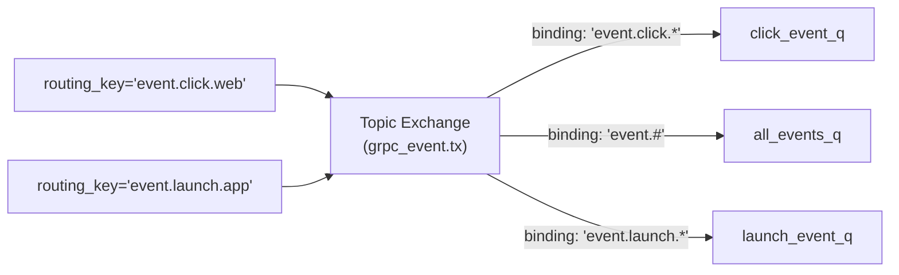

**At GCC:** `grpc_event.tx` and `branch_event.tx` are topic exchanges, allowing flexible routing of 60+ event types to different consumers based on event name patterns.

### Headers Exchange

Routes based on message headers (key-value pairs) instead of routing key. Supports `x-match: all` (AND) or `x-match: any` (OR).

**Use case:** Rare. Used when routing depends on multiple attributes that cannot be encoded in a single routing key.

### Exchange Type Comparison

| Exchange | Routing Mechanism | Example Use Case | GCC Usage |
|----------|------------------|-----------------|-----------|
| **Direct** | Exact routing key match | Point-to-point messaging | `beat.dx`, `identity.dx`, `shopify_event.dx` |
| **Fanout** | Broadcast to all queues | Event broadcasting | Not used at GCC |
| **Topic** | Wildcard pattern matching | Multi-type event routing | `grpc_event.tx`, `branch_event.tx` |
| **Headers** | Header-based matching | Complex routing rules | Not used at GCC |

## 3.4 Acknowledgments and Confirms

### Consumer Acknowledgments

After receiving a message, a consumer must acknowledge it. Until ACK is sent, RabbitMQ keeps the message and will redeliver if the consumer disconnects.

```
Auto-ACK (autoAck=true):
  Message is ACKed immediately upon delivery
  FAST but RISKY -- message lost if consumer crashes mid-processing

Manual ACK (autoAck=false):
  Consumer must explicitly call channel.Ack(deliveryTag)
  SAFE -- message redelivered if consumer crashes

NACK (Negative Acknowledgment):
  channel.Nack(deliveryTag, requeue=true)   -- put back in queue
  channel.Nack(deliveryTag, requeue=false)  -- send to dead letter exchange
```

**At GCC:** Event-gRPC uses manual ACK. For buffered consumers, messages are ACKed after pushing to the Go channel (early ACK for throughput). For direct consumers, messages are ACKed after successful ClickHouse write.

### Publisher Confirms

Optional mechanism where the broker ACKs back to the producer after the message is persisted.

```
channel.Confirm(false)  // Enable confirm mode
channel.Publish(...)
// Wait for broker ACK
select {
case <-channel.NotifyPublish(make(chan amqp.Confirmation)):
    // Message confirmed by broker
}
```

**At GCC:** Beat's `kombu` publisher does not use publisher confirms. This is a deliberate trade-off: faster publishing at the cost of potential message loss if RabbitMQ crashes between receiving the message and persisting it. For log data, this is acceptable.

## 3.5 Dead Letter Exchanges

When a message cannot be processed, it can be routed to a Dead Letter Exchange (DLX) for inspection, alerting, or retry.

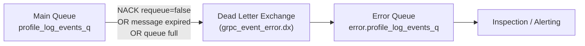

**Triggers for dead lettering:**
1. Consumer sends `NACK` with `requeue=false`
2. Message TTL expires (per-message or per-queue `x-message-ttl`)
3. Queue exceeds its max length (`x-max-length`)

**At GCC's retry logic:**

```go
// event-grpc/rabbit/rabbit.go
// If processing fails, increment x-retry-count header
retryCount := getRetryCount(delivery.Headers)
if retryCount >= 2 {
    // Send to error exchange (dead letter) after 2 retries
    publishToErrorExchange(delivery.Body, errorExchange, errorRoutingKey)
} else {
    // Republish with incremented retry count
    republish(delivery.Body, exchange, routingKey, retryCount+1)
}
```

## 3.6 Prefetch Count (QoS)

Prefetch count limits how many unacknowledged messages a consumer can hold at once.

```
channel.Qos(prefetch=1, size=0, global=false)
```

- `prefetch=1`: Consumer gets 1 message, must ACK before getting another
- `prefetch=10`: Consumer can hold 10 unacknowledged messages (higher throughput, less fair)
- `prefetch=0`: No limit (dangerous -- can overwhelm consumer)

**At GCC:** Prefetch QoS is set to 1 for all consumers. For buffered consumers (which just push to a Go channel), this is fine because the consumer is fast. For direct consumers like `SinkEventToClickhouse`, prefetch=1 provides natural backpressure -- if ClickHouse is slow, the consumer blocks, RabbitMQ stops delivering, and messages safely queue up.

## 3.7 Clustering and Mirrored Queues

### RabbitMQ Clustering

Multiple RabbitMQ nodes form a cluster. Exchanges and bindings are replicated across all nodes. Queues live on a single node by default (for performance).

### Classic Mirrored Queues (deprecated in 3.13)

Queues can be mirrored across cluster nodes for high availability:

```
ha-mode: exactly
ha-params: 2         -- Mirror to 2 nodes
ha-sync-mode: automatic
```

### Quorum Queues (recommended since 3.8)

Raft-consensus-based queues that replace mirrored queues:

```
channel.QueueDeclare("my_queue", durable, false, false, false,
    amqp.Table{"x-queue-type": "quorum"})
```

**Advantages of quorum queues:**
- Stronger consistency guarantees (Raft consensus)
- Better performance under failure conditions
- Automatic leader election
- Data safety during network partitions

## 3.8 RabbitMQ vs Kafka -- Detailed Comparison

| Aspect | RabbitMQ | Kafka |
|--------|---------|-------|
| **Model** | Message broker (smart broker, dumb consumer) | Distributed commit log (dumb broker, smart consumer) |
| **Routing** | Exchange-based (direct, topic, fanout, headers) | Topic + partition-based |
| **Message delivery** | Push to consumer | Consumer pulls from log |
| **Ordering** | Per-queue FIFO | Per-partition FIFO |
| **Acknowledgment** | Per-message ACK/NACK | Consumer offset commit |
| **Message replay** | No (message deleted after ACK) | Yes (consumer can reset offset) |
| **Dead letter** | Built-in DLX routing | Requires custom implementation |
| **Retention** | Until consumed and ACKed | Time-based or size-based (can retain forever) |
| **Throughput** | ~50K-100K msg/sec per node | ~1M msg/sec per broker |
| **Latency** | Sub-millisecond | Low milliseconds |
| **Backpressure** | Prefetch QoS + flow control | Consumer-driven (pull model) |
| **Consumer groups** | Competing consumers on same queue | Kafka consumer groups (partition assignment) |
| **Protocol** | AMQP 0-9-1 | Custom binary protocol |
| **Clustering** | Quorum queues (Raft) | ISR replication |
| **Use case** | Task queues, RPC, complex routing | Event streaming, log aggregation, CDC |
| **Operational complexity** | Medium (Erlang VM) | High (ZooKeeper/KRaft, topic management) |
| **Best for** | Thousands of queues, diverse routing patterns | High-volume streams, event replay, CDC |

### When to Choose RabbitMQ

- Per-message acknowledgment and retry semantics
- Complex routing patterns (topic, headers, dead letter)
- Priority queues
- RPC (request-reply) pattern
- Lower volume (<100K msg/sec) with routing complexity
- Team already familiar with AMQP

### When to Choose Kafka

- Very high throughput (>100K msg/sec sustained)
- Message replay / event sourcing
- Log compaction (keep latest value per key)
- Stream processing (Kafka Streams, ksqlDB)
- CDC (Change Data Capture) with Debezium
- Multiple consumers reading the same data independently

### Why Anshul Chose RabbitMQ at GCC

> "RabbitMQ was already the messaging backbone for GCC -- used for credential validation, identity events, WebEngage events, and more. At 10M events/day (~115 events/sec average), RabbitMQ handles it comfortably. The exchange-based routing let us fan out events to different sinkers (some buffered, some direct) without consumer coordination. RabbitMQ's per-message acknowledgment with retry and dead-letter semantics was simpler than managing Kafka consumer offsets. The operational overhead of a Kafka cluster with ZooKeeper was not justified at our scale."

## 3.9 RabbitMQ Architecture at GCC

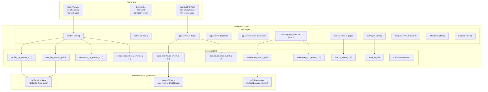

### Exchange-to-Queue Routing Table (from actual code)

| Exchange | Routing Key | Queue | Consumers | Type |
|----------|------------|-------|-----------|------|
| `beat.dx` | `profile_log_events` | `profile_log_events_q` | 2 | Buffered |
| `beat.dx` | `post_log_events` | `post_log_events_q` | 20 | Buffered |
| `beat.dx` | `sentiment_log_events` | `sentiment_log_events_q` | 2 | Buffered |
| `beat.dx` | `post_activity_log_events` | `post_activity_log_events_q` | 2 | Buffered |
| `beat.dx` | `profile_relationship_log_events` | `profile_relationship_log_events_q` | 2 | Buffered |
| `beat.dx` | `scrape_request_log_events` | `scrape_request_log_events_q` | 2 | Buffered |
| `beat.dx` | `order_log_events` | `order_log_events_q` | 2 | Buffered |
| `identity.dx` | `trace_log` | `trace_log` | 2 | Buffered |
| `grpc_event.tx` | (event type) | `grpc_clickhouse_event_q` | 2 | Direct |
| `grpc_event.tx` | (click events) | `clickhouse_click_event_q` | 2 | Direct |
| `grpc_event.tx` | (app init) | `app_init_event_q` | 2 | Direct |
| `webengage_event.dx` | (events) | `webengage_event_q` | 3 | Direct (API forward) |
| `webengage_event.dx` | (events) | `webengage_ch_event_q` | 5 | Direct (ClickHouse) |
| `branch_event.tx` | (events) | `branch_event_q` | 2 | Direct |

## 3.10 GCC Event Pipeline Diagram

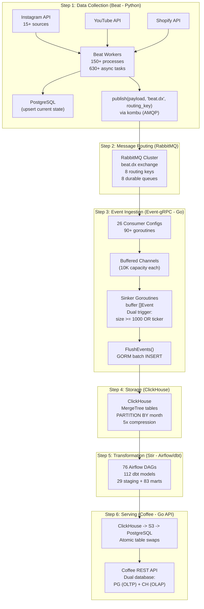

---

# 4. Comparison Tables

## 4.1 ClickHouse vs PostgreSQL vs MySQL vs MongoDB

| Feature | ClickHouse | PostgreSQL | MySQL (InnoDB) | MongoDB |
|---------|-----------|-----------|---------------|---------|
| **Type** | Column-oriented OLAP | Row-oriented OLTP | Row-oriented OLTP | Document store |
| **Best for** | Analytics, aggregations | Complex queries, ACID | Simple CRUD, replication | Flexible schema, documents |
| **Storage** | Columnar, compressed | Row-based, MVCC | Row-based, clustered index | BSON documents |
| **Compression** | 5-10x | 1-2x | 1-2x | 1-3x |
| **Write pattern** | Batch inserts (1000+) | Single-row ACID writes | Single-row ACID writes | Document inserts |
| **Read pattern** | Full table scans, aggregates | Index-based lookups | Index-based lookups | Document lookups, aggregation pipeline |
| **Joins** | Limited (no subqueries in some contexts) | Full SQL | Full SQL | $lookup (limited) |
| **Transactions** | No | Full ACID | Full ACID | Multi-document (since 4.0) |
| **UPDATE/DELETE** | Expensive mutations | Native MVCC | Native | Native |
| **Replication** | ReplicatedMergeTree | Streaming replication | Built-in async/semi-sync | Replica sets |
| **Sharding** | Distributed tables | Manual / Citus | MySQL Cluster / Vitess | Native auto-sharding |
| **SQL support** | Most of ANSI SQL | Full SQL | Full SQL | MQL (MongoDB Query Language) |
| **Latency (point)** | ~10ms | ~1ms | ~1ms | ~1ms |
| **Latency (1B rows)** | ~1-5s | ~30s+ | ~30s+ | ~20s+ |
| **Scale** | PB-scale analytics | TB-scale OLTP | TB-scale OLTP | PB-scale documents |

## 4.2 Redis vs Memcached

| Feature | Redis | Memcached |
|---------|-------|-----------|
| **Data structures** | Strings, Hashes, Lists, Sets, Sorted Sets, Streams, HyperLogLog, Bitmaps, Geospatial | Strings only |
| **Threading** | Single-threaded (multi-threaded I/O in 6.0+) | Multi-threaded |
| **Persistence** | RDB + AOF | None (pure cache) |
| **Replication** | Master-replica | None built-in |
| **Clustering** | Redis Cluster (16384 hash slots) | Client-side consistent hashing |
| **Pub/Sub** | Built-in | None |
| **Lua scripting** | Built-in | None |
| **Transactions** | MULTI/EXEC | None |
| **Max value size** | 512 MB | 1 MB (default) |
| **Eviction** | 8 policies (LRU, LFU, TTL, random) | LRU only |
| **Memory efficiency** | Higher overhead per key | Lower overhead per key |
| **Use case** | Rich data structures, persistence, pub/sub | Simple high-throughput key-value caching |
| **When to choose** | Need data structures beyond strings, persistence, or pub/sub | Pure caching with maximum throughput, multi-threaded CPU utilization |

## 4.3 RabbitMQ vs Kafka vs SQS

| Feature | RabbitMQ | Apache Kafka | AWS SQS |
|---------|---------|-------------|---------|
| **Model** | Message broker | Distributed commit log | Managed queue service |
| **Protocol** | AMQP 0-9-1 | Custom binary | HTTP/HTTPS |
| **Routing** | Exchange-based (direct, topic, fanout, headers) | Topic + partition | Queue-based (no routing) |
| **Ordering** | Per-queue FIFO | Per-partition FIFO | Best-effort (FIFO queues available) |
| **Delivery** | Push to consumer | Consumer pull | Consumer poll |
| **Acknowledgment** | Per-message ACK/NACK | Offset commit | Delete after processing |
| **Replay** | No | Yes (reset consumer offset) | No |
| **Retention** | Until ACKed | Configurable (hours to forever) | 1-14 days |
| **Throughput** | ~50K-100K msg/sec | ~1M msg/sec per broker | ~3K msg/sec (standard), ~30K (FIFO) |
| **Latency** | Sub-ms | Low ms | 1-100ms |
| **Dead letter** | Built-in DLX | Manual | Built-in DLQ |
| **Backpressure** | Prefetch QoS + flow control | Consumer-driven | Visibility timeout |
| **Scaling** | Quorum queues + cluster | Add brokers + partitions | Automatic (managed) |
| **Operations** | Self-managed (Erlang) | Self-managed (JVM) | Fully managed (AWS) |
| **Cost model** | Server cost | Server cost + storage | Per-request pricing |
| **Best for** | Complex routing, RPC, task queues | High-volume streaming, event replay | Simple cloud-native queuing |
| **GCC usage** | Event pipeline (Beat -> Event-gRPC) | Not used | Fake follower analysis (batch jobs) |

---

# 5. Interview Questions and Answers (20+)

## ClickHouse Questions

### Q1: "Why did you choose ClickHouse over PostgreSQL for analytics?"

> "PostgreSQL was choking on 10M log writes per day. Write latency went from 5ms to 500ms per INSERT, and analytics queries scanning billions of rows took 30+ seconds. The root cause was that PostgreSQL's row-oriented storage reads entire rows even when you only need 2 columns for an aggregation. ClickHouse's columnar storage reads only the columns needed, compresses them 5x better, and uses vectorized SIMD execution for aggregations. Our time-series queries went from 30 seconds to 12 seconds -- a 2.5x improvement. The trade-off was that ClickHouse cannot do ACID updates, so we kept PostgreSQL for OLTP (profiles, collections, users) and used ClickHouse purely for OLAP (time-series, leaderboards, analytics)."

### Q2: "How does ClickHouse's MergeTree engine work internally?"

> "MergeTree uses an LSM-tree-inspired design. Each INSERT creates a new immutable 'part' -- a directory on disk containing one file per column, all sorted by the ORDER BY key. A sparse primary index records the key value at every 8192nd row (one granule). Background merge threads periodically combine small parts into larger ones, improving compression and read performance.
>
> The key insight is that ClickHouse optimizes for batch writes. One INSERT of 1000 rows creates 1 part. 1000 INSERTs of 1 row each creates 1000 parts, which causes merge pressure and eventually a 'too many parts' error. That is why we built the buffered sinker pattern -- accumulating events in Go slices and flushing in batches of 1000."

### Q3: "Explain the difference between MergeTree and ReplacingMergeTree."

> "MergeTree is append-only -- it stores every row as inserted, even if duplicates exist. ReplacingMergeTree adds deduplication: during background merges, it keeps only the latest version of rows with the same ORDER BY key.
>
> At GCC, we used MergeTree for log events (profile_log_events, post_log_events) because each crawl creates a unique snapshot -- there are no 'updates.' We used ReplacingMergeTree for time-series marts (mart_time_series) where dbt might produce the same (profile_id, date) combination across multiple runs, and we want only the latest values.
>
> Important caveat: ReplacingMergeTree only deduplicates during merges, not at query time. To guarantee unique results, you need `FINAL` keyword or `argMax()` aggregation in your queries."

### Q4: "How did you implement buffered sinkers? Why 1000 records per batch?"

> "The buffered sinker pattern has three components: a Go buffered channel (10K capacity) as an in-memory queue, a sinker goroutine that reads from the channel and accumulates events in a slice, and dual-trigger flushing -- size-based (when the slice reaches SCRAPE_LOG_BUFFER_LIMIT) and time-based (when a ticker fires).
>
> We chose 1000 as the batch size based on four factors: ClickHouse docs recommend batches of 1000-100000 rows; 1000 events at ~500 bytes each is ~500 KB per INSERT which is well within network and memory limits; at 115 events/sec average, 1000 events accumulate in ~9 seconds which combined with the 1-minute ticker gives acceptable latency; and we empirically tuned upward from 100 after observing 'too many parts' warnings."

### Q5: "What is an atomic table swap and why did you use it?"

> "An atomic table swap uses PostgreSQL's RENAME operation -- which is a metadata-only change -- to swap a fully-loaded new table into the place of the old one within a single transaction. The API never sees a partially-loaded table.
>
> We needed this because our data flows from ClickHouse (analytics) to PostgreSQL (API serving) through S3. The load process takes minutes for large tables like leaderboard (500K+ rows). Without atomic swap, the API would either see an empty table during loading or need to query ClickHouse directly (which is on a different network). The swap pattern lets us load into a temp table with UNLOGGED mode for speed, build indexes, and then swap in sub-millisecond time."

## Redis Questions

### Q6: "How does Redis handle cache invalidation?"

> "Redis supports several invalidation approaches. The simplest is TTL-based: SET key value EX 300 means the key auto-expires in 300 seconds. This is eventual consistency -- stale data exists for up to TTL duration.
>
> For stronger invalidation, you can explicitly DELETE the key when the underlying data changes. In a distributed system with multiple cache layers (like our Ristretto L1 + Redis L2), you can use Redis Pub/Sub to broadcast invalidation events: when a session is revoked, PUBLISH the event to all gateway instances, which then evict from their local Ristretto cache.
>
> At GCC, we used TTL-based invalidation for session data in Redis (TTL matches JWT expiry). The Ristretto L1 cache relies on LFU eviction rather than explicit invalidation. This is a deliberate trade-off: for an analytics dashboard (not a banking app), serving a revoked session for a few seconds before LFU eviction is acceptable."

### Q7: "What is a 3-level stacked rate limiter?"

> "It is three nested rate limiters, each protecting against a different abuse pattern. At GCC's Beat service:
>
> Level 1 (Daily Global): 20,000 requests per day across all workers. Protects against cost overruns on third-party APIs.
>
> Level 2 (Per-Minute): 60 requests per minute globally. Smooths out burst traffic to avoid triggering provider-side throttling.
>
> Level 3 (Per-Handle): 1 request per second per Instagram handle. Prevents duplicate scrapes of the same profile within 1 second.
>
> Each limiter uses Redis as backend (shared across all 150+ worker processes). The levels are stacked as nested `async with RateLimiter(...)` contexts in Python. All three must pass for the request to proceed. Each can be tuned independently -- changing the daily budget does not affect per-handle dedup logic."

### Q8: "Explain Redis Cluster's hash slot mechanism."

> "Redis Cluster divides the key space into 16384 hash slots. Each key maps to a slot via `CRC16(key) % 16384`. Each master node owns a range of slots -- for example, with 3 masters: node1 owns slots 0-5460, node2 owns 5461-10922, node3 owns 10923-16383.
>
> When a client sends a command, the client library computes the slot for the key and routes to the correct node. If the key moved (during resharding), the node responds with a MOVED redirect, and the client updates its slot mapping. ASK redirects handle in-progress migrations.
>
> Multi-key operations (MGET, transactions) only work if all keys map to the same slot. You can force co-location using hash tags: `{user:1}:name` and `{user:1}:email` both hash on 'user:1' and land on the same slot."

### Q9: "Why did you use Ristretto + Redis instead of just Redis?"

> "Network latency. Redis adds ~1ms per lookup. Ristretto (in-process cache) adds ~100 nanoseconds. For auth validation that happens on every single authenticated request, that 1ms matters. With 1000 requests/second, that is 1 full second of cumulative latency saved every second.
>
> Ristretto acts as L1 for the hottest data (active sessions), while Redis acts as L2 shared across all gateway instances. The implementation is trivial -- a `sync.Once` singleton for each -- and the consistency trade-off is minimal because sessions are long-lived. If we needed stronger invalidation, we would add Redis Pub/Sub to broadcast eviction events to all gateway instances' Ristretto caches."

## RabbitMQ Questions

### Q10: "Explain RabbitMQ exchange types. Which did you use?"

> "There are four exchange types. Direct exchanges route messages to queues whose binding key exactly matches the routing key -- we used this for `beat.dx`, where each event type has its own routing key and queue. Topic exchanges route based on wildcard patterns -- we used this for `grpc_event.tx`, where 60+ event types are routed to different queues based on name patterns. Fanout broadcasts to all bound queues regardless of routing key -- we did not need this. Headers exchanges route based on message header attributes -- also not needed.
>
> At GCC, we had 11 exchanges: 8 direct exchanges for point-to-point routing (beat.dx, identity.dx, shopify_event.dx, etc.) and 3 topic exchanges for flexible event routing (grpc_event.tx, branch_event.tx, coffee.dx)."

### Q11: "How does RabbitMQ handle backpressure?"

> "Three layers of backpressure cascade naturally in RabbitMQ.
>
> First, prefetch QoS. We set `channel.Qos(1, 0, false)` -- each consumer can hold at most 1 unacknowledged message. If the consumer is slow (because ClickHouse is slow), it stops ACKing, so RabbitMQ stops delivering.
>
> Second, queue depth. Messages pile up in the queue. RabbitMQ stores them to disk when memory pressure increases (page out). The queue can grow until disk is full.
>
> Third, flow control. If the broker itself is overwhelmed (memory or disk threshold exceeded), it blocks publisher connections. Beat's `publish()` call would block until the broker recovers.
>
> At GCC, we added a fourth layer: the buffered Go channel (10K capacity). If ClickHouse is slow, the channel fills up, the consumer goroutine blocks on `eventBuffer <- *event`, cannot ACK the RabbitMQ message, and backpressure cascades back to the queue. This is intentional -- the system slows down gracefully instead of crashing."

### Q12: "How did your GCC pipeline handle message failures?"

> "At three levels. First, within the consumer: if JSON parsing fails, the message is NACKed and sent to the dead letter exchange (error queue). Second, if processing fails (ClickHouse temporarily unavailable), the message is republished with an incremented `x-retry-count` header. After 2 retries, it goes to the error queue.  Third, for the RabbitMQ connection itself: `event-grpc` has an auto-reconnect loop that listens for `NotifyClose` events and reconnects with 1-second backoff. The `safego.GoNoCtx` wrapper on every goroutine catches panics so a single crashed consumer does not take down the service.
>
> One thing I would improve: the early-ACK pattern in buffered consumers means if the sinker's `FlushProfileLogEvents()` fails, those events are lost (already ACKed from RabbitMQ). I would change to late-ACK -- only ACK after successful ClickHouse flush -- trading throughput for reliability."

### Q13: "Why RabbitMQ instead of Kafka for your pipeline?"

> "Three reasons specific to our situation. First, RabbitMQ was already the GCC messaging backbone -- 11 exchanges, 26+ queues serving credential validation, identity events, and more. The team had operational expertise. Second, at ~115 events/sec average (10M/day), RabbitMQ handles it easily. Kafka's sweet spot is millions of events/sec where its partitioned log model provides throughput advantages. Third, RabbitMQ's per-message ACK with dead-letter routing was a natural fit for our failure handling. With Kafka, we would need to manage consumer offsets, handle poison messages by skipping offsets, and implement dead-letter topics manually.
>
> If we reached 100x volume (1B events/day), I would migrate to Kafka for its partitioned consumption, log compaction, and consumer group rebalancing."

## Cross-Technology Questions

### Q14: "Walk me through the complete data flow at GCC."

> "Starting from a single Instagram profile crawl:
>
> 1. A Beat worker claims a pending task from PostgreSQL using `FOR UPDATE SKIP LOCKED`
> 2. It calls the Instagram API (rate-limited via Redis-backed limiters)
> 3. It parses the response, upserts current data to PostgreSQL (OLTP)
> 4. It publishes a profile_log event to RabbitMQ (`beat.dx` exchange, `profile_log_events` routing key)
> 5. Event-gRPC's consumer goroutine receives the message, pushes to a buffered Go channel
> 6. The sinker goroutine accumulates events and flushes 1000 at a time to ClickHouse (batch INSERT)
> 7. Stir's Airflow DAGs run dbt models that transform raw ClickHouse events into analytics marts
> 8. Sync DAGs export marts from ClickHouse to S3 as JSON
> 9. SSH downloads the JSON to the PostgreSQL server, loads into a temp table
> 10. Atomic table swap makes the new data live for the Coffee REST API
>
> End-to-end latency from API call to queryable ClickHouse row: under 6 minutes. From ClickHouse to API-servable PostgreSQL: 15 minutes to daily depending on the DAG schedule."

### Q15: "How do these three technologies provide fault tolerance together?"

> "Each technology handles a different failure mode. Redis provides rate limiting that prevents external API bans (critical for a scraping platform) and session caching that prevents Identity Service overload. RabbitMQ provides durability -- if Event-gRPC crashes, messages queue up in RabbitMQ and are redelivered when it recovers. It also provides decoupling -- Beat does not need to know about ClickHouse at all. ClickHouse provides durable, compressed storage with partition-based data management -- old data can be dropped by dropping entire partitions without impacting recent data.
>
> The system degrades gracefully: if ClickHouse is down, RabbitMQ queues buffer messages; if RabbitMQ is down, Beat still writes to PostgreSQL (just events are lost); if Redis is down, rate limiting fails open but the Identity Service still validates auth (just slower)."

### Q16: "If you had 100x more data, what would you change?"

> "At 1B events/day: PostgreSQL's `FOR UPDATE SKIP LOCKED` task queue would become the bottleneck. I would replace it with Apache Pulsar or Kafka for task distribution, or partition the scrape_request_log table by flow name.
>
> RabbitMQ at 100x would need sharding across multiple clusters or migration to Kafka for its partitioned consumption model and higher throughput ceiling.
>
> ClickHouse would handle 100x well -- it is designed for petabyte-scale. I would add sharding via Distributed tables with a sharding key on profile_id (already aligned with our ORDER BY key).
>
> Redis would need more cluster nodes but otherwise scales horizontally by adding shards.
>
> The buffered sinker batch size would increase from 1000 to 10000-100000 to further reduce ClickHouse write operations."

### Q17: "Explain ClickHouse's vectorized query execution."

> "Traditional databases process data row by row: for each row, evaluate the WHERE clause, extract columns, compute aggregation. This causes many CPU branch predictions and cache misses.
>
> ClickHouse processes data in vectors -- arrays of 8192 column values at a time. For a query like `SELECT AVG(followers) WHERE platform = 'INSTAGRAM'`, it loads the platform column as an array, evaluates the filter using SIMD instructions (comparing 32 values simultaneously with a single CPU instruction), then loads the followers column as an array and computes the average using SIMD sum.
>
> This is possible because columnar storage guarantees data of the same type is contiguous in memory. Row storage cannot do this because each row contains mixed types."

### Q18: "How does Redis implement rate limiting under the hood?"

> "The most common Redis rate limiting pattern is the sliding window counter. For GCC's rate limiter:
>
> 1. The key is something like `beat_server_refresh_profile_insta_per_minute`
> 2. On each request: `INCR key` (atomic increment)
> 3. If it is the first request: `EXPIRE key 60` (set TTL to the window duration)
> 4. If the counter exceeds the limit (60): reject with RateLimitError
>
> This is a fixed window approach. For more precise sliding windows, you can use Redis Sorted Sets where each request adds a timestamped entry, and you count entries within the window using ZRANGEBYSCORE.
>
> The key insight at GCC is that Redis is shared across all 150+ Beat worker processes. Because `INCR` is atomic and Redis is single-threaded, there are no race conditions. The rate limit is truly global across all workers."

### Q19: "What is the difference between RabbitMQ's prefetch QoS and Kafka's fetch size?"

> "They control similar concepts but work differently. RabbitMQ's prefetch QoS (`channel.Qos(n)`) limits how many unacknowledged messages a consumer can hold. The broker stops pushing messages when the consumer has `n` unACKed messages. This is a push-based flow control mechanism.
>
> Kafka's `fetch.max.bytes` and `max.poll.records` limit how much data a consumer pulls per request. Since Kafka consumers pull data, they naturally control their own consumption rate. The consumer decides when to fetch more, not the broker.
>
> At GCC, we used prefetch=1 for all RabbitMQ consumers. This provides the strongest backpressure: each consumer processes exactly one message at a time. For our buffered consumers (which just push to a Go channel), this is fine because the push is near-instantaneous. For direct consumers writing to ClickHouse, it naturally throttles consumption to the write speed."

### Q20: "How would you add exactly-once processing to your pipeline?"

> "Currently, the pipeline provides at-most-once delivery for buffered consumers (early ACK) and at-least-once for direct consumers (ACK after write). For exactly-once, I would need changes at three levels:
>
> 1. **Publisher side:** Use a transactional outbox pattern. Write the event to a PostgreSQL `outbox` table in the same transaction as the profile upsert. A separate relay process reads from the outbox and publishes to RabbitMQ. This guarantees the event is published if and only if the upsert succeeds.
>
> 2. **Consumer side:** ACK only after successful ClickHouse flush (late ACK). This means RabbitMQ redelivers if the consumer crashes mid-processing, but combined with...
>
> 3. **ClickHouse side:** Use ReplacingMergeTree with `event_id` as part of the ORDER BY key, or use ClickHouse's `insert_deduplication` feature (since v21.1) which deduplicates inserts within a configurable window based on block hash.
>
> The trade-off: exactly-once requires more complex architecture, higher latency (late ACK blocks the consumer), and more ClickHouse overhead (dedup logic). For log data where occasional duplicates are handled by `argMax()` in dbt, the current at-least-once approach is pragmatic."

### Q21: "Explain the dual-trigger mechanism in the buffered sinker."

> "The sinker goroutine uses Go's `select` statement to multiplex two channels: the event buffer channel and a time ticker channel.
>
> Size trigger fires when: `len(buffer) >= BufferLimit` (e.g., 1000 events). This optimizes throughput during high traffic by flushing as soon as a full batch is ready.
>
> Time trigger fires when: `ticker.C` sends (e.g., every 1-5 minutes). This bounds latency during low traffic. Without it, during quiet hours (3 AM), 50 events could sit in memory for hours waiting to reach 1000.
>
> When both triggers could fire simultaneously, Go's `select` randomly chooses one. The ticker resets after firing. The key insight is that these two triggers handle opposite scenarios: high traffic needs throughput optimization (size trigger), low traffic needs latency bounding (time trigger). Together they provide optimal behavior across all traffic patterns."

### Q22: "What monitoring would you add to this system?"

> "For each technology:
>
> **ClickHouse:** Monitor `system.parts` for the number of active parts per table (alert if growing), `system.merges` for merge backlog, query latency percentiles via Prometheus. Also `system.query_log` for slow queries.
>
> **Redis:** Monitor memory usage (`INFO memory`), hit rate (`keyspace_hits / (keyspace_hits + keyspace_misses)`), connected clients, eviction count. Alert if evictions spike or hit rate drops below 90%.
>
> **RabbitMQ:** Monitor queue depth (messages ready + unacknowledged), consumer count per queue, message publish/deliver rates, and connection count. Alert if any queue depth grows beyond a threshold (indicates consumers falling behind).
>
> **Application-level:** Prometheus histograms for sinker flush duration, buffer channel fill level (len(channel) / cap(channel)), and events processed per second per sinker type. Event-gRPC already exposes `/metrics` for Prometheus."

---

# 6. How Anshul Used Them at GCC

## 6.1 ClickHouse at GCC

### Scale

- **10M+ log events per day** across 8 event types
- **18+ ClickHouse tables** in the `_e` database (written by Event-gRPC)
- **112 dbt models** in the `dbt` database (29 staging + 83 marts)
- **Monthly partitioning** on `event_timestamp` for efficient pruning
- **5x compression** vs PostgreSQL's row-oriented storage

### Key Achievements

| Metric | Before (PostgreSQL) | After (ClickHouse) | Improvement |
|--------|--------------------|--------------------|-------------|
| Write latency | 500ms/event | 5ms/1000 events | 99% reduction |
| Analytics query time | 30 seconds | 12 seconds | 2.5x faster |
| Storage (1B logs) | 500 GB | 100 GB | 5x compression |
| Infrastructure cost | Baseline | -30% | 30% reduction |
| DB write operations/sec | 10,000 | 10 | 99.9% reduction |

### ClickHouse Tables Created

| Table | Engine | Partition | Order By |
|-------|--------|-----------|----------|
| `profile_log_events` | MergeTree | `toYYYYMM(event_timestamp)` | `(platform, profile_id, event_timestamp)` |
| `post_log_events` | MergeTree | `toYYYYMM(event_timestamp)` | `(platform, profile_id, shortcode, event_timestamp)` |
| `scrape_request_log_events` | MergeTree | `(toYYYYMMDD(event_timestamp), flow)` | `(platform, flow, event_timestamp)` |
| `trace_log` | MergeTree | `toYYYYMM(event_timestamp)` | `(hostName, serviceName, event_timestamp)` |
| `event` | MergeTree | -- | `(event_name, event_timestamp)` |
| `click_event` | MergeTree | -- | -- |
| `branch_event` | MergeTree | -- | -- |
| `affiliate_order` | ReplacingMergeTree | -- | -- |

### Atomic Table Swap Pipeline

Used in 15+ Airflow sync DAGs including:
- `sync_leaderboard_prod.py` (daily at 20:15 UTC)
- `sync_time_series_prod.py` (every 3 hours)
- `sync_collection_post_summary_prod.py` (every 30 min)
- `sync_trending_content_prod.py` (daily)

## 6.2 Redis at GCC

### Scale

- **3-node Redis Cluster** (production: ports 6379, 6380, 6381)
- **pool_size=100** per node per service (300 total connections per service)
- **Ristretto L1 cache:** 10M keys, 1GB max, LFU eviction
- **Shared across:** SaaS Gateway, Coffee, Beat, Event-gRPC

### Use Cases at GCC

| Service | Redis Use | Key Pattern | Impact |
|---------|----------|-------------|--------|
| SaaS Gateway | Session validation (L2 cache) | `session:{sessionId}` | 200ms -> 1ms auth |
| SaaS Gateway | Ristretto backfill (L1 miss) | In-memory | nanosecond lookups |
| Beat (server) | 3-level stacked rate limiting | `beat_server_refresh_profile_*` | Cost protection |
| Beat (workers) | Source-specific API rate limiting | `beat_{source}` | API ban prevention |
| Coffee | Session cache, hot profile data | Various | Reduced PG load |
| Event-gRPC | Ristretto + Redis caching | Various | Event dedup |

### The 30s -> 2s Query Latency Story

The 30s -> 2s improvement was a combination of:
1. **ClickHouse** replacing PostgreSQL for analytics queries (30s -> 12s, 2.5x)
2. **Redis caching** for frequently accessed profile data (200ms -> 5ms for cache hits)
3. **Ristretto L1** for auth validation (200ms -> <1ms)
4. **Connection pooling** across all services

The "30s to 2s" is the end-to-end experience for analytics-heavy pages that combined auth + profile + time-series data.

## 6.3 RabbitMQ at GCC

### Scale

- **11 exchanges** (8 direct, 3 topic)
- **26+ queues** with 90+ consumer goroutines
- **Durable queues** with manual ACK
- **Retry logic:** 2 attempts before dead letter
- **Prefetch QoS:** 1 for all consumers

### The Event Pipeline

```
Beat (Python)
  |-- kombu library (AMQP publisher)
  |-- 8 event types published to beat.dx exchange
  |-- Fire-and-forget (no publisher confirms)
  |
  v
RabbitMQ Cluster
  |-- beat.dx (direct exchange)
  |-- grpc_event.tx (topic exchange)
  |-- identity.dx, coffee.dx, etc.
  |-- Durable queues with dead letter routing
  |
  v
Event-gRPC (Go)
  |-- streadway/amqp library (AMQP consumer)
  |-- 26 consumer configurations
  |-- Buffered consumers: push to Go channel -> sinker goroutine -> batch ClickHouse INSERT
  |-- Direct consumers: per-message ClickHouse write
  |-- 10K-capacity buffered channels as shock absorbers
```

### Consumer Configuration Summary

| Queue | Consumers | Pattern | Sinker |
|-------|-----------|---------|--------|
| `post_log_events_q` | 20 | Buffered | PostLogEventsSinker (5-min ticker) |
| `profile_log_events_q` | 2 | Buffered | ProfileLogEventsSinker (1-min ticker) |
| `sentiment_log_events_q` | 2 | Buffered | SentimentLogEventsSinker (1-min ticker) |
| `trace_log` | 2 | Buffered | TraceLogEventsSinker (5-min ticker) |
| `scrape_request_log_events_q` | 2 | Buffered | ScrapeRequestLogEventsSinker (1-min ticker) |
| `grpc_clickhouse_event_q` | 2 | Direct | SinkEventToClickhouse |
| `clickhouse_click_event_q` | 2 | Direct | SinkClickEventToClickhouse |
| `webengage_event_q` | 3 | Direct | SinkWebengageToAPI |
| `webengage_ch_event_q` | 5 | Direct | SinkWebengageToClickhouse |
| `branch_event_q` | 2 | Direct | SinkBranchEvent |

### Why These Three Technologies Together

```
                    +-----------+
                    |   Redis   |
                    | (Caching) |
                    +-----+-----+
                          |
                    Rate limiting
                    Session cache
                    Auth validation
                          |
+----------+        +-----+-----+        +------------+
|   Beat   | AMQP   | RabbitMQ  |  AMQP  | Event-gRPC |
| (Python) +------->+ (Broker)  +------->+   (Go)     |
| Scraping |        | Decouples |        | Batch write|
+----+-----+        | services  |        +-----+------+
     |               +-----------+              |
     | OLTP upsert                              | OLAP batch INSERT
     v                                          v
+----+-----+                             +------+------+
|PostgreSQL |                             | ClickHouse  |
|(Current   |  <--- Atomic table swap --- |(Time-series |
| state)    |       via S3 + Airflow      | analytics)  |
+-----------+                             +-------------+
```

**Redis** provides the speed layer: sub-millisecond auth validation, global rate limiting across 150+ workers, hot data caching.

**RabbitMQ** provides the decoupling layer: Beat publishes events without knowing about ClickHouse. Event-gRPC consumes without knowing about Instagram APIs. Each service can fail independently.

**ClickHouse** provides the analytics layer: 5x compression, 2.5x faster queries, partition pruning for time-range queries, batch-optimized writes.

Together, they enable a pipeline that processes 10M+ events daily with sub-minute latency from API call to queryable analytics data, while keeping infrastructure costs 30% lower than the PostgreSQL-only approach.

---

## Quick Reference: Key Numbers to Memorize

| Number | What It Represents |
|--------|-------------------|
| 10M+ | Daily events processed |
| 10,000 | Buffered channel capacity per event type |
| 1,000 | Batch size for ClickHouse flush (SCRAPE_LOG_BUFFER_LIMIT) |
| 1-5 min | Ticker interval for time-based flush |
| 2.5x | Query performance improvement (30s -> 12s) |
| 5x | Storage compression ratio (column vs row) |
| 30% | Infrastructure cost reduction |
| 26 | RabbitMQ consumer configurations |
| 11 | RabbitMQ exchanges |
| 90+ | Total consumer goroutines |
| 20 | Consumers for post_log_events_q (highest volume) |
| 150+ | Beat worker processes |
| 3 | Redis cluster nodes (production) |
| 100 | Redis connection pool size per node |
| 10M | Ristretto key capacity |
| 1 GB | Ristretto max memory |
| 8 | Event types published from Beat |
| 112 | dbt models (29 staging + 83 marts) |
| 76 | Airflow DAGs |
| 27+ | PostgreSQL tables |
| 18+ | ClickHouse event tables |
| ~54K | Total lines of production code |
