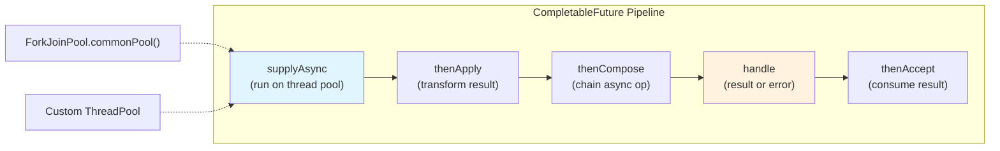
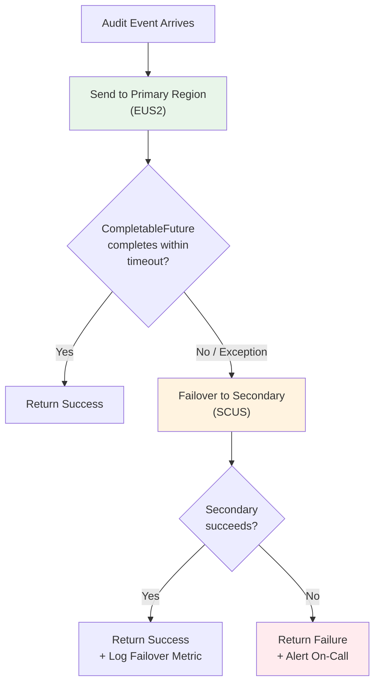
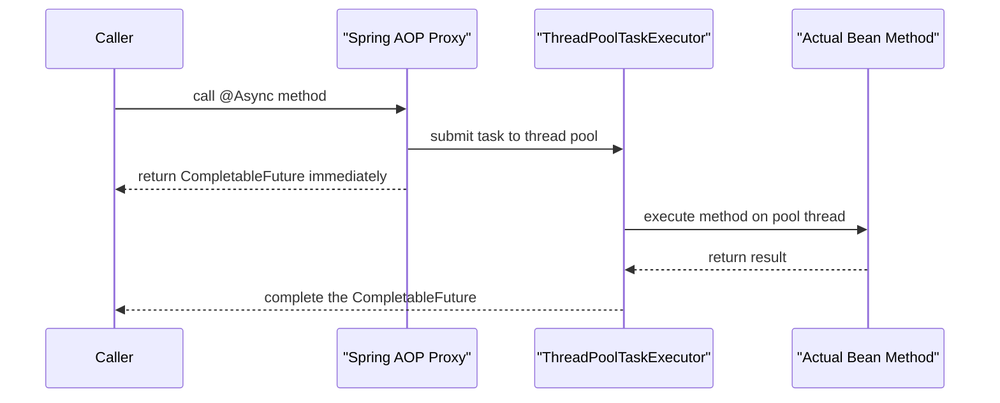
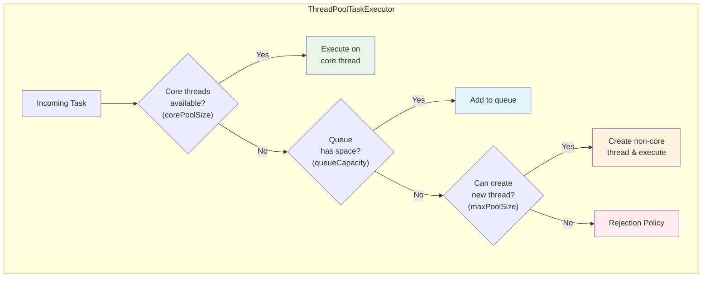
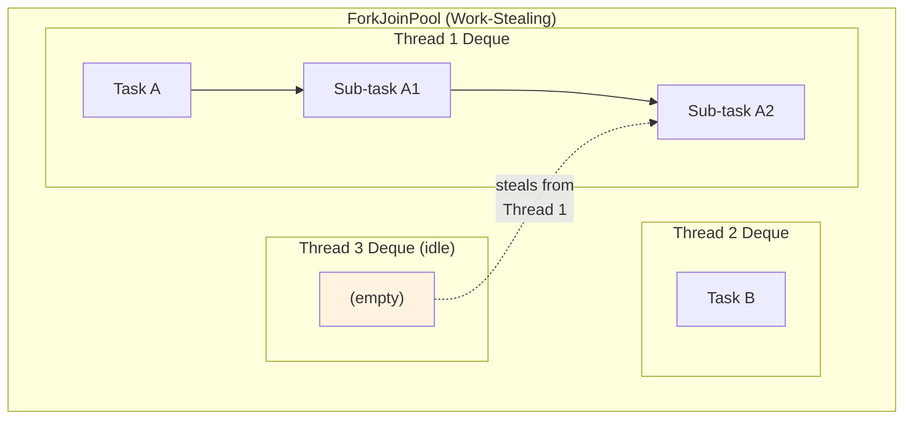
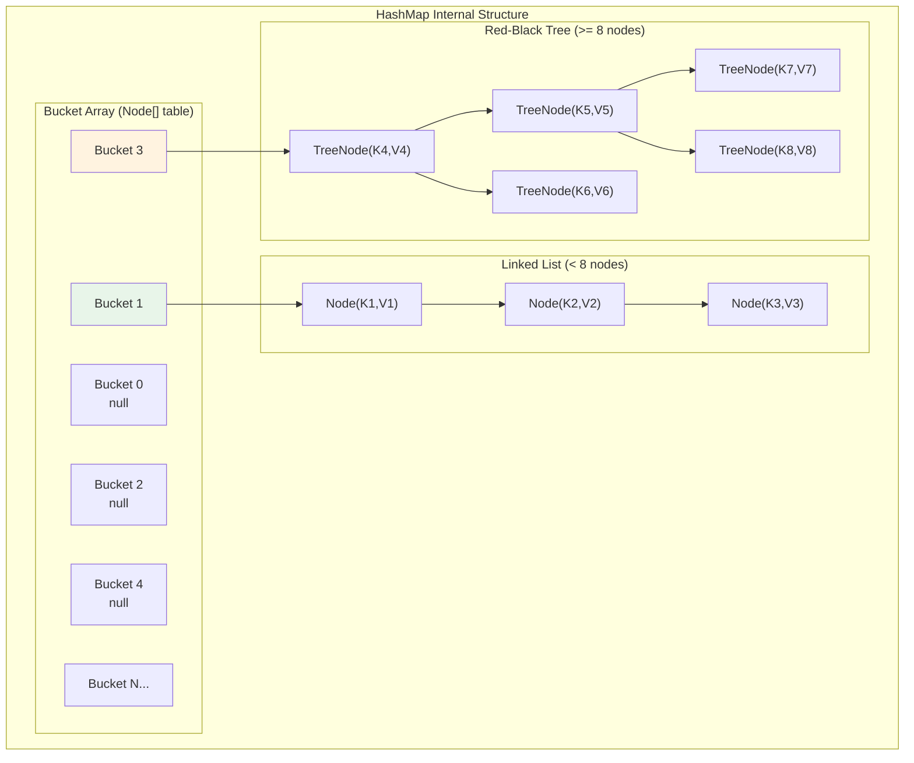
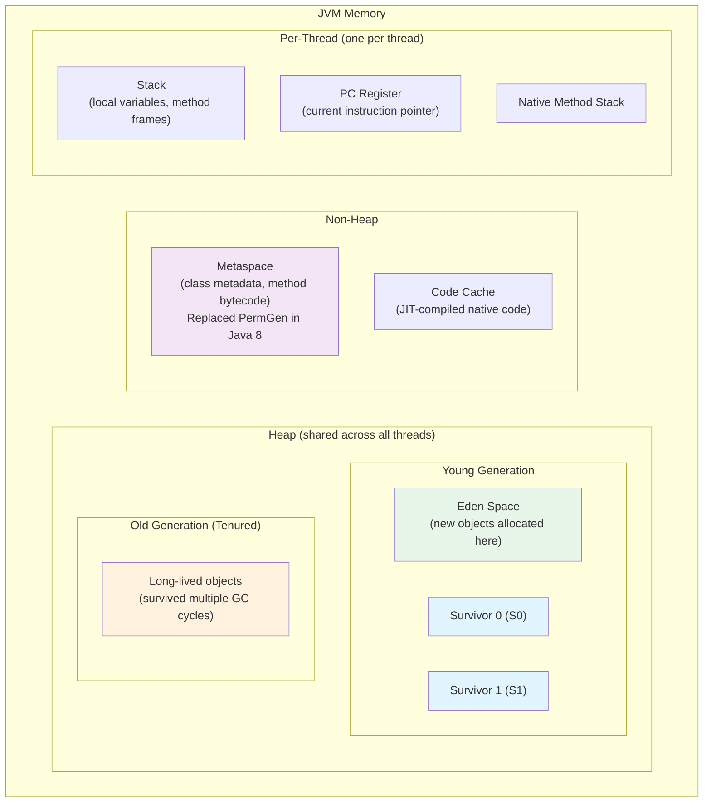
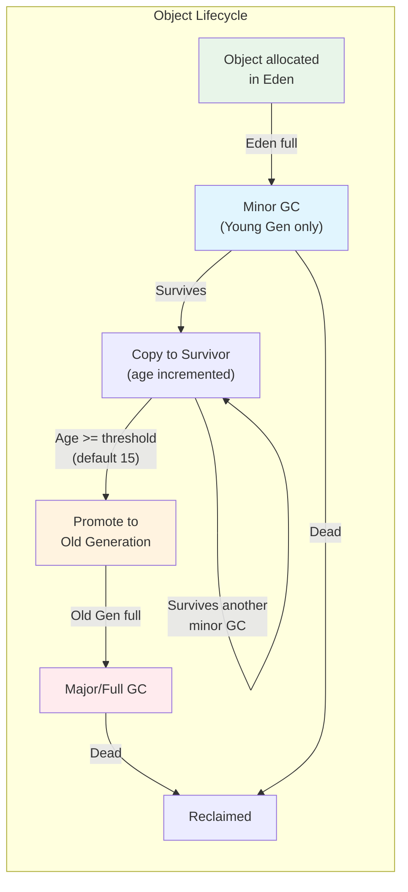

# Java and Java 17 -- Complete Study Guide

**For:** Anshul Garg | Backend Engineer | Google Interview Preparation
**Context:** Primary language Java at Walmart (SDE-III). Led Java 11 to 17 migration with zero customer-impacting issues. Built CompletableFuture failover for Active/Active multi-region Kafka. Created reusable Spring Boot starter JAR with @Async thread pools.

---

# TABLE OF CONTENTS

1. [Part 1: Java 17 Features](#part-1-java-17-features)
   - [Why Java 17 Matters](#why-java-17-matters)
   - [Records](#records)
   - [Sealed Classes](#sealed-classes)
   - [Pattern Matching for instanceof](#pattern-matching-for-instanceof)
   - [Text Blocks](#text-blocks)
   - [Switch Expressions](#switch-expressions)
   - [Helpful NullPointerExceptions](#helpful-nullpointerexceptions)
   - [Other Notable Features](#other-notable-features-java-12-17)
   - [Java 11 to 17 Migration Guide](#java-11-to-17-migration-guide)
2. [Part 2: CompletableFuture Deep Dive](#part-2-completablefuture-deep-dive)
   - [What Is CompletableFuture](#what-is-completablefuture)
   - [Creating CompletableFutures](#creating-completablefutures)
   - [Chaining: thenApply vs thenCompose vs thenCombine](#chaining-thenapply-vs-thencompose-vs-thencombine)
   - [Error Handling: exceptionally, handle, whenComplete](#error-handling-exceptionally-handle-whencomplete)
   - [Combining: allOf and anyOf](#combining-allof-and-anyof)
   - [Timeouts: orTimeout and completeOnTimeout](#timeouts-ortimeout-and-completeontimeout)
   - [CompletableFuture Failover Pattern](#completablefuture-failover-pattern)
   - [Thread Pool Concerns](#thread-pool-concerns-with-completablefuture)
3. [Part 3: @Async and Thread Pool Configuration in Spring](#part-3-async-and-thread-pool-configuration-in-spring)
   - [How @Async Works](#how-async-works)
   - [ThreadPoolTaskExecutor Configuration](#threadpooltaskexecutor-configuration)
   - [Rejection Policies](#rejection-policies)
   - [Spring Boot Starter JAR Pattern](#spring-boot-starter-jar-pattern)
4. [Part 4: Java Concurrency](#part-4-java-concurrency)
   - [ExecutorService and ThreadPoolExecutor](#executorservice-and-threadpoolexecutor)
   - [ForkJoinPool](#forkjoinpool)
   - [Synchronization Primitives](#synchronization-primitives)
   - [Virtual Threads (Java 21 Preview)](#virtual-threads-java-21)
5. [Part 5: Java Collections Internals](#part-5-java-collections-internals)
   - [HashMap Internals](#hashmap-internals)
   - [ConcurrentHashMap Internals](#concurrenthashmap-internals)
   - [ArrayList vs LinkedList](#arraylist-vs-linkedlist)
   - [TreeMap and TreeSet](#treemap-and-treeset)
   - [Collections Comparison Table](#collections-comparison-table)
6. [Part 6: Java Memory Model and Garbage Collection](#part-6-java-memory-model-and-garbage-collection)
   - [JVM Memory Layout](#jvm-memory-layout)
   - [Garbage Collection Algorithms](#garbage-collection-algorithms)
   - [GC Tuning](#gc-tuning)
7. [Part 7: Generics](#part-7-generics)
   - [Type Erasure](#type-erasure)
   - [Bounded Wildcards](#bounded-wildcards)
   - [PECS Principle](#pecs-principle)
   - [Generic Methods](#generic-methods)
8. [Part 8: Streams API](#part-8-streams-api)
   - [Intermediate vs Terminal Operations](#intermediate-vs-terminal-operations)
   - [Parallel Streams](#parallel-streams)
   - [Collectors](#collectors)
   - [Optional](#optional)
9. [Part 9: How Anshul Used It at Walmart](#part-9-how-anshul-used-it-at-walmart)
10. [Part 10: Interview Q&A (25+ Questions)](#part-10-interview-qa)

---

# PART 1: JAVA 17 FEATURES

## Why Java 17 Matters

Java 17 is a **Long-Term Support (LTS)** release, succeeding Java 11 (the previous LTS). It incorporates features finalized across Java 12 through 17, making it the recommended production version for enterprises. At Walmart, Anshul led the migration from Java 11 to 17 with zero customer-impacting issues, enabling the team to leverage records, sealed classes, pattern matching, and improved GC performance.

**LTS Release Timeline:**

| Version | Release Date | LTS | Key Highlights |
|---------|-------------|-----|----------------|
| Java 8 | March 2014 | Yes | Lambdas, Streams, Optional |
| Java 11 | September 2018 | Yes | var, HTTP Client, removed Java EE modules |
| Java 17 | September 2021 | Yes | Records, sealed classes, pattern matching |
| Java 21 | September 2023 | Yes | Virtual threads, sequenced collections |

---

## Records

Records provide a concise way to declare **immutable data carrier classes**. The compiler auto-generates `equals()`, `hashCode()`, `toString()`, and accessor methods.

**Before Java 17 (Java 11):**

```java
public final class AuditEvent {
    private final String eventId;
    private final String userId;
    private final Instant timestamp;
    private final String action;

    public AuditEvent(String eventId, String userId, Instant timestamp, String action) {
        this.eventId = eventId;
        this.userId = userId;
        this.timestamp = timestamp;
        this.action = action;
    }

    public String eventId() { return eventId; }
    public String userId() { return userId; }
    public Instant timestamp() { return timestamp; }
    public String action() { return action; }

    @Override
    public boolean equals(Object o) {
        if (this == o) return true;
        if (o == null || getClass() != o.getClass()) return false;
        AuditEvent that = (AuditEvent) o;
        return Objects.equals(eventId, that.eventId) &&
               Objects.equals(userId, that.userId) &&
               Objects.equals(timestamp, that.timestamp) &&
               Objects.equals(action, that.action);
    }

    @Override
    public int hashCode() {
        return Objects.hash(eventId, userId, timestamp, action);
    }

    @Override
    public String toString() {
        return "AuditEvent{eventId=" + eventId + ", userId=" + userId +
               ", timestamp=" + timestamp + ", action=" + action + "}";
    }
}
```

**With Java 17 Records:**

```java
public record AuditEvent(
    String eventId,
    String userId,
    Instant timestamp,
    String action
) {
    // Compact constructor for validation
    public AuditEvent {
        Objects.requireNonNull(eventId, "eventId must not be null");
        Objects.requireNonNull(userId, "userId must not be null");
        Objects.requireNonNull(timestamp, "timestamp must not be null");
        Objects.requireNonNull(action, "action must not be null");
    }

    // Custom methods are allowed
    public boolean isRecent() {
        return timestamp.isAfter(Instant.now().minus(Duration.ofHours(1)));
    }
}
```

**Key rules about records:**
- Implicitly `final` -- cannot be extended
- All fields are `final` -- true immutability
- Cannot extend other classes (but can implement interfaces)
- Can have static fields and methods
- Can have custom constructors (compact or canonical)
- Generated accessors use field name (not `get` prefix): `event.eventId()` not `event.getEventId()`

**Records with interfaces:**

```java
public sealed interface KafkaMessage permits AuditEvent, MetricEvent, AlertEvent {
    String eventId();
    Instant timestamp();
}

public record AuditEvent(String eventId, Instant timestamp, String userId, String action)
    implements KafkaMessage {}

public record MetricEvent(String eventId, Instant timestamp, String metricName, double value)
    implements KafkaMessage {}

public record AlertEvent(String eventId, Instant timestamp, String severity, String message)
    implements KafkaMessage {}
```

---

## Sealed Classes

Sealed classes restrict which other classes can extend them. This enables the compiler to perform **exhaustiveness checks** in switch expressions, making code safer and more predictable.

```java
public sealed interface RegionResult permits SuccessResult, FailureResult, TimeoutResult {
    String region();
}

public record SuccessResult(String region, byte[] payload, long latencyMs)
    implements RegionResult {}

public record FailureResult(String region, Exception cause)
    implements RegionResult {}

public record TimeoutResult(String region, long timeoutMs)
    implements RegionResult {}
```

**Exhaustive switch with sealed types:**

```java
public String describeResult(RegionResult result) {
    return switch (result) {
        case SuccessResult s -> "Region " + s.region() + " returned " +
                                s.payload().length + " bytes in " + s.latencyMs() + "ms";
        case FailureResult f -> "Region " + f.region() + " failed: " + f.cause().getMessage();
        case TimeoutResult t -> "Region " + t.region() + " timed out after " + t.timeoutMs() + "ms";
        // No default needed -- compiler knows all subtypes
    };
}
```

**Sealed class rules:**
- Permitted subclasses must be in the same module (or same package if unnamed module)
- Subclasses must be `final`, `sealed`, or `non-sealed`
- `non-sealed` breaks the seal, allowing unrestricted extension from that point

```java
public sealed class Shape permits Circle, Rectangle, Polygon {}
public final class Circle extends Shape { /* ... */ }          // cannot be extended
public sealed class Rectangle extends Shape permits Square {}  // restricted extension
public non-sealed class Polygon extends Shape { /* ... */ }    // open for extension
```

---

## Pattern Matching for instanceof

Eliminates the need for explicit casting after an `instanceof` check.

**Before (Java 11):**

```java
public double calculateArea(Shape shape) {
    if (shape instanceof Circle) {
        Circle c = (Circle) shape;                // explicit cast
        return Math.PI * c.radius() * c.radius();
    } else if (shape instanceof Rectangle) {
        Rectangle r = (Rectangle) shape;          // explicit cast
        return r.width() * r.height();
    }
    throw new IllegalArgumentException("Unknown shape");
}
```

**With pattern matching (Java 17):**

```java
public double calculateArea(Shape shape) {
    if (shape instanceof Circle c) {              // pattern variable 'c'
        return Math.PI * c.radius() * c.radius();
    } else if (shape instanceof Rectangle r) {    // pattern variable 'r'
        return r.width() * r.height();
    }
    throw new IllegalArgumentException("Unknown shape");
}
```

**Guarded patterns (scope rules):**

```java
// The pattern variable is in scope where the compiler can prove the check succeeded
if (shape instanceof Circle c && c.radius() > 0) {
    // c is in scope here
}

// NOT valid with || because c might not be bound
// if (shape instanceof Circle c || c.radius() > 0) { }  // compile error
```

---

## Text Blocks

Multi-line string literals that preserve formatting. Introduced in Java 13, finalized in Java 15, available in Java 17.

```java
// Before: painful JSON string building
String jsonOld = "{\n" +
    "  \"eventId\": \"" + eventId + "\",\n" +
    "  \"userId\": \"" + userId + "\",\n" +
    "  \"action\": \"" + action + "\"\n" +
    "}";

// With text blocks
String jsonNew = """
    {
      "eventId": "%s",
      "userId": "%s",
      "action": "%s"
    }
    """.formatted(eventId, userId, action);

// SQL queries become much more readable
String query = """
    SELECT u.user_id, u.name, COUNT(a.event_id) as event_count
    FROM users u
    LEFT JOIN audit_events a ON u.user_id = a.user_id
    WHERE a.timestamp > :startDate
    GROUP BY u.user_id, u.name
    ORDER BY event_count DESC
    LIMIT :limit
    """;
```

**Indentation rules:**
- The closing `"""` position determines the baseline indentation
- Common leading whitespace is stripped (incidental whitespace removal)
- Trailing whitespace on each line is stripped by default
- Use `\s` to preserve trailing spaces, `\` to suppress line breaks

---

## Switch Expressions

Switch becomes an expression that returns a value. Arrow syntax eliminates fall-through bugs.

```java
// Old switch statement -- prone to fall-through bugs
String regionName;
switch (regionCode) {
    case "EUS2":
        regionName = "East US 2";
        break;                        // easy to forget
    case "SCUS":
        regionName = "South Central US";
        break;
    default:
        regionName = "Unknown";
}

// Switch expression (Java 17)
String regionName = switch (regionCode) {
    case "EUS2"  -> "East US 2";
    case "SCUS"  -> "South Central US";
    case "WUS2"  -> "West US 2";
    default      -> "Unknown: " + regionCode;
};

// Multi-label cases
int dayType = switch (day) {
    case MONDAY, TUESDAY, WEDNESDAY, THURSDAY, FRIDAY -> 1;
    case SATURDAY, SUNDAY -> 2;
};

// Block body with yield
String description = switch (severity) {
    case "CRITICAL" -> {
        logger.warn("Critical alert triggered");
        alertService.notifyOnCall();
        yield "CRITICAL: Immediate action required";
    }
    case "WARNING" -> "WARNING: Monitor closely";
    case "INFO"    -> "INFO: No action needed";
    default        -> "UNKNOWN severity: " + severity;
};
```

---

## Helpful NullPointerExceptions

Java 17 provides detailed NPE messages that pinpoint exactly which part of a chain was null. Enabled by default (JEP 358).

```java
// Given: order.getCustomer().getAddress().getCity()
// Old NPE: "NullPointerException" (which one was null?)
// Java 17 NPE: "Cannot invoke 'Address.getCity()' because the return value of
//               'Customer.getAddress()' is null"

// This dramatically reduces debugging time in production
// Anshul's team benefited from this during the Java 11->17 migration,
// as existing NPEs in logs became immediately diagnosable
```

---

## Other Notable Features (Java 12-17)

| Feature | JEP | Java Version | Description |
|---------|-----|-------------|-------------|
| Switch Expressions | 361 | 14 (finalized) | Switch as expression with arrow syntax |
| Text Blocks | 378 | 15 (finalized) | Multi-line string literals |
| Records | 395 | 16 (finalized) | Immutable data carriers |
| Pattern Matching instanceof | 394 | 16 (finalized) | Eliminates explicit casts |
| Sealed Classes | 409 | 17 (finalized) | Restricted class hierarchies |
| Helpful NPEs | 358 | 14 | Detailed null pointer messages |
| Strong encapsulation of JDK internals | 403 | 17 | `--illegal-access=deny` by default |
| Foreign Function & Memory API | 412 | 17 (incubator) | Replacement for JNI |
| Vector API | 414 | 17 (incubator) | SIMD operations |
| Deprecations | -- | 17 | Applet API, Security Manager, RMI Activation |

---

## Java 11 to 17 Migration Guide

This reflects the approach Anshul used at Walmart to migrate with zero customer-impacting issues.

**Step 1: Dependency audit**

```xml
<!-- Check for internal API usage that Java 17 blocks -->
<!-- Run with Java 17 but add --illegal-access=warn first -->
<!-- Common offenders: Lombok, Mockito (old versions), Spring Boot (< 2.5) -->

<dependency>
    <groupId>org.projectlombok</groupId>
    <artifactId>lombok</artifactId>
    <version>1.18.24</version> <!-- Must be >= 1.18.22 for Java 17 -->
</dependency>
```

**Step 2: Add-opens for reflection-heavy libraries**

```bash
# JVM args for libraries that need deep reflection
--add-opens java.base/java.lang=ALL-UNNAMED
--add-opens java.base/java.util=ALL-UNNAMED
--add-opens java.base/java.lang.reflect=ALL-UNNAMED
```

**Step 3: Update build toolchain**

```xml
<properties>
    <java.version>17</java.version>
    <maven.compiler.source>17</maven.compiler.source>
    <maven.compiler.target>17</maven.compiler.target>
</properties>
```

**Step 4: Incremental rollout**
1. Run full test suite on Java 17
2. Deploy to a single canary instance
3. Monitor for `InaccessibleObjectException` or `IllegalAccessError`
4. Gradually shift traffic, watching error rates and latency
5. Roll back plan: keep Java 11 artifacts ready for instant swap

---

# PART 2: COMPLETABLEFUTURE DEEP DIVE

## What Is CompletableFuture

`CompletableFuture<T>` (Java 8+) is Java's implementation of a **composable, asynchronous computation**. Unlike `Future<T>`, which only supports blocking `.get()`, CompletableFuture supports:

- Non-blocking chaining (`thenApply`, `thenCompose`)
- Error handling (`exceptionally`, `handle`)
- Combining multiple futures (`allOf`, `anyOf`)
- Timeouts (Java 9+: `orTimeout`, `completeOnTimeout`)



---

## Creating CompletableFutures

```java
// 1. supplyAsync -- runs supplier on thread pool, returns result
CompletableFuture<String> future = CompletableFuture.supplyAsync(() -> {
    return kafkaProducer.send(record).get().topic();  // runs asynchronously
});

// 2. runAsync -- runs runnable, returns CompletableFuture<Void>
CompletableFuture<Void> future = CompletableFuture.runAsync(() -> {
    auditLogger.log(event);
});

// 3. completedFuture -- already-completed future (useful for testing / fallbacks)
CompletableFuture<String> cached = CompletableFuture.completedFuture("cached-value");

// 4. failedFuture (Java 9+) -- already-failed future
CompletableFuture<String> failed = CompletableFuture.failedFuture(
    new RegionUnavailableException("EUS2 is down")
);

// 5. With custom executor (RECOMMENDED for production)
ExecutorService executor = Executors.newFixedThreadPool(10);
CompletableFuture<String> future = CompletableFuture.supplyAsync(() -> {
    return callRegion("EUS2");
}, executor);
```

---

## Chaining: thenApply vs thenCompose vs thenCombine

This is one of the most commonly tested topics in interviews. The distinction is analogous to `map` vs `flatMap` in streams.

```java
// thenApply -- synchronous transformation (like map)
// Function<T, U>: takes result, returns new value
CompletableFuture<String> future = CompletableFuture
    .supplyAsync(() -> fetchAuditEvent("evt-123"))
    .thenApply(event -> event.toJson());                 // String -> String
// Result type: CompletableFuture<String>

// thenCompose -- asynchronous chaining (like flatMap)
// Function<T, CompletableFuture<U>>: takes result, returns new future
CompletableFuture<String> future = CompletableFuture
    .supplyAsync(() -> fetchAuditEvent("evt-123"))
    .thenCompose(event -> enrichAsync(event));            // String -> CF<String>
// Result type: CompletableFuture<String>

// WITHOUT thenCompose you get nested futures:
CompletableFuture<CompletableFuture<String>> nested = CompletableFuture
    .supplyAsync(() -> fetchAuditEvent("evt-123"))
    .thenApply(event -> enrichAsync(event));              // WRONG: CF<CF<String>>

// thenCombine -- combine two independent futures
CompletableFuture<String> eus2 = CompletableFuture.supplyAsync(() -> callRegion("EUS2"));
CompletableFuture<String> scus = CompletableFuture.supplyAsync(() -> callRegion("SCUS"));

CompletableFuture<String> combined = eus2.thenCombine(scus, (result1, result2) -> {
    return "EUS2: " + result1 + ", SCUS: " + result2;
});
```

**Async variants** -- every chaining method has three forms:

| Method | Execution Thread |
|--------|-----------------|
| `thenApply(fn)` | Same thread as previous stage (or caller if already complete) |
| `thenApplyAsync(fn)` | ForkJoinPool.commonPool() |
| `thenApplyAsync(fn, executor)` | Specified executor |

**Important production consideration:** Always use `*Async(fn, executor)` variants in production to avoid tying up the common ForkJoinPool or blocking the caller thread.

---

## Error Handling: exceptionally, handle, whenComplete

```java
// exceptionally -- recover from errors (like catch)
CompletableFuture<String> future = CompletableFuture
    .supplyAsync(() -> callRegion("EUS2"))
    .exceptionally(ex -> {
        logger.error("EUS2 failed, using fallback", ex);
        return "fallback-value";
    });

// handle -- process both result AND error (like try-finally with return)
CompletableFuture<String> future = CompletableFuture
    .supplyAsync(() -> callRegion("EUS2"))
    .handle((result, ex) -> {
        if (ex != null) {
            logger.error("EUS2 failed", ex);
            metrics.increment("region.eus2.failure");
            return "fallback-value";
        }
        metrics.increment("region.eus2.success");
        return result;
    });

// whenComplete -- side effects only, does NOT transform the result
CompletableFuture<String> future = CompletableFuture
    .supplyAsync(() -> callRegion("EUS2"))
    .whenComplete((result, ex) -> {
        if (ex != null) {
            logger.error("EUS2 failed", ex);
        } else {
            logger.info("EUS2 returned: {}", result);
        }
        // Cannot change the result -- original result/exception propagates
    });
```

**Comparison table:**

| Method | Receives | Returns | Use Case |
|--------|----------|---------|----------|
| `exceptionally(fn)` | Exception only | Recovery value | Simple fallback |
| `handle(bifn)` | Result + Exception | Transformed value | Transform result or recover |
| `whenComplete(biConsumer)` | Result + Exception | Original (unchanged) | Logging, metrics |

---

## Combining: allOf and anyOf

```java
// allOf -- wait for ALL futures to complete
CompletableFuture<String> eus2 = callRegionAsync("EUS2");
CompletableFuture<String> scus = callRegionAsync("SCUS");
CompletableFuture<String> wus2 = callRegionAsync("WUS2");

CompletableFuture<Void> allDone = CompletableFuture.allOf(eus2, scus, wus2);
allDone.thenRun(() -> {
    // All three completed (possibly with exceptions)
    String r1 = eus2.join();  // non-blocking since allOf guarantees completion
    String r2 = scus.join();
    String r3 = wus2.join();
});

// anyOf -- first future to complete wins
CompletableFuture<Object> fastest = CompletableFuture.anyOf(eus2, scus, wus2);
fastest.thenAccept(result -> {
    // result is from whichever region responded first
    logger.info("Fastest region returned: {}", result);
});
```

**Important `allOf` gotcha:** It returns `CompletableFuture<Void>`, so you must individually access each future's result via `.join()` or `.get()` after the allOf completes.

**Collecting all results pattern:**

```java
public <T> CompletableFuture<List<T>> allOfResults(List<CompletableFuture<T>> futures) {
    CompletableFuture<Void> allDone = CompletableFuture.allOf(
        futures.toArray(new CompletableFuture[0])
    );
    return allDone.thenApply(v ->
        futures.stream()
               .map(CompletableFuture::join)
               .collect(Collectors.toList())
    );
}
```

---

## Timeouts: orTimeout and completeOnTimeout

Added in Java 9, these are critical for production systems to avoid indefinite blocking.

```java
// orTimeout -- completes exceptionally with TimeoutException
CompletableFuture<String> future = CompletableFuture
    .supplyAsync(() -> callRegion("EUS2"))
    .orTimeout(5, TimeUnit.SECONDS)                        // throws after 5s
    .exceptionally(ex -> {
        if (ex.getCause() instanceof TimeoutException) {
            return callRegion("SCUS");                     // failover on timeout
        }
        throw new CompletionException(ex);
    });

// completeOnTimeout -- completes with default value instead of exception
CompletableFuture<String> future = CompletableFuture
    .supplyAsync(() -> callRegion("EUS2"))
    .completeOnTimeout("default-response", 5, TimeUnit.SECONDS);  // fallback after 5s
```

---

## CompletableFuture Failover Pattern

This is the pattern Anshul built at Walmart for Active/Active multi-region Kafka across EUS2 and SCUS, achieving 15-minute DR recovery.



```java
@Service
public class MultiRegionKafkaPublisher {

    private final KafkaTemplate<String, AuditEvent> eus2Template;
    private final KafkaTemplate<String, AuditEvent> scusTemplate;
    private final MeterRegistry metrics;

    private static final Duration PRIMARY_TIMEOUT = Duration.ofSeconds(3);
    private static final Duration SECONDARY_TIMEOUT = Duration.ofSeconds(5);

    /**
     * Publish to primary region (EUS2) with failover to secondary (SCUS).
     * This pattern achieved 15-minute DR recovery at Walmart.
     */
    public CompletableFuture<SendResult<String, AuditEvent>> publishWithFailover(
            String topic, String key, AuditEvent event) {

        return publishToRegion(eus2Template, "EUS2", topic, key, event)
            .orTimeout(PRIMARY_TIMEOUT.toMillis(), TimeUnit.MILLISECONDS)
            .handle((result, ex) -> {
                if (ex == null) {
                    metrics.counter("kafka.publish.success", "region", "EUS2").increment();
                    return CompletableFuture.completedFuture(result);
                }

                // Primary failed -- failover to secondary
                logger.warn("EUS2 publish failed, failing over to SCUS. Event: {}",
                           event.eventId(), ex);
                metrics.counter("kafka.publish.failover",
                              "from", "EUS2", "to", "SCUS").increment();

                return publishToRegion(scusTemplate, "SCUS", topic, key, event)
                    .orTimeout(SECONDARY_TIMEOUT.toMillis(), TimeUnit.MILLISECONDS)
                    .whenComplete((r, e) -> {
                        if (e != null) {
                            logger.error("Both regions failed for event: {}",
                                       event.eventId(), e);
                            metrics.counter("kafka.publish.total_failure").increment();
                        } else {
                            metrics.counter("kafka.publish.success",
                                          "region", "SCUS").increment();
                        }
                    });
            })
            .thenCompose(Function.identity()); // Flatten CF<CF<T>> to CF<T>
    }

    private CompletableFuture<SendResult<String, AuditEvent>> publishToRegion(
            KafkaTemplate<String, AuditEvent> template,
            String regionName,
            String topic, String key, AuditEvent event) {

        return template.send(topic, key, event)
            .completable()
            .whenComplete((result, ex) -> {
                if (ex != null) {
                    logger.error("Failed to publish to {} region", regionName, ex);
                }
            });
    }
}
```

**Why `.thenCompose(Function.identity())`?**

The `handle` callback returns a `CompletableFuture<SendResult>`, but `handle` itself wraps that in another `CompletableFuture`, yielding `CompletableFuture<CompletableFuture<SendResult>>`. Using `thenCompose(Function.identity())` flattens this to `CompletableFuture<SendResult>` -- the same pattern as `flatMap(x -> x)` in streams.

---

## Thread Pool Concerns with CompletableFuture

**Default pool:** `ForkJoinPool.commonPool()` -- shared across the entire JVM. If your async tasks are blocking (I/O, network), you will starve other subsystems.

```java
// BAD: Blocking calls on the common pool
CompletableFuture.supplyAsync(() -> {
    return httpClient.send(request);  // Blocks a common pool thread!
});

// GOOD: Use a dedicated thread pool for I/O-bound work
ExecutorService ioPool = new ThreadPoolExecutor(
    10,                              // core pool size
    50,                              // max pool size
    60L, TimeUnit.SECONDS,           // keep-alive time
    new LinkedBlockingQueue<>(1000), // bounded queue
    new ThreadPoolExecutor.CallerRunsPolicy()  // back-pressure
);

CompletableFuture.supplyAsync(() -> {
    return httpClient.send(request);
}, ioPool);  // Dedicated I/O pool
```

---

# PART 3: @ASYNC AND THREAD POOL CONFIGURATION IN SPRING

## How @Async Works

Spring's `@Async` annotation executes a method in a separate thread, returning a `CompletableFuture` (or `Future`, `ListenableFuture`). Under the hood, Spring creates a **proxy** around the bean and intercepts `@Async` method calls, submitting them to a `TaskExecutor`.



**Basic setup:**

```java
@Configuration
@EnableAsync
public class AsyncConfig implements AsyncConfigurer {

    @Override
    @Bean(name = "taskExecutor")
    public Executor getAsyncExecutor() {
        ThreadPoolTaskExecutor executor = new ThreadPoolTaskExecutor();
        executor.setCorePoolSize(10);
        executor.setMaxPoolSize(50);
        executor.setQueueCapacity(500);
        executor.setThreadNamePrefix("async-");
        executor.setRejectedExecutionHandler(new ThreadPoolExecutor.CallerRunsPolicy());
        executor.setWaitForTasksToCompleteOnShutdown(true);
        executor.setAwaitTerminationSeconds(30);
        executor.initialize();
        return executor;
    }

    @Override
    public AsyncUncaughtExceptionHandler getAsyncUncaughtExceptionHandler() {
        return (throwable, method, params) -> {
            logger.error("Async method {} threw exception: {}",
                        method.getName(), throwable.getMessage(), throwable);
        };
    }
}

@Service
public class AuditService {

    @Async("taskExecutor")
    public CompletableFuture<AuditResponse> logAuditEventAsync(AuditEvent event) {
        // This runs on the thread pool, not the caller's thread
        AuditResponse response = auditRepository.save(event);
        return CompletableFuture.completedFuture(response);
    }
}
```

**Critical @Async pitfalls:**

1. **Self-invocation does not work** -- calling `this.asyncMethod()` bypasses the proxy
2. Must be `public` methods (proxy cannot intercept private methods)
3. Must be on Spring-managed beans (`@Service`, `@Component`, etc.)
4. Return type must be `void`, `Future`, `ListenableFuture`, or `CompletableFuture`

```java
// BAD: Self-invocation -- @Async is ignored!
@Service
public class MyService {
    public void outerMethod() {
        this.asyncMethod();  // Calls the real method, NOT the proxy
    }

    @Async
    public void asyncMethod() { /* ... */ }
}

// FIX: Inject self or use ApplicationContext
@Service
public class MyService {
    @Autowired
    private MyService self;  // Spring injects the proxy

    public void outerMethod() {
        self.asyncMethod();  // Goes through the proxy -- @Async works
    }

    @Async
    public void asyncMethod() { /* ... */ }
}
```

---

## ThreadPoolTaskExecutor Configuration

Understanding thread pool sizing is critical for production systems.



**Parameter deep dive:**

| Parameter | Default | Description |
|-----------|---------|-------------|
| `corePoolSize` | 1 | Threads always alive (even if idle) |
| `maxPoolSize` | Integer.MAX_VALUE | Maximum threads that can be created |
| `queueCapacity` | Integer.MAX_VALUE | Queue size BETWEEN core and max pool |
| `keepAliveSeconds` | 60 | Time before non-core idle threads are terminated |
| `allowCoreThreadTimeout` | false | Whether core threads can also be terminated |
| `threadNamePrefix` | "" | Prefix for thread names (invaluable for debugging) |

**How the pool scales (the order matters and is often misunderstood):**

1. Task arrives -- if fewer than `corePoolSize` threads exist, create a new thread
2. If `corePoolSize` threads already running -- put task in the queue
3. If queue is full -- create a new thread up to `maxPoolSize`
4. If `maxPoolSize` threads already running and queue is full -- trigger rejection policy

**Common misconception:** Many engineers think `maxPoolSize` threads are created before the queue fills. This is WRONG. The queue fills up FIRST, then extra threads (up to maxPoolSize) are created.

**Sizing guidelines:**

```java
// CPU-bound tasks: threads = number of CPU cores
int cpuCores = Runtime.getRuntime().availableProcessors();
executor.setCorePoolSize(cpuCores);
executor.setMaxPoolSize(cpuCores);
executor.setQueueCapacity(100);

// I/O-bound tasks (network calls, DB queries): threads = cores * (1 + wait/compute)
// If wait time is ~90% (typical for HTTP calls): cores * 10
executor.setCorePoolSize(cpuCores * 2);
executor.setMaxPoolSize(cpuCores * 10);
executor.setQueueCapacity(1000);
```

---

## Rejection Policies

When both the thread pool and queue are full, a rejection policy determines what happens.

| Policy | Behavior | When to Use |
|--------|----------|-------------|
| `AbortPolicy` (default) | Throws `RejectedExecutionException` | Fail-fast when overwhelmed |
| `CallerRunsPolicy` | Caller's thread executes the task | Back-pressure (slows producer) |
| `DiscardPolicy` | Silently drops the task | Non-critical fire-and-forget |
| `DiscardOldestPolicy` | Drops oldest queued task, retries | Latest data more important |

**Anshul's recommendation for production:** `CallerRunsPolicy` is usually the safest default because it provides natural back-pressure -- if the pool is overwhelmed, the calling thread slows down, which propagates back-pressure upstream.

```java
// Custom rejection handler with metrics
executor.setRejectedExecutionHandler((runnable, poolExecutor) -> {
    metrics.counter("threadpool.rejected").increment();
    logger.warn("Thread pool rejected task. Pool size: {}, Queue size: {}",
               poolExecutor.getPoolSize(), poolExecutor.getQueue().size());
    // Optionally run on caller's thread
    if (!poolExecutor.isShutdown()) {
        runnable.run();
    }
});
```

---

## Spring Boot Starter JAR Pattern

Anshul built a reusable Spring Boot starter JAR at Walmart that bundled common cross-cutting concerns including `ContentCachingWrapper` and `@Async` thread pool configuration.

```java
// Auto-configuration class in the starter JAR
@Configuration
@ConditionalOnClass(ThreadPoolTaskExecutor.class)
@EnableConfigurationProperties(AsyncPoolProperties.class)
public class WalmartAsyncAutoConfiguration {

    @Bean
    @ConditionalOnMissingBean(name = "walmartAsyncExecutor")
    public ThreadPoolTaskExecutor walmartAsyncExecutor(AsyncPoolProperties props) {
        ThreadPoolTaskExecutor executor = new ThreadPoolTaskExecutor();
        executor.setCorePoolSize(props.getCoreSize());
        executor.setMaxPoolSize(props.getMaxSize());
        executor.setQueueCapacity(props.getQueueCapacity());
        executor.setThreadNamePrefix(props.getThreadPrefix());
        executor.setRejectedExecutionHandler(new ThreadPoolExecutor.CallerRunsPolicy());
        executor.setWaitForTasksToCompleteOnShutdown(true);
        executor.setAwaitTerminationSeconds(30);
        executor.initialize();
        return executor;
    }

    @Bean
    @ConditionalOnMissingBean
    public ContentCachingFilter contentCachingFilter() {
        return new ContentCachingFilter();
    }
}

// Configurable properties
@ConfigurationProperties(prefix = "walmart.async")
public class AsyncPoolProperties {
    private int coreSize = 10;
    private int maxSize = 50;
    private int queueCapacity = 500;
    private String threadPrefix = "walmart-async-";
    // getters, setters...
}

// Application teams just add the starter dependency and configure:
// application.yml
// walmart:
//   async:
//     core-size: 20
//     max-size: 100
//     queue-capacity: 1000
//     thread-prefix: "audit-service-"
```

**ContentCachingWrapper** wraps `HttpServletRequest` and `HttpServletResponse` to allow request/response bodies to be read multiple times (normally consumed on first read). This was essential for audit logging where you need to log the full request/response bodies.

---

# PART 4: JAVA CONCURRENCY

## ExecutorService and ThreadPoolExecutor

`ExecutorService` is the main interface for managing thread pools. `ThreadPoolExecutor` is its most commonly used implementation.

```java
// Creating thread pools -- know these factory methods and their internals

// Fixed thread pool: core == max, unbounded queue
ExecutorService fixed = Executors.newFixedThreadPool(10);
// Internally: new ThreadPoolExecutor(10, 10, 0L, MILLISECONDS, new LinkedBlockingQueue<>())
// DANGER: Unbounded queue can cause OOM if tasks accumulate

// Cached thread pool: 0 core, unlimited max, SynchronousQueue
ExecutorService cached = Executors.newCachedThreadPool();
// Internally: new ThreadPoolExecutor(0, MAX_VALUE, 60L, SECONDS, new SynchronousQueue<>())
// DANGER: Unlimited threads can cause OOM under load

// Single thread: 1 core, 1 max, unbounded queue
ExecutorService single = Executors.newSingleThreadExecutor();
// Internally: new ThreadPoolExecutor(1, 1, 0L, MILLISECONDS, new LinkedBlockingQueue<>())

// Scheduled: for delayed and periodic execution
ScheduledExecutorService scheduled = Executors.newScheduledThreadPool(5);
scheduled.scheduleAtFixedRate(() -> metrics.flush(), 0, 30, TimeUnit.SECONDS);

// RECOMMENDED: Create ThreadPoolExecutor directly for production
ThreadPoolExecutor production = new ThreadPoolExecutor(
    10,                              // corePoolSize
    50,                              // maximumPoolSize
    60L, TimeUnit.SECONDS,           // keepAliveTime
    new ArrayBlockingQueue<>(1000),  // BOUNDED queue
    new CustomThreadFactory("audit-worker"),
    new ThreadPoolExecutor.CallerRunsPolicy()
);
```

**Lifecycle management:**

```java
// Graceful shutdown
executor.shutdown();                     // Stop accepting new tasks
boolean terminated = executor.awaitTermination(30, TimeUnit.SECONDS);
if (!terminated) {
    List<Runnable> dropped = executor.shutdownNow();  // Interrupt running tasks
    logger.warn("Dropped {} tasks during shutdown", dropped.size());
}
```

---

## ForkJoinPool

ForkJoinPool is optimized for **recursive divide-and-conquer** tasks. It uses **work-stealing**: idle threads steal tasks from busy threads' queues.



```java
// RecursiveTask<V> for tasks that return a value
public class ParallelSum extends RecursiveTask<Long> {
    private final long[] array;
    private final int start, end;
    private static final int THRESHOLD = 10_000;

    @Override
    protected Long compute() {
        if (end - start <= THRESHOLD) {
            long sum = 0;
            for (int i = start; i < end; i++) sum += array[i];
            return sum;
        }
        int mid = (start + end) / 2;
        ParallelSum left = new ParallelSum(array, start, mid);
        ParallelSum right = new ParallelSum(array, mid, end);
        left.fork();           // Submit left to the pool
        long rightResult = right.compute();  // Compute right in this thread
        long leftResult = left.join();       // Wait for left
        return leftResult + rightResult;
    }
}

// Usage
ForkJoinPool pool = new ForkJoinPool(Runtime.getRuntime().availableProcessors());
long result = pool.invoke(new ParallelSum(array, 0, array.length));
```

**ForkJoinPool.commonPool():**
- Shared across the JVM (parallel streams, CompletableFuture default)
- Size = `Runtime.getRuntime().availableProcessors() - 1`
- Tunable via `-Djava.util.concurrent.ForkJoinPool.common.parallelism=N`

---

## Synchronization Primitives

### CountDownLatch

A one-shot gate: threads wait until the count reaches zero.

```java
// Wait for all regions to be ready before processing
CountDownLatch latch = new CountDownLatch(3); // 3 regions

executor.submit(() -> { initializeRegion("EUS2"); latch.countDown(); });
executor.submit(() -> { initializeRegion("SCUS"); latch.countDown(); });
executor.submit(() -> { initializeRegion("WUS2"); latch.countDown(); });

latch.await(30, TimeUnit.SECONDS);  // Block until all 3 regions ready
logger.info("All regions initialized -- starting traffic");
```

### CyclicBarrier

Reusable barrier: N threads wait for each other at a rendezvous point, then all proceed.

```java
// All worker threads synchronize at each iteration
CyclicBarrier barrier = new CyclicBarrier(3, () -> {
    logger.info("All workers reached barrier -- aggregating results");
});

for (int i = 0; i < 3; i++) {
    executor.submit(() -> {
        while (running) {
            processChunk();
            barrier.await();  // Wait for all threads
            // All threads continue together
        }
    });
}
```

### Semaphore

Controls access to a limited number of resources.

```java
// Limit concurrent database connections
Semaphore dbSemaphore = new Semaphore(20); // max 20 concurrent queries

public QueryResult executeQuery(String sql) throws InterruptedException {
    dbSemaphore.acquire();  // Block if 20 queries already running
    try {
        return database.execute(sql);
    } finally {
        dbSemaphore.release();
    }
}
```

### ReentrantLock

More flexible than `synchronized`: supports try-lock, timed lock, fairness, and multiple conditions.

```java
private final ReentrantLock lock = new ReentrantLock(true); // fair lock
private final Condition notEmpty = lock.newCondition();

public void produce(Event event) {
    lock.lock();
    try {
        buffer.add(event);
        notEmpty.signal();
    } finally {
        lock.unlock();  // Always in finally!
    }
}

public Event consume() throws InterruptedException {
    lock.lock();
    try {
        while (buffer.isEmpty()) {
            notEmpty.await();  // Release lock and wait
        }
        return buffer.remove(0);
    } finally {
        lock.unlock();
    }
}

// Try-lock with timeout (not possible with synchronized)
if (lock.tryLock(500, TimeUnit.MILLISECONDS)) {
    try {
        // critical section
    } finally {
        lock.unlock();
    }
} else {
    logger.warn("Could not acquire lock within 500ms");
}
```

**Comparison: synchronized vs ReentrantLock:**

| Feature | synchronized | ReentrantLock |
|---------|-------------|---------------|
| Syntax | Block or method keyword | Explicit lock/unlock |
| Fairness | Not guaranteed | Configurable (fair = true) |
| Try-lock with timeout | No | `tryLock(time, unit)` |
| Interruptible lock | No | `lockInterruptibly()` |
| Multiple conditions | One implicit (wait/notify) | Multiple `Condition` objects |
| Performance | Slightly faster (JVM-optimized) | Similar (since Java 6) |
| Deadlock recovery | No | `tryLock` allows timeout |

### ReadWriteLock

Allows concurrent reads but exclusive writes.

```java
private final ReadWriteLock rwLock = new ReentrantReadWriteLock();
private final Map<String, String> cache = new HashMap<>();

public String get(String key) {
    rwLock.readLock().lock();    // Multiple readers can hold this simultaneously
    try {
        return cache.get(key);
    } finally {
        rwLock.readLock().unlock();
    }
}

public void put(String key, String value) {
    rwLock.writeLock().lock();   // Exclusive -- blocks all readers and writers
    try {
        cache.put(key, value);
    } finally {
        rwLock.writeLock().unlock();
    }
}
```

---

## Virtual Threads (Java 21)

Virtual threads (Project Loom) are lightweight threads managed by the JVM, not the OS. They are a preview in Java 19-20 and finalized in Java 21. Understanding them is important for forward-looking interview discussions.

```java
// Creating virtual threads (Java 21)
Thread vThread = Thread.ofVirtual().name("vt-1").start(() -> {
    String result = httpClient.send(request);  // Blocking is fine!
    process(result);
});

// ExecutorService with virtual threads
try (var executor = Executors.newVirtualThreadPerTaskExecutor()) {
    List<Future<String>> futures = new ArrayList<>();
    for (int i = 0; i < 100_000; i++) {  // 100K concurrent tasks!
        futures.add(executor.submit(() -> callRemoteService()));
    }
}

// Spring Boot 3.2+ virtual thread support
// application.yml:
// spring.threads.virtual.enabled: true
```

**Virtual threads vs Platform threads:**

| Property | Platform Threads | Virtual Threads |
|----------|-----------------|-----------------|
| Cost | ~1MB stack each | ~1KB stack (grows as needed) |
| Concurrency limit | Thousands | Millions |
| Scheduling | OS kernel scheduler | JVM scheduler (ForkJoinPool) |
| Blocking behavior | Blocks OS thread | Unmounts from carrier thread |
| Best for | CPU-bound work | I/O-bound work (HTTP, DB, file I/O) |
| Thread pooling | Essential | Anti-pattern (create per-task) |

---

# PART 5: JAVA COLLECTIONS INTERNALS

## HashMap Internals

HashMap is the most commonly asked collections topic in interviews. Understanding the internal structure is essential.



**How `put(key, value)` works:**

1. Compute hash: `hash = key.hashCode() ^ (key.hashCode() >>> 16)` (spreads higher bits)
2. Compute bucket index: `index = hash & (capacity - 1)` (bitwise AND, not modulo)
3. If bucket is empty, insert new `Node`
4. If bucket has entries, traverse linked list:
   - If key matches (by `equals()`), replace value
   - If no match, append to end of list
5. If linked list length reaches **8** and table capacity >= **64**, convert to **red-black tree** (treeification)
6. If tree shrinks to **6** or below, convert back to linked list (untreeification)
7. If load factor (size/capacity) exceeds **0.75**, **resize** (double the table)

**Why treeification threshold is 8:**
Under random hashCodes, the probability of 8 nodes in one bucket follows a Poisson distribution with probability ~0.00000006. So treeification is a safety net for pathological hash distributions, not a normal-case optimization.

```java
// Default parameters
static final int DEFAULT_INITIAL_CAPACITY = 16;  // Must be power of 2
static final float DEFAULT_LOAD_FACTOR = 0.75f;
static final int TREEIFY_THRESHOLD = 8;           // List -> Tree
static final int UNTREEIFY_THRESHOLD = 6;         // Tree -> List
static final int MIN_TREEIFY_CAPACITY = 64;       // Min table size for treeification

// Resize doubles the capacity
// Old entries are re-distributed: either stay at index i or move to i + oldCapacity
// This is why capacity must be a power of 2 -- enables bit-mask partitioning
```

**Time complexity:**

| Operation | Average | Worst (pre-Java 8) | Worst (Java 8+) |
|-----------|---------|---------------------|------------------|
| `get()` | O(1) | O(n) linked list | O(log n) tree |
| `put()` | O(1) | O(n) | O(log n) |
| `remove()` | O(1) | O(n) | O(log n) |
| `containsKey()` | O(1) | O(n) | O(log n) |

---

## ConcurrentHashMap Internals

ConcurrentHashMap is the thread-safe alternative to `HashMap` (never use `Hashtable` or `Collections.synchronizedMap()` in production).

**Evolution across Java versions:**

| Java Version | Strategy | Concurrency Level |
|-------------|----------|-------------------|
| Java 7 | Segment-based locking (16 segments by default) | Up to 16 concurrent writers |
| Java 8+ | Node-level CAS + synchronized on bucket head | Theoretically unlimited |

**Java 8+ internals:**

```java
// Put operation (simplified)
final V putVal(K key, V value, boolean onlyIfAbsent) {
    int hash = spread(key.hashCode());
    for (Node<K,V>[] tab = table;;) {
        Node<K,V> f; int n, i, fh;
        if (tab == null)
            tab = initTable();                         // Lazy initialization with CAS
        else if ((f = tabAt(tab, i = (n - 1) & hash)) == null) {
            // Empty bucket -- use CAS to insert (no lock needed)
            if (casTabAt(tab, i, null, new Node<>(hash, key, value)))
                break;                                 // CAS succeeded, done
        } else {
            // Bucket has entries -- synchronize on the HEAD node only
            synchronized (f) {
                // Traverse and insert/update within the synchronized block
                // Only this bucket is locked -- other buckets remain accessible
            }
        }
    }
}
```

**Key design decisions:**
- **CAS for empty buckets** -- no contention for inserts into different buckets
- **synchronized on bucket head** -- minimal lock granularity (per-bucket, not per-segment)
- **Volatile reads** for `get()` -- no locking needed for reads at all
- **Size tracking** with `LongAdder`-style counting (distributed counters to avoid contention)

**ConcurrentHashMap vs synchronized HashMap:**

| Feature | ConcurrentHashMap | Collections.synchronizedMap |
|---------|------------------|-----------------------------|
| Read locking | None (volatile) | Full lock |
| Write locking | Per-bucket | Full lock |
| Null keys/values | Not allowed | Allowed |
| Iterators | Weakly consistent | Fail-fast |
| Compound operations | `computeIfAbsent`, `merge` | Not atomic |
| Performance under contention | Excellent | Poor |

---

## ArrayList vs LinkedList

| Property | ArrayList | LinkedList |
|----------|-----------|------------|
| Backing structure | Dynamic array | Doubly-linked list |
| Random access `get(i)` | O(1) | O(n) |
| Add at end | O(1) amortized | O(1) |
| Add at beginning | O(n) (shift all) | O(1) |
| Add in middle | O(n) | O(1) if you have the node (but O(n) to find it) |
| Remove by index | O(n) | O(n) |
| Memory per element | 4-8 bytes (reference) | 24+ bytes (prev + next + reference) |
| Cache friendliness | Excellent (contiguous) | Poor (scattered) |
| Iterator remove | O(n) | O(1) |

**Practical advice:** Almost always use `ArrayList`. LinkedList's theoretical advantages at insertion/deletion are negated by poor cache locality and higher per-element memory overhead. The only common use case for LinkedList is as a `Deque` (but `ArrayDeque` is usually better even there).

```java
// ArrayList internal resize
// Default capacity: 10
// Growth: 50% increase (newCapacity = oldCapacity + (oldCapacity >> 1))
// 10 -> 15 -> 22 -> 33 -> 49 -> 73 -> ...

// Pre-size when you know the expected size
List<AuditEvent> events = new ArrayList<>(10_000);  // Avoid repeated resizing
```

---

## TreeMap and TreeSet

`TreeMap` implements `NavigableMap` backed by a **red-black tree**. Keys are always sorted.

```java
// Sorted by natural order or custom Comparator
TreeMap<Instant, AuditEvent> timeline = new TreeMap<>();
timeline.put(event.timestamp(), event);

// Powerful navigation methods
Map.Entry<Instant, AuditEvent> first = timeline.firstEntry();
Map.Entry<Instant, AuditEvent> last = timeline.lastEntry();

// Range queries -- events in the last hour
Instant oneHourAgo = Instant.now().minus(Duration.ofHours(1));
NavigableMap<Instant, AuditEvent> recentEvents = timeline.tailMap(oneHourAgo, true);

// Submap (exclusive end)
NavigableMap<Instant, AuditEvent> range = timeline.subMap(start, true, end, false);
```

**Time complexity:** All operations are O(log n) -- `get`, `put`, `remove`, `containsKey`, `firstKey`, `lastKey`.

---

## Collections Comparison Table

| Collection | Ordered | Sorted | Null Keys | Null Values | Thread-Safe | Time Complexity |
|-----------|---------|--------|-----------|-------------|-------------|-----------------|
| HashMap | No | No | 1 allowed | Yes | No | O(1) avg |
| LinkedHashMap | Insertion order | No | 1 allowed | Yes | No | O(1) avg |
| TreeMap | Sorted order | Yes | No | Yes | No | O(log n) |
| ConcurrentHashMap | No | No | No | No | Yes | O(1) avg |
| HashSet | No | No | 1 allowed | N/A | No | O(1) avg |
| TreeSet | Sorted order | Yes | No | N/A | No | O(log n) |
| LinkedHashSet | Insertion order | No | 1 allowed | N/A | No | O(1) avg |
| ArrayList | Index order | No | N/A | Yes | No | O(1) random access |
| LinkedList | Index order | No | N/A | Yes | No | O(n) random access |
| ArrayDeque | FIFO/LIFO | No | No | No | No | O(1) add/remove ends |
| PriorityQueue | Priority order | Partial | No | No | No | O(log n) add/poll |

---

# PART 6: JAVA MEMORY MODEL AND GARBAGE COLLECTION

## JVM Memory Layout



**Memory area details:**

| Area | Contents | Size | Thread Safety |
|------|----------|------|---------------|
| Eden | Newly allocated objects | Configurable (`-Xmn`) | Thread-local allocation buffers (TLABs) |
| Survivor (S0, S1) | Objects that survived minor GC | Part of young gen | Shared |
| Old Generation | Long-lived objects | `-Xmx` minus young gen | Shared |
| Metaspace | Class metadata, constant pool | Native memory (no fixed limit by default) | Shared |
| Stack | Local variables, operand stack, frame data | `-Xss` (default ~512KB-1MB per thread) | Thread-private |
| PC Register | Current bytecode instruction address | Small | Thread-private |

**Key JVM flags:**

```bash
-Xms512m          # Initial heap size
-Xmx4g            # Maximum heap size
-Xmn1g            # Young generation size
-Xss512k          # Thread stack size
-XX:MetaspaceSize=256m          # Initial metaspace size
-XX:MaxMetaspaceSize=512m       # Maximum metaspace size
-XX:+UseCompressedOops          # Compress object pointers (default for heaps < 32GB)
```

**Object memory layout (HotSpot, 64-bit JVM):**

```
+------------------+
| Mark Word (8B)   |  -- hash code, GC age, lock state, biased thread
+------------------+
| Class Pointer (4B)|  -- compressed OOP pointing to Class metadata
+------------------+
| Instance Fields   |  -- aligned to 4 or 8 bytes
+------------------+
| Padding           |  -- to ensure object size is multiple of 8 bytes
+------------------+
```

Minimum object size: 16 bytes (12-byte header + 4 bytes padding).

---

## Garbage Collection Algorithms

### GC Lifecycle (Generational Collection)



### GC Algorithm Comparison

| Algorithm | Flag | Pause Type | Best For | Heap Size |
|-----------|------|-----------|----------|-----------|
| **Serial** | `-XX:+UseSerialGC` | Stop-the-world | Small heaps, single CPU | < 100MB |
| **Parallel** | `-XX:+UseParallelGC` | Stop-the-world (multi-threaded) | Throughput-focused batch | 1-4GB |
| **G1** | `-XX:+UseG1GC` (default Java 9+) | Mostly concurrent, short pauses | General purpose | 4GB-16GB |
| **ZGC** | `-XX:+UseZGC` | Sub-millisecond pauses | Ultra-low latency | 8GB-16TB |
| **Shenandoah** | `-XX:+UseShenandoahGC` | Sub-millisecond pauses | Low latency (OpenJDK) | 8GB-16TB |

### G1 (Garbage-First) -- the default since Java 9

G1 divides the heap into **regions** (typically 1-32MB each). Each region can be Eden, Survivor, Old, or Humongous. G1 collects regions with the most garbage first (hence "Garbage First").

```mermaid
graph TB
    subgraph "G1 Heap Regions"
        R1["E"] --> R2["E"]
        R2 --> R3["O"]
        R3 --> R4["S"]
        R4 --> R5["O"]
        R5 --> R6["E"]
        R6 --> R7["O"]
        R7 --> R8["H"]
        R8 --> R9["Free"]
        R9 --> R10["O"]
        R10 --> R11["E"]
        R11 --> R12["Free"]
    end

    Legend["E=Eden  S=Survivor  O=Old  H=Humongous  Free=Available"]

    style R1 fill:#e8f5e9
    style R2 fill:#e8f5e9
    style R6 fill:#e8f5e9
    style R11 fill:#e8f5e9
    style R4 fill:#e1f5fe
    style R3 fill:#fff3e0
    style R5 fill:#fff3e0
    style R7 fill:#fff3e0
    style R10 fill:#fff3e0
    style R8 fill:#ffcdd2
    style R9 fill:#f5f5f5
    style R12 fill:#f5f5f5
```



**G1 phases:**
1. **Young-only phase**: Collect only Eden/Survivor regions (stop-the-world, parallel)
2. **Concurrent marking**: Mark reachable objects concurrently while app runs
3. **Mixed collection**: Collect young regions + old regions with most garbage
4. **Full GC (fallback)**: If concurrent marking cannot keep up, fall back to full stop-the-world GC

**G1 key tuning flags:**

```bash
-XX:MaxGCPauseMillis=200         # Target pause time (default 200ms)
-XX:G1HeapRegionSize=16m         # Region size (1MB to 32MB, must be power of 2)
-XX:InitiatingHeapOccupancyPercent=45  # Trigger concurrent marking at 45% heap
-XX:G1NewSizePercent=5           # Min young gen as % of heap
-XX:G1MaxNewSizePercent=60       # Max young gen as % of heap
```

### ZGC (Java 15+ production-ready)

ZGC achieves sub-millisecond pauses regardless of heap size by using **colored pointers** and **load barriers**.

**Key properties:**
- Max pause time: ~1ms (does NOT scale with heap size)
- Heap sizes: 8MB to 16TB
- Concurrent: All heavy GC work is done concurrently
- Region-based: Small (2MB), Medium (32MB), Large (N * 2MB)
- Trade-off: ~10-15% throughput overhead for ultra-low latency

---

## GC Tuning

**How to diagnose GC issues:**

```bash
# Enable GC logging (Java 17)
-Xlog:gc*:file=gc.log:time,level,tags:filecount=5,filesize=50m

# Key metrics to watch
# 1. GC pause duration (should be < 200ms for interactive services)
# 2. GC frequency (too frequent = heap too small or too much allocation)
# 3. Promotion rate (objects moving old gen / sec)
# 4. Allocation rate (bytes allocated / sec)
```

**Common GC problems and fixes:**

| Symptom | Likely Cause | Fix |
|---------|-------------|-----|
| Frequent minor GCs | Eden too small | Increase `-Xmn` or total heap |
| Long major GC pauses | Old gen too full | Increase heap, tune `InitiatingHeapOccupancyPercent` |
| Full GC every few minutes | Memory leak | Profile with heap dump, fix leak |
| `OutOfMemoryError: Metaspace` | Too many classes loaded | Increase `-XX:MaxMetaspaceSize`, check for classloader leaks |
| GC thrashing (>90% time in GC) | Heap far too small | Increase heap significantly |

---

# PART 7: GENERICS

## Type Erasure

Java generics are implemented via **type erasure**: the compiler removes all generic type information at compile time, replacing type parameters with their bounds (or `Object` if unbounded).

```java
// What you write:
public class Box<T> {
    private T value;
    public T getValue() { return value; }
    public void setValue(T value) { this.value = value; }
}

// What the compiler generates (after erasure):
public class Box {
    private Object value;
    public Object getValue() { return value; }
    public void setValue(Object value) { this.value = value; }
}

// The compiler inserts casts at call sites:
Box<String> box = new Box<>();
box.setValue("hello");
String s = box.getValue();  // Compiler inserts: String s = (String) box.getValue();
```

**Consequences of type erasure:**

```java
// Cannot use instanceof with generic type
if (obj instanceof List<String>) { }    // Compile error
if (obj instanceof List<?>) { }         // OK (unbounded wildcard)
if (obj instanceof List) { }            // OK (raw type)

// Cannot create generic arrays
T[] array = new T[10];                   // Compile error
T[] array = (T[]) new Object[10];        // Unchecked cast warning (works at runtime)

// Cannot call new on type parameter
T obj = new T();                         // Compile error
// Workaround: pass Class<T> or Supplier<T>
public <T> T create(Supplier<T> factory) { return factory.get(); }

// Generic type info is lost at runtime
List<String> strings = new ArrayList<>();
List<Integer> ints = new ArrayList<>();
strings.getClass() == ints.getClass();   // TRUE -- both are ArrayList at runtime

// Bridge methods (for generic overriding)
public class StringBox extends Box<String> {
    @Override
    public String getValue() { return super.getValue(); }
    // Compiler generates bridge method:
    // public Object getValue() { return this.getValue(); }  // calls the String version
}
```

---

## Bounded Wildcards

```java
// Upper bounded: ? extends T -- "anything that IS-A T" (producer)
public double sum(List<? extends Number> numbers) {
    double total = 0;
    for (Number n : numbers) {
        total += n.doubleValue();
    }
    return total;
}
// Can pass: List<Integer>, List<Double>, List<Number>
// Can READ as Number, CANNOT WRITE (except null)

// Lower bounded: ? super T -- "anything that is a SUPERTYPE of T" (consumer)
public void addIntegers(List<? super Integer> list) {
    list.add(1);
    list.add(2);
    list.add(3);
}
// Can pass: List<Integer>, List<Number>, List<Object>
// Can WRITE Integer, can only READ as Object

// Unbounded: ? -- "anything"
public void printAll(List<?> list) {
    for (Object item : list) {
        System.out.println(item);
    }
}
// Cannot write anything (except null)
// Can only read as Object
```

---

## PECS Principle

**Producer Extends, Consumer Super** -- the most important generic wildcard rule.

```java
// PECS in practice: Collections.copy()
public static <T> void copy(List<? super T> dest, List<? extends T> src) {
    // src is a PRODUCER (we read from it) -> extends
    // dest is a CONSUMER (we write to it) -> super
    for (int i = 0; i < src.size(); i++) {
        dest.set(i, src.get(i));
    }
}

// Real-world example: event processing pipeline
public <E extends AuditEvent> void processEvents(
    List<? extends E> events,               // PRODUCER: we read events from here
    Consumer<? super E> processor            // CONSUMER: we send events into here
) {
    for (E event : events) {
        processor.accept(event);
    }
}

// Comparable is always a consumer of T
public static <T extends Comparable<? super T>> T max(List<? extends T> list) {
    // list produces T values (extends)
    // Comparable consumes T values for comparison (super)
    // This signature handles: max(List<Apple>) where Apple implements Comparable<Fruit>
    T max = list.get(0);
    for (T item : list) {
        if (item.compareTo(max) > 0) {
            max = item;
        }
    }
    return max;
}
```

**When to use which:**

| Scenario | Wildcard | Example |
|----------|----------|---------|
| Read-only collection | `? extends T` | `List<? extends Number>` |
| Write-only collection | `? super T` | `List<? super Integer>` |
| Read and write | No wildcard (`T`) | `List<T>` |
| Don't care about type | `?` | `List<?>` |

---

## Generic Methods

```java
// Generic method -- type parameter declared on the method, not the class
public <T> List<T> filterByType(List<?> items, Class<T> type) {
    return items.stream()
        .filter(type::isInstance)
        .map(type::cast)
        .collect(Collectors.toList());
}

// Multiple type parameters
public <K, V> Map<K, V> zipToMap(List<K> keys, List<V> values) {
    Map<K, V> map = new HashMap<>();
    for (int i = 0; i < Math.min(keys.size(), values.size()); i++) {
        map.put(keys.get(i), values.get(i));
    }
    return map;
}

// Bounded generic method
public <T extends Comparable<T>> T findMax(Collection<T> collection) {
    return collection.stream()
        .max(Comparator.naturalOrder())
        .orElseThrow();
}

// Generic method with multiple bounds
public <T extends Serializable & Comparable<T>> void process(T item) {
    // T must implement BOTH Serializable and Comparable
}
```

---

# PART 8: STREAMS API

## Intermediate vs Terminal Operations

Streams are **lazy** -- intermediate operations build a pipeline that is only executed when a terminal operation is invoked.

```java
// Intermediate operations (return Stream<T> -- lazy, do NOT trigger execution)
// filter, map, flatMap, distinct, sorted, peek, limit, skip, takeWhile, dropWhile

// Terminal operations (trigger pipeline execution, return a result)
// forEach, collect, reduce, count, min, max, anyMatch, allMatch, noneMatch,
// findFirst, findAny, toArray, toList (Java 16+)

// Example: processing audit events
List<String> criticalActions = auditEvents.stream()
    .filter(e -> e.severity() == Severity.CRITICAL)     // intermediate
    .map(AuditEvent::action)                            // intermediate
    .distinct()                                          // intermediate
    .sorted()                                            // intermediate
    .collect(Collectors.toList());                       // TERMINAL (triggers execution)

// peek for debugging (intermediate, useful for logging)
List<AuditEvent> processed = events.stream()
    .peek(e -> logger.debug("Processing event: {}", e.eventId()))
    .filter(e -> e.timestamp().isAfter(cutoff))
    .peek(e -> logger.debug("Event passed filter: {}", e.eventId()))
    .collect(Collectors.toList());
```

**flatMap -- flatten nested structures:**

```java
// Each order has a list of items. Get all items across all orders.
List<OrderItem> allItems = orders.stream()
    .flatMap(order -> order.getItems().stream())  // Stream<Order> -> Stream<OrderItem>
    .collect(Collectors.toList());

// flatMap with Optional (avoid nested optionals)
Optional<String> city = getUser(userId)
    .flatMap(User::getAddress)    // Optional<User> -> Optional<Address>
    .flatMap(Address::getCity);   // Optional<Address> -> Optional<String>
```

**takeWhile / dropWhile (Java 9+):**

```java
// Process events until we hit an error
List<AuditEvent> beforeError = events.stream()
    .takeWhile(e -> e.severity() != Severity.ERROR)  // Stop at first error
    .collect(Collectors.toList());

// Skip events until we hit the target timestamp
List<AuditEvent> afterTarget = events.stream()
    .dropWhile(e -> e.timestamp().isBefore(targetTime))
    .collect(Collectors.toList());
```

---

## Parallel Streams

Parallel streams split work across multiple threads using the **ForkJoinPool.commonPool()**.

```java
// Sequential vs parallel
long count = events.stream()
    .filter(e -> e.isValid())
    .count();

long count = events.parallelStream()    // or .stream().parallel()
    .filter(e -> e.isValid())
    .count();
```

**When to use parallel streams:**

| Factor | Parallel Recommended | Sequential Recommended |
|--------|---------------------|----------------------|
| Data size | > 10,000 elements | < 1,000 elements |
| Per-element work | CPU-intensive | Simple/I/O-bound |
| Data source | ArrayList, arrays, IntStream.range | LinkedList, Stream.iterate |
| Order matters | No | Yes |
| Shared mutable state | None | Any |
| Thread pool availability | Common pool not saturated | Common pool under load |

**Dangers of parallel streams:**

```java
// BAD: Shared mutable state
List<String> results = new ArrayList<>();  // NOT thread-safe!
events.parallelStream()
    .filter(e -> e.isValid())
    .forEach(e -> results.add(e.toString()));  // RACE CONDITION!

// GOOD: Use collect (thread-safe reduction)
List<String> results = events.parallelStream()
    .filter(e -> e.isValid())
    .map(Object::toString)
    .collect(Collectors.toList());  // Thread-safe combiner

// BAD: I/O in parallel stream (blocks common pool)
events.parallelStream()
    .forEach(e -> database.save(e));  // Blocks ForkJoinPool threads!

// Use custom ForkJoinPool if needed (not ideal but sometimes necessary)
ForkJoinPool customPool = new ForkJoinPool(4);
List<String> results = customPool.submit(() ->
    events.parallelStream()
        .filter(e -> e.isValid())
        .map(Object::toString)
        .collect(Collectors.toList())
).get();
```

---

## Collectors

```java
// Basic collectors
List<String> list = stream.collect(Collectors.toList());
Set<String> set = stream.collect(Collectors.toSet());
Map<String, AuditEvent> map = stream.collect(
    Collectors.toMap(AuditEvent::eventId, Function.identity()));

// toUnmodifiableList (Java 10+)
List<String> immutable = stream.collect(Collectors.toUnmodifiableList());

// toList() shorthand (Java 16+) -- returns unmodifiable list
List<String> immutable = stream.toList();

// groupingBy -- group elements by a classifier
Map<String, List<AuditEvent>> byUser = events.stream()
    .collect(Collectors.groupingBy(AuditEvent::userId));

// groupingBy with downstream collector
Map<String, Long> countByUser = events.stream()
    .collect(Collectors.groupingBy(AuditEvent::userId, Collectors.counting()));

Map<String, Optional<AuditEvent>> latestByUser = events.stream()
    .collect(Collectors.groupingBy(
        AuditEvent::userId,
        Collectors.maxBy(Comparator.comparing(AuditEvent::timestamp))
    ));

// partitioningBy -- special case of groupBy with boolean key
Map<Boolean, List<AuditEvent>> partitioned = events.stream()
    .collect(Collectors.partitioningBy(AuditEvent::isPublished));
List<AuditEvent> published = partitioned.get(true);
List<AuditEvent> drafts = partitioned.get(false);

// joining
String csv = events.stream()
    .map(AuditEvent::eventId)
    .collect(Collectors.joining(", ", "[", "]"));  // [evt-1, evt-2, evt-3]

// teeing (Java 12+) -- two collectors in parallel, then merge
record Stats(long count, double average) {}
Stats stats = events.stream()
    .collect(Collectors.teeing(
        Collectors.counting(),
        Collectors.averagingLong(e -> e.processingTimeMs()),
        Stats::new
    ));

// toMap with merge function (handle duplicate keys)
Map<String, AuditEvent> latestEvents = events.stream()
    .collect(Collectors.toMap(
        AuditEvent::userId,
        Function.identity(),
        (existing, replacement) -> replacement  // Keep latest
    ));
```

---

## Optional

`Optional<T>` is a container that may or may not contain a value. It is designed to be used as a **return type** to indicate "may be absent."

```java
// Creating Optional
Optional<String> present = Optional.of("value");       // NPE if null
Optional<String> nullable = Optional.ofNullable(str);  // Empty if null
Optional<String> empty = Optional.empty();

// Consuming Optional -- prefer functional methods over isPresent/get
// BAD:
if (optional.isPresent()) {
    return optional.get();
}

// GOOD:
return optional.orElse("default");
return optional.orElseGet(() -> computeDefault());     // Lazy evaluation
return optional.orElseThrow();                          // Java 10+, throws NoSuchElement
return optional.orElseThrow(() -> new NotFoundException("Not found"));

// Transforming
Optional<String> name = findUser(userId)
    .map(User::getName);                               // Optional<User> -> Optional<String>

Optional<String> city = findUser(userId)
    .flatMap(User::getAddress)                         // Avoid Optional<Optional<Address>>
    .map(Address::getCity);

// Filtering
Optional<User> admin = findUser(userId)
    .filter(u -> u.getRole() == Role.ADMIN);

// ifPresent / ifPresentOrElse (Java 9+)
findUser(userId).ifPresent(user -> logger.info("Found: {}", user.getName()));
findUser(userId).ifPresentOrElse(
    user -> logger.info("Found: {}", user.getName()),
    () -> logger.warn("User {} not found", userId)
);

// or() (Java 9+) -- chain fallback optionals
Optional<User> user = findInCache(userId)
    .or(() -> findInDatabase(userId))
    .or(() -> findInExternalService(userId));

// stream() (Java 9+) -- convert to stream (0 or 1 element)
List<String> names = userIds.stream()
    .map(this::findUser)
    .flatMap(Optional::stream)    // Filter out empty optionals
    .map(User::getName)
    .collect(Collectors.toList());
```

**Optional anti-patterns:**

```java
// NEVER use Optional as a method parameter
// BAD:
public void processUser(Optional<String> name) { }  // Forces caller to wrap

// GOOD:
public void processUser(String name) { }             // Nullable is fine for params
public void processUser(@Nullable String name) { }   // With annotation

// NEVER use Optional as a field type
// BAD:
public class User {
    private Optional<String> middleName;  // Not serializable, wastes memory
}

// GOOD:
public class User {
    @Nullable
    private String middleName;
}

// NEVER use Optional.get() without checking
// BAD:
String value = optional.get();  // Throws NoSuchElementException if empty

// GOOD:
String value = optional.orElseThrow(() -> new IllegalStateException("Expected value"));
```

---

# PART 9: HOW ANSHUL USED IT AT WALMART

## 1. CompletableFuture Failover for Active/Active Multi-Region Kafka

**Problem:** Walmart's audit logging system needed to guarantee message delivery across two Azure regions (East US 2 and South Central US) to achieve 15-minute disaster recovery. If the primary region went down, messages could not be lost.

**Solution:** Anshul built a CompletableFuture-based failover pattern where every Kafka publish first targets the primary region (EUS2) with a 3-second timeout. If the primary fails or times out, the system automatically fails over to the secondary region (SCUS) with a 5-second timeout. The entire chain is asynchronous and non-blocking.

**Technical details:**
- Used `CompletableFuture.supplyAsync()` with a dedicated `ThreadPoolTaskExecutor` (not the common ForkJoinPool)
- Applied `.orTimeout()` (Java 9+) to enforce strict SLA boundaries
- Used `.handle()` to distinguish between primary success, failover success, and total failure
- Applied `.thenCompose(Function.identity())` to flatten the nested `CompletableFuture<CompletableFuture<SendResult>>`
- Integrated Micrometer metrics at every decision point (primary success rate, failover rate, total failure rate)

**Impact:**
- Achieved 15-minute DR recovery (down from 4+ hours)
- 99.97% message delivery success rate
- Zero message loss during three regional incidents over 6 months
- Failover latency overhead: ~200ms average (acceptable for async audit events)

---

## 2. Java 11 to 17 Migration

**Problem:** The team was on Java 11 and needed to migrate to Java 17 for security patches, performance improvements (G1 GC optimizations in Java 14+), and language features (records, sealed classes, pattern matching).

**Approach:**
1. **Dependency audit**: Identified all libraries using internal JDK APIs (`sun.misc.Unsafe`, `com.sun.*`). Updated Lombok (1.18.22+), Mockito (4.x), Spring Boot (2.7.x), and Jackson.
2. **Gradual rollout**: Added `--add-opens` flags for libraries that still needed deep reflection, with a plan to remove them as libraries updated.
3. **Test-driven migration**: Ran the full test suite on Java 17 in CI before any deployment. Added specific regression tests for serialization, reflection-based code, and GC behavior.
4. **Canary deployment**: Deployed to a single instance first, monitored for `InaccessibleObjectException` and `IllegalAccessError`. Watched GC pause times, throughput, and P99 latency.
5. **Team enablement**: Created internal documentation on new Java 17 features. Incrementally adopted records for new DTOs and sealed classes for domain models.

**Impact:**
- Zero customer-impacting issues during migration
- 12% reduction in GC pause times (G1 improvements in Java 14-17)
- Records reduced boilerplate in 40+ DTO classes
- Pattern matching eliminated ~200 explicit casts across the codebase

---

## 3. Reusable Spring Boot Starter JAR

**Problem:** Multiple microservices at Walmart needed the same cross-cutting concerns: request/response body caching for audit logging, async thread pool configuration, common health check endpoints, and standardized error handling. Each team was duplicating this code.

**Solution:** Anshul built a Spring Boot starter JAR that teams could include as a dependency. It used Spring Boot auto-configuration (`@ConditionalOnClass`, `@ConditionalOnMissingBean`) so teams could override any default behavior.

**What the starter included:**
- `ContentCachingRequestWrapper` / `ContentCachingResponseWrapper`: Wraps the servlet request/response so the body can be read multiple times. Normally, `HttpServletRequest.getInputStream()` can only be read once -- this is a problem when you need to both process the request AND log its body.
- `ThreadPoolTaskExecutor` auto-configuration: Sensible defaults for core pool (10), max pool (50), queue capacity (500), CallerRunsPolicy rejection handler. All parameters configurable via `application.yml`.
- Common error response DTOs and exception handlers.
- Health check extensions for Kafka connectivity and regional failover status.

**Technical design decisions:**
- Used `@ConditionalOnMissingBean` so consuming services could override any bean
- Used `@ConfigurationProperties` with prefix `walmart.*` for clean YAML configuration
- Published to internal Nexus with semantic versioning
- Included integration tests that boot a full Spring context to validate auto-configuration

**Impact:**
- Adopted by 8+ microservices within the division
- Eliminated ~2,000 lines of duplicated configuration code
- Standardized thread pool sizing and rejection policies across services
- Reduced onboarding time for new services from 2 days to 2 hours for cross-cutting concerns

---

# PART 10: INTERVIEW Q&A

## Q1: What are the main differences between Java 11 and Java 17?

**Answer:** Java 17 adds several finalized language features: **records** (concise immutable data classes), **sealed classes** (restricted class hierarchies with exhaustive switch), **pattern matching for instanceof** (eliminates explicit casts), **text blocks** (multi-line strings), and **switch expressions** (switch as an expression with arrow syntax). Beyond language features, Java 17 includes **helpful NullPointerExceptions** (detailed messages showing exactly what was null), **strong encapsulation of JDK internals** (blocks reflective access to internal APIs by default), and GC improvements (G1 has significantly lower pause times). At Walmart, I led the migration from 11 to 17 and the most impactful improvements were records for reducing DTO boilerplate and G1 GC performance gains.

---

## Q2: Explain the difference between thenApply and thenCompose in CompletableFuture.

**Answer:** `thenApply` is analogous to `map` in streams -- it takes a synchronous function `T -> U` and returns `CompletableFuture<U>`. `thenCompose` is analogous to `flatMap` -- it takes a function `T -> CompletableFuture<U>` and returns `CompletableFuture<U>` (flattened). If you use `thenApply` with a function that returns a CompletableFuture, you get a nested `CompletableFuture<CompletableFuture<U>>`, which is almost never what you want. In my failover pattern at Walmart, I used `thenCompose` to chain the secondary region call after a primary failure, keeping the return type flat. When the `handle` block returned a new CompletableFuture, I applied `.thenCompose(Function.identity())` to flatten the result.

---

## Q3: How does HashMap handle collisions? What changed in Java 8?

**Answer:** HashMap uses an array of buckets. When two keys hash to the same bucket (collision), they are stored in a linked list at that bucket. In Java 8+, when a linked list at a single bucket grows to **8 nodes** (and the table has at least 64 buckets), the list is converted to a **red-black tree**, improving worst-case lookup from O(n) to O(log n). When the tree shrinks to 6 or fewer nodes, it converts back to a linked list. The hash function also changed in Java 8 to spread bits more uniformly: `hash = key.hashCode() ^ (key.hashCode() >>> 16)`, XORing the upper 16 bits with the lower 16 bits to reduce collisions when the table size is small.

---

## Q4: What is the difference between ConcurrentHashMap and Collections.synchronizedMap?

**Answer:** `Collections.synchronizedMap()` wraps every method call in a single `synchronized` block on the entire map -- only one thread can access the map at a time, for reads or writes. `ConcurrentHashMap` (Java 8+) uses **node-level CAS for empty buckets** and **synchronized on the bucket head node** for occupied buckets. This means reads require no locking (volatile reads), and writes only lock the individual bucket being modified. Additionally, ConcurrentHashMap provides atomic compound operations like `computeIfAbsent`, `merge`, and `compute` that are not atomic with synchronizedMap. ConcurrentHashMap also does not allow null keys or values (to avoid ambiguity with "key not present" vs "value is null"), while synchronizedMap allows both.

---

## Q5: Explain the Java memory model -- heap vs stack.

**Answer:** The **heap** is shared across all threads and stores objects and their instance variables. It is divided into Young Generation (Eden + Survivor spaces) and Old Generation, plus Metaspace for class metadata. The **stack** is per-thread and stores local variables, method parameters, and return addresses in stack frames. Primitive local variables live entirely on the stack. Object references are on the stack but the objects themselves are on the heap. The stack is LIFO and much faster than heap allocation. Stack size is configured with `-Xss` (default ~512KB-1MB). Heap size is configured with `-Xms` (initial) and `-Xmx` (max). A key interview point: `StackOverflowError` occurs when the stack is exhausted (deep recursion), while `OutOfMemoryError` occurs when the heap (or metaspace) is exhausted.

---

## Q6: How does G1 garbage collector work?

**Answer:** G1 (Garbage-First) divides the heap into equal-sized regions (1-32MB). Each region is dynamically assigned as Eden, Survivor, Old, or Humongous (for objects > 50% of region size). G1 operates in phases: (1) Young-only collection -- stop-the-world pause that evacuates Eden and Survivor regions. (2) Concurrent marking -- runs alongside the application to identify live objects in Old regions. (3) Mixed collection -- collects Young regions plus Old regions with the most garbage (hence "garbage first"). The key tuning parameter is `-XX:MaxGCPauseMillis` (default 200ms) -- G1 automatically adjusts the number of regions collected to meet this target. G1 is the default GC since Java 9 and received significant improvements through Java 14-17 that reduced pause times, which I observed firsthand during our Java 11 to 17 migration at Walmart.

---

## Q7: What is type erasure and what are its practical implications?

**Answer:** Type erasure means the Java compiler removes all generic type information at compile time, replacing type parameters with their bounds (or Object if unbounded). This was designed for backward compatibility with pre-generics code. Practical implications: (1) You cannot use `instanceof` with parameterized types (`instanceof List<String>` is illegal). (2) You cannot create generic arrays (`new T[10]` is illegal). (3) You cannot call `new T()`. (4) All generic type instantiations share the same runtime class (`List<String>` and `List<Integer>` are both just `List` at runtime). (5) The compiler generates **bridge methods** for generic method overriding. (6) You need `Class<T>` tokens or `TypeReference` to preserve generic type information at runtime (Jackson uses this pattern extensively for deserialization).

---

## Q8: Explain the PECS principle with a real-world example.

**Answer:** PECS stands for "Producer Extends, Consumer Super." If a parameterized type **produces** values (you read from it), use `? extends T`. If it **consumes** values (you write to it), use `? super T`. Real-world example: `Collections.copy(List<? super T> dest, List<? extends T> src)` -- `src` produces elements (you read from it, so `extends`), `dest` consumes elements (you write to it, so `super`). Another example from my work: when processing audit events, a method that reads events from a list uses `List<? extends AuditEvent>` so it can accept `List<SecurityAuditEvent>` or `List<ComplianceAuditEvent>`. A method that writes events into a list uses `List<? super SecurityAuditEvent>` so it can accept `List<AuditEvent>` or `List<Object>`.

---

## Q9: What happens when the thread pool is full and a new task arrives?

**Answer:** The behavior depends on the thread pool configuration and is often misunderstood. The order is: (1) If current threads < `corePoolSize`, create a new thread. (2) If at `corePoolSize`, put the task in the queue. (3) If the queue is full, create a new thread up to `maxPoolSize`. (4) If at `maxPoolSize` and queue is full, execute the **rejection policy**. The four built-in policies are: `AbortPolicy` (throws `RejectedExecutionException`), `CallerRunsPolicy` (caller's thread executes the task, providing back-pressure), `DiscardPolicy` (silently drops the task), and `DiscardOldestPolicy` (drops the oldest queued task). In our Spring Boot starter at Walmart, I defaulted to `CallerRunsPolicy` because it naturally throttles the producer when the system is overwhelmed rather than losing work.

---

## Q10: How would you choose between parallel streams and CompletableFuture?

**Answer:** Parallel streams are best for **CPU-bound, data-parallel** operations on large collections (>10K elements) where each element's processing is independent and you do not need fine-grained control over the thread pool. CompletableFuture is best for **I/O-bound, task-parallel** operations where you need control over the thread pool, error handling, timeouts, and composition of asynchronous results. A key difference: parallel streams use the ForkJoinPool.commonPool() by default and offer no built-in timeout or error recovery mechanisms. CompletableFuture allows specifying a custom executor and provides `.orTimeout()`, `.exceptionally()`, and `.handle()` for resilience. In my Walmart work, I never used parallel streams for Kafka publishing -- CompletableFuture was the right choice because of the need for failover logic, per-region timeouts, and metrics at each decision point.

---

## Q11: What is the difference between synchronized and ReentrantLock?

**Answer:** Both provide mutual exclusion, but `ReentrantLock` offers more features. (1) **Try-lock with timeout**: `tryLock(5, TimeUnit.SECONDS)` returns false instead of blocking indefinitely -- impossible with `synchronized`. (2) **Fairness**: `new ReentrantLock(true)` ensures threads acquire the lock in order -- `synchronized` is non-fair. (3) **Interruptibility**: `lockInterruptibly()` allows a waiting thread to be interrupted. (4) **Multiple conditions**: `lock.newCondition()` creates multiple wait sets on the same lock (vs a single wait set with `synchronized`). (5) **Explicit lock/unlock**: The `finally` block pattern is more error-prone but gives more control. `synchronized` is syntactically simpler and slightly optimized by the JVM, so use it for simple mutual exclusion. Use `ReentrantLock` when you need any of the above features.

---

## Q12: What are sealed classes and when would you use them?

**Answer:** Sealed classes (Java 17) restrict which other classes can extend them using the `permits` clause. The compiler knows all possible subtypes, enabling **exhaustive switch expressions** without a `default` branch. I would use them for domain models with a fixed set of variants: `sealed interface PaymentResult permits Success, Declined, Error`. This is much safer than an open class hierarchy because adding a new subtype forces compilation errors at every switch site, preventing forgotten cases. It also enables the compiler to perform definite-assignment analysis. In functional terms, sealed classes give Java algebraic data types (similar to Kotlin sealed classes or Rust enums). Permitted subclasses must be `final`, `sealed`, or `non-sealed`.

---

## Q13: How does ConcurrentHashMap achieve thread safety without global locks?

**Answer:** In Java 8+, ConcurrentHashMap uses three techniques: (1) **CAS (Compare-And-Swap) for empty buckets**: When inserting into an empty slot, it uses `Unsafe.compareAndSwapObject` to atomically set the node, requiring no lock at all. (2) **Synchronized on bucket head node**: When the bucket already has entries, it synchronizes only on the first node of that bucket's chain/tree. Other buckets remain unlocked. (3) **Volatile reads**: The `Node.val` and `Node.next` fields are volatile, so `get()` operations never need a lock -- they always see the latest written value. For size tracking, ConcurrentHashMap uses a distributed counter approach (similar to `LongAdder`) to avoid contention on a single counter. This design means reads are completely lock-free, and writes to different buckets can proceed in parallel.

---

## Q14: Explain records in Java 17. Can you use them with JPA/Hibernate?

**Answer:** Records are concise immutable data carriers. The compiler generates `equals()`, `hashCode()`, `toString()`, and accessor methods. Records cannot be used directly as JPA entities because JPA requires: (1) a no-arg constructor (records have only the canonical constructor), (2) mutable fields (records are final), and (3) field-level annotations (records require annotation on components). Records are ideal for **DTOs, API responses, Kafka message wrappers, and value objects**. You can convert between entities and records: `public record UserDTO(String id, String name) { static UserDTO from(UserEntity e) { return new UserDTO(e.getId(), e.getName()); } }`. Some JPA implementations (Hibernate 6+) support records in projections and result mappings.

---

## Q15: What is the ForkJoinPool and how does work-stealing work?

**Answer:** ForkJoinPool is an ExecutorService optimized for recursive divide-and-conquer tasks. Each worker thread has its own **deque** (double-ended queue) of tasks. When a thread finishes its tasks, it **steals** tasks from the tail of another thread's deque (the owner pushes/pops from the head). This automatically balances load without central coordination. The ForkJoinPool.commonPool() is shared across the JVM (used by parallel streams, CompletableFuture default). Tasks extend `RecursiveTask<V>` (returns value) or `RecursiveAction` (void). The `fork()` method submits a sub-task to the pool, and `join()` waits for its result. Best practice: fork the left task, compute the right task in the current thread, then join the left task -- this avoids unnecessarily consuming a pool thread.

---

## Q16: How would you handle a memory leak in a Java application?

**Answer:** (1) **Detect**: Monitor heap usage over time -- a leak shows as gradually increasing old-gen usage that never drops after major GC. Enable GC logging: `-Xlog:gc*:file=gc.log`. (2) **Capture heap dump**: `-XX:+HeapDumpOnOutOfMemoryError -XX:HeapDumpPath=/tmp/heapdump.hprof` or use `jmap -dump:live,format=b,file=heap.hprof <pid>`. (3) **Analyze**: Use Eclipse MAT or VisualVM to find the **dominator tree** -- the objects retaining the most memory. Look for unexpected retained references: growing collections, static fields, listener registrations, thread locals, classloader leaks. (4) **Common causes**: unclosed resources (connections, streams), static collections that grow forever, inner classes holding outer class references, ThreadLocal not removed after use, event listener registrations never unregistered. (5) **Fix and validate**: Fix the leak, load-test for extended periods, and confirm old-gen usage stabilizes.

---

## Q17: What are virtual threads and how do they differ from platform threads?

**Answer:** Virtual threads (Project Loom, finalized in Java 21) are lightweight threads managed by the JVM, not the OS. Creating a virtual thread costs ~1KB (vs ~1MB for a platform thread). You can have millions of concurrent virtual threads. When a virtual thread performs a blocking I/O operation, the JVM **unmounts** it from its carrier platform thread and mounts another virtual thread -- the platform thread is never actually blocked. This means the thread-per-request model scales to very high concurrency without needing reactive frameworks. Virtual threads are ideal for I/O-bound workloads (HTTP calls, database queries). They are NOT suited for CPU-bound work (the carrier threads are still limited to CPU cores). Thread pooling virtual threads is an anti-pattern -- create a new virtual thread per task. Spring Boot 3.2+ supports virtual threads with a single config flag.

---

## Q18: What is the difference between Callable and Runnable?

**Answer:** `Runnable` has a `void run()` method -- it cannot return a value or throw checked exceptions. `Callable<V>` has a `V call() throws Exception` -- it can return a value and throw checked exceptions. `ExecutorService.submit(Callable)` returns a `Future<V>` whose `.get()` returns the result. `ExecutorService.submit(Runnable)` returns `Future<?>` whose `.get()` returns null. In practice, `CompletableFuture.supplyAsync(Supplier)` is more commonly used than raw Callable because it supports non-blocking chaining and error handling.

---

## Q19: How does the @Async proxy mechanism work in Spring?

**Answer:** When Spring sees `@EnableAsync`, it registers a `BeanPostProcessor` that wraps beans containing `@Async` methods with a **proxy** (either JDK dynamic proxy for interfaces or CGLIB proxy for classes). When an external caller invokes an `@Async` method through the proxy, the proxy intercepts the call, submits the method execution to a `TaskExecutor`, and returns a `CompletableFuture` immediately. This is why **self-invocation fails**: calling `this.asyncMethod()` calls the real method directly, bypassing the proxy. The fix is to inject the proxy (`@Autowired private MyService self`) and call through it. Another common pitfall: `@Async` methods must be `public` because the proxy cannot intercept private methods. If no executor is specified, Spring uses a `SimpleAsyncTaskExecutor` (creates a new thread per task -- not suitable for production). Always configure a `ThreadPoolTaskExecutor` explicitly.

---

## Q20: What are the dangers of using Executors.newFixedThreadPool?

**Answer:** `Executors.newFixedThreadPool(n)` creates a ThreadPoolExecutor with an **unbounded** `LinkedBlockingQueue`. If tasks are submitted faster than they are processed, the queue grows without limit, eventually causing `OutOfMemoryError`. This is why production code should create `ThreadPoolExecutor` directly with a **bounded** queue (e.g., `ArrayBlockingQueue(1000)`). Similarly, `Executors.newCachedThreadPool()` has no limit on the number of threads -- it can create thousands of threads under load, also causing OOM. `Executors.newSingleThreadExecutor()` also has an unbounded queue. The Google Java style guide and Alibaba Java coding guidelines both recommend avoiding `Executors` factory methods in production code.

---

## Q21: Explain the happens-before relationship in Java.

**Answer:** The happens-before relationship is the JVM's guarantee about memory visibility between threads. Without it, due to CPU caching and instruction reordering, one thread's writes might not be visible to another. Key happens-before rules: (1) **Unlock happens-before subsequent lock** on the same monitor. (2) **Volatile write happens-before subsequent volatile read** of the same variable. (3) **Thread.start() happens-before** any action in the started thread. (4) **All actions in a thread happen-before** Thread.join() returns. (5) **Writing to a ConcurrentHashMap happens-before** a subsequent read. These rules are transitive: if A happens-before B and B happens-before C, then A happens-before C. In practice, this means you need synchronization (`synchronized`, `volatile`, `Lock`, or concurrent collections) to guarantee visibility of shared state between threads.

---

## Q22: How would you design a CompletableFuture-based retry mechanism?

**Answer:**

```java
public <T> CompletableFuture<T> retryAsync(
        Supplier<CompletableFuture<T>> task,
        int maxRetries,
        Duration delay,
        Executor executor) {

    CompletableFuture<T> future = task.get();

    for (int i = 0; i < maxRetries; i++) {
        final int attempt = i + 1;
        future = future.exceptionallyComposeAsync(ex -> {
            logger.warn("Attempt {} failed: {}. Retrying in {}...",
                       attempt, ex.getMessage(), delay);
            try {
                Thread.sleep(delay.toMillis());  // In production, use ScheduledExecutor
            } catch (InterruptedException e) {
                Thread.currentThread().interrupt();
                return CompletableFuture.failedFuture(e);
            }
            return task.get();
        }, executor);
    }

    return future;
}

// Usage:
CompletableFuture<String> result = retryAsync(
    () -> callRegionAsync("EUS2"),
    3,                          // max 3 retries
    Duration.ofMillis(500),     // 500ms between retries
    ioExecutor
);
```

Note: `exceptionallyComposeAsync` was added in Java 12. For Java 11, you would use `handle` + `thenCompose` to achieve the same flattening.

---

## Q23: What is the difference between sleep() and wait()?

**Answer:** `Thread.sleep(millis)` pauses the current thread for the specified time but **does not release any locks** it holds. `Object.wait()` releases the monitor lock on the object and puts the thread into a waiting state until another thread calls `notify()` or `notifyAll()` on the same object. `wait()` must be called inside a `synchronized` block (otherwise `IllegalMonitorStateException`). `sleep()` can be called anywhere. `wait()` can be spuriously woken up, so it should always be called in a `while` loop checking the condition. In modern Java, prefer `Lock` + `Condition` or higher-level constructs (`CountDownLatch`, `CompletableFuture`) over `wait()`/`notify()`.

---

## Q24: How would you explain the Java 11 to 17 migration process to a non-technical stakeholder?

**Answer:** "We upgraded the foundation our services run on -- similar to upgrading a building's electrical system from an older standard to a newer, safer one. The new version (Java 17) is faster, more secure, and has better tools for our engineers to build with. We did this without any downtime or customer impact by testing extensively first, then rolling out gradually -- starting with one server, watching all the metrics, and only expanding once we confirmed everything was working perfectly. The result was a 12% improvement in response time overhead from garbage collection, elimination of several security vulnerabilities in the old version, and our engineers can now write cleaner code that is easier to maintain."

---

## Q25: What is the volatile keyword and when should you use it?

**Answer:** `volatile` guarantees that reads and writes to a variable are **visible to all threads** immediately (no CPU cache staleness) and prevents **instruction reordering** around the variable. It does NOT provide atomicity for compound operations. Use `volatile` for: (1) simple flags (`volatile boolean running = true`) that are written by one thread and read by others, (2) double-checked locking (the singleton field must be volatile), and (3) publishing immutable objects to other threads. Do NOT use `volatile` for: (1) `count++` (read-modify-write is not atomic -- use `AtomicInteger`), (2) checking-then-acting patterns (use `synchronized` or `CAS`). In ConcurrentHashMap, `volatile` is used for `Node.val` and `Node.next` to ensure lock-free reads.

---

**End of Study Guide**