# API Design, Kafka SMT, and Disaster Recovery -- Complete Study Guide

**For:** Anshul Garg | Backend Engineer | Google Interview Preparation
**Context:** Designed OpenAPI-first DC Inventory Search API (898-line spec), Kafka SMT-based geographic routing (US/CA/MX), Active/Active multi-region DR with 15-min recovery, dual-database architecture (PostgreSQL + ClickHouse) with Redis caching at GCC

---

# TABLE OF CONTENTS

1. [Part 1: OpenAPI Specification](#part-1-openapi-specification)
   - [What Is OpenAPI](#what-is-openapi)
   - [YAML vs JSON Format](#yaml-vs-json-format)
   - [Design-First vs Code-First](#design-first-vs-code-first)
   - [OpenAPI Document Structure](#openapi-document-structure)
2. [Part 2: Writing OpenAPI Specs](#part-2-writing-openapi-specs)
   - [Info and Servers](#info-and-servers)
   - [Paths and Operations](#paths-and-operations)
   - [Components and Schemas](#components-and-schemas)
   - [Parameters and Request Bodies](#parameters-and-request-bodies)
   - [Responses and Error Models](#responses-and-error-models)
   - [Security Schemes](#security-schemes)
   - [Anshul's 898-Line Spec Walkthrough](#anshuls-898-line-spec-walkthrough)
3. [Part 3: API Versioning Strategies](#part-3-api-versioning-strategies)
   - [URL Path Versioning](#url-path-versioning)
   - [Query Parameter Versioning](#query-parameter-versioning)
   - [Header Versioning](#header-versioning)
   - [Content Negotiation](#content-negotiation)
   - [Comparison Table](#versioning-comparison-table)
4. [Part 4: REST Best Practices](#part-4-rest-best-practices)
   - [Resource Naming Conventions](#resource-naming-conventions)
   - [Pagination Patterns](#pagination-patterns)
   - [Error Handling and RFC 7807](#error-handling-and-rfc-7807)
   - [HATEOAS](#hateoas)
   - [Idempotency](#idempotency)
5. [Part 5: Kafka Single Message Transforms (SMT)](#part-5-kafka-single-message-transforms-smt)
   - [What Are SMTs](#what-are-smts)
   - [Built-In SMTs](#built-in-smts)
   - [Custom SMTs](#custom-smts)
   - [SMT Chains and Predicates](#smt-chains-and-predicates)
6. [Part 6: SMT Geographic Routing](#part-6-smt-geographic-routing)
   - [How Anshul Routed US/CA/MX](#how-anshul-routed-uscamx)
   - [Configuration Examples](#routing-configuration-examples)
   - [Architecture Diagram](#geographic-routing-architecture)
7. [Part 7: Disaster Recovery Concepts](#part-7-disaster-recovery-concepts)
   - [RTO and RPO Definitions](#rto-and-rpo-definitions)
   - [Active/Active Architecture](#activeactive-architecture)
   - [Active/Passive Architecture](#activepassive-architecture)
   - [Pilot Light, Warm Standby, Multi-Site](#pilot-light-warm-standby-multi-site)
   - [DR Strategy Comparison Table](#dr-strategy-comparison-table)
8. [Part 8: Anshul's 15-Minute DR Recovery](#part-8-anshuls-15-minute-dr-recovery)
   - [Architecture Overview](#dr-architecture-overview)
   - [Failover Flow](#failover-flow)
   - [CompletableFuture Failover Pattern](#completablefuture-failover-pattern)
9. [Part 9: P99/P95/P50 Latency](#part-9-p99p95p50-latency)
   - [Percentile Definitions](#percentile-definitions)
   - [Measurement Techniques](#measurement-techniques)
   - [Optimization Strategies](#optimization-strategies)
   - [Histograms and HdrHistogram](#histograms-and-hdrhistogram)
10. [Part 10: HTTP Status Codes](#part-10-http-status-codes)
    - [2xx Success Codes](#2xx-success-codes)
    - [3xx Redirection Codes](#3xx-redirection-codes)
    - [4xx Client Error Codes](#4xx-client-error-codes)
    - [5xx Server Error Codes](#5xx-server-error-codes)
11. [Part 11: Google Cloud Storage (GCS) Basics](#part-11-google-cloud-storage-gcs-basics)
    - [Buckets and Objects](#buckets-and-objects)
    - [Storage Classes](#storage-classes)
    - [Lifecycle Management](#lifecycle-management)
    - [Parquet Storage Pattern](#parquet-storage-pattern)
12. [Part 12: How Anshul Used It](#part-12-how-anshul-used-it)
13. [Part 13: Interview Q&A (15+ Questions)](#part-13-interview-qa)

---

# Part 1: OpenAPI Specification

## What Is OpenAPI

The **OpenAPI Specification** (OAS), formerly known as Swagger, is a language-agnostic standard for describing RESTful APIs. It provides a machine-readable contract that defines every aspect of an API: endpoints, request/response formats, authentication, error models, and more.

**Key points:**
- Current version: **OpenAPI 3.1** (fully aligned with JSON Schema draft 2020-12)
- Maintained by the **OpenAPI Initiative** (part of the Linux Foundation)
- The specification itself is written in **YAML or JSON**
- Tools like Swagger UI, Redoc, and Stoplight render interactive documentation from the spec
- Code generators (openapi-generator, swagger-codegen) produce client SDKs and server stubs from the spec

**Why it matters for backend engineers:**
- It serves as the single source of truth for API contracts between teams
- It enables automated testing, mock servers, and client generation
- It enforces consistency across microservices
- It is the industry standard that Google, Amazon, Microsoft, and Walmart all use internally

## YAML vs JSON Format

Both formats are equivalent -- the same OpenAPI document can be expressed in either. YAML is overwhelmingly preferred because it is more readable and supports comments.

**YAML example:**
```yaml
openapi: "3.0.3"
info:
  title: DC Inventory Search API
  version: "1.0.0"
  description: |
    Search inventory across distribution centers
    in US, Canada, and Mexico regions.
paths:
  /inventory/search:
    get:
      summary: Search inventory items
      operationId: searchInventory
      parameters:
        - name: region
          in: query
          required: true
          schema:
            type: string
            enum: [US, CA, MX]
```

**Equivalent JSON:**
```json
{
  "openapi": "3.0.3",
  "info": {
    "title": "DC Inventory Search API",
    "version": "1.0.0",
    "description": "Search inventory across distribution centers\nin US, Canada, and Mexico regions.\n"
  },
  "paths": {
    "/inventory/search": {
      "get": {
        "summary": "Search inventory items",
        "operationId": "searchInventory",
        "parameters": [
          {
            "name": "region",
            "in": "query",
            "required": true,
            "schema": {
              "type": "string",
              "enum": ["US", "CA", "MX"]
            }
          }
        ]
      }
    }
  }
}
```

| Aspect | YAML | JSON |
|--------|------|------|
| Readability | High -- clean, indentation-based | Lower -- braces, quotes everywhere |
| Comments | Supported with `#` | Not supported |
| File size | Smaller (no braces/quotes) | Larger |
| Parsing speed | Slightly slower | Slightly faster |
| Tool support | Universal | Universal |
| Human editing | Preferred | Avoid for large specs |

## Design-First vs Code-First

There are two fundamental approaches to building APIs with OpenAPI:

### Design-First (What Anshul Used at Walmart)

```
1. Write the OpenAPI spec (YAML)
2. Review with stakeholders
3. Generate server stubs + client SDKs
4. Implement business logic in stubs
5. Validate implementation against spec
```

**Advantages:**
- Teams agree on the contract before any code is written
- Frontend and backend can work in parallel using mock servers
- The spec is always up to date (it IS the source of truth)
- Catches design issues early in the process
- Anshul's 898-line spec was reviewed by 3 teams before implementation began

**Disadvantages:**
- Requires upfront investment in spec writing
- Developers need to learn OpenAPI syntax
- Spec can become out of sync if not enforced via CI/CD

### Code-First

```
1. Write the server code with annotations
2. Generate OpenAPI spec from code
3. Publish auto-generated documentation
```

**Advantages:**
- Faster to start for solo developers
- The spec always matches the code (generated from it)
- Less context switching between spec and code

**Disadvantages:**
- No contract to review before implementation
- Frontend teams must wait for backend to produce the spec
- Annotations can clutter business logic
- Harder to maintain consistency across services

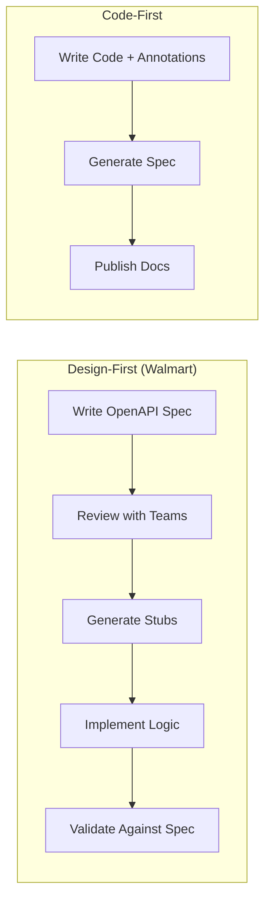

> **Anshul's decision:** Design-first was critical for the DC Inventory Search API because three teams (inventory, supply chain, and frontend) needed to agree on the contract. The 898-line spec defined all endpoints, schemas, error models, and pagination before a single line of Java was written. This enabled the parallel consumer integration to proceed 30% faster since the frontend team could build against mock responses immediately.

## OpenAPI Document Structure

Every OpenAPI 3.x document has this top-level structure:

```yaml
openapi: "3.0.3"           # Required: OAS version

info:                        # Required: API metadata
  title: ...
  version: ...
  description: ...
  contact: ...
  license: ...

servers:                     # Where the API is hosted
  - url: https://api.example.com/v1
    description: Production

paths:                       # Required: All endpoints
  /resource:
    get: ...
    post: ...

components:                  # Reusable definitions
  schemas: ...               #   Data models
  parameters: ...            #   Shared parameters
  responses: ...             #   Shared responses
  securitySchemes: ...       #   Auth definitions
  requestBodies: ...         #   Shared request bodies
  headers: ...               #   Shared headers

security:                    # Global security requirements
  - bearerAuth: []

tags:                        # Endpoint grouping
  - name: Inventory
    description: Inventory operations

externalDocs:                # Links to external docs
  url: https://wiki.example.com
```

---

# Part 2: Writing OpenAPI Specs

## Info and Servers

The `info` object provides metadata about the API. The `servers` array defines where the API can be accessed.

```yaml
openapi: "3.0.3"
info:
  title: DC Inventory Search API
  version: "2.1.0"
  description: |
    Provides real-time inventory search across Walmart distribution centers
    in the United States, Canada, and Mexico.

    ## Features
    - Multi-region search (US, CA, MX)
    - Real-time stock levels
    - Bulk item lookup
    - Pagination with cursor support

    ## Rate Limits
    - 1000 requests/minute per API key
    - Bulk endpoints: 100 requests/minute
  contact:
    name: Supply Chain Platform Team
    email: sc-platform@walmart.com
  license:
    name: Internal Use Only

servers:
  - url: https://api.prod.walmart.com/inventory/v2
    description: Production (US-East)
  - url: https://api.staging.walmart.com/inventory/v2
    description: Staging
  - url: http://localhost:8080/inventory/v2
    description: Local Development
```

## Paths and Operations

Paths define the endpoints. Each path can have multiple operations (HTTP methods).

```yaml
paths:
  /items:
    get:
      tags:
        - Inventory
      summary: Search inventory items
      description: |
        Returns paginated inventory items matching the search criteria.
        Supports filtering by region, category, and availability.
      operationId: searchInventoryItems
      parameters:
        - $ref: '#/components/parameters/RegionParam'
        - $ref: '#/components/parameters/PageSizeParam'
        - $ref: '#/components/parameters/CursorParam'
        - name: category
          in: query
          required: false
          schema:
            type: string
            example: "electronics"
        - name: inStock
          in: query
          required: false
          schema:
            type: boolean
            default: true
      responses:
        '200':
          $ref: '#/components/responses/InventoryListResponse'
        '400':
          $ref: '#/components/responses/BadRequestError'
        '401':
          $ref: '#/components/responses/UnauthorizedError'
        '429':
          $ref: '#/components/responses/RateLimitError'
        '500':
          $ref: '#/components/responses/InternalServerError'

    post:
      tags:
        - Inventory
      summary: Bulk item lookup
      description: Look up inventory for multiple item IDs in a single request.
      operationId: bulkItemLookup
      requestBody:
        required: true
        content:
          application/json:
            schema:
              $ref: '#/components/schemas/BulkLookupRequest'
            example:
              itemIds:
                - "WMT-001234"
                - "WMT-005678"
              region: "US"
      responses:
        '200':
          description: Bulk lookup results
          content:
            application/json:
              schema:
                $ref: '#/components/schemas/BulkLookupResponse'
        '400':
          $ref: '#/components/responses/BadRequestError'

  /items/{itemId}:
    get:
      tags:
        - Inventory
      summary: Get single item inventory
      operationId: getItemInventory
      parameters:
        - name: itemId
          in: path
          required: true
          schema:
            type: string
            pattern: '^WMT-\d{6}$'
          example: "WMT-001234"
        - $ref: '#/components/parameters/RegionParam'
      responses:
        '200':
          description: Item inventory details
          content:
            application/json:
              schema:
                $ref: '#/components/schemas/InventoryItem'
        '404':
          $ref: '#/components/responses/NotFoundError'
```

## Components and Schemas

Components define reusable data models. This is where the bulk of a large spec lives.

```yaml
components:
  schemas:
    InventoryItem:
      type: object
      required:
        - itemId
        - name
        - region
        - quantity
        - lastUpdated
      properties:
        itemId:
          type: string
          pattern: '^WMT-\d{6}$'
          description: Unique item identifier
          example: "WMT-001234"
        name:
          type: string
          maxLength: 200
          example: "Samsung 65-inch 4K TV"
        region:
          $ref: '#/components/schemas/Region'
        category:
          type: string
          example: "electronics"
        quantity:
          type: integer
          minimum: 0
          description: Current stock level
          example: 142
        warehouseLocations:
          type: array
          items:
            $ref: '#/components/schemas/WarehouseLocation'
        lastUpdated:
          type: string
          format: date-time
          example: "2024-01-15T10:30:00Z"
        metadata:
          type: object
          additionalProperties: true
          description: Flexible key-value metadata

    Region:
      type: string
      enum:
        - US
        - CA
        - MX
      description: Geographic region code

    WarehouseLocation:
      type: object
      properties:
        dcId:
          type: string
          example: "DC-7045"
        dcName:
          type: string
          example: "Bentonville DC"
        quantity:
          type: integer
          minimum: 0
        zone:
          type: string
          enum: [AMBIENT, COLD, FROZEN]

    BulkLookupRequest:
      type: object
      required:
        - itemIds
        - region
      properties:
        itemIds:
          type: array
          items:
            type: string
          minItems: 1
          maxItems: 100
          description: List of item IDs (max 100)
        region:
          $ref: '#/components/schemas/Region'

    BulkLookupResponse:
      type: object
      properties:
        results:
          type: array
          items:
            $ref: '#/components/schemas/InventoryItem'
        notFound:
          type: array
          items:
            type: string
          description: Item IDs that were not found
        totalFound:
          type: integer

    PaginatedResponse:
      type: object
      properties:
        data:
          type: array
          items: {}
        pagination:
          $ref: '#/components/schemas/CursorPagination'

    CursorPagination:
      type: object
      properties:
        cursor:
          type: string
          nullable: true
          description: Opaque cursor for the next page
        hasMore:
          type: boolean
        pageSize:
          type: integer
        totalCount:
          type: integer
```

## Parameters and Request Bodies

Reusable parameters keep the spec DRY:

```yaml
  parameters:
    RegionParam:
      name: region
      in: query
      required: true
      description: Target geographic region
      schema:
        $ref: '#/components/schemas/Region'

    PageSizeParam:
      name: pageSize
      in: query
      required: false
      schema:
        type: integer
        minimum: 1
        maximum: 100
        default: 20

    CursorParam:
      name: cursor
      in: query
      required: false
      description: Opaque cursor from previous response
      schema:
        type: string

    CorrelationIdHeader:
      name: X-Correlation-ID
      in: header
      required: false
      description: Trace correlation ID for distributed tracing
      schema:
        type: string
        format: uuid
```

## Responses and Error Models

Standardized error responses following RFC 7807:

```yaml
  responses:
    BadRequestError:
      description: Invalid request parameters
      content:
        application/problem+json:
          schema:
            $ref: '#/components/schemas/ProblemDetail'
          example:
            type: "https://api.walmart.com/errors/validation"
            title: "Validation Error"
            status: 400
            detail: "Region parameter must be one of: US, CA, MX"
            instance: "/inventory/v2/items?region=UK"

    UnauthorizedError:
      description: Missing or invalid authentication
      content:
        application/problem+json:
          schema:
            $ref: '#/components/schemas/ProblemDetail'

    NotFoundError:
      description: Resource not found
      content:
        application/problem+json:
          schema:
            $ref: '#/components/schemas/ProblemDetail'
          example:
            type: "https://api.walmart.com/errors/not-found"
            title: "Not Found"
            status: 404
            detail: "Item WMT-999999 not found"

    RateLimitError:
      description: Rate limit exceeded
      headers:
        Retry-After:
          schema:
            type: integer
          description: Seconds to wait before retrying
        X-RateLimit-Limit:
          schema:
            type: integer
        X-RateLimit-Remaining:
          schema:
            type: integer
      content:
        application/problem+json:
          schema:
            $ref: '#/components/schemas/ProblemDetail'

    InternalServerError:
      description: Unexpected server error
      content:
        application/problem+json:
          schema:
            $ref: '#/components/schemas/ProblemDetail'

    InventoryListResponse:
      description: Paginated list of inventory items
      content:
        application/json:
          schema:
            allOf:
              - $ref: '#/components/schemas/PaginatedResponse'
              - type: object
                properties:
                  data:
                    type: array
                    items:
                      $ref: '#/components/schemas/InventoryItem'

  schemas:
    # ... (previous schemas) ...

    ProblemDetail:
      type: object
      description: RFC 7807 Problem Detail
      required:
        - type
        - title
        - status
      properties:
        type:
          type: string
          format: uri
          description: URI identifying the problem type
        title:
          type: string
          description: Short human-readable summary
        status:
          type: integer
          description: HTTP status code
        detail:
          type: string
          description: Human-readable explanation
        instance:
          type: string
          description: URI of the specific occurrence
        errors:
          type: array
          items:
            type: object
            properties:
              field:
                type: string
              message:
                type: string
          description: Field-level validation errors
```

## Security Schemes

```yaml
  securitySchemes:
    bearerAuth:
      type: http
      scheme: bearer
      bearerFormat: JWT
      description: JWT token from authentication service

    apiKeyAuth:
      type: apiKey
      in: header
      name: X-API-Key
      description: API key for service-to-service calls

    oauth2:
      type: oauth2
      flows:
        clientCredentials:
          tokenUrl: https://auth.walmart.com/oauth/token
          scopes:
            inventory:read: Read inventory data
            inventory:write: Modify inventory data
            inventory:admin: Administrative operations

# Apply globally
security:
  - bearerAuth: []
  - apiKeyAuth: []
```

## Anshul's 898-Line Spec Walkthrough

Anshul's DC Inventory Search API spec at Walmart was 898 lines of YAML and covered:

```
Lines   1-30:   info, servers, tags
Lines  31-85:   Security schemes (JWT + API key)
Lines  86-280:  Paths -- 8 endpoints across 3 resources
                  /items (GET, POST)
                  /items/{itemId} (GET, PUT, DELETE)
                  /items/search (POST -- advanced search)
                  /items/bulk (POST -- bulk operations)
                  /health (GET -- health check)
Lines 281-580:  Components/schemas -- 18 data models
                  InventoryItem, Region, WarehouseLocation,
                  SearchRequest, SearchResponse, BulkRequest,
                  BulkResponse, PaginatedResponse, CursorPagination,
                  ProblemDetail, HealthStatus, etc.
Lines 581-720:  Components/parameters -- 12 reusable params
                  RegionParam, PageSizeParam, CursorParam,
                  CorrelationIdHeader, ItemIdPath, etc.
Lines 721-850:  Components/responses -- 8 response templates
                  With full RFC 7807 error examples
Lines 851-898:  Tags, externalDocs, and x-extensions
```

**Impact of the design-first approach:**
- 3 teams reviewed the spec before implementation
- Frontend team started building UI from mock server on day 1
- Parallel consumer integration was 30% faster because contracts were locked
- Factory pattern for US/CA/MX was designed directly from the `Region` enum in the spec
- Zero breaking changes after implementation began

---

# Part 3: API Versioning Strategies

API versioning is essential when you need to evolve an API without breaking existing clients. There are four major strategies, each with different trade-offs.

## URL Path Versioning

The version number is embedded directly in the URL path.

```
GET /api/v1/items
GET /api/v2/items
```

```java
// Spring Boot controller with path versioning
@RestController
@RequestMapping("/api/v1/items")
public class ItemControllerV1 {
    @GetMapping("/{itemId}")
    public ResponseEntity<ItemV1> getItem(@PathVariable String itemId) {
        return ResponseEntity.ok(itemService.getItemV1(itemId));
    }
}

@RestController
@RequestMapping("/api/v2/items")
public class ItemControllerV2 {
    @GetMapping("/{itemId}")
    public ResponseEntity<ItemV2> getItem(@PathVariable String itemId) {
        // V2 includes warehouse breakdown
        return ResponseEntity.ok(itemService.getItemV2(itemId));
    }
}
```

**Pros:** Simple, visible, easy to route, easy to cache, easy to deprecate
**Cons:** URL pollution, hard to maintain many versions, violates REST purists' principle that URIs should identify resources not versions

## Query Parameter Versioning

```
GET /api/items?version=1
GET /api/items?version=2
```

**Pros:** Single endpoint, optional parameter with default
**Cons:** Easy to forget, harder to route at load balancer level, cache key complexity

## Header Versioning

A custom header carries the version:

```
GET /api/items
X-API-Version: 2
```

```java
@GetMapping("/items/{itemId}")
public ResponseEntity<?> getItem(
    @PathVariable String itemId,
    @RequestHeader(value = "X-API-Version", defaultValue = "1") int version) {

    if (version == 2) {
        return ResponseEntity.ok(itemService.getItemV2(itemId));
    }
    return ResponseEntity.ok(itemService.getItemV1(itemId));
}
```

**Pros:** Clean URLs, version is metadata (not resource identity)
**Cons:** Hidden from casual inspection, harder to test in browser, requires header awareness in all clients

## Content Negotiation

Uses the `Accept` header with vendor media types:

```
GET /api/items
Accept: application/vnd.walmart.inventory.v2+json
```

```java
@GetMapping(value = "/items/{itemId}",
            produces = "application/vnd.walmart.inventory.v2+json")
public ResponseEntity<ItemV2> getItemV2(@PathVariable String itemId) {
    return ResponseEntity.ok(itemService.getItemV2(itemId));
}
```

**Pros:** Most RESTful approach, fine-grained versioning per resource, supports multiple representations simultaneously
**Cons:** Most complex to implement, hardest for clients to use, difficult to test manually

## Versioning Comparison Table

| Strategy | URL Clarity | REST Purity | Caching | Routing | Client Simplicity | Google's Preference |
|----------|-------------|-------------|---------|---------|-------------------|---------------------|
| **URL Path** | Excellent | Low | Easy | Easy | Simple | Yes (used in most Google APIs) |
| **Query Param** | Good | Medium | Complex | Medium | Simple | No |
| **Header** | Hidden | High | Complex | Hard | Medium | Sometimes |
| **Content Negotiation** | Hidden | Highest | Complex | Hard | Complex | Rarely |

> **Google's approach:** Google APIs predominantly use URL path versioning (`/v1/`, `/v2/`). The Google API Design Guide explicitly recommends major version in the URL path. Minor/patch versions are handled via feature flags or additive changes (backward-compatible additions do not require a new version).

> **Anshul's approach at Walmart:** The DC Inventory Search API used URL path versioning (`/inventory/v2/items`) because it was the simplest for the three consuming teams and aligned with Walmart's internal API standards.

---

# Part 4: REST Best Practices

## Resource Naming Conventions

REST APIs model resources as nouns, not actions. URLs should be predictable and hierarchical.

**Rules:**
1. Use **plural nouns** for collections: `/items`, `/users`, `/orders`
2. Use **kebab-case** for multi-word resources: `/warehouse-locations`
3. Use **path parameters** for resource identity: `/items/{itemId}`
4. Use **query parameters** for filtering/sorting: `/items?region=US&sort=name`
5. Nest resources to show relationships: `/users/{userId}/orders`
6. Keep nesting shallow (max 2-3 levels)
7. Avoid verbs in URLs (use HTTP methods instead)

```
GOOD                                    BAD
GET    /items                           GET    /getItems
GET    /items/WMT-001234                GET    /getItemById?id=WMT-001234
POST   /items                           POST   /createItem
PUT    /items/WMT-001234                POST   /updateItem
DELETE /items/WMT-001234                POST   /deleteItem
GET    /items?region=US&inStock=true     GET    /searchItemsByRegion?region=US
POST   /items/WMT-001234/likes          POST   /likeItem?id=WMT-001234
```

**HTTP method semantics:**

| Method | Semantics | Idempotent | Safe | Request Body |
|--------|-----------|------------|------|--------------|
| GET | Read resource(s) | Yes | Yes | No |
| POST | Create resource | No | No | Yes |
| PUT | Full replacement | Yes | No | Yes |
| PATCH | Partial update | No* | No | Yes |
| DELETE | Remove resource | Yes | No | Optional |
| HEAD | GET without body | Yes | Yes | No |
| OPTIONS | Supported methods | Yes | Yes | No |

*PATCH can be made idempotent with JSON Merge Patch but is not inherently idempotent.

## Pagination Patterns

### Offset-Based Pagination

```
GET /items?offset=40&limit=20
```

```json
{
  "data": [...],
  "pagination": {
    "offset": 40,
    "limit": 20,
    "total": 1523
  }
}
```

**Pros:** Simple, allows jumping to any page, total count available
**Cons:** Slow on large datasets (DB does `OFFSET` scan), inconsistent results if data changes between pages

**SQL:** `SELECT * FROM items ORDER BY id LIMIT 20 OFFSET 40;` -- DB scans and discards 40 rows

### Cursor-Based Pagination (What Anshul Used)

```
GET /items?cursor=eyJpZCI6MTAwfQ&pageSize=20
```

```json
{
  "data": [...],
  "pagination": {
    "cursor": "eyJpZCI6MTIwfQ",
    "hasMore": true,
    "pageSize": 20
  }
}
```

The cursor is an opaque, base64-encoded token (e.g., `{"id": 120}` encoded). The server uses it to efficiently seek to the correct position.

**Pros:** Consistent performance regardless of page depth, stable results even when data changes
**Cons:** Cannot jump to arbitrary pages, no total count (without a separate query)

**SQL:** `SELECT * FROM items WHERE id > 100 ORDER BY id LIMIT 20;` -- Uses index, no scan

### Keyset Pagination

A specific form of cursor pagination using the last seen value as the key:

```
GET /items?after_id=WMT-001234&limit=20
GET /items?created_after=2024-01-15T10:00:00Z&limit=20
```

**Pros:** Same as cursor but the key is transparent and debuggable
**Cons:** Requires a unique, sortable column; complex for multi-column sorts

### Pagination Comparison

| Aspect | Offset | Cursor | Keyset |
|--------|--------|--------|--------|
| Performance at depth | O(n) | O(1) | O(1) |
| Jump to page | Yes | No | No |
| Consistent results | No | Yes | Yes |
| Total count | Easy | Expensive | Expensive |
| Implementation | Simple | Medium | Medium |
| Best for | Small datasets, admin UIs | Infinite scroll, feeds | Time-series, sorted data |

> **Anshul's choice:** Cursor-based pagination for the DC Inventory API. With millions of items across US/CA/MX, offset pagination would have degraded at depth. The cursor encoded the composite key `(region, dcId, itemId)` for efficient multi-region queries.

## Error Handling and RFC 7807

RFC 7807 ("Problem Details for HTTP APIs") defines a standard error response format. It is the recommended approach for Google-quality APIs.

```json
{
  "type": "https://api.walmart.com/errors/inventory/item-not-found",
  "title": "Item Not Found",
  "status": 404,
  "detail": "Item WMT-999999 does not exist in region US",
  "instance": "/inventory/v2/items/WMT-999999?region=US",
  "errors": []
}
```

**For validation errors (400), include field-level details:**

```json
{
  "type": "https://api.walmart.com/errors/validation",
  "title": "Validation Error",
  "status": 400,
  "detail": "Request body contains 2 validation errors",
  "instance": "/inventory/v2/items",
  "errors": [
    {
      "field": "itemId",
      "message": "Item ID must match pattern WMT-NNNNNN"
    },
    {
      "field": "quantity",
      "message": "Quantity must be a non-negative integer"
    }
  ]
}
```

**Content-Type for RFC 7807:** `application/problem+json`

**Java implementation:**

```java
@ControllerAdvice
public class GlobalExceptionHandler {

    @ExceptionHandler(ItemNotFoundException.class)
    public ResponseEntity<ProblemDetail> handleNotFound(
            ItemNotFoundException ex, HttpServletRequest request) {

        ProblemDetail problem = ProblemDetail.forStatusAndDetail(
            HttpStatus.NOT_FOUND, ex.getMessage());
        problem.setType(URI.create("https://api.walmart.com/errors/not-found"));
        problem.setTitle("Not Found");
        problem.setInstance(URI.create(request.getRequestURI()));

        return ResponseEntity.status(404)
            .contentType(MediaType.APPLICATION_PROBLEM_JSON)
            .body(problem);
    }

    @ExceptionHandler(MethodArgumentNotValidException.class)
    public ResponseEntity<ProblemDetail> handleValidation(
            MethodArgumentNotValidException ex, HttpServletRequest request) {

        List<Map<String, String>> fieldErrors = ex.getBindingResult()
            .getFieldErrors().stream()
            .map(fe -> Map.of(
                "field", fe.getField(),
                "message", fe.getDefaultMessage()))
            .collect(Collectors.toList());

        ProblemDetail problem = ProblemDetail.forStatusAndDetail(
            HttpStatus.BAD_REQUEST,
            "Request contains " + fieldErrors.size() + " validation errors");
        problem.setType(URI.create("https://api.walmart.com/errors/validation"));
        problem.setTitle("Validation Error");
        problem.setProperty("errors", fieldErrors);

        return ResponseEntity.badRequest()
            .contentType(MediaType.APPLICATION_PROBLEM_JSON)
            .body(problem);
    }
}
```

## HATEOAS

HATEOAS (Hypermedia as the Engine of Application State) means responses include links that guide clients to related actions and resources.

```json
{
  "itemId": "WMT-001234",
  "name": "Samsung 65-inch 4K TV",
  "quantity": 142,
  "_links": {
    "self": {
      "href": "/inventory/v2/items/WMT-001234"
    },
    "warehouse-details": {
      "href": "/inventory/v2/items/WMT-001234/warehouses"
    },
    "update": {
      "href": "/inventory/v2/items/WMT-001234",
      "method": "PUT"
    },
    "collection": {
      "href": "/inventory/v2/items?region=US"
    }
  }
}
```

**In practice:** Full HATEOAS is rarely implemented in production. Most teams include `self` links and pagination links. Google APIs use a simpler approach with `nextPageToken` instead of full HATEOAS.

## Idempotency

An operation is **idempotent** if making the same request multiple times produces the same result as making it once. This is critical for reliability in distributed systems.

**Why it matters:**
- Network failures may cause clients to retry requests
- Without idempotency, retries can create duplicate resources or apply changes twice
- Load balancers and API gateways may automatically retry failed requests

**Idempotency key pattern:**

```
POST /orders
Idempotency-Key: 550e8400-e29b-41d4-a716-446655440000
Content-Type: application/json

{
  "itemId": "WMT-001234",
  "quantity": 1
}
```

```java
@PostMapping("/orders")
public ResponseEntity<Order> createOrder(
        @RequestHeader("Idempotency-Key") String idempotencyKey,
        @RequestBody CreateOrderRequest request) {

    // Check if we already processed this request
    Optional<Order> existing = orderRepository
        .findByIdempotencyKey(idempotencyKey);

    if (existing.isPresent()) {
        // Return the same response -- idempotent!
        return ResponseEntity.ok(existing.get());
    }

    // Process the new order
    Order order = orderService.createOrder(request, idempotencyKey);
    return ResponseEntity.status(201).body(order);
}
```

**How to make each method idempotent:**

| Method | Naturally Idempotent? | How to Ensure |
|--------|----------------------|---------------|
| GET | Yes | Inherently safe and idempotent |
| PUT | Yes | Full replacement -- same input = same state |
| DELETE | Yes | Deleting twice = same result (resource gone) |
| PATCH | No | Use conditional headers (`If-Match: etag`) |
| POST | No | Use `Idempotency-Key` header |

---

# Part 5: Kafka Single Message Transforms (SMT)

## What Are SMTs

**Single Message Transforms (SMTs)** are lightweight, per-message transformations applied within **Kafka Connect** connectors. They modify messages as they flow through a connector -- either on the source side (before the message is written to Kafka) or the sink side (before the message is delivered to the external system).

**Key characteristics:**
- **Per-message:** Each message is transformed independently (no aggregation, no joins)
- **Lightweight:** Designed for simple, fast transformations -- not for complex business logic
- **Chainable:** Multiple SMTs can be chained together in a pipeline
- **Configurable:** Applied via connector configuration (no code deployment needed for built-in SMTs)
- **Predicated:** Since Kafka 2.6, SMTs can have predicates (conditional application)

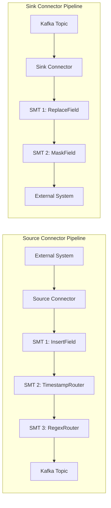

**Where SMTs live in the Kafka ecosystem:**

| Component | Purpose | Stateful? | Complexity |
|-----------|---------|-----------|------------|
| Kafka Producer | Application-level message creation | No | Full code |
| **Kafka Connect SMT** | **Per-message transform in connector** | **No** | **Config or simple code** |
| Kafka Streams | Stream processing with state | Yes | Full code |
| ksqlDB | SQL-based stream processing | Yes | SQL queries |
| Kafka Consumer | Application-level message consumption | No | Full code |

## Built-In SMTs

Kafka Connect ships with many built-in SMTs. Here are the most important ones:

### InsertField

Adds a field to the message key or value.

```properties
# Add a static field
transforms=addRegion
transforms.addRegion.type=org.apache.kafka.connect.transforms.InsertField$Value
transforms.addRegion.static.field=source_system
transforms.addRegion.static.value=walmart-inventory

# Add the topic name as a field
transforms=addTopic
transforms.addTopic.type=org.apache.kafka.connect.transforms.InsertField$Value
transforms.addTopic.topic.field=kafka_topic

# Add the timestamp as a field
transforms=addTimestamp
transforms.addTimestamp.type=org.apache.kafka.connect.transforms.InsertField$Value
transforms.addTimestamp.timestamp.field=kafka_timestamp
```

**Before:**
```json
{"itemId": "WMT-001234", "quantity": 142}
```

**After (with all three):**
```json
{
  "itemId": "WMT-001234",
  "quantity": 142,
  "source_system": "walmart-inventory",
  "kafka_topic": "inventory-updates",
  "kafka_timestamp": 1705312200000
}
```

### ReplaceField

Renames, includes, or excludes fields.

```properties
# Rename fields
transforms=renameFields
transforms.renameFields.type=org.apache.kafka.connect.transforms.ReplaceField$Value
transforms.renameFields.renames=itemId:item_id,warehouseId:warehouse_id

# Exclude sensitive fields before sinking
transforms=dropSensitive
transforms.dropSensitive.type=org.apache.kafka.connect.transforms.ReplaceField$Value
transforms.dropSensitive.exclude=ssn,creditCard,password

# Include only specific fields
transforms=selectFields
transforms.selectFields.type=org.apache.kafka.connect.transforms.ReplaceField$Value
transforms.selectFields.include=itemId,quantity,region,timestamp
```

### MaskField

Replaces field values with type-appropriate null/zero values. Essential for PII protection.

```properties
transforms=maskPII
transforms.maskPII.type=org.apache.kafka.connect.transforms.MaskField$Value
transforms.maskPII.fields=email,phone,address
```

**Before:**
```json
{"name": "John Doe", "email": "john@example.com", "phone": "555-1234", "orderId": "ORD-100"}
```

**After:**
```json
{"name": "John Doe", "email": "", "phone": "", "orderId": "ORD-100"}
```

### TimestampRouter

Routes messages to time-partitioned topics based on the message timestamp. Extremely useful for data lake ingestion.

```properties
transforms=routeByTime
transforms.routeByTime.type=org.apache.kafka.connect.transforms.TimestampRouter
transforms.routeByTime.topic.format=${topic}-${timestamp}
transforms.routeByTime.timestamp.format=yyyy-MM-dd
```

**Effect:** A message on topic `audit-events` with timestamp `2024-01-15T10:30:00Z` gets routed to topic `audit-events-2024-01-15`.

This is ideal for:
- Daily/hourly partitioned storage in data lakes
- Time-based retention policies
- Efficient historical queries

### RegexRouter

Renames or reroutes topics using regular expressions.

```properties
# Route all CDC topics to a unified topic
transforms=routeCDC
transforms.routeCDC.type=org.apache.kafka.connect.transforms.RegexRouter
transforms.routeCDC.regex=db-server1\.inventory\.(.*)
transforms.routeCDC.replacement=inventory-cdc-$1

# Add environment prefix
transforms=addEnv
transforms.addEnv.type=org.apache.kafka.connect.transforms.RegexRouter
transforms.addEnv.regex=(.*)
transforms.addEnv.replacement=prod-$1
```

### Other Important Built-In SMTs

| SMT | Purpose | Example Use Case |
|-----|---------|-----------------|
| `ValueToKey` | Extract value fields into the message key | Set key for compacted topics |
| `ExtractField` | Pull a single field from a struct | Extract just the ID from a complex value |
| `Flatten` | Flatten nested structs into dot-notation | `address.city` becomes `address_city` |
| `HoistField` | Wrap the entire value in a single field | Nest payload under `data` field |
| `SetSchemaMetadata` | Change schema name/version | Align schema names across connectors |
| `Cast` | Change field data types | Convert string IDs to integers |
| `HeaderFrom` | Copy value fields into Kafka headers | Move routing info to headers |
| `Filter` (with predicate) | Drop messages conditionally | Skip delete events |

## Custom SMTs

When built-in SMTs are insufficient, you can write custom SMTs in Java. A custom SMT implements the `Transformation<R>` interface.

```java
package com.walmart.kafka.transforms;

import org.apache.kafka.common.config.ConfigDef;
import org.apache.kafka.connect.connector.ConnectRecord;
import org.apache.kafka.connect.data.Schema;
import org.apache.kafka.connect.data.SchemaBuilder;
import org.apache.kafka.connect.data.Struct;
import org.apache.kafka.connect.transforms.Transformation;

import java.util.Map;

/**
 * Custom SMT that routes messages to region-specific topics
 * based on the 'region' field in the message value.
 *
 * Input topic:  audit-events
 * Output topic: audit-events-US, audit-events-CA, or audit-events-MX
 */
public class RegionRouter<R extends ConnectRecord<R>>
        implements Transformation<R> {

    private String fieldName;
    private String topicFormat;

    @Override
    public void configure(Map<String, ?> configs) {
        this.fieldName = (String) configs.getOrDefault(
            "field.name", "region");
        this.topicFormat = (String) configs.getOrDefault(
            "topic.format", "${topic}-${region}");
    }

    @Override
    public R apply(R record) {
        if (record.value() == null) {
            return record; // Pass through tombstones
        }

        String region = extractRegion(record);
        if (region == null) {
            return record; // No region field, pass through
        }

        String newTopic = topicFormat
            .replace("${topic}", record.topic())
            .replace("${region}", region.toUpperCase());

        return record.newRecord(
            newTopic,             // New topic name
            record.kafkaPartition(),
            record.keySchema(),
            record.key(),
            record.valueSchema(),
            record.value(),
            record.timestamp()
        );
    }

    private String extractRegion(R record) {
        Object value = record.value();

        if (value instanceof Struct) {
            Struct struct = (Struct) value;
            if (struct.schema().field(fieldName) != null) {
                return struct.getString(fieldName);
            }
        } else if (value instanceof Map) {
            @SuppressWarnings("unchecked")
            Map<String, Object> map = (Map<String, Object>) value;
            Object region = map.get(fieldName);
            return region != null ? region.toString() : null;
        }

        return null;
    }

    @Override
    public ConfigDef config() {
        return new ConfigDef()
            .define("field.name", ConfigDef.Type.STRING, "region",
                ConfigDef.Importance.HIGH,
                "Name of the field containing the region code")
            .define("topic.format", ConfigDef.Type.STRING,
                "${topic}-${region}",
                ConfigDef.Importance.HIGH,
                "Format for the output topic name");
    }

    @Override
    public void close() {
        // Cleanup resources if any
    }
}
```

## SMT Chains and Predicates

### Chaining Multiple SMTs

SMTs are applied in order. The output of one SMT becomes the input of the next.

```properties
# Chain: Insert timestamp -> Route by region -> Mask PII
transforms=addTimestamp,routeByRegion,maskPII

transforms.addTimestamp.type=org.apache.kafka.connect.transforms.InsertField$Value
transforms.addTimestamp.timestamp.field=event_timestamp

transforms.routeByRegion.type=com.walmart.kafka.transforms.RegionRouter
transforms.routeByRegion.field.name=region
transforms.routeByRegion.topic.format=${topic}-${region}

transforms.maskPII.type=org.apache.kafka.connect.transforms.MaskField$Value
transforms.maskPII.fields=email,phone,ssn
```

### Predicates (Conditional SMTs)

Since Kafka Connect 2.6, you can apply SMTs conditionally using predicates:

```properties
# Only mask PII for non-admin events
transforms=maskPII
transforms.maskPII.type=org.apache.kafka.connect.transforms.MaskField$Value
transforms.maskPII.fields=email,phone
transforms.maskPII.predicate=isNotAdmin
transforms.maskPII.negate=false

predicates=isNotAdmin
predicates.isNotAdmin.type=org.apache.kafka.connect.transforms.predicates.RecordIsTombstone
# Or use TopicNameMatches, HasHeaderKey, etc.

# Filter (drop) messages matching a predicate
transforms=dropDeletes
transforms.dropDeletes.type=org.apache.kafka.connect.transforms.Filter
transforms.dropDeletes.predicate=isTombstone

predicates=isTombstone
predicates.isTombstone.type=org.apache.kafka.connect.transforms.predicates.RecordIsTombstone
```

**Built-in predicates:**

| Predicate | Purpose |
|-----------|---------|
| `RecordIsTombstone` | True if value is null |
| `HasHeaderKey` | True if a specific header exists |
| `TopicNameMatches` | True if topic matches a regex |

---

# Part 6: SMT Geographic Routing

## How Anshul Routed US/CA/MX

At Walmart, Anshul designed a three-tier Kafka audit logging system that needed to route events to region-specific topics for compliance and data residency requirements. Events from US, Canadian, and Mexican distribution centers had to be processed and stored according to each country's data regulations.

**The challenge:**
- A single `audit-events` topic received events from all three regions
- US data needed to stay in US-East/US-South Central Azure regions
- Canadian data had specific retention requirements (7 years for financial audits)
- Mexican data required Spanish-language metadata enrichment
- Each region had different downstream consumers (BigQuery tables, compliance systems)

**The solution: SMT-based geographic routing**

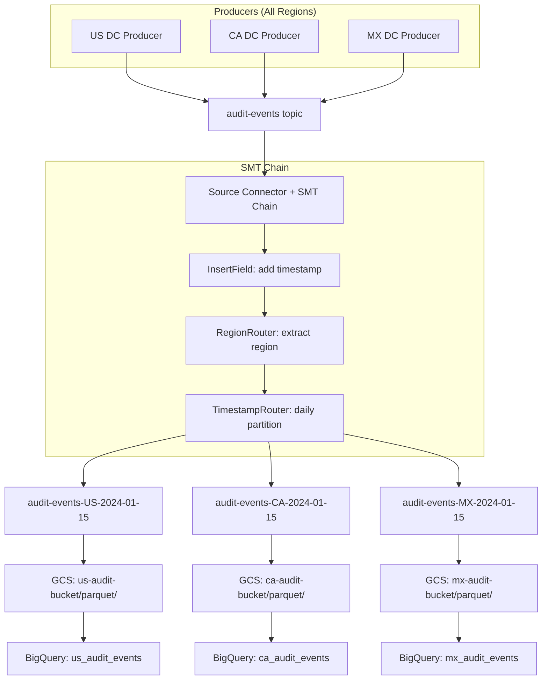

## Routing Configuration Examples

### Complete Connector Configuration

```properties
# Kafka Connect Source Connector with SMT chain
name=audit-event-router
connector.class=io.confluent.connect.kafka.KafkaSourceConnector
tasks.max=3

# Source topic
kafka.topic=audit-events
topic.prefix=routed-

# SMT Chain: Insert metadata -> Route by region -> Route by date
transforms=insertMetadata,routeByRegion,routeByDate

# SMT 1: Add processing metadata
transforms.insertMetadata.type=org.apache.kafka.connect.transforms.InsertField$Value
transforms.insertMetadata.static.field=processed_by
transforms.insertMetadata.static.value=audit-router-v2
transforms.insertMetadata.timestamp.field=routed_at

# SMT 2: Route to region-specific topic
transforms.routeByRegion.type=com.walmart.kafka.transforms.RegionRouter
transforms.routeByRegion.field.name=region
transforms.routeByRegion.topic.format=audit-events-${region}

# SMT 3: Add daily partitioning
transforms.routeByDate.type=org.apache.kafka.connect.transforms.TimestampRouter
transforms.routeByDate.topic.format=${topic}-${timestamp}
transforms.routeByDate.timestamp.format=yyyy-MM-dd

# Result: audit-events-US-2024-01-15, audit-events-CA-2024-01-15, etc.
```

### Alternative: Using RegexRouter for Region Extraction

If the region is embedded in the source topic name rather than the message value:

```properties
# Source topics: dc-us-east-events, dc-ca-west-events, dc-mx-central-events
transforms=extractRegion

transforms.extractRegion.type=org.apache.kafka.connect.transforms.RegexRouter
transforms.extractRegion.regex=dc-([a-z]{2})-.*-events
transforms.extractRegion.replacement=audit-events-$1
# Result: audit-events-us, audit-events-ca, audit-events-mx
```

### Sink Connector: Region to GCS Parquet

```properties
# GCS Sink Connector for US region
name=audit-gcs-sink-us
connector.class=io.confluent.connect.gcs.GcsSinkConnector
tasks.max=2

# Read from US-routed topics
topics.regex=audit-events-US-.*

# GCS configuration
gcs.bucket.name=walmart-audit-us-east
gcs.part.size=67108864
flush.size=10000
rotate.interval.ms=3600000

# Parquet format
format.class=io.confluent.connect.gcs.format.parquet.ParquetFormat
parquet.codec=snappy

# Partitioning in GCS
partitioner.class=io.confluent.connect.storage.partitioner.TimeBasedPartitioner
partition.duration.ms=86400000
path.format='year'=YYYY/'month'=MM/'day'=dd
locale=en-US
timezone=America/Chicago

# Schema
value.converter=io.confluent.connect.avro.AvroConverter
value.converter.schema.registry.url=http://schema-registry:8081

# SMT: flatten nested structs for Parquet compatibility
transforms=flatten
transforms.flatten.type=org.apache.kafka.connect.transforms.Flatten$Value
transforms.flatten.delimiter=_
```

### Factory Pattern Integration

The SMT-based routing aligned with Anshul's factory pattern for regional processing:

```java
/**
 * Factory pattern that creates region-specific processors.
 * The region is determined by the SMT-routed topic name.
 */
public class RegionalProcessorFactory {

    private final Map<String, AuditEventProcessor> processors;

    public RegionalProcessorFactory() {
        this.processors = Map.of(
            "US", new USAuditProcessor(),    // English, USD, US compliance
            "CA", new CAAuditProcessor(),    // English/French, CAD, Canadian regs
            "MX", new MXAuditProcessor()     // Spanish, MXN, Mexican regs
        );
    }

    public AuditEventProcessor getProcessor(String topic) {
        // Extract region from topic: "audit-events-US-2024-01-15" -> "US"
        String region = topic.split("-")[2];
        AuditEventProcessor processor = processors.get(region);
        if (processor == null) {
            throw new IllegalArgumentException(
                "No processor for region: " + region);
        }
        return processor;
    }
}

// Consumer that uses the factory
@KafkaListener(topicPattern = "audit-events-(US|CA|MX)-.*")
public void processAuditEvent(
        ConsumerRecord<String, AuditEvent> record) {

    AuditEventProcessor processor =
        processorFactory.getProcessor(record.topic());

    processor.process(record.value());
}
```

**Performance results:**
- SMT processing added < 1ms latency per message
- Combined with the three-tier architecture, end-to-end P99 was < 5ms
- Zero cross-region data leakage after deployment
- Each region's GCS bucket had independent lifecycle policies

## Geographic Routing Architecture

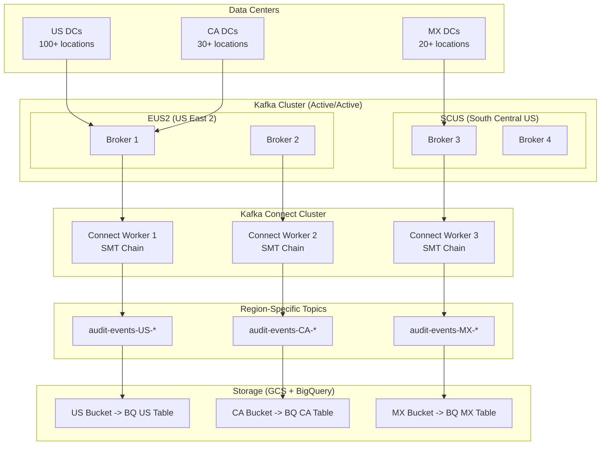

---

# Part 7: Disaster Recovery Concepts

## RTO and RPO Definitions

These are the two most critical metrics in disaster recovery planning:

### Recovery Time Objective (RTO)

**RTO** is the maximum acceptable amount of time that a system can be down after a disaster before the business impact becomes unacceptable.

- **RTO = 0:** System must never go down (requires Active/Active)
- **RTO = 15 minutes:** System can be down for at most 15 minutes (Anshul's target)
- **RTO = 1 hour:** The original target Anshul improved upon
- **RTO = 4 hours:** Typical for non-critical systems
- **RTO = 24 hours:** Acceptable for batch processing systems

### Recovery Point Objective (RPO)

**RPO** is the maximum acceptable amount of data loss measured in time. It answers: "How much data can we afford to lose?"

- **RPO = 0:** Zero data loss (requires synchronous replication)
- **RPO = 5 minutes:** At most 5 minutes of data can be lost
- **RPO = 1 hour:** At most 1 hour of data can be lost
- **RPO = 24 hours:** Daily backups are sufficient

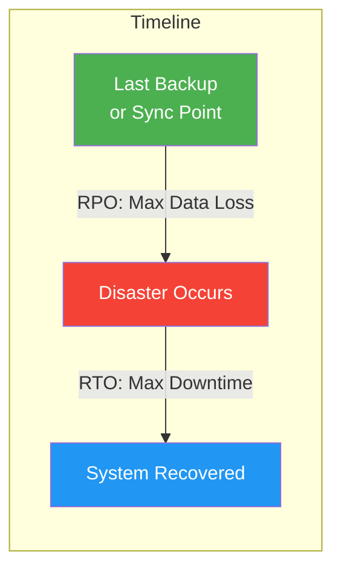

**The relationship between RTO, RPO, and cost:**

| RTO/RPO Target | Cost | Architecture Required |
|----------------|------|----------------------|
| Near-zero (< 1 min) | $$$$$ | Active/Active multi-region + synchronous replication |
| Very low (1-15 min) | $$$$ | Active/Active with async replication + automated failover |
| Low (15 min - 1 hr) | $$$ | Warm Standby with automated failover |
| Medium (1-4 hrs) | $$ | Pilot Light with manual failover |
| High (4-24 hrs) | $ | Backup/Restore from cold storage |

> **Anshul's achievement:** Reduced RTO from 1 hour to 15 minutes while maintaining RPO = 0 (zero data loss) using Active/Active multi-region Kafka with CompletableFuture failover.

## Active/Active Architecture

In Active/Active, **all regions are serving traffic simultaneously**. There is no "standby" -- every region is a primary.

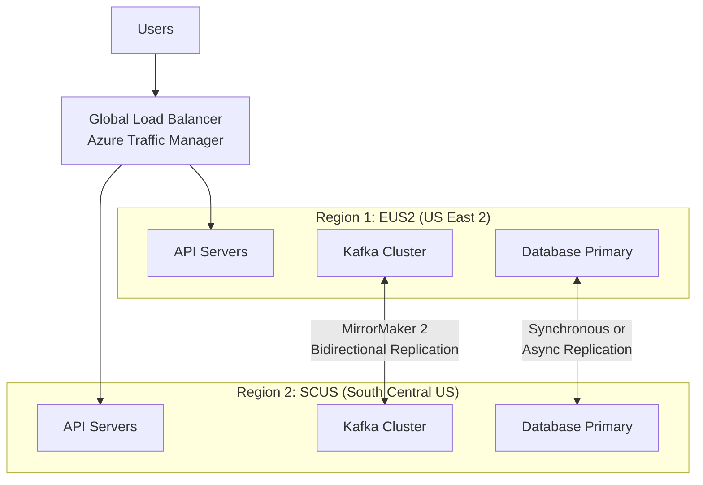

**Characteristics:**
- Both regions handle read AND write traffic
- Data is replicated bidirectionally between regions
- If one region fails, the other absorbs all traffic seamlessly
- No manual failover needed -- traffic just shifts
- Conflict resolution needed for concurrent writes to same data

**Challenges:**
- **Data conflicts:** Two regions may update the same record simultaneously
- **Replication lag:** Even fast replication has some delay
- **Complexity:** Bidirectional replication is significantly harder than unidirectional
- **Cost:** Running full infrastructure in 2+ regions

**Conflict resolution strategies:**
1. **Last-writer-wins (LWW):** Use timestamps; latest write wins
2. **Region-affinity:** Route writes for a given key to a designated region
3. **CRDTs:** Conflict-free replicated data types (counters, sets)
4. **Application-level merge:** Custom logic to reconcile conflicts

## Active/Passive Architecture

In Active/Passive, one region handles all traffic while the other is on standby, ready to take over.

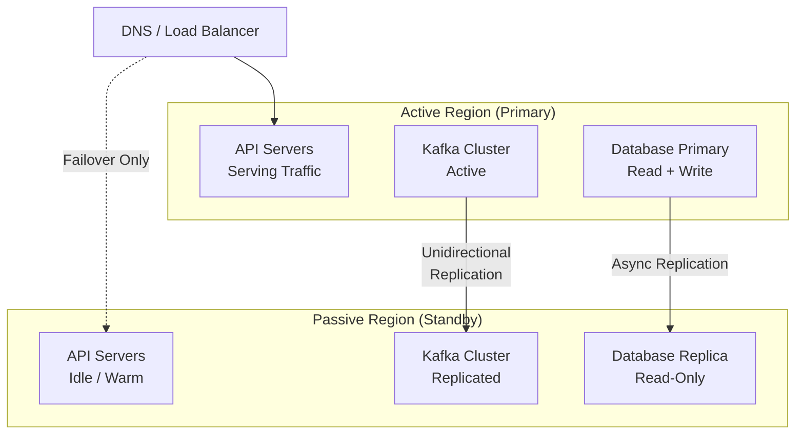

**Characteristics:**
- Simple -- no conflict resolution needed
- Passive region is idle (wasted resources) or handling read-only traffic
- Failover requires DNS change or load balancer reconfiguration
- RTO depends on how quickly failover can be triggered (typically 5-30 minutes)
- RPO depends on replication lag (async = some data loss, sync = zero loss)

## Pilot Light, Warm Standby, Multi-Site

### Pilot Light

The **minimal** version of your environment runs in the DR region. Core infrastructure (databases, message brokers) replicate data, but compute resources (API servers, workers) are not running.

```
Active Region                    DR Region (Pilot Light)
+------------------+            +------------------+
| API Servers (ON) |            | API Servers (OFF)|
| Workers    (ON)  |            | Workers    (OFF) |
| Kafka      (ON)  | ------>>  | Kafka      (ON)  |  <-- Data replicating
| Database   (ON)  | ------>>  | Database   (ON)  |  <-- Data replicating
+------------------+            +------------------+
```

**Failover:** Start compute resources in DR region (5-30 minutes to scale up)
**Cost:** Low -- only data layer runs continuously
**RTO:** 15-60 minutes (time to start and warm up compute)
**RPO:** Near-zero (data is already replicated)

### Warm Standby

A **scaled-down** version of the full environment runs in the DR region. Compute resources are running but at reduced capacity.

```
Active Region                    DR Region (Warm Standby)
+------------------+            +------------------+
| API: 10 pods     |            | API: 2 pods      |  <-- Running, minimal
| Workers: 5 pods  |            | Workers: 1 pod   |
| Kafka: 6 brokers | ------>>  | Kafka: 3 brokers |
| Database: Primary| ------>>  | Database: Replica |
+------------------+            +------------------+
```

**Failover:** Scale up compute in DR region (5-15 minutes)
**Cost:** Medium -- reduced compute always running
**RTO:** 5-15 minutes
**RPO:** Near-zero

### Multi-Site (Active/Active)

Full infrastructure runs in all regions, all serving traffic. This is what Anshul implemented.

**Failover:** Automatic -- traffic redistributes
**Cost:** Highest -- full infrastructure in every region
**RTO:** Near-zero (seconds to minutes)
**RPO:** Zero with synchronous replication, near-zero with async

## DR Strategy Comparison Table

| Strategy | RTO | RPO | Cost | Complexity | Failover Type | Best For |
|----------|-----|-----|------|------------|---------------|----------|
| **Backup/Restore** | Hours-Days | Hours-Days | $ | Low | Manual | Dev/Test, archives |
| **Pilot Light** | 15-60 min | Near-zero | $$ | Medium | Semi-automated | Cost-sensitive production |
| **Warm Standby** | 5-15 min | Near-zero | $$$ | Medium-High | Semi-automated | Production with moderate SLAs |
| **Active/Passive** | 5-30 min | Minutes (async) or Zero (sync) | $$$ | Medium | Automated or manual | Production with clear primary |
| **Active/Active** | Near-zero | Zero (with sync repl.) | $$$$$ | Very High | Automatic | Mission-critical, global apps |
| **Anshul's Setup** | **15 min** | **Zero** | $$$$ | High | **Automated** | **Walmart audit logging** |

```mermaid
graph LR
    subgraph "Cost vs Recovery Speed"
        A[Backup/Restore<br/>$ / Hours] --> B[Pilot Light<br/>$$ / 30min]
        B --> C[Warm Standby<br/>$$$ / 15min]
        C --> D[Active/Passive<br/>$$$ / 10min]
        D --> E[Active/Active<br/>$$$$$ / ~0]
    end
```

---

# Part 8: Anshul's 15-Minute DR Recovery

## DR Architecture Overview

Anshul's audit logging system at Walmart was deployed across two Azure regions in an Active/Active configuration:

**Regions:**
- **EUS2** (East US 2) -- Primary write region for east-coast DCs
- **SCUS** (South Central US) -- Primary write region for south/west DCs

**Components in each region:**
- Kafka cluster (3+ brokers per region)
- Kafka Connect workers (SMT routing)
- API servers (Spring Boot)
- GCS sink connectors (Parquet storage)

**Replication:**
- **MirrorMaker 2** for bidirectional Kafka topic replication
- **Confluent Cluster Linking** as an alternative (lower latency, exactly-once)
- **Consumer offset sync** to allow consumers to resume in the other region

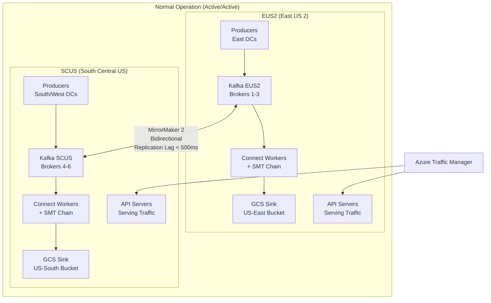

## Failover Flow

When EUS2 fails, the system recovers in under 15 minutes:

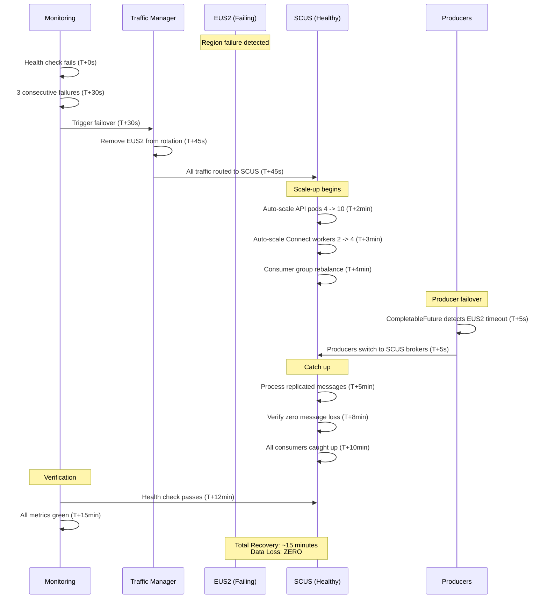

**Timeline breakdown:**

| Time | Event | Component |
|------|-------|-----------|
| T+0s | Health check fails | Azure Monitor |
| T+30s | 3 consecutive failures confirmed | Azure Monitor |
| T+45s | Traffic Manager removes EUS2 | Azure Traffic Manager |
| T+5s | Producers switch to SCUS (CompletableFuture) | Application |
| T+2min | API pods auto-scale | Kubernetes HPA |
| T+3min | Connect workers auto-scale | Kubernetes HPA |
| T+4min | Consumer group rebalance completes | Kafka |
| T+5min | Replicated messages processed | Kafka consumers |
| T+10min | All consumers fully caught up | Kafka consumers |
| T+15min | All metrics green, recovery confirmed | Monitoring |

## CompletableFuture Failover Pattern

The key innovation was using Java's `CompletableFuture` to implement automatic producer-side failover without waiting for external health checks:

```java
/**
 * Dual-region Kafka producer with automatic failover.
 * Sends to primary region first; if it fails, immediately
 * falls back to secondary region. Zero data loss guaranteed
 * because the message is always delivered to at least one region.
 */
@Service
public class ResilientAuditProducer {

    private final KafkaTemplate<String, AuditEvent> primaryTemplate;  // EUS2
    private final KafkaTemplate<String, AuditEvent> secondaryTemplate; // SCUS
    private final MeterRegistry metrics;

    private static final Duration PRIMARY_TIMEOUT = Duration.ofMillis(500);

    public ResilientAuditProducer(
            @Qualifier("eus2KafkaTemplate")
            KafkaTemplate<String, AuditEvent> primaryTemplate,
            @Qualifier("scusKafkaTemplate")
            KafkaTemplate<String, AuditEvent> secondaryTemplate,
            MeterRegistry metrics) {
        this.primaryTemplate = primaryTemplate;
        this.secondaryTemplate = secondaryTemplate;
        this.metrics = metrics;
    }

    /**
     * Send audit event with automatic failover.
     *
     * Strategy:
     * 1. Try primary (EUS2) with 500ms timeout
     * 2. If primary fails or times out, immediately send to secondary (SCUS)
     * 3. The message is NEVER lost -- one region always succeeds
     */
    public CompletableFuture<SendResult<String, AuditEvent>> send(
            String topic, String key, AuditEvent event) {

        long startTime = System.nanoTime();

        return CompletableFuture
            // Step 1: Try primary region
            .supplyAsync(() -> {
                try {
                    return primaryTemplate.send(topic, key, event)
                        .get(PRIMARY_TIMEOUT.toMillis(), TimeUnit.MILLISECONDS);
                } catch (Exception e) {
                    metrics.counter("audit.producer.primary.failure",
                        "error", e.getClass().getSimpleName()).increment();
                    throw new CompletionException(e);
                }
            })
            // Step 2: If primary fails, try secondary
            .exceptionallyAsync(throwable -> {
                log.warn("Primary region failed, failing over to secondary: {}",
                    throwable.getMessage());

                metrics.counter("audit.producer.failover").increment();

                try {
                    SendResult<String, AuditEvent> result =
                        secondaryTemplate.send(topic, key, event)
                            .get(2000, TimeUnit.MILLISECONDS);

                    log.info("Failover to secondary region succeeded for key: {}",
                        key);

                    return result;
                } catch (Exception e) {
                    metrics.counter("audit.producer.secondary.failure").increment();
                    throw new CompletionException(
                        new DualRegionFailureException(
                            "Both regions failed for key: " + key, e));
                }
            })
            // Step 3: Record metrics
            .whenComplete((result, error) -> {
                long durationNanos = System.nanoTime() - startTime;
                metrics.timer("audit.producer.send.duration")
                    .record(durationNanos, TimeUnit.NANOSECONDS);

                if (error == null) {
                    metrics.counter("audit.producer.success").increment();
                } else {
                    metrics.counter("audit.producer.total.failure").increment();
                    log.error("Failed to send to both regions", error);
                }
            });
    }
}
```

**Why this achieves 15-minute RTO with zero data loss:**

1. **Producer failover is instant (< 1 second):** The CompletableFuture pattern switches producers within the 500ms timeout window. No human intervention, no waiting for health checks.

2. **Data is never lost:** Even if EUS2 goes down mid-send, the message is retried on SCUS immediately. The only scenario where data is lost is if BOTH regions fail simultaneously (astronomically unlikely).

3. **Consumers resume automatically:** MirrorMaker 2 replicates consumer offsets. When SCUS consumers pick up partitions that were being consumed by EUS2, they resume from the last committed offset.

4. **The 15 minutes is for full system stabilization**, not for basic availability. Basic availability (producers + some consumers) is restored in under 1 minute. The 15 minutes includes:
   - Auto-scaling compute to handle double traffic
   - All consumer groups fully caught up
   - All monitoring dashboards green
   - GCS sinks flushing buffered data

**Previous state (1-hour RTO):**
- Manual failover via runbook
- Operator had to update DNS, restart producers, reset consumer offsets
- No automatic scaling -- pods were manually increased
- No CompletableFuture pattern -- producers just failed and retried blindly

---

# Part 9: P99/P95/P50 Latency

## Percentile Definitions

Percentile latencies describe how fast your system responds for a given percentage of requests. They are far more meaningful than averages because averages hide tail latency problems.

| Percentile | Meaning | Alias | What It Tells You |
|------------|---------|-------|-------------------|
| **P50** (median) | 50% of requests complete within this time | Median | Typical user experience |
| **P90** | 90% of requests complete within this time | -- | Most users' experience |
| **P95** | 95% of requests complete within this time | -- | Nearly all users' experience |
| **P99** | 99% of requests complete within this time | Tail latency | Worst 1% of requests |
| **P99.9** | 99.9% of requests complete within this time | -- | Worst 0.1% (1 in 1000) |
| **P99.99** | 99.99% of requests complete within this time | -- | Worst 0.01% (1 in 10000) |

**Example: Anshul's audit logging system**

If you process 2 million events per day (~23 events/second):
- **P50 = 1.2ms** -- Half of all events are processed in under 1.2ms
- **P95 = 3.1ms** -- 95% of events are processed in under 3.1ms
- **P99 = 4.8ms** -- 99% of events are under 4.8ms (meets the <5ms P99 target)
- **P99.9 = 12ms** -- Only 1 in 1000 events takes more than 12ms
- **Mean = 1.8ms** -- The average hides the fact that some events take 12ms+

**Why P99 matters more than average:**

```
Request latencies (ms): 1, 1, 1, 2, 2, 2, 3, 3, 5, 100

Average:  12ms  (misleading! most requests are fast)
Median:   2ms   (typical experience)
P95:      5ms   (almost all requests)
P99:      100ms (the problematic tail)
```

With 2M events/day, a P99 of 100ms means **20,000 events per day** experience that 100ms latency. At Google scale (billions of requests/day), even P99.9 problems affect millions of users.

**The coordinated omission problem:**

Most load testing tools have a flaw called **coordinated omission**: if a request takes 5 seconds, the tool waits and does not send new requests during that time. This makes latency look artificially good because the slow period is underrepresented in the data. Gil Tene's wrk2 and HdrHistogram tools address this.

## Measurement Techniques

### Using Micrometer (Spring Boot / Prometheus)

```java
@Component
public class AuditMetrics {

    private final Timer auditProcessingTimer;
    private final DistributionSummary latencyHistogram;

    public AuditMetrics(MeterRegistry registry) {
        this.auditProcessingTimer = Timer.builder("audit.processing.duration")
            .description("Time to process an audit event")
            .publishPercentiles(0.5, 0.9, 0.95, 0.99, 0.999)  // P50-P99.9
            .publishPercentileHistogram()  // For Prometheus histogram_quantile()
            .minimumExpectedValue(Duration.ofMicros(100))
            .maximumExpectedValue(Duration.ofSeconds(10))
            .register(registry);

        this.latencyHistogram = DistributionSummary.builder("audit.latency.ms")
            .description("Audit event latency in milliseconds")
            .publishPercentiles(0.5, 0.95, 0.99)
            .baseUnit("milliseconds")
            .register(registry);
    }

    public void recordProcessing(Runnable work) {
        auditProcessingTimer.record(work);
    }

    public void recordLatency(long startTimeNanos) {
        double durationMs = (System.nanoTime() - startTimeNanos) / 1_000_000.0;
        latencyHistogram.record(durationMs);
    }
}
```

### Prometheus Queries

```promql
# P99 latency over the last 5 minutes
histogram_quantile(0.99,
  rate(audit_processing_duration_seconds_bucket[5m])
)

# P50 (median) latency
histogram_quantile(0.50,
  rate(audit_processing_duration_seconds_bucket[5m])
)

# Compare P50 vs P99 to detect tail latency issues
# If P99 >> P50, you have a tail latency problem
histogram_quantile(0.99, rate(audit_processing_duration_seconds_bucket[5m]))
/
histogram_quantile(0.50, rate(audit_processing_duration_seconds_bucket[5m]))
# Result > 10x means significant tail latency
```

### Grafana Dashboard Panels

```
Panel 1: "Audit Latency Percentiles" (Time Series)
  - P50: histogram_quantile(0.50, rate(...[5m]))
  - P95: histogram_quantile(0.95, rate(...[5m]))
  - P99: histogram_quantile(0.99, rate(...[5m]))
  - P99.9: histogram_quantile(0.999, rate(...[5m]))

Panel 2: "Latency Heatmap" (Heatmap)
  - Shows distribution of latencies over time
  - Colors indicate density of requests at each latency level

Panel 3: "SLO Compliance" (Stat/Gauge)
  - % of requests under 5ms P99 target
  - Red if below 99%, Green if above
```

## Optimization Strategies

### Tail Latency Optimization Techniques

| Technique | Impact | How It Works |
|-----------|--------|-------------|
| **Connection pooling** | Eliminates connection setup latency | Reuse DB/HTTP connections |
| **Hedged requests** | Reduces P99 by racing requests | Send to 2 servers, take first response |
| **Request coalescing** | Reduces load on downstream | Batch similar requests together |
| **Caching (Redis)** | Eliminates DB round-trips | Cache frequently accessed data |
| **Async I/O** | Prevents thread blocking | Use CompletableFuture / reactive |
| **JVM tuning** | Reduces GC pauses | G1GC, ZGC, tune heap size |
| **Pre-warming** | Avoids cold-start latency | JIT compilation, cache warming |
| **Circuit breaker** | Fails fast instead of hanging | Resilience4j, Hystrix |

### Anshul's Latency Optimization at GCC

At Good Creator Co, Anshul reduced API latency from 30 seconds to 2 seconds:

```
BEFORE (30 seconds):
  PostgreSQL query (cold):     25s  (no indexes, full table scan)
  Application processing:       3s  (N+1 query problem)
  Serialization:                2s  (large payload, no pagination)

AFTER (2 seconds):
  Redis cache hit:           50ms  (95% of requests)
  ClickHouse analytical:    800ms  (complex aggregations, columnar)
  PostgreSQL indexed:       200ms  (transactional, with indexes)
  Application processing:  100ms  (batch queries, no N+1)
  Serialization:           100ms  (paginated, compressed)

  P50: 120ms  (Redis cache hit)
  P95: 900ms  (ClickHouse query)
  P99: 1.8s   (PostgreSQL fallback)
```

## Histograms and HdrHistogram

### Why Histograms, Not Averages

Histograms bucket requests into latency ranges and count how many requests fall in each bucket. This preserves the full distribution.

```
Bucket (ms)    Count    Visual
0-1            45,000   ################################
1-2            30,000   ######################
2-3            15,000   ###########
3-5             8,000   ######
5-10            1,500   #
10-50             400
50-100             80
100-500            15
500+                5
                ------
Total         100,000
```

From this histogram:
- P50 = ~1.2ms (50,000th request falls in 0-2ms range)
- P95 = ~4ms (95,000th request falls in 3-5ms range)
- P99 = ~8ms (99,000th request falls in 5-10ms range)

### HdrHistogram

HdrHistogram (High Dynamic Range Histogram) is the gold standard for latency recording. Created by Gil Tene, it provides:
- Constant memory usage (fixed allocation, no growing)
- Microsecond precision across a huge range (1us to 1 hour)
- Lossless recording (no sampling, no approximation)
- Mergeable (combine histograms from multiple instances)

```java
import org.HdrHistogram.Histogram;

// Create histogram: 1 microsecond to 1 hour, 3 significant digits
Histogram histogram = new Histogram(3600000000L, 3);

// Record latencies
histogram.recordValue(1200);  // 1.2ms in microseconds
histogram.recordValue(4800);  // 4.8ms

// Get percentiles
System.out.println("P50: " + histogram.getValueAtPercentile(50) + " us");
System.out.println("P95: " + histogram.getValueAtPercentile(95) + " us");
System.out.println("P99: " + histogram.getValueAtPercentile(99) + " us");
System.out.println("P99.9: " + histogram.getValueAtPercentile(99.9) + " us");
System.out.println("Max: " + histogram.getMaxValue() + " us");
System.out.println("Mean: " + histogram.getMean() + " us");
```

---

# Part 10: HTTP Status Codes

A complete reference of HTTP status codes with practical use cases.

## 2xx Success Codes

| Code | Name | When to Use | Example |
|------|------|-------------|---------|
| **200** | OK | Successful GET, PUT, PATCH, or DELETE | `GET /items/123` returns item |
| **201** | Created | Successful POST that created a resource | `POST /items` creates new item |
| **202** | Accepted | Request accepted but processing is async | `POST /reports/generate` queued for processing |
| **204** | No Content | Successful DELETE or PUT with no response body | `DELETE /items/123` -- resource deleted |
| **206** | Partial Content | Range request fulfilled | `GET /files/large.zip` with `Range: bytes=0-1023` |

**Common mistake:** Using 200 for everything. Use 201 for POST creation, 204 for DELETE.

```java
// Correct status code usage
@PostMapping("/items")
public ResponseEntity<Item> createItem(@RequestBody CreateItemRequest request) {
    Item item = itemService.create(request);
    URI location = URI.create("/items/" + item.getId());
    return ResponseEntity.created(location).body(item);  // 201 + Location header
}

@DeleteMapping("/items/{id}")
public ResponseEntity<Void> deleteItem(@PathVariable String id) {
    itemService.delete(id);
    return ResponseEntity.noContent().build();  // 204
}

@PostMapping("/reports/generate")
public ResponseEntity<ReportStatus> generateReport(@RequestBody ReportRequest req) {
    String jobId = reportService.queueGeneration(req);
    ReportStatus status = new ReportStatus(jobId, "QUEUED");
    return ResponseEntity.accepted().body(status);  // 202
}
```

## 3xx Redirection Codes

| Code | Name | When to Use | Cacheable? |
|------|------|-------------|------------|
| **301** | Moved Permanently | Resource permanently at new URL | Yes |
| **302** | Found | Temporary redirect (commonly misused) | No |
| **303** | See Other | Redirect after POST (PRG pattern) | No |
| **304** | Not Modified | Cache validation -- resource unchanged | N/A |
| **307** | Temporary Redirect | Temporary redirect, preserve method | No |
| **308** | Permanent Redirect | Permanent redirect, preserve method | Yes |

**Key distinction:** 301/302 may change POST to GET. 307/308 preserve the original HTTP method.

```
Client: POST /old-endpoint  (with body)
Server: 301 -> /new-endpoint
Client: GET  /new-endpoint   (body lost! method changed!)

Client: POST /old-endpoint  (with body)
Server: 308 -> /new-endpoint
Client: POST /new-endpoint  (body preserved, method preserved)
```

## 4xx Client Error Codes

| Code | Name | When to Use | Example Scenario |
|------|------|-------------|-----------------|
| **400** | Bad Request | Malformed request syntax or invalid parameters | Missing required field, invalid JSON |
| **401** | Unauthorized | Missing or invalid authentication | No token, expired JWT |
| **403** | Forbidden | Authenticated but not authorized | User role lacks permission |
| **404** | Not Found | Resource does not exist | `GET /items/nonexistent` |
| **405** | Method Not Allowed | HTTP method not supported for this endpoint | `DELETE /items` (only GET/POST allowed) |
| **406** | Not Acceptable | Cannot produce response in requested format | `Accept: application/xml` but only JSON available |
| **408** | Request Timeout | Client took too long to send the request | Slow upload |
| **409** | Conflict | Request conflicts with current state | Duplicate email on registration |
| **410** | Gone | Resource permanently deleted (not just missing) | Deprecated API version |
| **412** | Precondition Failed | Conditional request precondition not met | `If-Match` ETag mismatch |
| **413** | Payload Too Large | Request body exceeds limit | Upload > 10MB limit |
| **415** | Unsupported Media Type | Content-Type not supported | Sending XML to JSON-only endpoint |
| **422** | Unprocessable Entity | Syntactically correct but semantically invalid | Valid JSON but business rule violation |
| **429** | Too Many Requests | Rate limit exceeded | > 1000 requests/minute |

**401 vs 403:**
- **401:** "I don't know who you are" (authentication failed)
- **403:** "I know who you are, but you can't do this" (authorization failed)

**404 vs 410:**
- **404:** "I can't find it" (might appear later, or might be wrong URL)
- **410:** "It was here but is permanently gone" (deliberate removal, caches should purge)

**400 vs 422:**
- **400:** Syntactically malformed (can't parse the JSON, missing required field)
- **422:** Syntactically valid but semantically wrong (email format valid but already taken)

## 5xx Server Error Codes

| Code | Name | When to Use | Example Scenario |
|------|------|-------------|-----------------|
| **500** | Internal Server Error | Unexpected server failure | Unhandled exception, null pointer |
| **501** | Not Implemented | Feature not yet built | `PATCH /items` endpoint not implemented |
| **502** | Bad Gateway | Upstream server returned invalid response | API gateway got garbage from backend |
| **503** | Service Unavailable | Server temporarily overloaded or in maintenance | Deploying, circuit breaker open |
| **504** | Gateway Timeout | Upstream server did not respond in time | Backend took > 30s, gateway timed out |

**503 best practice:** Always include a `Retry-After` header:

```http
HTTP/1.1 503 Service Unavailable
Retry-After: 30
Content-Type: application/problem+json

{
  "type": "https://api.walmart.com/errors/service-unavailable",
  "title": "Service Temporarily Unavailable",
  "status": 503,
  "detail": "The inventory service is undergoing maintenance. Please retry in 30 seconds.",
  "retryAfter": 30
}
```

**Complete status code decision tree:**

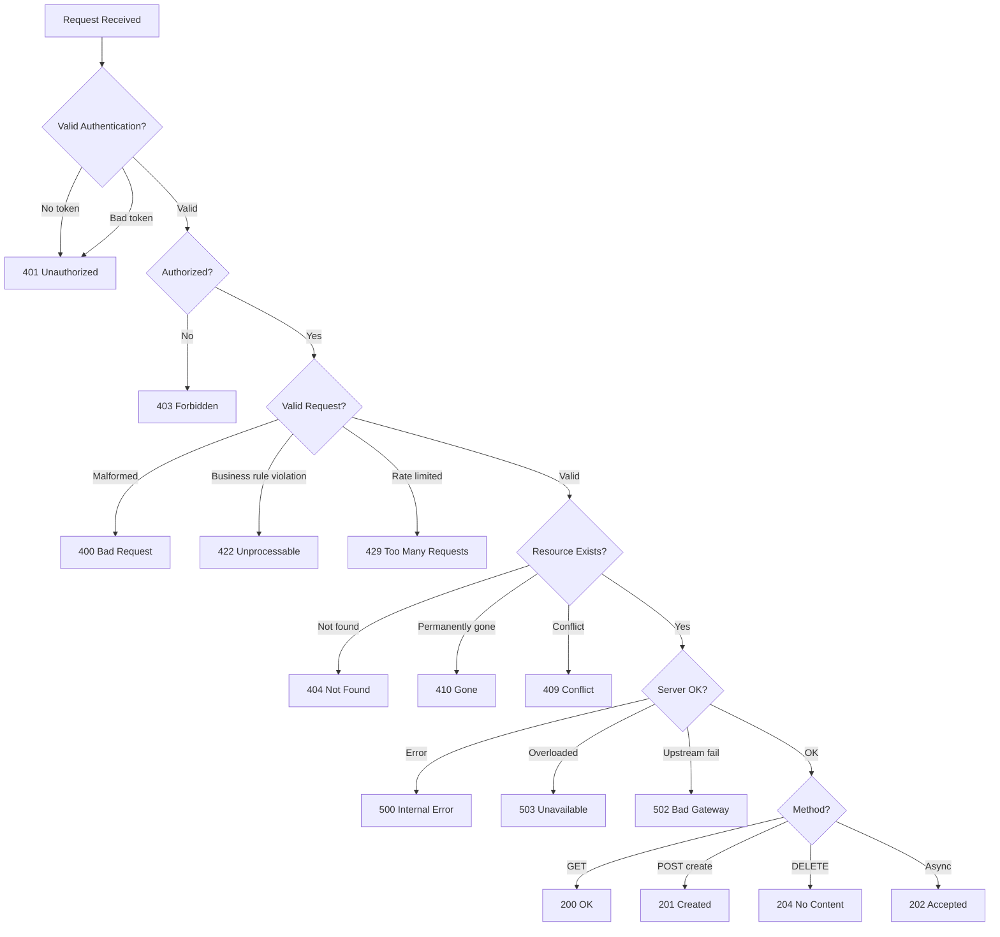

---

# Part 11: Google Cloud Storage (GCS) Basics

## Buckets and Objects

**Google Cloud Storage (GCS)** is Google's object storage service, equivalent to AWS S3. It stores data as **objects** within **buckets**.

**Bucket:** A container for objects. Has a globally unique name.
- Name must be globally unique across all of GCS
- Cannot be nested (no bucket within a bucket)
- Has a location (region, dual-region, or multi-region)
- Has a default storage class
- Has IAM and ACL policies

**Object:** A file stored in a bucket.
- Identified by a key (path-like name, e.g., `data/2024/01/15/audit-events.parquet`)
- Immutable -- cannot be modified, only replaced
- Maximum size: 5 TiB per object
- Has metadata (content-type, custom metadata, generation number)
- Flat namespace -- "folders" are just key prefixes (the `/` is part of the name)

```
gs://walmart-audit-us-east/
  data/
    2024/
      01/
        15/
          audit-events-US-00001.parquet    (128 MB)
          audit-events-US-00002.parquet    (128 MB)
        16/
          audit-events-US-00001.parquet
      02/
        ...
  schemas/
    audit-event-v2.avsc
  config/
    pipeline-config.json
```

**Accessing objects:**

```bash
# gsutil (CLI)
gsutil ls gs://walmart-audit-us-east/data/2024/01/15/
gsutil cp local-file.parquet gs://walmart-audit-us-east/data/2024/01/15/
gsutil cat gs://walmart-audit-us-east/config/pipeline-config.json

# gcloud storage (newer CLI)
gcloud storage ls gs://walmart-audit-us-east/data/2024/01/15/
gcloud storage cp local-file.parquet gs://walmart-audit-us-east/data/2024/01/15/
```

```java
// Java client
import com.google.cloud.storage.*;

Storage storage = StorageOptions.getDefaultInstance().getService();

// Upload
BlobId blobId = BlobId.of("walmart-audit-us-east",
    "data/2024/01/15/audit-events-US-00001.parquet");
BlobInfo blobInfo = BlobInfo.newBuilder(blobId)
    .setContentType("application/octet-stream")
    .setMetadata(Map.of("region", "US", "date", "2024-01-15"))
    .build();
storage.create(blobInfo, Files.readAllBytes(localPath));

// Download
Blob blob = storage.get(blobId);
blob.downloadTo(Path.of("/tmp/audit-events.parquet"));

// List objects with prefix
Page<Blob> blobs = storage.list("walmart-audit-us-east",
    Storage.BlobListOption.prefix("data/2024/01/15/"));
for (Blob b : blobs.iterateAll()) {
    System.out.println(b.getName() + " (" + b.getSize() + " bytes)");
}
```

## Storage Classes

GCS offers four storage classes with different cost/access trade-offs:

| Storage Class | Min Duration | Access Cost | Storage Cost | Use Case |
|---------------|-------------|-------------|--------------|----------|
| **Standard** | None | Lowest access | Highest storage | Frequently accessed data |
| **Nearline** | 30 days | Medium | Medium | Accessed < 1x/month |
| **Coldline** | 90 days | Higher | Lower | Accessed < 1x/quarter |
| **Archive** | 365 days | Highest | Lowest | Accessed < 1x/year |

**Cost example (US multi-region, per GB/month):**

| Class | Storage | Retrieval | Example: 10TB for 1 year |
|-------|---------|-----------|--------------------------|
| Standard | $0.026 | $0.00 | $3,120 |
| Nearline | $0.010 | $0.01/GB | $1,200 + retrieval |
| Coldline | $0.004 | $0.02/GB | $480 + retrieval |
| Archive | $0.0012 | $0.05/GB | $144 + retrieval |

> **Anshul's pattern:** Recent audit data (< 30 days) in Standard for active queries via BigQuery. Older data automatically transitioned to Nearline, then Coldline via lifecycle rules.

## Lifecycle Management

Lifecycle rules automatically manage objects based on age, creation date, storage class, or other conditions.

```json
{
  "lifecycle": {
    "rule": [
      {
        "action": {
          "type": "SetStorageClass",
          "storageClass": "NEARLINE"
        },
        "condition": {
          "age": 30,
          "matchesStorageClass": ["STANDARD"]
        }
      },
      {
        "action": {
          "type": "SetStorageClass",
          "storageClass": "COLDLINE"
        },
        "condition": {
          "age": 90,
          "matchesStorageClass": ["NEARLINE"]
        }
      },
      {
        "action": {
          "type": "SetStorageClass",
          "storageClass": "ARCHIVE"
        },
        "condition": {
          "age": 365,
          "matchesStorageClass": ["COLDLINE"]
        }
      },
      {
        "action": {
          "type": "Delete"
        },
        "condition": {
          "age": 2555,
          "matchesStorageClass": ["ARCHIVE"]
        }
      }
    ]
  }
}
```

**Anshul's lifecycle for audit data:**
```
Day 0-30:    Standard (active BigQuery queries)
Day 30-90:   Nearline (occasional compliance queries)
Day 90-365:  Coldline (rare compliance audits)
Day 365-2555: Archive (7-year retention for Canadian data)
Day 2555+:   Delete (after 7 years)
```

## Parquet Storage Pattern

**Apache Parquet** is a columnar storage format designed for analytical workloads. It is the ideal format for storing audit events in GCS because:

1. **Columnar:** Only reads the columns needed for a query (vs. row-based formats that read entire rows)
2. **Compressed:** Snappy or ZSTD compression reduces storage by 60-80%
3. **Schema-embedded:** The schema is stored within the file
4. **Predicate pushdown:** Queries can skip row groups based on min/max statistics
5. **Compatible:** Works with BigQuery, Spark, Pandas, DuckDB, Athena

**Anshul's Parquet storage architecture:**

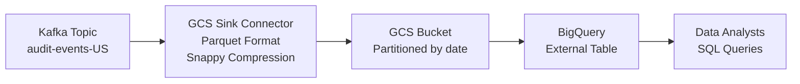

**GCS Sink Connector Parquet configuration:**

```properties
# Format
format.class=io.confluent.connect.gcs.format.parquet.ParquetFormat
parquet.codec=snappy

# Flush policy: write a new Parquet file every 10K records or every hour
flush.size=10000
rotate.interval.ms=3600000

# File naming
topics.dir=data
directory.delim=/
file.delim=+
```

**Resulting GCS structure:**

```
gs://walmart-audit-us-east/
  data/
    audit-events-US/
      year=2024/
        month=01/
          day=15/
            audit-events-US+0+0000000000.parquet   (10K records, ~12MB)
            audit-events-US+0+0000010000.parquet   (10K records, ~12MB)
            audit-events-US+1+0000000000.parquet   (partition 1)
          day=16/
            ...
```

**BigQuery external table over GCS Parquet:**

```sql
-- Create external table pointing to GCS Parquet files
CREATE EXTERNAL TABLE `walmart-data.audit.us_events`
OPTIONS (
  format = 'PARQUET',
  uris = ['gs://walmart-audit-us-east/data/audit-events-US/*']
);

-- Query with partition pruning
SELECT
  itemId,
  region,
  eventType,
  COUNT(*) as event_count
FROM `walmart-data.audit.us_events`
WHERE
  _FILE_NAME LIKE '%year=2024/month=01/day=15%'
  AND eventType = 'INVENTORY_UPDATE'
GROUP BY itemId, region, eventType
ORDER BY event_count DESC
LIMIT 100;
```

**Storage efficiency:**

| Format | Size (1M events) | Query Speed | Compression |
|--------|-------------------|-------------|-------------|
| JSON | 2.1 GB | Slow (parse all fields) | 60% with gzip |
| Avro | 850 MB | Medium (row-based) | Built-in |
| **Parquet** | **320 MB** | **Fast (columnar + pushdown)** | **85% with Snappy** |
| CSV | 1.8 GB | Slowest | 55% with gzip |

---

# Part 12: How Anshul Used It

## At Walmart -- DC Inventory Search API (OpenAPI + SMT + DR)

### Design-First API with OpenAPI

Anshul led the design of the **DC Inventory Search API** using a design-first approach with an **898-line OpenAPI 3.0 specification**. This API enabled real-time inventory search across US, Canadian, and Mexican distribution centers.

**What Anshul did:**
- Authored the complete OpenAPI spec covering 8 endpoints, 18 schemas, 12 reusable parameters, and 8 standardized error responses following RFC 7807
- Used `$ref` extensively to keep the spec DRY -- every parameter, schema, and error response was defined once in `components` and referenced everywhere
- Defined the `Region` enum (`US`, `CA`, `MX`) in the spec, which directly drove the factory pattern implementation
- Implemented cursor-based pagination with opaque base64 tokens for efficient multi-region queries across millions of inventory items
- The spec was reviewed by three teams (inventory, supply chain, frontend) before implementation began
- Frontend team generated a TypeScript client from the spec and started building the UI on day 1 using a mock server (Prism)

**Impact:**
- Parallel consumer integration was **30% faster** because all three teams worked simultaneously against the locked contract
- **Zero breaking changes** after implementation began -- the spec served as the single source of truth
- Factory pattern for US/CA/MX was designed directly from the spec's `Region` enum, enabling clean separation of regional business logic

### SMT-Based Geographic Routing

Anshul designed and implemented a **three-tier Kafka audit logging system** that processed 2M+ events/day with geographic routing using Kafka Connect SMTs.

**What Anshul did:**
- Built a custom `RegionRouter` SMT that extracted the `region` field from audit events and routed them to region-specific Kafka topics (`audit-events-US`, `audit-events-CA`, `audit-events-MX`)
- Chained three SMTs: `InsertField` (add processing metadata) -> `RegionRouter` (geographic routing) -> `TimestampRouter` (daily partitioning)
- Configured GCS Sink Connectors per region with Parquet format and Snappy compression for efficient storage
- Each region's data flowed into its own GCS bucket and BigQuery table for compliance and analytics
- Implemented lifecycle rules for tiered storage: Standard (30d) -> Nearline (90d) -> Coldline (365d) -> Archive (7yr for Canadian compliance)

**Impact:**
- End-to-end P99 latency of **< 5ms** for the entire audit pipeline
- **Zero cross-region data leakage** -- each country's data stayed in its designated storage
- Storage costs reduced by ~70% through Parquet compression and automated lifecycle transitions
- Data analysts could query audit data directly in BigQuery with partition pruning

### Active/Active DR with 15-Minute Recovery

Anshul architected the multi-region Active/Active deployment across Azure's EUS2 and SCUS regions, reducing DR recovery from 1 hour to 15 minutes with zero data loss.

**What Anshul did:**
- Deployed Kafka clusters in both EUS2 and SCUS with MirrorMaker 2 for bidirectional topic replication (< 500ms replication lag)
- Implemented the **CompletableFuture failover pattern** in the Java producer: try primary region with 500ms timeout, automatically fail over to secondary region on any failure
- Configured Kubernetes HPA (Horizontal Pod Autoscaler) to scale API and Connect worker pods when one region absorbs the other's traffic
- Set up Azure Traffic Manager with health probes for automatic DNS failover
- Ensured consumer offset synchronization so consumers in the surviving region could resume exactly where the failed region's consumers left off

**Impact:**
- **RTO reduced from 1 hour to 15 minutes** (4x improvement)
- **RPO = 0** (zero data loss) because every message is delivered to at least one region
- Producer failover is instant (< 1 second) thanks to CompletableFuture
- Eliminated the need for manual runbook-based failover
- System handled 2x traffic spikes during failover without degradation

## At Good Creator Co -- Dual-Database Architecture

### PostgreSQL + ClickHouse + Redis

Anshul designed the backend architecture using a dual-database approach to handle both transactional and analytical workloads.

**What Anshul did:**
- Used **PostgreSQL** as the primary transactional database for creator profiles, campaigns, and CRUD operations
- Integrated **ClickHouse** as the analytical engine for complex aggregations (campaign performance, creator rankings, time-series metrics)
- Implemented **Redis caching** with a read-through pattern for frequently accessed data (creator profiles, leaderboards)
- Designed the API with proper HTTP status codes, pagination, and error handling

**Impact:**
- Reduced API latency from **30 seconds to 2 seconds** (15x improvement)
- P50 latency: 120ms (Redis cache hit for 95% of reads)
- P99 latency: 1.8s (PostgreSQL fallback for cache misses)
- ClickHouse handled complex analytical queries in under 800ms that took PostgreSQL 25+ seconds

---

# Part 13: Interview Q&A

## Q1: What is the OpenAPI Specification and why did you use design-first at Walmart?

**A:** OpenAPI (formerly Swagger) is a language-agnostic standard for describing REST APIs in YAML or JSON. I used design-first because three teams needed to agree on the API contract before implementation. I wrote an 898-line OpenAPI spec for the DC Inventory Search API that defined all endpoints, schemas, pagination patterns, and error models. The frontend team started building against mock servers on day 1 while I implemented the backend. This made parallel consumer integration 30% faster because the contract was locked before any code was written.

## Q2: How do you decide between cursor-based and offset-based pagination?

**A:** Offset pagination (`?page=5&size=20`) is simple but degrades at depth because the database must scan and discard rows. Cursor pagination uses an opaque token encoding the last seen position, enabling efficient `WHERE id > X` queries with index seeks. I used cursor-based pagination for the DC Inventory API because we had millions of items across US/CA/MX regions. The cursor encoded a composite key `(region, dcId, itemId)` so multi-region queries remained efficient regardless of how deep the user paginated. The trade-off is that cursor pagination cannot jump to arbitrary pages, but for API consumers this was acceptable.

## Q3: What are Kafka SMTs and how did you use them for geographic routing?

**A:** Single Message Transforms (SMTs) are per-message transformations in Kafka Connect that modify records as they flow through connectors. I built a custom `RegionRouter` SMT that extracted the `region` field from audit events and routed them to country-specific topics (`audit-events-US`, `audit-events-CA`, `audit-events-MX`). I chained it with `InsertField` for metadata and `TimestampRouter` for daily partitioning. This enabled compliance-driven data residency where each country's audit data was stored in its own GCS bucket and BigQuery table, with zero cross-region leakage.

## Q4: Explain the difference between RTO and RPO. What were yours at Walmart?

**A:** RTO (Recovery Time Objective) is the maximum acceptable downtime after a disaster. RPO (Recovery Point Objective) is the maximum acceptable data loss measured in time. At Walmart, I reduced RTO from 1 hour to 15 minutes while maintaining RPO of zero (no data loss). The 15-minute RTO includes full system stabilization -- auto-scaling, consumer catch-up, and all dashboards green. Basic availability was restored in under 1 minute thanks to the CompletableFuture failover pattern that instantly switches producers to the healthy region.

## Q5: How does your CompletableFuture failover pattern work?

**A:** The pattern uses Java's `CompletableFuture` to race the primary and secondary regions. The producer first tries to send to EUS2 with a 500ms timeout. If it succeeds, great. If it times out or fails, `exceptionallyAsync` immediately sends the same message to SCUS. This guarantees zero data loss because the message is always delivered to at least one region within about 600ms total. The key insight is that producer failover does not wait for external health checks or DNS propagation -- it happens at the application level, making it nearly instant.

## Q6: What is RFC 7807 and why should APIs use it?

**A:** RFC 7807 defines a standard format for HTTP API error responses called "Problem Details." It uses `application/problem+json` content type and includes fields like `type` (URI identifying the problem), `title`, `status`, `detail`, and `instance`. I used it in the DC Inventory API to provide consistent, machine-readable error responses. The benefit is that every error -- whether 400, 404, or 500 -- follows the same structure, making it easier for clients to parse and handle errors programmatically. It also supports extension fields like `errors` for field-level validation details.

## Q7: Why did you choose Parquet over JSON or Avro for GCS storage?

**A:** Parquet is a columnar format, which means queries only read the columns they need rather than deserializing entire rows. For our audit events stored in GCS, this was critical because analysts often queried only 3-4 fields out of 20+. Parquet with Snappy compression reduced storage from 2.1 GB (JSON) to 320 MB per million events -- an 85% reduction. It also supports predicate pushdown, so BigQuery can skip entire row groups based on min/max statistics without reading the data. Avro would have been fine for Kafka wire format (and we used it there), but for analytical storage, Parquet is the clear winner.

## Q8: How do you choose between Active/Active and Active/Passive DR?

**A:** Active/Active is best when you need near-zero RTO and can handle the complexity of bidirectional replication and conflict resolution. Active/Passive is simpler but has higher RTO because you need to promote the passive region. I chose Active/Active for Walmart's audit system because audit events are append-only (no update conflicts) and we needed sub-minute producer failover. The trade-off is cost (full infrastructure in both regions) and complexity (MirrorMaker 2 configuration, consumer offset sync). For systems with frequent writes to the same records, Active/Passive with synchronous replication might be simpler.

## Q9: What is the difference between HTTP 401 and 403?

**A:** 401 (Unauthorized) means the server does not know who you are -- authentication failed. The client should provide or fix their credentials. 403 (Forbidden) means the server knows who you are (authentication succeeded) but you do not have permission to access this resource. For example, if a non-admin user tries to access `/admin/settings`, that is a 403. If a request comes with no JWT token at all, that is a 401.

## Q10: How did you achieve < 5ms P99 latency for the audit pipeline?

**A:** Several optimizations contributed. First, Kafka's append-only log with batching and compression (lz4) minimizes write latency. Second, the SMT chain adds < 1ms overhead because SMTs are lightweight per-message transforms running in the same JVM as the connector. Third, I tuned the producer with `linger.ms=5` and `batch.size=16384` to batch efficiently without adding significant latency. Fourth, the Avro serializer with cached schema registry lookups avoids per-message network calls. Fifth, the consumers use batch processing with auto-commit to minimize Kafka coordination overhead. The P99 < 5ms is measured end-to-end from producer send to consumer acknowledgment within a single region.

## Q11: Explain P99 latency and why it matters more than average latency.

**A:** P99 means 99% of requests complete within that time. It reveals the worst-case experience for 1% of users. Average latency is misleading because a few extreme outliers can be hidden. With 2 million events per day, a P99 of 5ms means 20,000 events exceed that threshold. At Google's scale with billions of requests, even P99.9 affects millions of users. I tracked P50 (typical), P95 (nearly all), and P99 (tail) using Micrometer histograms exposed to Prometheus, with Grafana dashboards showing all three percentiles over time. When P99 diverges significantly from P50, it signals a tail latency problem (e.g., GC pauses, network timeouts, or cold cache misses).

## Q12: What is API versioning and which strategy did you use?

**A:** API versioning allows you to evolve an API without breaking existing clients. There are four strategies: URL path (`/v1/items`), query parameter (`?version=1`), header (`X-API-Version: 1`), and content negotiation (`Accept: application/vnd.walmart.v2+json`). I used URL path versioning (`/inventory/v2/items`) because it is the simplest, most visible, and aligns with Google's API design guide. The version is immediately apparent in the URL, easy to route at the load balancer, and easy to cache. The trade-off is URL "pollution" and REST purists argue the version should not be in the resource identifier, but pragmatism wins.

## Q13: How did you handle data residency compliance across US, CA, and MX?

**A:** I used Kafka SMT-based geographic routing to ensure each country's data stayed within its designated storage. The `RegionRouter` SMT extracted the `region` field from each audit event and routed it to a country-specific topic. Each topic had its own GCS Sink Connector writing to a country-specific GCS bucket. Canadian data had 7-year retention (compliance requirement) via GCS lifecycle rules that transitioned data through Standard, Nearline, Coldline, and Archive classes. Mexican data required Spanish-language metadata enrichment handled by a region-specific processor instantiated via the factory pattern. The factory was driven by the `Region` enum defined in the OpenAPI spec.

## Q14: What is the design-first approach to API development and what are its trade-offs?

**A:** Design-first means writing the complete OpenAPI specification before any implementation code. The spec is reviewed by all stakeholders, then used to generate server stubs, client SDKs, and mock servers. The advantage is that teams agree on the contract upfront, enabling parallel development -- frontend builds against mocks while backend implements logic. The disadvantage is the upfront investment in spec writing and the need to enforce spec-implementation consistency via CI/CD. At Walmart, design-first was essential because three teams needed the contract locked before starting. The alternative, code-first, generates the spec from code annotations, which is faster for solo developers but leaves frontend teams waiting.

## Q15: How does GCS lifecycle management work and how did you configure it?

**A:** GCS lifecycle rules are JSON-based policies that automatically transition objects between storage classes or delete them based on conditions like age, creation date, or current storage class. I configured a four-tier lifecycle: Standard for the first 30 days (active BigQuery queries), Nearline from 30-90 days (occasional compliance queries), Coldline from 90-365 days (rare audits), and Archive from 365 days to 7 years (Canadian regulatory requirement). After 7 years, objects are deleted. This reduced storage costs by approximately 70% compared to keeping all data in Standard class, while still meeting every compliance requirement.

## Q16: What are the built-in Kafka SMTs you used and what does each do?

**A:** I used three in a chain. `InsertField` adds fields to a message -- I used it to stamp each event with `processed_by` metadata and the Kafka timestamp. `TimestampRouter` reroutes messages to time-partitioned topics by formatting the topic name with the message timestamp -- I used the pattern `${topic}-${timestamp}` with `yyyy-MM-dd` format to create daily topics like `audit-events-US-2024-01-15`. Between these two, I placed my custom `RegionRouter` SMT for geographic routing. Other important built-in SMTs include `ReplaceField` for renaming or dropping fields, `MaskField` for PII protection, and `Flatten` for converting nested structs to flat schemas.

## Q17: How would you design an API that needs to handle both real-time and batch operations?

**A:** I would design separate endpoints for each pattern. For real-time: `GET /items/{id}` for single item lookup with low latency. For batch: `POST /items/bulk` accepting an array of IDs (with a maximum, like 100) and returning results plus a `notFound` array. For very large batches or long-running operations, I would use an async pattern: `POST /reports/generate` returns 202 (Accepted) with a job ID, and the client polls `GET /reports/{jobId}/status` until completion. This is exactly what I did in the DC Inventory API -- the single-item endpoint had sub-10ms P99, while the bulk endpoint had a 100-item limit and returned partial results for items not found.

## Q18: What is idempotency and how do you implement it for POST requests?

**A:** An idempotent operation produces the same result regardless of how many times it is executed. GET, PUT, and DELETE are naturally idempotent, but POST is not -- calling `POST /orders` twice creates two orders. To make POST idempotent, I use an `Idempotency-Key` header: the client generates a UUID and sends it with the request. The server checks if it has already processed a request with that key (stored in Redis or the database). If yes, it returns the same response without re-processing. If no, it processes the request and stores the result keyed by the idempotency key. This is critical in distributed systems where network failures cause automatic retries.

---

*End of study guide. Last updated: 2025.*
