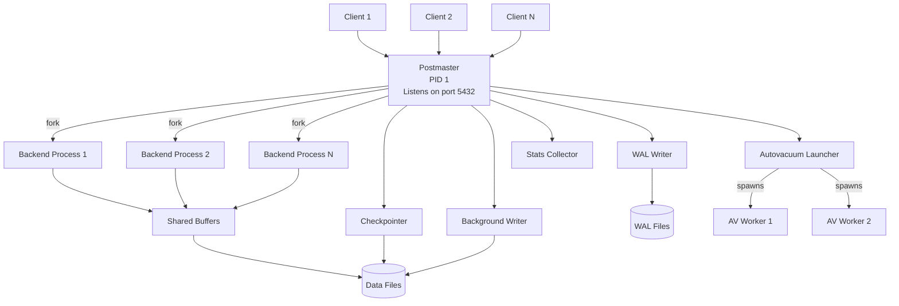
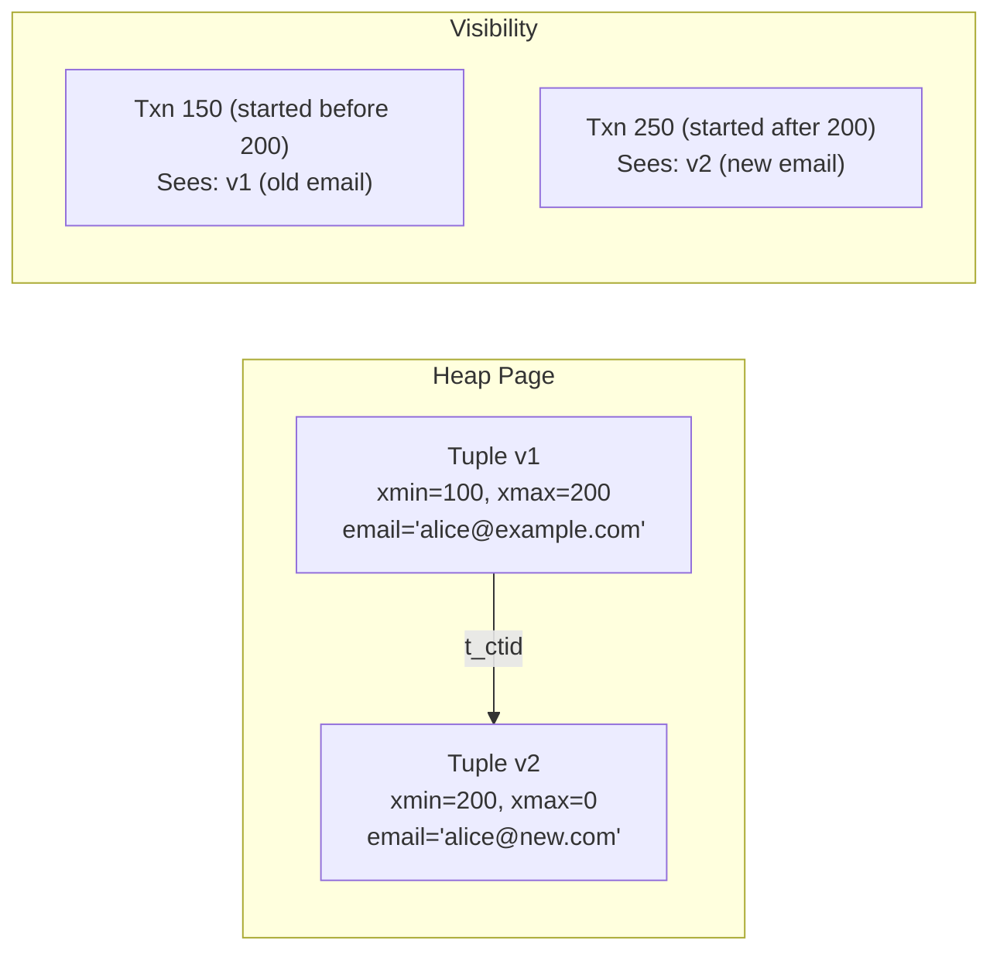
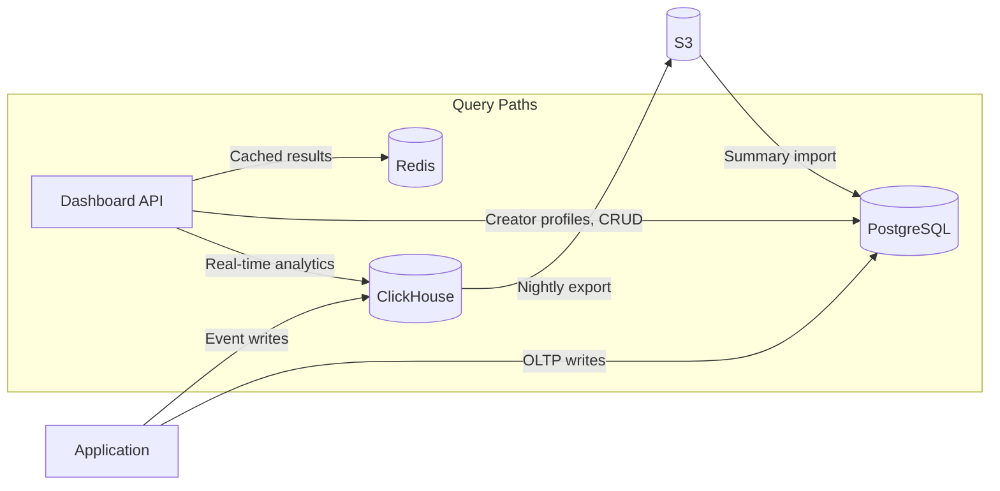

# SQL and PostgreSQL Internals -- Complete Study Guide

**For:** Anshul Garg | Backend Engineer | Google Interview Preparation
**Context:** Built dual-database architecture (PostgreSQL + ClickHouse) at Good Creator Co with Redis caching, connection pooling, 3-level rate limiting. Migrated event logging from PostgreSQL to ClickHouse to solve write saturation at millions of logs/day. Implemented ClickHouse-to-S3-to-PostgreSQL sync with atomic table swaps. Reduced query latency from 30s to 2s.

---

# TABLE OF CONTENTS

1. [Part 1: SQL Fundamentals](#part-1-sql-fundamentals)
   - [JOINs -- All Types](#joins----all-types)
   - [Subqueries -- Scalar, Correlated, EXISTS](#subqueries----scalar-correlated-exists)
   - [Common Table Expressions (CTEs)](#common-table-expressions-ctes)
   - [Recursive CTEs](#recursive-ctes)
   - [Window Functions](#window-functions)
   - [GROUP BY and HAVING](#group-by-and-having)
2. [Part 2: PostgreSQL Architecture](#part-2-postgresql-architecture)
   - [Process Model](#process-model)
   - [Memory Architecture](#memory-architecture)
   - [Background Processes](#background-processes)
   - [Write-Ahead Logging (WAL)](#write-ahead-logging-wal)
3. [Part 3: MVCC -- Multi-Version Concurrency Control](#part-3-mvcc----multi-version-concurrency-control)
   - [Tuple Versioning](#tuple-versioning)
   - [Transaction Snapshots](#transaction-snapshots)
   - [Visibility Rules](#visibility-rules)
   - [MVCC vs Locking](#mvcc-vs-locking)
4. [Part 4: Indexing Deep Dive](#part-4-indexing-deep-dive)
   - [B-tree Indexes](#b-tree-indexes)
   - [Hash Indexes](#hash-indexes)
   - [GIN Indexes](#gin-indexes)
   - [GiST Indexes](#gist-indexes)
   - [BRIN Indexes](#brin-indexes)
   - [Partial, Covering, and Expression Indexes](#partial-covering-and-expression-indexes)
5. [Part 5: Query Plans and EXPLAIN ANALYZE](#part-5-query-plans-and-explain-analyze)
   - [Scan Types](#scan-types)
   - [Join Algorithms](#join-algorithms)
   - [Cost Estimation Model](#cost-estimation-model)
   - [Reading EXPLAIN Output](#reading-explain-output)
6. [Part 6: Vacuum and Bloat Management](#part-6-vacuum-and-bloat-management)
   - [Dead Tuples and Table Bloat](#dead-tuples-and-table-bloat)
   - [VACUUM vs VACUUM FULL](#vacuum-vs-vacuum-full)
   - [Autovacuum Tuning](#autovacuum-tuning)
7. [Part 7: Connection Pooling](#part-7-connection-pooling)
   - [PgBouncer Modes](#pgbouncer-modes)
   - [HikariCP Configuration](#hikaricp-configuration)
   - [Pool Sizing Formula](#pool-sizing-formula)
8. [Part 8: Table Partitioning](#part-8-table-partitioning)
   - [Range Partitioning](#range-partitioning)
   - [List Partitioning](#list-partitioning)
   - [Hash Partitioning](#hash-partitioning)
   - [Partition Pruning](#partition-pruning)
9. [Part 9: ACID and Isolation Levels](#part-9-acid-and-isolation-levels)
   - [ACID Properties](#acid-properties)
   - [Isolation Levels](#isolation-levels)
   - [Anomalies and Phenomena](#anomalies-and-phenomena)
10. [Part 10: PostgreSQL vs MySQL Comparison](#part-10-postgresql-vs-mysql-comparison)
11. [Part 11: How Anshul Used It at Good Creator Co](#part-11-how-anshul-used-it-at-good-creator-co)
12. [Part 12: Interview Q&A (25+ Questions)](#part-12-interview-qa-25-questions)

---

# Part 1: SQL Fundamentals

## JOINs -- All Types

A JOIN combines rows from two or more tables based on a related column. Understanding the exact semantics of each join type is critical for writing correct queries and for interview whiteboard questions.

### Visual Model of JOINs

```
Table A         Table B
+----+         +----+
| 1  |         | 1  |
| 2  |         | 3  |
| 3  |         | 5  |
+----+         +----+

INNER JOIN  -> {1, 3}          -- only matching rows
LEFT JOIN   -> {1, 2, 3}      -- all of A, matched B or NULL
RIGHT JOIN  -> {1, 3, 5}      -- all of B, matched A or NULL
FULL JOIN   -> {1, 2, 3, 5}   -- all of both, NULLs where no match
CROSS JOIN  -> 3 x 3 = 9 rows -- cartesian product
```

### INNER JOIN

Returns only rows where the join condition is satisfied in both tables.

```sql
-- Find all orders with their customer names
SELECT c.name, o.order_id, o.total
FROM customers c
INNER JOIN orders o ON c.customer_id = o.customer_id;

-- Equivalent older syntax (avoid -- less readable)
SELECT c.name, o.order_id, o.total
FROM customers c, orders o
WHERE c.customer_id = o.customer_id;
```

**Key behavior:** If a customer has no orders, they do not appear. If an order somehow has no matching customer, it does not appear either.

### LEFT (OUTER) JOIN

Returns all rows from the left table. For rows with no match in the right table, columns from the right table are NULL.

```sql
-- Find all customers and their orders (including customers with no orders)
SELECT c.name, o.order_id, COALESCE(o.total, 0) AS total
FROM customers c
LEFT JOIN orders o ON c.customer_id = o.customer_id;

-- Find customers who have NEVER placed an order (anti-join pattern)
SELECT c.name, c.email
FROM customers c
LEFT JOIN orders o ON c.customer_id = o.customer_id
WHERE o.order_id IS NULL;
```

**Anti-join pattern:** `LEFT JOIN ... WHERE right.key IS NULL` is one of the most important SQL patterns. It finds rows in the left table that have no matching rows in the right table. This is typically faster than `NOT IN` with a subquery because `NOT IN` has tricky NULL semantics and often prevents the optimizer from using indexes.

### RIGHT (OUTER) JOIN

Mirror image of LEFT JOIN. Returns all rows from the right table.

```sql
-- Find all orders and their customers (including orphaned orders)
SELECT c.name, o.order_id, o.total
FROM customers c
RIGHT JOIN orders o ON c.customer_id = o.customer_id;
```

**In practice:** RIGHT JOIN is rarely used. You can always rewrite it as a LEFT JOIN by swapping the table order. Most style guides prefer LEFT JOIN for consistency.

### FULL (OUTER) JOIN

Returns all rows from both tables. NULLs fill in where there is no match on either side.

```sql
-- Find all customers and all orders, matched where possible
SELECT c.name, o.order_id
FROM customers c
FULL OUTER JOIN orders o ON c.customer_id = o.customer_id;

-- Find unmatched rows on either side
SELECT c.name, o.order_id
FROM customers c
FULL OUTER JOIN orders o ON c.customer_id = o.customer_id
WHERE c.customer_id IS NULL OR o.customer_id IS NULL;
```

**Use case:** Data reconciliation, finding mismatches between two datasets.

### CROSS JOIN

Produces the Cartesian product -- every row from table A paired with every row from table B. No join condition.

```sql
-- Generate all possible size/color combinations
SELECT s.size_name, c.color_name
FROM sizes s
CROSS JOIN colors c;

-- Equivalent: FROM sizes s, colors c (implicit cross join)
```

**Danger:** If table A has 10,000 rows and table B has 10,000 rows, the result is 100,000,000 rows. Use with extreme care.

### SELF JOIN

A table joined to itself. Used for hierarchical data or comparing rows within the same table.

```sql
-- Find employees and their managers
SELECT e.name AS employee, m.name AS manager
FROM employees e
LEFT JOIN employees m ON e.manager_id = m.employee_id;

-- Find pairs of customers in the same city
SELECT a.name AS customer_1, b.name AS customer_2, a.city
FROM customers a
INNER JOIN customers b ON a.city = b.city AND a.customer_id < b.customer_id;
```

### LATERAL JOIN

PostgreSQL-specific. Allows the subquery on the right side to reference columns from the left side. Think of it as a "for each row" join.

```sql
-- For each department, get the top 3 highest-paid employees
SELECT d.dept_name, top_emp.*
FROM departments d
CROSS JOIN LATERAL (
    SELECT e.name, e.salary
    FROM employees e
    WHERE e.dept_id = d.dept_id
    ORDER BY e.salary DESC
    LIMIT 3
) AS top_emp;
```

**Why LATERAL matters:** Without LATERAL, the subquery cannot reference `d.dept_id`. This is extremely powerful for "top-N per group" queries that are difficult to express with window functions alone.

### JOIN Performance Considerations

| Scenario | Recommendation |
|---|---|
| Both tables small (< 10K rows) | Any join works; optimizer chooses Nested Loop or Hash |
| One small, one large | Put the small table in the Hash build side (optimizer does this) |
| Both large, join on indexed column | Merge Join excels here |
| Both large, no useful indexes | Hash Join; watch work_mem for spilling to disk |
| Need anti-join (find missing) | LEFT JOIN + IS NULL, or NOT EXISTS (avoid NOT IN) |

---

## Subqueries -- Scalar, Correlated, EXISTS

### Scalar Subquery

Returns a single value. Can be used anywhere a single value is expected.

```sql
-- Find employees who earn more than the average
SELECT name, salary
FROM employees
WHERE salary > (SELECT AVG(salary) FROM employees);

-- Use a scalar subquery in SELECT
SELECT name, salary,
       salary - (SELECT AVG(salary) FROM employees) AS diff_from_avg
FROM employees;
```

### Correlated Subquery

References the outer query. Executes once per row of the outer query (conceptually -- the optimizer may rewrite it).

```sql
-- Find employees who earn more than the average in their department
SELECT e.name, e.salary, e.dept_id
FROM employees e
WHERE e.salary > (
    SELECT AVG(e2.salary)
    FROM employees e2
    WHERE e2.dept_id = e.dept_id
);
```

**Performance warning:** Correlated subqueries can be slow on large tables because they execute per outer row. PostgreSQL's optimizer often rewrites them as joins, but not always.

### EXISTS and NOT EXISTS

`EXISTS` returns TRUE if the subquery returns at least one row. It short-circuits -- it stops as soon as it finds one match.

```sql
-- Find customers who have placed at least one order (semi-join)
SELECT c.name
FROM customers c
WHERE EXISTS (
    SELECT 1 FROM orders o WHERE o.customer_id = c.customer_id
);

-- Find customers who have NEVER placed an order (anti-semi-join)
SELECT c.name
FROM customers c
WHERE NOT EXISTS (
    SELECT 1 FROM orders o WHERE o.customer_id = c.customer_id
);
```

**EXISTS vs IN vs JOIN:**

| Pattern | NULL-safe | Short-circuits | Typical plan |
|---|---|---|---|
| `EXISTS (subquery)` | Yes | Yes | Semi Join |
| `col IN (subquery)` | No (NULL breaks it) | No | Semi Join or Hash |
| `INNER JOIN` | N/A (different semantics) | No | Hash/Merge/Nested Loop |

**Critical difference with NULLs:** `NOT IN (subquery)` returns no rows if the subquery contains any NULL value. `NOT EXISTS` handles NULLs correctly. Always prefer `NOT EXISTS` over `NOT IN` for anti-join logic.

---

## Common Table Expressions (CTEs)

CTEs (the `WITH` clause) define temporary named result sets that exist for the duration of a single query.

```sql
-- Basic CTE
WITH high_value_orders AS (
    SELECT customer_id, SUM(total) AS total_spent
    FROM orders
    GROUP BY customer_id
    HAVING SUM(total) > 10000
)
SELECT c.name, h.total_spent
FROM customers c
INNER JOIN high_value_orders h ON c.customer_id = h.customer_id
ORDER BY h.total_spent DESC;
```

### CTE Materialization (PostgreSQL 12+)

Before PostgreSQL 12, CTEs were always materialized (computed once and stored in a temp buffer). Since PG 12, the optimizer can inline CTEs that are referenced only once.

```sql
-- Force materialization (useful if the CTE is referenced multiple times)
WITH MATERIALIZED expensive_calc AS (
    SELECT id, complex_function(data) AS result
    FROM big_table
)
SELECT * FROM expensive_calc WHERE result > 100;

-- Allow inlining (default for single-reference CTEs in PG 12+)
WITH NOT MATERIALIZED simple_filter AS (
    SELECT * FROM orders WHERE status = 'active'
)
SELECT * FROM simple_filter WHERE total > 500;
```

### Multiple CTEs

```sql
WITH
    active_users AS (
        SELECT user_id, name FROM users WHERE active = true
    ),
    user_orders AS (
        SELECT user_id, COUNT(*) AS order_count, SUM(total) AS total_spent
        FROM orders
        GROUP BY user_id
    )
SELECT au.name, COALESCE(uo.order_count, 0) AS orders, COALESCE(uo.total_spent, 0) AS spent
FROM active_users au
LEFT JOIN user_orders uo ON au.user_id = uo.user_id
ORDER BY spent DESC;
```

---

## Recursive CTEs

Recursive CTEs allow you to traverse hierarchical or graph-structured data. They have two parts: the base case and the recursive step, connected by `UNION ALL`.

```
Execution model:
1. Execute base case -> working table (WT)
2. Execute recursive step using WT -> intermediate table (IT)
3. Replace WT with IT
4. Repeat steps 2-3 until IT is empty
5. UNION ALL of all iterations = final result
```

### Organizational Hierarchy

```sql
-- Find all reports under a given manager (org chart traversal)
WITH RECURSIVE org_tree AS (
    -- Base case: the root manager
    SELECT employee_id, name, manager_id, 1 AS depth,
           ARRAY[name] AS path
    FROM employees
    WHERE employee_id = 100  -- start from CEO

    UNION ALL

    -- Recursive step: find direct reports of current level
    SELECT e.employee_id, e.name, e.manager_id, ot.depth + 1,
           ot.path || e.name
    FROM employees e
    INNER JOIN org_tree ot ON e.manager_id = ot.employee_id
    WHERE ot.depth < 10  -- safety limit to prevent infinite recursion
)
SELECT depth, name, path
FROM org_tree
ORDER BY path;
```

### Graph Traversal (Shortest Path)

```sql
-- Find shortest path between two nodes in a graph
WITH RECURSIVE paths AS (
    SELECT start_node, end_node, ARRAY[start_node, end_node] AS path, 1 AS hops
    FROM edges
    WHERE start_node = 'A'

    UNION ALL

    SELECT p.start_node, e.end_node, p.path || e.end_node, p.hops + 1
    FROM paths p
    INNER JOIN edges e ON p.end_node = e.start_node
    WHERE e.end_node <> ALL(p.path)  -- avoid cycles
      AND p.hops < 20               -- safety limit
)
SELECT path, hops
FROM paths
WHERE end_node = 'Z'
ORDER BY hops
LIMIT 1;
```

### Generating Series (Recursive Alternative)

```sql
-- Generate dates for a report (recursive CTE approach)
WITH RECURSIVE date_series AS (
    SELECT '2024-01-01'::date AS dt
    UNION ALL
    SELECT dt + INTERVAL '1 day'
    FROM date_series
    WHERE dt < '2024-12-31'
)
SELECT dt FROM date_series;

-- PostgreSQL built-in (preferred):
SELECT generate_series('2024-01-01'::date, '2024-12-31'::date, '1 day') AS dt;
```

---

## Window Functions

Window functions perform calculations across a set of rows that are related to the current row, without collapsing them into a single output row (unlike `GROUP BY`).

### Syntax

```sql
function_name(args) OVER (
    [PARTITION BY partition_expression]
    [ORDER BY sort_expression [ASC|DESC]]
    [frame_clause]
)
```

### ROW_NUMBER, RANK, DENSE_RANK

```sql
-- Sample data: employees with salaries
-- dept_id | name    | salary
-- --------|---------|-------
-- 1       | Alice   | 90000
-- 1       | Bob     | 90000
-- 1       | Carol   | 80000
-- 2       | Dave    | 95000
-- 2       | Eve     | 85000

SELECT dept_id, name, salary,
    ROW_NUMBER() OVER (PARTITION BY dept_id ORDER BY salary DESC) AS row_num,
    RANK()       OVER (PARTITION BY dept_id ORDER BY salary DESC) AS rank,
    DENSE_RANK() OVER (PARTITION BY dept_id ORDER BY salary DESC) AS dense_rank
FROM employees;

-- Result for dept_id = 1:
-- name  | salary | row_num | rank | dense_rank
-- ------|--------|---------|------|----------
-- Alice | 90000  | 1       | 1    | 1
-- Bob   | 90000  | 2       | 1    | 1       <- tie handling differs
-- Carol | 80000  | 3       | 3    | 2       <- rank skips, dense_rank does not
```

**Differences:**
- `ROW_NUMBER()`: Always unique, arbitrary tiebreaker for equal values
- `RANK()`: Same rank for ties, skips subsequent ranks (1, 1, 3)
- `DENSE_RANK()`: Same rank for ties, no gaps (1, 1, 2)

### Top-N Per Group Pattern

```sql
-- Get the top 3 highest-paid employees in each department
WITH ranked AS (
    SELECT dept_id, name, salary,
           ROW_NUMBER() OVER (PARTITION BY dept_id ORDER BY salary DESC) AS rn
    FROM employees
)
SELECT dept_id, name, salary
FROM ranked
WHERE rn <= 3;
```

This is one of the most common interview SQL questions.

### LAG and LEAD

Access data from a previous or subsequent row without a self-join.

```sql
-- Calculate month-over-month revenue change
SELECT month, revenue,
    LAG(revenue, 1) OVER (ORDER BY month)  AS prev_month_revenue,
    revenue - LAG(revenue, 1) OVER (ORDER BY month) AS mom_change,
    ROUND(
        (revenue - LAG(revenue, 1) OVER (ORDER BY month))::numeric /
        NULLIF(LAG(revenue, 1) OVER (ORDER BY month), 0) * 100,
        2
    ) AS mom_pct_change
FROM monthly_revenue;

-- Compare each employee's salary to the next higher salary in their dept
SELECT name, salary,
    LEAD(salary, 1) OVER (PARTITION BY dept_id ORDER BY salary) AS next_salary,
    LEAD(salary, 1) OVER (PARTITION BY dept_id ORDER BY salary) - salary AS gap
FROM employees;
```

### NTILE

Divides rows into N approximately equal buckets.

```sql
-- Divide customers into 4 quartiles by spending
SELECT name, total_spent,
    NTILE(4) OVER (ORDER BY total_spent DESC) AS spending_quartile
FROM customer_summary;

-- Percentile bucketing for latency analysis
SELECT endpoint, latency_ms,
    NTILE(100) OVER (ORDER BY latency_ms) AS percentile
FROM request_logs;
```

### Aggregate Window Functions

```sql
-- Running total and moving average
SELECT order_date, daily_revenue,
    SUM(daily_revenue) OVER (ORDER BY order_date) AS running_total,
    AVG(daily_revenue) OVER (
        ORDER BY order_date
        ROWS BETWEEN 6 PRECEDING AND CURRENT ROW
    ) AS seven_day_moving_avg
FROM daily_sales;
```

### Frame Clauses

```sql
-- Frame clause options:
-- ROWS BETWEEN UNBOUNDED PRECEDING AND CURRENT ROW  (default for ORDER BY)
-- ROWS BETWEEN 3 PRECEDING AND 3 FOLLOWING           (sliding window of 7)
-- ROWS BETWEEN CURRENT ROW AND UNBOUNDED FOLLOWING
-- RANGE BETWEEN ...  (value-based, not position-based)
-- GROUPS BETWEEN ... (PG 11+, group-based)

-- Difference between ROWS and RANGE:
-- ROWS: physical rows (row 1, row 2, row 3)
-- RANGE: logical range (all rows with same ORDER BY value grouped together)
```

### Named Windows

```sql
-- Avoid repeating window definitions
SELECT name, dept_id, salary,
    ROW_NUMBER() OVER w AS rn,
    RANK() OVER w AS rnk,
    SUM(salary) OVER w AS dept_running_total
FROM employees
WINDOW w AS (PARTITION BY dept_id ORDER BY salary DESC);
```

---

## GROUP BY and HAVING

### Basic Aggregation

```sql
-- Count orders and total revenue per customer
SELECT customer_id,
       COUNT(*) AS order_count,
       SUM(total) AS total_revenue,
       AVG(total) AS avg_order_value,
       MIN(total) AS smallest_order,
       MAX(total) AS largest_order
FROM orders
GROUP BY customer_id
HAVING COUNT(*) >= 5 AND SUM(total) > 1000
ORDER BY total_revenue DESC;
```

**WHERE vs HAVING:**
- `WHERE` filters rows before grouping
- `HAVING` filters groups after aggregation
- Rule: If the filter does not involve an aggregate function, put it in `WHERE` (better performance because fewer rows enter the aggregation)

### GROUPING SETS, ROLLUP, CUBE

```sql
-- GROUPING SETS: multiple groupings in one query
SELECT region, product_category, SUM(revenue)
FROM sales
GROUP BY GROUPING SETS (
    (region, product_category),  -- group by both
    (region),                     -- subtotal by region
    (product_category),           -- subtotal by category
    ()                            -- grand total
);

-- ROLLUP: hierarchical subtotals (year -> quarter -> month)
SELECT year, quarter, month, SUM(revenue)
FROM sales
GROUP BY ROLLUP (year, quarter, month);
-- Produces: (year,quarter,month), (year,quarter), (year), ()

-- CUBE: all possible combinations of groupings
SELECT region, product, channel, SUM(revenue)
FROM sales
GROUP BY CUBE (region, product, channel);
-- Produces: all 2^3 = 8 combinations
```

### FILTER Clause (PostgreSQL)

```sql
-- Conditional aggregation without CASE
SELECT
    dept_id,
    COUNT(*) AS total_employees,
    COUNT(*) FILTER (WHERE salary > 100000) AS high_earners,
    AVG(salary) FILTER (WHERE hire_date > '2023-01-01') AS avg_new_hire_salary
FROM employees
GROUP BY dept_id;
```

---

# Part 2: PostgreSQL Architecture

PostgreSQL uses a **process-per-connection** model (not threaded like MySQL). Understanding this architecture explains many of its operational characteristics -- connection limits, memory usage, and why connection pooling is essential at scale.

## Process Model



### The Postmaster

The postmaster is the supervisor process (PID 1 of the PostgreSQL cluster). Its responsibilities:

1. **Listens** for incoming connections on the configured port (default 5432)
2. **Forks** a new backend process for each client connection
3. **Manages** background worker processes
4. **Handles** crash recovery -- if any backend crashes, the postmaster terminates all backends and runs recovery

```bash
# See PostgreSQL processes
ps aux | grep postgres

# Typical output:
# postgres: postmaster
# postgres: checkpointer
# postgres: background writer
# postgres: walwriter
# postgres: autovacuum launcher
# postgres: stats collector
# postgres: logical replication launcher
# postgres: user_db user_name 192.168.1.10 idle    <-- backend process
```

### Backend Processes

Each client connection gets its own OS process (not thread). This means:

- **Memory isolation**: A crash in one backend does not corrupt another (unlike threaded models)
- **Memory cost**: Each backend uses ~5-10 MB of private memory (work_mem, temp_buffers, etc.)
- **Connection limit**: With 500 connections, that is 2.5-5 GB just for backend private memory
- **Fork cost**: Creating a new process takes ~10ms on Linux, which is why connection pooling matters

### Why Process-Per-Connection Matters

| Aspect | Process-Per-Connection (PostgreSQL) | Thread-Per-Connection (MySQL) |
|---|---|---|
| Memory isolation | Full -- process crash is contained | Shared -- one thread can corrupt others |
| Memory overhead | Higher (~5-10 MB per connection) | Lower (~256 KB per thread) |
| Context switch cost | Higher (process switch) | Lower (thread switch) |
| Max connections (practical) | 200-500 without pooler | 2000-5000 |
| Connection creation | Slow (fork) -- needs pooler | Faster (thread create) |
| Scalability solution | PgBouncer / connection pooler | Thread pool (MySQL 8.0) |

## Memory Architecture

```
+-------------------------------------------------------------------+
|                    PostgreSQL Memory Layout                         |
+-------------------------------------------------------------------+
|                                                                     |
|  SHARED MEMORY (visible to all processes)                          |
|  +---------------------------------------------------------------+ |
|  | Shared Buffers (shared_buffers = 25% of RAM, e.g., 4 GB)     | |
|  | - Page cache for table and index blocks (8 KB pages)          | |
|  | - Clock-sweep eviction algorithm                               | |
|  +---------------------------------------------------------------+ |
|  | WAL Buffers (wal_buffers = 64 MB)                              | |
|  | - Buffered WAL records before flush to disk                    | |
|  +---------------------------------------------------------------+ |
|  | CLOG / Commit Log                                               | |
|  | - Transaction commit status (2 bits per XID)                   | |
|  +---------------------------------------------------------------+ |
|  | Lock Tables                                                     | |
|  | - Heavyweight locks, lightweight locks, spinlocks              | |
|  +---------------------------------------------------------------+ |
|                                                                     |
|  PER-BACKEND MEMORY (private to each connection)                   |
|  +---------------------------------------------------------------+ |
|  | work_mem (4 MB default) - sorts, hash joins, per operation     | |
|  | maintenance_work_mem (64 MB) - VACUUM, CREATE INDEX            | |
|  | temp_buffers (8 MB) - temporary table access                   | |
|  +---------------------------------------------------------------+ |
+-------------------------------------------------------------------+
```

### Key Parameters

| Parameter | Default | Recommended | Purpose |
|---|---|---|---|
| `shared_buffers` | 128 MB | 25% of RAM | Main page cache |
| `effective_cache_size` | 4 GB | 50-75% of RAM | Planner hint (not allocated) |
| `work_mem` | 4 MB | 16-64 MB | Per-operation sort/hash memory |
| `maintenance_work_mem` | 64 MB | 256 MB - 1 GB | VACUUM, CREATE INDEX |
| `wal_buffers` | -1 (auto) | 64 MB | WAL write buffer |

**Critical detail about work_mem:** It is allocated per operation, not per query. A single query with 5 sort operations and 3 hash joins uses up to 8x work_mem. With 100 concurrent connections, that could be 100 * 8 * 64 MB = 51 GB. This is why work_mem should be set conservatively.

## Background Processes

### WAL Writer

Flushes WAL (Write-Ahead Log) buffers to disk. WAL is PostgreSQL's crash recovery mechanism -- every change is written to WAL before the data files.

- **Flush triggers**: commit, WAL buffer full, wal_writer_delay (200ms default)
- **Synchronous commit**: When `synchronous_commit = on`, the commit waits for WAL flush (durable but slower)
- **Asynchronous commit**: `synchronous_commit = off` returns immediately (faster, but risk of losing last ~600ms of transactions on crash)

### Checkpointer

Periodically writes all dirty pages from shared buffers to data files, creating a consistent recovery point.

- **Trigger conditions**: `checkpoint_timeout` (5 min default), WAL size reaches `max_wal_size` (1 GB default)
- **Spread factor**: `checkpoint_completion_target` (0.9) spreads writes over 90% of the checkpoint interval to avoid I/O spikes
- **Recovery impact**: After a crash, PostgreSQL only needs to replay WAL from the last checkpoint

### Background Writer (bgwriter)

Continuously writes a small number of dirty buffers to disk, so that backends do not have to do synchronous writes when they need a clean buffer.

- Works between checkpoints to gradually clean dirty pages
- Reduces I/O latency spikes for client queries
- Configured via `bgwriter_delay`, `bgwriter_lru_maxpages`, `bgwriter_lru_multiplier`

### Autovacuum Launcher

Spawns autovacuum worker processes to clean up dead tuples. Covered in detail in Part 6.

## Write-Ahead Logging (WAL)

WAL is the cornerstone of PostgreSQL's durability and crash recovery. The fundamental principle: **no data file change is written to disk until the corresponding WAL record is flushed first**.

```
Transaction Flow:
1. Backend modifies page in shared_buffers (dirty page)
2. Backend writes WAL record to WAL buffers
3. On COMMIT: WAL buffer flushed to WAL segment file (fsync)
4. COMMIT acknowledged to client
5. Later: dirty page written to data file (by checkpointer or bgwriter)

Crash Recovery:
1. Find last checkpoint in WAL
2. Read data files (may have stale pages)
3. Replay WAL records from checkpoint forward
4. Database is now consistent
```

### WAL Segment Files

- WAL is written in **segment files** (16 MB each by default)
- Stored in `pg_wal/` directory
- Named as 24-hex-digit filenames (e.g., `000000010000000000000001`)
- Old segments are recycled or archived (for point-in-time recovery)

### WAL Levels

| wal_level | What is logged | Use case |
|---|---|---|
| `minimal` | Only crash recovery data | Standalone, no replication |
| `replica` | + enough for replication | Streaming replication, PITR |
| `logical` | + enough for logical decoding | Logical replication, CDC |

---

# Part 3: MVCC -- Multi-Version Concurrency Control

MVCC is PostgreSQL's concurrency model. Instead of locking rows for reads, PostgreSQL keeps multiple versions of each row so that readers never block writers and writers never block readers.

## Tuple Versioning

Every row (tuple) in PostgreSQL has hidden system columns:

```
Physical tuple layout:
+--------+--------+--------+--------+--------+--------------------+
| t_xmin | t_xmax | t_cid  | t_ctid | t_infomask | user data columns |
+--------+--------+--------+--------+--------+--------------------+

t_xmin  = Transaction ID that INSERTED this tuple version
t_xmax  = Transaction ID that DELETED/UPDATED this tuple (0 if live)
t_cid   = Command ID within the transaction (for statement-level visibility)
t_ctid  = Physical location of the NEXT version (for update chains)
```

### Example: Update Creates a New Version

```sql
-- Transaction 100 inserts a row
INSERT INTO users (name, email) VALUES ('Alice', 'alice@example.com');
-- Creates tuple: xmin=100, xmax=0

-- Transaction 200 updates the row
UPDATE users SET email = 'alice@new.com' WHERE name = 'Alice';
-- Old tuple: xmin=100, xmax=200  (marked as "deleted by 200")
-- New tuple: xmin=200, xmax=0    (created by 200)
-- Old tuple's t_ctid points to new tuple's physical location
```



### DELETE Does Not Remove Data

```sql
-- Transaction 300 deletes the row
DELETE FROM users WHERE name = 'Alice';
-- Tuple v2: xmin=200, xmax=300  (marked as "deleted by 300")
-- No physical removal! The dead tuple stays until VACUUM.
```

This is why PostgreSQL tables grow (bloat) over time without VACUUM.

## Transaction Snapshots

When a transaction starts (or at each statement in READ COMMITTED), PostgreSQL takes a **snapshot** of the current state. A snapshot contains:

1. **xmin**: The lowest transaction ID still active (all XIDs below this are committed or aborted)
2. **xmax**: One past the latest committed transaction (next to be assigned)
3. **xip_list**: Array of in-progress transaction IDs between xmin and xmax

```sql
-- View current transaction's snapshot
SELECT txid_current_snapshot();
-- Result: '100:105:100,102,104'
-- Meaning: xmin=100, xmax=105, in-progress=[100,102,104]
-- So XIDs 101 and 103 are committed and visible
-- XIDs 100, 102, 104 are in-progress and NOT visible
-- XIDs >= 105 do not exist yet and NOT visible
```

## Visibility Rules

A tuple is **visible** to a transaction if:

```
Rule 1: The inserting transaction (xmin) must be:
  - Committed, AND
  - Committed before the snapshot was taken (not in xip_list, and < snapshot.xmax)

Rule 2: The deleting transaction (xmax) must be one of:
  - 0 (not deleted), OR
  - Aborted, OR
  - Still in progress (in xip_list), OR
  - Committed AFTER the snapshot was taken (>= snapshot.xmax)

In simplified pseudocode:
visible = (xmin is committed AND xmin < snapshot.xmax AND xmin NOT IN xip_list)
      AND (xmax == 0 OR xmax is aborted OR xmax IN xip_list OR xmax >= snapshot.xmax)
```

### Visibility Walk-Through

```
Snapshot: xmin=100, xmax=105, xip=[102]

Tuple A: xmin=99,  xmax=0    -> VISIBLE   (99 < 100, committed; not deleted)
Tuple B: xmin=101, xmax=0    -> VISIBLE   (101 < 105, not in xip; not deleted)
Tuple C: xmin=102, xmax=0    -> INVISIBLE (102 is in xip, still in progress)
Tuple D: xmin=99,  xmax=101  -> INVISIBLE (deleted by 101, which is committed)
Tuple E: xmin=99,  xmax=102  -> VISIBLE   (deleted by 102, but 102 in xip -> not yet committed)
Tuple F: xmin=106, xmax=0    -> INVISIBLE (106 >= 105, does not exist in snapshot)
```

## Hint Bits and CLOG

Checking visibility requires knowing whether a transaction committed or aborted. PostgreSQL stores this in the **CLOG** (Commit Log), a bitmap with 2 bits per transaction:

| State | Bits | Meaning |
|---|---|---|
| IN_PROGRESS | 00 | Transaction still running |
| COMMITTED | 01 | Transaction committed |
| ABORTED | 10 | Transaction aborted |
| SUB_COMMITTED | 11 | Sub-transaction committed |

Checking CLOG for every tuple on every read is expensive, so PostgreSQL sets **hint bits** on the tuple header after the first visibility check. Subsequent reads see the hint bits and skip the CLOG lookup.

```
t_infomask hint bits:
  HEAP_XMIN_COMMITTED  = inserter committed
  HEAP_XMIN_INVALID    = inserter aborted
  HEAP_XMAX_COMMITTED  = deleter committed
  HEAP_XMAX_INVALID    = deleter aborted
```

**Side effect:** Setting hint bits dirties the page. A SELECT can cause disk writes. This is a common surprise in PostgreSQL performance analysis.

## MVCC vs Locking

| Aspect | MVCC (PostgreSQL) | Lock-Based (traditional) |
|---|---|---|
| Readers block writers | No | Yes |
| Writers block readers | No | Yes |
| Concurrent reads | Excellent | Limited by lock contention |
| Dead tuple overhead | Yes (need VACUUM) | No |
| Write amplification | Higher (creates new tuple) | Lower (updates in place) |
| Snapshot isolation | Natural | Requires explicit locking |

### Explicit Locking When Needed

MVCC does not eliminate all locking. PostgreSQL uses explicit locks for:

```sql
-- Row-level lock: prevents concurrent updates to the same row
SELECT * FROM accounts WHERE id = 1 FOR UPDATE;

-- Row-level lock: prevents updates but allows other FOR SHARE locks
SELECT * FROM accounts WHERE id = 1 FOR SHARE;

-- Advisory locks: application-level locking
SELECT pg_advisory_lock(12345);  -- blocks until lock acquired
SELECT pg_try_advisory_lock(12345);  -- returns false if locked

-- Table-level locks (implicit with DDL)
ALTER TABLE users ADD COLUMN age INT;  -- ACCESS EXCLUSIVE lock
```

### HOT Updates (Heap-Only Tuples)

When an UPDATE does not change any indexed columns and the new tuple fits on the same page, PostgreSQL can create a **HOT** (Heap-Only Tuple) update. This avoids updating indexes entirely.

```
Regular UPDATE:
1. Mark old tuple dead (set xmax)
2. Insert new tuple (possibly different page)
3. Insert new index entries for ALL indexes  <- expensive

HOT UPDATE:
1. Mark old tuple dead (set xmax)
2. Insert new tuple on SAME page
3. NO index updates needed                    <- much cheaper
4. Old tuple's t_ctid chains to new tuple
```

**HOT conditions:**
1. No indexed column is modified
2. New tuple fits on the same heap page (enough free space)
3. The table has a `fillfactor` < 100 (default is 100, set to 70-90 for HOT-heavy tables)

```sql
-- Set fillfactor to enable HOT updates
ALTER TABLE users SET (fillfactor = 80);
-- 20% of each page is reserved for HOT updates

-- Check HOT update ratio
SELECT n_tup_upd, n_tup_hot_upd,
       ROUND(n_tup_hot_upd::numeric / NULLIF(n_tup_upd, 0) * 100, 2) AS hot_pct
FROM pg_stat_user_tables
WHERE relname = 'users';
```

---

# Part 4: Indexing Deep Dive

Indexes are the single most important performance tool in PostgreSQL. Choosing the right index type and structure can turn a 30-second full table scan into a 2-millisecond index lookup.

## B-tree Indexes

The default and most common index type. B-tree (balanced tree) supports equality and range queries on sortable data types.

```sql
-- Create a B-tree index (default)
CREATE INDEX idx_users_email ON users (email);

-- Composite (multi-column) B-tree index
CREATE INDEX idx_orders_customer_date ON orders (customer_id, order_date DESC);
```

### B-tree Structure

```
                    [Root Node]
                   /     |      \
                  /      |       \
        [Internal]  [Internal]  [Internal]
        /   |   \    /   |  \    /   |   \
    [Leaf] [Leaf] [Leaf] [Leaf] [Leaf] [Leaf]
     |->    |->    |->    |->    |->    |->
    (linked list between leaf nodes for range scans)
```

- **Height**: Typically 3-4 levels even for billions of rows (branching factor ~300-500)
- **Leaf nodes**: Contain index key + TID (tuple ID = page number + offset)
- **Leaf linking**: Leaf nodes form a doubly-linked list for efficient range scans
- **Sorted**: All entries are maintained in sorted order

### B-tree Operators

B-tree indexes support: `<`, `<=`, `=`, `>=`, `>`, `BETWEEN`, `IN`, `IS NULL`, `IS NOT NULL`

```sql
-- All these can use a B-tree index on (email):
WHERE email = 'alice@example.com'       -- Index Scan
WHERE email LIKE 'alice%'               -- Index Scan (prefix match only!)
WHERE email LIKE '%alice%'              -- Sequential Scan (cannot use B-tree)
WHERE email BETWEEN 'a' AND 'c'        -- Index Scan (range)
WHERE email IN ('alice@ex.com', 'bob@ex.com')  -- Index Scan / Bitmap
```

### Composite Index Column Order

The order of columns in a composite index matters enormously:

```sql
CREATE INDEX idx_orders_cust_date ON orders (customer_id, order_date);

-- Can use index (leftmost prefix):
WHERE customer_id = 42                            -- YES
WHERE customer_id = 42 AND order_date > '2024-01-01'  -- YES (both columns)
WHERE customer_id = 42 ORDER BY order_date        -- YES (avoids sort)

-- Cannot use index efficiently:
WHERE order_date > '2024-01-01'                   -- NO (skip first column)
-- PostgreSQL CAN do an index-only skip scan in some cases (PG 16+),
-- but traditionally this requires a separate index on order_date.
```

**Rule of thumb for composite index column order:**
1. Columns used in equality conditions first
2. Then columns used in range conditions
3. Then columns used in ORDER BY
4. Add columns to make it a covering index if needed

## Hash Indexes

Optimized for equality-only lookups. Cannot do range queries or sorting.

```sql
CREATE INDEX idx_sessions_token ON sessions USING hash (session_token);

-- Can use: WHERE session_token = 'abc123'
-- Cannot use: WHERE session_token > 'abc' (range)
-- Cannot use: ORDER BY session_token (sorting)
```

**History:** Before PostgreSQL 10, hash indexes were not WAL-logged and were not crash-safe. Since PG 10, they are safe and can be smaller than B-tree for pure equality lookups.

**When to use hash over B-tree:** Rarely. Hash indexes are slightly smaller and faster for equality on very long keys (e.g., UUIDs, SHA-256 hashes), but B-tree is almost always preferred due to its versatility.

## GIN Indexes (Generalized Inverted Index)

GIN indexes map each element value to the set of rows containing that value. Think of it like a book index: for each word, it lists all the pages where that word appears.

```sql
-- Full-text search
CREATE INDEX idx_posts_fts ON posts USING gin (to_tsvector('english', content));
SELECT * FROM posts WHERE to_tsvector('english', content) @@ to_tsquery('postgresql & indexing');

-- JSONB field indexing
CREATE INDEX idx_events_data ON events USING gin (metadata jsonb_path_ops);
SELECT * FROM events WHERE metadata @> '{"action": "click", "page": "home"}';

-- Array containment
CREATE INDEX idx_posts_tags ON posts USING gin (tags);
SELECT * FROM posts WHERE tags @> ARRAY['postgresql', 'performance'];
```

### GIN Internals

```
GIN Structure (inverted index):
  'postgresql' -> [row_1, row_5, row_12, row_99]
  'performance' -> [row_5, row_12, row_45]
  'indexing'    -> [row_1, row_12, row_33]

Query: 'postgresql & performance'
  -> Intersection of [1,5,12,99] and [5,12,45] = [5, 12]
```

**Trade-offs:**
- Excellent for contains/overlap queries on arrays, JSONB, full-text
- Slower to build and update than B-tree (pending list for batched inserts)
- Larger on disk than B-tree
- `fastupdate` parameter: batches inserts into a pending list (faster inserts, slightly slower reads)

## GiST Indexes (Generalized Search Tree)

GiST is a framework for building balanced tree indexes on non-sortable data types. Used for geometric data, range types, and full-text search.

```sql
-- Geometric queries (PostGIS)
CREATE INDEX idx_locations_geom ON locations USING gist (geom);
SELECT * FROM locations
WHERE ST_DWithin(geom, ST_MakePoint(-73.98, 40.75)::geography, 1000);
-- Find all locations within 1 km of Times Square

-- Range type overlap queries
CREATE INDEX idx_events_during ON events USING gist (event_range);
SELECT * FROM events WHERE event_range && '[2024-01-01, 2024-03-31]'::daterange;

-- Nearest-neighbor (KNN) search
SELECT * FROM locations
ORDER BY geom <-> ST_MakePoint(-73.98, 40.75)::geometry
LIMIT 10;
```

**GiST vs GIN for full-text:**

| Aspect | GIN | GiST |
|---|---|---|
| Build time | Slower (3x) | Faster |
| Index size | Larger (2-3x) | Smaller |
| Search speed | Faster (exact) | Slower (lossy, needs recheck) |
| Update speed | Slower | Faster |
| Best for | Static data, fast search | Frequently updated data |

## BRIN Indexes (Block Range INdex)

BRIN stores summary information (min/max) for ranges of physical table blocks. Extremely small indexes, but only useful when data is physically ordered (naturally correlated with the column value).

```sql
-- Perfect for timestamp columns on append-only tables (like log tables)
CREATE INDEX idx_logs_created ON event_logs USING brin (created_at)
    WITH (pages_per_range = 32);

-- BRIN index on a 1-billion row table might be only 1 MB
-- B-tree on the same column would be ~20 GB
```

### When BRIN Works Well

```
Physical page layout matters:
Page 1:  [2024-01-01, 2024-01-01, 2024-01-01, ...]  min=01-01, max=01-01
Page 2:  [2024-01-02, 2024-01-02, 2024-01-02, ...]  min=01-02, max=01-02
...
Page 365: [2024-12-31, 2024-12-31, ...]              min=12-31, max=12-31

Query: WHERE created_at = '2024-06-15'
BRIN check: only scan pages where min <= 06-15 AND max >= 06-15
Result: Skip ~99% of pages, scan only ~1% of the table

BUT if data is randomly ordered:
Page 1:  [2024-03-15, 2024-11-02, 2024-01-28, ...]  min=01-28, max=11-02
-> BRIN range covers almost everything -> scans almost all pages -> useless
```

**Correlation check:**

```sql
-- Check if BRIN will be effective
SELECT correlation FROM pg_stats
WHERE tablename = 'event_logs' AND attname = 'created_at';
-- correlation close to 1.0 or -1.0: BRIN is effective
-- correlation close to 0.0: BRIN is useless, use B-tree
```

## Partial, Covering, and Expression Indexes

### Partial Indexes

Index only a subset of rows. Smaller, faster, and more targeted.

```sql
-- Index only active orders (most queries filter for active)
CREATE INDEX idx_orders_active ON orders (customer_id, order_date)
    WHERE status = 'active';

-- Query MUST include the partial index predicate to use it:
SELECT * FROM orders
WHERE status = 'active' AND customer_id = 42;  -- Uses partial index

SELECT * FROM orders
WHERE customer_id = 42;  -- Cannot use partial index (missing status = 'active')

-- Index only non-null values
CREATE INDEX idx_users_phone ON users (phone) WHERE phone IS NOT NULL;
```

**Use cases:** Active/inactive flags, soft deletes, rare-but-queried statuses.

### Covering Indexes (INCLUDE)

A covering index contains all columns needed by a query, enabling **index-only scans** that never touch the heap.

```sql
-- Without INCLUDE: must visit heap to get 'name'
CREATE INDEX idx_users_email ON users (email);
SELECT email, name FROM users WHERE email = 'alice@example.com';
-- Index Scan + heap access for 'name'

-- With INCLUDE: 'name' is stored in the index leaf pages
CREATE INDEX idx_users_email_incl ON users (email) INCLUDE (name);
SELECT email, name FROM users WHERE email = 'alice@example.com';
-- Index Only Scan (no heap access!)
```

**INCLUDE vs composite index:**
- `CREATE INDEX ON t (a, b)` -- both a and b are in the B-tree search key (sorted by a, then b)
- `CREATE INDEX ON t (a) INCLUDE (b)` -- only a is in the search key; b is stored in leaf pages but not used for searching or sorting

### Expression Indexes

Index the result of a function or expression.

```sql
-- Case-insensitive email lookup
CREATE INDEX idx_users_email_lower ON users (LOWER(email));
SELECT * FROM users WHERE LOWER(email) = 'alice@example.com';

-- Index on computed column
CREATE INDEX idx_orders_year ON orders (EXTRACT(YEAR FROM order_date));
SELECT * FROM orders WHERE EXTRACT(YEAR FROM order_date) = 2024;

-- Index on JSONB field
CREATE INDEX idx_events_action ON events ((metadata->>'action'));
SELECT * FROM events WHERE metadata->>'action' = 'click';
```

**Critical:** The query must use the exact same expression as the index definition. `WHERE email = 'alice@example.com'` will NOT use an index on `LOWER(email)`.

### Index Type Summary

| Index Type | Best For | Size | Build Speed | Query Speed |
|---|---|---|---|---|
| B-tree | Equality, range, sorting | Medium | Fast | Fast |
| Hash | Equality only (long keys) | Small-Medium | Fast | Fastest (equality) |
| GIN | Arrays, JSONB, full-text | Large | Slow | Fast (contains) |
| GiST | Geometry, ranges, KNN | Medium | Medium | Medium |
| BRIN | Physically-sorted columns | Tiny | Fastest | Medium (block skip) |

---

# Part 5: Query Plans and EXPLAIN ANALYZE

Understanding query plans is the most practical PostgreSQL performance skill. The optimizer generates a plan for every query, and `EXPLAIN` reveals that plan.

## EXPLAIN Basics

```sql
-- Show the plan (estimates only, does not execute)
EXPLAIN SELECT * FROM orders WHERE customer_id = 42;

-- Show the plan AND execute it (actual timings and row counts)
EXPLAIN ANALYZE SELECT * FROM orders WHERE customer_id = 42;

-- With all details
EXPLAIN (ANALYZE, BUFFERS, FORMAT TEXT)
SELECT * FROM orders WHERE customer_id = 42;

-- JSON format (useful for pganalyze, flame graphs)
EXPLAIN (ANALYZE, BUFFERS, FORMAT JSON)
SELECT * FROM orders WHERE customer_id = 42;
```

**Warning:** `EXPLAIN ANALYZE` actually executes the query. For INSERT/UPDATE/DELETE, wrap in a transaction and ROLLBACK:

```sql
BEGIN;
EXPLAIN ANALYZE DELETE FROM orders WHERE order_date < '2020-01-01';
ROLLBACK;
```

## Scan Types

### Sequential Scan (Seq Scan)

Reads every page of the table. Used when no suitable index exists, or when the query needs most of the table.

```
Seq Scan on orders  (cost=0.00..15432.00 rows=1000000 width=84)
  Filter: (status = 'active')
  Rows Removed by Filter: 500000
```

### Index Scan

Traverses the B-tree index to find matching TIDs, then fetches each tuple from the heap.

```
Index Scan using idx_orders_customer on orders  (cost=0.43..8.45 rows=1 width=84)
  Index Cond: (customer_id = 42)
```

**When used:** Highly selective queries (returning a small fraction of rows).

### Index Only Scan

Like Index Scan, but all needed columns are in the index. Does not need to visit the heap (unless visibility map says the page has dirty tuples).

```
Index Only Scan using idx_orders_cust_incl on orders  (cost=0.43..4.45 rows=1 width=48)
  Index Cond: (customer_id = 42)
  Heap Fetches: 0     <-- 0 means all data came from the index
```

**Visibility Map dependency:** Index-only scans must check the visibility map. Pages with recent modifications (not yet VACUUMed) force heap fetches. Regular VACUUM keeps the visibility map up to date.

### Bitmap Index Scan

Two-phase approach: First, scan the index and build a bitmap of matching pages. Second, scan those pages sequentially (reducing random I/O).

```
Bitmap Heap Scan on orders  (cost=12.45..1234.56 rows=500 width=84)
  Recheck Cond: (customer_id = 42)
  ->  Bitmap Index Scan on idx_orders_customer  (cost=0.00..12.33 rows=500 width=0)
        Index Cond: (customer_id = 42)
```

**When used:** Medium selectivity (too many rows for Index Scan, too few for Seq Scan). Also used to combine multiple indexes with BitmapAnd/BitmapOr.

```sql
-- Two indexes combined via bitmap
EXPLAIN ANALYZE
SELECT * FROM orders
WHERE customer_id = 42 AND status = 'shipped';

-- Plan:
-- Bitmap Heap Scan on orders
--   Recheck Cond: ((customer_id = 42) AND (status = 'shipped'))
--   ->  BitmapAnd
--         ->  Bitmap Index Scan on idx_orders_customer
--               Index Cond: (customer_id = 42)
--         ->  Bitmap Index Scan on idx_orders_status
--               Index Cond: (status = 'shipped')
```

### TID Scan

Direct access by physical tuple location. Rarely seen in application queries.

```sql
SELECT * FROM users WHERE ctid = '(0,1)';  -- page 0, tuple 1
```

## Join Algorithms

PostgreSQL has three join algorithms. The optimizer chooses based on table sizes, available indexes, and statistics.

### Nested Loop Join

For each row in the outer table, scan the inner table for matches. Best when the outer table is small and the inner table has an index.

```
Nested Loop  (cost=0.43..842.65 rows=10 width=168)
  ->  Seq Scan on departments  (cost=0.00..1.05 rows=5 width=84)
  ->  Index Scan using idx_emp_dept on employees  (cost=0.43..168.32 rows=2 width=84)
        Index Cond: (dept_id = departments.dept_id)
```

**Complexity:** O(N * M) without index, O(N * log M) with index on inner table.

### Hash Join

Builds a hash table from the smaller (inner/build) table, then probes it with each row from the larger (outer/probe) table.

```
Hash Join  (cost=3.25..1543.25 rows=5000 width=168)
  Hash Cond: (orders.customer_id = customers.customer_id)
  ->  Seq Scan on orders  (cost=0.00..1234.00 rows=100000 width=84)
  ->  Hash  (cost=2.00..2.00 rows=100 width=84)
        ->  Seq Scan on customers  (cost=0.00..2.00 rows=100 width=84)
```

**Complexity:** O(N + M). Requires the hash table to fit in work_mem. If it spills to disk (batching), performance degrades.

### Merge Join

Both inputs must be sorted on the join key. Scans both in parallel.

```
Merge Join  (cost=456.78..789.12 rows=5000 width=168)
  Merge Cond: (orders.customer_id = customers.customer_id)
  ->  Index Scan using idx_orders_customer on orders  (cost=0.43..345.67 rows=100000 width=84)
  ->  Sort  (cost=12.34..13.45 rows=100 width=84)
        Sort Key: customers.customer_id
        ->  Seq Scan on customers  (cost=0.00..2.00 rows=100 width=84)
```

**Complexity:** O(N log N + M log M) including sorts, or O(N + M) if already sorted (e.g., index scan).

### Join Algorithm Comparison

| Algorithm | Best When | Memory | Preserves Order |
|---|---|---|---|
| Nested Loop | Small outer, indexed inner | Minimal | Yes (outer order) |
| Hash Join | Medium-large tables, no useful index | work_mem (hash table) | No |
| Merge Join | Both sorted (or index available) | Minimal (sort buffer) | Yes |

## Cost Estimation Model

PostgreSQL's cost model uses two key cost units:

- **seq_page_cost = 1.0** (baseline: reading one page sequentially)
- **random_page_cost = 4.0** (random I/O is 4x more expensive)
- **cpu_tuple_cost = 0.01** (processing one tuple)
- **cpu_index_tuple_cost = 0.005** (processing one index entry)
- **cpu_operator_cost = 0.0025** (evaluating one operator)

```
Total cost = (disk pages read * page_cost) + (rows processed * cpu_cost)

Example - Sequential Scan:
  Table has 10,000 pages, 1,000,000 rows
  Cost = (10,000 * 1.0) + (1,000,000 * 0.01) = 10,000 + 10,000 = 20,000

Example - Index Scan for 100 rows:
  Read 4 index pages + 100 heap pages (random)
  Cost = (4 * 1.0) + (100 * 4.0) + (100 * 0.01) = 4 + 400 + 1 = 405
```

### Reading EXPLAIN Output

```sql
EXPLAIN (ANALYZE, BUFFERS) SELECT o.*, c.name
FROM orders o
JOIN customers c ON o.customer_id = c.customer_id
WHERE o.order_date > '2024-01-01'
ORDER BY o.total DESC
LIMIT 10;
```

```
Limit  (cost=2345.67..2345.70 rows=10 width=168) (actual time=12.345..12.350 rows=10 loops=1)
  ->  Sort  (cost=2345.67..2456.78 rows=50000 width=168) (actual time=12.340..12.345 rows=10 loops=1)
        Sort Key: o.total DESC
        Sort Method: top-N heapsort  Memory: 25kB
        ->  Hash Join  (cost=3.25..1543.25 rows=50000 width=168) (actual time=0.089..8.765 rows=50000 loops=1)
              Hash Cond: (o.customer_id = c.customer_id)
              ->  Bitmap Heap Scan on orders o  (cost=12.45..1234.56 rows=50000 width=84) (actual time=0.045..4.567 rows=50000 loops=1)
                    Recheck Cond: (order_date > '2024-01-01'::date)
                    Heap Blocks: exact=1234
                    Buffers: shared hit=1200 read=34
                    ->  Bitmap Index Scan on idx_orders_date  (cost=0.00..12.33 rows=50000 width=0) (actual time=0.030..0.030 rows=50000 loops=1)
                          Index Cond: (order_date > '2024-01-01'::date)
                          Buffers: shared hit=15
              ->  Hash  (cost=2.00..2.00 rows=100 width=84) (actual time=0.020..0.020 rows=100 loops=1)
                    Buckets: 1024  Batches: 1  Memory Usage: 12kB
                    Buffers: shared hit=1
                    ->  Seq Scan on customers c  (cost=0.00..2.00 rows=100 width=84) (actual time=0.005..0.010 rows=100 loops=1)
                          Buffers: shared hit=1

Planning Time: 0.234 ms
Execution Time: 12.456 ms
```

**How to read this:**

| Field | Meaning |
|---|---|
| `cost=X..Y` | Estimated startup cost..total cost |
| `rows=N` | Estimated rows output |
| `actual time=X..Y` | Real startup time..total time in ms |
| `rows=N` (after actual) | Actual rows output |
| `loops=N` | Number of times this node was executed |
| `Buffers: shared hit=N` | Pages found in shared_buffers (cache) |
| `Buffers: shared read=N` | Pages read from OS/disk |
| `Sort Method` | quicksort, top-N heapsort, or external merge (disk) |
| `Batches` | Hash join batches (>1 means spilled to disk) |

### Red Flags in Query Plans

1. **Estimated rows far from actual rows**: Stale statistics, run `ANALYZE`
2. **Seq Scan on large table with filter**: Missing index
3. **Hash Batches > 1**: Hash table spilled to disk, increase `work_mem`
4. **Sort Method: external merge**: Sort spilled to disk, increase `work_mem`
5. **Nested Loop with Seq Scan on inner**: Missing index on join column
6. **Index Only Scan with high Heap Fetches**: Visibility map stale, run `VACUUM`
7. **Rows Removed by Filter >> rows returned**: Index is not selective enough

---

# Part 6: Vacuum and Bloat Management

VACUUM is unique to PostgreSQL because of MVCC. Since updates and deletes create dead tuples rather than modifying in place, something must clean them up. That something is VACUUM.

## Dead Tuples and Table Bloat

```
Timeline of a table page:

Time 1: [Live A] [Live B] [Live C] [Live D] [Free Space]
                                                 (page is 70% full)

Time 2: UPDATE B, DELETE C
         [Live A] [Dead B] [Dead C] [Live D] [New B'] [Free Space]
                                                        (page is 90% full)

Time 3: More updates...
         [Dead A] [Dead B] [Dead C] [Live D] [Dead B'] [New A']
                                                        (page is 100% full!)

Without VACUUM: Dead tuples accumulate.
  - Table size grows endlessly
  - Sequential scans read dead tuples (wasted I/O)
  - Indexes still point to dead tuples (wasted lookups)
  - Transaction ID wraparound risk (catastrophic)
```

### Measuring Bloat

```sql
-- Check dead tuple count per table
SELECT relname,
       n_live_tup,
       n_dead_tup,
       ROUND(n_dead_tup::numeric / NULLIF(n_live_tup + n_dead_tup, 0) * 100, 2) AS dead_pct,
       last_vacuum,
       last_autovacuum
FROM pg_stat_user_tables
ORDER BY n_dead_tup DESC;

-- Estimate table bloat (ratio of actual size to minimum size)
SELECT
    schemaname || '.' || tablename AS table_name,
    pg_size_pretty(pg_total_relation_size(schemaname || '.' || tablename)) AS total_size,
    pg_size_pretty(pg_relation_size(schemaname || '.' || tablename)) AS table_size
FROM pg_tables
WHERE schemaname = 'public'
ORDER BY pg_total_relation_size(schemaname || '.' || tablename) DESC;
```

## VACUUM vs VACUUM FULL

### Regular VACUUM

- Marks dead tuple space as reusable **within the same page**
- Does NOT return space to the OS (table file stays the same size)
- Does NOT lock the table (can run concurrently with reads and writes)
- Updates the visibility map and free space map
- Freezes old transaction IDs (prevents wraparound)

```sql
-- Manual vacuum on a specific table
VACUUM orders;

-- Vacuum with verbose output
VACUUM VERBOSE orders;

-- Vacuum and update planner statistics
VACUUM ANALYZE orders;
```

### VACUUM FULL

- Rewrites the entire table, compacting it and returning space to the OS
- **Takes an ACCESS EXCLUSIVE lock** (blocks all reads and writes)
- Essentially does: CREATE new_table AS SELECT * FROM old_table; DROP old_table; RENAME
- Should be used only as a last resort for severely bloated tables

```sql
-- Full vacuum (WARNING: locks table!)
VACUUM FULL orders;

-- Better alternative for large tables: pg_repack (no lock)
-- pg_repack --no-order --table orders mydb
```

### VACUUM Comparison

| Aspect | VACUUM | VACUUM FULL |
|---|---|---|
| Locks table | No (concurrent) | Yes (ACCESS EXCLUSIVE) |
| Returns space to OS | No | Yes |
| Reusable by same table | Yes | N/A (table rewritten) |
| Speed | Fast (scans dirty pages) | Slow (rewrites entire table) |
| Index rebuild | No | Yes |
| Downtime required | No | Yes |
| When to use | Regular maintenance | Severe bloat (50%+ dead) |

## Autovacuum Tuning

Autovacuum is a background process that automatically runs VACUUM on tables that need it. Getting autovacuum tuning right is one of the most important PostgreSQL operational skills.

### When Autovacuum Triggers

```
Threshold formula:
  vacuum_threshold = autovacuum_vacuum_threshold +
                     autovacuum_vacuum_scale_factor * n_live_tup

Default values:
  autovacuum_vacuum_threshold = 50       (minimum dead tuples)
  autovacuum_vacuum_scale_factor = 0.2   (20% of live tuples)

Example for a 1-million-row table:
  Trigger at: 50 + 0.2 * 1,000,000 = 200,050 dead tuples
  -> Must accumulate 200K dead tuples before autovacuum runs!

Example for a 100-million-row table:
  Trigger at: 50 + 0.2 * 100,000,000 = 20,000,050 dead tuples
  -> Must accumulate 20 MILLION dead tuples! This is too late.
```

### Recommended Tuning for High-Write Tables

```sql
-- Per-table autovacuum settings (override global defaults)
ALTER TABLE high_write_table SET (
    autovacuum_vacuum_threshold = 1000,        -- trigger after 1000 dead tuples
    autovacuum_vacuum_scale_factor = 0.01,     -- or 1% of table (not 20%)
    autovacuum_analyze_threshold = 500,
    autovacuum_analyze_scale_factor = 0.005,
    autovacuum_vacuum_cost_delay = 2           -- ms pause between operations (default 2)
);

-- Global settings (postgresql.conf)
-- autovacuum_max_workers = 5          -- default 3, increase for many tables
-- autovacuum_naptime = 15s            -- default 60s, check more frequently
-- autovacuum_vacuum_cost_limit = 400  -- default 200, allow more work per cycle
```

### Transaction ID Wraparound Prevention

PostgreSQL uses 32-bit transaction IDs (about 4.2 billion). VACUUM "freezes" old XIDs (replaces them with a special FrozenXID) to prevent wraparound. If freezing falls behind, PostgreSQL will **shut down** to prevent data corruption.

```sql
-- Check how close to wraparound each database is
SELECT datname,
       age(datfrozenxid) AS xid_age,
       ROUND(age(datfrozenxid)::numeric / 2147483647 * 100, 2) AS pct_to_wraparound
FROM pg_database
ORDER BY xid_age DESC;

-- Emergency: if xid_age > 2 billion, manual intervention needed
-- VACUUM FREEZE on the oldest tables
```

---

# Part 7: Connection Pooling

PostgreSQL's process-per-connection model means each connection consumes ~5-10 MB of memory and requires a process fork. At scale (hundreds or thousands of application instances), direct connections become unsustainable.

## Why Connection Pooling Is Essential

```
Without pooling (100 app instances, 20 connections each):
  2,000 PostgreSQL backends
  x 10 MB memory each
  = 20 GB just for connection overhead
  + context switching overhead for 2,000 processes
  + fork latency for new connections

With pooling (PgBouncer, 50 server connections):
  50 PostgreSQL backends
  x 10 MB memory each
  = 500 MB for connection overhead
  + PgBouncer itself uses ~2 KB per client connection
  + sub-millisecond connection hand-off
```

## PgBouncer Modes

PgBouncer is the most popular PostgreSQL connection pooler. It operates in three modes:

### Session Pooling (Default)

One server connection per client session. The server connection is returned to the pool only when the client disconnects.

```
Client A connects  -> Gets Server Conn 1  (held for entire session)
Client A runs queries -> Uses Server Conn 1
Client A disconnects -> Server Conn 1 returned to pool
```

**Benefit:** All PostgreSQL features work (prepared statements, temp tables, SET, LISTEN/NOTIFY).
**Limitation:** Does not multiplex -- if client is idle, server connection is wasted.

### Transaction Pooling (Recommended)

One server connection per transaction. Between transactions, the server connection goes back to the pool.

```
Client A: BEGIN; ... COMMIT;   -> Uses Server Conn 1
Client A: idle                 -> Server Conn 1 returned to pool
Client B: BEGIN; ... COMMIT;   -> Gets Server Conn 1 (or any available)
Client A: BEGIN; ... COMMIT;   -> Gets Server Conn 2 (different server conn!)
```

**Benefit:** Excellent multiplexing. 500 clients can share 20 server connections.
**Limitation:** Cannot use session-level features between transactions:
- No prepared statements (use `DEALLOCATE ALL` or disable)
- No `SET` commands that persist across transactions (use `SET LOCAL`)
- No temp tables that span transactions
- No `LISTEN`/`NOTIFY`
- No `HOLD` cursors

### Statement Pooling

One server connection per statement. Extremely aggressive pooling.

**Benefit:** Maximum multiplexing.
**Limitation:** Cannot use multi-statement transactions at all. Rarely used.

### PgBouncer Configuration

```ini
; pgbouncer.ini
[databases]
mydb = host=127.0.0.1 port=5432 dbname=mydb

[pgbouncer]
listen_port = 6432
listen_addr = 0.0.0.0
auth_type = md5
auth_file = /etc/pgbouncer/userlist.txt

; Pool mode
pool_mode = transaction

; Pool sizing
default_pool_size = 20        ; server connections per user/database pair
min_pool_size = 5             ; keep this many idle connections ready
reserve_pool_size = 5         ; extra connections for burst traffic
reserve_pool_timeout = 3      ; seconds before using reserve pool

; Limits
max_client_conn = 1000        ; max client connections to PgBouncer
max_db_connections = 50       ; max server connections to PostgreSQL

; Timeouts
server_idle_timeout = 600     ; close idle server connections after 10 min
client_idle_timeout = 0       ; 0 = no timeout for idle clients
query_timeout = 30            ; kill queries running longer than 30s
```

## HikariCP Configuration

HikariCP is the default JDBC connection pool for Java/Spring Boot applications.

```yaml
# application.yml
spring:
  datasource:
    hikari:
      pool-name: MyAppPool
      minimum-idle: 5              # min idle connections
      maximum-pool-size: 20        # max connections in pool
      idle-timeout: 300000         # 5 min: close idle connections
      max-lifetime: 1800000        # 30 min: recycle connections
      connection-timeout: 30000    # 30 sec: wait for connection
      leak-detection-threshold: 60000  # 60 sec: log warning if unreturned
      validation-timeout: 5000     # 5 sec: connection validation timeout
```

## Pool Sizing Formula

The optimal pool size is **much smaller** than most people think.

### Formula (from HikariCP wiki)

```
connections = ((core_count * 2) + effective_spindle_count)

Where:
  core_count = number of CPU cores on the DATABASE server
  effective_spindle_count = number of disk spindles (for SSDs, use 1)

Example:
  8-core server with SSD: (8 * 2) + 1 = 17 connections
```

### Why Small Pools Are Faster

```
Scenario: 10,000 concurrent requests, database has 8 cores

Pool size = 200 (too large):
  - 200 queries compete for 8 CPU cores
  - Excessive context switching
  - Each query takes longer (contention)
  - Latency: 200ms average

Pool size = 20 (right-sized):
  - 20 queries run efficiently on 8 cores
  - Minimal context switching
  - Remaining 9,980 requests queue in the pool
  - Queue is FIFO, fast handoff
  - Latency: 50ms average (even though queueing occurs)
```

**Key insight:** Queueing at the application level (in the connection pool) is far more efficient than queueing at the database level (context switching between hundreds of processes).

---

# Part 8: Table Partitioning

Partitioning divides a large table into smaller physical pieces (partitions) that PostgreSQL can manage independently. Queries that filter on the partition key can skip irrelevant partitions entirely (partition pruning).

## When to Partition

- Tables over 100 million rows (or growing toward it)
- Time-series data with clear retention policies (drop old partitions)
- Queries almost always filter on a specific column (date, region, tenant_id)
- Need to parallelize maintenance operations (VACUUM per partition)

## Range Partitioning

Most common. Partitions are defined by contiguous, non-overlapping ranges.

```sql
-- Create partitioned table
CREATE TABLE event_logs (
    id          BIGSERIAL,
    created_at  TIMESTAMPTZ NOT NULL,
    event_type  TEXT NOT NULL,
    payload     JSONB,
    user_id     BIGINT
) PARTITION BY RANGE (created_at);

-- Create partitions (one per month)
CREATE TABLE event_logs_2024_01 PARTITION OF event_logs
    FOR VALUES FROM ('2024-01-01') TO ('2024-02-01');
CREATE TABLE event_logs_2024_02 PARTITION OF event_logs
    FOR VALUES FROM ('2024-02-01') TO ('2024-03-01');
CREATE TABLE event_logs_2024_03 PARTITION OF event_logs
    FOR VALUES FROM ('2024-03-01') TO ('2024-04-01');
-- ... continue for each month

-- Create default partition for unmatched values
CREATE TABLE event_logs_default PARTITION OF event_logs DEFAULT;

-- Indexes are created per partition
CREATE INDEX ON event_logs (created_at);
-- This creates one index per partition automatically
```

### Partition Management

```sql
-- Drop old data (instant, no VACUUM needed)
DROP TABLE event_logs_2023_01;
-- vs DELETE FROM event_logs WHERE created_at < '2023-02-01'
-- (slow, generates dead tuples, requires VACUUM)

-- Detach a partition (keeps data, removes from partitioned table)
ALTER TABLE event_logs DETACH PARTITION event_logs_2024_01;

-- Attach a new partition
ALTER TABLE event_logs ATTACH PARTITION event_logs_2024_04
    FOR VALUES FROM ('2024-04-01') TO ('2024-05-01');
```

## List Partitioning

Partitions defined by explicit lists of values. Useful for categorical data.

```sql
CREATE TABLE orders (
    id          BIGSERIAL,
    region      TEXT NOT NULL,
    order_date  DATE NOT NULL,
    total       NUMERIC
) PARTITION BY LIST (region);

CREATE TABLE orders_us PARTITION OF orders
    FOR VALUES IN ('us-east', 'us-west', 'us-central');
CREATE TABLE orders_eu PARTITION OF orders
    FOR VALUES IN ('eu-west', 'eu-central', 'eu-north');
CREATE TABLE orders_apac PARTITION OF orders
    FOR VALUES IN ('apac-east', 'apac-south');
```

## Hash Partitioning

Distributes rows evenly across partitions using a hash function. Useful when there is no natural range or list, but you want to spread data.

```sql
CREATE TABLE sessions (
    session_id  UUID NOT NULL,
    user_id     BIGINT NOT NULL,
    data        JSONB,
    created_at  TIMESTAMPTZ
) PARTITION BY HASH (session_id);

-- Create 8 hash partitions
CREATE TABLE sessions_0 PARTITION OF sessions FOR VALUES WITH (MODULUS 8, REMAINDER 0);
CREATE TABLE sessions_1 PARTITION OF sessions FOR VALUES WITH (MODULUS 8, REMAINDER 1);
CREATE TABLE sessions_2 PARTITION OF sessions FOR VALUES WITH (MODULUS 8, REMAINDER 2);
CREATE TABLE sessions_3 PARTITION OF sessions FOR VALUES WITH (MODULUS 8, REMAINDER 3);
CREATE TABLE sessions_4 PARTITION OF sessions FOR VALUES WITH (MODULUS 8, REMAINDER 4);
CREATE TABLE sessions_5 PARTITION OF sessions FOR VALUES WITH (MODULUS 8, REMAINDER 5);
CREATE TABLE sessions_6 PARTITION OF sessions FOR VALUES WITH (MODULUS 8, REMAINDER 6);
CREATE TABLE sessions_7 PARTITION OF sessions FOR VALUES WITH (MODULUS 8, REMAINDER 7);
```

## Partition Pruning

The optimizer eliminates partitions that cannot contain matching rows. This is the primary performance benefit of partitioning.

```sql
-- Query with partition key filter
EXPLAIN ANALYZE
SELECT * FROM event_logs
WHERE created_at BETWEEN '2024-03-01' AND '2024-03-31';

-- Plan shows only event_logs_2024_03 is scanned:
-- Append
--   ->  Seq Scan on event_logs_2024_03
--         Filter: (created_at >= '2024-03-01' AND created_at <= '2024-03-31')
-- (other partitions are pruned -- not even mentioned)
```

### Dynamic vs Static Pruning

```sql
-- Static pruning: partition eliminated at plan time (constant value)
WHERE created_at = '2024-03-15'

-- Dynamic pruning (PG 11+): partition eliminated at execution time
WHERE created_at = $1  -- parameterized query; value known only at runtime
-- Enabled by: enable_partition_pruning = on (default)
```

### Partitioning Comparison

| Type | Best For | Key Constraint | Example |
|---|---|---|---|
| Range | Time-series, sequential data | Contiguous ranges | Logs by month |
| List | Categorical data | Discrete values | Orders by region |
| Hash | Even distribution, no natural key | Modulus/remainder | Sessions by UUID |

### Partitioning Gotchas

1. **Unique constraints must include the partition key**: You cannot create a unique index on `(id)` alone; it must be `(id, created_at)` if `created_at` is the partition key
2. **Foreign keys referencing partitioned tables**: Not supported until PG 12, limited support in PG 12+
3. **Too many partitions**: Having 10,000+ partitions degrades planning time. Keep it under 1,000
4. **Cross-partition updates**: If an UPDATE changes the partition key, the row is deleted from one partition and inserted into another (slow)
5. **No global indexes**: Each partition has its own indexes. A query without the partition key may scan all partition indexes

---

# Part 9: ACID and Isolation Levels

## ACID Properties

| Property | Meaning | PostgreSQL Mechanism |
|---|---|---|
| **Atomicity** | All or nothing -- a transaction either fully completes or fully rolls back | WAL + undo via MVCC (old tuple still visible on abort) |
| **Consistency** | Database moves from one valid state to another (constraints satisfied) | CHECK, UNIQUE, FK constraints enforced at commit |
| **Isolation** | Concurrent transactions do not interfere with each other | MVCC snapshots + predicate locks (SERIALIZABLE) |
| **Durability** | Committed data survives crashes | WAL flushed to disk on COMMIT (fsync) |

## Isolation Levels

PostgreSQL supports four SQL-standard isolation levels, but internally implements only three distinct behaviors:

```sql
-- Set isolation level for a transaction
BEGIN ISOLATION LEVEL READ COMMITTED;  -- default
BEGIN ISOLATION LEVEL REPEATABLE READ;
BEGIN ISOLATION LEVEL SERIALIZABLE;
-- READ UNCOMMITTED is accepted but behaves as READ COMMITTED
```

### READ COMMITTED (Default)

Each **statement** sees a fresh snapshot of all committed data. Different statements within the same transaction can see different data.

```sql
-- Transaction A                          -- Transaction B
BEGIN;                                     BEGIN;
SELECT balance FROM accounts WHERE id=1;
-- Returns: 1000
                                           UPDATE accounts SET balance = 500 WHERE id=1;
                                           COMMIT;
SELECT balance FROM accounts WHERE id=1;
-- Returns: 500  (sees Transaction B's commit!)
COMMIT;
```

**Phenomena allowed:**
- Non-repeatable read (same query, different result in same transaction)
- Phantom read (new rows appear in repeated query)

### REPEATABLE READ

The transaction sees a snapshot taken at the **start of the transaction**. All statements see the same snapshot.

```sql
-- Transaction A                          -- Transaction B
BEGIN ISOLATION LEVEL REPEATABLE READ;     BEGIN;
SELECT balance FROM accounts WHERE id=1;
-- Returns: 1000
                                           UPDATE accounts SET balance = 500 WHERE id=1;
                                           COMMIT;
SELECT balance FROM accounts WHERE id=1;
-- Returns: 1000  (still sees original snapshot!)
COMMIT;
```

**Phenomena prevented:** Non-repeatable reads, phantom reads.
**New phenomenon:** Serialization failure -- if Transaction A tries to update a row that Transaction B already updated and committed, PostgreSQL throws:

```
ERROR: could not serialize access due to concurrent update
```

The application must catch this error and retry the transaction.

### SERIALIZABLE

The strongest level. PostgreSQL guarantees that the result is the same as if transactions had executed one at a time (serially), even though they actually ran concurrently.

```sql
-- Classic example: write skew
-- Rule: at least one doctor must be on call

-- Transaction A                          -- Transaction B
BEGIN ISOLATION LEVEL SERIALIZABLE;        BEGIN ISOLATION LEVEL SERIALIZABLE;
SELECT count(*) FROM doctors
  WHERE on_call = true;
-- Returns: 2
                                           SELECT count(*) FROM doctors
                                             WHERE on_call = true;
                                           -- Returns: 2
UPDATE doctors SET on_call = false
  WHERE name = 'Alice';
-- OK, still 1 on call
                                           UPDATE doctors SET on_call = false
                                             WHERE name = 'Bob';
                                           -- Would leave 0 on call!
COMMIT;  -- succeeds
                                           COMMIT;
                                           -- ERROR: could not serialize access
                                           -- due to read/write dependencies
```

**Implementation:** PostgreSQL uses **Serializable Snapshot Isolation (SSI)**, which tracks read and write dependencies between transactions and detects cycles. When a cycle is detected, one transaction is aborted.

### Isolation Levels Summary

| Level | Dirty Read | Non-Repeatable Read | Phantom Read | Serialization Anomaly |
|---|---|---|---|---|
| READ UNCOMMITTED* | No | Yes | Yes | Yes |
| READ COMMITTED | No | Yes | Yes | Yes |
| REPEATABLE READ | No | No | No** | Yes |
| SERIALIZABLE | No | No | No | No |

*READ UNCOMMITTED behaves as READ COMMITTED in PostgreSQL.
**PostgreSQL's REPEATABLE READ prevents phantoms (unlike the SQL standard minimum, which allows them). This is because PG uses snapshot isolation, which is stronger than the standard requires.

## Anomalies and Phenomena

### Dirty Read

Reading uncommitted data from another transaction. **Never happens in PostgreSQL** (even at READ UNCOMMITTED level).

### Non-Repeatable Read

```sql
-- Transaction A reads row, Transaction B modifies and commits, Transaction A re-reads -> different value
-- Occurs at: READ COMMITTED
-- Prevented at: REPEATABLE READ, SERIALIZABLE
```

### Phantom Read

```sql
-- Transaction A reads a set of rows, Transaction B inserts a new matching row and commits,
-- Transaction A re-reads -> new row appears (phantom)
-- Occurs at: READ COMMITTED (per SQL standard, also REPEATABLE READ, but NOT in PostgreSQL)
-- Prevented at: SERIALIZABLE (and REPEATABLE READ in PostgreSQL due to snapshot isolation)
```

### Write Skew

Two transactions read overlapping data, make disjoint writes based on what they read, and produce a result that violates an invariant.

```
Doctor on-call example:
  Both read 2 doctors on call.
  Each removes one doctor.
  Result: 0 on call (violates invariant).
  Only SERIALIZABLE prevents this.
```

### Lost Update

Two transactions read the same row, both modify it, one overwrites the other's change.

```sql
-- Transaction A                       -- Transaction B
BEGIN;                                  BEGIN;
SELECT balance FROM accounts;          SELECT balance FROM accounts;
-- balance = 1000                      -- balance = 1000
UPDATE accounts SET balance = 1000 + 100;
COMMIT;                                UPDATE accounts SET balance = 1000 - 50;
                                       COMMIT;
-- Final: 950 (Transaction A's +100 is lost!)
-- Prevented at REPEATABLE READ: Transaction B would get a serialization error
```

---

# Part 10: PostgreSQL vs MySQL Comparison

| Feature | PostgreSQL | MySQL (InnoDB) |
|---|---|---|
| **MVCC Implementation** | Heap-based: old tuples stay in table, cleaned by VACUUM | Undo log: old versions in separate undo tablespace, auto-purged |
| **Storage Engine** | Single engine (heap) | Pluggable (InnoDB default, MyISAM legacy) |
| **Concurrency Model** | Process-per-connection | Thread-per-connection |
| **Connection Overhead** | ~5-10 MB per connection | ~256 KB per thread |
| **Max Practical Connections** | 200-500 (without pooler) | 2,000-5,000 |
| **Connection Pooling** | External (PgBouncer) | Built-in thread pool (Enterprise), ProxySQL |
| **Default Isolation** | READ COMMITTED | REPEATABLE READ |
| **Serializable** | SSI (optimistic, no locks for reads) | Gap locks + next-key locks (pessimistic) |
| **Index Types** | B-tree, Hash, GIN, GiST, BRIN, SP-GiST | B-tree, Hash, Full-text, Spatial |
| **JSONB** | Native JSONB with GIN indexing | JSON type (stored as text), limited indexing |
| **Full-Text Search** | Built-in (tsvector/tsquery, GIN) | Built-in (InnoDB FTS, less flexible) |
| **Partitioning** | Declarative (PG 10+), range/list/hash | Range, list, hash, key, columns |
| **Replication** | Streaming (physical), logical | Binlog-based (statement/row/mixed) |
| **Window Functions** | Full support (since PG 8.4) | Added in MySQL 8.0 |
| **CTEs** | Full support (recursive, materialized) | Added in MySQL 8.0 |
| **LATERAL JOIN** | Yes | Yes (MySQL 8.0) |
| **Table Bloat** | Yes (needs VACUUM) | Minimal (undo log purge is automatic) |
| **Write Amplification** | Higher (full tuple copy on update) | Lower (only changed columns in undo) |
| **Clustered Index** | No (heap table) | Yes (InnoDB primary key IS the table) |
| **Secondary Index** | Points to heap TID (stable) | Points to primary key (requires PK lookup) |
| **Schema Changes (DDL)** | Many online (PG 11+, no rewrite for ADD COLUMN with default) | Many online (InnoDB Online DDL) |
| **Extensions** | Rich ecosystem (PostGIS, pg_stat_statements, etc.) | Plugins (more limited) |

### Key Architectural Differences

**Clustered vs Heap Table:**

```
MySQL InnoDB (Clustered Index):
  Primary Key B-tree leaf nodes CONTAIN the full row data.
  Secondary index leaf nodes contain the primary key value.
  Lookup via secondary index: secondary index -> PK value -> PK index -> row data (double lookup)

PostgreSQL (Heap Table):
  Table data stored in unordered heap pages.
  ALL indexes (including primary key) contain a TID (page, offset) pointer.
  Lookup via any index: index -> TID -> heap page -> row data (single lookup)
  Trade-off: Updates may require updating ALL indexes (unless HOT update)
```

**MVCC Dead Tuple Location:**

```
PostgreSQL: Dead tuples live in the SAME table pages as live tuples.
  -> Table bloat, VACUUM required, sequential scans read dead tuples.

MySQL InnoDB: Old versions stored in UNDO tablespace (separate).
  -> Main table stays clean, purge thread cleans undo automatically.
  -> No table bloat from MVCC (but undo log can grow with long transactions).
```

---

# Part 11: How Anshul Used It at Good Creator Co

## Dual-Database Architecture (PostgreSQL + ClickHouse)

At Good Creator Co, Anshul designed a system where PostgreSQL served as the primary OLTP database for the creator analytics platform, while ClickHouse handled the high-volume event analytics workload.

### The Problem

The platform initially used PostgreSQL for everything, including event logging (page views, clicks, creator interactions). As the platform grew:

- **Millions of event logs per day** were being written to PostgreSQL
- Write saturation: PostgreSQL's MVCC model meant every INSERT created WAL entries and required eventual VACUUM
- Read queries on the events table (aggregations for dashboards) competed with writes, causing **query latencies of 30+ seconds**
- Autovacuum on the events table was running constantly but could not keep up with the write rate
- The events table was bloating rapidly, making sequential scans even slower

### The Solution: Event Migration to ClickHouse



1. **Event logging moved to ClickHouse**: ClickHouse's columnar, append-only architecture handles millions of inserts/day without MVCC overhead, WAL bloat, or vacuum pressure
2. **PostgreSQL freed for OLTP**: Creator profiles, campaigns, user accounts, settings -- all transactional workloads that benefit from ACID guarantees
3. **Redis caching layer**: Frequently accessed query results cached in Redis, further reducing PostgreSQL query load

### Query Latency: 30s to 2s

The 30-second queries were aggregation queries on the event logs table in PostgreSQL (scanning millions of rows in a bloated, MVCC-burdened heap table). After migration:

- ClickHouse columnar scans: sub-second for the same aggregations
- PostgreSQL OLTP queries: 2ms-200ms (no longer competing with analytical scans)
- Dashboard end-to-end latency: under 2 seconds (with Redis cache hits)

## Connection Pooling

With multiple application instances connecting to PostgreSQL, Anshul implemented connection pooling to prevent connection exhaustion:

- **PgBouncer in transaction mode** between the application layer and PostgreSQL
- Pool sized to match PostgreSQL's optimal concurrency (~20 server connections for an 8-core database instance)
- Application-side HikariCP pools configured with conservative sizing

## ClickHouse-to-S3-to-PostgreSQL Sync with Atomic Table Swaps

Some aggregated data from ClickHouse needed to be available in PostgreSQL for the API layer (e.g., creator performance summaries used by the CRUD API).

### The Atomic Table Swap Pattern

```sql
-- Step 1: ClickHouse exports aggregated data to S3 (Parquet files)
-- (done via ClickHouse's S3 table function, scheduled nightly)

-- Step 2: PostgreSQL imports from S3 into a staging table
CREATE TABLE creator_stats_staging (LIKE creator_stats INCLUDING ALL);

-- Load data from S3 (using aws_s3 extension or COPY from application)
-- Application downloads from S3 and bulk-inserts into staging table
COPY creator_stats_staging FROM '/tmp/creator_stats.csv' WITH CSV HEADER;

-- Step 3: Atomic swap (no downtime, no partial reads)
BEGIN;
ALTER TABLE creator_stats RENAME TO creator_stats_old;
ALTER TABLE creator_stats_staging RENAME TO creator_stats;
DROP TABLE creator_stats_old;
COMMIT;
-- The entire swap happens in a single transaction.
-- Readers see either the old table or the new table, never a partial state.
```

**Why atomic swaps instead of DELETE + INSERT:**
- `DELETE FROM creator_stats` generates millions of dead tuples, requiring massive VACUUM
- `TRUNCATE` is fast but takes ACCESS EXCLUSIVE lock for the duration of the reload
- Atomic RENAME is instantaneous and the lock is held only for the duration of the DDL, not the data load

## 3-Level Rate Limiting

The system used PostgreSQL for the persistent rate-limit state, with Redis for the hot path:

1. **Level 1 (Redis)**: In-memory sliding window counters for per-second and per-minute limits. Sub-millisecond checks.
2. **Level 2 (Application)**: Per-client token bucket in application memory.
3. **Level 3 (PostgreSQL)**: Daily/monthly quota tracking with transactional guarantees. Updated asynchronously from Redis counters.

---

# Part 12: Interview Q&A (25+ Questions)

## SQL Fundamentals

### Q1: Write a query to find the second-highest salary in each department.

```sql
WITH ranked AS (
    SELECT dept_id, name, salary,
           DENSE_RANK() OVER (PARTITION BY dept_id ORDER BY salary DESC) AS dr
    FROM employees
)
SELECT dept_id, name, salary
FROM ranked
WHERE dr = 2;
```

**Follow-up:** Why DENSE_RANK and not ROW_NUMBER? If two employees tie for the highest salary, ROW_NUMBER would arbitrarily assign one of them rank 2. DENSE_RANK correctly identifies the second-distinct salary.

### Q2: Explain the difference between WHERE and HAVING.

**Answer:** `WHERE` filters individual rows before any grouping or aggregation occurs. `HAVING` filters groups after `GROUP BY` and aggregation. Performance-wise, always put non-aggregate conditions in `WHERE` so fewer rows enter the grouping step. Example: `WHERE status = 'active'` reduces the dataset before `GROUP BY customer_id HAVING COUNT(*) > 5`.

### Q3: Write a query to find employees whose salary is above the average salary of their department, without using a subquery.

```sql
SELECT e.name, e.salary, e.dept_id, dept_avg.avg_salary
FROM employees e
JOIN (
    SELECT dept_id, AVG(salary) AS avg_salary
    FROM employees
    GROUP BY dept_id
) dept_avg ON e.dept_id = dept_avg.dept_id
WHERE e.salary > dept_avg.avg_salary;

-- With window function (no subquery at all):
SELECT name, salary, dept_id, avg_salary
FROM (
    SELECT name, salary, dept_id,
           AVG(salary) OVER (PARTITION BY dept_id) AS avg_salary
    FROM employees
) t
WHERE salary > avg_salary;
```

### Q4: What is the difference between NOT IN, NOT EXISTS, and LEFT JOIN ... IS NULL for anti-joins?

**Answer:**
- `NOT IN (subquery)`: Fails silently if subquery contains NULL -- returns zero rows. Must add `WHERE col IS NOT NULL` to the subquery for correct behavior.
- `NOT EXISTS (subquery)`: NULL-safe, short-circuits (stops at first match). Generally preferred.
- `LEFT JOIN ... WHERE right.key IS NULL`: NULL-safe, often the fastest because the optimizer can use a Hash Anti Join.

All three produce the same result when no NULLs are present. When NULLs exist, `NOT IN` breaks. Always prefer `NOT EXISTS` or `LEFT JOIN ... IS NULL`.

### Q5: Explain what a LATERAL join does and give a use case.

**Answer:** A LATERAL join allows the right side of the join to reference columns from the left side. It is like a correlated subquery in the FROM clause. Primary use case: top-N per group.

```sql
-- Top 3 orders per customer
SELECT c.name, recent.*
FROM customers c
CROSS JOIN LATERAL (
    SELECT order_id, total, order_date
    FROM orders o
    WHERE o.customer_id = c.customer_id
    ORDER BY o.order_date DESC
    LIMIT 3
) recent;
```

Without LATERAL, you would need a window function with ROW_NUMBER, which is less flexible when you need complex per-group logic.

## PostgreSQL Architecture

### Q6: Why does PostgreSQL use process-per-connection instead of threads?

**Answer:** Historical design choice for safety and portability. Each connection is an independent OS process, which provides:
- **Memory isolation**: A bug in one backend (e.g., segfault) does not take down other connections
- **Simplicity**: No need for complex thread-safe shared memory management in application code
- **Portability**: Worked on systems without reliable thread support when PostgreSQL was designed

The trade-off is higher memory overhead (~5-10 MB per connection) and fork latency. This is why connection pooling (PgBouncer) is essential for any production PostgreSQL deployment.

### Q7: What happens when you run a SELECT in PostgreSQL? Walk through the full lifecycle.

**Answer:**
1. **Client connects** to PgBouncer (or directly to postmaster), which assigns a backend process
2. **Parser** converts SQL text to a parse tree (syntax check)
3. **Analyzer** resolves table/column names, checks permissions, produces a query tree
4. **Rewriter** applies rules (views, RLS policies)
5. **Planner/Optimizer** generates candidate plans, estimates costs using statistics from `pg_statistic`, chooses the cheapest plan
6. **Executor** runs the plan tree: scans tables/indexes, applies filters, joins, sorts, aggregates
7. For each tuple, **visibility check** using MVCC rules (xmin/xmax against snapshot)
8. Results streamed back to client through the connection
9. If the query modified data: WAL records written, dirty pages marked in shared_buffers

### Q8: Explain shared_buffers vs the OS page cache. Why do we need both?

**Answer:** `shared_buffers` is PostgreSQL's own buffer pool (managed by PG with clock-sweep eviction). The OS page cache caches the same file blocks at the OS level. When PostgreSQL reads a page not in shared_buffers, the OS may still have it cached, avoiding a physical disk read.

Why both? PostgreSQL's shared_buffers uses a buffer manager that understands data dependencies, visibility maps, and pin counts. The OS cache is a generic LRU cache. Setting shared_buffers to 25% of RAM is recommended; the rest is left for the OS cache. Setting shared_buffers to 100% of RAM would disable the OS cache benefit and cause double-buffering overhead.

## MVCC

### Q9: A SELECT caused disk writes in PostgreSQL. How is that possible?

**Answer:** Hint bits. When PostgreSQL first checks a tuple's visibility, it must consult the CLOG to determine if the inserting/deleting transaction committed or aborted. After that check, it sets hint bits on the tuple header so future reads skip the CLOG lookup. Setting hint bits modifies the page, dirtying it in shared_buffers, which eventually gets written to disk. This is a known PostgreSQL behavior and is one reason why the first sequential scan after a bulk load can be slow.

### Q10: Explain the difference between PostgreSQL's MVCC and MySQL InnoDB's MVCC.

**Answer:**
- **PostgreSQL**: Creates a new physical tuple for each update. Old tuple stays in the same heap table with xmax set. Dead tuples accumulate until VACUUM removes them. This leads to table bloat but simplifies the storage architecture.
- **MySQL InnoDB**: Updates the row in place in the clustered index. Old version is written to the undo log (separate storage). The purge thread automatically cleans old undo entries. No table bloat from MVCC, but the undo tablespace can grow with long-running transactions.

Key consequence: PostgreSQL requires VACUUM as a maintenance operation; InnoDB does not. But PostgreSQL's approach avoids the overhead of maintaining an undo log for every row modification.

## Indexing

### Q11: When would you use a partial index?

**Answer:** When queries consistently filter on a specific condition and you want a smaller, faster index. Example: If 95% of orders are "completed" and only 5% are "active," and your application almost always queries active orders:

```sql
CREATE INDEX idx_orders_active ON orders (customer_id, order_date)
    WHERE status = 'active';
-- This index is ~20x smaller than a full index on (customer_id, order_date)
-- Queries MUST include WHERE status = 'active' to use it
```

### Q12: What is a covering index and when should you use one?

**Answer:** A covering index includes all columns needed by a query, enabling an **Index Only Scan** that never reads the heap table. Use the INCLUDE clause for non-search columns:

```sql
CREATE INDEX idx_users_email_name ON users (email) INCLUDE (name, created_at);
-- A query like: SELECT name, created_at FROM users WHERE email = 'x'
-- Can be satisfied entirely from the index (Index Only Scan)
```

Use when: (1) the query is a hot path, (2) the extra columns are small, (3) you want to avoid heap access (especially valuable when the table is large and shared_buffers is limited).

### Q13: Why might a B-tree index not be used even when it exists on the filtered column?

**Answer:** Several reasons:
1. **Low selectivity**: If the query returns >5-10% of rows, a sequential scan is cheaper than random I/O index lookups
2. **Expression mismatch**: Index on `email` but query uses `LOWER(email)` -- need an expression index
3. **Leading column mismatch**: Composite index `(a, b)` but query filters only on `b`
4. **Stale statistics**: Planner thinks more rows match than actually do -- run `ANALYZE`
5. **Function/cast**: Implicit cast prevents index use (e.g., column is integer but parameter is text)
6. **LIKE with leading wildcard**: `WHERE name LIKE '%smith'` cannot use a B-tree (need GIN trigram index)

## Query Plans

### Q14: You see a Seq Scan on a 100-million-row table. How do you investigate and fix it?

**Answer:**
1. Run `EXPLAIN (ANALYZE, BUFFERS)` to see the actual plan
2. Check if an index exists on the filtered column: `\di tablename`
3. If index exists but not used: check selectivity estimate vs actual rows (stale stats? Run `ANALYZE`)
4. Check for expression mismatch (e.g., function applied to column)
5. If the query returns most of the table, Seq Scan may actually be optimal
6. Check `random_page_cost` -- if set too high (default 4.0), reduce to 1.1-2.0 for SSDs
7. If the table is partitioned, check if partition pruning is happening

### Q15: Explain the difference between an Index Scan and a Bitmap Index Scan.

**Answer:**
- **Index Scan**: Traverses the B-tree, for each matching entry fetches the corresponding heap tuple immediately. Good for highly selective queries (few rows). Results come back in index order.
- **Bitmap Index Scan**: Two phases -- (1) scan index and build a bitmap of matching page numbers, (2) scan those heap pages in physical order. Good for medium selectivity. Eliminates random I/O by reading pages sequentially. Can combine multiple indexes with BitmapAnd/BitmapOr. Does NOT preserve index order (need explicit sort).

## Vacuum and Maintenance

### Q16: What happens if autovacuum stops working on a heavily-written table?

**Answer:**
1. Dead tuples accumulate -- table bloats
2. Indexes bloat (dead index entries remain)
3. Sequential scans slow down (reading dead tuples)
4. Index lookups slow down (following dead pointers, recheck)
5. Eventually: transaction ID wraparound risk -- PostgreSQL will **refuse all writes** (emergency shutdown) if the oldest unfrozen XID approaches the 2-billion limit
6. Recovery: manual `VACUUM FREEZE` on the affected tables, which can take hours on large tables

Prevention: Monitor `n_dead_tup`, `last_autovacuum`, and `age(datfrozenxid)`. Tune autovacuum aggressively for high-write tables.

### Q17: When would you use VACUUM FULL vs pg_repack?

**Answer:**
- `VACUUM FULL`: Rewrites the table, reclaims space to OS. Takes an **ACCESS EXCLUSIVE lock** (blocks all reads and writes). Use only for small tables or during maintenance windows.
- `pg_repack`: Third-party extension that rebuilds the table online with minimal locking. Uses triggers to capture changes during the rebuild. Preferred for production tables that cannot tolerate downtime.

## Connection Pooling

### Q18: Why is PgBouncer in transaction mode the recommended configuration?

**Answer:** Transaction mode returns the server connection to the pool after each transaction commits. This means N clients can share M server connections where M << N (typically 500 clients sharing 20 connections). Session mode holds the connection for the entire client session, which is wasteful if the client is mostly idle (e.g., web applications with connection pooling at the application level too). The trade-off: you cannot use session-level features (prepared statements, SET, LISTEN/NOTIFY, temp tables) across transaction boundaries.

### Q19: What is the optimal connection pool size and why is it smaller than most people expect?

**Answer:** The formula is `connections = (core_count * 2) + effective_spindle_count`. For an 8-core server with SSD: 17 connections. This is counterintuitive but correct because:
- A database can only execute as many queries truly in parallel as it has CPU cores
- More connections than cores means context switching overhead
- Queueing in the application-level pool (FIFO, microsecond handoff) is much more efficient than queueing in the database (process scheduling, memory pressure)

## Partitioning

### Q20: You have a 2-billion-row events table growing by 10M rows/day. How would you partition it?

**Answer:**

```sql
-- Range partition by month
CREATE TABLE events (
    id BIGSERIAL, created_at TIMESTAMPTZ NOT NULL,
    event_type TEXT, payload JSONB
) PARTITION BY RANGE (created_at);

-- Monthly partitions (automated via cron or pg_partman)
CREATE TABLE events_2024_01 PARTITION OF events
    FOR VALUES FROM ('2024-01-01') TO ('2024-02-01');
-- ...
```

Benefits:
- **Partition pruning**: Queries filtering by date scan only relevant months
- **Easy retention**: `DROP TABLE events_2023_01` is instant vs `DELETE` + VACUUM
- **Parallel maintenance**: VACUUM runs per-partition, smaller and faster
- **Parallel query**: PG can scan partitions in parallel

Gotchas: Primary key must include `created_at`. Use `pg_partman` extension for automated partition creation and retention.

## ACID and Isolation

### Q21: Explain write skew and how to prevent it in PostgreSQL.

**Answer:** Write skew occurs when two transactions read overlapping data, make non-conflicting writes based on what they read, but together violate a constraint. Example: two doctors both read that 2 are on call, each sets themselves off-call, resulting in 0 on call.

Prevention options:
1. **SERIALIZABLE isolation**: PostgreSQL's SSI detects the read-write dependency cycle and aborts one transaction
2. **Explicit locking**: `SELECT ... FOR UPDATE` on the rows being read, so the second transaction blocks until the first commits
3. **Materialized conflict**: Add a single row that both transactions must update (e.g., `UPDATE on_call_count SET count = count - 1 WHERE count > 1`)

### Q22: What is the difference between PostgreSQL's REPEATABLE READ and MySQL's REPEATABLE READ?

**Answer:**
- **PostgreSQL REPEATABLE READ** uses snapshot isolation: takes a snapshot at transaction start, sees a consistent view, and detects conflicting concurrent updates (throws serialization error)
- **MySQL REPEATABLE READ** uses MVCC for reads (consistent snapshot) BUT uses **next-key locking** for writes. This prevents phantom reads through gap locks but can cause more lock contention. MySQL does NOT detect write skew -- it uses locks to prevent conflicting updates rather than detecting conflicts after the fact

Key difference: PostgreSQL uses optimistic concurrency (detect and abort), MySQL uses pessimistic concurrency (lock and wait).

## System Design and PostgreSQL

### Q23: When would you choose PostgreSQL over ClickHouse, and vice versa?

**Answer (from Anshul's GCC experience):**

| Workload | PostgreSQL | ClickHouse |
|---|---|---|
| OLTP (CRUD operations) | Excellent | Not designed for this |
| Single-row lookups by PK | Sub-millisecond | Slow (columnar overhead) |
| Transactional integrity (ACID) | Full ACID | Limited (eventual consistency) |
| High-volume inserts (append-only) | Struggles at millions/day (MVCC overhead) | Handles billions/day easily |
| Analytical aggregations | Slow on large datasets | Sub-second on billions of rows |
| UPDATE/DELETE heavy | Good (with VACUUM) | Poor (immutable storage) |
| JOINs | Full support | Limited (denormalization preferred) |

At GCC: PostgreSQL for creator profiles, campaigns, user accounts (OLTP). ClickHouse for event logs, analytics dashboards (OLAP). Best of both worlds.

### Q24: How did you handle the ClickHouse-to-PostgreSQL data sync? Why atomic table swaps?

**Answer:** Aggregated analytics summaries (e.g., creator performance scores) computed in ClickHouse needed to be available in the PostgreSQL-backed API. The sync pipeline: ClickHouse -> S3 (Parquet export) -> PostgreSQL staging table -> atomic RENAME.

Why not DELETE + INSERT? Deleting millions of rows in PostgreSQL generates massive dead tuples, triggers prolonged VACUUM, and the table is in an inconsistent state during the reload. Atomic RENAME (`BEGIN; RENAME old; RENAME staging TO live; DROP old; COMMIT;`) is instantaneous, zero-downtime, and produces no dead tuples.

### Q25: How would you design a rate limiter using PostgreSQL and Redis together?

**Answer (Anshul's 3-level approach at GCC):**
- **Redis (hot path)**: Sliding window counter with TTL. O(1) per request, sub-millisecond. Handles per-second/per-minute limits.
- **Application memory**: Token bucket per client for burst protection. Zero network latency.
- **PostgreSQL (persistent)**: Daily/monthly quota tracking. `UPDATE rate_limits SET used = used + batch_count WHERE user_id = ? AND used + batch_count <= quota` with transactional guarantee. Updated asynchronously from Redis counters (batch updates every few seconds).

Why not PostgreSQL alone? At thousands of requests/second, a PostgreSQL UPDATE per request would saturate write capacity. Redis handles the hot path; PostgreSQL provides durability and audit trail.

### Q26: Explain the query latency reduction from 30s to 2s at Good Creator Co.

**Answer:** The 30-second queries were dashboard aggregations running on the PostgreSQL events table (hundreds of millions of rows). The problems were compound:
1. **Row-oriented storage**: PostgreSQL reads entire rows even when the query only needs 2-3 columns
2. **MVCC bloat**: Dead tuples from constant inserts inflated the table, making sequential scans read garbage data
3. **Shared buffer contention**: Analytical scans evicted OLTP pages from shared_buffers, slowing transactional queries
4. **No columnar compression**: Event data stored uncompressed in heap pages

After migration to ClickHouse:
1. **Columnar storage**: Only reads the columns needed, with 10-20x compression
2. **No MVCC overhead**: Append-only, no dead tuples
3. **Vectorized execution**: Processes thousands of rows per CPU cycle
4. **PostgreSQL freed**: OLTP queries returned to 2ms-200ms latency
5. **Redis cache**: Dashboard results cached, further reducing load

### Q27: Write a query to find gaps in a sequence of dates.

```sql
-- Find days with no orders
WITH date_range AS (
    SELECT generate_series(
        (SELECT MIN(order_date) FROM orders),
        (SELECT MAX(order_date) FROM orders),
        '1 day'::interval
    )::date AS dt
),
order_dates AS (
    SELECT DISTINCT order_date FROM orders
)
SELECT dr.dt AS missing_date
FROM date_range dr
LEFT JOIN order_dates od ON dr.dt = od.order_date
WHERE od.order_date IS NULL
ORDER BY dr.dt;
```

### Q28: Write a query to calculate a running total that resets at the start of each month.

```sql
SELECT order_date, amount,
    SUM(amount) OVER (
        PARTITION BY DATE_TRUNC('month', order_date)
        ORDER BY order_date
        ROWS BETWEEN UNBOUNDED PRECEDING AND CURRENT ROW
    ) AS monthly_running_total
FROM orders
ORDER BY order_date;
```

### Q29: How do you find and kill long-running queries in PostgreSQL?

```sql
-- Find queries running longer than 5 minutes
SELECT pid, now() - pg_stat_activity.query_start AS duration,
       query, state, wait_event_type, wait_event
FROM pg_stat_activity
WHERE (now() - pg_stat_activity.query_start) > interval '5 minutes'
  AND state != 'idle'
ORDER BY duration DESC;

-- Cancel a query (graceful -- sends SIGINT)
SELECT pg_cancel_backend(pid);

-- Terminate a connection (forceful -- sends SIGTERM)
SELECT pg_terminate_backend(pid);
```

### Q30: You need to add a column with a default value to a 500-million-row table in production. How?

**Answer:** In PostgreSQL 11+, `ALTER TABLE ADD COLUMN ... DEFAULT ...` is nearly instant because the default value is stored in the catalog, not written to every row. The value is materialized lazily when each row is next updated or vacuumed.

```sql
-- Nearly instant in PG 11+ (no table rewrite)
ALTER TABLE large_table ADD COLUMN status TEXT DEFAULT 'active';

-- Before PG 11, this would rewrite the entire table, locking it for hours.
-- Workaround for < PG 11: add column without default, then backfill in batches.
```

For adding a NOT NULL constraint on an existing column: use `ALTER TABLE ... ADD CONSTRAINT ... NOT NULL NOT VALID` followed by `VALIDATE CONSTRAINT` to avoid a full table lock during validation.

---

**End of Study Guide**
